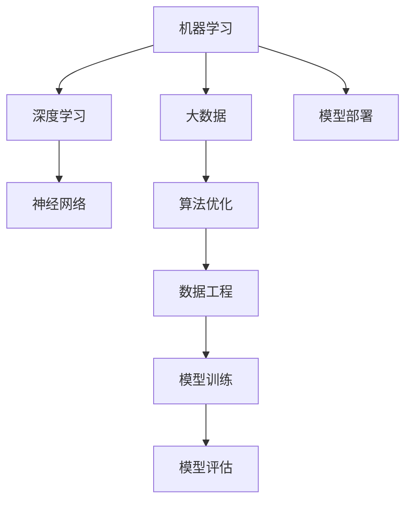
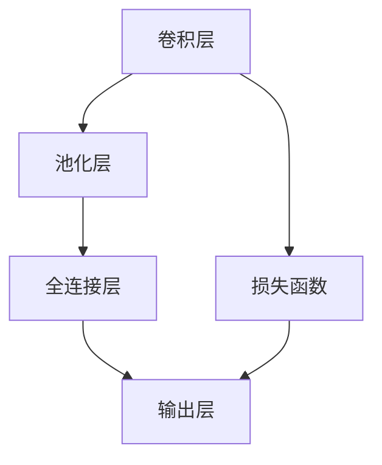

                 

# 硅谷人工智能:机器学习与大数据

> 关键词：机器学习,大数据,深度学习,神经网络,人工智能,算法优化,数据工程,数据处理,模型训练

## 1. 背景介绍

### 1.1 问题由来
随着科技的飞速发展，人工智能(AI)技术正逐渐从理论走向实践，硅谷作为全球科技创新中心，引领了这场人工智能革命。机器学习与大数据的结合，成为了人工智能发展的重要推动力。在硅谷，世界各地的科技公司、研究机构和企业正通过构建大数据平台和应用机器学习算法，不断推动人工智能技术的进步。

### 1.2 问题核心关键点
机器学习与大数据在硅谷的应用非常广泛，涉及医疗、金融、零售、制造业等多个行业。然而，这两个领域的应用不仅仅在于提升数据处理能力，更是涉及到如何高效地提取数据中的有用信息，进行智能决策与预测。以下将详细介绍这两个领域的核心关键点：

- **数据来源与处理**：硅谷有大量高质量的数据源，包括公开数据集、社交媒体数据、传感器数据等，这些数据需要经过清洗、去噪、归一化等步骤才能用于机器学习模型的训练。
- **算法与模型选择**：选择合适的算法和模型是机器学习成功的关键。在硅谷，深度学习、强化学习、迁移学习等算法被广泛应用于各个领域。
- **训练与优化**：训练过程中的参数调优、损失函数选择、正则化技术应用等对模型性能至关重要。硅谷的工程师们通过不断优化算法，提升模型准确率和泛化能力。
- **部署与集成**：机器学习模型的部署与集成，需要考虑模型解释性、计算效率、可扩展性等因素。

### 1.3 问题研究意义
研究硅谷的机器学习与大数据技术，有助于理解全球科技发展的最新趋势，借鉴硅谷的技术和经验，加速我国人工智能技术的落地应用。通过学习硅谷的研究成果，可以更好地应对数据驱动型产业的挑战，推动我国企业在全球竞争中占据有利地位。

## 2. 核心概念与联系

### 2.1 核心概念概述

要理解硅谷的机器学习与大数据，首先需要掌握一些核心概念：

- **机器学习**：通过让计算机从数据中学习规律，从而实现自动决策和预测的过程。
- **大数据**：指规模巨大、复杂、多样化的数据集，利用分布式计算和数据挖掘技术进行分析和处理。
- **深度学习**：一种机器学习技术，使用多层神经网络对数据进行层次化表示与分析。
- **神经网络**：由大量节点（神经元）组成的网络结构，用于模拟人脑神经网络的工作原理。
- **算法优化**：通过优化算法，提升模型训练效率，减少计算资源的消耗。
- **数据工程**：指数据收集、存储、处理、清洗等一系列技术手段，确保数据的质量和可用性。

这些核心概念之间通过以下Mermaid流程图进行联系：



这个流程图展示了大数据、机器学习、深度学习和神经网络之间的逻辑关系：

1. 大数据提供大量的数据来源。
2. 机器学习通过大数据进行模型训练。
3. 深度学习和神经网络用于处理复杂的数据结构。
4. 算法优化和数据工程保障数据和模型的质量。
5. 模型训练和评估后，进行部署和集成，应用于实际场景。

## 3. 核心算法原理 & 具体操作步骤
### 3.1 算法原理概述

硅谷的机器学习算法主要基于深度学习。深度学习模型通常包含多个层次的神经网络，每个层次负责提取不同层次的特征。该算法通过反向传播算法优化模型参数，最小化预测值与真实值之间的差距，从而实现准确预测。

大数据在机器学习中的应用主要体现在以下几个方面：

- **数据规模**：大数据提供了足够的数据量，使得模型能够从大量数据中学习泛化能力。
- **数据多样性**：大数据集包含多种类型的数据，有助于模型学习多维度特征。
- **分布式计算**：大数据处理通常采用分布式计算，提高处理速度和效率。

### 3.2 算法步骤详解

机器学习与大数据的实践主要包括以下几个步骤：

1. **数据收集与处理**：
   - 从不同数据源收集数据。
   - 对数据进行清洗、去重、归一化等预处理。
   - 将数据划分为训练集、验证集和测试集。

2. **模型选择与设计**：
   - 根据任务需求选择适合的模型架构，如卷积神经网络(CNN)、循环神经网络(RNN)、长短时记忆网络(LSTM)等。
   - 定义损失函数和优化器。
   - 进行超参数调优。

3. **模型训练与评估**：
   - 使用训练集进行模型训练。
   - 使用验证集进行模型调优。
   - 使用测试集进行模型评估。

4. **模型部署与集成**：
   - 将模型部署到生产环境。
   - 集成到应用系统中。
   - 进行持续监控和优化。

### 3.3 算法优缺点

机器学习与大数据的算法具有以下优点：

- **高效性**：大数据提供大量数据支持，使模型能够学习泛化能力，提高预测准确率。
- **可扩展性**：分布式计算技术使得数据处理和模型训练具有高可扩展性。
- **泛化能力**：大数据的多样性使得模型能够学习到更全面的特征，提升泛化能力。

同时，算法也存在以下缺点：

- **数据依赖性**：模型性能依赖于数据质量，高质量数据获取成本高。
- **计算资源消耗大**：大数据处理和深度学习模型训练需要大量的计算资源。
- **模型复杂性**：深度学习模型结构复杂，难以解释和调试。

### 3.4 算法应用领域

机器学习与大数据技术在硅谷的多个领域中得到了广泛应用，例如：

- **医疗**：利用大数据分析患者医疗记录，进行疾病预测和诊断。
- **金融**：通过大数据分析市场数据，进行风险评估和投资决策。
- **零售**：通过大数据分析用户行为，进行个性化推荐和销售预测。
- **制造业**：利用大数据分析生产线数据，进行故障预测和优化生产。
- **交通运输**：通过大数据分析交通流量，进行智能交通管理和优化。

## 4. 数学模型和公式 & 详细讲解 & 举例说明

### 4.1 数学模型构建

以一个简单的线性回归问题为例，机器学习模型可以表示为：

$$
y = \theta_0 + \theta_1 x_1 + \theta_2 x_2 + \cdots + \theta_n x_n
$$

其中，$y$ 为预测值，$x_i$ 为特征向量，$\theta_i$ 为模型参数。

假设我们有 $N$ 个样本 $(x_{1,i}, x_{2,i}, \cdots, x_{n,i}, y_i)$，训练集表示为：

$$
\mathcal{D} = \{(x_{1,i}, x_{2,i}, \cdots, x_{n,i}, y_i)\}_{i=1}^N
$$

### 4.2 公式推导过程

线性回归模型的损失函数为：

$$
\mathcal{L}(\theta) = \frac{1}{2N} \sum_{i=1}^N (y_i - \theta_0 - \theta_1 x_{1,i} - \theta_2 x_{2,i} - \cdots - \theta_n x_{n,i})^2
$$

其中，$N$ 为样本数，$(\theta_0, \theta_1, \theta_2, \cdots, \theta_n)$ 为模型参数，$y_i$ 为真实值，$x_{1,i}, x_{2,i}, \cdots, x_{n,i}$ 为特征向量。

对损失函数求导，得到参数更新规则：

$$
\theta_i = \theta_i - \eta \frac{\partial \mathcal{L}(\theta)}{\partial \theta_i}
$$

其中，$\eta$ 为学习率。

### 4.3 案例分析与讲解

以图像识别为例，可以使用卷积神经网络(CNN)进行分类。CNN通过卷积层、池化层、全连接层等结构提取特征并进行分类。在训练过程中，通过反向传播算法最小化损失函数，不断调整模型参数。训练过程如图：



## 5. 项目实践：代码实例和详细解释说明

### 5.1 开发环境搭建

在硅谷，常用的机器学习与大数据开发环境包括：

- **Jupyter Notebook**：用于交互式编程和数据分析。
- **Python**：硅谷开发主流语言，提供了丰富的机器学习和数据科学库。
- **TensorFlow**：谷歌开源的深度学习框架，支持分布式计算。
- **PyTorch**：Facebook开源的深度学习框架，易于使用和调试。
- **Scikit-learn**：Python的数据科学库，提供了多种机器学习算法。

### 5.2 源代码详细实现

以下是一个简单的线性回归代码实现，使用Python和Scikit-learn库：

```python
import numpy as np
from sklearn.linear_model import LinearRegression

# 创建训练数据
X = np.array([[1, 2], [2, 3], [3, 4], [4, 5]])
y = np.array([3, 5, 7, 9])

# 创建模型并训练
model = LinearRegression()
model.fit(X, y)

# 预测新数据
X_new = np.array([[5, 6], [6, 7]])
y_new = model.predict(X_new)

print(y_new)
```

### 5.3 代码解读与分析

上述代码中，我们首先创建了一个训练数据集，包含两个特征和一个标签。然后，使用Scikit-learn库中的LinearRegression模型进行训练，并预测新的数据。预测结果表示为新的标签。

## 6. 实际应用场景

### 6.1 智能医疗

在硅谷，人工智能被广泛应用于医疗领域，通过大数据分析和机器学习算法，提升医疗服务的质量和效率。例如，利用医疗影像数据进行疾病诊断、利用患者数据进行健康管理、利用基因数据进行个性化治疗等。

### 6.2 智能金融

金融行业是大数据和机器学习的重要应用领域之一。硅谷的金融机构利用大数据分析市场数据，进行风险评估和投资决策，提高资本市场的稳定性和效率。

### 6.3 智能制造

通过大数据分析和机器学习算法，硅谷的制造企业可以进行生产流程优化、设备故障预测、供应链管理等，提高生产效率和降低成本。

## 7. 工具和资源推荐

### 7.1 学习资源推荐

1. **《机器学习》（周志华）**：全面介绍机器学习算法和应用，是硅谷数据科学家的必读书籍。
2. **《深度学习》（Ian Goodfellow、Yoshua Bengio、Aaron Courville）**：系统讲解深度学习算法和模型，是硅谷深度学习从业者的必备资源。
3. **Coursera、edX等在线课程**：提供大量的数据科学和机器学习课程，涵盖从入门到高级的各种内容。
4. **Kaggle**：全球最大的数据科学竞赛平台，提供丰富的数据集和竞赛题目，提升实践能力。

### 7.2 开发工具推荐

1. **TensorFlow**：谷歌开源的深度学习框架，支持分布式计算，适用于大规模模型训练。
2. **PyTorch**：Facebook开源的深度学习框架，易于使用和调试，适用于快速原型开发。
3. **Jupyter Notebook**：交互式编程和数据分析工具，方便开发者进行模型调试和可视化。
4. **Python**：硅谷数据科学的主流语言，提供了丰富的第三方库和工具。

### 7.3 相关论文推荐

1. **《深度学习》（Ian Goodfellow、Yoshua Bengio、Aaron Courville）**：全面介绍深度学习算法和模型，是硅谷深度学习从业者的必备资源。
2. **《机器学习实战》（Peter Harrington）**：通过实例讲解机器学习算法，适合初学者入门。
3. **《斯坦福大学机器学习课程》（Andrew Ng）**：由斯坦福大学教授Andrew Ng讲授的机器学习课程，内容全面，适合进阶学习。

## 8. 总结：未来发展趋势与挑战

### 8.1 总结

本文系统介绍了硅谷的机器学习与大数据技术，通过理论介绍和实践案例，展示了该技术在多个领域的应用价值。硅谷的机器学习与大数据技术通过大规模数据和深度学习算法的结合，提升了各行业的数据处理能力和智能决策能力，推动了科技和经济的进步。

### 8.2 未来发展趋势

未来，机器学习与大数据技术将呈现以下发展趋势：

1. **自动化和智能化**：更多的自动化工具和智能化算法将推动机器学习的应用普及。
2. **跨领域融合**：更多的跨领域数据融合和算法结合，提升数据的利用率和模型的泛化能力。
3. **边缘计算**：将数据处理和模型训练下沉到边缘设备，提高处理效率和数据隐私性。
4. **联邦学习**：通过分布式计算和数据隐私保护技术，提升模型训练的效率和安全性。
5. **量子计算**：量子计算技术的应用，将进一步提升数据处理和模型训练的速度。

### 8.3 面临的挑战

机器学习与大数据技术在发展过程中仍面临一些挑战：

1. **数据隐私和安全**：大数据处理和机器学习模型训练需要处理大量的个人数据，数据隐私和安全问题亟待解决。
2. **算法透明性**：许多机器学习模型被视为"黑盒"，难以解释和调试。
3. **计算资源消耗**：大规模数据和深度学习模型的计算资源消耗较大，需要进一步优化。
4. **跨领域融合**：跨领域数据融合和算法结合存在挑战，需要更多的标准化和协同工作。
5. **伦理和道德问题**：机器学习模型的应用可能带来伦理和道德问题，需要进行规范和约束。

### 8.4 研究展望

未来，机器学习与大数据技术需要在以下方面进行深入研究：

1. **数据隐私和安全**：开发新的数据隐私保护技术和算法，确保数据安全和隐私。
2. **算法透明性**：提升算法的透明性和可解释性，增强模型解释性。
3. **计算效率**：优化算法和计算资源，提高模型训练和推理效率。
4. **跨领域融合**：促进跨领域数据融合和算法结合，提升数据的利用率和模型的泛化能力。
5. **伦理和道德问题**：建立伦理和道德规范，确保机器学习模型的应用符合社会价值观和伦理标准。

## 9. 附录：常见问题与解答

**Q1：机器学习和深度学习有什么区别？**

A: 机器学习是让计算机从数据中学习规律，从而实现自动决策和预测的过程。深度学习是机器学习的一种，通过多层神经网络对数据进行层次化表示与分析，具有更强的非线性建模能力。

**Q2：如何处理大数据中的噪声数据？**

A: 数据清洗和去噪是大数据处理的重要步骤。通过统计分析、过滤重复数据、填补缺失值等方法，可以降低噪声对模型性能的影响。

**Q3：模型训练中的过拟合问题如何解决？**

A: 过拟合问题可以通过正则化技术、Dropout等方法解决。增加数据量、使用交叉验证等方法也可以有效降低过拟合风险。

**Q4：如何选择机器学习算法？**

A: 选择算法需要考虑任务类型、数据规模、模型复杂度等因素。常用的算法包括线性回归、决策树、支持向量机、神经网络等，需要根据具体问题进行选择。

**Q5：机器学习模型的解释性如何提升？**

A: 提升模型解释性需要引入可解释性算法和工具，如LIME、SHAP等。同时，可视化工具如TensorBoard可以帮助理解模型的内部工作机制。

---

作者：禅与计算机程序设计艺术 / Zen and the Art of Computer Programming

