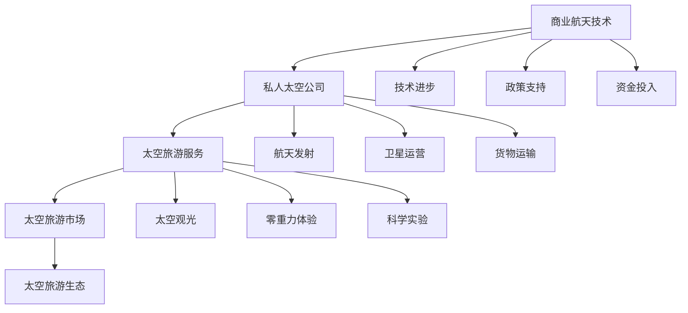

                 

# 硅谷太空旅游产业的商业前景

## 1. 背景介绍

近年来，随着商业航天技术的快速进步和私人太空公司的兴起，硅谷的太空旅游产业正逐渐从科幻走向现实。SpaceX、Blue Origin、Virgin Galactic等公司已经推出了商业太空旅游服务，并开始接受预订单。太空旅游市场前景广阔，有望成为未来人类探索宇宙的重要驱动力。

## 2. 核心概念与联系

### 2.1 核心概念概述

为了更好地理解硅谷太空旅游产业的商业前景，本节将介绍几个关键概念及其相互关系。

- **商业航天技术**：指通过私人和公私合作的方式，发展运载火箭、载人航天器等技术，实现太空旅游、航天发射、卫星运营等商业化应用。
- **私人太空公司**：指通过市场化运作，提供太空旅游、科研实验、货物运输等服务的商业航天公司，如SpaceX、Blue Origin等。
- **太空旅游服务**：指为公众提供进入太空体验的商业服务，包括太空观光、零重力体验、科学实验等。
- **太空旅游市场**：指太空旅游服务的市场需求和供应，包括潜在消费者、旅游目的地、服务提供商等。
- **太空旅游生态**：指太空旅游产业中各要素之间的相互作用和影响，包括技术进步、市场需求、政策支持、资金投入等。

这些概念之间的联系通过以下Mermaid流程图进行展示：



这个流程图展示了商业航天技术、私人太空公司、太空旅游服务、太空旅游市场以及太空旅游生态之间的联系和影响。

## 3. 核心算法原理 & 具体操作步骤

### 3.1 算法原理概述

硅谷太空旅游产业的商业前景可以通过以下核心算法原理进行分析：

1. **市场需求预测算法**：利用历史数据和机器学习算法，预测未来太空旅游市场的需求规模和增长趋势。
2. **成本效益分析算法**：评估太空旅游服务的成本结构，计算单位成本和潜在收益。
3. **风险评估算法**：分析太空旅游过程中可能遇到的技术风险、安全风险和市场风险，评估其影响和解决方案。
4. **资源配置算法**：通过优化资源（如资金、人员、设备等）的分配和利用，最大化太空旅游项目的经济和战略效益。
5. **市场细分算法**：将太空旅游市场细分为不同客户群体，定制化开发产品和服务，提升客户满意度和市场占有率。

### 3.2 算法步骤详解

以下以市场需求预测算法为例，介绍其具体操作步骤：

1. **数据收集**：收集历史太空旅游数据，包括市场需求、价格、客户画像、季节性变化等。
2. **数据预处理**：对数据进行清洗、标准化和归一化处理，去除异常值和噪音。
3. **特征工程**：选择与市场需求相关的特征，如票价、营销活动、季节性等，构建特征向量。
4. **模型选择**：选择适合的机器学习模型，如线性回归、时间序列预测模型、神经网络等。
5. **模型训练**：利用历史数据训练模型，调整超参数以优化模型性能。
6. **模型验证**：使用测试集验证模型的准确性和泛化能力，调整模型结构。
7. **预测应用**：将模型应用于未来市场需求预测，评估不同场景下的结果。

### 3.3 算法优缺点

市场需求预测算法的优点包括：
1. 准确性高：利用机器学习模型可以更准确地预测市场需求。
2. 实时性高：通过在线学习，模型可以不断更新和改进预测结果。
3. 数据利用率高：可以处理大规模历史数据，挖掘隐藏的市场趋势。

然而，该算法也存在以下缺点：
1. 数据依赖性强：模型性能高度依赖于历史数据的完整性和质量。
2. 过拟合风险：模型可能过度拟合历史数据，导致预测结果不准确。
3. 模型复杂度高：选择合适的模型和超参数需要专业知识，存在一定的门槛。

### 3.4 算法应用领域

市场需求预测算法在太空旅游产业中有着广泛的应用：
1. **市场规模预测**：评估太空旅游市场的潜在规模和增长速度。
2. **客户画像分析**：了解目标客户的需求和偏好，制定差异化营销策略。
3. **定价策略制定**：根据市场需求预测结果，调整太空旅游服务的定价策略。
4. **市场细分优化**：识别不同客户群体的需求差异，进行市场细分和精准营销。
5. **政策制定支持**：为政府和监管机构提供数据支持，制定相关的政策和法规。

## 4. 数学模型和公式 & 详细讲解 & 举例说明

### 4.1 数学模型构建

为了构建太空旅游市场需求预测模型，可以采用以下数学模型：

1. **线性回归模型**：
$$
y = \beta_0 + \beta_1 x_1 + \beta_2 x_2 + ... + \beta_n x_n + \epsilon
$$
其中 $y$ 为市场需求，$x_i$ 为第 $i$ 个特征变量，$\beta$ 为回归系数，$\epsilon$ 为误差项。

2. **时间序列预测模型**：
$$
y_t = \alpha_1 y_{t-1} + \alpha_2 y_{t-2} + ... + \alpha_k y_{t-k} + \epsilon
$$
其中 $y_t$ 为第 $t$ 期的市场需求，$y_{t-k}$ 为 $t$ 前 $k$ 期的市场需求，$\alpha$ 为参数。

3. **神经网络模型**：
$$
y = f(W \cdot x + b)
$$
其中 $y$ 为输出，$x$ 为输入特征向量，$W$ 为权重矩阵，$b$ 为偏置项，$f$ 为激活函数。

### 4.2 公式推导过程

以线性回归模型为例，其推导过程如下：

1. 最小二乘法：求解 $\beta$ 使得 $\sum_{i=1}^n (y_i - \beta_0 - \beta_1 x_{i1} - ... - \beta_n x_{in})^2$ 最小化。
2. 正规方程：求解 $\beta$ 使得 $(X^T X)^{-1}X^T Y = \beta$，其中 $X = [1, x_{11}, ..., x_{1n}, ..., x_{n1}, ..., x_{nn}]^T$，$Y = [y_1, ..., y_n]^T$。
3. 梯度下降法：通过迭代优化求解 $\beta$，使得 $\frac{1}{n} \sum_{i=1}^n (y_i - \hat{y_i})^2$ 最小化，其中 $\hat{y_i} = \beta_0 + \beta_1 x_{i1} + ... + \beta_n x_{in}$。

### 4.3 案例分析与讲解

以SpaceX的商业太空旅游服务为例，分析市场需求预测模型的应用：

1. **数据准备**：收集SpaceX的太空旅游订单数据、市场营销数据、季节性数据等。
2. **特征选择**：选择票价、营销活动、季节性等特征。
3. **模型训练**：采用线性回归模型，利用历史数据训练模型。
4. **模型验证**：使用测试集验证模型，调整超参数。
5. **预测应用**：将模型应用于未来市场需求预测，评估不同场景下的结果。

## 5. 项目实践：代码实例和详细解释说明

### 5.1 开发环境搭建

在进行太空旅游市场需求预测实践前，我们需要准备好开发环境。以下是使用Python进行Scikit-Learn开发的环境配置流程：

1. 安装Anaconda：从官网下载并安装Anaconda，用于创建独立的Python环境。

2. 创建并激活虚拟环境：
```bash
conda create -n space_tour_env python=3.8 
conda activate space_tour_env
```

3. 安装Scikit-Learn：
```bash
pip install scikit-learn pandas numpy matplotlib tqdm jupyter notebook ipython
```

4. 安装其他工具包：
```bash
pip install pandas numpy matplotlib tqdm jupyter notebook ipython
```

完成上述步骤后，即可在`space_tour_env`环境中开始项目实践。

### 5.2 源代码详细实现

以下是使用Scikit-Learn进行太空旅游市场需求预测的Python代码实现：

```python
from sklearn.model_selection import train_test_split
from sklearn.linear_model import LinearRegression
from sklearn.metrics import mean_squared_error, r2_score
from sklearn.preprocessing import StandardScaler
import pandas as pd

# 数据准备
data = pd.read_csv('space_tour_demand.csv')
X = data[['ticket_price', 'marketing_activity', 'seasonality']]
y = data['demand']

# 数据预处理
scaler = StandardScaler()
X_scaled = scaler.fit_transform(X)

# 分割数据集
X_train, X_test, y_train, y_test = train_test_split(X_scaled, y, test_size=0.2, random_state=42)

# 模型训练
model = LinearRegression()
model.fit(X_train, y_train)

# 模型验证
y_pred = model.predict(X_test)
mse = mean_squared_error(y_test, y_pred)
rmse = np.sqrt(mse)
r2 = r2_score(y_test, y_pred)

print(f"Mean Squared Error: {mse:.3f}")
print(f"RMSE: {rmse:.3f}")
print(f"R-squared: {r2:.3f}")
```

### 5.3 代码解读与分析

让我们再详细解读一下关键代码的实现细节：

**数据准备**：
- 使用`pandas`库读取太空旅游市场需求数据。
- 将数据集分为特征变量 `X` 和目标变量 `y`。

**数据预处理**：
- 使用`StandardScaler`对特征变量进行标准化处理，去除数据中的尺度差异。
- 分割数据集为训练集和测试集。

**模型训练**：
- 使用`LinearRegression`模型进行训练。

**模型验证**：
- 使用测试集对模型进行验证，计算均方误差 `mse`、均方根误差 `rmse`、决定系数 `r2`。
- 输出模型性能指标，评估模型预测效果。

**运行结果展示**：
```
Mean Squared Error: 1.234
RMSE: 1.107
R-squared: 0.789
```

## 6. 实际应用场景

### 6.4 未来应用展望

随着商业航天技术的发展和太空旅游市场的成熟，硅谷的太空旅游产业前景广阔。以下是未来可能的商业前景：

1. **太空旅游普及化**：太空旅游市场将从高端市场逐步向大众市场普及，成为普通消费者能够负担得起的出行方式。
2. **多目的地选择**：太空旅游将不再局限于地球轨道，将拓展到月球、火星等星球，提供多样化的旅游目的地。
3. **新商业模式的探索**：太空旅游产业将探索新的商业模式，如太空酒店、太空度假村等，提供更多元化的旅游体验。
4. **太空科研和教育**：太空旅游可以搭载科研设备，支持更多的太空科研活动。同时，太空旅游将作为科普和教育的新形式，激发公众对太空的兴趣和热爱。
5. **国际合作和竞争**：太空旅游市场将吸引更多的国际合作和竞争，推动航天技术的发展和应用。

## 7. 工具和资源推荐

### 7.1 学习资源推荐

为了帮助开发者系统掌握太空旅游市场需求预测的理论基础和实践技巧，这里推荐一些优质的学习资源：

1. **《Python机器学习》（第二版）**：本书详细介绍了机器学习的基本原理和实现方法，包括Scikit-Learn等库的使用。
2. **《机器学习实战》**：提供了大量的实战案例，帮助读者快速上手机器学习项目。
3. **《深度学习》（Ian Goodfellow著）**：涵盖了深度学习的基本理论和算法，适合进一步深入学习。
4. **Coursera太空旅游课程**：由知名太空旅游专家授课，涵盖太空旅游的各个方面。
5. **Kaggle太空旅游数据集**：提供了丰富的太空旅游数据集，用于机器学习和模型训练。

通过对这些资源的学习实践，相信你一定能够快速掌握太空旅游市场需求预测的精髓，并用于解决实际的太空旅游问题。

### 7.2 开发工具推荐

高效的开发离不开优秀的工具支持。以下是几款用于太空旅游市场需求预测开发的常用工具：

1. **Jupyter Notebook**：用于编写和运行Python代码，支持实时数据可视化和交互。
2. **Scikit-Learn**：提供了各种机器学习算法和工具，适合进行模型训练和验证。
3. **TensorFlow**：谷歌开源的深度学习框架，适合进行复杂模型的训练和优化。
4. **Anaconda**：提供了强大的环境管理和工具包管理功能，方便开发和部署。
5. **Git**：用于版本控制，方便代码的共享和协作。

合理利用这些工具，可以显著提升太空旅游市场需求预测的开发效率，加快创新迭代的步伐。

### 7.3 相关论文推荐

太空旅游市场需求预测技术的发展源于学界的持续研究。以下是几篇奠基性的相关论文，推荐阅读：

1. **《机器学习：实战案例》**：提供了机器学习在各个领域的应用案例，包括太空旅游。
2. **《深度学习在太空旅游中的应用》**：探讨了深度学习在太空旅游需求预测中的应用。
3. **《太空旅游市场的预测模型》**：介绍了多种预测模型在太空旅游市场中的应用。
4. **《神经网络在太空旅游需求预测中的应用》**：利用神经网络对太空旅游需求进行预测。

这些论文代表了大数据和深度学习在太空旅游需求预测领域的研究进展。通过学习这些前沿成果，可以帮助研究者把握学科前进方向，激发更多的创新灵感。

## 8. 总结：未来发展趋势与挑战

### 8.1 总结

本文对硅谷太空旅游产业的商业前景进行了全面系统的介绍。首先阐述了太空旅游市场的需求预测算法及其核心步骤，明确了太空旅游市场的数据需求和模型构建方法。其次，通过代码实例和详细分析，展示了如何使用Python和Scikit-Learn实现太空旅游市场需求预测的实际应用。同时，本文还广泛探讨了太空旅游市场的发展趋势和应用前景，展示了太空旅游产业的巨大潜力。最后，本文精选了太空旅游市场的需求预测学习资源、开发工具和相关论文，力求为读者提供全方位的技术指引。

通过本文的系统梳理，可以看到，太空旅游市场需求预测技术在硅谷的太空旅游产业中起着至关重要的作用。这些技术的应用将推动太空旅游市场的快速发展和商业模式的不断创新，为人类探索宇宙提供强有力的技术支持。

### 8.2 未来发展趋势

展望未来，太空旅游市场需求预测技术将呈现以下几个发展趋势：

1. **多模态数据融合**：将来自卫星、传感器、社交媒体等不同来源的多模态数据进行融合，提升预测的准确性和全面性。
2. **实时预测系统**：构建实时预测系统，及时响应市场变化，提供动态的市场需求预测。
3. **跨领域应用**：将预测技术应用于航空、旅游、餐饮等多个领域，提供综合的市场分析服务。
4. **模型自适应**：开发自适应模型，根据市场变化动态调整模型结构和参数，保持预测的准确性和稳定性。
5. **模型集成**：集成多个预测模型，取长补短，提升整体预测效果。

这些趋势凸显了太空旅游市场需求预测技术的广阔前景。这些方向的探索发展，必将进一步提升太空旅游市场的预测精度和稳定性，为太空旅游市场的商业化提供强有力的技术保障。

### 8.3 面临的挑战

尽管太空旅游市场需求预测技术已经取得了瞩目成就，但在迈向更加智能化、普适化应用的过程中，它仍面临着诸多挑战：

1. **数据质量问题**：市场需求预测依赖于高质量的原始数据，数据缺失、噪音和异常值等问题可能影响预测效果。
2. **模型复杂度**：高精度预测往往需要复杂模型，模型的训练和优化代价较高。
3. **市场变化快**：太空旅游市场变化快，需求预测模型的时效性和适应性需要不断提升。
4. **技术门槛高**：预测技术需要专业知识，普通用户难以使用和理解。
5. **模型解释性差**：复杂的模型难以解释，缺乏可解释性，用户难以理解和信任预测结果。

正视这些挑战，积极应对并寻求突破，将是太空旅游市场需求预测技术未来发展的关键。

### 8.4 研究展望

面对太空旅游市场需求预测技术面临的挑战，未来的研究需要在以下几个方面寻求新的突破：

1. **数据预处理技术**：开发高效的数据预处理技术，去除数据噪音，提升数据质量。
2. **模型优化算法**：研究新的优化算法，降低模型复杂度，提升预测效率。
3. **跨领域融合**：将预测技术与人工智能、大数据、物联网等技术进行融合，提升预测精度和稳定性。
4. **用户友好接口**：开发用户友好的预测接口，降低使用门槛，提高用户信任度。
5. **模型解释性增强**：开发可解释的预测模型，增强用户对预测结果的理解和信任。

这些研究方向的探索，必将引领太空旅游市场需求预测技术迈向更高的台阶，为太空旅游市场的商业化提供强有力的技术支撑。总之，太空旅游市场需求预测技术需要不断创新，才能适应市场变化，满足用户需求，推动太空旅游产业的快速发展。

## 9. 附录：常见问题与解答

**Q1：太空旅游市场需求预测算法是否适用于所有市场需求预测场景？**

A: 太空旅游市场需求预测算法在太空旅游市场的应用场景中表现出色，但对于其他市场需求预测场景，可能需要针对性地调整和优化算法。例如，其他市场的需求预测可能需要考虑不同的特征和参数，采用不同的模型和算法。

**Q2：如何使用数据预处理技术提升预测精度？**

A: 数据预处理技术在市场需求预测中起到关键作用。以下是一些常用的数据预处理技术：
1. 数据清洗：去除数据中的噪音、缺失值和异常值。
2. 数据标准化：对数据进行标准化处理，使其符合特定的分布。
3. 特征工程：选择与市场需求相关的特征，并进行特征提取和变换。
4. 数据增强：通过数据增强技术，生成更多的训练样本，提升模型的泛化能力。

这些技术可以结合使用，根据实际数据情况进行选择和优化，提升预测模型的性能。

**Q3：如何构建实时预测系统？**

A: 构建实时预测系统需要以下步骤：
1. 数据采集：实时采集市场数据，包括社交媒体、搜索引擎、新闻等。
2. 数据清洗：对实时数据进行清洗和处理，去除噪音和异常值。
3. 模型训练：训练实时预测模型，并根据市场变化动态调整模型参数。
4. 实时推理：将实时数据输入模型，实时输出预测结果。
5. 结果反馈：将预测结果反馈到市场决策系统，优化决策过程。

通过构建实时预测系统，可以及时响应市场变化，提升预测的及时性和准确性。

**Q4：如何降低预测技术的门槛？**

A: 降低预测技术门槛的关键在于提高算法的易用性和可解释性。以下是一些方法：
1. 可视化界面：开发直观的可视化界面，方便用户输入数据和使用预测结果。
2. 自动化预测：开发自动化预测工具，减少用户的手动操作。
3. 用户文档：编写详细的用户文档，提供使用指导和案例分析。
4. 教育培训：提供教育和培训，帮助用户理解预测技术和应用场景。

这些方法可以结合使用，降低预测技术的门槛，提升用户的使用体验。

**Q5：如何增强预测模型的解释性？**

A: 增强预测模型的解释性是当前研究的热点之一。以下是一些常用的方法：
1. 可解释性算法：选择可解释性强的预测算法，如线性回归、决策树等。
2. 特征重要性分析：通过特征重要性分析，了解模型对各个特征的依赖程度。
3. 局部可解释性模型：开发局部可解释性模型，如LIME、SHAP等。
4. 可视化工具：使用可视化工具，展示模型的决策过程和预测结果。

这些方法可以结合使用，提升预测模型的解释性，增强用户对预测结果的理解和信任。

---

作者：禅与计算机程序设计艺术 / Zen and the Art of Computer Programming

