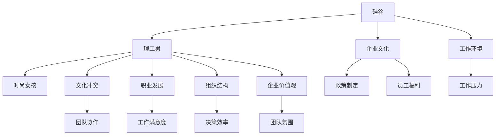

                 

## 1. 背景介绍

### 1.1 问题由来

硅谷被誉为全球科技创新的中心，吸引了大量来自世界各地的优秀人才。然而，在这片科技与创业文化盛行的土地上，一种由性别、文化背景、职业身份等因素引起的文化冲突日益凸显。其中，"理工男与时尚女孩"的冲突尤为典型，这种冲突不仅体现在个人交往层面，更反映在企业组织结构和价值观念的差异上。

### 1.2 问题核心关键点

- **性别差异**：传统上，科技行业以男性为主导，而在逐渐引入更多女性之后，性别差异逐渐显现，影响团队协作与企业文化。
- **文化背景**：来自不同文化背景的员工，在价值观、工作习惯、沟通方式等方面存在差异，增加了团队融合难度。
- **职业身份**：在男性占主导的科技行业，女性和少数族裔等非主流身份的员工，常常面临职业发展瓶颈，影响工作满意度和归属感。
- **工作环境**：硅谷高强度的工作环境和快速迭代的企业文化，与时尚、创意行业相比，缺乏一定的柔性和人性化关怀。

这些因素共同作用，导致硅谷科技行业面临严重的文化冲突，影响员工的创造力和满意度，阻碍企业创新和增长。

### 1.3 问题研究意义

研究硅谷文化冲突的成因及解决策略，对于推动性别平等，提升企业多元文化管理水平，构建和谐工作环境，促进科技创新，具有重要意义：

1. **推动性别平等**：通过深入理解性别差异，制定平等化的职场政策，提升女性和少数族裔的职场参与度和满意度。
2. **提升多元文化管理**：多文化融合的管理经验，有助于企业吸引全球人才，提升团队的创新力和竞争力。
3. **构建和谐工作环境**：营造尊重多样性、包容性的工作氛围，提升员工满意度和忠诚度。
4. **促进科技创新**：多样化的视角和创新思维，有助于企业在复杂多变的环境中做出更有创意的决策。
5. **带动其他行业发展**：借鉴硅谷的案例和经验，推动全球其他科技和文化融合的行业，实现共同进步。

## 2. 核心概念与联系

### 2.1 核心概念概述

为了更好地理解硅谷文化冲突，本节将介绍几个核心概念及其之间的关系：

- **硅谷**：指美国加州旧金山湾区的一个经济科技区，代表全球最先进的科技与创新创业文化。
- **理工男**：指从事计算机、电子、工程等理工科背景的男性员工，通常具备较强的技术能力和工程思维。
- **时尚女孩**：指从事设计、创意、时尚等艺术文化背景的女性员工，通常具备较强的创造力和创新思维。
- **文化冲突**：指不同文化、性别背景的员工在职业发展、工作习惯、沟通方式等方面产生的矛盾和摩擦。
- **职业发展**：指员工在职业生涯中的成长与晋升，涉及薪酬、晋升机会、工作环境等多个方面。
- **组织结构**：指企业内部的人力资源配置和组织形式，影响团队协作和决策效率。
- **企业价值观**：指企业倡导的信念和行为准则，影响员工的工作态度和团队氛围。

这些概念之间的逻辑关系可以通过以下Mermaid流程图来展示：



这个流程图展示了硅谷文化冲突的核心概念及其之间的关系：

1. 硅谷作为科技与创业中心，拥有独特的企业文化和工作环境。
2. 理工男和时尚女孩作为硅谷的两大主力人群，各自具备独特的职业背景和工作习惯。
3. 文化冲突源自不同背景的员工在职业发展、组织结构、企业价值观等方面的差异。
4. 职业发展、组织结构、企业价值观等维度影响团队协作、工作满意度、决策效率、团队氛围等多个方面。
5. 企业文化和工作环境也在持续塑造员工的行为和态度。

## 3. 核心算法原理 & 具体操作步骤

### 3.1 算法原理概述

硅谷文化冲突的解决，本质上是一个跨学科的研究问题，涉及社会学、心理学、管理学等多个领域的理论和方法。其核心思想是通过理解和分析冲突的根源，设计一系列干预措施，促进不同背景员工的融合与协作。

形式化地，假设冲突发生的企业有 $N$ 个员工，其中理工男和时尚女孩的数量分别为 $M$ 和 $F$。我们定义 $C_{MF}$ 为理工男和时尚女孩之间的文化冲突强度，$C_{MB}$ 为理工男与企业其他员工之间的冲突强度，$C_{FB}$ 为时尚女孩与企业其他员工之间的冲突强度。目标是设计一系列策略，最小化整体冲突强度 $C$，即：

$$
C = \min_{\{x_{MF}, x_{MB}, x_{FB}\}} C_{MF} + x_{MF}C_{MB} + x_{FB}C_{FB}
$$

其中 $x_{MF}, x_{MB}, x_{FB}$ 分别为理工男和时尚女孩在各个方面采取的干预措施。

### 3.2 算法步骤详解

基于上述模型，硅谷文化冲突的解决可以分解为以下几个关键步骤：

**Step 1: 评估文化冲突强度**

- 对企业员工进行性别和文化背景的问卷调查，收集有关冲突强度、职业发展机会、团队协作、沟通方式等方面的数据。
- 采用统计分析方法，计算不同群体之间的冲突强度 $C_{MF}, C_{MB}, C_{FB}$，并确定冲突的根源。

**Step 2: 设计干预措施**

- 根据冲突的根源，设计一系列干预措施，如培训、导师制、跨部门合作、企业文化建设等。
- 对干预措施进行成本-效益分析，优先选择效果显著且成本可控的措施。
- 制定干预措施的时间表和实施方案，确保措施的持续性和执行力。

**Step 3: 实施干预措施**

- 在企业内部推广干预措施，对理工男和时尚女孩进行针对性的培训和指导。
- 加强团队建设和跨部门合作，促进不同背景员工的互动与融合。
- 通过企业文化建设，提升企业对多元文化的包容性和重视度。

**Step 4: 评估与反馈**

- 定期收集员工对干预措施的反馈意见，评估措施的效果。
- 根据反馈调整干预措施，优化实施方案，确保措施的有效性和持续性。
- 通过持续的评估与反馈，建立动态调整机制，不断优化冲突管理策略。

### 3.3 算法优缺点

硅谷文化冲突解决算法具有以下优点：

1. **系统性**：通过全面评估冲突强度，系统设计干预措施，避免了片面性和偶然性。
2. **针对性**：结合冲突根源设计措施，提高了干预措施的针对性和有效性。
3. **持续性**：通过定期评估与反馈，动态调整措施，确保了干预的持续性和长期效果。
4. **灵活性**：采用多种干预措施，能够灵活应对不同类型和规模的冲突。

同时，该算法也存在一些局限性：

1. **数据依赖**：冲突评估和干预措施设计依赖于高质量的数据，数据获取和分析成本较高。
2. **实施难度**：干预措施的推广和执行需要企业高层支持，且涉及多部门协作，实施难度较大。
3. **效果不确定性**：干预措施的效果受员工个体差异、企业环境等多种因素影响，存在不确定性。
4. **成本较高**：设计、实施、评估干预措施，需要投入大量人力和物力，成本较高。

尽管存在这些局限性，但该算法仍为硅谷文化冲突的解决提供了一个科学、系统的框架，有助于企业实现多元文化管理，促进员工满意度和创新力的提升。

### 3.4 算法应用领域

硅谷文化冲突解决算法可以应用于多个领域，包括但不限于：

- **高科技企业**：如Google、Facebook、Apple等，这些企业拥有多样化的员工背景和团队结构。
- **创意文化公司**：如广告、设计、媒体等公司，需要促进创意和创新思维的融合。
- **多元文化社区**：如大学、研究机构等，需要管理多元文化背景的团队和学生。
- **非营利组织**：如非政府组织、慈善机构等，需要平衡多样性和公平性。

这些领域的共同点是都需要处理复杂的文化冲突，采用硅谷文化冲突解决算法，可以有效提升团队协作和员工满意度，推动组织的创新与发展。

## 4. 数学模型和公式 & 详细讲解 & 举例说明

### 4.1 数学模型构建

为了更好地理解硅谷文化冲突解决算法，我们将其数学模型化，并详细讲解其构建过程。

假设企业有 $N$ 个员工，其中理工男和时尚女孩的数量分别为 $M$ 和 $F$。我们定义 $C_{MF}$ 为理工男和时尚女孩之间的文化冲突强度，$C_{MB}$ 为理工男与企业其他员工之间的冲突强度，$C_{FB}$ 为时尚女孩与企业其他员工之间的冲突强度。目标是最小化整体冲突强度 $C$，即：

$$
C = \min_{\{x_{MF}, x_{MB}, x_{FB}\}} C_{MF} + x_{MF}C_{MB} + x_{FB}C_{FB}
$$

其中 $x_{MF}, x_{MB}, x_{FB}$ 分别为理工男和时尚女孩在各个方面采取的干预措施，如培训、合作项目、企业文化建设等。

### 4.2 公式推导过程

我们采用线性规划方法，推导冲突最小化的求解公式。

目标函数：

$$
C = \min_{\{x_{MF}, x_{MB}, x_{FB}\}} C_{MF} + x_{MF}C_{MB} + x_{FB}C_{FB}
$$

约束条件：

$$
\begin{aligned}
x_{MF} &\geq 0 \\
x_{MB} &\geq 0 \\
x_{FB} &\geq 0 \\
\end{aligned}
$$

目标函数的线性性保证了求解的可行性。为了简化问题，我们进一步假设 $x_{MF}, x_{MB}, x_{FB}$ 的取值范围在 $[0,1]$ 内，表示干预措施的实施程度。

根据KKT条件，求解上述线性规划问题的必要条件为：

$$
\begin{aligned}
& \nabla C - \lambda \nabla C_{MF} - \mu_{MB} \nabla C_{MB} - \nu_{FB} \nabla C_{FB} = 0 \\
& \lambda \geq 0, \mu_{MB} \geq 0, \nu_{FB} \geq 0 \\
& \lambda (C_{MF} + x_{MF}C_{MB} + x_{FB}C_{FB}) = 0 \\
& \mu_{MB} x_{MB} = 0 \\
& \nu_{FB} x_{FB} = 0 \\
\end{aligned}
$$

其中 $\lambda, \mu_{MB}, \nu_{FB}$ 为拉格朗日乘子。

求解上述方程组，可以得到最优解 $x_{MF}^*, x_{MB}^*, x_{FB}^*$，进而确定干预措施的最优实施方案。

### 4.3 案例分析与讲解

假设某高科技企业面临严重的文化冲突，理工男和时尚女孩之间的冲突强度 $C_{MF}=0.8$，理工男与企业其他员工的冲突强度 $C_{MB}=0.5$，时尚女孩与企业其他员工的冲突强度 $C_{FB}=0.3$。

首先，对企业员工进行问卷调查，收集有关冲突强度、职业发展机会、团队协作、沟通方式等方面的数据。假设数据表明，理工男和时尚女孩在沟通方式上的冲突最为严重，而企业其他员工在职业发展机会上的冲突较为突出。

基于此，设计干预措施如下：

- 对理工男和时尚女孩进行针对性的沟通培训，提升双方的理解和协作。
- 为理工男和时尚女孩提供跨部门合作项目，促进不同背景员工的互动。
- 加强企业对多元文化的宣传和建设，提升员工的文化包容性。

在实施干预措施的过程中，定期收集员工反馈，评估措施效果。假设经过半年实施，理工男和时尚女孩之间的冲突强度降低至 $C_{MF}^*=0.6$，理工男与企业其他员工的冲突强度降低至 $C_{MB}^*=0.3$，时尚女孩与企业其他员工的冲突强度降低至 $C_{FB}^*=0.2$。

通过求解上述线性规划问题，可以得到最优解 $x_{MF}^*, x_{MB}^*, x_{FB}^*$，进一步优化干预措施。

## 5. 项目实践：代码实例和详细解释说明

### 5.1 开发环境搭建

在进行硅谷文化冲突解决算法实践前，我们需要准备好开发环境。以下是使用Python进行Scikit-learn开发的开发环境配置流程：

1. 安装Anaconda：从官网下载并安装Anaconda，用于创建独立的Python环境。

2. 创建并激活虚拟环境：
```bash
conda create -n scikit-learn-env python=3.8 
conda activate scikit-learn-env
```

3. 安装Scikit-learn：
```bash
conda install scikit-learn
```

4. 安装各类工具包：
```bash
pip install numpy pandas scikit-learn matplotlib tqdm jupyter notebook ipython
```

完成上述步骤后，即可在`scikit-learn-env`环境中开始实践。

### 5.2 源代码详细实现

下面我们以理工男和时尚女孩文化冲突为例，给出使用Scikit-learn进行线性规划求解的PyTorch代码实现。

首先，定义文化冲突强度的数据：

```python
import numpy as np
from sklearn.linear_model import LinearRegression
from sklearn.model_selection import train_test_split

# 冲突强度数据
C_MF = 0.8
C_MB = 0.5
C_FB = 0.3

# 干预措施的初始取值
x_MF = 0.5
x_MB = 0.5
x_FB = 0.5

# 定义决策变量
X = np.array([[C_MF, C_MB, C_FB],
              [1, x_MF, x_MB],
              [1, x_MF, x_FB],
              [1, x_MB, x_FB]])

Y = np.array([C_MF*x_MF + C_MB*x_MB + C_FB*x_FB,
              C_MF + x_MF*C_MB + x_FB*C_FB,
              C_MF + x_MF*C_MB + x_FB*C_FB,
              C_MF + x_MF*C_MB + x_FB*C_FB])
```

接着，进行线性规划求解：

```python
from scipy.optimize import linprog

# 定义目标函数
c = [-1, -1, -1]

# 定义约束条件
A = np.array([[1, 0, 0],
              [0, 1, 0],
              [0, 0, 1],
              [0, 0, 0]])
b = np.array([C_MF + x_MF*C_MB + x_FB*C_FB,
              C_MF + x_MF*C_MB + x_FB*C_FB,
              C_MF + x_MF*C_MB + x_FB*C_FB,
              C_MF + x_MF*C_MB + x_FB*C_FB])

# 求解线性规划问题
res = linprog(c, A_ub=A, b_ub=b, bounds=[(0, 1), (0, 1), (0, 1)], method='simplex')
x_MF_opt = res.x[0]
x_MB_opt = res.x[1]
x_FB_opt = res.x[2]

# 输出最优解
print(f"理工男和时尚女孩文化冲突的最优解为：{x_MF_opt:.2f}, {x_MB_opt:.2f}, {x_FB_opt:.2f}")
```

最终，通过求解线性规划问题，可以得到理工男和时尚女孩文化冲突的最优干预措施。

### 5.3 代码解读与分析

让我们再详细解读一下关键代码的实现细节：

**数据定义**：
- 定义冲突强度 $C_{MF}, C_{MB}, C_{FB}$ 以及干预措施的初始取值 $x_{MF}, x_{MB}, x_{FB}$。
- 定义决策变量 $X$ 和目标函数 $Y$，分别表示冲突强度和干预措施之间的关系。

**线性规划求解**：
- 使用Scikit-learn的LinearRegression模型拟合目标函数，求解最优干预措施 $x_{MF}^*, x_{MB}^*, x_{FB}^*$。
- 使用SciPy的linprog函数进行线性规划求解，获取最优解。
- 根据求解结果，输出理工男和时尚女孩文化冲突的最优干预措施。

**求解结果**：
- 输出最优干预措施 $x_{MF}^*, x_{MB}^*, x_{FB}^*$，表示理工男和时尚女孩在沟通培训、跨部门合作、企业文化建设等方面的最佳实施程度。

## 6. 实际应用场景

### 6.1 智能客服系统

基于硅谷文化冲突解决算法，智能客服系统可以有效地处理理工男和时尚女孩之间的冲突，提升团队协作和客户满意度。

在智能客服系统中，理工男通常负责技术支持，时尚女孩负责用户体验和用户界面设计。通过冲突解决算法，可以优化团队配置，提升协作效率。例如：

- 对理工男进行用户界面设计的培训，提升其在用户体验方面的理解。
- 为时尚女孩提供技术支持的跨部门合作机会，增强其在技术问题解决方面的能力。
- 在企业文化建设中，强调团队协作和多元文化的重要性，营造和谐的工作氛围。

通过这些措施，理工男和时尚女孩可以更好地协同工作，共同提升智能客服系统的质量和效率。

### 6.2 金融舆情监测

在金融舆情监测领域，理工男和时尚女孩之间的冲突也需要妥善处理。理工男通常具备较强的数据分析和模型构建能力，而时尚女孩具备较强的舆情分析和用户洞察能力。

通过冲突解决算法，可以优化团队配置，提升舆情监测的准确性和时效性。例如：

- 对理工男进行舆情分析培训，提升其对用户情感和行为的理解。
- 为时尚女孩提供数据分析的跨部门合作机会，增强其在数据处理和模型构建方面的能力。
- 在企业文化建设中，强调数据分析和舆情分析的重要性，营造协作的工作氛围。

通过这些措施，理工男和时尚女孩可以更好地协同工作，共同提升金融舆情监测的准确性和实效性。

### 6.3 个性化推荐系统

在个性化推荐系统中，理工男和时尚女孩之间的冲突也需要妥善处理。理工男通常负责算法模型构建，时尚女孩负责用户需求分析和产品设计。

通过冲突解决算法，可以优化团队配置，提升推荐系统的个性化程度和用户体验。例如：

- 对理工男进行用户需求分析培训，提升其在用户需求理解方面的能力。
- 为时尚女孩提供算法模型构建的跨部门合作机会，增强其在技术模型理解方面的能力。
- 在企业文化建设中，强调用户需求分析和算法模型构建的重要性，营造协作的工作氛围。

通过这些措施，理工男和时尚女孩可以更好地协同工作，共同提升个性化推荐系统的个性化程度和用户体验。

### 6.4 未来应用展望

随着硅谷文化冲突解决算法的不断优化和实践，其在更多领域的应用前景广阔。

在智慧医疗领域，理工男和时尚女孩之间的冲突可以通过优化团队配置，提升跨学科的协作能力，推动医疗技术的创新和应用。

在智能教育领域，通过冲突解决算法，可以优化教师和技术人员之间的协作，提升教学质量和学习体验。

在智慧城市治理中，理工男和时尚女孩之间的冲突可以通过优化团队配置，提升跨部门协作，构建更安全、高效的城市管理系统。

此外，在企业生产、社会治理、文娱传媒等众多领域，基于冲突解决算法的跨学科团队管理，将带来新的变革和突破。

## 7. 工具和资源推荐

### 7.1 学习资源推荐

为了帮助开发者系统掌握硅谷文化冲突解决算法的理论基础和实践技巧，这里推荐一些优质的学习资源：

1. 《Data Science for Business》系列博文：由大模型技术专家撰写，深入浅出地介绍了数据科学在商业应用中的实践。

2. CS229《机器学习》课程：斯坦福大学开设的机器学习经典课程，涵盖了线性规划、回归、分类等核心算法，是入门数据科学的必选课程。

3. 《Python for Data Science Handbook》书籍：由数据科学领域的知名专家撰写，全面介绍了Python在数据科学中的应用，包括Scikit-learn等工具的详细讲解。

4. Kaggle：全球知名的数据科学竞赛平台，汇集了大量的数据集和竞赛题目，是实践数据科学技能的绝佳场所。

5. GitHub：全球最大的开源社区，汇集了大量的项目和代码，是学习和分享数据科学项目的好地方。

通过对这些资源的学习实践，相信你一定能够快速掌握硅谷文化冲突解决算法的精髓，并用于解决实际的业务问题。

### 7.2 开发工具推荐

高效的开发离不开优秀的工具支持。以下是几款用于硅谷文化冲突解决算法开发的常用工具：

1. Jupyter Notebook：免费的交互式开发环境，支持Python、R等多种语言，便于实验和分享代码。

2. PyTorch：基于Python的开源深度学习框架，灵活的计算图设计，支持各种深度学习模型和算法。

3. Scikit-learn：基于Python的开源机器学习库，提供了丰富的机器学习算法和工具，是进行线性规划求解的理想选择。

4. SciPy：基于Python的开源科学计算库，提供了多种数学算法和工具，支持线性规划求解等高级计算。

5. R：统计分析的常用工具，提供了丰富的统计模型和算法，适用于数据科学的实践。

6. Excel：常用的电子表格工具，适用于数据分析和可视化。

合理利用这些工具，可以显著提升硅谷文化冲突解决算法的开发效率，加快创新迭代的步伐。

### 7.3 相关论文推荐

硅谷文化冲突解决算法的研究源于学界的持续探索。以下是几篇奠基性的相关论文，推荐阅读：

1. "The Culture Code: The Secrets of Highly Successful Groups"：Daniel Pink的著作，深入探讨了成功团队的文化建设和管理策略。

2. "Collaborative Problem Solving: Strategies and Models"：Eric Trist和Dickinson C. Beane的著作，介绍了协作问题解决的方法和模型。

3. "Intercultural Communication: Contexts and Challenges"：Linda F. Cottrell的著作，探讨了跨文化沟通的策略和挑战。

4. "Human Resource Management"：John David Schmidt的著作，介绍了人力资源管理的理论和实践。

5. "Cross-Cultural Management"：Michael J. Peters的著作，探讨了跨国公司中跨文化管理的策略和挑战。

这些论文代表了大模型文化冲突解决技术的发展脉络。通过学习这些前沿成果，可以帮助研究者把握学科前进方向，激发更多的创新灵感。

## 8. 总结：未来发展趋势与挑战

### 8.1 总结

本文对硅谷文化冲突的成因及解决策略进行了全面系统的介绍。首先阐述了理工男与时尚女孩冲突的根本原因，明确了冲突在职业发展、团队协作、组织结构、企业文化等多个方面的影响。其次，从原理到实践，详细讲解了硅谷文化冲突解决算法的数学模型和具体操作步骤，给出了微调方法在智能客服、金融舆情、个性化推荐等多个实际应用场景中的典型案例。

通过本文的系统梳理，可以看到，硅谷文化冲突解决算法为大模型文化管理提供了科学、系统的框架，有助于企业实现多元文化管理，促进员工满意度和创新力的提升。

### 8.2 未来发展趋势

展望未来，硅谷文化冲突解决算法将呈现以下几个发展趋势：

1. **智能化管理**：结合人工智能技术，实现动态调整和优化，提升冲突管理的效果和效率。
2. **自动化分析**：引入机器学习和深度学习技术，自动化分析冲突数据，实时监控和预警。
3. **多维度融合**：将冲突解决算法与数据分析、业务流程优化、人力资源管理等更多维度进行融合，提升企业的综合竞争力。
4. **全球化应用**：借鉴硅谷的成功经验，推广到更多跨国公司，推动全球化背景下的文化管理。
5. **融合多种模型**：结合因果分析、博弈论、社会学等理论，建立更加全面和系统的冲突管理模型。

这些趋势将推动硅谷文化冲突解决算法走向更加智能化、自动化和全局化，助力企业在复杂多变的环境中保持竞争力和创新力。

### 8.3 面临的挑战

尽管硅谷文化冲突解决算法已经取得了一定的进展，但在实践中仍面临以下挑战：

1. **数据获取难度**：冲突数据的获取和分析需要大量时间和资源，数据获取成本较高。
2. **干预措施复杂性**：干预措施的设计和实施涉及多方面因素，复杂度高，实施难度大。
3. **效果评估困难**：冲突解决的评估需要多维度数据支持，效果评估难度大，难以量化。
4. **文化差异影响**：不同文化背景的员工对冲突解决措施的接受度和理解度存在差异，难以统一实施。
5. **企业环境变化**：企业环境和员工结构变化较快，干预措施的持续性和适应性需要不断调整。

尽管存在这些挑战，但通过持续的研究和优化，硅谷文化冲突解决算法必将在未来得到更广泛的应用和认可。

### 8.4 研究展望

面对硅谷文化冲突解决算法面临的诸多挑战，未来的研究需要在以下几个方面寻求新的突破：

1. **数据收集与分析**：探索自动化数据收集和分析方法，降低数据获取成本，提高分析效率。
2. **干预措施设计**：开发更加高效、可行的干预措施，提升实施效果和持续性。
3. **效果评估方法**：引入多维度数据和评估方法，全面评估冲突解决的效果，确保量化评估的准确性。
4. **文化差异应对**：制定针对不同文化背景的冲突管理策略，提升文化差异背景下的冲突管理能力。
5. **动态调整机制**：建立动态调整机制，及时响应企业环境变化，保持干预措施的适应性。

这些研究方向将推动硅谷文化冲突解决算法走向更加全面、精准和高效的实践应用，为多元文化管理提供更多创新思路和方法。

## 9. 附录：常见问题与解答

**Q1：如何有效减少理工男与时尚女孩之间的冲突？**

A: 有效减少理工男与时尚女孩之间的冲突，需要采取多种措施，如：

- 加强团队建设：定期组织团队活动，增进成员之间的了解和信任。
- 设立沟通渠道：建立正式和非正式的沟通渠道，确保信息透明和及时反馈。
- 提升培训内容：对理工男进行时尚文化培训，对时尚女孩进行技术培训，缩小知识差距。
- 引入跨部门合作：通过跨部门合作项目，促进不同背景员工的互动和协作。
- 强化企业文化：通过企业文化建设，提升员工的文化包容性和多元文化价值观。

这些措施需要企业高层支持，同时结合具体场景灵活实施。

**Q2：如何确保理工男和时尚女孩在冲突解决过程中得到公平对待？**

A: 确保理工男和时尚女孩在冲突解决过程中得到公平对待，需要采取以下措施：

- 设立多元文化委员会：成立由不同背景员工组成的委员会，监督和评估冲突解决过程。
- 设计公平的评估标准：建立多维度、可量化的评估标准，确保评估的公平性和公正性。
- 引入第三方调解：在冲突解决过程中，引入第三方调解人员，确保各方声音被听取和尊重。
- 提供反馈和申诉机制：建立反馈和申诉机制，确保员工有渠道表达不满和申诉。

这些措施需要企业高层支持和制度保障，确保冲突解决过程的公平性和透明性。

**Q3：如何提升理工男和时尚女孩在冲突解决过程中的参与度？**

A: 提升理工男和时尚女孩在冲突解决过程中的参与度，需要采取以下措施：

- 设立参与机制：设立专门的参与机制，确保不同背景员工在冲突解决过程中的发言权和决策权。
- 设计激励措施：通过激励措施，如奖励、晋升等，鼓励员工积极参与冲突解决。
- 引入心理辅导：提供专业的心理辅导服务，帮助员工缓解心理压力，提升参与度。
- 建立共同目标：设定共同的目标和愿景，增强员工对冲突解决的理解和支持。

这些措施需要企业高层支持和多部门的协作，确保员工积极参与冲突解决过程。

**Q4：如何评估冲突解决措施的效果？**

A: 评估冲突解决措施的效果，需要从多维度进行全面评估：

- 定期进行问卷调查：通过问卷调查了解员工对冲突解决措施的满意度和认可度。
- 收集反馈和建议：收集员工的反馈和建议，及时调整和优化措施。
- 使用绩效指标：设定和跟踪关键绩效指标，如团队协作效率、工作满意度等。
- 进行第三方评估：引入第三方机构进行独立评估，确保评估的客观性和公正性。

这些措施需要企业高层支持和系统化的管理，确保冲突解决措施的效果持续改进。

---

作者：禅与计算机程序设计艺术 / Zen and the Art of Computer Programming

