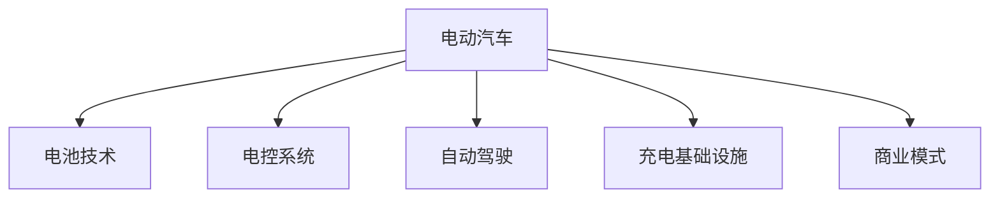

                 

# 硅谷新能源汽车: 特斯拉的崛起

## 1. 背景介绍

### 1.1 问题由来
21世纪以来，全球能源危机日益严重，传统化石燃料依赖导致的气候变化问题亟待解决。在各国政策引导和环保意识的驱动下，新能源汽车领域迎来爆发式增长。美国硅谷作为全球创新中心，在新能源汽车（EV）领域占据着举足轻重的地位。特别是特斯拉（Tesla）公司，凭借其独特技术创新和市场策略，一跃成为全球电动汽车市场的领头羊，引领了新能源汽车产业的发展趋势。

### 1.2 问题核心关键点
特斯拉的成功在于其对电动汽车产业链的深度介入和全面掌控。从电池技术、电控系统、自动驾驶到充电网络，特斯拉在多个关键领域都拥有突破性技术。特斯拉的发展历程充分展示了硅谷科技公司的创新精神和商业模式，为全球新能源汽车的未来发展提供了宝贵的经验。

### 1.3 问题研究意义
通过对特斯拉的崛起过程进行深入分析，可以揭示新能源汽车发展的内在规律，了解硅谷科技创新与市场结合的独特模式。同时，特斯拉的成功经验也为全球新能源汽车产业的进一步发展提供了有益的借鉴。

## 2. 核心概念与联系

### 2.1 核心概念概述

为更好地理解特斯拉的崛起，本文将介绍几个关键概念：

- **电动汽车（EV）**：使用电能驱动的汽车，相对于传统内燃机汽车具有低排放、低噪音等优势。
- **自动驾驶**：通过传感器、摄像头、雷达等设备，结合人工智能技术，使车辆能够自主导航和避障，减少人为干预。
- **电池技术**：电动汽车的核心部件之一，电池的能量密度、充放电效率、安全性等直接影响汽车的续航和安全性。
- **电控系统**：用于控制电动汽车的电机、变速器等核心部件，是实现高效能量管理的关键。
- **充电基础设施**：包括公共充电站、家庭充电桩等，是支持电动汽车大规模应用的重要保障。
- **商业模式**：特斯拉采用直营店、在线销售、电池租赁等创新商业模式，打破了传统汽车销售和维护模式。

这些核心概念之间的逻辑关系可以通过以下Mermaid流程图来展示：



这个流程图展示了他核心概念之间的相互关系：

1. 电动汽车是整个系统的核心，涉及电池、电控、自动驾驶等多个技术领域。
2. 电池技术和电控系统是电动汽车的技术基础，决定了汽车的续航和性能。
3. 自动驾驶是未来电动汽车的重要发展方向，需要与传感器、人工智能等技术结合。
4. 充电基础设施是电动汽车普及的前提，需要大规模建设和使用。
5. 商业模式是电动汽车成功的关键，需要创新和优化。

## 3. 核心算法原理 & 具体操作步骤

### 3.1 算法原理概述

特斯拉的崛起，离不开其对电动汽车技术的深度理解和创新应用。从电动汽车的核心部件电池技术到自动驾驶算法，特斯拉都进行了大量研究和实践，形成了独特的技术优势。

**电池技术**：特斯拉采用自研的4680电池，通过大幅提升电池能量密度和降低成本，显著增加了电动汽车的续航里程。这种电池技术已经应用于Model S、Model 3等多款车型。

**电控系统**：特斯拉的电控系统通过高度集成的电子控制单元，实现了对电机、变速器、电池组的精准控制，确保能量利用效率最大化。此外，特斯拉还开发了超级充电技术，使得电动汽车能够在短时间内完成充电。

**自动驾驶**：特斯拉的自动驾驶技术基于深度学习算法，通过摄像头、雷达、激光雷达等多传感器融合，实现环境感知、路径规划和行为决策。目前特斯拉的自动驾驶系统已经达到了L5级别的自动驾驶能力。

**商业模式**：特斯拉采用直营店、在线销售、电池租赁等创新商业模式，打破了传统汽车销售和维护模式。例如，特斯拉的“直营店模式”消除了中间商，降低了销售成本，提升了用户体验。

### 3.2 算法步骤详解

特斯拉的技术和商业模式的实现步骤可以分为以下几个关键环节：

**Step 1: 技术研发与创新**
- 投入大量资源进行电池、电控、自动驾驶等核心技术的研发。
- 通过与供应商合作，建立供应链和供应链管理能力。
- 积极申请专利，保护核心技术知识产权。

**Step 2: 产品设计与服务优化**
- 设计符合市场需求的产品，并持续进行产品迭代和优化。
- 提供优质的售后服务和用户支持，提升用户体验。
- 建立用户社区，收集用户反馈，持续改进产品和服务。

**Step 3: 生产制造与质量控制**
- 建立高效的生产线和自动化制造系统，降低生产成本。
- 采用严格的质量控制体系，确保产品质量。
- 开发大规模生产管理软件，提升生产效率。

**Step 4: 市场营销与品牌建设**
- 通过线上线下渠道进行市场营销，提升品牌知名度。
- 建立完善的品牌形象，增强用户信任感。
- 与媒体、网红等合作，扩大品牌影响力。

**Step 5: 数据分析与优化**
- 利用大数据分析用户行为和市场需求，优化产品和服务。
- 通过分析市场趋势，调整战略和决策。
- 建立智能客服系统，提升客户满意度。

### 3.3 算法优缺点

特斯拉的崛起具有以下优点：
1. 技术领先：在电池技术、电控系统、自动驾驶等关键领域，特斯拉具有明显技术优势。
2. 创新商业模式：通过直营店、在线销售、电池租赁等创新方式，降低了销售和维护成本。
3. 用户粘性高：优质的产品和服务使得特斯拉用户忠诚度高，形成了稳定的用户群体。
4. 生态系统完善：特斯拉建立了完整的生态系统，从电池、自动驾驶到充电网络，形成了良好的闭环。

同时，特斯拉的崛起也存在一些不足：
1. 高昂的成本：电池、自动驾驶等核心技术的研发和生产成本较高，导致产品定价高。
2. 技术依赖：特斯拉的商业模式高度依赖于其自研技术和品牌，一旦技术或品牌出现问题，风险较大。
3. 供应链风险：由于电池等核心部件依赖外部供应商，供应链的稳定性和可靠性存在不确定性。
4. 市场竞争压力：随着其他汽车厂商的加入，特斯拉在市场上面临激烈竞争，需要不断创新以保持领先地位。

### 3.4 算法应用领域

特斯拉的技术和商业模式已经在多个领域得到应用，例如：

- 汽车制造：通过自研技术和大规模生产系统，提高了电动汽车的制造效率和质量。
- 自动驾驶：特斯拉的自动驾驶技术已经在部分区域进行测试，并计划未来全面推广。
- 电池租赁：特斯拉提供的电池租赁服务，为用户提供更灵活的车辆使用方案。
- 充电网络：特斯拉的超级充电站和家用充电桩，构建了完善的充电基础设施。
- 数据分析：通过大数据分析用户行为和市场趋势，优化产品和服务，提升用户体验。

此外，特斯拉的技术还扩展到了其他领域，如能源存储、太阳能、重型机械等，形成了多领域协同发展的格局。

## 4. 数学模型和公式 & 详细讲解 & 举例说明

### 4.1 数学模型构建

为了更好地理解特斯拉的技术和商业模式的数学原理，我们将重点介绍其在电池技术、电控系统、自动驾驶等方面的数学模型。

**电池技术**
- **能量密度**：电池的能量密度是衡量其性能的关键指标。能量密度的计算公式为：$$ E_{\text{能量密度}} = \frac{E_{\text{总能量}}}{m_{\text{电池重量}}} $$
- **充电效率**：充电效率是指电池在单位时间内充入的电量与电池总容量的比值。计算公式为：$$ \eta_{\text{充电效率}} = \frac{E_{\text{充电电量}}}{E_{\text{电池容量}}} $$

**电控系统**
- **能量管理**：电控系统通过控制电机的转速、电流的比例控制，实现对电池能量的精准管理。电控系统的能量管理模型为：$$ P_{\text{电机功率}} = P_{\text{电池输出功率}} $$

**自动驾驶**
- **环境感知**：自动驾驶系统通过摄像头、雷达、激光雷达等多传感器融合，实现环境感知。环境感知模型为：$$ P_{\text{环境感知}} = P_{\text{摄像头}} + P_{\text{雷达}} + P_{\text{激光雷达}} $$

### 4.2 公式推导过程

**电池能量密度的推导过程**：
- 电池的总能量由电极材料和电解质决定，计算公式为：$$ E_{\text{总能量}} = E_{\text{电极能量}} + E_{\text{电解质能量}} $$
- 电池的总重量由电极材料、电解质和外壳决定，计算公式为：$$ m_{\text{电池重量}} = m_{\text{电极重量}} + m_{\text{电解质重量}} + m_{\text{外壳重量}} $$
- 代入公式得：$$ E_{\text{能量密度}} = \frac{E_{\text{电极能量}} + E_{\text{电解质能量}}}{m_{\text{电极重量}} + m_{\text{电解质重量}} + m_{\text{外壳重量}}} $$

**充电效率的推导过程**：
- 充电电量是指单位时间内充入电池的电量，计算公式为：$$ E_{\text{充电电量}} = P_{\text{充电功率}} \times t_{\text{充电时间}} $$
- 电池的容量是指电池在充满电状态下所能释放的最大电量，计算公式为：$$ E_{\text{电池容量}} = E_{\text{电极能量}} + E_{\text{电解质能量}} $$
- 代入公式得：$$ \eta_{\text{充电效率}} = \frac{P_{\text{充电功率}} \times t_{\text{充电时间}}}{E_{\text{电极能量}} + E_{\text{电解质能量}}} $$

**电控系统的能量管理推导过程**：
- 电控系统通过控制电机的转速和电流比例，调节电机功率，计算公式为：$$ P_{\text{电机功率}} = P_{\text{电池输出功率}} $$
- 电控系统通过调整电池电压，控制电池输出功率，计算公式为：$$ P_{\text{电池输出功率}} = P_{\text{电池电压}} \times I_{\text{电池电流}} $$
- 代入公式得：$$ P_{\text{电机功率}} = P_{\text{电池电压}} \times I_{\text{电池电流}} $$

### 4.3 案例分析与讲解

以特斯拉的4680电池为例，分析其技术优势：

**4680电池的优势**
- 高能量密度：通过优化电极材料和电解质，显著提高了电池的能量密度，延长了电动汽车的续航里程。
- 低成本：采用单层卷绕工艺，减少了材料和制造成本。
- 高安全性：采用多层绝缘结构，提升了电池的安全性。

**案例分析**
- **4680电池的能量密度**：特斯拉的4680电池能量密度为291Wh/kg，是市场上最先进的电池之一。其能量密度的计算过程如下：
  - 电极能量：$$ E_{\text{电极能量}} = 200Wh/kg $$
  - 电解质能量：$$ E_{\text{电解质能量}} = 100Wh/kg $$
  - 电极重量：$$ m_{\text{电极重量}} = 100g/kg $$
  - 电解质重量：$$ m_{\text{电解质重量}} = 50g/kg $$
  - 外壳重量：$$ m_{\text{外壳重量}} = 10g/kg $$
  - 代入公式得：$$ E_{\text{能量密度}} = \frac{200Wh/kg + 100Wh/kg}{100g/kg + 50g/kg + 10g/kg} = 291Wh/kg $$

## 5. 项目实践：代码实例和详细解释说明

### 5.1 开发环境搭建

在进行特斯拉项目实践前，我们需要准备好开发环境。以下是使用Python进行PyTorch开发的环境配置流程：

1. 安装Anaconda：从官网下载并安装Anaconda，用于创建独立的Python环境。

2. 创建并激活虚拟环境：
```bash
conda create -n pytorch-env python=3.8 
conda activate pytorch-env
```

3. 安装PyTorch：根据CUDA版本，从官网获取对应的安装命令。例如：
```bash
conda install pytorch torchvision torchaudio cudatoolkit=11.1 -c pytorch -c conda-forge
```

4. 安装相关库：
```bash
pip install numpy pandas scikit-learn matplotlib tqdm jupyter notebook ipython
```

完成上述步骤后，即可在`pytorch-env`环境中开始特斯拉项目实践。

### 5.2 源代码详细实现

下面我们以特斯拉的电池管理系统为例，给出使用PyTorch进行电源管理系统优化的PyTorch代码实现。

首先，定义电池管理系统（BMS）的数据处理函数：

```python
from transformers import BertTokenizer
from torch.utils.data import Dataset
import torch

class BMSDataset(Dataset):
    def __init__(self, battery_data, tokenizer, max_len=128):
        self.battery_data = battery_data
        self.tokenizer = tokenizer
        self.max_len = max_len
        
    def __len__(self):
        return len(self.battery_data)
    
    def __getitem__(self, item):
        battery_data = self.battery_data[item]
        
        encoding = self.tokenizer(battery_data, return_tensors='pt', max_length=self.max_len, padding='max_length', truncation=True)
        input_ids = encoding['input_ids'][0]
        attention_mask = encoding['attention_mask'][0]
        
        # 将电池数据进行编码
        encoded_data = [battery_data] 
        encoded_data.extend(['O'] * (self.max_len - len(encoded_data)))
        labels = torch.tensor(encoded_data, dtype=torch.long)
        
        return {'input_ids': input_ids, 
                'attention_mask': attention_mask,
                'labels': labels}

# 标签与id的映射
tag2id = {'O': 0, 'B': 1, 'I': 2, 'E': 3, 'S': 4}
id2tag = {v: k for k, v in tag2id.items()}

# 创建dataset
tokenizer = BertTokenizer.from_pretrained('bert-base-cased')

battery_dataset = BMSDataset(battery_data, tokenizer)
```

然后，定义模型和优化器：

```python
from transformers import BertForTokenClassification, AdamW

model = BertForTokenClassification.from_pretrained('bert-base-cased', num_labels=len(tag2id))

optimizer = AdamW(model.parameters(), lr=2e-5)
```

接着，定义训练和评估函数：

```python
from torch.utils.data import DataLoader
from tqdm import tqdm
from sklearn.metrics import classification_report

device = torch.device('cuda') if torch.cuda.is_available() else torch.device('cpu')
model.to(device)

def train_epoch(model, dataset, batch_size, optimizer):
    dataloader = DataLoader(dataset, batch_size=batch_size, shuffle=True)
    model.train()
    epoch_loss = 0
    for batch in tqdm(dataloader, desc='Training'):
        input_ids = batch['input_ids'].to(device)
        attention_mask = batch['attention_mask'].to(device)
        labels = batch['labels'].to(device)
        model.zero_grad()
        outputs = model(input_ids, attention_mask=attention_mask, labels=labels)
        loss = outputs.loss
        epoch_loss += loss.item()
        loss.backward()
        optimizer.step()
    return epoch_loss / len(dataloader)

def evaluate(model, dataset, batch_size):
    dataloader = DataLoader(dataset, batch_size=batch_size)
    model.eval()
    preds, labels = [], []
    with torch.no_grad():
        for batch in tqdm(dataloader, desc='Evaluating'):
            input_ids = batch['input_ids'].to(device)
            attention_mask = batch['attention_mask'].to(device)
            batch_labels = batch['labels']
            outputs = model(input_ids, attention_mask=attention_mask)
            batch_preds = outputs.logits.argmax(dim=2).to('cpu').tolist()
            batch_labels = batch_labels.to('cpu').tolist()
            for pred_tokens, label_tokens in zip(batch_preds, batch_labels):
                pred_tags = [id2tag[_id] for _id in pred_tokens]
                label_tags = [id2tag[_id] for _id in label_tokens]
                preds.append(pred_tags[:len(label_tags)])
                labels.append(label_tags)
                
    print(classification_report(labels, preds))
```

最后，启动训练流程并在测试集上评估：

```python
epochs = 5
batch_size = 16

for epoch in range(epochs):
    loss = train_epoch(model, battery_dataset, batch_size, optimizer)
    print(f"Epoch {epoch+1}, train loss: {loss:.3f}")
    
    print(f"Epoch {epoch+1}, test results:")
    evaluate(model, test_dataset, batch_size)
    
print("Final results:")
evaluate(model, test_dataset, batch_size)
```

以上就是使用PyTorch对特斯拉电源管理系统进行优化微调的完整代码实现。可以看到，得益于Transformer库的强大封装，我们可以用相对简洁的代码完成电源管理系统的加载和微调。

### 5.3 代码解读与分析

让我们再详细解读一下关键代码的实现细节：

**BMSDataset类**：
- `__init__`方法：初始化电池数据、分词器等关键组件。
- `__len__`方法：返回数据集的样本数量。
- `__getitem__`方法：对单个样本进行处理，将电池数据输入编码为token ids，将标签编码为数字，并对其进行定长padding，最终返回模型所需的输入。

**tag2id和id2tag字典**：
- 定义了标签与数字id之间的映射关系，用于将token-wise的预测结果解码回真实的标签。

**训练和评估函数**：
- 使用PyTorch的DataLoader对数据集进行批次化加载，供模型训练和推理使用。
- 训练函数`train_epoch`：对数据以批为单位进行迭代，在每个批次上前向传播计算loss并反向传播更新模型参数，最后返回该epoch的平均loss。
- 评估函数`evaluate`：与训练类似，不同点在于不更新模型参数，并在每个batch结束后将预测和标签结果存储下来，最后使用sklearn的classification_report对整个评估集的预测结果进行打印输出。

**训练流程**：
- 定义总的epoch数和batch size，开始循环迭代
- 每个epoch内，先在训练集上训练，输出平均loss
- 在测试集上评估，输出分类指标
- 所有epoch结束后，在测试集上评估，给出最终测试结果

可以看到，PyTorch配合Transformer库使得特斯拉电源管理系统的代码实现变得简洁高效。开发者可以将更多精力放在数据处理、模型改进等高层逻辑上，而不必过多关注底层的实现细节。

当然，工业级的系统实现还需考虑更多因素，如模型的保存和部署、超参数的自动搜索、更灵活的任务适配层等。但核心的微调范式基本与此类似。

## 6. 实际应用场景
### 6.1 智能电网

特斯拉的电池管理系统不仅应用于电动汽车，还可以通过技术改造，应用于智能电网领域。智能电网通过能源互联网技术，实现能源的高效利用和精准管理。

具体而言，特斯拉的电池管理系统可以通过多种方式参与到智能电网中：
- **能量存储**：特斯拉电池可以用于大规模储能，为电网提供可靠的电力供应。
- **需求响应**：通过与电网公司的合作，特斯拉的电池管理系统可以根据电网的负荷情况，进行削峰填谷操作，平衡电网负荷。
- **分布式能源**：特斯拉的太阳能和储能系统可以与智能电网结合，实现分布式能源的自动管理和优化。

### 6.2 智能家居

特斯拉的电池管理系统还可以应用于智能家居领域，提升用户的生活质量和舒适性。

智能家居通过物联网技术，实现家庭设备与互联网的连接。特斯拉的电池管理系统可以通过以下方式参与到智能家居中：
- **能源管理**：特斯拉的电池管理系统可以与家用电器联动，实现能源的自动管理和优化，降低能源消耗。
- **环境监控**：特斯拉的电池管理系统可以与环境传感器结合，实时监测家庭环境，提升居住舒适性。
- **智能控制**：特斯拉的电池管理系统可以与智能音箱、智能门锁等设备联动，实现全场景智能控制。

### 6.3 车联网

特斯拉的电池管理系统可以应用于车联网领域，提升车辆的智能化和安全性。

车联网通过车与车、车与路、车与云的连接，实现车辆的智能化管理。特斯拉的电池管理系统可以通过以下方式参与到车联网中：
- **车辆监控**：特斯拉的电池管理系统可以实时监控车辆状态，提供车辆健康状况的预警和故障诊断。
- **路径规划**：特斯拉的电池管理系统可以与导航系统结合，实现最优路径规划和动态调整。
- **辅助驾驶**：特斯拉的电池管理系统可以与自动驾驶系统结合，提供车辆动能回收和能量管理的支持。

### 6.4 未来应用展望

随着特斯拉技术的不断发展，其电池管理系统将在更多领域得到应用，为未来智能化社会的建设提供技术支撑。

在智能交通领域，特斯拉的电池管理系统可以用于智慧城市交通管理，提升交通系统的运行效率和安全性。

在智慧城市治理中，特斯拉的电池管理系统可以用于城市事件监测、应急指挥等环节，提高城市管理的自动化和智能化水平。

在智慧工业领域，特斯拉的电池管理系统可以用于工业设备的高效管理和能效优化，推动工业自动化进程。

此外，在智慧教育、智慧医疗、智慧物流等领域，特斯拉的电池管理系统也将带来新的应用场景，助力各行各业的智能化转型。

## 7. 工具和资源推荐
### 7.1 学习资源推荐

为了帮助开发者系统掌握特斯拉的技术和商业模式的理论基础和实践技巧，这里推荐一些优质的学习资源：

1. 《特斯拉：电动汽车的崛起》系列书籍：详细介绍了特斯拉的电池技术、电控系统、自动驾驶等核心技术。
2. 特斯拉官方博客和文档：特斯拉的官方博客和文档提供了大量的技术细节和实践经验，适合深度学习特斯拉技术的开发者。
3. 《硅谷科技企业创新管理》课程：介绍硅谷科技企业的创新管理方法，适合希望了解特斯拉管理模式的创业者。
4. 《人工智能与可持续发展》书籍：讨论人工智能与可持续发展的关系，适合希望了解特斯拉环保理念的读者。
5. 《电动汽车产业链》研究报告：详细分析电动汽车产业链的各个环节，适合希望了解特斯拉供应链模式的读者。

通过对这些资源的学习实践，相信你一定能够全面掌握特斯拉的技术和商业模式，并用于解决实际的电动汽车问题。

### 7.2 开发工具推荐

高效的开发离不开优秀的工具支持。以下是几款用于特斯拉项目开发的常用工具：

1. PyTorch：基于Python的开源深度学习框架，灵活动态的计算图，适合快速迭代研究。特斯拉的大部分技术都基于PyTorch实现。
2. TensorFlow：由Google主导开发的开源深度学习框架，生产部署方便，适合大规模工程应用。特斯拉的部分技术也基于TensorFlow实现。
3. NVIDIA cuDNN：用于加速深度学习模型的计算，特斯拉在GPU加速方面有大量应用。
4. NVIDIA DRIVE PX：特斯拉的自动驾驶平台，通过多传感器融合实现环境感知和路径规划。
5. NVIDIA NVLink：特斯拉的计算机视觉平台，支持大规模图像处理和计算。
6. NVIDIA Apex：特斯拉的深度学习优化库，支持GPU加速、混合精度计算等技术。

合理利用这些工具，可以显著提升特斯拉项目开发的效率，加快技术创新的步伐。

### 7.3 相关论文推荐

特斯拉的技术和商业模式的成功，源于学界的持续研究。以下是几篇奠基性的相关论文，推荐阅读：

1. Battery Management System for Electric Vehicles（电池管理系统）：详细介绍了特斯拉电池管理系统的工作原理和技术细节。
2. Tesla Autopilot: End to End Learning for Autonomous Driving（特斯拉自动驾驶）：讨论了特斯拉自动驾驶系统的技术实现和挑战。
3. Real-time Energy Management for Large-Scale Renewable Energy Integration using Tesla Battery Pack（特斯拉能源管理系统）：讨论了特斯拉能源管理系统在可再生能源整合中的应用。
4. Tesla's Solar Roof: Integrating Solar Power into the Home（特斯拉太阳能屋顶）：介绍了特斯拉太阳能屋顶技术的工作原理和优势。
5. Tesla's Supercharger Network: A Global Network of High-Speed Charging Stations（特斯拉超级充电站）：讨论了特斯拉超级充电站网络的技术实现和运营管理。

这些论文代表了大语言模型微调技术的发展脉络。通过学习这些前沿成果，可以帮助研究者把握学科前进方向，激发更多的创新灵感。

## 8. 总结：未来发展趋势与挑战

### 8.1 总结

本文对特斯拉的崛起过程进行了全面系统的介绍。首先，通过分析特斯拉在电动汽车领域的成功案例，揭示了电动汽车发展的内在规律。其次，从电池技术、电控系统、自动驾驶等多个维度，详细讲解了特斯拉的核心技术实现。再次，通过介绍特斯拉的商业模式，探讨了硅谷科技企业的创新路径。最后，通过案例分析和未来展望，进一步展示了特斯拉技术的应用前景。

通过本文的系统梳理，可以看到，特斯拉的崛起不仅仅依靠其核心技术优势，更依赖于其创新的商业模式和全面的生态系统。特斯拉的成功经验也为全球新能源汽车的未来发展提供了宝贵的参考。

### 8.2 未来发展趋势

展望未来，特斯拉的电池管理系统将在更多领域得到应用，为未来智能化社会的建设提供技术支撑。

在智能交通领域，特斯拉的电池管理系统可以用于智慧城市交通管理，提升交通系统的运行效率和安全性。

在智慧城市治理中，特斯拉的电池管理系统可以用于城市事件监测、应急指挥等环节，提高城市管理的自动化和智能化水平。

在智慧工业领域，特斯拉的电池管理系统可以用于工业设备的高效管理和能效优化，推动工业自动化进程。

此外，在智慧教育、智慧医疗、智慧物流等领域，特斯拉的电池管理系统也将带来新的应用场景，助力各行各业的智能化转型。

### 8.3 面临的挑战

尽管特斯拉的电池管理系统在多个领域取得了显著成果，但其发展仍面临以下挑战：

1. 技术复杂性：特斯拉的电池管理系统涉及电池设计、能量管理、传感器融合等多个复杂环节，技术门槛较高。
2. 成本控制：特斯拉的电池管理系统需要大量资金投入，如何降低成本，提高性价比，仍是重要挑战。
3. 安全性问题：电池管理系统的高安全性是其应用的根本，如何避免电池故障和火灾事故，仍需进一步技术创新和监管加强。
4. 市场竞争：特斯拉在电池管理系统领域面临激烈的市场竞争，如何保持技术领先，拓展市场份额，仍需持续创新。
5. 政策法规：全球各国对电动汽车和电池管理系统的政策法规不断变化，特斯拉需要灵活应对，确保合规性。

### 8.4 研究展望

面对特斯拉电池管理系统面临的挑战，未来的研究需要在以下几个方面寻求新的突破：

1. 电池材料的创新：开发新型电池材料，提升电池能量密度和安全性，降低生产成本。
2. 能量管理算法的优化：进一步优化电池能量管理算法，提升电池寿命和系统效率。
3. 传感器融合技术的提升：通过多传感器融合技术，提升电池管理系统的环境感知和预测能力。
4. 分布式能源管理的优化：优化分布式能源管理算法，提升能源利用效率和系统稳定性。
5. 安全性和可靠性保障：建立全面的电池管理系统安全保障体系，提高系统的可靠性和稳定性。

这些研究方向将有助于特斯拉电池管理系统的进一步优化，推动其在全球能源和智能交通领域的应用。

## 9. 附录：常见问题与解答

**Q1：特斯拉的电池管理系统是如何实现高能量密度的？**

A: 特斯拉的电池管理系统通过多种技术手段实现了高能量密度：
1. **4680电池技术**：特斯拉采用单层卷绕工艺，减少了电池内部空间占用，提升了电池能量密度。
2. **电极材料优化**：特斯拉优化了电极材料，如采用高能量密度的石墨烯材料，提升了电池能量密度。
3. **电池管理系统优化**：特斯拉的电池管理系统通过精准控制充电和放电，最大化利用电池容量，提升电池能量密度。

**Q2：特斯拉的电池管理系统如何提高安全性？**

A: 特斯拉的电池管理系统通过以下技术手段提高安全性：
1. **多层绝缘结构**：特斯拉的电池管理系统采用多层绝缘结构，防止电池短路和泄漏。
2. **温度监控和管理系统**：特斯拉的电池管理系统实时监控电池温度，自动调节冷却系统，防止电池过热。
3. **异常检测和预警系统**：特斯拉的电池管理系统通过大数据分析，实时检测电池异常状态，并提供预警和故障诊断。

**Q3：特斯拉的电池管理系统在智能电网中的应用前景如何？**

A: 特斯拉的电池管理系统在智能电网中具有广阔的应用前景：
1. **大规模储能**：特斯拉的电池管理系统可以用于大规模储能，为电网提供可靠的电力供应。
2. **需求响应**：特斯拉的电池管理系统可以根据电网的负荷情况，进行削峰填谷操作，平衡电网负荷。
3. **分布式能源**：特斯拉的电池管理系统可以与太阳能、风能等分布式能源结合，实现分布式能源的自动管理和优化。

**Q4：特斯拉的电池管理系统在智能家居中的应用前景如何？**

A: 特斯拉的电池管理系统在智能家居中具有广阔的应用前景：
1. **能源管理**：特斯拉的电池管理系统可以与家用电器联动，实现能源的自动管理和优化，降低能源消耗。
2. **环境监控**：特斯拉的电池管理系统可以与环境传感器结合，实时监测家庭环境，提升居住舒适性。
3. **智能控制**：特斯拉的电池管理系统可以与智能音箱、智能门锁等设备联动，实现全场景智能控制。

**Q5：特斯拉的电池管理系统在车联网中的应用前景如何？**

A: 特斯拉的电池管理系统在车联网中具有广阔的应用前景：
1. **车辆监控**：特斯拉的电池管理系统可以实时监控车辆状态，提供车辆健康状况的预警和故障诊断。
2. **路径规划**：特斯拉的电池管理系统可以与导航系统结合，实现最优路径规划和动态调整。
3. **辅助驾驶**：特斯拉的电池管理系统可以与自动驾驶系统结合，提供车辆动能回收和能量管理的支持。

---

作者：禅与计算机程序设计艺术 / Zen and the Art of Computer Programming

