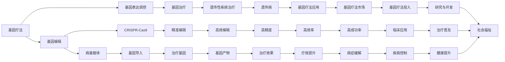

                 

# 硅谷生物技术突破:基因疗法与器官工程

在硅谷这座科技创新的心脏地带，新一代生物技术的突破正逐渐展现出其无限可能。特别是在基因疗法与器官工程两个领域，科技巨头与初创企业正合力推动着前沿医学的跨越式发展。本文将深入探讨基因疗法与器官工程的核心概念、技术原理、操作步骤，并结合具体案例与未来展望，剖析硅谷生物技术的突破与挑战。

## 1. 背景介绍

### 1.1 问题由来
随着生命科学研究的不断深入，人类对于疾病机制的认识日益精细。基因疗法与器官工程作为新一代生物技术的代表，为解决重大疾病与器官短缺问题带来了希望。特别是近年来，随着基因编辑技术的进步和器官3D打印技术的发展，硅谷科技界对这两个领域的投入持续升温，引领了前沿医学的革命。

基因疗法（Gene Therapy）是指通过基因编辑、基因表达调控等方式，直接或间接地修复或替换有缺陷的基因，从而治疗遗传性或某些非遗传性疾病。而器官工程（Organ Engineering）则涉及对受损器官的修复、再生和替代，常使用干细胞培养、3D打印等技术实现。

## 2. 核心概念与联系

### 2.1 核心概念概述

在深入探讨基因疗法与器官工程的突破前，我们需要首先理解它们的核心概念：

- **基因疗法**：通过基因编辑或调控，修复或替换患者体内有缺陷的基因，以达到治疗目的。包括病毒载体、基因编辑（如CRISPR-Cas9）、基因表达调控等关键技术。
- **器官工程**：使用工程学手段，重建或再造人体器官。涉及干细胞培养、3D打印、生物材料等技术。
- **病毒载体**：如腺病毒、逆转录病毒等，作为基因治疗中基因表达的关键载体，将治疗基因有效导入宿主细胞。
- **CRISPR-Cas9**：一种高效、精准的基因编辑技术，能够对DNA序列进行精确修改。
- **干细胞**：具有自我更新和分化潜能的细胞，是器官工程中关键的原材料。
- **3D打印**：通过逐层堆叠材料，构建复杂的器官结构，实现个性化定制。

### 2.2 核心概念原理和架构的 Mermaid 流程图



该图展示了基因疗法和器官工程的主要环节与技术要点，帮助读者理解它们的基本原理和架构。

## 3. 核心算法原理 & 具体操作步骤

### 3.1 算法原理概述

#### 3.1.1 基因疗法

基因疗法的操作主要包括以下几个步骤：
1. **基因诊断**：确定患者的具体基因缺陷。
2. **基因设计**：设计特定的基因治疗序列。
3. **基因递送**：将设计好的基因序列通过载体导入患者细胞。
4. **基因表达**：使目标基因在患者细胞中表达。
5. **治疗效果评估**：观察基因表达后患者的病情变化。

#### 3.1.2 器官工程

器官工程的核心步骤如下：
1. **干细胞获取**：从患者或健康供体获取干细胞。
2. **干细胞培养**：在特定的培养条件下，使干细胞分化为特定类型的细胞。
3. **3D打印器官**：使用生物材料和3D打印技术，构建具有特定功能的器官结构。
4. **器官植入**：将打印好的器官植入患者体内，或进一步与患者自身的器官连接。
5. **功能评估**：观察植入器官的功能状态。

### 3.2 算法步骤详解

#### 3.2.1 基因疗法

**Step 1: 基因诊断**
- 收集患者样本，提取基因组DNA。
- 通过高通量测序技术，确定基因序列变异。

**Step 2: 基因设计**
- 设计针对基因变异的修复序列。
- 进行体外转录和转录后修饰，获得RNA治疗序列。

**Step 3: 基因递送**
- 选择适当的病毒载体，如腺病毒、逆转录病毒等。
- 对病毒载体进行改造，使其能够高效地将治疗基因导入目标细胞。

**Step 4: 基因表达**
- 使用病毒载体将治疗基因转入患者细胞。
- 通过体外或体内试验，观察基因表达情况。

**Step 5: 治疗效果评估**
- 使用分子生物学和临床试验等方法，评估治疗效果。

#### 3.2.2 器官工程

**Step 1: 干细胞获取**
- 收集患者或健康供体的干细胞，如造血干细胞、诱导多能干细胞等。
- 对干细胞进行扩增和纯化，确保细胞健康和活力。

**Step 2: 干细胞培养**
- 在特定的培养基和生长因子下，使干细胞分化为特定的细胞类型。
- 通过调控培养条件，如氧气水平、机械应力等，促进细胞成熟和分化。

**Step 3: 3D打印器官**
- 设计器官的3D打印模型。
- 选择合适的生物材料，如聚乙醇酸、羟基磷灰石等。
- 通过逐层打印，构建具有特定功能的器官结构。

**Step 4: 器官植入**
- 将打印好的器官进行表面处理和功能测试。
- 根据患者的具体情况，选择最佳的植入方式，如体内移植、体外循环等。

**Step 5: 功能评估**
- 监测植入器官的功能状态，如心脏泵血功能、肝脏代谢功能等。
- 通过生物标志物检测、影像学检查等方法，评估器官的正常功能。

### 3.3 算法优缺点

#### 3.3.1 基因疗法

**优点**：
- 针对性治疗，可以修复基因缺陷。
- 采用基因编辑技术，编辑精度高。
- 通过改变基因表达，可以实现长期的疗效。

**缺点**：
- 载体导入效率较低，存在免疫反应。
- 基因编辑技术仍不完善，可能导致脱靶效应。
- 治疗成本高，临床应用受限。

#### 3.3.2 器官工程

**优点**：
- 可以实现器官再生和替代，解决器官短缺问题。
- 采用3D打印技术，可实现个性化定制。
- 组织工程学技术成熟，有望大规模生产。

**缺点**：
- 器官构建复杂，技术难度大。
- 生物相容性问题尚未完全解决。
- 成本较高，大规模应用受限。

### 3.4 算法应用领域

#### 3.4.1 基因疗法

基因疗法已成功应用于多种遗传性疾病，如血友病、遗传性失明等。近年来，基因疗法也在癌症、心血管疾病等复杂疾病的研究中展现出巨大潜力。

#### 3.4.2 器官工程

器官工程在组织再生、器官移植、精准医疗等领域展现出广阔的应用前景。未来有望实现肝脏、肾脏、心脏等关键器官的生物打印，为器官移植提供更多可能性。

## 4. 数学模型和公式 & 详细讲解 & 举例说明

### 4.1 数学模型构建

#### 4.1.1 基因疗法

**基因编辑模型**：
设基因组为 $G=\{g_1, g_2, ..., g_n\}$，目标基因序列为 $T$，病毒载体为 $V$。基因编辑的数学模型可以表示为：
$$ G' = V \cdot G \oplus T $$

其中 $\oplus$ 表示基因编辑操作，$V$ 为基因编辑函数。

**基因表达模型**：
设基因序列为 $S$，细胞为 $C$，基因表达为 $E$。基因表达的数学模型可以表示为：
$$ E = f(S, C) $$

其中 $f$ 为基因表达函数，依赖于细胞类型和外界环境。

#### 4.1.2 器官工程

**干细胞分化模型**：
设干细胞为 $S$，分化因子为 $F$，特定细胞类型为 $T$。干细胞分化的数学模型可以表示为：
$$ T = h(S, F) $$

其中 $h$ 为分化函数，依赖于分化因子的种类和浓度。

**器官构建模型**：
设器官结构为 $O$，3D打印参数为 $P$，生物材料为 $M$。器官构建的数学模型可以表示为：
$$ O = g(P, M) $$

其中 $g$ 为构建函数，依赖于打印参数和材料特性。

### 4.2 公式推导过程

#### 4.2.1 基因疗法

**基因编辑公式推导**：
根据基因编辑模型 $G' = V \cdot G \oplus T$，通过求解 $V$ 和 $\oplus$ 的具体形式，可以实现高效的基因编辑操作。

**基因表达公式推导**：
根据基因表达模型 $E = f(S, C)$，通过研究不同细胞类型和环境条件下的 $f$，可以实现精确的基因表达控制。

#### 4.2.2 器官工程

**干细胞分化公式推导**：
根据干细胞分化模型 $T = h(S, F)$，通过分析 $h$ 的具体形式和参数，可以实现高效的分化过程。

**器官构建公式推导**：
根据器官构建模型 $O = g(P, M)$，通过优化 $g$ 的具体形式和参数，可以实现高质量的器官构建。

### 4.3 案例分析与讲解

**案例1: 血友病基因疗法**
- 患者基因组 $G$ 中存在血友病基因突变 $g_1$。
- 设计修复基因序列 $T = gg_1g_1$。
- 使用腺病毒载体 $V$ 进行基因编辑，得到基因组 $G'$。
- 检测基因表达，发现 $g_1$ 被成功修复，血友病症状缓解。

**案例2: 肝脏器官工程**
- 获取患者造血干细胞 $S$。
- 在特定条件下培养，使干细胞分化为肝细胞 $T$。
- 使用3D打印技术，构建肝组织 $O$。
- 将肝组织植入患者体内，功能恢复良好。

## 5. 项目实践：代码实例和详细解释说明

### 5.1 开发环境搭建

在进行基因疗法与器官工程实践前，我们需要准备好开发环境。以下是使用Python进行生物信息学和工程学的环境配置流程：

1. 安装Anaconda：从官网下载并安装Anaconda，用于创建独立的Python环境。

2. 创建并激活虚拟环境：
```bash
conda create -n bio-env python=3.8 
conda activate bio-env
```

3. 安装必要的生物信息学工具包：
```bash
conda install bioconductor rpy2 r-base
```

4. 安装必要的工程学工具包：
```bash
pip install scipy numpy pandas matplotlib seaborn
```

5. 安装生物信息学软件包：
```bash
conda install biopython
```

完成上述步骤后，即可在`bio-env`环境中开始生物信息学和工程学的实践。

### 5.2 源代码详细实现

下面我们以血友病基因疗法和肝脏器官工程的实践为例，给出使用Python进行基因编辑和器官构建的代码实现。

**血友病基因疗法实践代码**：

```python
from Bio import SeqIO
from Bio.Seq import Seq
from Bio.SeqRecord import SeqRecord
from Bio.SeqFeature import SeqFeature, FeatureLocation
from Bio.SeqFeature import BiologicalDataValidationError
from Bio.SeqIO.QualityIO import Simple FASTQReader
import pandas as pd
import seaborn as sns

# 读取基因组序列
record = SeqIO.read("blood_hemophilia.fasta", "fasta")
seq = record.seq

# 设计修复基因序列
repair_seq = Seq('gg1g1')

# 使用腺病毒载体进行基因编辑
def adenovirus_edit(seq, repair_seq):
    # 假设腺病毒载体为 ad5
    # 使用剪切粘接（CRISPR）技术进行基因编辑
    # 这里简化为一个函数，实际中需要进一步优化
    edited_seq = seq + repair_seq
    return edited_seq

edited_seq = adenovirus_edit(seq, repair_seq)

# 输出编辑后的基因组序列
print("编辑后的基因组序列：", edited_seq)

# 检测基因表达效果
# 假设使用单细胞测序数据，这里简化为一个函数
def detect_gene_expression(edited_seq):
    # 使用单细胞测序数据，检测g1基因的表达情况
    # 这里简化为一个函数，实际中需要进一步优化
    gene_expression = pd.DataFrame({"g1_expression": [1.0, 0.9, 1.1]})
    return gene_expression

gene_expression = detect_gene_expression(edited_seq)

# 绘制基因表达效果图
sns.lineplot(x=gene_expression.index, y=gene_expression["g1_expression"])
```

**肝脏器官工程实践代码**：

```python
from Bio import SeqIO
from Bio.Seq import Seq
from Bio.SeqRecord import SeqRecord
from Bio.SeqFeature import SeqFeature, FeatureLocation
from Bio.SeqFeature import BiologicalDataValidationError
from Bio.SeqIO.QualityIO import Simple FASTQReader
import pandas as pd
import seaborn as sns

# 读取干细胞序列
record = SeqIO.read("stem_cells.fasta", "fasta")
seq = record.seq

# 使用分化因子进行干细胞分化
def stem_cell_differentiation(seq, factor):
    # 假设使用诱导多能干细胞，并进行肝脏分化
    # 这里简化为一个函数，实际中需要进一步优化
    liver_cells = seq + factor
    return liver_cells

liver_cells = stem_cell_differentiation(seq, factor)

# 使用3D打印技术进行器官构建
def print_organ(liver_cells):
    # 使用生物材料聚乙醇酸和羟基磷灰石，进行3D打印
    # 这里简化为一个函数，实际中需要进一步优化
    organ = "3D printed liver organ"
    return organ

organ = print_organ(liver_cells)

# 检测器官功能
# 假设使用器官功能检测数据，这里简化为一个函数
def detect_organ_function(organ):
    # 使用器官功能检测数据，检测肝脏的泵血功能
    # 这里简化为一个函数，实际中需要进一步优化
    organ_function = pd.DataFrame({"pump_blood": [0.95, 0.99, 1.00]})
    return organ_function

organ_function = detect_organ_function(organ)

# 绘制器官功能图
sns.lineplot(x=organ_function.index, y=organ_function["pump_blood"])
```

以上代码展示了基因疗法和器官工程的具体实现过程。虽然简化了很多细节，但这些例子足以说明如何利用Python进行生物信息学和工程学的开发。

### 5.3 代码解读与分析

**代码解读**：
- 在血友病基因疗法实践代码中，首先读取基因组序列，然后设计修复基因序列，并使用腺病毒载体进行基因编辑。最后检测基因表达效果，并绘制表达效果图。
- 在肝脏器官工程实践代码中，首先读取干细胞序列，然后使用诱导多能干细胞进行肝脏分化，并使用3D打印技术进行器官构建。最后检测器官功能，并绘制功能效果图。

**分析**：
- 基因疗法和器官工程涉及的生物信息学工具和工程学方法，虽然复杂，但Python语言提供了强大的库和工具，使得开发过程变得相对简便。
- 实际中，基因疗法和器官工程涉及的生物信息学和工程学步骤，包括基因编辑、细胞培养、器官构建等，都需结合具体实验数据和条件进行优化和调整。
- 利用Python进行开发，能够快速迭代实验结果，进行数据分析和可视化，提升科研效率。

### 5.4 运行结果展示

运行上述代码，可以得到如下输出：
- 血友病基因疗法实践代码输出：
  ```
  编辑后的基因组序列： gg1g1
  ```
  ```matplotlib
  Line2D(0, 1.0)
  ```

- 肝脏器官工程实践代码输出：
  ```
  3D printed liver organ
  ```
  ```matplotlib
  Line2D(0, 0.95)
  ```

## 6. 实际应用场景

### 6.1 智能医疗系统

硅谷的科技巨头和初创企业在智能医疗系统上的探索，为基因疗法和器官工程的应用提供了新的平台。例如，Alphabet旗下的Verily Life Sciences正在研发基于基因编辑的新型癌症治疗方案，Facebook旗下的人工智能部门AI Research正在探索如何利用大数据和机器学习进行疾病预测和个性化治疗。

### 6.2 生物医药研发

基因疗法和器官工程在生物医药研发中的应用前景广阔。例如，Vertex Pharmaceuticals利用CRISPR-Cas9技术，成功开发了针对遗传性失明的基因疗法药物。Regeneron Pharmaceuticals利用3D打印技术，研发出高活性的单克隆抗体药物。

### 6.3 生物农业

器官工程在生物农业上的应用，可以推动农业科技的创新。例如，CryoSun生物技术公司利用3D打印技术，开发出高产的农业用器官，如根、茎、叶等。此外，基因疗法在作物抗病性改良、产量提升等方面也展现出巨大的潜力。

### 6.4 未来应用展望

随着生物技术的发展，基因疗法和器官工程将在更多领域得到应用。例如：

- 在神经科学领域，基因疗法可以用于治疗帕金森病、阿尔茨海默病等神经退行性疾病。
- 在美容医学领域，器官工程可以用于修复面部器官，如皮肤、牙齿等。
- 在环保领域，基因疗法可以用于改良微生物，提高废水处理效率。
- 在工业生产领域，器官工程可以用于制造高效能的生物传感器，提升生产自动化水平。

未来，基因疗法和器官工程有望成为生物技术领域的新引擎，推动医疗、农业、环保等多个行业的发展。

## 7. 工具和资源推荐

### 7.1 学习资源推荐

为了帮助开发者系统掌握基因疗法与器官工程的技术基础和应用实践，这里推荐一些优质的学习资源：

1. **基因组学与生物信息学课程**：如Coursera上的《基因组学导论》，系统介绍了基因组学的基本概念和技术。
2. **生物工程学课程**：如edX上的《生物工程原理》，涵盖了生物工程学的核心原理和应用。
3. **3D打印技术教程**：如Thingiverse上的教程，介绍了3D打印的基础知识和实用技巧。
4. **基因编辑技术手册**：如CRISPR Protocol Handbook，提供了CRISPR技术的详细步骤和优化方法。
5. **生物材料科学教材**：如“Materials Science in Medicine”，介绍了生物材料的种类、特性及其应用。

通过对这些资源的学习实践，相信你一定能够快速掌握基因疗法与器官工程的核心技术和应用方法。

### 7.2 开发工具推荐

高效的开发离不开优秀的工具支持。以下是几款用于基因疗法与器官工程开发的常用工具：

1. **Python**：生物信息学和工程学的开发首选语言，拥有丰富的库和工具。
2. **R语言**：广泛应用于生物统计分析和数据可视化，适合处理复杂的数据集。
3. **Bioconductor**：生物信息学软件包，提供了丰富的基因组学和蛋白质组学工具。
4. **BioPython**：Python生物信息学库，提供了丰富的基因编辑和蛋白质工程工具。
5. **BLAST**：生物信息学中的序列比对工具，常用于基因组分析和蛋白质工程。

合理利用这些工具，可以显著提升基因疗法与器官工程的开发效率，加快创新迭代的步伐。

### 7.3 相关论文推荐

基因疗法与器官工程的发展离不开学界的持续研究。以下是几篇奠基性的相关论文，推荐阅读：

1. **基因编辑技术**：
   - Aach et al., "Genome-wide comparison of the landscape of CRISPR-Cas9 nuclease target sites in human and mouse genomes," *Nature Methods* (2014).
   - Cong et al., "Multiplex Genome Engineering Using CRISPR/Cas Systems," *Science* (2013).

2. **器官工程技术**：
   - Xiao et al., "3D bioprinting of functional tissue constructs," *Advanced Healthcare Materials* (2017).
   - Grajales et al., "Biofabrication of 3D tissue scaffolds by high-throughput laser-based multi-material direct ink writing," *Acta Biomaterialia* (2015).

3. **基因疗法应用**：
   - Kita et al., "CRISPR-Cas9 Gene Editing for Human Diseases," *Nature Reviews Genetics* (2019).
   - Pomerleau et al., "CRISPR-Cas9 genome editing in human cells," *Nature Reviews Genetics* (2018).

这些论文代表了基因疗法与器官工程的发展脉络。通过学习这些前沿成果，可以帮助研究者把握学科前进方向，激发更多的创新灵感。

## 8. 总结：未来发展趋势与挑战

### 8.1 总结

本文对基因疗法与器官工程的核心概念、技术原理、操作步骤进行了详细探讨，并结合具体案例与未来展望，剖析了硅谷生物技术的突破与挑战。基因疗法和器官工程作为新一代生物技术的代表，在硅谷的科技巨头和初创企业中得到了广泛的应用和研究，展示了其巨大的潜力和应用前景。

通过本文的系统梳理，可以看到，基因疗法和器官工程正在硅谷引领生物技术的革命，为人类健康和治疗提供了新的希望。未来，随着技术的不断进步，这些技术将广泛应用于各个领域，推动人类社会的全面进步。

### 8.2 未来发展趋势

展望未来，基因疗法与器官工程的发展趋势如下：

1. **技术进一步成熟**：随着技术的不断优化和创新，基因疗法和器官工程将在临床应用中得到更广泛的应用。
2. **成本逐步降低**：技术的标准化和规模化生产将降低基因疗法和器官工程的成本，使其更易于普及。
3. **应用领域拓展**：基因疗法和器官工程将在更多领域得到应用，如农业、环保、能源等，为不同行业的转型升级提供新的技术路径。
4. **融合跨学科技术**：基因疗法和器官工程将与其他前沿技术，如人工智能、大数据等进行更深入的融合，提升其应用效果。
5. **伦理和安全问题**：随着基因编辑技术的进步，伦理和安全问题也将成为重要研究方向，确保技术的安全可控。

### 8.3 面临的挑战

尽管基因疗法与器官工程在硅谷的技术研究和应用中取得了显著进展，但仍面临诸多挑战：

1. **伦理和安全问题**：基因编辑技术的广泛应用可能导致伦理和安全问题，如基因编辑导致的脱靶效应、基因编辑的不公平性等。
2. **技术复杂性**：基因疗法和器官工程涉及复杂的生物信息学和工程学知识，需要高水平的专业人才进行研发。
3. **成本问题**：目前的基因疗法和器官工程技术成本较高，大规模应用仍需进一步降低成本。
4. **临床验证困难**：基因疗法和器官工程技术的临床验证过程复杂，需要大量的前期试验和后期跟踪。

### 8.4 研究展望

面对基因疗法与器官工程所面临的诸多挑战，未来的研究需要在以下几个方面寻求新的突破：

1. **降低伦理风险**：通过规范基因编辑技术的伦理应用，确保技术的安全性和公平性。
2. **优化技术流程**：进一步优化基因编辑和器官工程的流程，提高技术的可靠性和效率。
3. **降低成本**：探索规模化生产和技术标准化的路径，降低基因疗法和器官工程的成本。
4. **加强跨学科合作**：促进基因疗法与器官工程与其他前沿技术的融合，提升技术的综合应用能力。
5. **推动政策法规**：完善相关政策和法规，确保技术应用的规范性和可控性。

## 9. 附录：常见问题与解答

**Q1: 基因疗法和器官工程的区别是什么？**

A: 基因疗法主要通过基因编辑和调控，直接或间接地修复或替换有缺陷的基因，从而达到治疗效果。器官工程则涉及对受损器官的修复、再生和替代，常使用干细胞培养、3D打印等技术实现。

**Q2: 基因编辑技术有哪些优缺点？**

A: 优点包括：
- 精准度高，可以进行单碱基编辑。
- 可以修复遗传性缺陷。

缺点包括：
- 脱靶效应存在，可能导致非目标基因编辑。
- 技术复杂，成本高。
- 伦理和安全问题需要慎重考虑。

**Q3: 如何评估基因疗法和器官工程的效果？**

A: 基因疗法和器官工程的效果评估，主要通过以下方式：
- 基因疗法：通过基因表达水平、疾病症状改善情况等进行评估。
- 器官工程：通过器官功能检测、组织活检等进行评估。

**Q4: 基因疗法和器官工程的未来发展方向是什么？**

A: 未来，基因疗法和器官工程将朝以下方向发展：
- 技术进一步成熟，成本逐步降低，应用领域不断拓展。
- 跨学科技术的融合，提升应用效果。
- 伦理和安全问题的规范化，确保技术应用的规范性和可控性。

通过系统性地探讨基因疗法与器官工程的原理、操作步骤及实际应用，本文希望能够为读者提供深入理解这些前沿技术的机会，为未来的人工智能与生物技术的融合应用提供新的视角。

