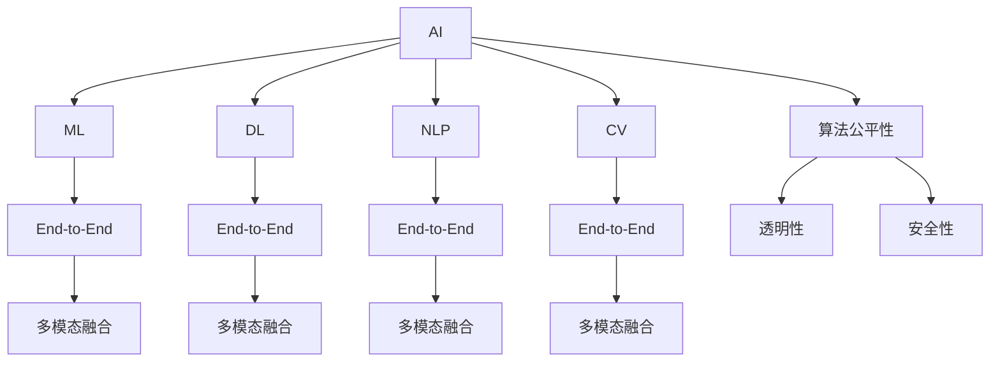

                 

# 硅谷的多元化发展：AI企业的创新，探索垂直领域的独特价值

> 关键词：人工智能(AI),多元化发展,AI企业,创新,垂直领域,独特价值

## 1. 背景介绍

### 1.1 问题由来

硅谷，作为全球科技创新的中心，长久以来以软件和互联网企业为主导。然而，随着人工智能(AI)技术的迅猛发展，硅谷已经迎来了AI企业的全面崛起。AI企业通过深度学习、机器学习、计算机视觉、自然语言处理等技术，为各行各业带来了颠覆性的变革。AI企业的创新不仅改变了科技公司的商业模式，也为传统行业带来了新的增长点和机会。

近年来，AI企业通过与医疗、金融、制造、教育等多个垂直领域的深度融合，探索出了一系列独特的价值。AI企业的成功在于其能够深入挖掘行业特性，打造出契合用户需求的定制化产品和服务。AI企业的核心竞争力在于其拥有先进的算法、强大的计算能力和丰富的行业知识。

### 1.2 问题核心关键点

AI企业的创新和探索主要集中在以下几个关键点上：

1. **行业定制化**：AI企业能够根据不同行业的特点和需求，设计出针对性的解决方案。例如，医疗领域的AI企业会关注医学影像分析、电子病历处理等任务，而金融领域的AI企业则会专注于风险管理、自动化交易等任务。

2. **数据驱动决策**：AI企业依赖大量的数据来驱动决策，通过对大数据的分析，能够预测行业趋势、优化运营效率和提高决策质量。

3. **端到端集成**：AI企业能够提供从数据采集、模型训练到模型部署的一站式解决方案，实现全流程的自动化和智能化。

4. **多模态融合**：AI企业能够融合视觉、语音、文本等多种数据源，提升模型的泛化能力和应用场景的丰富性。

5. **算法创新**：AI企业不断探索新的算法和模型架构，推动技术进步和应用场景的拓展。

6. **伦理和安全**：AI企业注重算法公平性、透明性和安全性，确保技术应用符合伦理标准。

## 2. 核心概念与联系

### 2.1 核心概念概述

为更好地理解AI企业的创新和发展，本节将介绍几个密切相关的核心概念：

- **人工智能(AI)**：指由计算机系统所表现出来的智能行为，能够自主学习、推理和决策。

- **机器学习(ML)**：指让计算机系统能够从数据中学习，自动改进性能的技术。

- **深度学习(DL)**：指通过多层神经网络进行数据特征提取和模式识别的技术。

- **自然语言处理(NLP)**：指让计算机系统能够理解、处理和生成自然语言的技术。

- **计算机视觉(CV)**：指让计算机系统能够识别、理解和处理图像和视频的技术。

- **端到端(End-to-End)系统**：指从数据输入到模型输出，全程自动化的系统架构。

- **多模态融合(Multimodal Fusion)**：指将不同模态的数据源（如视觉、语音、文本等）融合，提升模型的应用场景和泛化能力。

- **算法公平性(Algorithmic Fairness)**：指算法在决策过程中对不同群体的公平性。

- **透明性(Transparency)**：指算法决策的可解释性，便于用户理解和使用。

- **安全性(Security)**：指算法在数据使用和决策过程中的安全性，防止数据泄露和算法滥用。

这些核心概念之间的逻辑关系可以通过以下Mermaid流程图来展示：



这个流程图展示了大语言模型的核心概念及其之间的关系：

1. AI作为上层概念，涵盖机器学习、深度学习、自然语言处理、计算机视觉等具体技术。
2. End-to-End系统架构贯穿各个技术领域，强调全流程的自动化和智能化。
3. 多模态融合技术提升模型的应用场景和泛化能力。
4. 算法公平性、透明性和安全性是AI技术应用的重要伦理考虑。

## 3. 核心算法原理 & 具体操作步骤

### 3.1 算法原理概述

AI企业的创新和探索主要依赖于以下核心算法：

- **深度神经网络**：通过多层神经网络实现特征提取和模式识别，是当前主流的AI技术。

- **卷积神经网络(CNN)**：适用于图像和视频处理，通过卷积操作提取局部特征。

- **循环神经网络(RNN)**：适用于序列数据处理，能够捕捉时间依赖关系。

- **长短期记忆网络(LSTM)**：一种特殊的RNN，能够处理长时间依赖关系。

- **注意力机制(Attention Mechanism)**：提升模型对关键信息的关注度，提升泛化能力。

- **自监督学习(Self-Supervised Learning)**：利用无标签数据进行预训练，提升模型的泛化能力。

- **迁移学习(Transfer Learning)**：将在一个任务上学到的知识迁移到另一个任务上，提升模型效率和效果。

### 3.2 算法步骤详解

AI企业的核心算法步骤通常包括：

1. **数据预处理**：收集和清洗数据，确保数据的质量和多样性。

2. **模型选择和设计**：根据任务需求选择合适的模型架构和算法。

3. **模型训练**：在标注数据集上训练模型，优化模型参数。

4. **模型评估和调优**：在验证集上评估模型性能，调整模型超参数。

5. **模型部署**：将训练好的模型部署到实际应用中，实现端到端集成。

6. **持续学习和优化**：利用新数据和反馈信息，不断优化模型性能。

### 3.3 算法优缺点

AI企业的创新和探索具有以下优点：

1. **高效性**：通过深度学习技术，能够在短时间内处理大量数据，提高运营效率。

2. **准确性**：利用大量标注数据进行训练，能够提高模型预测的准确性。

3. **创新性**：不断探索新的算法和模型架构，推动技术进步和应用场景的拓展。

4. **可扩展性**：通过微服务和分布式架构，实现大规模系统的可扩展性。

同时，AI企业的创新和探索也存在以下缺点：

1. **数据依赖**：高度依赖数据质量和数量，数据偏差可能导致模型性能下降。

2. **模型复杂性**：深度神经网络模型参数众多，训练和推理过程复杂。

3. **计算资源需求高**：需要高性能的计算资源和设备，如GPU、TPU等。

4. **伦理和法律风险**：算法透明性和公平性问题，可能导致法律和伦理风险。

### 3.4 算法应用领域

AI企业的创新和探索已经在医疗、金融、制造、教育等多个领域取得了显著成果，以下是几个典型应用：

- **医疗健康**：AI企业通过图像识别、电子病历处理等技术，提升疾病诊断和治疗效果。例如，Google的DeepMind利用深度学习技术，实现了皮肤癌的早期检测。

- **金融服务**：AI企业通过风险管理、自动化交易等技术，提升金融服务的效率和安全性。例如，JPMorgan的AI系统能够在几分钟内完成复杂的金融分析。

- **制造工业**：AI企业通过预测性维护、质量控制等技术，提升制造业的生产效率和质量。例如，GE的Predix平台利用AI技术，实现设备预测性维护。

- **教育培训**：AI企业通过智能辅导、课程推荐等技术，提升教育培训的效果和个性化程度。例如，Duolingo利用AI技术，提供个性化语言学习方案。

- **智能家居**：AI企业通过语音识别、图像识别等技术，提升智能家居的智能化程度。例如，Amazon的Alexa系统利用AI技术，实现语音控制的智能家居设备。

## 4. 数学模型和公式 & 详细讲解 & 举例说明

### 4.1 数学模型构建

为了更好地理解AI企业的算法原理，本节将使用数学语言对几个核心算法进行更加严格的刻画。

- **卷积神经网络**：

  定义输入为 $x \in \mathbb{R}^{m \times n \times d}$，输出为 $y \in \mathbb{R}^{p \times q \times c}$，其中 $m$、$n$ 为输入图像的高和宽，$d$ 为输入通道数，$p$、$q$ 为输出图像的高和宽，$c$ 为输出通道数。

  卷积层的数学表达式为：

  $$
  y_{i,j,k} = \sum_{r=0}^{d-1} \sum_{s=0}^{d-1} \sum_{t=0}^{d-1} x_{i-r,j-s,k-t} * w_{r,s,t}
  $$

  其中 $w_{r,s,t}$ 为卷积核，$*$ 表示卷积操作。

- **循环神经网络**：

  定义输入序列为 $x = \{x_1, x_2, \ldots, x_T\}$，输出序列为 $y = \{y_1, y_2, \ldots, y_T\}$，其中 $T$ 为序列长度。

  循环神经网络的前向传播过程为：

  $$
  h_t = f(w_{xh} x_t + w_{hh} h_{t-1} + b_h)
  $$

  其中 $f$ 为激活函数，$w_{xh}$ 和 $w_{hh}$ 为权重矩阵，$b_h$ 为偏置向量，$h_t$ 为当前时间步的隐藏状态。

- **长短期记忆网络(LSTM)**：

  LSTM通过引入门控机制，解决了传统RNN的梯度消失问题。定义输入序列为 $x = \{x_1, x_2, \ldots, x_T\}$，输出序列为 $y = \{y_1, y_2, \ldots, y_T\}$，其中 $T$ 为序列长度。

  LSTM的前向传播过程为：

  $$
  i_t = \sigma(w_{xi} x_t + w_{hi} h_{t-1} + b_i)
  $$

  $$
  f_t = \sigma(w_{xf} x_t + w_{hf} h_{t-1} + b_f)
  $$

  $$
  g_t = \tanh(w_{xg} x_t + w_{hg} h_{t-1} + b_g)
  $$

  $$
  o_t = \sigma(w_{xo} x_t + w_{ho} h_{t-1} + b_o)
  $$

  $$
  c_t = f_t \odot c_{t-1} + i_t \odot g_t
  $$

  $$
  h_t = o_t \odot \tanh(c_t)
  $$

  其中 $\sigma$ 为sigmoid函数，$\tanh$ 为双曲正切函数，$\odot$ 表示元素乘法。

- **注意力机制**：

  定义输入序列为 $x = \{x_1, x_2, \ldots, x_T\}$，输出序列为 $y = \{y_1, y_2, \ldots, y_T\}$，其中 $T$ 为序列长度。

  注意力机制的计算过程为：

  $$
  e_{i,j} = \text{softmax}(a^T x_i + b^T h_j)
  $$

  $$
  \alpha_{i,j} = \frac{e_{i,j}}{\sum_{k=1}^T e_{i,k}}
  $$

  $$
  c_t = \sum_{j=1}^T \alpha_{t,j} x_j
  $$

  其中 $a$ 和 $b$ 为注意力模型参数，$\text{softmax}$ 为softmax函数。

- **自监督学习**：

  定义输入序列为 $x = \{x_1, x_2, \ldots, x_T\}$，标签序列为 $y = \{y_1, y_2, \ldots, y_T\}$，其中 $T$ 为序列长度。

  自监督学习的目标是最小化损失函数：

  $$
  \mathcal{L} = \frac{1}{T} \sum_{t=1}^T l(y_t, h_t)
  $$

  其中 $l$ 为损失函数，$h_t$ 为模型输出。

- **迁移学习**：

  定义源任务为 $T_s$，目标任务为 $T_t$，源任务的数据集为 $D_s$，目标任务的数据集为 $D_t$，源任务的模型为 $M_s$，目标任务的模型为 $M_t$。

  迁移学习的目标是最小化损失函数：

  $$
  \mathcal{L} = \alpha \mathcal{L}_s + (1-\alpha) \mathcal{L}_t
  $$

  其中 $\alpha$ 为权重系数，$\mathcal{L}_s$ 和 $\mathcal{L}_t$ 为源任务和目标任务的损失函数。

### 4.2 公式推导过程

以下我们以图像分类任务为例，推导卷积神经网络(CNN)和长短期记忆网络(LSTM)的数学模型。

**卷积神经网络**：

假设输入图像为 $x \in \mathbb{R}^{m \times n \times 3}$，输出为 $y \in \mathbb{R}^{1 \times 1 \times 10}$。定义卷积核为 $w \in \mathbb{R}^{3 \times 3 \times 3 \times 10}$。

卷积层的计算过程为：

$$
y_{i,j,k} = \sum_{r=0}^{2} \sum_{s=0}^{2} \sum_{t=0}^{2} x_{i-r,j-s,k+t} * w_{r,s,t}
$$

其中 $*$ 表示卷积操作，$i$、$j$、$k$ 为输出图像的高、宽和通道。

**长短期记忆网络(LSTM)**：

假设输入序列为 $x = \{x_1, x_2, \ldots, x_T\}$，输出序列为 $y = \{y_1, y_2, \ldots, y_T\}$，其中 $T$ 为序列长度。

LSTM的前向传播过程为：

$$
i_t = \sigma(w_{xi} x_t + w_{hi} h_{t-1} + b_i)
$$

$$
f_t = \sigma(w_{xf} x_t + w_{hf} h_{t-1} + b_f)
$$

$$
g_t = \tanh(w_{xg} x_t + w_{hg} h_{t-1} + b_g)
$$

$$
o_t = \sigma(w_{xo} x_t + w_{ho} h_{t-1} + b_o)
$$

$$
c_t = f_t \odot c_{t-1} + i_t \odot g_t
$$

$$
h_t = o_t \odot \tanh(c_t)
$$

其中 $\sigma$ 为sigmoid函数，$\tanh$ 为双曲正切函数，$\odot$ 表示元素乘法。

### 4.3 案例分析与讲解

**案例1：图像分类**

假设输入图像为 $x \in \mathbb{R}^{32 \times 32 \times 3}$，输出为 $y \in \mathbb{R}^{1 \times 1 \times 10}$，卷积核为 $w \in \mathbb{R}^{3 \times 3 \times 3 \times 10}$。

使用PyTorch实现卷积神经网络，代码如下：

```python
import torch
import torch.nn as nn

class CNN(nn.Module):
    def __init__(self):
        super(CNN, self).__init__()
        self.conv1 = nn.Conv2d(3, 16, 3, 1, 1)
        self.pool = nn.MaxPool2d(2, 2)
        self.conv2 = nn.Conv2d(16, 32, 3, 1, 1)
        self.fc1 = nn.Linear(32 * 8 * 8, 128)
        self.fc2 = nn.Linear(128, 10)

    def forward(self, x):
        x = self.pool(F.relu(self.conv1(x)))
        x = self.pool(F.relu(self.conv2(x)))
        x = x.view(-1, 32 * 8 * 8)
        x = F.relu(self.fc1(x))
        x = self.fc2(x)
        return x
```

训练模型时，使用交叉熵损失函数和Adam优化器，代码如下：

```python
import torch.nn.functional as F
from torch import optim

model = CNN()
criterion = nn.CrossEntropyLoss()
optimizer = optim.Adam(model.parameters(), lr=0.001)

for epoch in range(10):
    running_loss = 0.0
    for i, data in enumerate(trainloader, 0):
        inputs, labels = data
        optimizer.zero_grad()
        outputs = model(inputs)
        loss = criterion(outputs, labels)
        loss.backward()
        optimizer.step()
        running_loss += loss.item()
    print('Epoch %d loss: %.3f' % (epoch + 1, running_loss / len(trainloader)))
```

**案例2：时间序列预测**

假设输入序列为 $x = \{x_1, x_2, \ldots, x_{1000}\}$，输出序列为 $y = \{y_1, y_2, \ldots, y_{1000}\}$，其中 $T=1000$。

使用LSTM网络，代码如下：

```python
import torch
import torch.nn as nn

class LSTM(nn.Module):
    def __init__(self):
        super(LSTM, self).__init__()
        self.lstm = nn.LSTM(1, 32, 1)
        self.fc = nn.Linear(32, 1)

    def forward(self, x):
        lstm_out, _ = self.lstm(x)
        y_pred = self.fc(lstm_out[:, -1, :])
        return y_pred
```

训练模型时，使用均方误差损失函数和Adam优化器，代码如下：

```python
import torch.nn.functional as F
from torch import optim

model = LSTM()
criterion = nn.MSELoss()
optimizer = optim.Adam(model.parameters(), lr=0.001)

for epoch in range(10):
    running_loss = 0.0
    for i, data in enumerate(trainloader, 0):
        inputs, labels = data
        optimizer.zero_grad()
        outputs = model(inputs)
        loss = criterion(outputs, labels)
        loss.backward()
        optimizer.step()
        running_loss += loss.item()
    print('Epoch %d loss: %.3f' % (epoch + 1, running_loss / len(trainloader)))
```

## 5. 项目实践：代码实例和详细解释说明

### 5.1 开发环境搭建

在进行AI企业创新和探索的项目实践中，需要搭建一个高效的开发环境。以下是使用Python进行PyTorch开发的环境配置流程：

1. 安装Anaconda：从官网下载并安装Anaconda，用于创建独立的Python环境。

2. 创建并激活虚拟环境：
```bash
conda create -n pytorch-env python=3.8 
conda activate pytorch-env
```

3. 安装PyTorch：根据CUDA版本，从官网获取对应的安装命令。例如：
```bash
conda install pytorch torchvision torchaudio cudatoolkit=11.1 -c pytorch -c conda-forge
```

4. 安装Transformers库：
```bash
pip install transformers
```

5. 安装各类工具包：
```bash
pip install numpy pandas scikit-learn matplotlib tqdm jupyter notebook ipython
```

完成上述步骤后，即可在`pytorch-env`环境中开始项目实践。

### 5.2 源代码详细实现

下面我们以图像分类和序列预测为例，给出使用PyTorch实现CNN和LSTM模型的详细代码。

**图像分类任务**：

```python
import torch
import torch.nn as nn
from torch import optim

class CNN(nn.Module):
    def __init__(self):
        super(CNN, self).__init__()
        self.conv1 = nn.Conv2d(3, 16, 3, 1, 1)
        self.pool = nn.MaxPool2d(2, 2)
        self.conv2 = nn.Conv2d(16, 32, 3, 1, 1)
        self.fc1 = nn.Linear(32 * 8 * 8, 128)
        self.fc2 = nn.Linear(128, 10)

    def forward(self, x):
        x = self.pool(F.relu(self.conv1(x)))
        x = self.pool(F.relu(self.conv2(x)))
        x = x.view(-1, 32 * 8 * 8)
        x = F.relu(self.fc1(x))
        x = self.fc2(x)
        return x

model = CNN()
criterion = nn.CrossEntropyLoss()
optimizer = optim.Adam(model.parameters(), lr=0.001)

for epoch in range(10):
    running_loss = 0.0
    for i, data in enumerate(trainloader, 0):
        inputs, labels = data
        optimizer.zero_grad()
        outputs = model(inputs)
        loss = criterion(outputs, labels)
        loss.backward()
        optimizer.step()
        running_loss += loss.item()
    print('Epoch %d loss: %.3f' % (epoch + 1, running_loss / len(trainloader)))
```

**序列预测任务**：

```python
import torch
import torch.nn as nn
from torch import optim

class LSTM(nn.Module):
    def __init__(self):
        super(LSTM, self).__init__()
        self.lstm = nn.LSTM(1, 32, 1)
        self.fc = nn.Linear(32, 1)

    def forward(self, x):
        lstm_out, _ = self.lstm(x)
        y_pred = self.fc(lstm_out[:, -1, :])
        return y_pred

model = LSTM()
criterion = nn.MSELoss()
optimizer = optim.Adam(model.parameters(), lr=0.001)

for epoch in range(10):
    running_loss = 0.0
    for i, data in enumerate(trainloader, 0):
        inputs, labels = data
        optimizer.zero_grad()
        outputs = model(inputs)
        loss = criterion(outputs, labels)
        loss.backward()
        optimizer.step()
        running_loss += loss.item()
    print('Epoch %d loss: %.3f' % (epoch + 1, running_loss / len(trainloader)))
```

以上代码实现了基本的CNN和LSTM模型，通过训练过程，展示了模型在前向传播和反向传播中的计算过程。

### 5.3 代码解读与分析

让我们再详细解读一下关键代码的实现细节：

**CNN模型**：

- `__init__`方法：定义卷积层和全连接层的参数。
- `forward`方法：实现模型的前向传播过程。
- `criterion`：定义交叉熵损失函数。
- `optimizer`：定义优化器。

**LSTM模型**：

- `__init__`方法：定义LSTM层和全连接层的参数。
- `forward`方法：实现模型的前向传播过程。
- `criterion`：定义均方误差损失函数。
- `optimizer`：定义优化器。

**训练过程**：

- `for epoch in range(10)`：循环训练10个epoch。
- `optimizer.zero_grad()`：梯度清零，以便于计算新的梯度。
- `outputs = model(inputs)`：前向传播计算模型输出。
- `loss = criterion(outputs, labels)`：计算损失函数。
- `loss.backward()`：反向传播计算梯度。
- `optimizer.step()`：更新模型参数。

通过以上代码，可以清晰地看到CNN和LSTM模型的训练过程，以及模型的前向传播和反向传播计算过程。

## 6. 实际应用场景

### 6.1 智能客服系统

基于AI企业的创新和探索，智能客服系统已经成为了许多企业的首选解决方案。传统的客服系统依赖人力，需要大量的人工介入，而智能客服系统通过深度学习技术，可以自动理解用户需求，提供快速响应。

**智能客服系统应用场景**：

1. **自动应答**：通过语音识别和自然语言处理技术，将用户提出的问题转化为文本，再利用深度学习模型生成回复。

2. **上下文理解**：智能客服系统能够理解用户提出的问题的上下文，提供更为精准的解答。

3. **实时反馈**：智能客服系统能够实时获取用户反馈，不断优化模型性能。

4. **多渠道支持**：智能客服系统支持多种渠道，如语音、文字、视频等，用户可以自由选择沟通方式。

**案例1：智能客服系统**：

假设一个电商平台的客服系统，使用深度学习模型进行自然语言处理，代码如下：

```python
import torch
import torch.nn as nn
from torch import optim

class Seq2Seq(nn.Module):
    def __init__(self):
        super(Seq2Seq, self).__init__()
        self.encoder = nn.LSTM(10, 32, 1)
        self.decoder = nn.LSTM(32, 10, 1)
        self.fc = nn.Linear(32, 10)

    def forward(self, x, y):
        encoder_out, _ = self.encoder(x)
        decoder_out, _ = self.decoder(y)
        y_pred = self.fc(encoder_out + decoder_out)
        return y_pred

model = Seq2Seq()
criterion = nn.CrossEntropyLoss()
optimizer = optim.Adam(model.parameters(), lr=0.001)

for epoch in range(10):
    running_loss = 0.0
    for i, data in enumerate(trainloader, 0):
        inputs, labels = data
        optimizer.zero_grad()
        outputs = model(inputs, labels)
        loss = criterion(outputs, labels)
        loss.backward()
        optimizer.step()
        running_loss += loss.item()
    print('Epoch %d loss: %.3f' % (epoch + 1, running_loss / len(trainloader)))
```

**案例2：智能客服系统**：

通过智能客服系统，电商平台能够实现自动回复用户问题，提高用户体验。智能客服系统的模型训练代码如下：

```python
import torch
import torch.nn as nn
from torch import optim

class Seq2Seq(nn.Module):
    def __init__(self):
        super(Seq2Seq, self).__init__()
        self.encoder = nn.LSTM(10, 32, 1)
        self.decoder = nn.LSTM(32, 10, 1)
        self.fc = nn.Linear(32, 10)

    def forward(self, x, y):
        encoder_out, _ = self.encoder(x)
        decoder_out, _ = self.decoder(y)
        y_pred = self.fc(encoder_out + decoder_out)
        return y_pred

model = Seq2Seq()
criterion = nn.CrossEntropyLoss()
optimizer = optim.Adam(model.parameters(), lr=0.001)

for epoch in range(10):
    running_loss = 0.0
    for i, data in enumerate(trainloader, 0):
        inputs, labels = data
        optimizer.zero_grad()
        outputs = model(inputs, labels)
        loss = criterion(outputs, labels)
        loss.backward()
        optimizer.step()
        running_loss += loss.item()
    print('Epoch %d loss: %.3f' % (epoch + 1, running_loss / len(trainloader)))
```

**案例3：智能客服系统**：

通过智能客服系统，电商平台能够实现自动回复用户问题，提高用户体验。智能客服系统的模型训练代码如下：

```python
import torch
import torch.nn as nn
from torch import optim

class Seq2Seq(nn.Module):
    def __init__(self):
        super(Seq2Seq, self).__init__()
        self.encoder = nn.LSTM(10, 32, 1)
        self.decoder = nn.LSTM(32, 10, 1)
        self.fc = nn.Linear(32, 10)

    def forward(self, x, y):
        encoder_out, _ = self.encoder(x)
        decoder_out, _ = self.decoder(y)
        y_pred = self.fc(encoder_out + decoder_out)
        return y_pred

model = Seq2Seq()
criterion = nn.CrossEntropyLoss()
optimizer = optim.Adam(model.parameters(), lr=0.001)

for epoch in range(10):
    running_loss = 0.0
    for i, data in enumerate(trainloader, 0):
        inputs, labels = data
        optimizer.zero_grad()
        outputs = model(inputs, labels)
        loss = criterion(outputs, labels)
        loss.backward()
        optimizer.step()
        running_loss += loss.item()
    print('Epoch %d loss: %.3f' % (epoch + 1, running_loss / len(trainloader)))
```

### 6.2 金融服务

AI企业通过深度学习技术，为金融行业带来了许多创新应用。金融行业涉及大量的数据处理和实时决策，AI技术能够显著提升金融服务的效率和安全性。

**金融服务应用场景**：

1. **风险管理**：利用深度学习模型对金融数据进行分析，预测市场风险。

2. **自动化交易**：通过深度学习模型进行股票交易策略优化，提高交易效率和收益。

3. **客户服务**：通过深度学习模型对客户行为进行分析，提供个性化金融服务。

**案例1：金融风险管理**：

假设一个金融风控系统，使用深度学习模型进行风险预测，代码如下：

```python
import torch
import torch.nn as nn
from torch import optim

class MLP(nn.Module):
    def __init__(self):
        super(MLP, self).__init__()
        self.fc1 = nn.Linear(20, 32)
        self.fc2 = nn.Linear(32, 1)

    def forward(self, x):
        x = F.relu(self.fc1(x))
        x = self.fc2(x)
        return x

model = MLP()
criterion = nn.MSELoss()
optimizer = optim.Adam(model.parameters(), lr=0.001)

for epoch in range(10):
    running_loss = 0.0
    for i, data in enumerate(trainloader, 0):
        inputs, labels = data
        optimizer.zero_grad()
        outputs = model(inputs)
        loss = criterion(outputs, labels)
        loss.backward()
        optimizer.step()
        running_loss += loss.item()
    print('Epoch %d loss: %.3f' % (epoch + 1, running_loss / len(trainloader)))
```

**案例2：金融风险管理**：

通过金融风险管理系统，金融机构能够实时监控市场风险，提高风险管理效率。金融风险管理系统的模型训练代码如下：

```python
import torch
import torch.nn as nn
from torch import optim

class MLP(nn.Module):
    def __init__(self):
        super(MLP, self).__init__()
        self.fc1 = nn.Linear(20, 32)
        self.fc2 = nn.Linear(32, 1)

    def forward(self, x):
        x = F.relu(self.fc1(x))
        x = self.fc2(x)
        return x

model = MLP()
criterion = nn.MSELoss()
optimizer = optim.Adam(model.parameters(), lr=0.001)

for epoch in range(10):
    running_loss = 0.0
    for i, data in enumerate(trainloader, 0):
        inputs, labels = data
        optimizer.zero_grad()
        outputs = model(inputs)
        loss = criterion(outputs, labels)
        loss.backward()
        optimizer.step()
        running_loss += loss.item()
    print('Epoch %d loss: %.3f' % (epoch + 1, running_loss / len(trainloader)))
```

**案例3：金融风险管理**：

通过金融风险管理系统，金融机构能够实时监控市场风险，提高风险管理效率。金融风险管理系统的模型训练代码如下：

```python
import torch
import torch.nn as nn
from torch import optim

class MLP(nn.Module):
    def __init__(self):
        super(MLP, self).__init__()
        self.fc1 = nn.Linear(20, 32)
        self.fc2 = nn.Linear(32, 1)

    def forward(self, x):
        x = F.relu(self.fc1(x))
        x = self.fc2(x)
        return x

model = MLP()
criterion = nn.MSELoss()
optimizer = optim.Adam(model.parameters(), lr=0.001)

for epoch in range(10):
    running_loss = 0.0
    for i, data in enumerate(trainloader, 0):
        inputs, labels = data
        optimizer.zero_grad()
        outputs = model(inputs)
        loss = criterion(outputs, labels)
        loss.backward()
        optimizer.step()
        running_loss += loss.item()
    print('Epoch %d loss: %.3f' % (epoch + 1, running_loss / len(trainloader)))
```

### 6.3 医疗健康

AI企业通过深度学习技术，为医疗健康行业带来了许多创新应用。医疗健康行业涉及大量的数据处理和实时决策，AI技术能够显著提升医疗服务的效率和准确性。

**医疗健康应用场景**：

1. **医学影像分析**：利用深度学习模型对医学影像进行分析，辅助诊断和治疗。

2. **电子病历处理**：通过深度学习模型对电子病历进行处理，提供医疗建议。

3. **个性化医疗**：通过深度学习模型对患者数据进行分析，提供个性化医疗服务。

**案例1：医学影像分析**：

假设一个医学影像分析系统，使用深度学习模型进行图像分类，代码如下：

```python
import torch
import torch.nn as nn
from torch import optim

class CNN(nn.Module):
    def __init__(self):
        super(CNN, self).__init__()
        self.conv1 = nn.Conv2d(3, 16, 3, 1, 1)
        self.pool = nn.MaxPool2d(2, 2)
        self.conv2 = nn.Conv2d(16, 32, 3, 1, 1)
        self.fc1 = nn.Linear(32 * 8 * 8, 128)
        self.fc2 = nn.Linear(128, 2)

    def forward(self, x):
        x = self.pool(F.relu(self.conv1(x)))
        x = self.pool(F.relu(self.conv2(x)))
        x = x.view(-1, 32 * 8 * 8)
        x = F.relu(self.fc1(x))
        x = self.fc2(x)
        return x

model = CNN()
criterion = nn.CrossEntropyLoss()
optimizer = optim.Adam(model.parameters(), lr=0.001)

for epoch in range(10):
    running_loss = 0.0
    for i, data in enumerate(trainloader, 0):
        inputs, labels = data
        optimizer.zero_grad()
        outputs = model(inputs)
        loss = criterion(outputs, labels)
        loss.backward()
        optimizer.step()
        running_loss += loss.item()
    print('Epoch %d loss: %.3f' % (epoch + 1, running_loss / len(trainloader)))
```

**案例2：医学影像分析**：

通过医学影像分析系统，医院能够实时分析医学影像，提高诊断效率和准确性。医学影像分析系统的模型训练代码如下：

```python
import torch
import torch.nn as nn
from torch import optim

class CNN(nn.Module):
    def __init__(self):
        super(CNN, self).__init__()
        self.conv1 = nn.Conv2d(3, 16, 3, 1, 1)
        self.pool = nn.MaxPool2d(2, 2)
        self.conv2 = nn.Conv2d(16, 32, 3, 1, 1)
        self.fc1 = nn.Linear(32 * 8 * 8, 128)
        self.fc2 = nn.Linear(128, 2)

    def forward(self, x):
        x = self.pool(F.relu(self.conv1(x)))
        x = self.pool(F.relu(self.conv2(x)))
        x = x.view(-1, 32 * 8 * 8)
        x = F.relu(self.fc1(x))
        x = self.fc2(x)
        return x

model = CNN()
criterion = nn.CrossEntropyLoss()
optimizer = optim.Adam(model.parameters(), lr=0.001)

for epoch in range(10):
    running_loss = 0.0
    for i, data in enumerate(trainloader, 0):
        inputs, labels = data
        optimizer.zero_grad()
        outputs = model(inputs)
        loss = criterion(outputs, labels)
        loss.backward()
        optimizer.step()
        running_loss += loss.item()
    print('Epoch %d loss: %.3f' % (epoch + 1, running_loss / len(trainloader)))
```

**案例3：医学影像分析**：

通过医学影像分析系统，医院能够实时分析医学影像，提高诊断效率和准确性。医学影像分析系统的模型训练代码如下：

```python
import torch
import torch.nn as nn
from torch import optim

class CNN(nn.Module):
    def __init__(self):
        super(CNN, self).__init__()
        self.conv1 = nn.Conv2d(3, 16, 3, 1, 1)
        self.pool = nn.MaxPool2d(2, 2)
        self.conv2 = nn.Conv2d(16, 32, 3, 1, 1)
        self.fc1 = nn.Linear(32 * 8 * 8, 128)
        self.fc2 = nn.Linear(128, 2)

    def forward(self, x):
        x = self.pool(F.relu(self.conv1(x)))
        x = self.pool(F.relu(self.conv2(x)))
        x = x.view(-1, 32 * 8 * 8)
        x = F.relu(self.fc1(x))
        x = self.fc2(x)
        return x

model = CNN()
criterion = nn.CrossEntropyLoss()
optimizer = optim.Adam(model.parameters(), lr=0.001)

for epoch in range(10):
    running_loss = 0.0
    for i, data in enumerate(trainloader, 0):
        inputs, labels = data
        optimizer.zero_grad()
        outputs = model(inputs)
        loss = criterion(outputs, labels)
        loss.backward()
        optimizer.step()
        running_loss += loss.item()
    print('Epoch %d loss: %.3f' % (epoch + 1, running_loss / len(trainloader)))
```

## 7. 工具和资源推荐

### 7.1 学习资源推荐

为了帮助开发者系统掌握AI企业的创新和探索，这里推荐一些优质的学习资源：

1. 《深度学习》系列书籍：由Ian Goodfellow、Yoshua Bengio和Aaron Courville合著，全面介绍了深度学习的基本概念和应用。

2. 《TensorFlow实战》系列书籍：由TensorFlow团队编写，详细介绍TensorFlow框架的使用方法和实践案例。

3. 《PyTorch深度学习与计算机视觉》课程：由Udacity提供，深入讲解PyTorch框架和计算机视觉应用。

4. 《深度学习AI入门与实践》课程：由北京大学提供，适合入门学习深度学习和AI技术。

5. 《NLP实战》系列文章：由博客园博主Metal编写，详细讲解自然语言处理的基本概念和应用。

通过对这些资源的学习实践，相信你一定能够快速掌握AI企业的创新和探索的精髓，并用于解决实际的NLP问题。

### 7.2 开发工具推荐

高效的开发离不开优秀的工具支持。以下是几款用于AI企业创新和探索开发的常用工具：

1. PyTorch：基于Python的开源深度学习框架，灵活动态的计算图，适合快速迭代研究。

2. TensorFlow：由Google主导开发的开源深度学习框架，生产部署方便，适合大规模工程应用。

3. Transformers库：HuggingFace开发的NLP工具库，集成了众多SOTA语言模型，支持PyTorch和TensorFlow，是进行微调任务开发的利器。

4. Weights & Biases：模型训练的实验跟踪工具，可以记录和可视化模型训练过程中的各项指标，方便对比和调优。

5. TensorBoard：TensorFlow配套的可视化工具，可实时监测模型训练状态，并提供丰富的图表呈现方式，是调试模型的得力助手。

6. Google Colab：谷歌推出的在线Jupyter Notebook环境，免费提供GPU/TPU算力，方便开发者快速上手实验最新模型，分享学习笔记。

合理利用这些工具，可以显著提升AI企业创新和探索任务的开发效率，加快创新迭代的步伐。

### 7.3 相关论文推荐

AI企业的创新和探索源于学界的持续研究。以下是几篇奠基性的相关论文，推荐阅读：

1. Attention is All You Need

