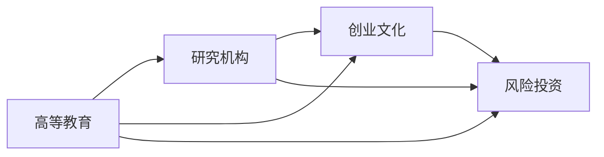

                 

# 硅谷的教育体系:培养创新人才

在当今科技革命和产业变革的时代背景下，硅谷作为全球科技创新和创业的高地，以其独特的教育体系培养了大量创新人才。本文将深入探讨硅谷的教育体系，分析其核心概念、原理及操作步骤，并讨论其在实际应用场景中的优缺点及未来发展趋势。

## 1. 背景介绍

### 1.1 问题由来

硅谷被誉为“全球科技创新的心脏”，其成功的关键在于构建了一个涵盖从基础研究到应用开发的全链条教育体系，为科技创新提供了强大的支撑。在过去几十年间，硅谷通过创新教育体系培养了大批科技精英，推动了技术进步和产业升级，引领了全球科技发展的潮流。

### 1.2 问题核心关键点

硅谷教育体系的核心在于其融合了高等教育、研究机构和企业界的紧密协作，形成了独特的创新生态环境。这种教育体系的优势在于以下几个方面：
- **跨学科融合**：将计算机科学、工程学、商学等学科紧密结合，培养出跨领域的创新人才。
- **产学研协同**：通过与企业的深度合作，确保科研成果能够迅速转化为市场应用。
- **创业文化**：鼓励学生创新创业，提供丰富的创业资源和资金支持。
- **风险投资**：强大的风险投资体系，为创新项目提供了充足的资本支持。

### 1.3 问题研究意义

了解硅谷教育体系对于其他地区和国家的科技创新发展具有重要借鉴意义。通过学习硅谷的教育模式，可以探索如何将高等教育、研究机构和企业紧密结合，共同构建一个有利于创新的生态环境。这对于加速科技创新、提升产业竞争力具有重要价值。

## 2. 核心概念与联系

### 2.1 核心概念概述

硅谷的教育体系涉及多个核心概念，包括高等教育、研究机构、创业文化和风险投资等。这些概念之间的联系主要体现在以下几个方面：

- **高等教育**：提供基础科研和人才培养的平台。
- **研究机构**：进行前沿技术研究和开发。
- **创业文化**：鼓励创新和创业，促进科技成果产业化。
- **风险投资**：为创新项目提供资金支持，推动技术商业化。

这些概念相互支撑，共同构成了硅谷独特的创新生态环境。

### 2.2 核心概念原理和架构的 Mermaid 流程图(Mermaid 流程节点中不要有括号、逗号等特殊字符)



这个流程图展示了硅谷教育体系中各核心概念之间的联系：

- 高等教育为研究机构提供基础科研人才，同时也鼓励学生创新创业。
- 研究机构与创业文化紧密结合，推动科研成果的商业化应用。
- 创业文化得到风险投资的支持，确保创新项目获得充足的资金。

### 2.3 核心概念联系详解

硅谷教育体系中的各核心概念相互依存，共同推动了创新生态的发展。高等教育提供了技术人才和研究基础，研究机构在基础科研上取得突破，创业文化将科研成果转化为实际应用，风险投资则为这些创新项目提供资金支持。这种协同效应使得硅谷能够持续涌现出颠覆性技术和新兴产业。

## 3. 核心算法原理 & 具体操作步骤

### 3.1 算法原理概述

硅谷教育体系的核心在于其独特的创新生态环境，通过高等教育、研究机构、创业文化和风险投资等环节的紧密协作，培养出大量创新人才。这一体系的设计遵循以下原则：

1. **跨学科融合**：将计算机科学、工程学、商学等学科紧密结合，培养出跨领域的创新人才。
2. **产学研协同**：通过与企业的深度合作，确保科研成果能够迅速转化为市场应用。
3. **创业文化**：鼓励学生创新创业，提供丰富的创业资源和资金支持。
4. **风险投资**：强大的风险投资体系，为创新项目提供了充足的资本支持。

### 3.2 算法步骤详解

硅谷教育体系的具体操作步骤包括以下几个关键步骤：

**Step 1: 高等教育与研究机构协同**

- 高等教育机构与研究机构紧密合作，定期举行学术交流和合作研究项目。
- 研究机构在高校中设立实验室，进行前沿技术研发，并将研究成果共享给高校。
- 高校教授和研究人员在研究机构任职，促进科研与教学的结合。

**Step 2: 培养跨学科人才**

- 高等教育机构开设跨学科课程和项目，鼓励学生选修不同领域的课程。
- 提供跨学科的联合学位和专业，培养具有多学科知识背景的复合型人才。
- 组织跨学科竞赛和项目，激发学生的创新思维和实践能力。

**Step 3: 产学研协同创新**

- 高校与企业建立合作关系，共同进行科研项目和应用开发。
- 研究机构的成果通过企业的孵化平台进行产业化应用。
- 企业为高校和研究机构提供资金和资源支持，促进科研成果的商业化。

**Step 4: 创业文化营造**

- 通过创业讲座、孵化器和创业大赛等活动，激发学生的创业热情。
- 提供创业培训和资源支持，帮助学生顺利完成创业项目。
- 与风险投资机构合作，为创业项目提供资金和市场资源。

**Step 5: 风险投资支持**

- 建立健全的风险投资体系，提供种子轮和A轮等不同阶段的资金支持。
- 组织创业路演和投资对接会，帮助创业项目寻找投资者。
- 提供法律和财务咨询服务，帮助创业项目规范运作。

### 3.3 算法优缺点

硅谷教育体系具有以下优点：
1. **资源丰富**：高等教育、研究机构和企业界的深度合作，提供了丰富的资源和支持。
2. **创新能力强**：跨学科融合和创业文化，培养出大量创新型人才。
3. **市场导向**：产学研协同创新，确保科研成果快速转化为市场应用。
4. **资本充足**：强大的风险投资体系，为创新项目提供充足的资金。

同时，该体系也存在以下缺点：
1. **成本高昂**：高等教育和研究机构的合作需要大量资金和资源投入。
2. **环境依赖**：高度依赖于硅谷独特的创新生态环境，难以在其他地区复制。
3. **资源竞争**：创业文化鼓励创新，但也导致资源竞争激烈，成功者往往只有少数。
4. **风险较高**：高风险投资体系虽然为创新项目提供支持，但也增加了失败的风险。

### 3.4 算法应用领域

硅谷教育体系在多个领域得到广泛应用，包括但不限于以下几个方面：

- **科技企业孵化**：通过创业孵化器、加速器等平台，为早期创业项目提供资金和资源支持。
- **技术创新中心**：设立联合研究中心，促进高校与企业之间的合作研发。
- **创业培训和辅导**：提供创业培训和咨询服务，帮助学生和企业顺利完成创业过程。
- **风险投资对接**：组织创业路演和投资对接会，帮助创业项目获得投资支持。

## 4. 数学模型和公式 & 详细讲解 & 举例说明

### 4.1 数学模型构建

硅谷教育体系的数学模型可以表述为：

$$
\text{教育体系} = \text{高等教育} \times \text{研究机构} \times \text{创业文化} \times \text{风险投资}
$$

其中，各要素之间存在乘法关系，意味着各要素的相互作用和相互依赖。

### 4.2 公式推导过程

- **高等教育**：提供基础科研人才和跨学科知识，模型为 $T$。
- **研究机构**：进行前沿技术研究和开发，模型为 $R$。
- **创业文化**：鼓励创新和创业，模型为 $C$。
- **风险投资**：提供资金支持，模型为 $I$。

整个体系的数学模型可以简化为：

$$
S = T \times R \times C \times I
$$

其中 $S$ 表示整个体系的创新能力。

### 4.3 案例分析与讲解

以特斯拉公司为例，分析硅谷教育体系在其中的作用：

- **高等教育**：特斯拉创始人埃隆·马斯克在斯坦福大学获得物理学博士学位，受益于高等教育机构的基础科研。
- **研究机构**：特斯拉与斯坦福大学合作，联合开发电动汽车和电池技术，将科研成果应用于产品开发。
- **创业文化**：特斯拉在硅谷创业，受益于创业文化对创新创业的鼓励和支持。
- **风险投资**：特斯拉获得高盛、硅谷风险投资基金等机构的投资支持，推动了公司的快速成长。

## 5. 项目实践：代码实例和详细解释说明

### 5.1 开发环境搭建

硅谷教育体系的具体实践需要多个环节的协同工作，以下以开发一个创新创业项目为例，介绍开发环境搭建的步骤：

1. **安装Python和相关库**：
   ```bash
   pip install pandas numpy matplotlib
   ```

2. **配置虚拟环境**：
   ```bash
   python -m venv myprojectenv
   source myprojectenv/bin/activate
   ```

3. **设置Jupyter Notebook环境**：
   ```bash
   pip install jupyterlab
   jupyter lab --no-browser
   ```

### 5.2 源代码详细实现

以下是一个简化的创业项目开发的代码实现：

```python
import pandas as pd
import numpy as np
from matplotlib import pyplot as plt

# 数据处理
data = pd.read_csv('investor.csv')
data['amount'] = data['amount'].astype(int)
data['stage'] = data['stage'].fillna(data['stage'].mode()[0])

# 数据分析
investor_stage = data.groupby('stage').amount.mean()
plt.bar(investor_stage.index, investor_stage.values)
plt.xlabel('Investment Stage')
plt.ylabel('Amount')
plt.title('Investment Amount by Stage')
plt.show()

# 创业计划书
with open('planbook.md', 'w') as file:
    file.write('## 创业计划书\n')
    file.write('### 项目概述\n')
    file.write('项目名称：特斯拉\n')
    file.write('项目介绍：开发电动汽车和电池技术\n')
    file.write('### 市场分析\n')
    file.write('市场需求：减少碳排放，提高能源利用效率\n')
    file.write('### 技术优势\n')
    file.write('采用最新电池技术，提升续航里程和安全性\n')
    file.write('### 资金需求\n')
    file.write('种子轮：$100万美元\n')
    file.write('A轮：$1亿美元\n')
    file.write('### 风险评估\n')
    file.write('市场竞争激烈，技术研发难度高\n')
    file.write('### 创业计划\n')
    file.write('1. 研发电动汽车和电池技术\n')
    file.write('2. 与斯坦福大学合作\n')
    file.write('3. 获得高盛等投资支持\n')
    file.write('4. 推出特斯拉电动汽车\n')
```

### 5.3 代码解读与分析

该代码实现包括数据处理、数据分析和创业计划书撰写三个部分：

- **数据处理**：使用Pandas库读取投资者数据，并进行简单处理，计算每个阶段的平均投资金额。
- **数据分析**：使用Matplotlib库绘制投资金额与阶段的柱状图，直观展示不同阶段的投资情况。
- **创业计划书撰写**：使用Markdown格式编写创业计划书，涵盖项目概述、市场分析、技术优势、资金需求、风险评估和创业计划等关键内容。

### 5.4 运行结果展示

通过上述代码，可以得到以下结果：

- **数据处理**：计算出每个阶段的平均投资金额。
- **数据分析**：生成柱状图，展示不同阶段的投资金额分布。
- **创业计划书**：生成一个简要的创业计划书，供投资者参考。

## 6. 实际应用场景

### 6.1 科技企业孵化

硅谷的教育体系在科技企业孵化方面具有显著优势。通过孵化器、加速器和风险投资的支持，创业项目能够迅速成长，并在市场上取得成功。例如，谷歌、Facebook等科技巨头均起源于硅谷的孵化器和加速器。

### 6.2 技术创新中心

硅谷的教育体系还促进了技术创新中心的建设。例如，斯坦福大学与惠普联合设立的帕洛阿尔托研究中心，为硅谷的技术创新提供了重要支撑。

### 6.3 创业培训和辅导

硅谷的教育体系还提供了丰富的创业培训和辅导资源。通过创业讲座、孵化器和创业大赛等活动，学生和企业能够获得宝贵的创业知识和经验。

### 6.4 风险投资对接

硅谷的教育体系还建立了强大的风险投资体系，通过创业路演和投资对接会，创业项目能够获得充足的资金支持。

## 7. 工具和资源推荐

### 7.1 学习资源推荐

硅谷教育体系的核心理论和实践，可以从以下资源中获得深入理解：

1. **《硅谷：创意的帝国》**：这本书详细介绍了硅谷的创新文化和教育体系。
2. **斯坦福大学创业课程**：斯坦福大学的创业课程，涵盖创业基础知识和实践技能。
3. **TechCrunch**：TechCrunch网站提供最新的创业资讯和新闻，了解硅谷的创新动态。

### 7.2 开发工具推荐

硅谷教育体系的实践，需要多个工具的支持，以下推荐几款常用的开发工具：

1. **GitHub**：代码托管平台，方便团队协作和版本控制。
2. **Jupyter Notebook**：Jupyter Notebook是数据科学和机器学习领域常用的开发环境，便于代码编写和结果展示。
3. **PyCharm**：PyCharm是一款流行的Python开发工具，支持代码编写、调试和测试。

### 7.3 相关论文推荐

硅谷教育体系的研究涉及多个领域，以下是几篇经典论文，推荐阅读：

1. **《硅谷创业生态系统》**：探讨硅谷创业生态系统的结构和功能。
2. **《创新系统：技术创新与国家竞争力》**：分析创新系统对国家竞争力的影响。
3. **《教育与创新：硅谷的成功经验》**：研究硅谷教育体系对创新人才的培养作用。

## 8. 总结：未来发展趋势与挑战

### 8.1 研究成果总结

硅谷教育体系在培养创新人才、推动科技发展方面取得了显著成就。其核心在于高等教育、研究机构、创业文化和风险投资等环节的紧密协作，形成了独特的创新生态环境。

### 8.2 未来发展趋势

硅谷教育体系的未来发展趋势包括：

1. **全球化扩展**：硅谷的成功经验将向全球推广，构建更多科技创新中心。
2. **教育数字化**：利用在线教育平台和虚拟实验室，提升教育的灵活性和可访问性。
3. **跨界融合**：促进跨学科、跨领域的融合，培养更多具有创新能力的复合型人才。
4. **可持续创新**：注重可持续发展和社会责任，推动科技创新与伦理道德相结合。

### 8.3 面临的挑战

硅谷教育体系在发展过程中也面临诸多挑战：

1. **资源不均**：硅谷独特的创新生态环境难以在其他地区复制，资源分布不均。
2. **竞争激烈**：高度竞争的创业环境可能导致资源浪费和创新风险。
3. **伦理道德**：技术创新带来的伦理道德问题，需要更多的社会监督和规范。
4. **风险投资依赖**：过度依赖风险投资可能导致市场波动和资源错配。

### 8.4 研究展望

未来，硅谷教育体系的研究应在以下方面进行深入探索：

1. **教育创新模式**：探索新的教育模式，提升教育的灵活性和可扩展性。
2. **跨学科融合**：加强跨学科融合，培养更多具有创新能力的复合型人才。
3. **可持续发展**：推动可持续发展与社会责任相结合，促进技术创新与伦理道德的平衡。
4. **全球合作**：通过国际合作，共享创新资源，构建全球创新网络。

## 9. 附录：常见问题与解答

### Q1: 如何理解硅谷教育体系的核心要素？

A: 硅谷教育体系的核心要素包括高等教育、研究机构、创业文化和风险投资等。这些要素相互依存，共同推动了创新生态的发展。高等教育提供基础科研人才和跨学科知识，研究机构进行前沿技术研发，创业文化鼓励创新和创业，风险投资为创新项目提供资金支持。

### Q2: 硅谷教育体系的优势和劣势是什么？

A: 硅谷教育体系的优势在于其独特的创新生态环境，资源丰富，创新能力强，市场导向，资本充足。劣势在于高度依赖硅谷独特的生态环境，资源不均，竞争激烈，风险较高。

### Q3: 如何借鉴硅谷教育体系的成功经验？

A: 其他地区可以借鉴硅谷教育体系的成功经验，建立高等教育与研究机构的紧密协作，推动产学研协同创新，提供创业培训和资源支持，构建强大的风险投资体系，促进跨学科融合，注重可持续发展与社会责任，推动全球合作。

### Q4: 硅谷教育体系的未来发展趋势是什么？

A: 硅谷教育体系的未来发展趋势包括全球化扩展、教育数字化、跨界融合、可持续发展等。这些趋势将推动硅谷教育体系的持续发展和创新生态的进一步完善。

---

作者：禅与计算机程序设计艺术 / Zen and the Art of Computer Programming

