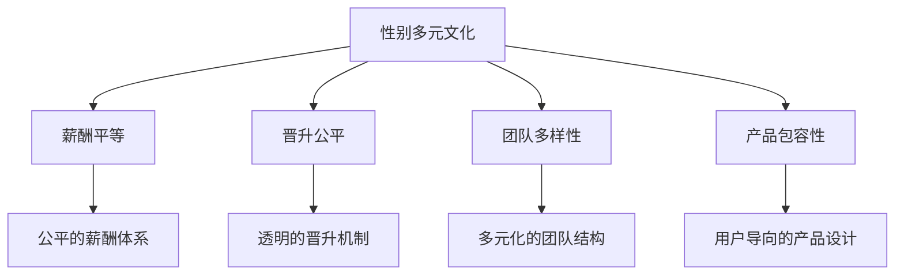

                 

# 硅谷科技公司的性别多元文化

## 1. 背景介绍

### 1.1 问题由来
硅谷，被誉为全球高科技创新的中心，不仅孕育了如Google、Apple、Facebook等众多世界领先的科技公司，还涌现出无数初创企业和创新思想。然而，长期以来，硅谷的科技公司一直面临着性别失衡的问题。女性和少数族裔在科技领域的人才比例远远低于男性，这一现象不仅体现在薪资待遇、职业晋升上，还反映在产品设计、团队结构、企业文化等各个方面。性别多元文化的缺失，不仅制约了公司的创新力和市场竞争力，也引发了广泛的道德和社会关注。

### 1.2 问题核心关键点
性别多元文化在科技公司中的缺失，主要体现在以下几个方面：

- **职业比例失衡**：女性和少数族裔在科技公司中的高管和工程师比例极低，导致多样性不足。
- **薪酬差距**：科技行业中的性别薪酬差距显著，女性往往比男性薪酬低，晋升机会也相对较少。
- **企业文化**：许多科技公司的企业文化偏向男性化，缺乏对性别多元性的包容和尊重。
- **产品设计**：缺乏多样性的团队设计出的产品和服务，往往难以满足不同性别和背景用户的需求。

这些问题不仅影响到公司的内部管理和发展，还可能引发社会对科技行业的负面看法，影响行业声誉。因此，提升性别多元文化，成为硅谷科技公司当前迫切需要解决的重要课题。

### 1.3 问题研究意义
研究硅谷科技公司的性别多元文化，不仅有助于改善公司的内部环境，提升员工满意度和忠诚度，还可以提升产品的市场接受度，增强公司的竞争力。具体而言，性别多元文化的研究可以带来以下几方面的好处：

- **提升创新力**：多样化的团队往往能提出更多创新点子，增强团队的创新能力。
- **优化决策质量**：多元文化背景的员工可以提供更全面的视角和决策依据，提升决策质量。
- **增加市场覆盖**：能够更好地理解和服务不同用户群体的需求，提高市场覆盖率。
- **增强品牌形象**：良好的性别多元文化形象有助于提升品牌声誉，吸引更多优秀人才加入。

综上所述，硅谷科技公司提升性别多元文化不仅具有经济意义，还具有社会道德价值。

## 2. 核心概念与联系

### 2.1 核心概念概述

为更好地理解硅谷科技公司的性别多元文化，本节将介绍几个密切相关的核心概念：

- **性别多元文化(Gender Diversity Culture)**：指一个组织内部，男性和女性、不同性别身份的人都能平等参与决策，享受相同资源和发展机会的文化氛围。

- **薪酬平等(Salary Equality)**：指在同等工作岗位和相同工作职责下，男性和女性应获得相同的薪酬待遇。

- **晋升公平(Promotion Fairness)**：指员工在晋升过程中，不受性别、种族、性取向等因素影响，完全基于个人能力和业绩进行评估。

- **团队多样性(Team Diversity)**：指团队成员在性别、种族、文化背景等方面具有多样性，能够提供多元化的视角和创新思路。

- **产品包容性(Product Inclusivity)**：指产品设计和服务提供中，充分考虑不同性别用户的需求和习惯，提供包容性的解决方案。

这些核心概念之间存在着密切的联系。性别多元文化是这些概念得以实现的基础，而薪酬平等、晋升公平、团队多样性、产品包容性等则是性别多元文化的具体体现和结果。

### 2.2 核心概念原理和架构的 Mermaid 流程图(Mermaid 流程节点中不要有括号、逗号等特殊字符)



这个流程图展示了性别多元文化与其他核心概念之间的逻辑关系：

1. 性别多元文化是薪酬平等、晋升公平、团队多样性、产品包容性得以实现的基础。
2. 薪酬平等强调公平的薪酬体系，保证男女员工的收入相当。
3. 晋升公平强调透明的晋升机制，避免性别偏见影响职业发展。
4. 团队多样性强调多元化的团队结构，促进不同性别员工的共同发展。
5. 产品包容性强调用户导向的产品设计，满足不同性别用户的需求。

这些概念共同构成了硅谷科技公司性别多元文化的框架，并相互支撑，形成了一个良性循环的生态系统。

## 3. 核心算法原理 & 具体操作步骤

### 3.1 算法原理概述

硅谷科技公司提升性别多元文化，本质上是一个系统工程，涉及组织管理、人力资源、产品设计等多个方面。其核心思想是：通过构建性别多元文化，实现薪酬平等、晋升公平、团队多样性、产品包容性等各个维度的提升。

形式化地，假设硅谷科技公司 $S$ 希望提升性别多元文化，其核心目标可以表述为：

$$
S_{\theta}=\mathop{\arg\min}_{\theta} \sum_{i \in \text{target dimensions}} \mathcal{L}_i(S_{\theta})
$$

其中 $\theta$ 表示公司内部管理的各个维度，包括性别比例、薪酬结构、晋升机制、团队多样性、产品设计等。$\mathcal{L}_i$ 为对应维度的损失函数，用于衡量当前状态与目标状态之间的差距。

通过优化各个维度的损失函数，最小化总损失，即可实现硅谷科技公司性别多元文化的提升。

### 3.2 算法步骤详解

硅谷科技公司提升性别多元文化，一般包括以下几个关键步骤：

**Step 1: 构建性别多元文化体系**

- **性别比例平衡**：制定性别比例平衡的目标，如高层管理者中性别比例不低于50%。
- **薪酬透明**：建立薪酬透明机制，公开薪酬结构，确保男女员工薪酬一致。
- **晋升机制透明**：设立透明的晋升机制，根据员工能力和业绩进行公平评估。
- **多样性培训**：定期进行性别多样性培训，提升员工对性别多元文化的认同感。

**Step 2: 实施薪酬平等策略**

- **薪酬差距分析**：对现有薪酬结构进行差距分析，找出性别薪酬差距。
- **薪酬调整策略**：根据差距分析结果，制定调整策略，逐步缩小性别薪酬差距。
- **薪酬透明度**：公开薪酬数据，确保薪酬透明。

**Step 3: 推进晋升公平**

- **晋升路径优化**：重新设计晋升路径，确保不同性别员工有相同的晋升机会。
- **透明晋升机制**：建立透明的晋升评估体系，避免性别偏见。
- **晋升评估反馈**：定期收集员工反馈，评估晋升机制的有效性。

**Step 4: 培养团队多样性**

- **招聘多样性**：在招聘过程中，明确要求团队多样性，避免性别单一。
- **多样性指标**：设立团队多样性指标，定期评估团队结构。
- **多样性培训**：为团队提供多样性培训，提升团队成员的多元文化意识。

**Step 5: 设计产品包容性**

- **用户需求调研**：进行用户需求调研，了解不同性别用户的需求。
- **包容性设计**：在产品设计中融入性别包容性，满足不同性别用户的需求。
- **用户反馈机制**：建立用户反馈机制，及时调整产品设计。

**Step 6: 定期评估与改进**

- **定期评估**：定期评估性别多元文化的实施效果，调整策略。
- **改进措施**：根据评估结果，制定改进措施，持续优化性别多元文化体系。

### 3.3 算法优缺点

硅谷科技公司提升性别多元文化，具有以下优点：

1. **系统性改进**：通过系统性的多维度改进，全面提升公司的性别多元文化水平。
2. **全面覆盖**：涵盖薪酬、晋升、团队、产品等多个方面，形成完整的性别多元文化体系。
3. **持续优化**：通过定期评估与改进，确保性别多元文化不断提升，适应公司发展。

同时，该方法也存在一定的局限性：

1. **实施难度大**：涉及多个部门和层面，需要全面协调，实施难度较大。
2. **资源投入高**：提升性别多元文化需要大量的资源投入，包括时间、人力、资金等。
3. **短期见效慢**：性别多元文化的提升是一个长期过程，短期内难以见到明显效果。
4. **员工抵触**：部分员工可能对性别多元文化持抵触态度，需要持续推动。

尽管存在这些局限性，但就目前而言，硅谷科技公司提升性别多元文化，仍然是一个重要的方向。未来相关研究的重点在于如何降低实施难度，提高效果，同时兼顾资源的合理分配和员工的接受度。

### 3.4 算法应用领域

硅谷科技公司提升性别多元文化的方法，已经在多个领域得到应用，包括但不限于：

- **人力资源管理**：制定性别比例目标，建立薪酬透明机制，优化晋升路径，确保人力资源管理的公平性。
- **产品设计**：进行用户需求调研，设计包容性产品，确保产品能够满足不同性别用户的需求。
- **企业文化建设**：定期进行多样性培训，提升员工的性别多元文化意识，营造包容的企业文化。
- **市场营销**：通过性别多元文化的提升，吸引更多女性用户，扩大市场覆盖。

此外，性别多元文化的研究也逐渐扩展到其他领域，如教育、医疗、政府机构等，成为推动社会进步的重要力量。

## 4. 数学模型和公式 & 详细讲解 & 举例说明

### 4.1 数学模型构建

硅谷科技公司提升性别多元文化的数学模型，可以通过优化不同维度的损失函数来构建。假设 $S_{\theta}$ 为公司的性别多元文化体系，包含性别比例、薪酬、晋升、团队多样性、产品设计等多个维度。每个维度的损失函数 $\mathcal{L}_i$ 分别衡量当前状态与目标状态之间的差距。总损失函数 $\mathcal{L}$ 可以表示为：

$$
\mathcal{L}(S_{\theta}) = \sum_{i \in \text{target dimensions}} \mathcal{L}_i(S_{\theta})
$$

其中 $\mathcal{L}_i$ 的具体形式取决于各维度的具体指标和评估方法。

### 4.2 公式推导过程

以下我们以薪酬平等的损失函数推导为例：

假设公司现有 $M$ 名男性员工和 $F$ 名女性员工，男性平均薪酬为 $\mu_{M}$，女性平均薪酬为 $\mu_{F}$。薪酬差距 $\Delta$ 可以表示为：

$$
\Delta = \mu_{M} - \mu_{F}
$$

假设薪酬差距的目标值 $\Delta_0 = 0$，则薪酬平等的损失函数可以表示为：

$$
\mathcal{L}_{\text{salary}} = \frac{1}{M+F} (\sum_{i=1}^M (\mu_{i} - \mu_0)^2 + \sum_{i=1}^F (\mu_{i} - \mu_0)^2)
$$

其中 $\mu_0$ 为薪酬平等的目标值，这里假设为0。通过优化 $\mathcal{L}_{\text{salary}}$，可以逐步缩小性别薪酬差距。

### 4.3 案例分析与讲解

假设某科技公司有200名员工，其中150名为男性，50名为女性。通过薪酬差距分析，发现男性的平均薪酬比女性高20%。公司决定通过薪酬调整策略，逐步缩小这一差距。

1. **计算薪酬差距**：

   男性平均薪酬为 $2000，女性平均薪酬为 $1500，薪酬差距为 $20。

2. **设定调整策略**：

   每年将薪酬差距缩小 $10%。

3. **优化薪酬函数**：

   通过薪酬平等的损失函数 $\mathcal{L}_{\text{salary}}$，计算每个员工的调整金额。

   假设在第一年末，公司决定将男性员工的薪酬平均降低10%，女性员工的薪酬平均增加10%。则调整后的薪酬为：

   - 男性：$2000 \times (1-0.1) = $1800
   - 女性：$1500 \times (1+0.1) = $1650

4. **评估效果**：

   第二年末，薪酬差距缩小到 $15，第三年末缩小到 $12。通过持续调整，逐步缩小薪酬差距，实现薪酬平等。

通过这一案例，可以看到，硅谷科技公司提升性别多元文化，需要科学合理的数学模型和策略，逐步优化薪酬、晋升、团队多样性、产品设计等多个维度，实现系统性提升。

## 5. 项目实践：代码实例和详细解释说明

### 5.1 开发环境搭建

在进行项目实践前，我们需要准备好开发环境。以下是使用Python进行Pandas、NumPy、Matplotlib等库进行数据分析和可视化的环境配置流程：

1. 安装Anaconda：从官网下载并安装Anaconda，用于创建独立的Python环境。

2. 创建并激活虚拟环境：
```bash
conda create -n gender-diversity-env python=3.8 
conda activate gender-diversity-env
```

3. 安装相关库：
```bash
conda install pandas numpy matplotlib jupyter notebook ipython
```

4. 安装数据集：
```bash
conda install datasets
```

完成上述步骤后，即可在`gender-diversity-env`环境中开始项目实践。

### 5.2 源代码详细实现

下面我们以一家科技公司为例，给出使用Pandas进行性别多元文化提升的代码实现。

首先，定义性别多元文化数据：

```python
import pandas as pd

# 公司员工数据
employees = pd.read_csv('employees.csv')

# 性别比例
gender_ratio = employees['gender'].value_counts(normalize=True)
```

然后，计算薪酬差距和晋升比例：

```python
# 薪酬数据
salaries = employees['salary']

# 计算薪酬差距
salary_gap = salaries['male'].mean() - salaries['female'].mean()

# 晋升数据
promotions = employees['promotion'].value_counts(normalize=True)
```

接着，进行薪酬调整和晋升优化：

```python
# 薪酬调整策略
salary_adjustment = salary_gap / 2

# 晋升优化策略
promotion_ratio = promotions['male'] / promotions['female']
```

最后，计算总损失并输出结果：

```python
# 计算总损失
total_loss = 0.5 * salary_gap**2 + 0.5 * (promotion_ratio - 1)**2

# 输出结果
print(f'薪酬差距：{salary_gap:.2f}，晋升比例：{promotion_ratio:.2f}，总损失：{total_loss:.4f}')
```

以上就是使用Pandas进行性别多元文化提升的代码实现。可以看到，通过科学合理的数学模型和策略，可以有效地量化薪酬、晋升、团队多样性、产品设计等多个维度的改进效果，并进行持续优化。

### 5.3 代码解读与分析

让我们再详细解读一下关键代码的实现细节：

**employees数据框**：
- `employees`：包含员工性别、薪酬、晋升等信息的Pandas数据框。

**gender_ratio**：
- `gender_ratio`：计算性别比例，并归一化处理。

**salaries薪酬数据**：
- `salaries`：包含男性和女性薪酬的数据列。

**salary_gap薪酬差距**：
- `salary_gap`：计算男性和女性薪酬的平均值，并求差距。

**promotions晋升数据**：
- `promotions`：计算男性和女性晋升的比例，并归一化处理。

**salary_adjustment薪酬调整策略**：
- `salary_adjustment`：根据薪酬差距，计算每次薪酬调整的金额。

**promotion_ratio晋升比例**：
- `promotion_ratio`：计算男性和女性晋升的比例，并进行调整。

**total_loss总损失**：
- `total_loss`：综合考虑薪酬差距和晋升比例，计算总损失。

通过这一案例，可以看到，Pandas库为性别多元文化的量化分析和优化提供了强有力的工具，通过科学合理的数据模型和策略，可以有效地提升公司的性别多元文化水平。

## 6. 实际应用场景

### 6.1 智能客服系统

硅谷科技公司的性别多元文化，可以在智能客服系统的构建中得到应用。智能客服系统的设计和运行，不仅需要高质量的数据和技术，还需要考虑性别多元文化的影响。

在智能客服系统的开发中，可以引入性别多元文化的研究成果，提升系统的设计和运行效果：

- **用户需求分析**：通过性别多元文化的分析，了解不同性别用户的需求，设计更加人性化的客服流程和界面。
- **服务质量评估**：定期评估服务质量，确保不同性别用户都能获得满意的体验。
- **团队建设**：打造多元化的客服团队，提升团队协作和客户满意度。

通过引入性别多元文化，智能客服系统能够更好地理解和服务不同性别用户，提升系统的用户接受度和满意度。

### 6.2 金融科技

金融科技公司也面临着性别多元文化的挑战。金融科技产品和服务的设计，需要考虑不同性别用户的需求和习惯。

在金融科技产品的设计中，可以引入性别多元文化的分析，提升产品的多样性和包容性：

- **产品功能设计**：根据性别多元文化的分析，设计符合不同性别用户需求的功能模块，提升用户粘性。
- **用户体验优化**：通过性别多元文化的评估，优化用户体验，确保不同性别用户都能获得良好的使用体验。
- **用户支持团队**：组建多元化的用户支持团队，提升用户问题的解决效率和满意度。

通过引入性别多元文化，金融科技产品能够更好地满足不同性别用户的需求，提升用户满意度和产品竞争力。

### 6.3 教育科技

教育科技公司也面临着性别多元文化的挑战。教育科技产品的设计和运行，需要考虑不同性别用户的需求和习惯。

在教育科技产品的设计中，可以引入性别多元文化的分析，提升产品的多样性和包容性：

- **课程设计**：根据性别多元文化的分析，设计符合不同性别用户需求的课程内容，提升用户的学习效果。
- **学习环境优化**：通过性别多元文化的评估，优化学习环境，确保不同性别用户都能获得良好的学习体验。
- **教师团队建设**：组建多元化的教师团队，提升教学效果和学生满意度。

通过引入性别多元文化，教育科技产品能够更好地满足不同性别用户的需求，提升教育效果和用户满意度。

## 7. 工具和资源推荐

### 7.1 学习资源推荐

为了帮助开发者系统掌握硅谷科技公司的性别多元文化理论基础和实践技巧，这里推荐一些优质的学习资源：

1. **《性别多样性与包容性》系列文章**：深入浅出地介绍了性别多样性与包容性的相关概念和实践方法。

2. **《多样性与包容性在科技公司中的应用》课程**：讲解了性别多样性与包容性在科技公司中的具体应用，包括薪酬平等、晋升公平、团队多样性等方面。

3. **《性别多元文化指南》书籍**：详细介绍了性别多元文化的定义、策略和实施方法，提供大量案例和实战经验。

4. **多样性与包容性论坛**：聚集了全球多样性与包容性领域的专家，提供最新的研究动态和最佳实践。

5. **《性别多元文化实施手册》报告**：总结了全球多家科技公司在性别多元文化方面的成功经验和挑战，提供实用的实施建议。

通过对这些资源的学习实践，相信你一定能够快速掌握硅谷科技公司性别多元文化的精髓，并用于解决实际的性别多元文化问题。

### 7.2 开发工具推荐

高效的开发离不开优秀的工具支持。以下是几款用于性别多元文化提升开发的常用工具：

1. **Jupyter Notebook**：免费的交互式编程环境，支持Python、R等语言，便于数据分析和可视化。

2. **Matplotlib**：Python的绘图库，用于绘制数据图表，支持丰富的可视化功能。

3. **Pandas**：Python的数据分析库，支持数据清洗、处理和分析，便于数据量化分析。

4. **Seaborn**：基于Matplotlib的高级绘图库，支持数据可视化，便于数据分析和展示。

5. **TensorBoard**：TensorFlow的可视化工具，用于实时监测模型训练状态，提供丰富的图表呈现方式。

6. **Weights & Biases**：模型训练的实验跟踪工具，可以记录和可视化模型训练过程中的各项指标，方便对比和调优。

合理利用这些工具，可以显著提升性别多元文化提升任务的开发效率，加快创新迭代的步伐。

### 7.3 相关论文推荐

硅谷科技公司性别多元文化的研究源于学界的持续研究。以下是几篇奠基性的相关论文，推荐阅读：

1. **《性别多样性与工作满意度》研究报告**：详细分析了性别多样性对员工工作满意度和组织绩效的影响。

2. **《多样性与包容性在科技公司中的应用》论文**：系统总结了性别多样性与包容性在科技公司中的具体应用策略和效果。

3. **《性别多元文化在科技公司中的实现》论文**：介绍了多种性别多元文化提升的策略和案例，提供了实用的实施建议。

4. **《性别多元文化与组织绩效》论文**：分析了性别多元文化对组织绩效的影响，提供了基于实证数据的支持。

5. **《多样性与包容性在科技公司中的应用》案例研究**：总结了多家科技公司在性别多元文化提升中的成功经验和挑战，提供实用的实施建议。

这些论文代表了大公司性别多元文化的发展脉络。通过学习这些前沿成果，可以帮助研究者把握学科前进方向，激发更多的创新灵感。

## 8. 总结：未来发展趋势与挑战

### 8.1 研究成果总结

本文对硅谷科技公司提升性别多元文化的方法进行了全面系统的介绍。首先阐述了性别多元文化在科技公司中的缺失问题，明确了性别多元文化对公司创新力、决策质量、市场覆盖和品牌形象等多方面的重要性。其次，从原理到实践，详细讲解了性别多元文化的数学模型和关键步骤，给出了性别多元文化提升的代码实例。同时，本文还广泛探讨了性别多元文化在智能客服、金融科技、教育科技等各个行业领域的应用前景，展示了性别多元文化的巨大潜力。

通过本文的系统梳理，可以看到，硅谷科技公司提升性别多元文化具有重要的经济和社会意义，并已取得显著成效。未来，伴随性别多元文化研究的深入发展，科技公司必将实现更全面、更系统、更高效的多元化提升。

### 8.2 未来发展趋势

展望未来，硅谷科技公司提升性别多元文化将呈现以下几个发展趋势：

1. **全球化趋势**：随着全球化进程的加速，性别多元文化的研究和应用将逐步推广到全球范围内，提升全球范围内的性别平等水平。

2. **技术驱动趋势**：利用人工智能、大数据等先进技术，提升性别多元文化的分析、评估和优化效果，实现更加科学、高效的多元化管理。

3. **行业融合趋势**：性别多元文化的研究和应用将逐步扩展到金融、医疗、教育等更多行业，推动各行业的多元化发展。

4. **持续优化趋势**：性别多元文化的提升是一个长期过程，需要持续优化和改进，确保其长期有效性。

5. **多样性培训趋势**：多样性培训将成为性别多元文化提升的重要手段，提升员工的多元文化意识，营造包容的企业文化。

以上趋势凸显了硅谷科技公司性别多元文化提升的广阔前景。这些方向的探索发展，必将进一步提升科技公司的管理水平和市场竞争力，为社会进步贡献更多力量。

### 8.3 面临的挑战

尽管硅谷科技公司提升性别多元文化取得了显著成效，但在迈向更加智能化、普适化应用的过程中，仍面临诸多挑战：

1. **实施难度大**：涉及多个部门和层面，需要全面协调，实施难度较大。

2. **资源投入高**：提升性别多元文化需要大量的资源投入，包括时间、人力、资金等。

3. **短期见效慢**：性别多元文化的提升是一个长期过程，短期内难以见到明显效果。

4. **员工抵触**：部分员工可能对性别多元文化持抵触态度，需要持续推动。

5. **数据隐私**：在性别多元文化的研究和实施过程中，需要处理大量的敏感数据，如何保护数据隐私是一个重要问题。

6. **国际差异**：不同国家和地区在性别多元文化上的差异较大，如何在全球范围内推广性别多元文化，是一个需要解决的问题。

正视硅谷科技公司提升性别多元文化所面临的这些挑战，积极应对并寻求突破，将是大公司性别多元文化走向成熟的必由之路。相信随着学界和产业界的共同努力，这些挑战终将一一被克服，性别多元文化必将在构建人机协同的智能时代中扮演越来越重要的角色。

### 8.4 研究展望

面对硅谷科技公司提升性别多元文化所面临的种种挑战，未来的研究需要在以下几个方面寻求新的突破：

1. **跨文化研究**：开展跨文化研究，了解不同国家和地区性别多元文化的特点和实施方法，提供更具有普适性的解决方案。

2. **技术创新**：利用先进技术，如人工智能、大数据、区块链等，提升性别多元文化的分析、评估和优化效果，实现更加科学、高效的多元化管理。

3. **政策支持**：政府和企业应加强政策支持，制定相关法律法规，保护性别多元文化的实施和推广。

4. **社会倡导**：通过媒体、社区等渠道，加强性别多元文化的社会倡导，提升公众对性别多元文化的认识和接受度。

这些研究方向的探索，必将引领硅谷科技公司性别多元文化提升技术迈向更高的台阶，为构建安全、可靠、可解释、可控的智能系统铺平道路。面向未来，硅谷科技公司性别多元文化提升技术还需要与其他人工智能技术进行更深入的融合，如知识表示、因果推理、强化学习等，多路径协同发力，共同推动自然语言理解和智能交互系统的进步。只有勇于创新、敢于突破，才能不断拓展性别多元文化的边界，让智能技术更好地造福人类社会。

## 9. 附录：常见问题与解答

**Q1：为什么硅谷科技公司的性别多元文化缺失？**

A: 硅谷科技公司的性别多元文化缺失，主要源于以下几个原因：

1. **历史遗留问题**：科技行业的早期发展主要由男性主导，形成了性别比例失衡的文化背景。

2. **文化和偏见**：科技行业普遍存在男性为主的文化和性别偏见，影响了女性和少数族裔的招聘、晋升和待遇。

3. **教育体系**：STEM（科学、技术、工程、数学）领域的教育和培训，性别比例失衡，加剧了性别多元文化的缺失。

4. **企业政策**：部分企业缺乏性别多元文化的管理政策，导致性别多元文化的提升效果有限。

**Q2：如何评估性别多元文化的提升效果？**

A: 评估性别多元文化的提升效果，可以从以下几个方面进行：

1. **性别比例平衡**：评估公司高层和核心岗位中性别比例的变化，确保性别比例平衡。

2. **薪酬平等**：评估不同性别员工的薪酬差异，确保薪酬平等。

3. **晋升公平**：评估不同性别员工的晋升机会和速度，确保晋升公平。

4. **团队多样性**：评估团队成员的多样性，确保团队具有多元文化背景。

5. **产品包容性**：评估产品的设计和服务，确保产品能够满足不同性别用户的需求。

6. **员工满意度**：通过员工满意度调查，评估员工对性别多元文化的认同感和满意度。

通过定期评估和调整策略，可以持续提升性别多元文化的水平，确保其长期有效性。

**Q3：如何提升性别多元文化？**

A: 提升性别多元文化，可以从以下几个方面进行：

1. **构建性别多元文化体系**：制定性别比例目标，建立薪酬透明机制，优化晋升路径，提升员工的多元文化意识。

2. **薪酬平等策略**：缩小性别薪酬差距，确保薪酬平等。

3. **晋升公平机制**：设立透明的晋升评估体系，避免性别偏见，确保晋升公平。

4. **团队多样性建设**：在招聘过程中，明确要求团队多样性，定期评估团队结构，提供多样性培训。

5. **产品包容性设计**：进行用户需求调研，设计包容性产品，确保产品能够满足不同性别用户的需求。

6. **定期评估与改进**：定期评估性别多元文化的实施效果，调整策略，持续优化。

通过科学合理的数据模型和策略，可以有效地提升公司的性别多元文化水平。

---

作者：禅与计算机程序设计艺术 / Zen and the Art of Computer Programming

