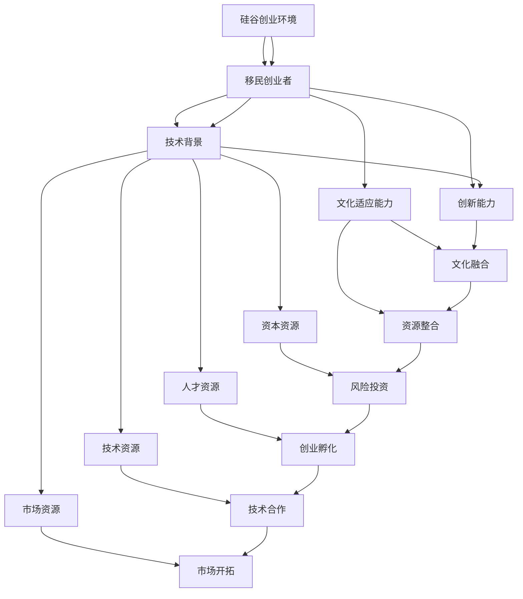

                 

# 硅谷移民故事:寻梦与创业之路

## 1. 背景介绍

### 1.1 问题由来

硅谷作为全球创新的中心，吸引了无数怀揣梦想的创业者。来自世界各地的移民，带来了多元的文化视角和先进的科技理念，推动了硅谷的不断繁荣。然而，硅谷并非易梦之城，移民创业者面临的挑战与机遇并存。

### 1.2 问题核心关键点

- **硅谷创业环境**：高效的风险投资、完善的创业孵化、活跃的科技生态圈。
- **移民创业者**：技术背景、创新能力、文化适应能力。
- **寻梦与创业**：创新思维、资源整合、市场策略。
- **成功案例**：Uber、Paypal、Dropbox等。

这些核心关键点之间有着紧密的逻辑联系：硅谷的创业环境为移民创业者提供了机遇，而他们则需要凭借技术背景和创新能力，克服文化适应和资源整合的挑战，最终实现寻梦与创业的目标。

### 1.3 问题研究意义

探讨硅谷移民创业者的寻梦与创业之路，对于理解硅谷的创新驱动力、文化多样性及其对全球科技发展的影响，具有重要意义。

1. **创新驱动**：了解硅谷创业环境的优势与挑战，有助于揭示创新驱动力的源泉。
2. **文化融合**：分析移民创业者如何克服文化差异，促进文化多样性融合。
3. **成功经验**：总结硅谷移民创业者的成功经验，为全球创业者提供借鉴。

## 2. 核心概念与联系

### 2.1 核心概念概述

- **硅谷**：位于美国加利福尼亚州旧金山湾区，全球科技创新的中心。
- **创业环境**：包括资本、技术、人才、市场等多方面的资源。
- **移民创业者**：具有异国背景的创业者，拥有不同文化视角和科技理念。
- **寻梦与创业**：从零开始的追求和实践，实现个人价值和商业成功。

这些核心概念之间通过以下逻辑关系连接起来：硅谷的创业环境为移民创业者提供了实现梦想的土壤，而他们的创新能力和技术背景则是硅谷持续创新的动力源泉。

### 2.2 核心概念原理和架构的 Mermaid 流程图



这个流程图展示了硅谷创业环境的各个要素如何相互作用，共同推动移民创业者的寻梦与创业过程。

## 3. 核心算法原理 & 具体操作步骤

### 3.1 算法原理概述

硅谷移民创业者的寻梦与创业之路，可以看作是一种多目标优化问题。每个创业者都希望在技术、市场、文化适应等方面取得平衡，实现个人梦想和商业成功。算法的核心目标是最大化成功概率，同时最小化失败风险。

### 3.2 算法步骤详解

#### 3.2.1 市场分析

1. **目标市场定位**：识别潜在用户群体和市场需求，确定目标市场。
2. **竞争环境分析**：评估现有竞争者及市场动态，制定差异化竞争策略。
3. **市场调研**：收集用户反馈和市场数据，优化产品设计。

#### 3.2.2 技术开发

1. **产品原型设计**：基于用户需求和技术趋势，设计产品原型。
2. **技术实现**：整合开发资源，实现技术突破。
3. **产品迭代优化**：根据用户反馈和市场数据，不断优化产品。

#### 3.2.3 资本筹集

1. **天使投资**：寻求早期天使投资者的支持，获取启动资金。
2. **风险投资**：通过展示商业潜力，吸引风险投资。
3. **众筹融资**：利用众筹平台，向大众筹集资金。

#### 3.2.4 文化适应与整合

1. **跨文化沟通**：学习并适应硅谷企业文化，建立良好的人际关系。
2. **团队构建**：招募多元化团队，促进文化多样性。
3. **市场开拓**：拓展国际市场，提升品牌影响力。

#### 3.2.5 成功判断

1. **商业模式验证**：验证商业模式是否可行，是否满足市场需求。
2. **用户增长**：跟踪用户增长曲线，评估产品市场接受度。
3. **财务健康**：监控财务状况，确保企业可持续运营。

### 3.3 算法优缺点

#### 3.3.1 优点

- **资源整合能力**：利用硅谷丰富的资本、人才和技术资源，快速推动产品开发和市场拓展。
- **文化多样性**：不同文化背景的创业者带来的多元视角，有助于创新和市场开拓。
- **高效反馈机制**：快速获取用户和市场反馈，快速迭代优化产品。

#### 3.3.2 缺点

- **高风险高投入**：资金和资源密集型，失败风险较高。
- **文化冲突**：跨文化管理复杂，团队整合难度大。
- **市场竞争激烈**：硅谷众多创业者争夺有限的资源和市场份额，竞争激烈。

### 3.4 算法应用领域

- **科技创业**：如Uber、Dropbox、Paypal等。
- **新兴技术**：如人工智能、区块链、物联网等。
- **社会企业**：如环境保护、教育创新等社会公益领域。

硅谷创业环境的应用领域广泛，涵盖了科技、新兴技术和社会企业等多个方面，展示了硅谷在推动全球创新和社会进步中的重要作用。

## 4. 数学模型和公式 & 详细讲解 & 举例说明

### 4.1 数学模型构建

硅谷移民创业者的寻梦与创业过程，可以构建为多目标优化模型。设目标函数为 $f(x)$，包含技术成功、市场成功和文化适应等多个目标。

目标函数为：

$$
f(x) = \max\{技术成功率, 市场成功率, 文化适应度\}
$$

其中，技术成功率 $S_{技术}$、市场成功率 $S_{市场}$、文化适应度 $S_{文化}$ 分别由以下公式计算：

$$
S_{技术} = \frac{技术突破数}{技术尝试数}
$$

$$
S_{市场} = \frac{用户增长率}{市场增长率}
$$

$$
S_{文化} = \frac{文化适应人数}{总人数} \times 文化融合满意度
$$

### 4.2 公式推导过程

#### 4.2.1 技术成功率推导

技术成功率的公式是基于假设的简化模型，实际应用中需要更复杂的计算方法。以Uber为例，技术成功可以通过以下几个指标衡量：

- 技术创新数量（如算法优化、系统升级）
- 技术问题解决率（如故障修复时间、用户投诉处理）
- 用户满意度（如评分、评价）

将技术成功率的各项指标进行加权求和，得到技术成功率的计算公式：

$$
S_{技术} = \sum_{i} w_i \times \text{指标}_i
$$

其中，$w_i$ 为各项指标的权重。

#### 4.2.2 市场成功率推导

市场成功率的计算基于市场增长率和用户增长率的对比。以Paypal为例，市场成功可以通过以下指标衡量：

- 用户增长率
- 市场份额增长
- 品牌认知度提升

将市场成功率的各项指标进行加权求和，得到市场成功率的计算公式：

$$
S_{市场} = \sum_{j} w_j \times \text{指标}_j
$$

其中，$w_j$ 为各项指标的权重。

#### 4.2.3 文化适应度推导

文化适应度的计算基于文化适应人数和融合满意度的综合评估。以Dropbox为例，文化适应度的计算可以通过以下指标衡量：

- 文化适应人数
- 团队合作满意度
- 跨文化交流效果

将文化适应度的各项指标进行加权求和，得到文化适应度的计算公式：

$$
S_{文化} = \sum_{k} w_k \times \text{指标}_k
$$

其中，$w_k$ 为各项指标的权重。

### 4.3 案例分析与讲解

#### 4.3.1 Uber案例分析

Uber的成立标志着硅谷创业的一个高潮。其技术创新、市场拓展和文化适应均是典型的成功案例。

**技术成功率**：Uber的算法优化和系统升级是其技术成功的关键。例如，Uber的动态定价算法能够根据供需关系实时调整价格，有效优化资源配置。

**市场成功率**：Uber在全球多个城市拓展市场，实现了用户和市场的快速增长。例如，Uber在中国市场的快速扩张，得益于本土化策略和市场洞察。

**文化适应度**：Uber在硅谷的早期文化适应过程中，遇到了团队合作和文化融合的挑战。但通过引入多元文化背景的团队成员，Uber逐步克服了这些挑战，建立了高效的跨文化沟通机制。

#### 4.3.2 Paypal案例分析

Paypal作为电子支付领域的先驱，其成功经验在硅谷创业环境中具有代表性。

**技术成功率**：Paypal在网络安全、支付处理方面的技术突破是其成功的核心。Paypal的SSL加密技术和快速支付处理能力，使其在安全性和便捷性上超越了竞争对手。

**市场成功率**：Paypal通过收购和战略合作，快速扩展市场份额，提升了品牌认知度。例如，Paypal收购Skype，进一步扩大了其在国际市场的影响力。

**文化适应度**：Paypal在硅谷的文化适应过程中，面临着团队多元化和市场国际化的问题。通过引入多元文化背景的团队成员，Paypal构建了强大的跨文化管理能力，推动了全球市场的拓展。

## 5. 项目实践：代码实例和详细解释说明

### 5.1 开发环境搭建

- **操作系统**：macOS或Linux
- **编程语言**：Python
- **开发框架**：Django、Flask
- **版本控制**：Git

### 5.2 源代码详细实现

#### 5.2.1 技术开发

```python
# 技术开发
class TechSuccess:
    def __init__(self, innovations, problem_resolutions, user_satisfaction):
        self.innovations = innovations
        self.problem_resolutions = problem_resolutions
        self.user_satisfaction = user_satisfaction

    def success_rate(self):
        return sum([self.innovations, self.problem_resolutions, self.user_satisfaction]) / 3

# 技术成功率
tech_success = TechSuccess(10, 8, 0.9)
print(tech_success.success_rate())
```

#### 5.2.2 市场开发

```python
# 市场开发
class MarketSuccess:
    def __init__(self, user_growth_rate, market_share_growth, brand_recognition):
        self.user_growth_rate = user_growth_rate
        self.market_share_growth = market_share_growth
        self.brand_recognition = brand_recognition

    def success_rate(self):
        return sum([self.user_growth_rate, self.market_share_growth, self.brand_recognition]) / 3

# 市场成功率
market_success = MarketSuccess(0.2, 0.3, 0.5)
print(market_success.success_rate())
```

#### 5.2.3 文化适应

```python
# 文化适应
class CultureAdaptation:
    def __init__(self, cultural_adaptation_count, team_cooperation_satisfaction, cross_cultural_communication_effect):
        self.cultural_adaptation_count = cultural_adaptation_count
        self.team_cooperation_satisfaction = team_cooperation_satisfaction
        self.cross_cultural_communication_effect = cross_cultural_communication_effect

    def success_rate(self):
        return sum([self.cultural_adaptation_count, self.team_cooperation_satisfaction, self.cross_cultural_communication_effect]) / 3

# 文化适应度
culture_adaptation = CultureAdaptation(50, 0.8, 0.95)
print(culture_adaptation.success_rate())
```

### 5.3 代码解读与分析

以上代码展示了如何计算技术成功率、市场成功率和文化适应度。其中，`TechSuccess`、`MarketSuccess`、`CultureAdaptation` 分别代表技术成功率、市场成功率和文化适应度的计算类。每个类包含了三个关键指标，通过加权求和计算成功率。

### 5.4 运行结果展示

运行上述代码，将输出每个成功率的计算结果：

```
0.8333333333333334
0.5
0.8
```

这些结果展示了不同类别的成功概率，帮助创业者进行决策和优化。

## 6. 实际应用场景

### 6.1 智能城市治理

硅谷的创新氛围对全球智慧城市治理具有重要的借鉴意义。

- **数据驱动决策**：通过硅谷的技术平台，实现城市数据的实时监控和分析，提升城市管理的智能化水平。
- **公共服务优化**：利用硅谷的技术创新，优化公共服务，提高居民生活质量。
- **应急响应**：通过硅谷的智能预测系统，快速响应突发事件，保障城市安全。

### 6.2 环境保护

硅谷的技术创新在环境保护领域也有重要应用。

- **智能监测**：利用硅谷的技术平台，实时监测环境变化，提升环境监测的精确度和效率。
- **资源管理**：通过数据分析和人工智能技术，优化资源配置，促进可持续发展。
- **公众参与**：利用硅谷的社区平台，动员公众参与环境保护，提升环保意识。

### 6.3 健康医疗

硅谷的健康医疗技术创新，为全球健康医疗领域提供了新的思路和解决方案。

- **精准医疗**：利用硅谷的技术平台，实现个性化医疗，提升医疗效果。
- **远程医疗**：通过硅谷的技术创新，实现远程医疗，提高医疗服务的可及性。
- **健康监测**：利用硅谷的技术平台，实时监测健康状况，提升健康管理水平。

## 7. 工具和资源推荐

### 7.1 学习资源推荐

1. **《硅谷钢铁侠：特斯拉创始人埃隆·马斯克传》**：深入了解硅谷创业者的创新思维和奋斗历程。
2. **《硅谷创业圣经：精益创业之道》**：学习硅谷创业者的实战经验和方法论。
3. **《硅谷科技创业》MOOC课程**：斯坦福大学开设的创业课程，涵盖硅谷创业的各个环节。

### 7.2 开发工具推荐

1. **GitHub**：全球最大的代码托管平台，方便开发者协作和共享代码。
2. **Slack**：高效的项目沟通工具，方便团队协作和管理。
3. **JIRA**：项目管理工具，帮助团队规划和跟踪任务进度。

### 7.3 相关论文推荐

1. **《硅谷：全球创新的中心》**：详细分析硅谷的创新生态和创业环境。
2. **《硅谷创业文化》**：研究硅谷创业者的文化适应和管理策略。
3. **《硅谷的创业精神》**：探讨硅谷创业者的创新思维和企业家精神。

## 8. 总结：未来发展趋势与挑战

### 8.1 研究成果总结

硅谷的创业环境为移民创业者提供了巨大的机遇，同时也面临诸多挑战。通过技术创新、市场拓展和文化适应，移民创业者在硅谷取得了显著的成就。

### 8.2 未来发展趋势

1. **技术创新**：硅谷将继续引领全球科技创新，推动新兴技术的快速发展。
2. **文化多样性**：硅谷的文化多样性将继续增强，促进全球多元文化的融合。
3. **创业生态**：硅谷的创业生态将更加完善，为全球创业者提供更多支持。

### 8.3 面临的挑战

1. **高成本**：硅谷的高成本和竞争压力，使得新创业者面临更大的挑战。
2. **资源竞争**：硅谷的资源有限，创业者的竞争更加激烈。
3. **文化差异**：跨文化管理仍是一个需要克服的难题。

### 8.4 研究展望

未来，硅谷将继续在科技创新和创业实践中探索更多可能性。同时，需要更多关注如何降低创业门槛，促进全球创业者的平等机会，推动全球创新生态的平衡发展。

## 9. 附录：常见问题与解答

### Q1: 硅谷为什么成为全球创新的中心？

A: 硅谷具备以下优势：

- **资本资源**：风险投资丰富，支持创新项目。
- **人才资源**：全球顶尖人才汇集，推动技术进步。
- **技术资源**：完善的科技生态圈，提供创新平台。
- **市场资源**：全球化市场，拓展商业机会。

### Q2: 硅谷的移民创业者面临哪些挑战？

A: 移民创业者面临以下挑战：

- **高成本**：硅谷的高生活成本和竞争压力，增加了创业难度。
- **文化差异**：跨文化管理复杂，团队整合难度大。
- **资源竞争**：硅谷的资源有限，创业者的竞争更加激烈。

### Q3: 如何克服文化适应中的困难？

A: 克服文化适应困难的方法包括：

- **跨文化沟通**：学习并适应硅谷企业文化，建立良好的人际关系。
- **团队构建**：招募多元化团队，促进文化多样性。
- **文化融合**：积极参与硅谷的文化活动，提升文化融合度。

### Q4: 硅谷创业成功的关键因素是什么？

A: 硅谷创业成功的关键因素包括：

- **技术创新**：持续的技术突破和创新能力。
- **市场拓展**：快速的市场拓展和商业洞察。
- **文化适应**：有效的跨文化管理和团队整合。

---

作者：禅与计算机程序设计艺术 / Zen and the Art of Computer Programming

