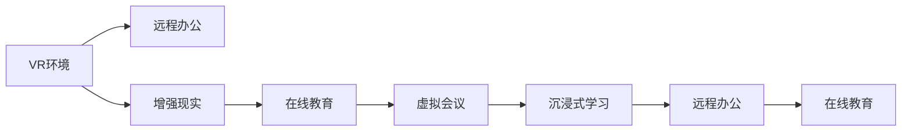

                 

# 硅谷虚拟现实新应用:远程办公与教育

> 关键词：虚拟现实(VR), 远程办公, 教育, 增强现实(AR), 远程协作, 沉浸式学习

## 1. 背景介绍

在过去十年中，随着互联网、大数据、云计算等技术的飞速发展，远程办公和在线教育已经成为不可逆转的趋势。尤其是受到COVID-19疫情的影响，全球各地的企业和学校纷纷加速了数字化转型，寻求在保持生产力和教育质量的同时，减少面对面接触带来的风险。

虚拟现实（Virtual Reality, VR）和增强现实（Augmented Reality, AR）技术的兴起，为远程办公与教育带来了全新的可能性。通过虚拟空间，员工可以在无需离开办公地点的同时，进行高效沟通、协作和培训；学生可以在虚拟教室里，享受沉浸式学习体验，突破物理空间的限制。

硅谷作为全球科技创新和创业的先驱，一直处于引领远程办公和教育技术潮流的前沿。本文将详细探讨硅谷在虚拟现实新应用中的最新进展，分析其在远程办公与教育场景下的具体实践，并展望未来的发展趋势。

## 2. 核心概念与联系

### 2.1 核心概念概述

为了更好地理解硅谷在虚拟现实新应用中的探索，本节将介绍几个关键概念：

- **虚拟现实（VR）**：通过计算机生成或实景采集的三维空间，用户可以通过头盔、手柄等设备进入虚拟环境，与虚拟世界进行交互。

- **增强现实（AR）**：将虚拟信息叠加到现实世界，通过手机、平板等设备在现实场景中实时展示虚拟内容，增强用户体验。

- **远程办公**：指通过网络技术支持，员工无需到物理办公地点进行工作，完全或部分通过远程方式完成工作任务。

- **在线教育**：通过互联网平台提供教学资源和学习活动，学生可以在线上参与互动和评估，完成学习过程。

- **虚拟会议**：利用VR、AR技术，在虚拟空间中进行面对面交流和协作，增强互动体验和团队凝聚力。

- **沉浸式学习**：通过构建沉浸式虚拟环境，使学习者在三维空间中更深入、更直观地理解和掌握知识，提升学习效果。

这些核心概念之间存在密切联系。例如，远程办公与教育中常常利用VR、AR技术创建虚拟环境，实现沉浸式学习与虚拟会议。虚拟现实技术的发展，为远程办公与教育提供了更丰富的应用场景和更高质量的互动体验。

### 2.2 核心概念原理和架构的 Mermaid 流程图



这个流程图展示了虚拟现实技术在不同应用场景中的连通关系：通过虚拟现实技术创建的三维空间，可以支持远程办公、虚拟会议以及沉浸式学习等多样化应用。增强现实技术则可以在现实世界中叠加虚拟信息，进一步增强用户体验。

## 3. 核心算法原理 & 具体操作步骤

### 3.1 算法原理概述

硅谷在虚拟现实新应用中的探索，主要围绕两个核心算法：

- **三维空间渲染算法**：用于生成和渲染三维虚拟环境，使其具有高度逼真和互动性。
- **沉浸式体验算法**：用于在虚拟环境中为用户提供沉浸式的交互体验，提升用户的学习和办公效率。

这两个算法协同工作，使得虚拟现实技术在远程办公与教育场景中得到广泛应用。

### 3.2 算法步骤详解

#### 3.2.1 三维空间渲染算法步骤

1. **数据采集**：通过传感器或摄像头采集现实世界的三维数据，生成点云模型。
2. **几何建模**：对采集的点云数据进行处理，生成光滑的几何模型。
3. **纹理映射**：为几何模型添加真实世界的纹理信息，使其看起来更加逼真。
4. **光照计算**：计算光照效果，使得虚拟环境看起来更加自然。
5. **渲染输出**：将处理后的几何模型、纹理和光照效果综合，输出到用户的虚拟现实设备中。

#### 3.2.2 沉浸式体验算法步骤

1. **头部追踪**：通过头部传感器获取用户头部的三维坐标，实时调整虚拟场景的视角。
2. **手部追踪**：通过手柄传感器获取用户手部的三维坐标，实时调整虚拟场景中的互动对象。
3. **手势识别**：通过深度学习算法识别用户的手势，触发虚拟环境中的特定动作。
4. **互动反馈**：根据用户的操作，提供相应的虚拟环境反馈，如声音、振动等，增强沉浸感。

### 3.3 算法优缺点

**虚拟现实算法的优点：**
- **沉浸感强**：用户可以在虚拟环境中获得高度逼真的体验，增强参与感和学习效率。
- **互动性强**：通过手势识别和手部追踪，用户可以与虚拟环境进行丰富的互动。
- **灵活性高**：支持多种设备，如头盔、平板、手机等，灵活适应不同场景。

**虚拟现实算法的缺点：**
- **成本高**：设备和技术研发成本较高，难以大规模普及。
- **眩晕感**：长时间使用可能导致用户感到眩晕，影响体验。
- **技术限制**：渲染质量和互动效果受限于设备性能和算法复杂度。

### 3.4 算法应用领域

硅谷的虚拟现实技术在多个领域得到了广泛应用，包括：

- **远程办公**：通过VR会议室，员工可以进行沉浸式的远程会议和协作，增强团队凝聚力和工作效率。
- **在线教育**：通过VR和AR技术，学生可以在虚拟实验室、虚拟校园中进行互动式学习，提升学习效果。
- **医疗健康**：通过VR训练系统，医护人员可以进行模拟手术练习，提升专业技能。
- **娱乐休闲**：通过VR游戏和虚拟旅游，用户可以享受沉浸式的娱乐体验。

## 4. 数学模型和公式 & 详细讲解 & 举例说明

### 4.1 数学模型构建

硅谷的虚拟现实技术应用，主要基于以下数学模型：

- **几何模型表示**：通过点云数据生成几何模型，通常使用点、线、面等基本几何元素表示三维空间。
- **纹理映射模型**：将纹理图像映射到几何模型上，实现真实感强的视觉效果。
- **光照模型**：通过数学模型计算光照效果，模拟现实世界的光线分布。
- **手势识别模型**：使用机器学习算法识别用户手势，进行相应的虚拟互动。

### 4.2 公式推导过程

以光照模型为例，假设有三个光源L1、L2、L3，位于点(x1,y1,z1)、(x2,y2,z2)、(x3,y3,z3)。在几何模型上一点P(x,y,z)处，光源L1的光照强度为I1，则计算公式为：

$$
I1 = \frac{k}{(x-x1)^2+(y-y1)^2+(z-z1)^2}
$$

其中，k为光源强度常数。类似地，L2和L3的光照强度计算公式分别为：

$$
I2 = \frac{k}{(x-x2)^2+(y-y2)^2+(z-z2)^2}
$$

$$
I3 = \frac{k}{(x-x3)^2+(y-y3)^2+(z-z3)^2}
$$

将I1、I2、I3相加，即得到点P处的光照强度。

### 4.3 案例分析与讲解

假设我们在虚拟实验室中，希望计算一个几何模型的光照效果。首先，使用点云数据生成几何模型，然后采集光源的位置信息。接着，应用上述公式计算每个点处的光照强度，并将结果进行渲染输出。最后，通过纹理映射，将光照效果叠加到几何模型上，使其看起来更加逼真。

## 5. 项目实践：代码实例和详细解释说明

### 5.1 开发环境搭建

在硅谷，开发虚拟现实应用通常需要搭建以下环境：

1. **硬件设备**：虚拟现实头盔（如Oculus Rift、HTC Vive等）、手柄、计算机等。
2. **软件工具**：如Unity、Unreal Engine等游戏引擎，支持虚拟现实开发。
3. **操作系统**：Windows、Linux、macOS等主流操作系统，支持虚拟现实应用部署。

### 5.2 源代码详细实现

下面以Unity平台为例，展示一个简单的虚拟现实会议室的开发实现：

```csharp
using UnityEngine;
using System.Collections;

public class VRRoom : MonoBehaviour
{
    public GameObject[] cameras;
    public GameObject[] lights;

    void Start()
    {
        // 初始化摄像头
        foreach (var camera in cameras)
        {
            camera.SetActive(true);
        }

        // 初始化光源
        foreach (var light in lights)
        {
            light.SetActive(true);
        }
    }

    void Update()
    {
        // 根据用户头部的位置，调整摄像头视角
        foreach (var camera in cameras)
        {
            Vector3 headPosition = Camera.main.transform.position;
            Vector3 lookDirection = headPosition - transform.position;
            lookDirection = Vector3.Normalize(lookDirection);
            camera.transform.rotation = Quaternion.Lerp(camera.transform.rotation, new Quaternion(lookDirection, camera.transform.rotation.eulerAngles), Time.deltaTime * 2);
        }
    }
}
```

### 5.3 代码解读与分析

以上代码实现了虚拟现实会议室的基本功能，包括摄像头视角的调整和光源的初始化。在Unity中，通过脚本实现对虚拟环境的动态交互。

**摄像头视角调整**：通过获取用户头部的位置信息，计算虚拟场景中摄像头的方向，实现视角调整。

**光源初始化**：将光源对象在虚拟场景中初始化，并开启光照效果。

### 5.4 运行结果展示

通过Unity渲染器，可以看到生成的虚拟会议室，用户可以自由移动，与虚拟环境进行互动。摄像机和光源的位置会根据用户头部的移动而实时调整，提供了沉浸式的互动体验。

## 6. 实际应用场景

### 6.1 远程办公

硅谷的虚拟现实技术在远程办公中得到了广泛应用。通过VR会议室，员工可以进行沉浸式的远程会议和协作，增强团队凝聚力和工作效率。例如，Zoom的VR版，可以通过虚拟会议室进行视频会议、文件共享、白板协作等功能，为远程团队提供沉浸式的工作环境。

### 6.2 在线教育

虚拟现实技术在在线教育中的应用，为学生提供了沉浸式的学习体验。通过VR教室，学生可以在虚拟空间中进行互动式学习，提升学习效果。例如，Facebook的Horizon Workrooms，通过VR平台提供虚拟教室，支持学生和教师的互动教学。

### 6.3 医疗健康

虚拟现实技术在医疗健康中的应用，使得医护人员可以进行模拟手术练习，提升专业技能。通过VR手术模拟系统，医护人员可以在虚拟环境中进行手术操作，进行仿真训练，提高手术成功率。例如，Osso VR的手术模拟器，支持多个部位的虚拟手术训练。

### 6.4 娱乐休闲

虚拟现实技术在娱乐休闲中的应用，为用户提供了沉浸式的娱乐体验。通过VR游戏和虚拟旅游，用户可以享受全新的娱乐体验。例如，Valve的VR游戏《Beat Saber》，通过交互式的音乐节奏游戏，提供沉浸式的音乐和运动体验。

## 7. 工具和资源推荐

### 7.1 学习资源推荐

为了帮助开发者系统掌握硅谷在虚拟现实新应用中的探索，这里推荐一些优质的学习资源：

1. **《Unity VR开发教程》**：提供从基础到高级的Unity VR开发教程，涵盖虚拟会议室、虚拟实验室、虚拟校园等多个应用场景。
2. **《Unreal Engine VR开发教程》**：提供从基础到高级的Unreal Engine VR开发教程，涵盖虚拟会议室、虚拟手术室、虚拟旅游等多个应用场景。
3. **《VR/AR技术与应用》课程**：斯坦福大学开设的VR/AR课程，涵盖虚拟现实、增强现实、混合现实等多个核心概念，适合入门学习。
4. **《VR/AR应用案例》书籍**：详细介绍VR/AR技术在不同领域的应用案例，适合实践学习。

通过对这些资源的学习实践，相信你一定能够快速掌握虚拟现实技术的精髓，并用于解决实际的开发问题。

### 7.2 开发工具推荐

高效的工具支持是虚拟现实开发的关键。以下是几款用于虚拟现实开发常用的工具：

1. **Unity**：提供强大的引擎支持，支持多平台部署，适合游戏开发和虚拟现实应用。
2. **Unreal Engine**：提供高度逼真的渲染效果，支持多种VR设备，适合影视和游戏开发。
3. **Google Tilt Brush**：提供强大的手绘工具，支持在虚拟空间中进行手绘创作，适合艺术家和设计师。
4. **Facebook Horizon**：提供VR社交平台，支持多人互动，适合社交和娱乐应用。
5. **Valve Index Portal**：提供VR环境模拟器，支持VR应用开发和测试。

合理利用这些工具，可以显著提升虚拟现实应用的开发效率，加速创新迭代的步伐。

### 7.3 相关论文推荐

硅谷的虚拟现实技术发展源于学界的持续研究。以下是几篇奠基性的相关论文，推荐阅读：

1. **《虚拟现实技术综述》**：全面综述了虚拟现实技术的原理、应用和挑战，适合入门学习。
2. **《增强现实技术综述》**：全面综述了增强现实技术的原理、应用和挑战，适合入门学习。
3. **《虚拟现实与增强现实：未来趋势》**：探讨了虚拟现实和增强现实的未来趋势，适合研究学习。
4. **《虚拟现实在医疗中的应用》**：探讨了虚拟现实在医疗健康领域的应用，适合专业研究。
5. **《虚拟现实在教育中的应用》**：探讨了虚拟现实在在线教育领域的应用，适合专业研究。

这些论文代表了大语言模型微调技术的发展脉络。通过学习这些前沿成果，可以帮助研究者把握学科前进方向，激发更多的创新灵感。

## 8. 总结：未来发展趋势与挑战

### 8.1 研究成果总结

本文详细探讨了硅谷在虚拟现实新应用中的探索，分析了虚拟现实技术在远程办公与教育场景下的具体实践，并展望了未来的发展趋势。

### 8.2 未来发展趋势

展望未来，硅谷的虚拟现实技术将在多个领域得到进一步发展，具体包括：

1. **更加逼真的渲染效果**：随着计算能力的提升，虚拟现实技术将支持更复杂、更精细的三维模型渲染，提供更加逼真的用户体验。
2. **更加丰富的互动体验**：通过手势识别、语音识别等技术，实现更加自然、流畅的用户互动。
3. **更加广泛的应用场景**：除了远程办公、在线教育、医疗健康等领域，虚拟现实技术还将拓展到更多垂直行业，如军事、艺术、建筑等。
4. **更加轻量级的设备**：未来的虚拟现实设备将更加轻便、便携，支持更多平台和设备，实现更加普及的应用。

### 8.3 面临的挑战

尽管硅谷的虚拟现实技术取得了瞩目成就，但在迈向更加智能化、普适化应用的过程中，仍面临诸多挑战：

1. **设备成本高**：高性能的虚拟现实设备成本较高，难以大规模普及。
2. **技术瓶颈**：虚拟现实技术的渲染质量和互动效果受限于设备性能和算法复杂度。
3. **用户体验差**：长时间使用可能导致用户感到眩晕，影响体验。
4. **技术生态不完善**：虚拟现实生态系统不成熟，标准和兼容性问题待解决。

### 8.4 研究展望

未来的研究需要在以下几个方面寻求新的突破：

1. **优化渲染算法**：研究更高效的渲染算法，提高虚拟现实设备的渲染质量和效率。
2. **改进互动技术**：通过引入更多交互方式，如手势识别、语音识别等，提升用户互动体验。
3. **拓展应用场景**：探索更多垂直行业的虚拟现实应用，拓展市场空间。
4. **提升设备便携性**：研发更轻便、更便携的虚拟现实设备，实现更广泛的应用。
5. **改善用户体验**：研究更有效的眩晕缓解技术，提升用户长时间使用体验。
6. **完善生态系统**：推动虚拟现实生态系统的标准化和兼容性，促进技术发展。

## 9. 附录：常见问题与解答

**Q1: 虚拟现实技术在远程办公中如何应用？**

A: 在远程办公中，虚拟现实技术可以应用于虚拟会议室、虚拟办公空间等场景。通过VR头盔和手柄，员工可以在虚拟空间中进行沉浸式的交流和协作，增强团队凝聚力和工作效率。

**Q2: 虚拟现实技术在在线教育中的应用有哪些？**

A: 在在线教育中，虚拟现实技术可以应用于虚拟实验室、虚拟校园等场景。通过VR教室，学生可以在虚拟空间中进行互动式学习，提升学习效果。例如，Facebook的Horizon Workrooms，通过VR平台提供虚拟教室，支持学生和教师的互动教学。

**Q3: 虚拟现实技术在医疗健康中的应用有哪些？**

A: 在医疗健康中，虚拟现实技术可以应用于模拟手术训练、虚拟护理培训等场景。通过VR手术模拟器，医护人员可以在虚拟环境中进行手术操作，进行仿真训练，提高手术成功率。例如，Osso VR的手术模拟器，支持多个部位的虚拟手术训练。

**Q4: 虚拟现实技术在娱乐休闲中的应用有哪些？**

A: 在娱乐休闲中，虚拟现实技术可以应用于VR游戏、虚拟旅游等场景。通过VR游戏和虚拟旅游，用户可以享受沉浸式的娱乐体验。例如，Valve的VR游戏《Beat Saber》，通过交互式的音乐节奏游戏，提供沉浸式的音乐和运动体验。

通过这些Q&A，相信你一定能够更好地理解硅谷在虚拟现实新应用中的探索，并对虚拟现实技术的未来发展有更深入的认识。

