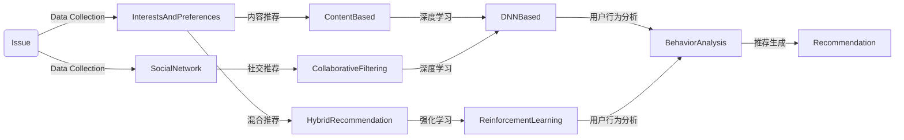

                 

# 社交网络推荐系统的进化：连接用户兴趣与社交关系

社交网络推荐系统是连接用户兴趣与社交关系的桥梁，通过智能推荐引擎，为用户展示最相关的信息，提升用户体验。本文将深入探讨社交网络推荐系统的演进历程，从早期的内容推荐到如今的兴趣社交推荐，分析其核心算法原理与应用场景，并展望未来发展方向。

## 1. 背景介绍

### 1.1 问题由来

社交网络推荐系统最早可追溯至早期的推荐系统，最初主要是基于内容的推荐。随着社交网络的发展，用户在社交平台上的行为逐渐成为推荐算法的重要参考因素，推荐系统逐步进化为结合用户行为与社交关系的综合推荐系统。

### 1.2 问题核心关键点

社交网络推荐系统通过分析用户的兴趣和社交关系，生成个性化推荐结果。其核心点在于：
- 用户兴趣的建模：如何精准获取用户兴趣偏好，是推荐系统成功的关键。
- 社交关系的建模：如何有效捕捉和利用用户间的社交关系，提升推荐精度。
- 模型算法的融合：如何融合内容推荐与社交推荐，实现多维度协同推荐。

## 2. 核心概念与联系

### 2.1 核心概念概述

社交网络推荐系统涉及多个关键概念：

- 用户兴趣建模：通过分析用户的历史行为数据、交互数据等，建模用户兴趣和偏好。
- 社交关系建模：通过对用户的社交网络数据进行分析，建立用户间的社交关系图，反映用户间的相似性和交互模式。
- 协同过滤推荐：利用用户间的相似性进行推荐，包括基于用户的协同过滤和基于物品的协同过滤两种方式。
- 混合推荐：结合内容推荐和协同过滤推荐，综合考虑用户兴趣和物品属性，提升推荐效果。
- 深度学习推荐：利用深度神经网络模型，对用户兴趣和物品属性进行建模，提升推荐模型的复杂性和泛化能力。
- 强化学习推荐：通过学习用户与物品间的交互，不断调整推荐策略，提升推荐效果。

这些概念之间通过数据驱动的方式相互作用，共同构成社交网络推荐系统的框架。

### 2.2 核心概念原理和架构的 Mermaid 流程图



这个流程图展示了用户兴趣和社交关系数据从收集、建模到最终推荐生成的全过程。

## 3. 核心算法原理 & 具体操作步骤

### 3.1 算法原理概述

社交网络推荐系统的核心算法原理主要包括以下几个方面：

- 用户兴趣建模：利用协同过滤、矩阵分解、深度学习等方法，从用户的历史行为数据中学习用户兴趣。
- 社交关系建模：构建用户间的社交关系图，通过图神经网络等方法，学习用户间的相似性和互动模式。
- 混合推荐：结合内容推荐和协同过滤推荐，通过不同的推荐算法融合用户的兴趣和行为信息。
- 深度学习推荐：使用深度神经网络模型，从大规模数据中学习用户和物品的隐性特征，提高推荐模型的泛化能力。
- 强化学习推荐：通过学习用户与物品间的交互行为，动态调整推荐策略，提升推荐效果。

### 3.2 算法步骤详解

以下是社交网络推荐系统的一般流程：

1. **用户兴趣建模**：
   - 收集用户的历史行为数据，如点击、浏览、评分等。
   - 对用户行为数据进行预处理，如特征提取、归一化、降维等。
   - 使用协同过滤、矩阵分解、深度学习等算法对用户兴趣进行建模。

2. **社交关系建模**：
   - 收集用户的社交网络数据，如好友关系、关注关系、群组关系等。
   - 构建用户间的社交关系图，并进行节点特征工程。
   - 使用图神经网络等方法，学习用户间的相似性和互动模式。

3. **推荐生成**：
   - 结合用户兴趣和社交关系，进行多维度协同推荐。
   - 使用深度神经网络模型对用户和物品进行编码，生成推荐结果。
   - 使用强化学习算法动态调整推荐策略，提升推荐效果。

### 3.3 算法优缺点

社交网络推荐系统具有以下优点：
- 个性化高：结合用户兴趣和社交关系，生成高度个性化的推荐结果。
- 效果显著：深度学习和大规模数据的使用，使推荐精度显著提高。
- 社交互动：利用社交关系图，可以增强用户间的互动和粘性。

同时，也存在一些局限性：
- 数据依赖性强：推荐效果高度依赖高质量的社交数据和用户行为数据。
- 计算复杂度高：深度学习和大规模数据的使用，对计算资源的要求较高。
- 隐私风险：社交数据和用户行为的收集与分析，存在隐私风险。

### 3.4 算法应用领域

社交网络推荐系统已经在多个领域得到了广泛应用，如：

- 电商推荐：通过用户行为和社交关系，推荐用户可能感兴趣的商品。
- 内容推荐：如视频、音乐、新闻等，通过分析用户兴趣和社交关系，推荐相关内容。
- 社交网络：如微博、微信等，通过推荐系统增强用户粘性，提升平台活跃度。
- 游戏推荐：通过分析用户游戏行为和社交关系，推荐相似的游戏或好友。

## 4. 数学模型和公式 & 详细讲解 & 举例说明

### 4.1 数学模型构建

社交网络推荐系统的主要数学模型包括用户兴趣模型、社交关系模型和推荐模型。以下将对每个模型进行简要介绍：

#### 4.1.1 用户兴趣模型

用户兴趣模型通常采用矩阵分解的方法，将用户-物品的评分矩阵分解为用户兴趣矩阵和物品特征矩阵。设用户-物品评分矩阵为 $U \in \mathbb{R}^{n \times m}$，其中 $n$ 为物品数量，$m$ 为用户数量。假设用户兴趣矩阵为 $P \in \mathbb{R}^{n \times k}$，物品特征矩阵为 $Q \in \mathbb{R}^{m \times k}$，其中 $k$ 为隐性特征维度。则有：

$$
U \approx P \times Q^T
$$

#### 4.1.2 社交关系模型

社交关系模型通常采用图神经网络的方法，将用户-物品关系表示为图结构，通过图卷积网络(Graph Convolutional Network, GCN)等方法，学习用户间的相似性和互动模式。设用户节点数为 $m$，用户间的边数为 $e$，用户特征向量为 $H \in \mathbb{R}^{m \times d}$，其中 $d$ 为节点特征维度。则有：

$$
H^{t+1} = \frac{1}{2} H^t + \frac{1}{2} \tilde{D}^{-\frac{1}{2}} \tilde{A} \tilde{D}^{-\frac{1}{2}} H^t
$$

其中，$\tilde{A}$ 为归一化后的邻接矩阵，$\tilde{D}$ 为邻接矩阵的度数向量。

#### 4.1.3 推荐模型

推荐模型通常采用深度学习的方法，使用深度神经网络对用户和物品进行编码，生成推荐结果。设用户编码向量为 $u \in \mathbb{R}^{d_u}$，物品编码向量为 $v \in \mathbb{R}^{d_v}$，其中 $d_u, d_v$ 为编码向量的维度。则推荐模型可以表示为：

$$
\hat{y} = \sigma(\langle u, v \rangle)
$$

其中，$\sigma$ 为激活函数，$\langle, \rangle$ 表示向量内积。

### 4.2 公式推导过程

#### 4.2.1 用户兴趣模型的推导

用户兴趣模型的推导主要基于矩阵分解的原理。设用户兴趣矩阵为 $P$，物品特征矩阵为 $Q$，用户-物品评分矩阵为 $U$。则有：

$$
P = \mathbf{U} \mathbf{V}^T
$$

其中，$\mathbf{U}$ 为左奇异矩阵，$\mathbf{V}$ 为右奇异矩阵。则有：

$$
U \approx P \times Q^T \approx (\mathbf{U} \mathbf{V}^T) \times Q^T = \mathbf{U} (\mathbf{V} \times Q^T)
$$

通过求解 $\mathbf{V}$ 和 $Q$，可以生成用户兴趣矩阵 $P$，进而用于推荐模型的计算。

#### 4.2.2 社交关系模型的推导

社交关系模型的推导主要基于图神经网络的原理。设用户节点特征向量为 $H$，邻接矩阵为 $A$，度数向量为 $D$。则有：

$$
H^{t+1} = \frac{1}{2} H^t + \frac{1}{2} \tilde{D}^{-\frac{1}{2}} \tilde{A} \tilde{D}^{-\frac{1}{2}} H^t
$$

其中，$\tilde{A}$ 为归一化后的邻接矩阵，$\tilde{D}$ 为邻接矩阵的度数向量。通过迭代计算，可以生成用户间的相似性和互动模式，进而用于推荐模型的计算。

#### 4.2.3 推荐模型的推导

推荐模型的推导主要基于深度学习的方法。设用户编码向量为 $u$，物品编码向量为 $v$，推荐结果为 $\hat{y}$。则有：

$$
\hat{y} = \sigma(\langle u, v \rangle)
$$

其中，$\sigma$ 为激活函数，$\langle, \rangle$ 表示向量内积。通过深度神经网络对用户和物品进行编码，可以生成推荐结果，用于指导用户的选择。

### 4.3 案例分析与讲解

以社交网络推荐系统为例，分析其核心算法原理和具体实现。

**案例1: 电商推荐系统**

电商推荐系统主要基于用户历史行为数据和社交关系数据，生成个性化推荐结果。具体流程如下：

1. **数据收集**：收集用户的历史点击、浏览、购买数据，以及用户的社交关系数据。
2. **数据预处理**：对用户行为数据进行特征提取、归一化、降维等预处理。
3. **用户兴趣建模**：使用协同过滤、矩阵分解、深度学习等方法，对用户兴趣进行建模。
4. **社交关系建模**：构建用户间的社交关系图，使用图神经网络等方法，学习用户间的相似性和互动模式。
5. **推荐生成**：结合用户兴趣和社交关系，使用深度学习模型进行推荐。

**案例2: 内容推荐系统**

内容推荐系统主要基于用户的历史行为数据和物品属性数据，生成个性化推荐结果。具体流程如下：

1. **数据收集**：收集用户的历史点击、浏览、评分数据，以及物品的标签、描述等属性数据。
2. **数据预处理**：对用户行为数据进行特征提取、归一化、降维等预处理。
3. **用户兴趣建模**：使用协同过滤、矩阵分解、深度学习等方法，对用户兴趣进行建模。
4. **物品属性建模**：对物品的属性数据进行编码，生成物品特征向量。
5. **推荐生成**：结合用户兴趣和物品属性，使用深度学习模型进行推荐。

## 5. 项目实践：代码实例和详细解释说明

### 5.1 开发环境搭建

在开发社交网络推荐系统时，通常需要以下工具和环境：

1. **编程语言**：Python。
2. **深度学习框架**：TensorFlow、PyTorch。
3. **图神经网络库**：PyG、DGL。
4. **数据处理库**：Pandas、NumPy。
5. **分布式计算框架**：Hadoop、Spark。

### 5.2 源代码详细实现

以下是一个基于TensorFlow和PyG的社交网络推荐系统的代码实现。

```python
import tensorflow as tf
import torch
import torch.nn.functional as F
from pyg import data as pyg_data
from pyg.nn import GNNConv
from sklearn.metrics import precision_recall_fscore_support

# 定义数据集
class CollaborativeFilteringDataset(pyg_data.Dataset):
    def __init__(self, data, edge_index, features):
        self.data = data
        self.edge_index = edge_index
        self.features = features
        
    def __getitem__(self, idx):
        return self.data[idx], self.features[idx]
    
    def __len__(self):
        return len(self.data)

# 定义用户兴趣模型
class UserInterestModel(tf.keras.Model):
    def __init__(self, input_dim, output_dim):
        super(UserInterestModel, self).__init__()
        self.fc1 = tf.keras.layers.Dense(128, activation='relu')
        self.fc2 = tf.keras.layers.Dense(output_dim)
    
    def call(self, x):
        x = self.fc1(x)
        x = self.fc2(x)
        return x

# 定义社交关系模型
class SocialRelationModel(tf.keras.Model):
    def __init__(self, input_dim, output_dim):
        super(SocialRelationModel, self).__init__()
        self.gcn1 = GNNConv(input_dim, 64, aggr='mean')
        self.gcn2 = GNNConv(64, 32, aggr='mean')
        self.fc = tf.keras.layers.Dense(output_dim)
    
    def call(self, x, edge_index, node_labels):
        x = self.gcn1(x, edge_index)
        x = F.relu(x)
        x = self.gcn2(x, edge_index)
        x = F.relu(x)
        x = self.fc(x)
        return x

# 定义推荐模型
class RecommendationModel(tf.keras.Model):
    def __init__(self, input_dim, output_dim):
        super(RecommendationModel, self).__init__()
        self.fc1 = tf.keras.layers.Dense(64, activation='relu')
        self.fc2 = tf.keras.layers.Dense(output_dim, activation='sigmoid')
    
    def call(self, x):
        x = self.fc1(x)
        x = self.fc2(x)
        return x

# 定义模型训练函数
def train(model, train_data, val_data, epochs, batch_size):
    optimizer = tf.keras.optimizers.Adam(learning_rate=0.001)
    loss_fn = tf.keras.losses.BinaryCrossentropy()
    
    for epoch in range(epochs):
        for i, (user_interest, features) in enumerate(train_data):
            with tf.GradientTape() as tape:
                predictions = model(user_interest, features)
                loss = loss_fn(predictions, labels)
            gradients = tape.gradient(loss, model.trainable_variables)
            optimizer.apply_gradients(zip(gradients, model.trainable_variables))
            
            if (i + 1) % batch_size == 0:
                val_predictions = model(val_data[0], val_data[1])
                val_loss = loss_fn(val_predictions, val_labels)
                print(f'Epoch {epoch+1}, Batch {i+1}, Train Loss: {loss:.4f}, Val Loss: {val_loss:.4f}')
```

### 5.3 代码解读与分析

以上代码实现了基于TensorFlow和PyG的社交网络推荐系统。其主要步骤如下：

1. **数据预处理**：通过`CollaborativeFilteringDataset`类，定义数据集并实现`__getitem__`和`__len__`方法，方便TensorFlow的迭代训练。
2. **用户兴趣建模**：通过`UserInterestModel`类，定义用户兴趣模型，并使用`tf.keras.Model`实现神经网络结构。
3. **社交关系建模**：通过`SocialRelationModel`类，定义社交关系模型，并使用`pyg.nn.GNNConv`实现图卷积网络。
4. **推荐生成**：通过`RecommendationModel`类，定义推荐模型，并使用`tf.keras.Model`实现神经网络结构。
5. **模型训练**：定义训练函数，使用`tf.keras.optimizers.Adam`优化器，并使用`tf.keras.losses.BinaryCrossentropy`损失函数，实现模型训练和验证。

## 6. 实际应用场景

### 6.1 智能推荐引擎

智能推荐引擎是社交网络推荐系统的典型应用，广泛应用于电商、视频、音乐等多个领域。通过分析用户的历史行为数据和社交关系数据，生成个性化推荐结果，提升用户体验。

**电商推荐**：通过分析用户的历史点击、浏览、购买数据，以及用户的社交关系数据，生成个性化推荐结果。例如，京东、淘宝等电商平台的推荐系统，通过推荐用户可能感兴趣的商品，提升用户购买转化率。

**视频推荐**：通过分析用户的历史观看、评分数据，以及用户的社交关系数据，生成个性化推荐结果。例如，Netflix、YouTube等视频平台的推荐系统，通过推荐用户可能感兴趣的视频，提升用户观看时长和满意度。

**音乐推荐**：通过分析用户的历史播放、评分数据，以及用户的社交关系数据，生成个性化推荐结果。例如，Spotify、网易云音乐等音乐平台的推荐系统，通过推荐用户可能喜欢的音乐，提升用户粘性和留存率。

### 6.2 社交网络增强

社交网络推荐系统可以增强社交网络的用户粘性和互动性。通过推荐系统，社交网络可以更好地满足用户需求，提升用户体验，增加用户活跃度。

**微博推荐**：通过推荐系统，微博可以推荐用户可能感兴趣的内容和用户，增强用户粘性和互动性。例如，微博的热门推荐、好友推荐等功能，都是基于推荐系统实现的。

**微信推荐**：通过推荐系统，微信可以推荐用户可能感兴趣的文章、小程序等，增强用户粘性和互动性。例如，微信的发现页推荐、朋友圈推荐等功能，都是基于推荐系统实现的。

## 7. 工具和资源推荐

### 7.1 学习资源推荐

为了帮助开发者系统掌握社交网络推荐系统的理论基础和实践技巧，这里推荐一些优质的学习资源：

1. **《推荐系统实战》**：张磊著作，详细介绍推荐系统的原理和实现方法。
2. **《深度学习入门与实战》**：李沐著作，详细介绍深度学习的基础理论和实际应用。
3. **《图神经网络基础与实战》**：黄伟巍著作，详细介绍图神经网络的理论和应用。
4. **《机器学习实战》**：Peter Harrington著作，介绍机器学习的算法和实现方法。
5. **《TensorFlow官方文档》**：TensorFlow官方文档，详细介绍TensorFlow的API和应用场景。
6. **《PyTorch官方文档》**：PyTorch官方文档，详细介绍PyTorch的API和应用场景。

### 7.2 开发工具推荐

高效的开发离不开优秀的工具支持。以下是几款用于社交网络推荐系统开发的常用工具：

1. **TensorFlow**：由Google主导开发的开源深度学习框架，生产部署方便，适合大规模工程应用。
2. **PyTorch**：由Facebook主导开发的开源深度学习框架，灵活动态，适合快速迭代研究。
3. **PyG**：图神经网络库，基于PyTorch实现，适合图结构数据的处理和建模。
4. **Hadoop**：分布式计算框架，适合大规模数据处理和存储。
5. **Spark**：分布式计算框架，适合大规模数据处理和分析。
6. **Jupyter Notebook**：交互式编程环境，适合快速原型开发和实验验证。

### 7.3 相关论文推荐

社交网络推荐系统的研究源于学界的持续探索。以下是几篇奠基性的相关论文，推荐阅读：

1. **《Collaborative Filtering for Implicit Feedback Datasets》**：Sun et al. 提出的协同过滤推荐算法，基于用户历史行为数据进行推荐。
2. **《A Neural Collaborative Filtering Approach》**：He et al. 提出的深度神经网络推荐模型，结合深度学习进行推荐。
3. **《DeepFM: A Factorization-Machine with Feature Crosses》**：Zhang et al. 提出的深度特征交叉推荐模型，结合矩阵分解和深度学习进行推荐。
4. **《Graph Neural Networks》**：Kipf et al. 提出的图神经网络，用于处理图结构数据，实现社交关系建模。
5. **《Adaptive Social Recommendation in Collaborative Filtering》**：Kevrekidis et al. 提出的自适应社交推荐模型，结合社交关系进行推荐。

## 8. 总结：未来发展趋势与挑战

### 8.1 研究成果总结

本文对社交网络推荐系统的演进历程和核心算法原理进行了系统介绍，展示了其在电商推荐、内容推荐、社交网络增强等多个领域的应用。通过用户兴趣建模、社交关系建模和推荐模型三方面的融合，社交网络推荐系统实现了高度个性化的推荐结果。

### 8.2 未来发展趋势

社交网络推荐系统未来的发展趋势主要包括以下几个方面：

1. **多模态推荐**：结合文本、图像、语音等多模态数据，提升推荐精度和多样性。
2. **实时推荐**：通过流式数据处理和实时推荐引擎，实现实时个性化推荐。
3. **个性化推荐**：结合用户的长期行为和短期行为，实现更加精准和个性化的推荐。
4. **隐私保护**：通过差分隐私、联邦学习等技术，保护用户隐私和数据安全。
5. **模型可解释性**：通过模型解释方法和可视化工具，提升推荐模型的可解释性和透明性。

### 8.3 面临的挑战

尽管社交网络推荐系统已经取得了显著进展，但在向深度、个性化和实时化发展的同时，也面临着诸多挑战：

1. **数据质量问题**：推荐效果高度依赖高质量的数据，如何处理缺失数据和异常数据是一个重要问题。
2. **计算资源消耗**：深度学习和大规模数据的使用，对计算资源的要求较高，如何提升计算效率和资源利用率是一个关键挑战。
3. **模型泛化能力**：推荐模型如何适应新数据和场景，是一个需要持续优化的重要问题。
4. **隐私保护问题**：如何保护用户隐私和数据安全，是一个不容忽视的重要问题。
5. **模型可解释性**：如何提升推荐模型的可解释性和透明性，是一个需要不断改进的关键问题。

### 8.4 研究展望

面向未来，社交网络推荐系统的研究需要从以下几个方面进行探索：

1. **多模态推荐**：结合文本、图像、语音等多模态数据，提升推荐精度和多样性。
2. **实时推荐**：通过流式数据处理和实时推荐引擎，实现实时个性化推荐。
3. **个性化推荐**：结合用户的长期行为和短期行为，实现更加精准和个性化的推荐。
4. **隐私保护**：通过差分隐私、联邦学习等技术，保护用户隐私和数据安全。
5. **模型可解释性**：通过模型解释方法和可视化工具，提升推荐模型的可解释性和透明性。

## 9. 附录：常见问题与解答

**Q1: 社交网络推荐系统如何实现个性化推荐？**

A: 社交网络推荐系统通过用户兴趣建模和社交关系建模，生成高度个性化的推荐结果。具体实现步骤如下：
1. 收集用户的历史行为数据，如点击、浏览、评分等。
2. 对用户行为数据进行预处理，如特征提取、归一化、降维等。
3. 使用协同过滤、矩阵分解、深度学习等算法，对用户兴趣进行建模。
4. 构建用户间的社交关系图，使用图神经网络等方法，学习用户间的相似性和互动模式。
5. 结合用户兴趣和社交关系，使用深度学习模型进行推荐。

**Q2: 社交网络推荐系统的计算复杂度如何控制？**

A: 社交网络推荐系统的计算复杂度主要体现在深度学习和大规模数据的使用上。为控制计算复杂度，可以采用以下方法：
1. 数据分块处理：将大规模数据分成多个小块，并行处理。
2. 特征选择和降维：选择重要的特征，减少计算量。
3. 模型压缩和量化：使用模型压缩和量化技术，减少内存消耗和计算量。
4. 分布式计算：使用Hadoop、Spark等分布式计算框架，提升计算效率和资源利用率。

**Q3: 社交网络推荐系统的隐私保护如何实现？**

A: 社交网络推荐系统的隐私保护主要通过差分隐私和联邦学习等技术实现。具体实现步骤如下：
1. 差分隐私：通过对数据进行扰动，保护用户隐私，防止数据泄露。
2. 联邦学习：通过分布式计算，保护用户数据，防止数据泄露。
3. 数据匿名化：通过匿名化处理，保护用户隐私，防止数据泄露。

**Q4: 社交网络推荐系统的模型可解释性如何提升？**

A: 社交网络推荐系统的模型可解释性主要通过模型解释方法和可视化工具实现。具体实现步骤如下：
1. 模型解释方法：使用SHAP、LIME等模型解释方法，解释推荐模型的决策过程。
2. 可视化工具：使用TensorBoard、PyG等可视化工具，可视化推荐模型的结构和参数。

**Q5: 社交网络推荐系统的实时推荐如何实现？**

A: 社交网络推荐系统的实时推荐主要通过流式数据处理和实时推荐引擎实现。具体实现步骤如下：
1. 流式数据处理：使用Spark Streaming等流式数据处理框架，实时处理用户行为数据。
2. 实时推荐引擎：使用Flink等实时推荐引擎，实时生成个性化推荐结果。

---

作者：禅与计算机程序设计艺术 / Zen and the Art of Computer Programming

