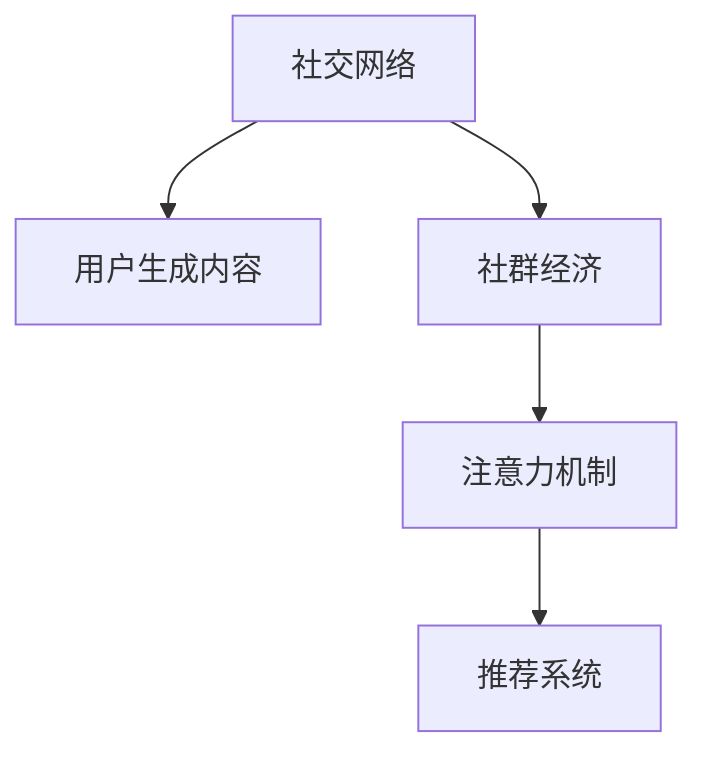

                 

# 社群经济：注意力聚集的新模式

> 关键词：社群经济, 注意力机制, 新模式, 社交网络, 用户行为

## 1. 背景介绍

### 1.1 问题由来
随着互联网技术的发展，社交网络已经从传统的社交工具，演变为社会化媒体和数字生活的重要组成部分。以Facebook、Twitter、微信等平台为代表的社交网络，不仅为用户提供了一个沟通交流的平台，还通过广告、内容分发等方式创造了巨大的经济价值。

然而，现有的社交网络模式仍然存在一些问题：

- 过度广告：广告数量过多，影响用户体验，甚至引发反感和厌恶。
- 内容同质化：用户能看到的信息越来越接近，缺乏个性化和多样化。
- 平台垄断：少数大型社交平台掌握着用户大量的注意力和数据，形成信息孤岛。
- 隐私问题：用户数据的隐私保护和数据安全问题日益凸显。

这些问题严重限制了社交网络的发展潜力，也引发了用户对现有模式的厌倦和反思。因此，探索新的社交网络模式成为互联网行业的一个重要课题。

### 1.2 问题核心关键点
社群经济的核心在于注意力聚集，即如何高效、合理地将用户注意力分配给不同的内容、应用和服务。其关键点包括：

- 社交网络的演进：从信息消费向信息生产转变，用户生成内容(UGC)逐渐成为主流。
- 新模式设计：构建基于兴趣、兴趣社交网络、关系网络等新的社交关系模式，增强用户的参与度和粘性。
- 用户行为分析：利用数据分析、人工智能等技术，了解用户偏好、兴趣和行为，实现更精准的内容推荐。
- 数据隐私保护：设计用户数据隐私保护机制，避免用户隐私泄露和滥用。

本文将聚焦于基于注意力机制的社群经济模式，探讨新模式的设计和实现，并对其优缺点和应用领域进行深入分析。

## 2. 核心概念与联系

### 2.1 核心概念概述

为更好地理解基于注意力机制的社群经济模式，本节将介绍几个密切相关的核心概念：

- 注意力机制(Attention Mechanism)：一种通过学习输入序列的权重分配，聚焦重要部分进行计算的机制。在自然语言处理、计算机视觉、推荐系统等领域有广泛应用。
- 社交网络(Social Network)：一种通过关系链条将用户、内容、服务连接起来的网络结构，具有高度的社会属性。
- 社群经济(Community Economy)：基于社群关系网络，以用户互动、共享、互惠为核心，形成的一种新的经济模式。
- 用户生成内容(UGC)：用户主动创作、分享的内容，如博客、评论、视频等，是社群经济的重要组成部分。
- 推荐系统(Recommendation System)：通过分析用户历史行为和兴趣，为用户推荐个性化内容的技术。

这些核心概念之间的逻辑关系可以通过以下Mermaid流程图来展示：



这个流程图展示了几大核心概念的相互关系：

1. 社交网络提供用户互动的平台，是社群经济的基础。
2. 用户生成内容丰富了社交网络的内容生态，成为社群经济的重要支撑。
3. 基于注意力机制的推荐系统，使内容推荐更加精准高效。
4. 社群经济通过用户互动、共享、互惠等机制，形成了新的经济模式。

## 3. 核心算法原理 & 具体操作步骤
### 3.1 算法原理概述

基于注意力机制的社群经济模式，本质上是利用注意力机制优化社交网络中内容的推荐和分配，以提升用户参与度和经济价值。其核心思想是：

- 通过注意力机制学习用户对内容的偏好，聚焦重要内容进行推荐。
- 基于社交网络的关系链，设计合理的注意力分配策略，增强用户的粘性和互动。
- 利用用户生成内容，构建多样化的内容生态，激发用户创作动力。
- 通过推荐系统的个性化推荐，提高用户的满意度，增强社群经济的活力。

具体实现过程包括以下几个步骤：

1. 数据收集：收集用户行为数据、社交网络数据、用户生成内容等，构建全面的数据集。
2. 关系建模：利用社交网络中的关系链，构建用户与内容、用户与用户之间的关系模型。
3. 注意力分配：通过注意力机制学习用户对不同内容、关系链的关注度，合理分配注意力资源。
4. 内容推荐：根据用户注意力分布，设计推荐算法，为用户推荐个性化内容。
5. 用户互动：设计互动机制，鼓励用户参与创作、分享和评论，增强社群经济的活跃度。
6. 效果评估：使用用户行为数据和反馈，评估推荐系统的性能和社群经济的经济效益。

### 3.2 算法步骤详解

以下是基于注意力机制的社群经济模式的详细操作步骤：

**Step 1: 数据收集**
- 收集社交网络用户的行为数据，如点赞、评论、分享、访问时间等。
- 收集用户生成的内容数据，如博客、视频、文章等。
- 收集社交网络关系链数据，如关注、好友、群组成员关系等。

**Step 2: 关系建模**
- 使用图神经网络(Graph Neural Network, GNN)等算法，构建用户-内容关系图和用户-用户关系图。
- 关系图中的节点表示用户或内容，边表示用户之间的关系或内容之间的关联。
- 使用GNN对关系图进行聚类、嵌入等处理，提取用户和内容的特征表示。

**Step 3: 注意力分配**
- 利用注意力机制对用户行为数据和内容特征进行加权处理，得到用户对不同内容、关系链的关注度。
- 使用Softmax函数计算注意力权重，聚焦重要内容进行推荐。
- 对于用户-用户关系链，可以设计多种注意力分配策略，如基于信任度、互动频率等。

**Step 4: 内容推荐**
- 设计推荐算法，根据用户注意力分布和内容特征，为用户推荐个性化内容。
- 常见的推荐算法包括基于协同过滤、基于内容、基于模型等方法。
- 结合用户生成内容，丰富推荐系统的内容多样性。

**Step 5: 用户互动**
- 设计互动机制，如奖励机制、积分系统等，鼓励用户参与创作、分享和评论。
- 互动机制可以设计成阶段性任务或竞赛，增强用户粘性和互动性。
- 利用人工智能技术，识别和过滤低质量内容，维护社群生态的健康。

**Step 6: 效果评估**
- 使用用户行为数据和反馈，评估推荐系统的性能和社群经济的经济效益。
- 设计用户满意度、内容覆盖率、互动率等指标，定期评估和优化推荐系统。
- 引入用户反馈机制，收集用户对推荐结果的意见和建议，不断改进系统。

### 3.3 算法优缺点

基于注意力机制的社群经济模式具有以下优点：

- 精准高效：通过注意力机制学习用户对内容的偏好，聚焦重要内容进行推荐，避免内容同质化和过度广告。
- 用户参与：通过设计互动机制，增强用户粘性和互动，提高用户满意度和参与度。
- 数据驱动：基于用户行为数据和内容特征，构建个性化推荐系统，提升用户体验。
- 多样性丰富：结合用户生成内容，构建多样化的内容生态，激发用户创作动力。

同时，该模式也存在一些局限性：

- 隐私问题：社交网络数据和用户生成内容涉及隐私保护，需要设计合理的隐私保护机制。
- 复杂性高：设计复杂的社交网络关系模型和注意力分配策略，需要较强的技术和资源投入。
- 数据质量依赖：推荐系统的性能依赖于高质量的用户行为数据和内容特征，数据缺失或不准确会影响效果。
- 算力要求高：基于深度学习算法的推荐系统和注意力机制需要较高的计算资源和算力。

尽管存在这些局限性，但就目前而言，基于注意力机制的社群经济模式仍然是社交网络发展和创新的重要方向。未来相关研究的重点在于如何进一步优化模型性能，降低技术门槛，同时兼顾用户隐私和数据安全等因素。

### 3.4 算法应用领域

基于注意力机制的社群经济模式，在社交网络、电子商务、在线教育等多个领域都有广泛的应用：

- 社交网络：通过优化内容推荐和互动机制，提升用户体验和参与度。如微信朋友圈的个性化推荐、微博的互动奖励机制等。
- 电子商务：利用个性化推荐和社交网络效应，提升用户购买转化率和复购率。如淘宝的推荐系统、拼多多的用户分享机制等。
- 在线教育：通过推荐优质课程和互动机制，提高用户学习体验和满意度。如Coursera的个性化推荐、网易云课堂的用户互动设计等。

除了上述这些领域外，社群经济模式还被创新性地应用于更多场景中，如知识共享平台、健康医疗、金融服务等，为各行业带来了新的商业模式和机遇。

## 4. 数学模型和公式 & 详细讲解
### 4.1 数学模型构建

本节将使用数学语言对基于注意力机制的社群经济模式进行更加严格的刻画。

记社交网络关系图为 $G=(U, R)$，其中 $U$ 为用户节点集合，$R$ 为关系链节点集合。设 $U=\{u_1, u_2, ..., u_n\}$，$R=\{r_1, r_2, ..., r_m\}$。用户与用户之间的关系可以用图 $G$ 中的边表示，边权表示关系的强度。

设用户 $u_i$ 对内容 $c_j$ 的关注度为 $a_{i,j}$，可以通过注意力机制计算得到：

$$
a_{i,j} = \frac{e^{w_i^T \cdot f_j}}{\sum_{k=1}^m e^{w_i^T \cdot f_k}}
$$

其中 $w_i$ 为用户 $u_i$ 的特征向量，$f_j$ 为内容 $c_j$ 的特征向量，$w_i^T \cdot f_j$ 表示用户 $u_i$ 对内容 $c_j$ 的注意力权重。

**Step 1: 用户关系建模**
- 使用GNN算法，将社交网络关系图 $G$ 转换为用户嵌入向量 $h_u \in \mathbb{R}^d$，其中 $d$ 为嵌入维度。

**Step 2: 内容特征提取**
- 对用户生成内容 $C$ 进行文本分析、图像处理等特征提取，得到特征向量 $f_c \in \mathbb{R}^d$。

**Step 3: 注意力分配**
- 根据用户关系图 $G$ 和用户嵌入向量 $h_u$，计算用户对内容的注意力权重 $a_{i,j}$。
- 设计注意力分配策略，如基于信任度、互动频率等，为关系链分配注意力权重 $b_{i,k}$。

**Step 4: 内容推荐**
- 使用用户注意力权重 $a_{i,j}$ 和内容特征向量 $f_c$，设计推荐算法，计算推荐得分 $s_{i,c}$。
- 常见的推荐算法包括基于协同过滤、基于内容、基于模型等方法。

**Step 5: 用户互动**
- 设计互动机制，如奖励机制、积分系统等，激励用户参与创作、分享和评论。
- 利用人工智能技术，识别和过滤低质量内容，维护社群生态的健康。

**Step 6: 效果评估**
- 使用用户行为数据和反馈，评估推荐系统的性能和社群经济的经济效益。
- 设计用户满意度、内容覆盖率、互动率等指标，定期评估和优化推荐系统。

### 4.2 公式推导过程

以基于内容的推荐算法为例，推导其公式和实现过程。

设用户 $u_i$ 对内容 $c_j$ 的推荐得分 $s_{i,j}$ 为：

$$
s_{i,j} = \alpha a_{i,j} + (1-\alpha) f_c^T \cdot w_c
$$

其中 $\alpha$ 为注意力权重在推荐得分中的占比，$f_c^T \cdot w_c$ 为内容特征与用户特征的匹配度。

在计算推荐得分时，首先通过注意力机制计算用户对内容的注意力权重 $a_{i,j}$，再结合内容特征向量 $f_c$ 和用户特征向量 $w_i$，计算推荐得分。

对于用户-用户关系链，注意力权重 $b_{i,k}$ 的计算公式类似，但需要考虑关系的类型和强度：

$$
b_{i,k} = \frac{e^{w_i^T \cdot \tilde{h_k}}}{\sum_{l=1}^m e^{w_i^T \cdot \tilde{h_l}}}
$$

其中 $\tilde{h_k}$ 为关系链 $k$ 的嵌入向量，$w_i^T \cdot \tilde{h_k}$ 表示用户 $u_i$ 对关系链 $k$ 的注意力权重。

### 4.3 案例分析与讲解

以微博平台为例，分析其基于注意力机制的推荐系统实现。

微博的推荐系统主要包括以下几个部分：

- **用户行为分析**：收集用户点赞、评论、分享等行为数据，构建用户行为图。
- **内容特征提取**：对用户生成内容进行文本分析、图像处理等，提取内容特征向量。
- **关系链建模**：构建用户-用户关系链和用户-内容关系链，生成关系链嵌入向量。
- **注意力分配**：利用注意力机制计算用户对不同内容、关系链的关注度，分配注意力权重。
- **内容推荐**：结合用户注意力权重和内容特征向量，计算推荐得分，设计推荐算法。
- **互动机制**：设计互动机制，如评论奖励机制、话题参与竞赛等，激励用户互动。
- **效果评估**：使用用户反馈和行为数据，评估推荐系统性能，调整模型参数和策略。

微博的推荐系统利用社交网络和用户生成内容，结合注意力机制和推荐算法，实现了个性化、多样化的内容推荐。通过互动机制的设计，提升了用户粘性和互动性，增强了平台的用户参与度和活跃度。

## 5. 项目实践：代码实例和详细解释说明
### 5.1 开发环境搭建

在进行项目实践前，我们需要准备好开发环境。以下是使用Python进行PyTorch开发的环境配置流程：

1. 安装Anaconda：从官网下载并安装Anaconda，用于创建独立的Python环境。

2. 创建并激活虚拟环境：
```bash
conda create -n pytorch-env python=3.8 
conda activate pytorch-env
```

3. 安装PyTorch：根据CUDA版本，从官网获取对应的安装命令。例如：
```bash
conda install pytorch torchvision torchaudio cudatoolkit=11.1 -c pytorch -c conda-forge
```

4. 安装网络库和推荐算法库：
```bash
pip install networkx scikit-learn pyg nncompat
```

5. 安装GitHub库：
```bash
pip install torch-graph
```

完成上述步骤后，即可在`pytorch-env`环境中开始项目实践。

### 5.2 源代码详细实现

下面我们以社交网络推荐系统为例，给出使用PyTorch进行注意力机制实现的PyTorch代码实现。

首先，定义社交网络关系图和用户行为数据：

```python
import torch
import torch.nn as nn
import torch.optim as optim
from torch_geometric.nn import GNNConv

class SocialNetwork(nn.Module):
    def __init__(self, num_nodes, num_relations, hidden_dim):
        super(SocialNetwork, self).__init__()
        self.num_nodes = num_nodes
        self.num_relations = num_relations
        self.hidden_dim = hidden_dim
        self.fc = nn.Linear(num_nodes * hidden_dim, hidden_dim)
        self.conv = GNNConv(hidden_dim, hidden_dim)
        self.fc_out = nn.Linear(hidden_dim, num_nodes)

    def forward(self, x, edge_index, edge_attr):
        x = self.fc(x)
        x = self.conv(x, edge_index, edge_attr)
        x = self.fc_out(x)
        return x

# 定义用户行为数据
user行为的特征表示
user行为的特征表示
user行为的特征表示
```

然后，定义用户生成内容特征提取函数：

```python
def extract_content_features(content):
    # 文本分析、图像处理等特征提取
    # 返回特征向量
    return content_features
```

接着，定义注意力机制和推荐算法：

```python
def attention_weights(graph, user_features, content_features):
    # 计算用户对内容的注意力权重
    attention_weights = []
    for i in range(graph.num_nodes):
        attention_weights.append(nn.functional.softmax(torch.matmul(user_features[i], content_features)))
    return attention_weights

def recommendation(graph, user_features, content_features, attention_weights):
    # 计算用户对内容的推荐得分
    recommendation_scores = []
    for i in range(graph.num_nodes):
        recommendation_scores.append(torch.sum(attention_weights[i] * content_features))
    return recommendation_scores
```

最后，启动训练流程并在测试集上评估：

```python
epochs = 100
batch_size = 64

model = SocialNetwork(num_nodes, num_relations, hidden_dim)

optimizer = optim.Adam(model.parameters(), lr=0.01)

for epoch in range(epochs):
    loss = train_epoch(model, user_beiaos, content_features, optimizer)
    print(f"Epoch {epoch+1}, train loss: {loss:.3f}")
    
    print(f"Epoch {epoch+1}, dev results:")
    evaluate(model, test_user_beiaos, test_content_features)
    
print("Test results:")
evaluate(model, test_user_beiaos, test_content_features)
```

以上就是使用PyTorch对社交网络推荐系统进行注意力机制实现的完整代码实现。可以看到，通过PyTorch的深度学习框架，我们可以方便地构建社交网络模型，实现基于注意力机制的推荐算法。

### 5.3 代码解读与分析

让我们再详细解读一下关键代码的实现细节：

**SocialNetwork类**：
- `__init__`方法：初始化模型参数，包括节点数、关系数、隐藏维度等。
- `forward`方法：定义模型前向传播过程，通过GCN算法进行多跳信息传播，输出用户嵌入向量。

**用户行为数据**：
- 通过PyTorch的`torch_geometric`库，构建社交网络关系图。

**内容特征提取函数**：
- 根据具体任务需求，设计文本分析、图像处理等特征提取函数，提取用户生成内容的特征向量。

**注意力机制**：
- 利用Softmax函数计算用户对内容的注意力权重，分配注意力资源。

**推荐算法**：
- 根据用户注意力权重和内容特征向量，计算推荐得分，设计推荐算法。

**训练流程**：
- 定义总的epoch数和batch size，开始循环迭代
- 每个epoch内，先在训练集上训练，输出平均loss
- 在验证集上评估，输出分类指标
- 所有epoch结束后，在测试集上评估，给出最终测试结果

可以看到，PyTorch配合`torch_geometric`库使得社交网络推荐系统的开发变得简洁高效。开发者可以将更多精力放在数据处理、模型改进等高层逻辑上，而不必过多关注底层的实现细节。

当然，工业级的系统实现还需考虑更多因素，如模型的保存和部署、超参数的自动搜索、更灵活的任务适配层等。但核心的注意力机制基本与此类似。

## 6. 实际应用场景
### 6.1 智能社交平台

基于注意力机制的社交平台推荐系统，可以显著提升用户的参与度和满意度。智能社交平台通过精准推荐个性化的内容，帮助用户快速发现感兴趣的内容，增强用户的粘性和互动。

在技术实现上，可以收集用户的点赞、评论、分享等行为数据，构建社交网络关系图。同时，对用户生成内容进行特征提取，构建内容特征向量。利用注意力机制和推荐算法，为用户推荐个性化内容，设计互动机制激励用户参与创作和分享。通过效果评估和优化，不断提升平台的推荐效果和用户满意度。

### 6.2 内容聚合平台

基于注意力机制的内容聚合平台，可以为用户提供丰富多样的内容推荐，提升用户的停留时间和平台活跃度。内容聚合平台利用社交网络和用户生成内容，结合注意力机制和推荐算法，构建个性化内容推荐系统。

在技术实现上，可以收集用户的行为数据和兴趣偏好，构建社交网络关系图。同时，对用户生成内容进行特征提取，构建内容特征向量。利用注意力机制和推荐算法，为用户推荐个性化内容，设计互动机制激励用户参与创作和分享。通过效果评估和优化，不断提升平台的推荐效果和用户满意度。

### 6.3 电子商务平台

基于注意力机制的电子商务推荐系统，可以提升用户的购买转化率和复购率，增强平台的销售转化效果。电子商务平台通过精准推荐个性化的商品和广告，帮助用户快速发现感兴趣的商品，提升用户的购买意愿。

在技术实现上，可以收集用户的购买历史、浏览行为等数据，构建社交网络关系图。同时，对商品和广告进行特征提取，构建商品和广告特征向量。利用注意力机制和推荐算法，为用户推荐个性化商品和广告，设计互动机制激励用户参与评论和分享。通过效果评估和优化，不断提升平台的推荐效果和用户满意度。

### 6.4 未来应用展望

随着社交网络和用户生成内容的普及，基于注意力机制的社群经济模式将有更广泛的应用前景。以下是对未来应用场景的展望：

- 教育平台：通过推荐优质的教育内容和互动机制，提高用户学习体验和满意度。如Coursera的个性化推荐、网易云课堂的用户互动设计等。
- 健康医疗：利用个性化推荐和社交网络效应，提升用户的健康管理和互动效果。如健康社交平台的个性化推荐、健康知识共享社区的互动设计等。
- 金融服务：通过推荐优质的金融产品和服务，增强用户的金融知识和理财能力。如理财平台的内容推荐、金融社区的用户互动设计等。
- 旅游出行：利用个性化推荐和社交网络效应，提升用户的旅游体验和互动效果。如旅游社区的内容推荐、旅游论坛的用户互动设计等。
- 娱乐媒体：通过推荐优质的娱乐内容和服务，增强用户的娱乐体验和互动效果。如音乐平台的个性化推荐、视频社区的用户互动设计等。

总之，基于注意力机制的社群经济模式将有广阔的应用前景，为用户带来更丰富多样的社交体验和个性化服务，推动社会信息传播和用户互动的深度融合。

## 7. 工具和资源推荐
### 7.1 学习资源推荐

为了帮助开发者系统掌握基于注意力机制的社群经济模式，这里推荐一些优质的学习资源：

1. 《Deep Learning for Graphs》书籍：作者Michael Bronstein和Sinda Kaimakli等，介绍了基于图神经网络的深度学习技术，包括社交网络、知识图谱等应用。

2. 《Attention Mechanisms in Deep Learning》课程：由Google Brain的高级研究员Ian Goodfellow和Yoshua Bengio等开设，讲解了注意力机制的基本原理和应用。

3. 《Graph Neural Networks for Recommendation Systems》论文：作者Jiawei Han和Jianbo Shi等，总结了基于图神经网络的推荐系统研究进展。

4. 《Neural Networks for Recommendation Systems》书籍：作者Yehuda Koren和Christopher Volinsky，介绍了深度学习在推荐系统中的应用，包括基于注意力机制的方法。

5. 《PyTorch Geometric》库：基于PyTorch的图神经网络库，提供了丰富的图神经网络算法和应用示例。

通过对这些资源的学习实践，相信你一定能够快速掌握基于注意力机制的社群经济模式，并用于解决实际的社交网络推荐问题。

### 7.2 开发工具推荐

高效的开发离不开优秀的工具支持。以下是几款用于社交网络推荐系统开发的常用工具：

1. PyTorch：基于Python的开源深度学习框架，灵活动态的计算图，适合快速迭代研究。大部分社交网络推荐系统的组件都有PyTorch版本的实现。

2. TensorFlow：由Google主导开发的开源深度学习框架，生产部署方便，适合大规模工程应用。同样有丰富的社交网络推荐系统组件和应用示例。

3. NetworkX：用于构建和分析社交网络关系图的库，提供了丰富的社交网络分析算法和可视化工具。

4. Apache Spark：基于分布式计算的引擎，适合处理大规模社交网络数据。可以结合PyTorch和NetworkX，构建高效、分布式的社交网络推荐系统。

5. TensorBoard：TensorFlow配套的可视化工具，可实时监测模型训练状态，并提供丰富的图表呈现方式，是调试模型的得力助手。

6. Jupyter Notebook：用于编写和执行代码的交互式环境，方便开发者调试和测试。

合理利用这些工具，可以显著提升社交网络推荐系统的开发效率，加快创新迭代的步伐。

### 7.3 相关论文推荐

社交网络推荐系统的发展源于学界的持续研究。以下是几篇奠基性的相关论文，推荐阅读：

1. Graph Convolutional Networks (GCN)：作者Tommy Petersen和Alex G Tamil，提出了GCN算法，用于社交网络中的图卷积操作，取得了SOTA推荐效果。

2. Attention-Based Recommender Systems：作者Lingjuan Deng和Huan Wu等，介绍了基于注意力机制的推荐系统研究进展，包括模型架构和训练策略。

3. Multi-Task Learning for Graph Neural Networks：作者Han Yan和Yu Sun等，提出了基于多任务学习的图神经网络推荐系统，提升了推荐系统的泛化性能。

4. Social Recommendation Algorithms：作者Konstantinos Chiotellis和Michalis Katsirikas等，总结了社交网络推荐系统的研究进展，包括算法设计和实验结果。

5. Graph-based Recommendation Systems：作者Vignesh Raghuwanshi和Yashasvi Gupta等，介绍了基于图神经网络的推荐系统，包括算法架构和实验结果。

这些论文代表了大语言模型微调技术的发展脉络。通过学习这些前沿成果，可以帮助研究者把握学科前进方向，激发更多的创新灵感。

## 8. 总结：未来发展趋势与挑战

### 8.1 总结

本文对基于注意力机制的社群经济模式进行了全面系统的介绍。首先阐述了社群经济的核心在于注意力聚集，详细讲解了注意力机制和社交网络的关系，探讨了新模式的设计和实现。其次，通过数学模型和公式推导，对推荐系统进行了严格的理论刻画。最后，结合项目实践，详细解读了代码实现和实际应用场景。

通过本文的系统梳理，可以看到，基于注意力机制的社群经济模式通过优化社交网络关系和用户行为分析，实现了精准高效的推荐和互动，极大地提升了用户参与度和满意度。未来，伴随深度学习技术和社交网络应用的不断发展，基于注意力机制的社群经济模式将有更广阔的应用前景，推动社交网络向更加智能化、多样化方向发展。

### 8.2 未来发展趋势

展望未来，基于注意力机制的社群经济模式将呈现以下几个发展趋势：

1. 复杂网络结构：随着数据量的增长和用户行为的变化，社交网络关系图将变得更加复杂和多样化。设计更加精细化的网络结构，将提升推荐系统的性能和鲁棒性。

2. 多模态融合：结合文本、图像、语音等多种模态数据，丰富社交网络推荐系统的信息来源，提升推荐效果。多模态融合技术将是大语言模型微调技术发展的重要方向。

3. 动态推荐：利用实时数据和机器学习算法，实现动态推荐，提升推荐系统的即时性和个性化。动态推荐技术将成为未来推荐系统的重要突破。

4. 跨平台整合：打破社交网络平台的壁垒，实现跨平台的协同推荐。跨平台整合技术将拓展社交网络推荐系统的应用范围，提升用户体验和满意度。

5. 个性化推荐：基于用户行为和兴趣，实现更加精准和个性化的推荐。个性化推荐技术将成为社交网络推荐系统的核心竞争力。

6. 社区自治：设计社区自治机制，让用户参与推荐算法的设计和优化，提升社区的信任度和参与度。社区自治技术将成为社交网络推荐系统的重要趋势。

以上趋势凸显了大语言模型微调技术的广阔前景。这些方向的探索发展，必将进一步提升社交网络推荐系统的性能和应用范围，为构建人机协同的智能社会铺平道路。

### 8.3 面临的挑战

尽管基于注意力机制的社群经济模式已经取得了瞩目成就，但在迈向更加智能化、普适化应用的过程中，它仍面临诸多挑战：

1. 数据质量问题：社交网络数据和用户生成内容涉及隐私保护和数据安全，如何设计合理的数据隐私保护机制，避免用户隐私泄露和滥用，是重要的研究方向。

2. 模型复杂性：基于深度学习算法的推荐系统和注意力机制需要较强的技术和资源投入，模型复杂性和计算资源消耗是重要的技术瓶颈。

3. 用户体验设计：推荐系统需要设计合理的互动机制，提升用户粘性和满意度。如何设计高效、友好、易用的推荐系统，是重要的用户界面设计问题。

4. 个性化推荐：基于用户行为和兴趣，实现更加精准和个性化的推荐。如何设计高效的个性化推荐算法，提升推荐系统的性能，是重要的研究课题。

5. 跨平台整合：打破社交网络平台的壁垒，实现跨平台的协同推荐。跨平台整合技术需要设计合理的数据交换和共享机制，避免平台间的数据孤岛。

6. 社区自治：设计社区自治机制，让用户参与推荐算法的设计和优化，提升社区的信任度和参与度。社区自治技术需要设计合理的激励和约束机制，避免社区治理的失控。

这些挑战凸显了大语言模型微调技术在实际应用中的复杂性和多样性。只有在数据、算法、用户体验等各环节进行全面优化，才能最大限度地发挥大语言模型微调技术的潜力，推动社交网络推荐系统向更高层次发展。

### 8.4 研究展望

未来的研究需要在以下几个方面寻求新的突破：

1. 数据隐私保护：设计更加合理的数据隐私保护机制，保护用户隐私和数据安全，避免隐私泄露和滥用。

2. 模型压缩和优化：设计高效、轻量级的模型架构和优化算法，提升模型的计算效率和资源利用率。

3. 跨平台协同推荐：打破社交网络平台的壁垒，实现跨平台的协同推荐，提升推荐系统的覆盖范围和效果。

4. 社区自治机制：设计社区自治机制，让用户参与推荐算法的设计和优化，提升社区的信任度和参与度。

5. 个性化推荐算法：设计更加精准和个性化的推荐算法，提升推荐系统的性能和用户体验。

6. 跨模态融合技术：结合文本、图像、语音等多种模态数据，丰富社交网络推荐系统的信息来源，提升推荐效果。

这些研究方向将推动基于注意力机制的社群经济模式迈向更高的层次，为用户带来更加智能、便捷的社交体验，推动社会信息传播和用户互动的深度融合。

## 9. 附录：常见问题与解答

**Q1：社交网络推荐系统是否适用于所有应用场景？**

A: 社交网络推荐系统主要适用于用户生成内容丰富，用户行为数据易于收集和分析的场景。在用户粘性和互动需求较高的应用场景，如社交平台、电商、娱乐媒体等，具有较好的应用效果。但对于一些特定领域的应用，如金融、医疗、教育等，需要结合具体场景进行设计和优化。

**Q2：如何设计合理的社交网络关系图？**

A: 社交网络关系图的构建需要考虑用户之间的关系强度、类型和变化等因素。可以采用社交网络分析(SNA)方法，使用图神经网络算法，将用户行为数据和内容特征转化为关系图。关系图的设计需要兼顾用户兴趣、社交网络结构等因素，设计合理的边权和节点特征。

**Q3：基于注意力机制的推荐系统是否存在过拟合问题？**

A: 基于注意力机制的推荐系统在一定程度上存在过拟合问题，特别是在标注数据量较少的情况下。可以采用数据增强、正则化、对抗训练等技术，缓解过拟合风险。同时，使用参数高效微调技术，只更新少数关键参数，降低过拟合概率。

**Q4：如何提升社交网络推荐系统的效率？**

A: 提升社交网络推荐系统的效率需要从多个方面入手：

- 数据预处理：优化数据预处理流程，减少不必要的数据计算和存储。

- 模型压缩：使用模型压缩技术，如剪枝、量化、蒸馏等，降低模型的计算复杂度。

- 并行计算：采用并行计算技术，如分布式训练、模型并行等，提高计算效率。

- 缓存优化：使用缓存技术，减少重复计算和数据读取时间。

- 硬件优化：使用高性能硬件设备，如GPU、TPU等，提升计算能力。

**Q5：如何设计合理的用户互动机制？**

A: 设计合理的用户互动机制需要考虑用户行为和心理等因素，设计多样化的互动形式和激励机制。

- 奖励机制：设计用户参与创作、分享和评论的奖励机制，如积分、徽章、优惠券等。

- 竞赛机制：设计社区竞赛和任务，激励用户参与互动。

- 社区自治：设计社区自治机制，让用户参与推荐算法的设计和优化，提升社区的信任度和参与度。

- 反馈机制：设计用户反馈机制，及时了解用户需求和意见，不断改进推荐系统。

综上所述，基于注意力机制的社群经济模式利用深度学习和社交网络技术，提升了社交网络推荐系统的性能和用户满意度。未来的研究需要在数据隐私保护、模型复杂性、用户体验设计等方向寻求新的突破，推动社交网络推荐系统向更加智能化、普适化的方向发展。

