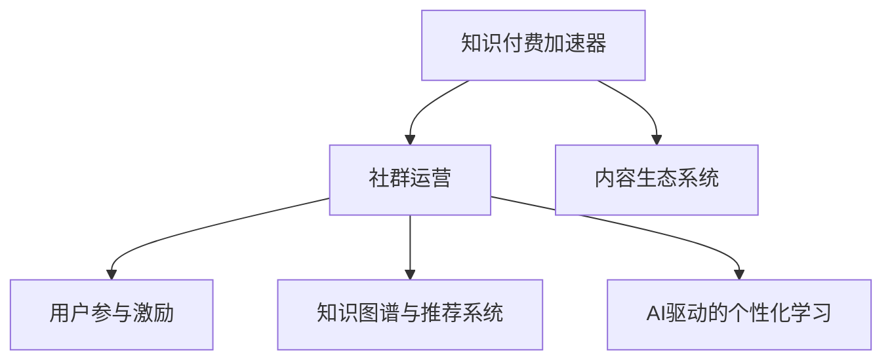

                 

# 社群运营：程序员的知识付费加速器

## 1. 背景介绍

### 1.1 问题由来
在过去十年里，知识付费市场经历了爆发式增长，尤其是面向专业人士的知识付费。而程序员作为IT行业的重要专业人群，其知识需求和获取方式也发生了显著变化。一方面，知识更新的速度越来越快，程序员需要不断学习新技能才能跟上行业发展；另一方面，传统的知识获取方式——即通过书籍、博客和公开课——已难以满足日益增长的个性化需求。

在这样的背景下，知识付费加速器应运而生。这些加速器通过提供系统化、专业化的知识内容，帮助程序员更快、更有效地掌握新知识，提升其职业竞争力。其中，社群运营是一个关键的环节，它通过聚集志同道合的专业人士，构建一个交流、分享和学习的平台，从而加速知识的传播和吸收。

### 1.2 问题核心关键点
社群运营的核心在于构建一个高效、活跃、健康的内容生态系统，其关键点包括：
1. **目标人群定位**：明确社群的核心用户群，并为其提供量身定制的知识内容。
2. **内容生态建设**：集合多种形式的知识内容，包括文本、视频、直播等，以满足不同用户的需求。
3. **用户参与激励**：通过激励机制（如积分、徽章、排行榜等）提升用户活跃度，构建良性互动。
4. **内容质量监控**：建立严格的内容审核机制，确保知识的准确性和实用性。
5. **技术支持与优化**：利用AI和大数据等技术，提升知识传播和学习的效率。

## 2. 核心概念与联系

### 2.1 核心概念概述

为了更好地理解社群运营的内在逻辑，本节将介绍几个核心概念：

- **知识付费加速器**：通过提供专业化的知识内容和服务，帮助用户快速获取和掌握新技能。

- **社群运营**：利用在线平台构建一个交流、分享和学习的社区，促进知识传播和应用。

- **内容生态系统**：由多种形式的知识内容构成，用户可以通过这个系统获取、分享和创造知识。

- **用户参与激励机制**：通过各种激励手段提升用户活跃度，构建健康的内容生态。

- **知识图谱与推荐系统**：利用知识图谱和推荐算法，为用户提供个性化推荐，提升学习效率。

- **AI驱动的个性化学习**：通过AI技术分析用户行为，提供定制化的学习计划和建议。

这些核心概念之间的逻辑关系可以通过以下Mermaid流程图来展示：



这个流程图展示了一个知识付费加速器在社群运营过程中，各个关键环节之间的联系：

1. 知识付费加速器提供基础的知识内容和服务。
2. 通过社群运营，构建一个交流学习的平台。
3. 内容生态系统支持用户获取、分享和创造知识。
4. 用户参与激励提升用户活跃度。
5. 知识图谱与推荐系统提供个性化知识推荐。
6. AI驱动的个性化学习进一步提升学习效率。

## 3. 核心算法原理 & 具体操作步骤
### 3.1 算法原理概述

社群运营的算法原理主要包括以下几个部分：

- **用户行为分析**：通过对用户的学习行为进行分析，构建用户画像，为用户提供个性化的知识内容。
- **内容推荐算法**：基于用户画像和知识内容属性，推荐与用户兴趣和需求相匹配的内容。
- **互动分析与激励**：分析用户间的互动行为，通过积分、徽章、排行榜等激励机制，提升用户参与度和满意度。
- **学习效果评估**：通过评估用户的学习效果，不断优化知识内容和推荐算法，确保内容质量。

### 3.2 算法步骤详解

基于社群运营的算法流程一般包括以下几个关键步骤：

**Step 1: 用户行为数据收集与分析**
- 收集用户在平台上的各种行为数据，如阅读时间、互动评论、课程完成率等。
- 利用机器学习算法（如聚类、分类、回归等）对用户行为进行分析和建模，构建用户画像。

**Step 2: 内容推荐系统构建**
- 构建知识图谱，描述知识内容的结构和关系。
- 基于用户画像和知识图谱，应用推荐算法（如协同过滤、基于内容的推荐等），推荐相关内容。
- 定期更新推荐模型，确保推荐的准确性和时效性。

**Step 3: 用户参与激励机制设计**
- 设计积分、徽章、排行榜等多种激励手段，提升用户活跃度。
- 通过A/B测试等方法优化激励策略，找到最佳用户参与路径。

**Step 4: 学习效果评估与反馈**
- 利用测试题、项目实践等方法，评估用户的学习效果。
- 根据评估结果，调整知识内容和推荐算法，优化学习体验。

**Step 5: 平台技术支撑**
- 利用大数据、人工智能等技术，实现自动化数据分析、内容推荐和用户互动管理。
- 建立弹性伸缩、高可用等技术架构，确保平台稳定性和可靠性。

### 3.3 算法优缺点

社群运营的算法优点主要体现在以下几个方面：
1. **个性化推荐**：通过用户画像和知识图谱，为用户推荐个性化知识内容，提升学习效率。
2. **高参与度**：多种激励手段和互动机制，提升用户参与度和满意度。
3. **实时优化**：利用大数据和AI技术，实现内容推荐和用户互动的实时优化。
4. **内容丰富**：多种形式的知识内容，满足不同用户的需求。

然而，社群运营的算法也存在一定的局限性：
1. **数据隐私问题**：用户在平台上的行为数据涉及个人隐私，需要严格的隐私保护措施。
2. **算法偏见**：推荐算法可能会存在偏见，导致推荐内容不全面或带有歧视性。
3. **高技术要求**：构建和维护高精度推荐系统，需要较高的技术门槛。
4. **成本问题**：大数据和AI技术的引入，增加了运营成本。

尽管存在这些局限性，但社群运营的算法在提供个性化学习体验、提升用户参与度方面仍具有重要价值。未来研究重点在于如何在保证用户隐私的前提下，提升算法的公平性和可解释性，同时降低技术成本。

### 3.4 算法应用领域

社群运营的算法广泛应用于知识付费平台的构建中，其典型应用场景包括：

- **在线教育平台**：如Coursera、Udacity等，通过社群运营，提升课程完成率和用户满意度。
- **专业技能培训**：如Pluralsight、Codecademy等，提供系统化、个性化的学习路径和内容。
- **职业社交网络**：如LinkedIn Learning，通过社群运营，连接专业人士，构建知识交流网络。
- **企业内训系统**：如TrainingRoom，为员工提供定制化的职业培训和知识分享平台。

这些应用场景展示了社群运营的广泛适用性，涵盖了个人职业发展和企业人才培养的不同需求。

## 4. 数学模型和公式 & 详细讲解 & 举例说明

### 4.1 数学模型构建

本节将使用数学语言对社群运营的算法模型进行更加严格的刻画。

记用户画像为 $\mathbf{u} = (u_1, u_2, ..., u_n)$，其中 $u_i$ 为用户的第 $i$ 个特征，如年龄、职业、兴趣等。知识图谱中的每个知识节点 $v_j$ 有属性 $v_{j1}, v_{j2}, ..., v_{jm}$，表示节点的不同特征。推荐算法可以表示为 $f(\mathbf{u}, \mathbf{v})$，其中 $\mathbf{v}$ 为待推荐的知识节点。

### 4.2 公式推导过程

假设推荐算法为基于内容的推荐算法，其公式为：

$$
f(\mathbf{u}, \mathbf{v}) = \sum_{i=1}^n \sum_{j=1}^m \alpha_i \beta_j u_i v_{jm}
$$

其中 $\alpha_i$ 和 $\beta_j$ 为调节参数，$u_i$ 和 $v_{jm}$ 为特征向量。根据此公式，可以计算用户 $\mathbf{u}$ 和知识节点 $\mathbf{v}$ 的相似度，从而推荐相关内容。

### 4.3 案例分析与讲解

以LinkedIn Learning为例，展示社群运营的算法模型如何在实际中应用：

**案例背景**：LinkedIn Learning是一个面向职业人士的学习平台，提供各类职业技能培训课程。

**算法模型应用**：
- **用户画像构建**：收集用户在平台上的学习记录、互动评论、职业背景等信息，构建用户画像。
- **知识图谱构建**：将课程、讲师、技能等作为知识节点，构建知识图谱。
- **推荐算法应用**：基于用户画像和知识图谱，应用基于内容的推荐算法，推荐相关课程。

**效果评估**：通过用户学习记录、课程评价等数据，评估推荐效果，并不断优化推荐算法和内容库。

## 5. 项目实践：代码实例和详细解释说明

### 5.1 开发环境搭建

在进行社群运营算法实践前，我们需要准备好开发环境。以下是使用Python进行PyTorch开发的环境配置流程：

1. 安装Anaconda：从官网下载并安装Anaconda，用于创建独立的Python环境。

2. 创建并激活虚拟环境：
```bash
conda create -n pytorch-env python=3.8 
conda activate pytorch-env
```

3. 安装PyTorch：根据CUDA版本，从官网获取对应的安装命令。例如：
```bash
conda install pytorch torchvision torchaudio cudatoolkit=11.1 -c pytorch -c conda-forge
```

4. 安装各类工具包：
```bash
pip install numpy pandas scikit-learn matplotlib tqdm jupyter notebook ipython
```

完成上述步骤后，即可在`pytorch-env`环境中开始社群运营算法的实践。

### 5.2 源代码详细实现

这里我们以内容推荐系统为例，给出使用PyTorch实现知识图谱和推荐算法的代码实现。

**知识图谱类**：
```python
import networkx as nx

class KnowledgeGraph:
    def __init__(self):
        self.graph = nx.Graph()
    
    def add_node(self, node_id, attributes):
        self.graph.add_node(node_id, **attributes)
    
    def add_edge(self, node1, node2):
        self.graph.add_edge(node1, node2)
    
    def get_neighbors(self, node):
        return list(self.graph.neighbors(node))
```

**用户画像类**：
```python
import numpy as np

class UserProfile:
    def __init__(self, features):
        self.features = features
    
    def to_vector(self):
        return np.array(self.features)
```

**推荐算法类**：
```python
class RecommendationAlgorithm:
    def __init__(self, graph, user_profile):
        self.graph = graph
        self.user_profile = user_profile
    
    def get_similarity(self, user, item):
        # 获取用户和节点的特征向量
        user_vector = user_profile.to_vector()
        item_vector = self.graph.nodes[item]['features']
        
        # 计算余弦相似度
        return np.dot(user_vector, item_vector) / (np.linalg.norm(user_vector) * np.linalg.norm(item_vector))
    
    def recommend(self, user, top_n):
        similarity_scores = {}
        for item, neighbors in self.graph.nodes(user).items():
            for neighbor in neighbors:
                if item != user:
                    similarity_scores[item] = self.get_similarity(user, item)
        
        # 排序并取前N个推荐结果
        sorted_scores = sorted(similarity_scores.items(), key=lambda x: x[1], reverse=True)
        return [x[0] for x in sorted_scores[:top_n]]
```

**主函数实现**：
```python
if __name__ == '__main__':
    # 构建知识图谱
    kg = KnowledgeGraph()
    kg.add_node(1, {'name': 'Python', 'type': 'Course'})
    kg.add_node(2, {'name': 'Deep Learning', 'type': 'Course'})
    kg.add_edge(1, 2)
    
    # 构建用户画像
    user = UserProfile({'age': 30, 'occupation': 'Software Engineer'})
    
    # 推荐系统实例化
    recommender = RecommendationAlgorithm(kg, user)
    
    # 获取推荐结果
    recommendations = recommender.recommend(1, top_n=2)
    print(recommendations)
```

### 5.3 代码解读与分析

让我们再详细解读一下关键代码的实现细节：

**KnowledgeGraph类**：
- `__init__`方法：初始化一个空图结构。
- `add_node`方法：向图中添加节点及其属性。
- `add_edge`方法：向图中添加边。
- `get_neighbors`方法：获取节点的邻居。

**UserProfile类**：
- `__init__`方法：初始化用户特征向量。
- `to_vector`方法：将特征向量转化为numpy数组，便于计算。

**RecommendationAlgorithm类**：
- `__init__`方法：初始化推荐算法，输入知识图谱和用户画像。
- `get_similarity`方法：计算用户和节点之间的相似度，采用余弦相似度公式。
- `recommend`方法：根据相似度排序，推荐用户最相关的N个节点。

**主函数实现**：
- 创建知识图谱。
- 创建用户画像。
- 创建推荐系统实例。
- 调用推荐系统，获取推荐结果。

可以看到，PyTorch的封装使得社群运营算法的代码实现变得简洁高效。开发者可以将更多精力放在数据处理、模型改进等高层逻辑上，而不必过多关注底层的实现细节。

当然，工业级的系统实现还需考虑更多因素，如模型的保存和部署、超参数的自动搜索、更灵活的任务适配层等。但核心的推荐算法基本与此类似。

## 6. 实际应用场景
### 6.1 在线教育平台

基于社群运营的推荐系统，可以广泛应用于在线教育平台的课程推荐中。传统的推荐方式往往基于用户的浏览和评分历史，但这种方式难以捕捉用户的潜在兴趣和知识需求。通过社群运营算法，可以构建一个互动的学习社区，动态捕捉用户的学习兴趣和行为模式，从而实现更精准的课程推荐。

例如，Coursera和Udacity等平台通过分析用户的互动记录和学习效果，动态推荐与其学习路径和兴趣相匹配的课程，提升了课程的完成率和用户满意度。

### 6.2 专业技能培训

在专业技能培训领域，社群运营推荐系统能够帮助用户构建个性化的学习路径，提升学习效率。例如，LinkedIn Learning通过分析用户的学习记录和互动评论，推荐与其职业背景和技能需求相关的课程，促进用户职业成长。

### 6.3 职业社交网络

在职业社交网络中，社群运营推荐系统能够帮助用户发现和连接志同道合的专业人士，构建知识交流网络。例如，LinkedIn通过分析用户的职业背景、技能和兴趣，推荐相关专业人士进行互动，促进职业发展。

### 6.4 企业内训系统

在企业内训系统中，社群运营推荐系统能够帮助员工发现和掌握企业内部的知识资源，提升职业能力和工作效率。例如，TrainingRoom通过分析员工的学习记录和互动评论，推荐与其职业发展相关的课程和资源，促进团队协作和知识共享。

### 6.5 未来应用展望

随着社群运营推荐算法的不断发展，其在更多领域的应用前景将更加广阔：

- **医疗健康**：通过分析用户健康数据和互动记录，推荐个性化健康管理课程和资源，提升用户健康水平。
- **金融投资**：通过分析用户的投资记录和行为模式，推荐个性化的金融知识和工具，提升投资收益。
- **文化娱乐**：通过分析用户的娱乐偏好和互动记录，推荐个性化的影视、音乐和游戏内容，提升娱乐体验。
- **社会治理**：通过分析用户的社区参与记录和互动评论，推荐公益活动和知识资源，促进社会和谐。

社群运营推荐系统将成为推动各行各业数字化转型的重要工具，为社会带来更广泛的知识传播和应用。

## 7. 工具和资源推荐
### 7.1 学习资源推荐

为了帮助开发者系统掌握社群运营推荐算法的理论基础和实践技巧，这里推荐一些优质的学习资源：

1. **《推荐系统实战》**：由郑毅、黄海广等专家所著，全面介绍了推荐系统的理论基础和实际应用，适合初学者和进阶开发者。

2. **《深度学习推荐系统》**：由段劲松、卢东旭等专家所著，涵盖推荐系统在大数据和深度学习中的最新进展。

3. **CS353《信息检索》课程**：斯坦福大学开设的推荐系统经典课程，详细讲解了推荐算法的理论基础和实践方法。

4. **Kaggle竞赛平台**：通过参与推荐系统相关的竞赛，实践推荐算法，提升实战经验。

5. **Arxiv预印本平台**：查阅最新的推荐系统研究成果，了解最新的算法和应用进展。

通过对这些资源的学习实践，相信你一定能够快速掌握社群运营推荐算法的精髓，并用于解决实际的推荐问题。

### 7.2 开发工具推荐

高效的开发离不开优秀的工具支持。以下是几款用于社群运营推荐算法开发的常用工具：

1. **PyTorch**：基于Python的开源深度学习框架，灵活动态的计算图，适合快速迭代研究。

2. **TensorFlow**：由Google主导开发的开源深度学习框架，生产部署方便，适合大规模工程应用。

3. **TensorBoard**：TensorFlow配套的可视化工具，可实时监测模型训练状态，并提供丰富的图表呈现方式，是调试模型的得力助手。

4. **Weights & Biases**：模型训练的实验跟踪工具，可以记录和可视化模型训练过程中的各项指标，方便对比和调优。

5. **Jupyter Notebook**：免费的交互式编程环境，支持Python和多种科学计算库，适合快速实验和撰写文档。

合理利用这些工具，可以显著提升社群运营推荐算法的开发效率，加快创新迭代的步伐。

### 7.3 相关论文推荐

社群运营推荐算法的不断发展源于学界的持续研究。以下是几篇奠基性的相关论文，推荐阅读：

1. **《Presto: A Hybrid Recommender System for Internet Commerce》**：提出基于协同过滤和内容推荐的混合推荐系统，提升推荐效果和鲁棒性。

2. **《Surpassing Human Performance with Deep Active Learning》**：引入深度学习技术，通过主动学习策略提升推荐系统的性能。

3. **《Matrix Factorization Techniques for Recommender Systems》**：提出矩阵分解技术，利用协同过滤算法构建推荐模型，解决稀疏性问题。

4. **《Scalable Collaborative Filtering: A Unified Approach》**：提出多种推荐算法，并通过实验对比，选择最优算法进行实际应用。

5. **《A Survey of Recommendation Systems》**：由Bharat Rindal等专家撰写，全面综述了推荐系统的发展历程和最新进展。

这些论文代表了大数据推荐系统的发展脉络。通过学习这些前沿成果，可以帮助研究者把握学科前进方向，激发更多的创新灵感。

## 8. 总结：未来发展趋势与挑战
### 8.1 总结

本文对社群运营推荐算法的理论和实践进行了全面系统的介绍。首先阐述了推荐系统在知识付费加速器中的重要地位，明确了社群运营推荐算法在个性化推荐、用户参与激励等方面的关键作用。其次，从原理到实践，详细讲解了社群运营算法的数学模型和具体操作步骤，给出了推荐系统开发的完整代码实例。同时，本文还广泛探讨了推荐系统在多个行业领域的应用前景，展示了推荐系统技术的发展潜力和应用价值。

通过本文的系统梳理，可以看到，社群运营推荐算法在知识付费加速器中扮演着越来越重要的角色，极大地提升了用户的个性化学习体验和满意度。未来，伴随推荐算法的不断演进，知识付费加速器必将在更多领域发挥更大的作用，为社会带来更广泛的知识传播和应用。

### 8.2 未来发展趋势

展望未来，社群运营推荐算法的技术发展将呈现以下几个趋势：

1. **深度学习与强化学习的结合**：通过深度强化学习技术，提升推荐系统的个性化和实时性。

2. **多模态数据融合**：结合文本、图像、视频等多种数据形式，提供更加全面和精准的推荐结果。

3. **联邦学习**：通过分布式数据计算，提升推荐系统的数据隐私和安全。

4. **动态知识图谱**：构建动态的知识图谱，不断更新和优化推荐算法。

5. **推荐系统公平性**：研究推荐系统的公平性问题，避免偏见和歧视，确保推荐结果的公正性。

以上趋势凸显了社群运营推荐算法的广阔前景。这些方向的探索发展，必将进一步提升推荐系统的性能和应用范围，为知识付费加速器带来新的突破。

### 8.3 面临的挑战

尽管社群运营推荐算法已经取得了显著成果，但在迈向更加智能化、普适化应用的过程中，它仍面临诸多挑战：

1. **数据隐私问题**：用户在平台上的行为数据涉及个人隐私，需要严格的隐私保护措施。

2. **算法偏见**：推荐算法可能会存在偏见，导致推荐内容不全面或带有歧视性。

3. **高技术要求**：构建和维护高精度推荐系统，需要较高的技术门槛。

4. **成本问题**：大数据和AI技术的引入，增加了运营成本。

尽管存在这些挑战，但社群运营推荐算法的技术发展仍在不断突破，研究者们正在寻找新的解决方案。相信随着技术的不断进步，推荐系统必将在更多领域得到广泛应用，推动社会智能化水平进一步提升。

### 8.4 未来突破

面对社群运营推荐算法所面临的种种挑战，未来的研究需要在以下几个方面寻求新的突破：

1. **提升算法公平性**：研究推荐系统的公平性问题，避免偏见和歧视，确保推荐结果的公正性。

2. **优化数据隐私保护**：通过差分隐私、联邦学习等技术，提升推荐系统的数据隐私保护能力。

3. **提高算法可解释性**：通过可解释AI技术，提升推荐系统的可解释性，增强用户信任和满意度。

4. **降低技术成本**：通过模型压缩、知识蒸馏等技术，降低推荐系统的技术成本，提升经济性。

5. **提升实时性**：通过在线学习、流式推荐等技术，提升推荐系统的实时性和响应速度。

这些研究方向的探索，必将引领社群运营推荐算法的技术发展，推动知识付费加速器在更多领域的应用。未来，随着推荐算法的不断进步，社群运营推荐系统必将在构建人机协同的智能时代中扮演越来越重要的角色。

## 9. 附录：常见问题与解答

**Q1: 社群运营推荐算法的核心是什么？**

A: 社群运营推荐算法的核心在于构建用户画像，利用知识图谱和推荐算法，为用户推荐个性化内容，提升学习效率和用户满意度。

**Q2: 社群运营推荐算法有哪些步骤？**

A: 社群运营推荐算法的主要步骤包括：数据收集与分析、知识图谱构建、推荐算法应用、用户参与激励设计、学习效果评估与反馈、平台技术支撑等。

**Q3: 社群运营推荐算法有哪些应用场景？**

A: 社群运营推荐算法广泛应用于在线教育平台、专业技能培训、职业社交网络、企业内训系统等多个领域，为各类专业人士提供个性化学习资源。

**Q4: 社群运营推荐算法的优点和缺点是什么？**

A: 社群运营推荐算法的优点包括个性化推荐、高用户参与度、实时优化等；缺点包括数据隐私问题、算法偏见、高技术要求等。

**Q5: 社群运营推荐算法的发展趋势是什么？**

A: 社群运营推荐算法的发展趋势包括深度学习与强化学习结合、多模态数据融合、联邦学习、动态知识图谱、推荐系统公平性等。

作者：禅与计算机程序设计艺术 / Zen and the Art of Computer Programming

