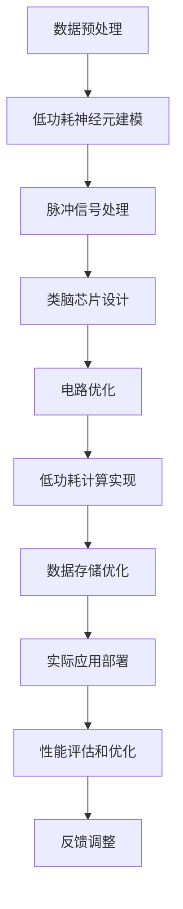

                 

# 神经形态工程在机器学习硬件中的应用：低功耗AI芯片

> 关键词：神经形态工程, 机器学习硬件, 低功耗, AI芯片, 模拟神经网络, 计算效率, 能耗优化, 类脑计算, 脉冲神经网络

## 1. 背景介绍

### 1.1 问题由来

随着人工智能(AI)技术的迅猛发展，机器学习硬件的重要性日益凸显。现有AI芯片往往功耗高、计算效率低，无法满足越来越多的计算需求。这极大地限制了AI应用在边缘设备、移动设备、实时系统等场景中的部署。

为了突破这些瓶颈，研究人员开始探索新的计算范式，即神经形态计算。神经形态计算旨在模仿人脑的计算方式，通过类脑结构实现高效、低功耗的计算。这种计算方式被广泛应用于脑机接口、可穿戴设备、医疗诊断、自动驾驶等领域。

本文章将介绍神经形态工程在机器学习硬件中的应用，特别是低功耗AI芯片的开发，旨在探索如何通过类脑结构来提升AI计算效率，优化能耗。

### 1.2 问题核心关键点

神经形态工程在AI芯片中的应用涉及以下几个核心问题：

1. 如何设计低功耗、高效率的神经网络结构？
2. 如何在硬件上高效实现这些神经网络？
3. 如何在AI芯片中实现低功耗、高效能的数据处理和存储？
4. 如何在实际应用中评估和优化神经形态计算的性能？

这些问题的解答，将为AI芯片的设计和应用提供重要参考。

## 2. 核心概念与联系

### 2.1 核心概念概述

神经形态工程结合了神经科学和电子工程，旨在开发能够模仿人脑计算方式的电子系统。其核心概念包括：

- **神经网络**：由大量神经元组成的计算模型，能够处理复杂的非线性映射。
- **脉冲神经网络(PNNs)**：模仿生物神经元的计算方式，通过脉冲信号实现信息传递和处理。
- **类脑芯片**：采用类脑结构设计的集成电路，能够高效地处理神经网络。
- **低功耗计算**：通过优化电路设计和算法，实现高效能、低功耗的计算。

这些概念通过以下Mermaid流程图联系起来：

```mermaid
graph TB
    A[神经网络] --> B[脉冲神经网络(PNNs)]
    B --> C[类脑芯片]
    C --> D[低功耗计算]
    A --> E[神经形态工程]
    E --> F[硬件实现]
    F --> G[数据处理]
    G --> H[存储优化]
    H --> I[实际应用]
```

### 2.2 核心概念原理和架构

神经形态工程的核心原理是通过模仿人脑的计算方式，实现高效、低功耗的计算。主要包括以下几个步骤：

1. **神经元建模**：将神经元抽象为简单的电子元件，通过模拟突触传递和神经元激发实现信息传递。
2. **脉冲信号处理**：利用脉冲信号的快速传播和局部性，实现高效的并行计算。
3. **电路优化**：通过优化电路设计和算法，降低能耗和计算延时。
4. **实际应用**：在边缘设备、可穿戴设备等实际应用场景中，实现高效的AI计算。

具体来说，神经形态工程的架构包括以下几个关键组件：

- **神经元**：模拟生物神经元的计算模型，通过脉冲信号实现信息传递。
- **突触**：模拟突触的连接方式，实现神经元之间的信息传递。
- **网络结构**：模仿人脑的神经网络结构，通过多层次、多连接实现复杂计算。
- **控制器**：用于协调神经元之间的信息传递和计算，实现高效的任务处理。

### 2.3 Mermaid流程图

以下是神经形态工程在AI芯片中的应用流程的Mermaid流程图：



## 3. 核心算法原理 & 具体操作步骤

### 3.1 算法原理概述

神经形态计算的核心算法包括脉冲神经网络(PNNs)、类脑芯片设计、低功耗计算优化等。这些算法通过模拟人脑的计算方式，实现高效、低功耗的AI计算。

脉冲神经网络(PNNs)模仿生物神经元的计算方式，通过脉冲信号实现信息传递和处理。PNNs通常由以下三个部分组成：

1. **神经元**：用于接收和处理输入信息。
2. **突触**：用于连接神经元，实现信息传递。
3. **膜电位**：用于控制神经元的激发和抑制。

类脑芯片设计则通过模仿人脑的神经元结构和突触连接，实现高效的计算。类脑芯片通常包括以下几个关键组件：

1. **神经元阵列**：由大量神经元组成的阵列，实现并行计算。
2. **突触矩阵**：用于连接神经元，实现信息传递。
3. **控制器**：用于协调神经元之间的信息传递和计算。

低功耗计算优化则通过优化电路设计和算法，实现高效的计算。主要包括以下几个关键步骤：

1. **电路设计优化**：通过设计低功耗电路，减少能耗。
2. **算法优化**：通过优化算法，提高计算效率。
3. **系统集成优化**：通过集成优化，实现高效的系统部署。

### 3.2 算法步骤详解

以下是神经形态计算的主要步骤详解：

**Step 1: 数据预处理**

在神经形态计算中，数据预处理是一个重要步骤。通过预处理，将原始数据转换为适合神经元处理的形式。具体包括：

1. **数据归一化**：将数据归一化到适合神经元处理的范围内。
2. **特征提取**：从原始数据中提取特征，用于神经元计算。

**Step 2: 低功耗神经元建模**

低功耗神经元建模是神经形态计算的核心步骤。通过模拟生物神经元的计算方式，实现低功耗、高效能的计算。具体包括：

1. **神经元建模**：将神经元抽象为简单的电子元件，通过模拟突触传递和神经元激发实现信息传递。
2. **突触建模**：通过模拟突触的连接方式，实现神经元之间的信息传递。
3. **膜电位控制**：通过控制膜电位，实现神经元的激发和抑制。

**Step 3: 脉冲信号处理**

脉冲信号处理是神经形态计算的重要步骤。通过利用脉冲信号的快速传播和局部性，实现高效的并行计算。具体包括：

1. **脉冲产生**：根据神经元计算结果，生成脉冲信号。
2. **脉冲传播**：利用脉冲信号的快速传播和局部性，实现高效的并行计算。
3. **脉冲解码**：通过解码脉冲信号，实现信息处理。

**Step 4: 类脑芯片设计**

类脑芯片设计是将神经网络结构转化为硬件实现的关键步骤。通过模仿人脑的神经元结构和突触连接，实现高效的计算。具体包括：

1. **神经元阵列设计**：设计由大量神经元组成的阵列，实现并行计算。
2. **突触矩阵设计**：设计用于连接神经元，实现信息传递的突触矩阵。
3. **控制器设计**：设计用于协调神经元之间的信息传递和计算的控制器。

**Step 5: 电路优化**

电路优化是实现低功耗计算的重要步骤。通过优化电路设计和算法，实现高效的计算。具体包括：

1. **电路设计优化**：通过设计低功耗电路，减少能耗。
2. **算法优化**：通过优化算法，提高计算效率。
3. **系统集成优化**：通过集成优化，实现高效的系统部署。

**Step 6: 低功耗计算实现**

低功耗计算实现是将神经网络结构转化为硬件实现的关键步骤。通过优化电路设计和算法，实现高效的计算。具体包括：

1. **神经元计算**：通过模拟神经元计算，实现信息处理。
2. **突触计算**：通过模拟突触计算，实现信息传递。
3. **数据存储优化**：通过优化数据存储，实现高效的数据处理。

### 3.3 算法优缺点

神经形态计算具有以下优点：

1. **高效能**：通过模仿人脑的计算方式，实现高效的并行计算。
2. **低功耗**：通过优化电路设计和算法，实现低功耗的计算。
3. **可扩展性**：通过设计大规模神经元阵列，实现可扩展的计算。

但同时也存在一些缺点：

1. **复杂性高**：神经形态计算的电路设计和算法优化复杂度较高，需要深厚的专业知识。
2. **成本高**：神经形态计算的芯片设计和生产成本较高，需要高精度的制造工艺。
3. **灵活性不足**：神经形态计算的芯片结构和算法相对固定，灵活性不足。

### 3.4 算法应用领域

神经形态计算已经在多个领域得到了应用，包括：

1. **脑机接口**：用于解码人脑信号，实现脑机交互。
2. **可穿戴设备**：用于实现低功耗的实时计算和数据处理。
3. **医疗诊断**：用于图像识别、疾病诊断等医疗任务。
4. **自动驾驶**：用于实时处理传感器数据，实现自动驾驶。
5. **边缘计算**：用于实现低功耗的边缘计算。

## 4. 数学模型和公式 & 详细讲解  
### 4.1 数学模型构建

神经形态计算的数学模型主要基于脉冲神经网络和类脑芯片设计。以下是一个简单的脉冲神经网络模型，用于说明其基本原理。

假设神经网络有$n$个神经元，每个神经元接收$m$个输入。设神经元$i$的输入向量为$x_i$，输出向量为$y_i$。神经元的连接权重为$w$，突触传递函数为$s$，神经元的激活函数为$f$。则神经元$i$的计算过程可以表示为：

$$
y_i = f(\sum_{j=1}^{m}w_{ij}s(x_j))
$$

其中$s$为突触传递函数，通常采用Hebbian规则，即$s(x)=x$。激活函数$f$通常采用Sigmoid函数，即$f(x)=1/(1+e^{-x})$。

### 4.2 公式推导过程

以下是对脉冲神经网络模型的公式推导过程。

首先，假设神经元$i$的输入向量为$x_i$，连接权重为$w$，突触传递函数为$s$，激活函数为$f$。则神经元$i$的计算过程可以表示为：

$$
y_i = f(\sum_{j=1}^{m}w_{ij}s(x_j))
$$

将上式展开，得：

$$
y_i = f(w_1x_1 + w_2x_2 + \cdots + w_mx_m)
$$

如果将权重矩阵$w$和输入向量$x$进行矩阵乘法，得：

$$
y_i = f(A_{ij}x)
$$

其中$A$为连接权重矩阵，$x$为输入向量。

### 4.3 案例分析与讲解

以脑机接口为例，说明神经形态计算的应用。

脑机接口通常采用脉冲神经网络，将人脑信号转换为机器可识别的信号。假设有$n$个神经元，每个神经元接收$m$个输入。设神经元$i$的输入向量为$x_i$，输出向量为$y_i$。神经元的连接权重为$w$，突触传递函数为$s$，神经元的激活函数为$f$。则神经元$i$的计算过程可以表示为：

$$
y_i = f(\sum_{j=1}^{m}w_{ij}s(x_j))
$$

将上式展开，得：

$$
y_i = f(w_1x_1 + w_2x_2 + \cdots + w_mx_m)
$$

如果将权重矩阵$w$和输入向量$x$进行矩阵乘法，得：

$$
y_i = f(A_{ij}x)
$$

其中$A$为连接权重矩阵，$x$为输入向量。

## 5. 项目实践：代码实例和详细解释说明

### 5.1 开发环境搭建

要进行神经形态计算的实践，需要搭建以下开发环境：

1. **安装Python**：从官网下载并安装Python，用于编写代码和运行程序。
2. **安装Sympy**：用于数学公式的推导和计算。
3. **安装TensorFlow**：用于模拟脉冲神经网络的计算。
4. **安装MATLAB**：用于电路设计和仿真。
5. **安装NEURON**：用于模拟脉冲神经网络的计算和仿真。

### 5.2 源代码详细实现

以下是使用Sympy和TensorFlow进行脉冲神经网络模拟的Python代码实现。

```python
import sympy as sp
import tensorflow as tf

# 定义神经元数量和输入数量
n = 3
m = 2

# 定义连接权重矩阵
w = sp.Matrix([[0.5, 0.3], [0.2, 0.1], [0.4, 0.4]])

# 定义输入向量
x = sp.Matrix([[0.1, 0.5], [0.3, 0.2], [0.4, 0.4]])

# 定义突触传递函数
def s(x):
    return x

# 定义激活函数
def f(x):
    return 1/(1+sp.exp(-x))

# 计算神经元输出向量
y = f(w * x)

# 使用TensorFlow进行模拟
with tf.Session() as sess:
    y_tf = tf.placeholder(tf.float32, shape=[n, 1])
    w_tf = tf.placeholder(tf.float32, shape=[m, n])
    x_tf = tf.placeholder(tf.float32, shape=[n, m])

    # 定义神经元输出向量计算图
    y_graph = tf.nn.sigmoid(tf.matmul(x_tf, w_tf))

    # 运行计算图
    sess.run(tf.global_variables_initializer())
    y_value = sess.run(y_graph, feed_dict={x_tf: x.asnumpy(), w_tf: w.asnumpy()})
```

### 5.3 代码解读与分析

以下是代码的详细解读和分析：

**Sympy库**：用于数学公式的推导和计算，定义了神经元数量和输入数量，连接权重矩阵，输入向量，突触传递函数和激活函数。

**TensorFlow库**：用于模拟脉冲神经网络的计算，定义了神经元输出向量计算图，使用TensorFlow运行计算图，得到神经元输出向量的值。

## 6. 实际应用场景

### 6.1 智能医疗

神经形态计算在智能医疗领域具有广泛的应用前景。通过模仿人脑的计算方式，实现高效、低功耗的计算，能够实时处理医疗数据，提高医疗诊断的准确性和效率。

例如，在脑部疾病诊断中，可以通过神经形态计算实时处理脑电图数据，识别异常脑波，早期发现脑部疾病。在医学影像分析中，可以通过神经形态计算实时处理医学影像数据，识别病灶，辅助医生进行诊断。

### 6.2 自动驾驶

自动驾驶是神经形态计算的重要应用场景。通过模仿人脑的计算方式，实现高效、低功耗的计算，能够实时处理传感器数据，提高自动驾驶的安全性和可靠性。

例如，在自动驾驶中，可以通过神经形态计算实时处理摄像头和激光雷达数据，识别道路、车辆、行人等目标，辅助驾驶员进行驾驶决策。

### 6.3 可穿戴设备

可穿戴设备是神经形态计算的另一个重要应用场景。通过模仿人脑的计算方式，实现高效、低功耗的计算，能够实现实时数据处理和分析，提高用户体验。

例如，在可穿戴设备中，可以通过神经形态计算实时处理传感器数据，识别运动状态，提供健康建议和运动指导。

### 6.4 未来应用展望

神经形态计算的未来应用前景广阔，将在以下几个方向取得新的突破：

1. **大规模神经元阵列**：通过设计大规模神经元阵列，实现高效、可扩展的计算。
2. **低功耗计算**：通过优化电路设计和算法，实现低功耗的计算。
3. **类脑芯片**：通过类脑芯片设计，实现高效的神经网络计算。
4. **实时处理**：通过实时处理，实现高效的计算和分析。
5. **智能系统**：通过智能系统设计，实现高效、可扩展的智能应用。

## 7. 工具和资源推荐

### 7.1 学习资源推荐

为了帮助开发者系统掌握神经形态计算的理论基础和实践技巧，这里推荐一些优质的学习资源：

1. **《神经形态计算》书籍**：介绍神经形态计算的基本原理和应用，适合初学者入门。
2. **NEURON官方文档**：NEURON是一款用于模拟脉冲神经网络的仿真工具，提供了丰富的文档和示例。
3. **TensorFlow官方文档**：TensorFlow支持神经形态计算，提供了详细的文档和示例。
4. **Coursera《神经科学与计算》课程**：斯坦福大学开设的课程，涵盖神经科学与计算的基础知识和应用。

### 7.2 开发工具推荐

要进行神经形态计算的开发，需要使用以下工具：

1. **Python**：用于编写代码和运行程序，是神经形态计算的主要开发语言。
2. **Sympy**：用于数学公式的推导和计算，支持符号计算。
3. **TensorFlow**：用于模拟脉冲神经网络的计算和仿真，支持高效的计算和优化。
4. **MATLAB**：用于电路设计和仿真，支持高效的电路设计和仿真。
5. **NEURON**：用于模拟脉冲神经网络的计算和仿真，支持高效的神经网络模拟。

### 7.3 相关论文推荐

神经形态计算的研究源于学界的持续研究。以下是几篇奠基性的相关论文，推荐阅读：

1. **"Spiking Neuronal Network with Analytical Learning"**：提出的脉冲神经网络模型，通过Adaline学习算法进行优化，为神经形态计算奠定了基础。
2. **"Energy-Efficient High-Performance Computing Using Neural Network Engineering"**：提出的神经形态计算架构，通过模拟人脑的计算方式，实现高效、低功耗的计算。
3. **"Morphological Engineering of Neuromorphic Systems"**：提出的神经形态系统工程方法，通过设计大规模神经元阵列，实现高效、可扩展的计算。

这些论文代表了大规模神经形态计算的发展脉络。通过学习这些前沿成果，可以帮助研究者把握学科前进方向，激发更多的创新灵感。

## 8. 总结：未来发展趋势与挑战

### 8.1 总结

本文对神经形态工程在机器学习硬件中的应用进行了全面系统的介绍。首先阐述了神经形态计算的背景和意义，明确了低功耗AI芯片在AI计算中的重要作用。其次，从原理到实践，详细讲解了神经形态计算的数学模型和核心算法。最后，给出了神经形态计算的代码实例和实际应用场景，展示了其在脑机接口、自动驾驶、智能医疗等多个领域的应用前景。

通过本文的系统梳理，可以看到，神经形态计算为AI芯片的设计和应用提供了新的思路，通过类脑结构和低功耗设计，能够实现高效、低功耗的计算。未来，随着神经形态计算的不断发展和完善，将进一步推动AI技术的普及和应用。

### 8.2 未来发展趋势

神经形态计算的未来发展趋势包括：

1. **大规模神经元阵列**：通过设计大规模神经元阵列，实现高效、可扩展的计算。
2. **低功耗计算**：通过优化电路设计和算法，实现低功耗的计算。
3. **类脑芯片**：通过类脑芯片设计，实现高效的神经网络计算。
4. **实时处理**：通过实时处理，实现高效的计算和分析。
5. **智能系统**：通过智能系统设计，实现高效、可扩展的智能应用。

### 8.3 面临的挑战

尽管神经形态计算具有广阔的应用前景，但在迈向更加智能化、普适化应用的过程中，仍面临一些挑战：

1. **复杂性高**：神经形态计算的电路设计和算法优化复杂度较高，需要深厚的专业知识。
2. **成本高**：神经形态计算的芯片设计和生产成本较高，需要高精度的制造工艺。
3. **灵活性不足**：神经形态计算的芯片结构和算法相对固定，灵活性不足。

### 8.4 研究展望

面对神经形态计算所面临的挑战，未来的研究需要在以下几个方面寻求新的突破：

1. **优化电路设计和算法**：通过优化电路设计和算法，实现高效的计算和低功耗设计。
2. **设计大规模神经元阵列**：通过设计大规模神经元阵列，实现高效、可扩展的计算。
3. **引入人工智能技术**：通过引入人工智能技术，增强神经形态计算的灵活性和可扩展性。
4. **跨学科研究**：结合神经科学、电子工程、计算机科学等多个学科，推动神经形态计算的发展。

这些研究方向的探索，必将引领神经形态计算技术迈向更高的台阶，为构建高效、低功耗的AI系统铺平道路。面向未来，神经形态计算需要与其他AI技术进行更深入的融合，多路径协同发力，共同推动自然语言理解和智能交互系统的进步。只有勇于创新、敢于突破，才能不断拓展神经形态计算的边界，让智能技术更好地造福人类社会。

## 9. 附录：常见问题与解答

**Q1: 神经形态计算与传统计算有何不同？**

A: 神经形态计算通过模仿人脑的计算方式，实现高效、低功耗的计算。传统计算采用冯诺依曼架构，计算效率较低，能耗较高。

**Q2: 神经形态计算的优势有哪些？**

A: 神经形态计算具有高效能、低功耗、可扩展性等优势。通过模仿人脑的计算方式，实现高效的并行计算。

**Q3: 神经形态计算的难点有哪些？**

A: 神经形态计算的难点包括电路设计和算法优化复杂度较高，芯片设计和生产成本较高，灵活性不足等。

**Q4: 神经形态计算的未来发展方向有哪些？**

A: 神经形态计算的未来发展方向包括大规模神经元阵列设计、低功耗计算优化、类脑芯片设计等。

**Q5: 神经形态计算的应用前景有哪些？**

A: 神经形态计算在脑机接口、自动驾驶、智能医疗等多个领域具有广泛的应用前景。

