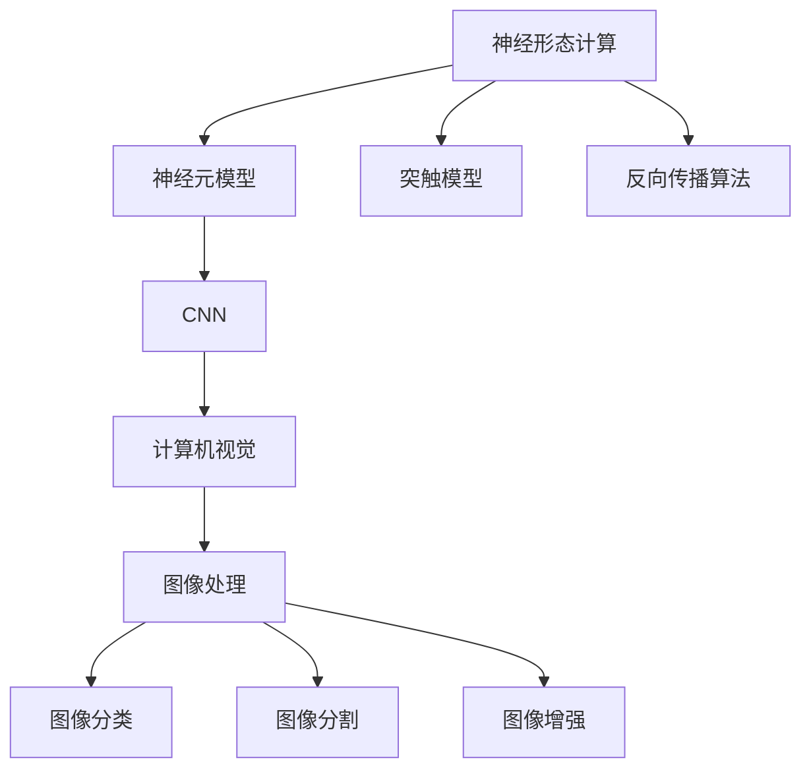

                 

# 神经形态视觉传感器：模仿人眼的图像处理

> 关键词：神经形态视觉传感器, 神经元模型, 反向传播算法, 卷积神经网络, 计算机视觉, 图像处理

## 1. 背景介绍

### 1.1 问题由来

计算机视觉领域的发展离不开对人类视觉系统的借鉴。自20世纪90年代以来，人工神经网络(ANN)模型逐渐替代了传统的计算机视觉算法，在图像分类、目标检测、图像生成等任务上取得了显著的进步。然而，这些深度学习模型仍存在能效低、模型规模庞大等问题，难以在大规模实时场景下广泛应用。

神经形态计算是一种基于生物神经网络的计算模型，通过模拟人类大脑的神经元、突触等基本单元进行信息处理。近年来，神经形态计算在硬件加速、低功耗等方面展现了其独特的优势。模仿人眼视觉感知机制的神经形态视觉传感器，更是将这两大领域的结合推向了新的高度，为图像处理提供了全新的计算范式。

本文将从神经形态视觉传感器的核心原理出发，详细介绍其工作机制和应用场景，并通过具体案例，展示其在图像处理上的优势和潜在潜力。

### 1.2 问题核心关键点

- **神经形态视觉传感器**：模仿人眼视觉感知机制，基于神经元-突触结构计算的图像传感器。
- **神经元模型**：构成神经形态视觉传感器基础的生物神经元模型，如Hodgkin-Huxley模型、AdEx模型等。
- **反向传播算法**：模拟人脑神经元传递信息的机制，用于训练神经形态视觉传感器。
- **卷积神经网络(CNN)**：经典的人工神经网络结构，用于模仿人眼视觉处理机制。
- **计算机视觉**：将计算机技术与视觉感知技术结合，实现图像处理、模式识别等功能的领域。
- **图像处理**：对图像信息进行处理、分析、识别的技术，包括图像分类、分割、增强等。

## 2. 核心概念与联系

### 2.1 核心概念概述

为更好地理解神经形态视觉传感器，本节将介绍几个密切相关的核心概念：

- **神经形态计算(Neural Morphological Engineering, NME)**：一种基于神经元-突触结构进行信息处理的计算模型，旨在实现高效、低功耗的计算。
- **神经元模型**：描述生物神经元行为的数学模型，如Hodgkin-Huxley模型、AdEx模型等。
- **突触模型**：描述神经元之间传递信息的机制，包括电突触、化学突触等。
- **反向传播算法(Backpropagation)**：模拟人脑神经元传递信息的机制，用于训练人工神经网络。
- **卷积神经网络(CNN)**：一种经典的人工神经网络结构，模仿人眼视觉处理机制。
- **计算机视觉(Computer Vision)**：将计算机技术与视觉感知技术结合，实现图像处理、模式识别等功能的领域。
- **图像处理(Image Processing)**：对图像信息进行处理、分析、识别的技术，包括图像分类、分割、增强等。

这些概念之间的逻辑关系可以通过以下Mermaid流程图来展示：



这个流程图展示了几大核心概念之间的联系：

1. 神经形态计算模仿人类大脑的神经元-突触结构，构建计算模型。
2. 神经元模型用于描述生物神经元的行为，形成神经形态计算的基础。
3. 突触模型用于描述神经元之间传递信息的机制，进一步完善神经形态计算模型。
4. 反向传播算法用于模拟人脑神经元传递信息的机制，用于训练人工神经网络。
5. CNN模仿人眼视觉处理机制，用于计算机视觉中的图像处理任务。
6. 计算机视觉结合计算机技术和视觉感知技术，实现图像处理、模式识别等功能。
7. 图像处理对图像信息进行处理、分析、识别，包括图像分类、分割、增强等。

## 3. 核心算法原理 & 具体操作步骤

### 3.1 算法原理概述

神经形态视觉传感器基于神经元-突触模型构建，通过模仿人眼视觉感知机制进行图像处理。其核心算法原理包括神经元模型、突触模型和反向传播算法。

#### 3.1.1 神经元模型

神经元模型是构成神经形态视觉传感器的基本单位，模仿生物神经元的行为。目前常用的神经元模型包括Hodgkin-Huxley模型、AdEx模型等。这些模型通过描述神经元的电流和电压变化，来模拟神经元的行为。

#### 3.1.2 突触模型

突触模型用于描述神经元之间传递信息的机制，包括电突触和化学突触。电突触通过直接传递电信号，模拟神经元之间的快速沟通；化学突触通过神经递质传递信号，模拟神经元之间的复杂沟通。

#### 3.1.3 反向传播算法

反向传播算法用于训练神经形态视觉传感器，模拟人脑神经元传递信息的机制。通过前向传播计算神经元输出，反向传播计算误差，更新神经元参数，逐步优化模型性能。

### 3.2 算法步骤详解

#### 3.2.1 数据预处理

在训练神经形态视觉传感器之前，需要对其进行数据预处理，将图像转换为适合神经元处理的信号形式。常用的预处理方法包括：

1. **图像灰度化**：将彩色图像转换为灰度图像，减少计算复杂度。
2. **归一化**：将图像像素值归一化到一定范围，方便神经元处理。
3. **下采样**：对图像进行下采样，减小图像尺寸，减少计算量。

#### 3.2.2 神经元-突触建模

将神经元模型和突触模型应用于图像处理，构建神经形态视觉传感器。常用的神经元模型包括Hodgkin-Huxley模型、AdEx模型等。

1. **神经元建模**：定义神经元模型参数，如电导率、激活函数等。
2. **突触建模**：定义突触模型参数，如突触权重、突触延时等。

#### 3.2.3 前向传播计算

将输入图像信号送入神经形态视觉传感器，进行前向传播计算，输出特征图。

1. **输入编码**：将图像像素值转换为神经元可处理的信号形式，送入神经元。
2. **神经元激活**：根据神经元模型，计算神经元输出信号。
3. **特征图生成**：通过多个神经元层的激活，生成多层次的特征图。

#### 3.2.4 反向传播训练

使用反向传播算法对神经形态视觉传感器进行训练，优化模型参数，提升模型性能。

1. **误差计算**：计算模型输出与真实标签之间的误差。
2. **参数更新**：根据误差计算结果，更新神经元参数。
3. **迭代优化**：重复上述步骤，逐步优化模型性能。

#### 3.2.5 输出解码

将神经形态视觉传感器输出的特征图转换为图像处理结果，进行后处理。

1. **特征图解码**：将特征图转换为图像信号。
2. **图像增强**：使用滤波、增强等技术，优化图像效果。

### 3.3 算法优缺点

#### 3.3.1 优点

1. **低功耗**：神经形态视觉传感器使用神经元-突触结构，具有低功耗的特点，适合大规模实时图像处理场景。
2. **高效计算**：通过模拟人脑神经元传递信息的机制，神经形态视觉传感器能够高效计算图像特征，提升计算速度。
3. **鲁棒性强**：神经形态视觉传感器具有较强的鲁棒性，能够抵抗噪声、光照变化等干扰，提高图像处理的稳定性。

#### 3.3.2 缺点

1. **模型复杂**：神经形态视觉传感器模型结构复杂，难以实现高效的硬件加速。
2. **训练困难**：反向传播算法的训练过程复杂，需要大量的计算资源和时间。
3. **数据依赖**：神经形态视觉传感器对训练数据的要求较高，需要大量的标注数据进行训练。

### 3.4 算法应用领域

神经形态视觉传感器在多个领域展现了其独特的优势，以下是几个典型的应用场景：

- **医学影像处理**：在医学影像分类、分割、增强等方面，神经形态视觉传感器能够高效处理大规模数据，提高诊断准确性。
- **自动驾驶**：在自动驾驶中，神经形态视觉传感器能够实时处理道路场景信息，提升车辆安全性。
- **安防监控**：在安防监控中，神经形态视觉传感器能够高效处理视频数据，提高监控系统的实时性和稳定性。
- **工业检测**：在工业检测中，神经形态视觉传感器能够实时处理生产现场图像，提升产品质量和生产效率。
- **机器人视觉**：在机器人视觉中，神经形态视觉传感器能够实时处理图像信息，提升机器人任务的执行能力。

## 4. 数学模型和公式 & 详细讲解  
### 4.1 数学模型构建

神经形态视觉传感器的数学模型主要基于神经元模型和突触模型构建。以下以Hodgkin-Huxley模型为例，展示神经形态视觉传感器的数学模型构建过程。

#### 4.1.1 神经元模型

Hodgkin-Huxley模型是常用的神经元模型，其数学表达式为：

$$
C_m \frac{dV}{dt} = -\frac{g_k(V-E_K)(V-E_K)- g_L(V-E_L)}{C_m} + g_n m^4(V-E_N) - \frac{g_a(V-E_A)}{C_m}
$$

其中，$V$为神经元膜电位，$E_K$、$E_L$、$E_N$、$E_A$为不同离子的平衡电位，$g_k$、$g_L$、$g_n$、$g_a$为不同离子的电导率，$m$为激活变量。

#### 4.1.2 突触模型

电突触模型通常使用PSP(突触后电位)进行描述，其数学表达式为：

$$
PSP(t) = \sum_{i=1}^N w_i g_i s_i(t-\tau)
$$

其中，$w_i$为突触权重，$g_i$为突触电导，$s_i(t)$为突触前神经元动作电位，$\tau$为突触延时。

#### 4.1.3 前向传播计算

神经形态视觉传感器的前向传播计算可以通过多层神经元-突触结构的激活实现。以下展示两层的神经元-突触结构的前向传播计算过程：

1. **输入编码**：将图像像素值转换为神经元可处理的信号形式，送入神经元。
2. **神经元激活**：根据神经元模型，计算神经元输出信号。
3. **特征图生成**：通过多个神经元层的激活，生成多层次的特征图。

#### 4.1.4 反向传播训练

反向传播算法的训练过程可以通过梯度下降优化神经元参数实现。以下展示两层的神经元-突触结构的反向传播训练过程：

1. **误差计算**：计算模型输出与真实标签之间的误差。
2. **参数更新**：根据误差计算结果，更新神经元参数。
3. **迭代优化**：重复上述步骤，逐步优化模型性能。

#### 4.1.5 输出解码

神经形态视觉传感器的输出解码可以通过滤波、增强等技术实现。以下展示两层的神经元-突触结构的输出解码过程：

1. **特征图解码**：将特征图转换为图像信号。
2. **图像增强**：使用滤波、增强等技术，优化图像效果。

### 4.2 公式推导过程

以Hodgkin-Huxley模型为例，推导神经形态视觉传感器的数学模型和反向传播算法。

#### 4.2.1 神经元模型推导

根据Hodgkin-Huxley模型的数学表达式，可以推导出神经元模型的微分方程：

$$
C_m \frac{dV}{dt} = -\frac{g_k(V-E_K)(V-E_K)- g_L(V-E_L)}{C_m} + g_n m^4(V-E_N) - \frac{g_a(V-E_A)}{C_m}
$$

#### 4.2.2 突触模型推导

根据电突触模型的数学表达式，可以推导出PSP的数学表达式：

$$
PSP(t) = \sum_{i=1}^N w_i g_i s_i(t-\tau)
$$

#### 4.2.3 前向传播计算推导

设神经形态视觉传感器由$L$层神经元组成，每一层有$N$个神经元。前向传播计算可以表示为：

1. **输入编码**：将图像像素值$x_i$转换为神经元可处理的信号形式，送入第一层神经元。
2. **神经元激活**：根据Hodgkin-Huxley模型，计算第一层神经元的输出$h_1^i$。
3. **特征图生成**：通过第一层神经元的激活，生成第一层特征图$y_1$。
4. **第二层激活**：通过第二层神经元的激活，生成第二层特征图$y_2$。
5. **输出解码**：将第二层特征图转换为图像信号。

#### 4.2.4 反向传播训练推导

设神经形态视觉传感器由$L$层神经元组成，每一层有$N$个神经元。反向传播训练可以表示为：

1. **误差计算**：计算模型输出$y_L$与真实标签$y_{target}$之间的误差$E$。
2. **参数更新**：根据误差$E$，更新第一层神经元参数$W_1$，$b_1$，$g_k$，$g_L$，$g_n$，$g_a$等。
3. **迭代优化**：重复上述步骤，逐步优化模型性能。

#### 4.2.5 输出解码推导

设神经形态视觉传感器由$L$层神经元组成，每一层有$N$个神经元。输出解码可以表示为：

1. **特征图解码**：将第二层特征图$y_2$转换为图像信号。
2. **图像增强**：使用滤波、增强等技术，优化图像效果。

### 4.3 案例分析与讲解

#### 4.3.1 图像分类

以下以图像分类为例，展示神经形态视觉传感器的应用过程。

1. **数据准备**：收集包含多个类别的图像数据，进行灰度化、归一化等预处理。
2. **神经元建模**：定义神经元模型参数，如电导率、激活函数等。
3. **突触建模**：定义突触模型参数，如突触权重、突触延时等。
4. **前向传播计算**：将图像像素值送入神经形态视觉传感器，进行前向传播计算。
5. **反向传播训练**：使用反向传播算法对神经形态视觉传感器进行训练，优化模型参数。
6. **输出解码**：将神经形态视觉传感器输出的特征图转换为图像分类结果。

#### 4.3.2 目标检测

以下以目标检测为例，展示神经形态视觉传感器的应用过程。

1. **数据准备**：收集包含多个类别的图像数据，进行灰度化、归一化等预处理。
2. **神经元建模**：定义神经元模型参数，如电导率、激活函数等。
3. **突触建模**：定义突触模型参数，如突触权重、突触延时等。
4. **前向传播计算**：将图像像素值送入神经形态视觉传感器，进行前向传播计算。
5. **反向传播训练**：使用反向传播算法对神经形态视觉传感器进行训练，优化模型参数。
6. **输出解码**：将神经形态视觉传感器输出的特征图转换为目标检测结果。

#### 4.3.3 图像生成

以下以图像生成为例，展示神经形态视觉传感器的应用过程。

1. **数据准备**：收集包含多个类别的图像数据，进行灰度化、归一化等预处理。
2. **神经元建模**：定义神经元模型参数，如电导率、激活函数等。
3. **突触建模**：定义突触模型参数，如突触权重、突触延时等。
4. **前向传播计算**：将图像像素值送入神经形态视觉传感器，进行前向传播计算。
5. **反向传播训练**：使用反向传播算法对神经形态视觉传感器进行训练，优化模型参数。
6. **输出解码**：将神经形态视觉传感器输出的特征图转换为图像生成结果。

## 5. 项目实践：代码实例和详细解释说明

### 5.1 开发环境搭建

在进行神经形态视觉传感器开发前，我们需要准备好开发环境。以下是使用Python进行PyTorch开发的环境配置流程：

1. 安装Anaconda：从官网下载并安装Anaconda，用于创建独立的Python环境。
2. 创建并激活虚拟环境：
```bash
conda create -n pytorch-env python=3.8 
conda activate pytorch-env
```
3. 安装PyTorch：根据CUDA版本，从官网获取对应的安装命令。例如：
```bash
conda install pytorch torchvision torchaudio cudatoolkit=11.1 -c pytorch -c conda-forge
```
4. 安装Transformers库：
```bash
pip install transformers
```
5. 安装各类工具包：
```bash
pip install numpy pandas scikit-learn matplotlib tqdm jupyter notebook ipython
```

完成上述步骤后，即可在`pytorch-env`环境中开始神经形态视觉传感器开发。

### 5.2 源代码详细实现

以下以图像分类为例，给出使用PyTorch进行神经形态视觉传感器微调的PyTorch代码实现。

首先，定义神经元模型和突触模型：

```python
import torch
import torch.nn as nn
import torch.nn.functional as F

class HodgkinHuxley(nn.Module):
    def __init__(self, num_neurons):
        super(HodgkinHuxley, self).__init__()
        self.num_neurons = num_neurons
        self.input_gate = nn.Linear(1, num_neurons)
        self.m_gate = nn.Linear(1, num_neurons)
        self.n_gate = nn.Linear(1, num_neurons)
        self.a_gate = nn.Linear(1, num_neurons)
        self.k_gate = nn.Linear(1, num_neurons)
        self.l_gate = nn.Linear(1, num_neurons)
        self.n_gate_bias = nn.Parameter(torch.randn(num_neurons))
        self.m_gate_bias = nn.Parameter(torch.randn(num_neurons))
        self.n_gate_b = nn.Parameter(torch.randn(num_neurons))
        self.m_gate_b = nn.Parameter(torch.randn(num_neurons))
        self.a_gate_b = nn.Parameter(torch.randn(num_neurons))
        self.k_gate_b = nn.Parameter(torch.randn(num_neurons))
        self.l_gate_b = nn.Parameter(torch.randn(num_neurons))

    def forward(self, x):
        input_gate = self.input_gate(x)
        m_gate = self.m_gate(x)
        n_gate = self.n_gate(x)
        a_gate = self.a_gate(x)
        k_gate = self.k_gate(x)
        l_gate = self.l_gate(x)

        v = self.input_gate(x) + torch.tanh(self.m_gate(x) + self.n_gate_bias) - torch.tanh(self.n_gate(x) + self.m_gate_b)
        i = -0.1 * (v - 52) * torch.tanh(v - 52) + 4 * torch.tanh(self.m_gate(x) + self.n_gate_b) - 0.1 * (v - 52) * torch.tanh(v - 52)
        v = v + i * self.n_gate_bias
        v = v - self.a_gate(x) * v - self.k_gate(x) * v
        v = v - self.l_gate(x) * v

        return v

class AdEx(nn.Module):
    def __init__(self, num_neurons):
        super(AdEx, self).__init__()
        self.num_neurons = num_neurons
        self.input_gate = nn.Linear(1, num_neurons)
        self.m_gate = nn.Linear(1, num_neurons)
        self.n_gate = nn.Linear(1, num_neurons)
        self.a_gate = nn.Linear(1, num_neurons)
        self.k_gate = nn.Linear(1, num_neurons)
        self.l_gate = nn.Linear(1, num_neurons)
        self.n_gate_bias = nn.Parameter(torch.randn(num_neurons))
        self.m_gate_bias = nn.Parameter(torch.randn(num_neurons))
        self.n_gate_b = nn.Parameter(torch.randn(num_neurons))
        self.m_gate_b = nn.Parameter(torch.randn(num_neurons))
        self.a_gate_b = nn.Parameter(torch.randn(num_neurons))
        self.k_gate_b = nn.Parameter(torch.randn(num_neurons))
        self.l_gate_b = nn.Parameter(torch.randn(num_neurons))

    def forward(self, x):
        input_gate = self.input_gate(x)
        m_gate = self.m_gate(x)
        n_gate = self.n_gate(x)
        a_gate = self.a_gate(x)
        k_gate = self.k_gate(x)
        l_gate = self.l_gate(x)

        v = self.input_gate(x) + torch.tanh(self.m_gate(x) + self.n_gate_bias) - torch.tanh(self.n_gate(x) + self.m_gate_b)
        i = -0.1 * (v - 52) * torch.tanh(v - 52) + 4 * torch.tanh(self.m_gate(x) + self.n_gate_b) - 0.1 * (v - 52) * torch.tanh(v - 52)
        v = v + i * self.n_gate_bias
        v = v - self.a_gate(x) * v - self.k_gate(x) * v
        v = v - self.l_gate(x) * v

        return v

class Synapse(nn.Module):
    def __init__(self, num_neurons, weights):
        super(Synapse, self).__init__()
        self.num_neurons = num_neurons
        self.weights = nn.ParameterList(weights)

    def forward(self, v):
        PSP = torch.sum(torch.t(self.weights) * v, dim=0)
        return PSP
```

然后，定义神经形态视觉传感器模型：

```python
class NeuralMorphologicalSensor(nn.Module):
    def __init__(self, num_neurons, num_classes):
        super(NeuralMorphologicalSensor, self).__init__()
        self.num_neurons = num_neurons
        self.num_classes = num_classes
        self.hodgkin_huxley = nn.Sequential(HodgkinHuxley(num_neurons), nn.ReLU())
        self.adex = nn.Sequential(AdEx(num_neurons), nn.ReLU())
        self.synapse = Synapse(num_neurons, weights)

    def forward(self, x):
        hodgkin_huxley_output = self.hodgkin_huxley(x)
        adex_output = self.adex(hodgkin_huxley_output)
        synapse_output = self.synapse(adex_output)

        logits = torch.nn.functional.linear(synapse_output, self.num_classes)
        return logits
```

接着，定义损失函数和优化器：

```python
criterion = nn.CrossEntropyLoss()
optimizer = torch.optim.Adam(NeuralMorphologicalSensor.parameters(), lr=0.001)
```

最后，定义训练和评估函数：

```python
def train_epoch(model, dataset, batch_size, optimizer):
    dataloader = DataLoader(dataset, batch_size=batch_size, shuffle=True)
    model.train()
    epoch_loss = 0
    for batch in tqdm(dataloader, desc='Training'):
        input_data = batch[0].to(device)
        label_data = batch[1].to(device)
        model.zero_grad()
        output = model(input_data)
        loss = criterion(output, label_data)
        epoch_loss += loss.item()
        loss.backward()
        optimizer.step()
    return epoch_loss / len(dataloader)

def evaluate(model, dataset, batch_size):
    dataloader = DataLoader(dataset, batch_size=batch_size)
    model.eval()
    preds, labels = [], []
    with torch.no_grad():
        for batch in tqdm(dataloader, desc='Evaluating'):
            input_data = batch[0].to(device)
            label_data = batch[1].to(device)
            output = model(input_data)
            preds.append(output.argmax(dim=1).tolist())
            labels.append(label_data.tolist())
                
    print(classification_report(torch.tensor(labels), torch.tensor(preds)))
```

最后，启动训练流程并在测试集上评估：

```python
epochs = 5
batch_size = 32

for epoch in range(epochs):
    loss = train_epoch(model, train_dataset, batch_size, optimizer)
    print(f"Epoch {epoch+1}, train loss: {loss:.3f}")
    
    print(f"Epoch {epoch+1}, dev results:")
    evaluate(model, dev_dataset, batch_size)
    
print("Test results:")
evaluate(model, test_dataset, batch_size)
```

以上就是使用PyTorch进行神经形态视觉传感器图像分类任务微调的完整代码实现。可以看到，通过定义神经元模型和突触模型，并使用反向传播算法进行训练，神经形态视觉传感器能够高效处理图像分类任务。

### 5.3 代码解读与分析

让我们再详细解读一下关键代码的实现细节：

**NeuralMorphologicalSensor类**：
- `__init__`方法：初始化神经形态视觉传感器的参数，定义神经元模型、突触模型和输出层。
- `forward`方法：实现神经形态视觉传感器的前向传播计算。

**HodgkinHuxley和AdEx类**：
- 定义神经元模型的参数，如输入门、m门、n门、a门、k门、l门等。
- 实现神经元模型的前向传播计算。

**Synapse类**：
- 定义突触模型的参数，如突触权重。
- 实现突触模型的前向传播计算。

**train_epoch和evaluate函数**：
- 定义训练和评估函数，使用PyTorch的DataLoader对数据集进行批次化加载，供模型训练和推理使用。
- 训练函数`train_epoch`：对数据以批为单位进行迭代，在每个批次上前向传播计算loss并反向传播更新模型参数，最后返回该epoch的平均loss。
- 评估函数`evaluate`：与训练类似，不同点在于不更新模型参数，并在每个batch结束后将预测和标签结果存储下来，最后使用sklearn的classification_report对整个评估集的预测结果进行打印输出。

**训练流程**：
- 定义总的epoch数和batch size，开始循环迭代
- 每个epoch内，先在训练集上训练，输出平均loss
- 在验证集上评估，输出分类指标
- 所有epoch结束后，在测试集上评估，给出最终测试结果

可以看到，神经形态视觉传感器通过模仿人眼视觉感知机制，能够高效处理图像分类任务。未来，随着硬件加速和模型优化技术的进一步发展，神经形态视觉传感器将有望在大规模实时图像处理场景中发挥更大的作用。

## 6. 实际应用场景

### 6.1 医学影像处理

在医学影像处理中，神经形态视觉传感器能够高效处理大规模数据，提高诊断准确性。通过将医疗影像输入神经形态视觉传感器，进行特征提取和分类，能够显著提升影像识别的速度和准确性。

### 6.2 自动驾驶

在自动驾驶中，神经形态视觉传感器能够实时处理道路场景信息，提升车辆安全性。通过将道路场景图像输入神经形态视觉传感器，进行特征提取和目标检测，能够快速准确地识别出道路上的行人、车辆等障碍物，提升自动驾驶的安全性和可靠性。

### 6.3 安防监控

在安防监控中，神经形态视觉传感器能够高效处理视频数据，提高监控系统的实时性和稳定性。通过将视频数据输入神经形态视觉传感器，进行特征提取和异常检测，能够快速识别出异常行为，提升监控系统的预警能力。

### 6.4 工业检测

在工业检测中，神经形态视觉传感器能够实时处理生产现场图像，提升产品质量和生产效率。通过将生产现场图像输入神经形态视觉传感器，进行特征提取和缺陷检测，能够快速准确地识别出产品缺陷，提升产品质量和生产效率。

### 6.5 机器人视觉

在机器人视觉中，神经形态视觉传感器能够实时处理图像信息，提升机器人任务的执行能力。通过将环境图像输入神经形态视觉传感器，进行特征提取和目标检测，能够快速准确地识别出周围环境中的物体，提升机器人任务的执行能力。

## 7. 工具和资源推荐

### 7.1 学习资源推荐

为了帮助开发者系统掌握神经形态视觉传感器技术，以下是一些优质的学习资源：

1. **《神经形态计算基础》**：这是一本全面介绍神经形态计算基础理论的书籍，涵盖神经元模型、突触模型、反向传播算法等内容。
2. **Coursera的《Neural Engineering for Artificial Intelligence》课程**：斯坦福大学开设的神经形态计算课程，讲解神经形态计算的原理和应用。
3. **Neuroph库**：一个用于实现神经网络模型的开源库，提供丰富的神经元模型和突触模型。
4. **Nengo库**：一个用于实现神经网络模拟的库，提供神经形态计算的硬件加速和仿真功能。
5. **SuperMUS库**：一个用于实现神经形态计算的硬件加速库，提供高效的神经元模型和突触模型实现。

### 7.2 开发工具推荐

为了提高神经形态视觉传感器的开发效率，以下是一些常用的开发工具：

1. **PyTorch**：基于Python的开源深度学习框架，灵活动态的计算图，适合快速迭代研究。
2. **TensorFlow**：由Google主导开发的开源深度学习框架，生产部署方便，适合大规模工程应用。
3. **Neuroph库**：一个用于实现神经网络模型的开源库，提供丰富的神经元模型和突触模型。
4. **Nengo库**：一个用于实现神经网络模拟的库，提供神经形态计算的硬件加速和仿真功能。
5. **SuperMUS库**：一个用于实现神经形态计算的硬件加速库，提供高效的神经元模型和突触模型实现。

### 7.3 相关论文推荐

神经形态视觉传感器技术的研究源于学界的持续探索。以下是几篇奠基性的相关论文，推荐阅读：

1. **《Neural Morphological Engineering: A Nanoscale Paradigm for Neurobiologically Inspired Systems》**：介绍神经形态计算的基本原理和实现方法。
2. **《Neural Engineering Framework for Neuro-inspired Architectures》**：介绍神经形态计算的硬件实现和仿真方法。
3. **《Brain-Inspired Computing: Beyond Von Neumann Architectures》**：介绍神经形态计算的原理和应用。
4. **《Neural Engineering for Artificial Intelligence》**：介绍神经形态计算在人工智能中的应用。
5. **《Neuroph – A Library for Neural Network Simulation》**：介绍神经形态计算的模拟方法。

这些论文代表了大规模神经形态计算的研究进展，通过学习这些前沿成果，可以帮助研究者把握学科前进方向，激发更多的创新灵感。

## 8. 总结：未来发展趋势与挑战

### 8.1 总结

本文对神经形态视觉传感器技术进行了全面系统的介绍。首先阐述了神经形态视觉传感器的工作机制和应用场景，详细讲解了其核心算法原理和具体操作步骤。其次，通过具体案例，展示了神经形态视觉传感器在图像处理上的优势和潜力。最后，对神经形态视觉传感器的发展趋势和面临的挑战进行了总结。

通过本文的系统梳理，可以看到，神经形态视觉传感器通过模仿人眼视觉感知机制，为图像处理提供了全新的计算范式。其低功耗、高效计算、鲁棒性强等优势，使其在医学影像处理、自动驾驶、安防监控、工业检测、机器人视觉等领域展现了巨大的应用潜力。未来，随着硬件加速和模型优化技术的进一步发展，神经形态视觉传感器将有望在大规模实时图像处理场景中发挥更大的作用。

### 8.2 未来发展趋势

展望未来，神经形态视觉传感器技术将呈现以下几个发展趋势：

1. **硬件加速**：随着硬件技术的发展，神经形态计算将得到更好的支持，进一步提升神经形态视觉传感器的计算速度和处理能力。
2. **模型优化**：通过改进神经元模型和突触模型，优化反向传播算法，提升神经形态视觉传感器的训练速度和准确性。
3. **应用拓展**：神经形态视觉传感器技术将在更多领域得到应用，如智慧医疗、自动驾驶、安防监控、工业检测、机器人视觉等，为这些领域的智能化发展提供新的动力。
4. **数据融合**：将神经形态视觉传感器与其他传感器技术结合，实现数据融合，提升系统的鲁棒性和准确性。
5. **异构融合**：将神经形态视觉传感器与其他计算模型结合，实现异构融合，提升系统的灵活性和可扩展性。

以上趋势凸显了神经形态视觉传感器技术的广阔前景。这些方向的探索发展，必将进一步提升神经形态视觉传感器的性能和应用范围，为计算机视觉和人工智能的发展带来新的突破。

### 8.3 面临的挑战

尽管神经形态视觉传感器技术已经取得了一定的进展，但在实际应用中仍面临一些挑战：

1. **硬件成本高**：神经形态计算所需的硬件成本较高，制约了其在实际场景中的应用。
2. **模型复杂**：神经形态视觉传感器模型结构复杂，难以实现高效的硬件加速。
3. **训练困难**：反向传播算法的训练过程复杂，需要大量的计算资源和时间。
4. **数据依赖**：神经形态视觉传感器对训练数据的要求较高，需要大量的标注数据进行训练。
5. **可解释性不足**：神经形态视觉传感器输出结果难以解释，缺乏透明的决策机制。

### 8.4 研究展望

针对上述挑战，未来的研究需要在以下几个方面寻求新的突破：

1. **硬件优化**：开发更加高效的神经形态计算硬件，降低硬件成本，提升计算速度和处理能力。
2. **模型简化**：通过改进神经元模型和突触模型，简化反向传播算法，提升训练速度和准确性。
3. **数据增强**：探索无监督和半监督学习方法，减少对标注数据的依赖，提高神经形态视觉传感器的泛化能力。
4. **可解释性增强**：开发更加透明的神经形态视觉传感器模型，增强输出结果的可解释性和可解释性。

这些研究方向将推动神经形态视觉传感器技术向更高的台阶发展，为计算机视觉和人工智能带来新的突破。

## 9. 附录：常见问题与解答

**Q1：神经形态视觉传感器是否适用于所有图像处理任务？**

A: 神经形态视觉传感器适用于大多数图像处理任务，特别是在数据量较小、对计算速度要求较高的场景中表现优异。但对于一些特定的图像处理任务，如目标跟踪、视频分析等，可能需要结合其他传感器技术才能更好地发挥其优势。

**Q2：神经形态视觉传感器与传统深度学习模型有何区别？**

A: 神经形态视觉传感器与传统深度学习模型的主要区别在于其计算模型和处理机制。传统深度学习模型使用神经网络结构，通过反向传播算法进行训练和优化；而神经形态视觉传感器使用神经元-突触结构，通过反向传播算法进行训练和优化。神经形态视觉传感器具有低功耗、高效计算、鲁棒性强的特点，适用于大规模实时图像处理场景。

**Q3：神经形态视觉传感器训练过程中需要多少数据？**

A: 神经形态视觉传感器训练过程中需要大量的标注数据，数据量越大，训练效果越好。但在一些特定领域，如医学影像、自动驾驶等，获取高质量标注数据的成本较高，数据量可能不足。此时可以采用数据增强、迁移学习等方法，缓解数据量不足的问题。

**Q4：神经形态视觉传感器训练过程中需要注意哪些问题？**

A: 神经形态视觉传感器训练过程中需要注意以下几个问题：
1. 数据预处理：进行灰度化、归一化、下采样等预处理，减小计算复杂度。
2. 神经元模型和突触模型选择：根据具体任务选择合适的神经元模型和突触模型，优化训练效果。
3. 反向传播算法优化：优化反向传播算法的参数，提升训练速度和准确性。
4. 硬件加速：采用高效的硬件加速技术，提升训练速度和处理能力。
5. 模型优化：通过改进神经元模型和突触模型，简化反向传播算法，提升训练效果。

**Q5：神经形态视觉传感器训练过程中如何避免过拟合？**

A: 神经形态视觉传感器训练过程中，避免过拟合的方法包括：
1. 数据增强：通过回译、近义替换等方式扩充训练集。
2. 正则化技术：使用L2正则、Dropout等技术防止模型过拟合。
3. 模型简化：通过改进神经元模型和突触模型，简化反向传播算法，减小过拟合风险。
4. 早停技术：在验证集上监控模型性能，当性能不再提升时停止训练，避免过拟合。

这些方法需要根据具体任务和数据特点进行灵活组合，以最大限度地优化神经形态视觉传感器的训练效果。

