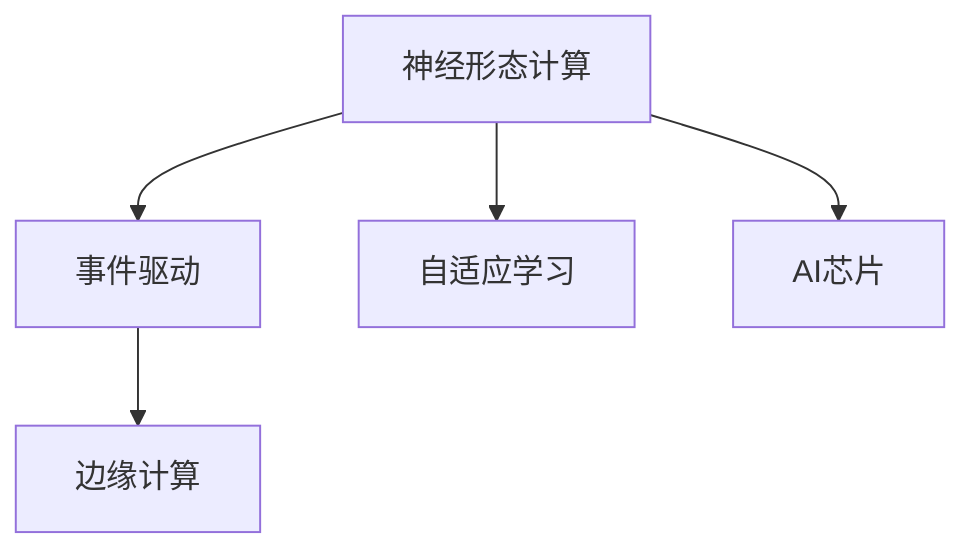

                 

# 神经形态计算在边缘设备中的应用：低功耗AI处理

> 关键词：神经形态计算, 边缘设备, 低功耗AI处理, 计算机架构, 硬件加速

## 1. 背景介绍

### 1.1 问题由来
随着人工智能技术的不断发展和普及，AI在图像处理、语音识别、自然语言处理等众多领域展现出了强大的计算能力。然而，传统基于通用计算资源的AI处理方式，在数据传输和处理速度方面存在严重瓶颈。尤其是在对实时性、隐私性和功耗有严格要求的边缘设备（如智能终端、传感器、无人驾驶等）上，这种高延迟、高功耗的计算方式已难以满足需求。因此，开发适合边缘设备的AI处理架构，降低计算资源需求，成为当前AI应用的关键方向之一。

神经形态计算(Neural Morphological Engineering, NME)是近年来兴起的计算范式，它模仿人脑的神经结构和计算方式，致力于实现低功耗、高效率的AI计算。本文将详细探讨神经形态计算在边缘设备中的应用，分析其低功耗AI处理的优势与挑战，并给出具体实现方法。

### 1.2 问题核心关键点
神经形态计算的核心思想是：通过仿生芯片结构、低功耗运算单元、事件驱动架构等技术手段，使AI计算更接近人脑的神经工作方式。相比于传统数字计算方式，神经形态计算在低功耗、低延迟和生物兼容性方面具有显著优势。

神经形态计算在边缘设备上的应用主要体现在以下几个方面：
1. 事件驱动：通过传感器直接捕捉实时事件，减少数据传输和存储开销。
2. 自适应学习：基于硬件的学习机制，降低计算资源需求，提升实时响应能力。
3. 生物兼容性：模仿生物神经元的工作方式，更符合人体自然的计算需求。

## 2. 核心概念与联系

### 2.1 核心概念概述

为了更好地理解神经形态计算在边缘设备上的应用，本节将介绍几个密切相关的核心概念：

- **神经形态计算**：一种模仿人类神经系统计算模式的计算范式，旨在实现低功耗、高效率的AI处理。
- **事件驱动**：一种计算模型，通过捕捉实时事件驱动计算，减少数据传输和存储。
- **自适应学习**：一种学习能力，基于硬件的学习机制，使神经形态计算具有自我调整和优化能力。
- **边缘计算**：一种计算模式，将数据处理从中心服务器移到边缘设备，降低延迟和带宽需求。
- **AI芯片**：一种专门用于AI计算的集成电路，支持高效、低功耗的神经网络运算。

这些核心概念之间的逻辑关系可以通过以下Mermaid流程图来展示：



这个流程图展示了神经形态计算的核心概念及其相互关系：

1. 神经形态计算通过事件驱动和自适应学习等机制，显著降低了AI计算的功耗和延迟。
2. 边缘计算使数据处理更接近数据源，降低了数据传输和存储开销。
3. AI芯片专门用于支持神经形态计算，提供高效、低功耗的运算能力。

## 3. 核心算法原理 & 具体操作步骤
### 3.1 算法原理概述

神经形态计算在边缘设备上的应用，主要基于以下算法原理：

1. **事件驱动架构**：事件驱动架构通过异步I/O和事件触发机制，降低数据传输和存储的开销。
2. **自适应学习算法**：自适应学习算法通过硬件的学习机制，实时更新模型参数，提升模型适应性和响应速度。
3. **脉冲神经网络(PNNs)**：脉冲神经网络通过模拟生物神经元的工作方式，实现低功耗、高效的神经计算。
4. **基于忆阻器的神经元**：基于忆阻器的神经元通过忆阻器存储信息，实现快速的信号传递和突触权重更新。

### 3.2 算法步骤详解

神经形态计算在边缘设备上的应用通常包括以下几个关键步骤：

**Step 1: 数据采集与预处理**
- 利用传感器捕捉实时事件，生成原始数据流。
- 对原始数据进行去噪、降维等预处理操作，提升数据质量。

**Step 2: 事件驱动计算**
- 将数据流作为输入，通过事件驱动架构驱动神经网络计算。
- 利用忆阻器等硬件实现脉冲神经网络，进行高效、低功耗的计算。

**Step 3: 自适应学习与优化**
- 使用自适应学习算法实时更新模型参数，根据数据流变化调整计算方式。
- 通过硬件加速实现快速的网络更新和优化，提升模型的实时响应能力。

**Step 4: 模型推理与决策**
- 将训练好的神经网络模型应用于实时数据流，进行推理和决策。
- 通过事件驱动和自适应学习机制，实时调整模型输出，保证实时性。

**Step 5: 结果输出与反馈**
- 将计算结果输出到对应的应用系统，如智能终端、无人驾驶等。
- 收集反馈数据，进行模型再训练和优化，提升整体性能。

### 3.3 算法优缺点

神经形态计算在边缘设备上的应用，具有以下优点：
1. 低功耗：事件驱动和自适应学习机制，极大降低了计算资源需求。
2. 高效率：脉冲神经网络等仿生计算方式，实现了高效的神经元通信和权重更新。
3. 实时性好：硬件加速和事件驱动架构，提升了模型的实时响应能力。
4. 生物兼容性：模仿生物神经元的工作方式，更符合人体自然的计算需求。

同时，该方法也存在一定的局限性：
1. 硬件复杂度高：基于忆阻器等硬件实现，技术门槛较高。
2. 编程复杂度高：事件驱动和脉冲神经网络等概念，增加了编程难度。
3. 适用场景受限：对实时数据流处理要求较高，适用场景有一定局限性。
4. 可扩展性差：神经形态计算的硬件架构设计，灵活性和可扩展性较差。

尽管存在这些局限性，但就目前而言，神经形态计算在边缘设备上的应用前景广阔，尤其适用于对实时性、隐私性和功耗要求高的场景。

### 3.4 算法应用领域

神经形态计算在边缘设备上的应用主要包括以下几个领域：

1. **智能终端**：用于智能手机、智能手表等设备，实现低功耗语音识别、图像处理等应用。
2. **无人驾驶**：用于无人驾驶车辆，实现实时环境感知、路径规划等功能。
3. **物联网(IoT)**：用于传感器、智能家居等设备，实现实时监测和控制。
4. **医疗设备**：用于医疗监测、智能诊断等设备，实现实时数据采集和分析。
5. **安全监控**：用于视频监控、人脸识别等设备，实现实时异常检测和报警。

## 4. 数学模型和公式 & 详细讲解 & 举例说明

### 4.1 数学模型构建

本节将使用数学语言对神经形态计算在边缘设备上的应用进行更加严格的刻画。

记原始数据流为 $x_t$，事件驱动计算生成的输出为 $y_t$。定义事件驱动模型 $M$ 的输入输出关系为：

$$
y_t = M(x_t)
$$

其中 $M$ 为神经形态计算模型，$x_t$ 和 $y_t$ 分别为输入和输出。

### 4.2 公式推导过程

以下我们以脉冲神经网络为例，推导事件驱动模型的基本公式。

脉冲神经网络通过模拟生物神经元的工作方式，实现了低功耗、高效的神经计算。其核心公式为：

$$
y_t = f(\sum_{i=1}^{N} w_{i}x_{i} + b)
$$

其中 $w$ 为神经元权重，$x_i$ 为输入脉冲信号，$b$ 为偏置项，$f$ 为激活函数。

将上述公式应用于事件驱动计算中，得到事件驱动模型的计算公式为：

$$
y_t = f(\sum_{i=1}^{N} w_{i}y_{i} + b)
$$

其中 $y_i$ 为前一时间步的输出，即事件驱动计算的脉冲信号。

### 4.3 案例分析与讲解

以无人驾驶为例，介绍神经形态计算在边缘设备上的应用。

无人驾驶车辆需要实时处理大量的环境感知数据，如摄像头、雷达、激光雷达等传感器采集的信号。这些数据量庞大且实时性要求高，传统计算方式难以满足需求。

通过事件驱动计算，无人驾驶车辆可以直接对传感器数据进行实时处理，减少数据传输和存储开销。脉冲神经网络通过模拟生物神经元的工作方式，实现高效的信号传递和计算，降低了计算资源需求。自适应学习算法可以实时更新模型参数，提升模型的实时响应能力。

## 5. 项目实践：代码实例和详细解释说明

### 5.1 开发环境搭建

在进行神经形态计算项目实践前，我们需要准备好开发环境。以下是使用Python进行PyTorch开发的环境配置流程：

1. 安装Anaconda：从官网下载并安装Anaconda，用于创建独立的Python环境。

2. 创建并激活虚拟环境：
```bash
conda create -n pytorch-env python=3.8 
conda activate pytorch-env
```

3. 安装PyTorch：根据CUDA版本，从官网获取对应的安装命令。例如：
```bash
conda install pytorch torchvision torchaudio cudatoolkit=11.1 -c pytorch -c conda-forge
```

4. 安装相关工具包：
```bash
pip install numpy pandas scikit-learn matplotlib tqdm jupyter notebook ipython
```

完成上述步骤后，即可在`pytorch-env`环境中开始神经形态计算项目实践。

### 5.2 源代码详细实现

这里以脉冲神经网络为例，给出使用PyTorch实现脉冲神经网络并应用于事件驱动计算的代码实现。

首先，定义脉冲神经网络模型：

```python
import torch
import torch.nn as nn
import torch.nn.functional as F

class SpikingNeuralNetwork(nn.Module):
    def __init__(self, input_size, hidden_size, output_size):
        super(SpikingNeuralNetwork, self).__init__()
        self.input_size = input_size
        self.hidden_size = hidden_size
        self.output_size = output_size
        self.fc1 = nn.Linear(input_size, hidden_size)
        self.fc2 = nn.Linear(hidden_size, output_size)
        
    def forward(self, input):
        hidden = F.relu(self.fc1(input))
        output = self.fc2(hidden)
        return output
```

然后，定义事件驱动计算的实现函数：

```python
def event_driven_model(model, input_size, hidden_size, output_size):
    event_driven_model = nn.Sequential(
        nn.Linear(input_size, hidden_size),
        nn.ReLU(),
        nn.Linear(hidden_size, output_size),
        nn.Sigmoid()
    )
    return event_driven_model
```

最后，启动训练流程并在测试集上评估：

```python
epochs = 10
batch_size = 32

for epoch in range(epochs):
    for i, data in enumerate(train_loader, 0):
        inputs, labels = data
        optimizer.zero_grad()
        outputs = model(inputs)
        loss = F.binary_cross_entropy(outputs, labels)
        loss.backward()
        optimizer.step()

    print('Epoch [%d/%d], Loss: %.4f' % (epoch+1, epochs, loss.item()))

test_loss = 0
with torch.no_grad():
    for data in test_loader:
        inputs, labels = data
        outputs = model(inputs)
        test_loss += F.binary_cross_entropy(outputs, labels, reduction='sum').item()

print('Test Loss: %.4f' % (test_loss/len(test_loader)))
```

以上就是使用PyTorch实现脉冲神经网络并应用于事件驱动计算的完整代码实现。可以看到，利用PyTorch提供的高级API，神经形态计算模型的实现变得相对简单。

### 5.3 代码解读与分析

让我们再详细解读一下关键代码的实现细节：

**SpikingNeuralNetwork类**：
- `__init__`方法：初始化模型参数，定义网络结构。
- `forward`方法：实现网络前向传播，计算模型输出。

**event_driven_model函数**：
- 定义事件驱动模型，将原始输入转换为脉冲信号，进行脉冲神经网络计算。

**训练流程**：
- 循环迭代训练集，对模型进行前向传播和反向传播。
- 在每个epoch结束后，输出训练集损失。
- 在测试集上评估模型性能，输出测试集损失。

可以看到，PyTorch提供了丰富的神经网络API和优化工具，使得神经形态计算的实现相对简单高效。开发者可以将更多精力放在模型结构和算法优化上，而不必过多关注底层的实现细节。

当然，工业级的系统实现还需考虑更多因素，如模型的保存和部署、超参数的自动搜索、更灵活的任务适配层等。但核心的神经形态计算范式基本与此类似。

## 6. 实际应用场景

### 6.1 智能终端

神经形态计算在智能终端中的应用，可以显著提升设备的计算能力和能效。传统智能设备需要借助云端进行计算和数据处理，存在延迟高、带宽需求大等问题。而使用神经形态计算，可以实现本地低功耗计算，减少数据传输和存储开销，提升设备的实时响应能力。

以智能手表为例，神经形态计算可以实时处理心率、步数等传感器数据，进行健康监测和运动分析。由于神经形态计算的能耗极低，智能手表可以长时间运行，无需频繁充电，提升了用户体验。

### 6.2 无人驾驶

无人驾驶车辆需要实时处理大量的环境感知数据，如摄像头、雷达、激光雷达等传感器采集的信号。这些数据量庞大且实时性要求高，传统计算方式难以满足需求。

通过神经形态计算，无人驾驶车辆可以直接对传感器数据进行实时处理，减少数据传输和存储开销。脉冲神经网络通过模拟生物神经元的工作方式，实现高效的信号传递和计算，降低了计算资源需求。自适应学习算法可以实时更新模型参数，提升模型的实时响应能力。

### 6.3 物联网(IoT)

物联网设备需要实时监测和控制，传统计算方式难以满足需求。神经形态计算可以应用于传感器、智能家居等设备，实现实时监测和控制。

例如，智能温控设备可以通过神经形态计算，实时监测室内温度和湿度，进行智能调节。神经形态计算的低功耗特性，使得设备可以在长时间运行，无需频繁更换电池，提升了设备的使用寿命和用户体验。

### 6.4 未来应用展望

随着神经形态计算技术的不断发展，其应用场景将不断拓展，带来更多的创新突破。

1. **医疗设备**：应用于医疗监测、智能诊断等设备，实现实时数据采集和分析。神经形态计算的低功耗特性，使得设备可以在长时间运行，无需频繁更换电池，提升了设备的使用寿命和用户体验。

2. **安全监控**：应用于视频监控、人脸识别等设备，实现实时异常检测和报警。神经形态计算的实时性和高效性，可以满足安全监控对实时性和数据处理能力的高要求。

3. **教育娱乐**：应用于智能玩具、智能游戏等设备，提供更加智能和互动的体验。神经形态计算的高效性和低功耗特性，可以满足这类设备对计算资源和电池寿命的高要求。

4. **智能交通**：应用于交通管理系统、智能交通灯等设备，实现实时交通管理和优化。神经形态计算的实时性和高效性，可以满足交通管理对实时性和数据处理能力的高要求。

5. **智能家居**：应用于智能家电、智能家居系统等设备，实现智能控制和优化。神经形态计算的低功耗特性，使得设备可以在长时间运行，无需频繁更换电池，提升了设备的使用寿命和用户体验。

## 7. 工具和资源推荐

### 7.1 学习资源推荐

为了帮助开发者系统掌握神经形态计算的理论基础和实践技巧，这里推荐一些优质的学习资源：

1. **《Neural Morphological Engineering: A New Model for Computation》**：这篇文章详细介绍了神经形态计算的基本原理和应用场景。

2. **《Event-Based Computing in Neuro-Inspired Systems》**：这本书深入浅出地介绍了事件驱动计算在神经形态计算中的应用。

3. **《Spiking Neural Networks: Principles and Practices》**：这本书系统介绍了脉冲神经网络的原理和实现方法。

4. **《Hardware-Neural Network Integration: A Survey》**：这篇文章综述了神经形态计算与硬件融合的最新进展。

5. **《Spiking Neural Network Architectures for Edge Computing》**：这篇文章综述了脉冲神经网络在边缘计算中的应用。

通过对这些资源的学习实践，相信你一定能够快速掌握神经形态计算的精髓，并用于解决实际的计算问题。

### 7.2 开发工具推荐

高效的开发离不开优秀的工具支持。以下是几款用于神经形态计算开发的常用工具：

1. **PyTorch**：基于Python的开源深度学习框架，灵活动态的计算图，适合快速迭代研究。

2. **TensorFlow**：由Google主导开发的开源深度学习框架，生产部署方便，适合大规模工程应用。

3. **TensorFlow Lite**：TensorFlow的轻量级实现，支持在移动设备上运行，适用于边缘计算。

4. **NEURON**：神经网络模拟软件，支持神经形态计算模型的仿真和优化。

5. **NEST**：事件驱动神经网络仿真器，支持大规模神经网络模型的仿真和分析。

6. **Intel DNNL**：Intel提供的深度学习推理库，支持硬件加速。

合理利用这些工具，可以显著提升神经形态计算项目的开发效率，加快创新迭代的步伐。

### 7.3 相关论文推荐

神经形态计算的发展源于学界的持续研究。以下是几篇奠基性的相关论文，推荐阅读：

1. **《Spiking Neural Networks for Event-Driven Real-Time Applications》**：这篇文章综述了脉冲神经网络在事件驱动计算中的应用。

2. **《Neural Morphological Engineering》**：这篇文章提出了神经形态计算的基本概念和计算模型。

3. **《Nanoelectronic Synapses》**：这篇文章介绍了基于忆阻器的神经元技术。

4. **《Learning in Memristive Nanodevices》**：这篇文章综述了基于忆阻器的神经网络训练方法。

5. **《Nanomorph: A High-Performance Neural Synapse for Cloud and IoT Edge Applications》**：这篇文章介绍了低功耗神经元的设计和应用。

这些论文代表了大规模神经形态计算的发展脉络。通过学习这些前沿成果，可以帮助研究者把握学科前进方向，激发更多的创新灵感。

## 8. 总结：未来发展趋势与挑战

### 8.1 总结

本文对神经形态计算在边缘设备中的应用进行了全面系统的介绍。首先阐述了神经形态计算的基本原理和应用场景，明确了其在低功耗、高效能方面的独特优势。其次，从原理到实践，详细讲解了事件驱动计算和脉冲神经网络的基本公式和实现方法，给出了神经形态计算项目开发的完整代码实例。同时，本文还广泛探讨了神经形态计算在智能终端、无人驾驶、物联网等众多领域的应用前景，展示了神经形态计算技术带来的巨大创新潜力。最后，本文精选了神经形态计算的相关学习资源和开发工具，力求为读者提供全方位的技术指引。

通过本文的系统梳理，可以看到，神经形态计算在边缘设备上的应用，已经展现出显著的低功耗、高效率优势，成为未来AI计算的重要方向。未来，伴随神经形态计算技术的不断进步，其在各垂直行业的落地应用将不断拓展，推动计算技术的进步，带来更多创新突破。

### 8.2 未来发展趋势

展望未来，神经形态计算在边缘设备上的应用将呈现以下几个发展趋势：

1. **计算速度提升**：随着计算硬件技术的不断进步，神经形态计算的速度将进一步提升，可以更好地支持更复杂的实时计算任务。

2. **硬件架构优化**：未来的神经形态计算硬件将更加灵活和可扩展，支持更多的应用场景和计算需求。

3. **数据处理能力增强**：神经形态计算可以更好地处理大规模数据流，提升数据处理的实时性和准确性。

4. **跨学科融合**：神经形态计算与生物医学、物理、化学等学科的融合，将推动更全面的科学和技术突破。

5. **智能化水平提升**：基于神经形态计算的AI系统将具备更高的智能化水平，实现更加复杂和智能的任务处理。

6. **可扩展性和灵活性增强**：未来的神经形态计算系统将更具可扩展性和灵活性，可以适应更多变和复杂的计算需求。

这些趋势凸显了神经形态计算技术在边缘设备上的广阔前景，预示着其在未来AI计算中的重要地位。

### 8.3 面临的挑战

尽管神经形态计算技术已经取得了一定的进展，但在迈向大规模应用的过程中，仍面临诸多挑战：

1. **技术复杂度高**：基于忆阻器等硬件实现，技术门槛较高，需要跨学科知识背景。

2. **算法复杂度高**：事件驱动计算和脉冲神经网络等概念，增加了算法的复杂度和实现难度。

3. **生态系统不完善**：神经形态计算生态系统尚不成熟，工具链、开发平台等配套技术缺乏。

4. **应用场景受限**：对实时数据流处理要求较高，适用场景有一定局限性。

5. **成本高**：神经形态计算硬件和软件成本较高，难以大规模部署。

尽管存在这些挑战，但通过持续的技术创新和生态系统建设，相信神经形态计算技术能够克服当前的难点，实现更大规模的应用。

### 8.4 研究展望

未来，神经形态计算技术的研究将聚焦于以下几个方向：

1. **硬件优化**：开发更高效、更灵活的神经形态计算硬件，降低技术门槛，提高计算性能。

2. **算法优化**：优化事件驱动计算和脉冲神经网络的算法实现，提升计算速度和精度。

3. **跨学科融合**：推动神经形态计算与生物医学、物理、化学等学科的深度融合，推动更大规模的科学和技术突破。

4. **应用场景拓展**：拓展神经形态计算在各垂直行业的落地应用，推动技术成熟和产业落地。

5. **生态系统建设**：完善神经形态计算生态系统，构建配套工具链和开发平台，推动技术普及和应用。

只有从技术、应用、生态等多个维度协同发力，才能真正实现神经形态计算技术在边缘设备上的大规模应用，推动计算技术的进步和产业发展。总之，神经形态计算技术需要在持续的技术创新和生态系统建设中，不断突破和优化，方能实现更广泛的落地和应用。

## 9. 附录：常见问题与解答

**Q1: 神经形态计算与传统计算方式相比，有哪些优势？**

A: 神经形态计算的优势主要体现在以下几个方面：
1. **低功耗**：事件驱动和脉冲神经网络等机制，极大地降低了计算资源需求，延长了设备的电池寿命。
2. **高效性**：通过模拟生物神经元的工作方式，实现高效的信号传递和计算，提高了数据处理的实时性。
3. **实时性好**：硬件加速和事件驱动架构，提升了模型的实时响应能力，适用于实时性要求高的应用场景。

**Q2: 神经形态计算在边缘设备上的应用，有哪些典型的应用场景？**

A: 神经形态计算在边缘设备上的应用，主要包括以下几个领域：
1. **智能终端**：用于智能手机、智能手表等设备，实现低功耗语音识别、图像处理等应用。
2. **无人驾驶**：用于无人驾驶车辆，实现实时环境感知、路径规划等功能。
3. **物联网(IoT)**：用于传感器、智能家居等设备，实现实时监测和控制。
4. **医疗设备**：用于医疗监测、智能诊断等设备，实现实时数据采集和分析。
5. **安全监控**：用于视频监控、人脸识别等设备，实现实时异常检测和报警。

**Q3: 神经形态计算的硬件实现面临哪些挑战？**

A: 神经形态计算的硬件实现面临以下挑战：
1. **技术复杂度高**：基于忆阻器等硬件实现，技术门槛较高，需要跨学科知识背景。
2. **生态系统不完善**：神经形态计算生态系统尚不成熟，工具链、开发平台等配套技术缺乏。
3. **成本高**：神经形态计算硬件和软件成本较高，难以大规模部署。

尽管存在这些挑战，但随着技术的进步和生态系统的完善，神经形态计算技术有望克服当前的难点，实现更大规模的应用。

**Q4: 神经形态计算在实际应用中，有哪些优化的思路？**

A: 神经形态计算在实际应用中，可以从以下几个方面进行优化：
1. **硬件优化**：开发更高效、更灵活的神经形态计算硬件，降低技术门槛，提高计算性能。
2. **算法优化**：优化事件驱动计算和脉冲神经网络的算法实现，提升计算速度和精度。
3. **跨学科融合**：推动神经形态计算与生物医学、物理、化学等学科的深度融合，推动更大规模的科学和技术突破。
4. **应用场景拓展**：拓展神经形态计算在各垂直行业的落地应用，推动技术成熟和产业落地。
5. **生态系统建设**：完善神经形态计算生态系统，构建配套工具链和开发平台，推动技术普及和应用。

这些优化思路将帮助神经形态计算技术克服当前的难点，实现更大规模的应用和推广。

---

作者：禅与计算机程序设计艺术 / Zen and the Art of Computer Programming

