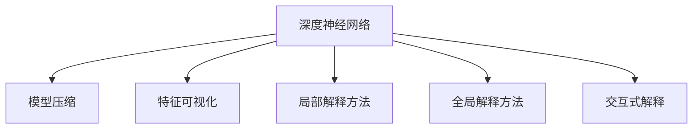

                 

# 神经网络可解释性：揭开AI黑盒的面纱

在人工智能飞速发展的今天，深度学习技术已经深入到医疗、金融、交通等各个行业，为各行各业带来了前所未有的变革。然而，随着深度神经网络模型的复杂性和规模不断增大，其"黑盒"特性也日益凸显。传统意义上，深度神经网络（DNN）的决策过程难以解释，模型输出的背后机制难以理解。为了应对这一挑战，越来越多的研究者将目光投向神经网络的可解释性问题，致力于寻找让AI模型变得透明、可解释、可信赖的方法。本文将系统地介绍神经网络可解释性的核心概念、原理与实践方法，同时结合实际案例和代码实现，揭示深度神经网络背后的工作原理，帮助开发者和研究者深入理解神经网络，构建更为透明可信的AI系统。

## 1. 背景介绍

### 1.1 问题由来
近年来，深度神经网络（DNN）在图像识别、语音识别、自然语言处理等领域取得了卓越的成果，但这些模型往往被视为"黑盒"，缺乏解释能力。在医疗、司法、金融等高风险应用场景中，缺乏对模型决策过程的解释和信任，将直接影响其应用价值的发挥。因此，提升神经网络的可解释性，成为当前AI领域的热点研究课题。

### 1.2 问题核心关键点
神经网络可解释性的核心问题在于，如何将模型的内部决策过程转换为易于理解和解释的外部形式。主要研究方向包括：

- **模型压缩**：去除冗余参数，提高模型的可解释性和计算效率。
- **特征可视化**：通过展示模型内部激活状态，揭示模型学习内容。
- **局部解释方法**：关注特定样本的模型行为，寻找影响决策的关键因素。
- **全局解释方法**：通过模型整体的统计特征和结构，解释模型的整体行为。
- **交互式解释**：将解释信息以交互式界面形式呈现，便于用户理解和调试。

本文将从模型压缩、特征可视化、局部解释方法、全局解释方法等方面，系统介绍神经网络的可解释性技术。

## 2. 核心概念与联系

### 2.1 核心概念概述

神经网络可解释性主要涉及以下几个核心概念：

- **深度神经网络（DNN）**：一类由多个层次的非线性变换组成的模型，具有强大的学习和表达能力。
- **模型压缩**：去除模型中冗余和无关的参数，降低模型复杂度。
- **特征可视化**：展示模型在不同输入下，内部激活状态的变化，揭示模型的学习内容。
- **局部解释方法**：关注单个样本或小批量样本，寻找影响模型输出的关键特征。
- **全局解释方法**：通过模型整体的统计特征和结构，解释模型的决策过程。
- **交互式解释**：以直观的界面形式呈现解释信息，便于用户理解。

这些概念之间通过如下Mermaid流程图展现：



这个流程图展示了神经网络可解释性的各个研究方向和它们之间的联系。模型压缩、特征可视化、局部解释方法、全局解释方法和交互式解释，共同构成了神经网络可解释性的核心技术体系。

## 3. 核心算法原理 & 具体操作步骤
### 3.1 算法原理概述

神经网络的可解释性，可以从模型压缩、特征可视化、局部解释方法和全局解释方法四个方面进行探究。

### 3.2 算法步骤详解

#### 3.2.1 模型压缩

**Step 1: 选择模型结构**
根据任务需求，选择合适的模型结构，如全连接网络、卷积神经网络（CNN）、循环神经网络（RNN）等。

**Step 2: 去除冗余参数**
使用剪枝、量化、知识蒸馏等技术，去除模型中的冗余参数。例如，剪枝可以移除权重值较小的神经元，量化将浮点参数转换为固定点参数，知识蒸馏将大规模模型的小规模模型知识迁移到目标模型中。

**Step 3: 模型优化**
优化压缩后的模型，确保其性能不显著下降，同时可解释性得到提升。

#### 3.2.2 特征可视化

**Step 1: 选择可视化方法**
选择适合的数据集和可视化方法，如t-SNE、PCA、LIME等。

**Step 2: 特征提取**
使用模型提取输入样本的特征表示，并将其映射到低维空间。

**Step 3: 可视化展示**
将低维特征表示可视化，揭示模型学习到的关键特征和模式。

#### 3.2.3 局部解释方法

**Step 1: 选择局部解释方法**
选择适合的方法，如LIME、SHAP、DeepLift等。

**Step 2: 提取局部特征**
提取特定样本的局部特征，如梯度、局部激活值等。

**Step 3: 生成解释结果**
使用局部特征生成解释结果，解释模型对特定样本的决策过程。

#### 3.2.4 全局解释方法

**Step 1: 选择全局解释方法**
选择适合的方法，如特征重要性、模型复杂度分析等。

**Step 2: 计算全局特征**
计算模型整体的统计特征和结构信息。

**Step 3: 生成解释结果**
使用全局特征生成解释结果，解释模型的决策机制和性能。

## 4. 数学模型和公式 & 详细讲解  
### 4.1 数学模型构建

对于深度神经网络，其核心数学模型为：

$$
y = f(Wx + b)
$$

其中 $y$ 为输出，$x$ 为输入，$W$ 和 $b$ 为模型参数。

模型压缩和特征可视化的核心在于特征表示的压缩和重构。对于模型压缩，我们通常采用以下公式：

$$
\theta = Prune(\theta)
$$

其中 $\theta$ 为压缩后的模型参数，$Prune$ 为压缩函数。

特征可视化的关键在于将高维特征表示映射到低维空间。常用的映射方法包括PCA、t-SNE、UMAP等，公式如下：

$$
z = f_W(x)
$$

其中 $z$ 为低维特征表示，$x$ 为原始特征，$W$ 为映射矩阵。

局部解释方法的数学原理较为复杂，这里仅介绍其核心思想。常用的局部解释方法如LIME，其核心在于构建一个与原模型等效的局部线性模型，用于解释特定样本的预测。数学模型如下：

$$
\hat{y} = f_L(x) + \epsilon
$$

其中 $f_L(x)$ 为局部线性模型，$\epsilon$ 为噪声。

全局解释方法通常基于模型的统计特征和结构信息。如特征重要性分析方法，通过计算每个特征在模型中的权重，解释模型对输入的依赖关系。数学公式如下：

$$
\text{Importance}(X_i) = \frac{\partial \hat{y}}{\partial X_i}
$$

## 5. 项目实践：代码实例和详细解释说明
### 5.1 开发环境搭建

在进行可解释性实践前，我们需要准备好开发环境。以下是使用Python进行TensorFlow开发的环境配置流程：

1. 安装Anaconda：从官网下载并安装Anaconda，用于创建独立的Python环境。

2. 创建并激活虚拟环境：
```bash
conda create -n tf-env python=3.7 
conda activate tf-env
```

3. 安装TensorFlow：根据CUDA版本，从官网获取对应的安装命令。例如：
```bash
conda install tensorflow -c tf -c conda-forge
```

4. 安装各类工具包：
```bash
pip install numpy pandas scikit-learn matplotlib tqdm jupyter notebook ipython
```

完成上述步骤后，即可在`tf-env`环境中开始可解释性实践。

### 5.2 源代码详细实现

这里以TensorFlow实现特征可视化为例，展示如何在MNIST数据集上对全连接神经网络进行特征可视化。

首先，准备数据集：

```python
import tensorflow as tf
from tensorflow.keras.datasets import mnist
from tensorflow.keras.utils import to_categorical

# 加载MNIST数据集
(x_train, y_train), (x_test, y_test) = mnist.load_data()

# 对数据进行归一化和二值化
x_train, x_test = x_train / 255.0, x_test / 255.0
y_train, y_test = to_categorical(y_train), to_categorical(y_test)

# 将标签转换为one-hot编码
y_train = tf.keras.utils.to_categorical(y_train, num_classes=10)
y_test = tf.keras.utils.to_categorical(y_test, num_classes=10)
```

然后，定义模型：

```python
import tensorflow.keras as keras

# 定义模型结构
model = keras.Sequential([
    keras.layers.Flatten(input_shape=(28, 28)),
    keras.layers.Dense(128, activation='relu'),
    keras.layers.Dense(10, activation='softmax')
])
```

接着，训练模型：

```python
# 编译模型
model.compile(optimizer='adam', loss='categorical_crossentropy', metrics=['accuracy'])

# 训练模型
model.fit(x_train, y_train, epochs=10, validation_data=(x_test, y_test))
```

最后，进行特征可视化：

```python
import numpy as np
import matplotlib.pyplot as plt

# 选择一个样本
sample_idx = 0

# 将样本转化为特征向量
sample_x = np.reshape(x_train[sample_idx], (1, 28, 28))
sample_y = np.reshape(y_train[sample_idx], (1, 10))

# 计算模型的输出和梯度
y_predict = model.predict(sample_x)
grads = keras.gradients(model, sample_x)[0]

# 绘制激活图
plt.figure(figsize=(8, 8))
plt.imshow(sample_x[0], cmap='gray')
plt.title('Input Image')
plt.show()

plt.figure(figsize=(8, 8))
plt.imshow(grads[0], cmap='gray')
plt.title('Gradient Map')
plt.show()
```

### 5.3 代码解读与分析

让我们再详细解读一下关键代码的实现细节：

**MNIST数据集加载和预处理**：
- 使用TensorFlow的`mnist.load_data()`函数加载MNIST数据集。
- 对数据进行归一化处理，使其值在[0, 1]区间内。
- 将标签转换为one-hot编码。

**模型定义**：
- 使用`keras.Sequential()`定义一个简单的全连接神经网络，包含一个隐藏层和一个输出层。

**模型训练**：
- 使用`model.compile()`函数编译模型，指定优化器、损失函数和评估指标。
- 使用`model.fit()`函数训练模型，并指定验证数据集。

**特征可视化**：
- 选取一个样本进行可视化。
- 使用`keras.gradients()`函数计算模型输出的梯度，并绘制激活图。

可以看到，TensorFlow提供了丰富的API和工具，使得神经网络的可解释性实践变得简单高效。开发者可以将更多精力放在模型优化、特征可视化、局部解释等方面，而不必过多关注底层的实现细节。

当然，工业级的系统实现还需考虑更多因素，如模型的保存和部署、超参数的自动搜索、更灵活的任务适配层等。但核心的可解释性实践基本与此类似。

## 6. 实际应用场景
### 6.1 医疗影像诊断

医疗影像诊断是一个典型的高风险应用场景，深度神经网络被广泛应用于肿瘤、心脏病等疾病的诊断中。然而，由于神经网络模型的"黑盒"特性，医生和患者难以理解和信任模型的诊断结果。

通过特征可视化技术，可以将深度神经网络内部对图像的激活状态可视化，帮助医生理解模型的诊断逻辑，提升诊断的可靠性和可解释性。例如，可以使用t-SNE算法将图像的特征表示映射到二维空间，并绘制激活图，揭示模型在诊断中的关键区域和特征。

### 6.2 金融风险评估

金融领域广泛使用深度神经网络进行信用评估、欺诈检测等任务。然而，由于神经网络模型的复杂性和不透明性，模型的评估和监管面临诸多挑战。

通过全局解释方法，可以分析深度神经网络的整体结构和特征重要性，解释模型的决策过程，帮助监管机构理解和信任模型。例如，可以使用LIME算法对深度神经网络进行全局解释，生成特征重要性图，揭示模型在信用评估中的关键因素和决策机制。

### 6.3 智能推荐系统

智能推荐系统是另一个典型的应用场景。深度神经网络被广泛应用于电商、新闻、视频等领域，帮助用户发现个性化内容。

通过局部解释方法，可以分析深度神经网络对特定用户的推荐过程，帮助用户理解模型的推荐逻辑。例如，可以使用SHAP算法对深度神经网络进行局部解释，生成解释树，揭示模型在推荐中的关键特征和推理过程。

## 7. 工具和资源推荐
### 7.1 学习资源推荐

为了帮助开发者系统掌握神经网络可解释性的理论基础和实践技巧，这里推荐一些优质的学习资源：

1. 《Deep Learning》系列书籍：由Ian Goodfellow等作者编写，全面介绍了深度学习的基础理论和实践方法，包括神经网络的可解释性。

2. 《Neural Networks and Deep Learning》书籍：由Michael Nielsen编写，介绍了深度神经网络的核心概念和可解释性方法，适合入门学习。

3. 《Practical Deep Learning for Coders》书籍：由Andrej Karpathy等作者编写，以实际项目为例，介绍深度学习模型的可解释性实现。

4. Google AI的深度学习课程：通过视频和作业，系统学习深度学习的基本概念和可解释性技术。

5. HuggingFace官方文档：深度学习框架TensorFlow和PyTorch的官方文档，提供了丰富的模型和工具，用于实现可解释性实践。

通过对这些资源的学习实践，相信你一定能够快速掌握神经网络可解释性的精髓，并用于解决实际的AI问题。

### 7.2 开发工具推荐

高效的开发离不开优秀的工具支持。以下是几款用于神经网络可解释性开发的常用工具：

1. TensorFlow：由Google主导开发的深度学习框架，具有丰富的API和工具，适合模型训练和解释。

2. PyTorch：由Facebook主导的深度学习框架，灵活性高，支持动态图和静态图，适合研究和学习。

3. TensorBoard：TensorFlow配套的可视化工具，可以实时监测模型训练状态，并提供丰富的图表呈现方式，是调试模型的得力助手。

4. LIME和SHAP：两大流行的可解释性工具，能够生成局部和全局解释结果，广泛应用于模型解释和调试。

5. Weights & Biases：模型训练的实验跟踪工具，可以记录和可视化模型训练过程中的各项指标，方便对比和调优。

6. Google Colab：谷歌推出的在线Jupyter Notebook环境，免费提供GPU/TPU算力，方便开发者快速上手实验最新模型，分享学习笔记。

合理利用这些工具，可以显著提升神经网络可解释性任务的开发效率，加快创新迭代的步伐。

### 7.3 相关论文推荐

神经网络可解释性的研究源于学界的持续研究。以下是几篇奠基性的相关论文，推荐阅读：

1. A Tutorial on Interpretable Machine Learning with TensorFlow：Google官方博客，详细介绍了TensorFlow中常用的可解释性工具和算法。

2. An Application of the SHAP Framework for Explaining Deep Neural Networks in Histopathology：介绍如何应用SHAP算法解释深度神经网络在病理图像诊断中的应用。

3. The Unreasonable Effectiveness of Deep Learning: Interpretable Deep Learning：探讨了深度学习的强大能力和可解释性挑战。

4. Deep Learning for Structured and Unstructured Data: A Review：综述了深度学习在结构化和非结构化数据上的应用和可解释性方法。

5. Deep Neural Network Model Interpretability: A Survey: Recent Advances and Future Directions：综述了深度神经网络可解释性的最新进展和未来方向。

这些论文代表了大规模深度学习模型的可解释性发展脉络。通过学习这些前沿成果，可以帮助研究者把握学科前进方向，激发更多的创新灵感。

## 8. 总结：未来发展趋势与挑战

### 8.1 总结

本文对神经网络可解释性的核心概念、原理与实践方法进行了全面系统的介绍。首先阐述了神经网络可解释性的背景和重要性，明确了可解释性在提升模型可信度和透明性方面的独特价值。其次，从模型压缩、特征可视化、局部解释方法、全局解释方法等方面，详细讲解了神经网络的可解释性技术。最后，结合实际案例和代码实现，揭示深度神经网络背后的工作原理，帮助开发者和研究者深入理解神经网络，构建更为透明可信的AI系统。

通过本文的系统梳理，可以看到，神经网络可解释性技术正在成为深度学习领域的重要研究范式，极大地提升了深度学习模型的可靠性和透明性。未来，伴随可解释性技术的不断进步，深度学习模型必将在更多领域得到应用，为各行各业带来变革性影响。

### 8.2 未来发展趋势

展望未来，神经网络可解释性技术将呈现以下几个发展趋势：

1. 模型压缩技术的成熟。随着模型压缩技术的不断发展，深度神经网络的可解释性将进一步提升。例如，剪枝、量化、知识蒸馏等技术的应用，使得模型更加高效、透明。

2. 特征可视化方法的创新。新的特征可视化方法将揭示深度神经网络更深层次的特征表示，帮助用户更好地理解模型的学习过程。

3. 局部解释方法的扩展。随着局部解释方法的不断创新，将能够更精确地解释深度神经网络对特定样本的决策过程。

4. 全局解释方法的多样化。全局解释方法将进一步丰富，能够从多个角度解释深度神经网络的整体行为和性能。

5. 交互式解释技术的普及。交互式解释技术将变得更加普及，以更加直观、易用的方式展示模型的解释结果。

这些趋势凸显了神经网络可解释性技术的广阔前景。这些方向的探索发展，必将进一步提升深度学习模型的性能和可解释性，为构建安全、可靠、可信赖的AI系统铺平道路。

### 8.3 面临的挑战

尽管神经网络可解释性技术已经取得了显著进展，但在迈向更加智能化、普适化应用的过程中，仍面临诸多挑战：

1. 数据隐私和伦理问题。特征可视化和局部解释方法等技术，可能涉及到用户隐私和数据敏感性，如何保护用户隐私、遵循伦理规范，是可解释性技术的重要挑战。

2. 技术复杂性和实现难度。神经网络可解释性技术通常较为复杂，实现难度大，需要综合考虑模型压缩、特征可视化、局部解释、全局解释等多个方面，增加了技术实现的难度。

3. 可解释性的有效性。可解释性技术是否能够真正提升模型的可靠性和透明性，仍需更多的实验验证和实际应用评估。

4. 泛化性和鲁棒性。可解释性技术是否具有泛化性，能够在不同的数据集和模型上表现一致，仍需进一步研究和探索。

5. 实际应用中的兼容性。可解释性技术需要在实际应用中与其他AI技术协同工作，如强化学习、知识图谱等，保证系统的整体性和兼容性。

这些挑战需要通过更多技术创新和实践探索，不断突破，才能实现神经网络可解释性技术的全面成熟。

### 8.4 研究展望

面对神经网络可解释性所面临的挑战，未来的研究需要在以下几个方面寻求新的突破：

1. 探索更加高效的模型压缩方法。开发更加高效、自适应的模型压缩技术，使得深度神经网络在压缩后仍保持高效、可解释性。

2. 研发新的特征可视化方法。开发更加直观、易用的特征可视化技术，揭示深度神经网络更深层次的特征表示。

3. 拓展局部解释方法的范围。研发更加精确、全面的局部解释方法，解释深度神经网络对特定样本的决策过程。

4. 探索全局解释方法的多样化。研究不同角度的全局解释方法，揭示深度神经网络的整体行为和性能。

5. 引入交互式解释技术。开发交互式解释工具，以更加直观、易用的方式展示深度神经网络的解释结果。

6. 结合伦理道德约束。在模型训练和解释过程中，引入伦理导向的评估指标，过滤和惩罚有害的输出倾向。

这些研究方向的探索，必将引领神经网络可解释性技术迈向更高的台阶，为构建安全、可靠、可信赖的AI系统提供坚实的基础。

## 9. 附录：常见问题与解答

**Q1: 神经网络可解释性技术的应用场景有哪些？**

A: 神经网络可解释性技术在多个领域有广泛应用，如医疗、金融、推荐、法律等。通过可视化、解释方法等技术，帮助开发者和用户理解深度神经网络的行为，提升模型的可信度和透明性。

**Q2: 如何选择合适的神经网络可解释性方法？**

A: 选择合适的可解释性方法需要考虑多个因素，如数据特性、模型结构、任务需求等。通常，特征可视化适合全局理解模型行为，局部解释方法适合分析单个样本的决策过程，全局解释方法适合整体理解模型的性能和结构。

**Q3: 神经网络压缩和量化技术有哪些？**

A: 神经网络压缩和量化技术包括剪枝、量化、知识蒸馏等。剪枝可以移除模型中的冗余参数，量化将浮点参数转换为固定点参数，知识蒸馏将大规模模型的小规模模型知识迁移到目标模型中。

**Q4: 特征可视化技术有哪些？**

A: 常用的特征可视化技术包括t-SNE、PCA、UMAP等。t-SNE将高维特征表示映射到二维空间，PCA和UMAP将高维特征表示降维到低维空间，揭示模型学习到的关键特征和模式。

**Q5: 如何评估神经网络的可解释性？**

A: 评估神经网络的可解释性可以从多个方面进行，如准确性、解释能力、用户体验等。通常，使用LIME、SHAP等工具对模型进行解释，对比实际输出与解释结果的一致性，评估模型的可解释性。

---

作者：禅与计算机程序设计艺术 / Zen and the Art of Computer Programming

