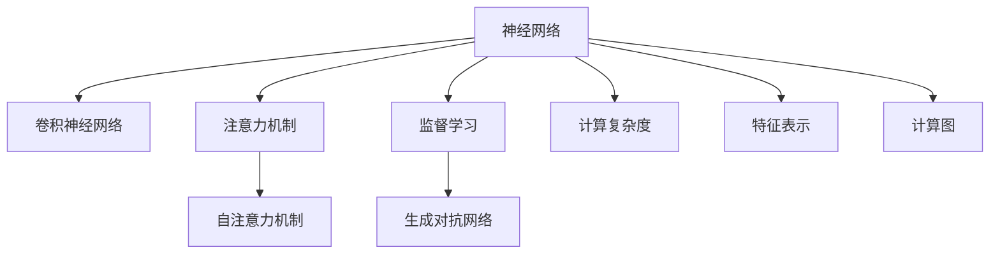

                 

# 神经网络在注意力模式识别中的创新

> 关键词：神经网络,注意力机制,模式识别,深度学习,计算机视觉,自然语言处理

## 1. 背景介绍

### 1.1 问题由来
在深度学习领域，注意力机制(Attention Mechanism)已经成为了构建高性能模型不可或缺的一部分。自2015年Google的论文《Attention is All You Need》提出自注意力机制以来，其快速高效的注意力计算方式和高精度建模能力得到了学界的广泛认可。在大规模数据训练的推动下，注意力机制已经被成功应用于计算机视觉(CV)、自然语言处理(NLP)等多个领域。

当前，神经网络在图像和文本等复杂模式识别任务上的表现已经超越了传统机器学习方法。以计算机视觉为例，卷积神经网络(CNN)虽然在特征提取方面表现优异，但在处理多通道、高维度的特征融合时，信息传递变得复杂且低效。相反，自注意力机制能快速并行地进行特征关注和权重计算，极大地提升了模型对输入的表示能力。

注意力机制在图像分类、目标检测、语音识别、机器翻译等任务上均有出色表现，并通过与其他深度学习技术的结合，进一步提升了模型的预测精度和泛化能力。在现实应用中，诸如谷歌的BERT模型、OpenAI的GPT-3模型均使用了注意力机制，取得了革命性的性能突破。

## 2. 核心概念与联系

### 2.1 核心概念概述

为更好地理解注意力机制在神经网络中的应用，本节将介绍几个关键概念：

- 神经网络(Neural Networks, NN)：一种由输入层、隐藏层和输出层构成的多层计算模型，通过前向传播和反向传播算法进行优化，用于处理复杂模式识别任务。
- 卷积神经网络(CNN)：一种特殊的神经网络，包含卷积层、池化层、全连接层等组件，主要应用于图像、视频等空间信息密集的数据。
- 注意力机制(Attention Mechanism)：一种用于计算输入中重要元素的方法，通过给不同输入元素赋予不同权重，将重要信息加以强化。
- 自注意力机制(Self-Attention)：一种特殊形式的注意力机制，用于处理自身序列或特征的注意力计算。
- 计算复杂度：在模型中，计算复杂度通常用时间复杂度或空间复杂度来衡量，复杂度越低，模型性能越高。
- 特征表示：神经网络通过学习输入数据特征，构建一个高维空间，用于进行分类、回归、生成等任务。
- 监督学习(Supervised Learning)：通过标注样本对模型进行训练，目标是预测样本的正确标签。
- 生成对抗网络(GAN)：一种由生成器和判别器构成的对抗性网络，用于生成高质量的样本数据。
- 计算图(Computation Graph)：神经网络中用于记录计算过程的数据结构，包含输入、中间节点、输出等。

这些核心概念之间的逻辑关系可以通过以下Mermaid流程图来展示：



这个流程图展示了一组神经网络相关的核心概念及其之间的关系：

1. 神经网络是所有深度学习模型的基本框架。
2. 卷积神经网络是神经网络在图像处理任务上的常见应用。
3. 注意力机制是神经网络在序列建模任务上的重要补充。
4. 自注意力机制是注意力机制在自身序列上的应用。
5. 监督学习是模型训练的常见方法，通过标签数据指导模型学习。
6. 生成对抗网络是一种深度学习框架，用于生成样本。
7. 计算复杂度是衡量模型性能的关键指标。
8. 特征表示是神经网络通过学习输入数据特征，构建一个高维空间。
9. 计算图用于记录模型的计算过程。

## 3. 核心算法原理 & 具体操作步骤

### 3.1 算法原理概述

注意力机制的核心思想是通过给输入的不同元素赋予不同的权重，从而增强重要信息的提取和表示。在传统的神经网络中，权重是固定的，无法动态调整。而在注意力机制中，权重是可训练的，可以根据输入数据的不同动态调整。

以自注意力机制为例，其工作原理分为三个步骤：

1. **输入表示**：将输入序列转换为模型可以处理的向量表示。
2. **自注意力计算**：在向量表示的基础上，通过自注意力机制计算出各个向量之间的相似度，并根据相似度生成权重矩阵。
3. **加权求和**：将权重矩阵与输入向量进行加权求和，得到最终的表示向量。

自注意力机制的具体实现如下：

1. 将输入序列 $x$ 转换为 $d$ 维向量表示 $x \in \mathbb{R}^{n \times d}$，其中 $n$ 表示序列长度，$d$ 表示向量维度。
2. 计算注意力权重矩阵 $A \in \mathbb{R}^{n \times n}$，其中每个元素 $A_{ij} \in [0, 1]$，表示向量 $x_i$ 与向量 $x_j$ 的注意力权重。
3. 计算加权求和结果 $z \in \mathbb{R}^{n \times d}$，其中 $z_i = \sum_{j=1}^n A_{ij}x_j$，得到新的向量表示。

### 3.2 算法步骤详解

以下详细介绍自注意力机制的具体实现步骤：

**Step 1: 输入表示**

首先，将输入序列 $x$ 转换为模型可以处理的向量表示。一般通过嵌入层将文本转换为 $d$ 维向量，其中 $d$ 为嵌入向量的维度。对于语言模型，可以将每个单词映射到一个 $d$ 维向量，形成 $n \times d$ 的矩阵，其中 $n$ 为序列长度。

**Step 2: 自注意力计算**

在得到向量表示 $x$ 之后，通过线性变换和softmax函数计算注意力权重矩阵 $A$。

$$
A_{ij} = \frac{e^{a_{ij}^T x}}{\sum_{k=1}^n e^{a_{ik}^T x}}
$$

其中，$a_{ij}$ 是注意力头 $h$ 的权重向量，$x$ 是输入向量。

**Step 3: 加权求和**

将注意力权重矩阵 $A$ 与输入向量 $x$ 进行矩阵乘法运算，得到加权和向量表示 $z$。

$$
z = A x
$$

**Step 4: 输出**

将加权和向量表示 $z$ 传递给后续层，通过全连接层或其他非线性激活函数进行处理，得到最终输出。

### 3.3 算法优缺点

自注意力机制有以下优点：

1. 自适应性强。自注意力机制能自动学习输入序列中不同元素的重要性，从而提高模型的泛化能力。
2. 并行计算。自注意力机制的计算复杂度为 $O(n^2)$，与序列长度无关，能快速并行计算。
3. 特征增强。自注意力机制通过动态调整权重，能更加关注输入中的关键特征，增强模型的表示能力。

自注意力机制也有以下缺点：

1. 计算复杂度高。自注意力机制虽然并行计算，但在高维输入序列上计算复杂度仍较高。
2. 参数量大。自注意力机制需要计算注意力权重矩阵和加权和向量，参数量较大。
3. 难以解释。自注意力机制的计算过程和权重生成机制较为复杂，难以进行解释。

### 3.4 算法应用领域

自注意力机制在多个领域中得到了广泛应用，包括但不限于以下几个方面：

- 计算机视觉：在图像分类、目标检测等任务中，自注意力机制能提取不同区域的关键特征，提高模型性能。
- 自然语言处理：在文本生成、机器翻译、文本摘要等任务中，自注意力机制能动态关注不同词语的关系，增强模型的理解能力。
- 语音识别：在语音识别中，自注意力机制能处理不同时段的声学特征，提高模型对复杂音素的识别能力。
- 推荐系统：在推荐系统中，自注意力机制能动态关注用户行为中的关键元素，提高推荐准确性。
- 信号处理：在信号处理中，自注意力机制能处理不同频率和时域的信息，提高模型的信号特征提取能力。

## 4. 数学模型和公式 & 详细讲解 & 举例说明

### 4.1 数学模型构建

自注意力机制的数学模型可以表示为：

$$
z = \frac{1}{\sqrt{d}} \sum_{i=1}^n A_{ij}x_j
$$

其中，$z \in \mathbb{R}^{n \times d}$ 是输出向量，$x \in \mathbb{R}^{n \times d}$ 是输入向量，$A \in \mathbb{R}^{n \times n}$ 是注意力权重矩阵。

### 4.2 公式推导过程

1. **输入表示**

   输入序列 $x$ 通过嵌入层转换为 $d$ 维向量表示，其中 $x_i$ 表示第 $i$ 个单词的向量表示。

   $$
   x_i = \text{Embedding}(w_i)
   $$

2. **自注意力计算**

   计算注意力权重矩阵 $A$，其中 $A_{ij} \in [0, 1]$ 表示向量 $x_i$ 与向量 $x_j$ 的注意力权重。

   $$
   A_{ij} = \frac{e^{a_{ij}^T x}}{\sum_{k=1}^n e^{a_{ik}^T x}}
   $$

   其中，$a_{ij}$ 是注意力头 $h$ 的权重向量，$x$ 是输入向量。

3. **加权求和**

   将注意力权重矩阵 $A$ 与输入向量 $x$ 进行矩阵乘法运算，得到加权和向量表示 $z$。

   $$
   z = A x
   $$

4. **输出**

   将加权和向量表示 $z$ 传递给后续层，通过全连接层或其他非线性激活函数进行处理，得到最终输出。

### 4.3 案例分析与讲解

以自然语言处理中的机器翻译任务为例，分析自注意力机制的应用：

1. **输入表示**

   将源语言文本序列 $x$ 通过嵌入层转换为 $d$ 维向量表示，其中 $x_i$ 表示第 $i$ 个单词的向量表示。

   $$
   x_i = \text{Embedding}(w_i)
   $$

2. **自注意力计算**

   计算注意力权重矩阵 $A$，其中 $A_{ij} \in [0, 1]$ 表示向量 $x_i$ 与向量 $x_j$ 的注意力权重。

   $$
   A_{ij} = \frac{e^{a_{ij}^T x}}{\sum_{k=1}^n e^{a_{ik}^T x}}
   $$

   其中，$a_{ij}$ 是注意力头 $h$ 的权重向量，$x$ 是输入向量。

3. **加权求和**

   将注意力权重矩阵 $A$ 与输入向量 $x$ 进行矩阵乘法运算，得到加权和向量表示 $z$。

   $$
   z = A x
   $$

4. **输出**

   将加权和向量表示 $z$ 传递给后续层，通过全连接层或其他非线性激活函数进行处理，得到最终输出。

   $$
   y = \text{FFN}(z) + \text{Attention}(z)
   $$

   其中，$\text{FFN}$ 表示全连接层，$\text{Attention}$ 表示自注意力机制。

## 5. 项目实践：代码实例和详细解释说明

### 5.1 开发环境搭建

在进行项目实践前，需要先配置好开发环境。以下是使用PyTorch进行神经网络开发的Python环境配置流程：

1. 安装Anaconda：从官网下载并安装Anaconda，用于创建独立的Python环境。

2. 创建并激活虚拟环境：
```bash
conda create -n pytorch-env python=3.8 
conda activate pytorch-env
```

3. 安装PyTorch：根据CUDA版本，从官网获取对应的安装命令。例如：
```bash
conda install pytorch torchvision torchaudio cudatoolkit=11.1 -c pytorch -c conda-forge
```

4. 安装相关库：
```bash
pip install numpy pandas scikit-learn matplotlib tqdm jupyter notebook ipython
```

完成上述步骤后，即可在`pytorch-env`环境中开始项目实践。

### 5.2 源代码详细实现

以下是一个使用PyTorch实现自注意力机制的简单代码示例：

```python
import torch
import torch.nn as nn
import torch.nn.functional as F

class SelfAttention(nn.Module):
    def __init__(self, d_model, num_heads):
        super(SelfAttention, self).__init__()
        self.num_heads = num_heads
        self.d_model = d_model
        assert d_model % num_heads == 0
        self.depth = d_model // num_heads

        self.query = nn.Linear(d_model, d_model)
        self.key = nn.Linear(d_model, d_model)
        self.value = nn.Linear(d_model, d_model)

        self.fc = nn.Linear(d_model, d_model)

    def forward(self, x):
        m = self.depth
        dim = self.num_heads
        b, t, d_model = x.size()

        # 线性变换
        q = self.query(x).view(b, t, dim, m).permute(0, 2, 1, 3)
        k = self.key(x).view(b, t, dim, m).permute(0, 2, 1, 3)
        v = self.value(x).view(b, t, dim, m).permute(0, 2, 1, 3)

        # 计算注意力权重
        score = torch.matmul(q, k.permute(0, 1, 3, 2)) / torch.sqrt(torch.tensor(dim))

        # 计算注意力权重矩阵
        attention_weights = F.softmax(score, dim=-1)

        # 计算加权和向量表示
        output = torch.matmul(attention_weights, v)

        # 将向量拼接为d_model维的向量
        output = output.permute(0, 2, 1, 3).contiguous().view(b, t, d_model)

        # 将向量传递给后续层
        output = self.fc(output)

        return output
```

这个代码实现了一个简单的自注意力机制模块，用于对输入向量进行自注意力计算。

### 5.3 代码解读与分析

首先，定义一个 `SelfAttention` 类，继承自 `nn.Module`。在构造函数中，定义了模型的超参数 `d_model` 和 `num_heads`，分别表示输入向量的维度和注意力头的数量。

在 `forward` 方法中，首先通过线性变换将输入向量转换为三个不同的向量，分别表示查询向量 $q$、键向量 $k$ 和值向量 $v$。然后，计算注意力权重矩阵 $A$，其中 $A_{ij} \in [0, 1]$ 表示向量 $x_i$ 与向量 $x_j$ 的注意力权重。最后，计算加权和向量表示 $z$，并将其传递给后续层进行进一步处理。

## 6. 实际应用场景

### 6.1 计算机视觉

自注意力机制在计算机视觉中得到了广泛应用，尤其在图像分类、目标检测等任务中表现优异。在图像分类任务中，自注意力机制能够关注不同区域的特征，提高模型对复杂图像的识别能力。例如，Google的Inception-v3模型在图像分类任务中，通过在卷积层中引入自注意力机制，取得了比标准卷积网络更好的效果。

在目标检测任务中，自注意力机制能够关注不同区域的关键特征，从而提高模型的检测精度。例如，Faster R-CNN模型中，通过在特征图层引入自注意力机制，能够更准确地识别出不同目标的位置和类别。

### 6.2 自然语言处理

自注意力机制在自然语言处理中也表现出色，尤其在机器翻译、文本摘要等任务中具有重要应用。在机器翻译任务中，自注意力机制能够动态关注不同词语的关系，提高模型的翻译质量。例如，Google的Transformer模型在机器翻译任务中，通过引入自注意力机制，取得了比传统序列模型更好的效果。

在文本摘要任务中，自注意力机制能够关注文本中的重要信息，生成更加准确和精炼的摘要。例如，百度的BERT模型在文本摘要任务中，通过在编码器层引入自注意力机制，能够更好地理解文本的语义关系，生成高质量的摘要结果。

### 6.3 语音识别

自注意力机制在语音识别中也得到了应用，尤其在语音信号处理和声学特征提取中表现优异。例如，百度的DeepSpeech模型在语音识别任务中，通过在卷积层中引入自注意力机制，能够更好地处理不同时段的声学特征，提高语音识别的准确性。

## 7. 工具和资源推荐

### 7.1 学习资源推荐

为了帮助开发者系统掌握注意力机制的理论基础和实践技巧，这里推荐一些优质的学习资源：

1. 《Deep Learning》（Goodfellow et al.）：深度学习领域的经典教材，全面介绍了深度学习的基本概念和算法，包括自注意力机制。
2. CS231n《Convolutional Neural Networks for Visual Recognition》课程：斯坦福大学开设的计算机视觉课程，详细介绍了卷积神经网络和自注意力机制。
3. CS224n《Natural Language Processing with Deep Learning》课程：斯坦福大学开设的自然语言处理课程，深入讲解了序列建模和自注意力机制。
4. 《Attention Mechanism》论文：自注意力机制的奠基性论文，详细介绍了自注意力机制的设计思想和实现方法。
5. 《Attention Is All You Need》论文：Transformer模型的原论文，介绍了自注意力机制在神经网络中的重要应用。

通过对这些资源的学习实践，相信你一定能够快速掌握注意力机制的精髓，并用于解决实际的NLP问题。

### 7.2 开发工具推荐

高效的开发离不开优秀的工具支持。以下是几款用于神经网络开发的常用工具：

1. PyTorch：基于Python的开源深度学习框架，灵活动态的计算图，适合快速迭代研究。
2. TensorFlow：由Google主导开发的开源深度学习框架，生产部署方便，适合大规模工程应用。
3. Keras：一个高层次的深度学习框架，提供简单易用的API，适合快速原型开发。
4. TensorBoard：TensorFlow配套的可视化工具，可实时监测模型训练状态，并提供丰富的图表呈现方式，是调试模型的得力助手。
5. Weights & Biases：模型训练的实验跟踪工具，可以记录和可视化模型训练过程中的各项指标，方便对比和调优。

合理利用这些工具，可以显著提升神经网络的开发效率，加快创新迭代的步伐。

### 7.3 相关论文推荐

神经网络在注意力机制上的应用已经得到了学界的广泛关注，以下是几篇奠基性的相关论文，推荐阅读：

1. Attention Mechanism：Bahdanau等人的论文，详细介绍了自注意力机制的设计思想和实现方法。
2. Attention Is All You Need：Vaswani等人的论文，提出了Transformer模型，将自注意力机制应用于自然语言处理。
3. Transformer-XL：Gulcehre等人的论文，提出了Transformer-XL模型，进一步提高了自注意力机制的计算效率。
4. Efficient Attention with Swivel Networks：Gao等人的论文，提出了Swivel Networks，通过优化自注意力机制的计算方式，提高了模型的训练效率。
5. Positional Encoding of Attention Mechanisms：Chen等人的论文，提出了基于位置编码的自注意力机制，用于处理序列中的位置信息。

这些论文代表了大注意力机制的演进脉络。通过学习这些前沿成果，可以帮助研究者把握学科前进方向，激发更多的创新灵感。

## 8. 总结：未来发展趋势与挑战

### 8.1 总结

本文对自注意力机制在神经网络中的应用进行了全面系统的介绍。首先阐述了自注意力机制在神经网络中的重要性，详细讲解了其工作原理和实现步骤，并通过实际案例进行了具体分析。其次，本文介绍了自注意力机制在计算机视觉、自然语言处理、语音识别等实际应用场景中的广泛应用，展示了其强大的建模能力和泛化能力。

通过本文的系统梳理，可以看到，自注意力机制已经成为深度学习模型中不可或缺的一部分，极大地提升了模型对输入数据的表示能力。未来，随着注意力机制的进一步优化和发展，其在大规模数据处理和复杂任务建模中的作用将更加显著。

### 8.2 未来发展趋势

展望未来，自注意力机制将呈现以下几个发展趋势：

1. 参数量将进一步减少。目前，自注意力机制的参数量较大，难以部署在大规模数据上。未来，研究者将致力于开发更加轻量级的自注意力模型，减少计算量和内存消耗，提高模型的实用性。
2. 并行计算将进一步优化。自注意力机制的计算复杂度较高，未来将通过硬件加速和算法优化，提高并行计算效率，减少计算时间。
3. 模型融合将进一步增强。未来，自注意力机制将与其他深度学习技术进行更紧密的融合，如生成对抗网络、强化学习等，进一步提升模型的泛化能力和性能。
4. 知识图谱将进一步整合。自注意力机制能够处理多模态数据，未来将与知识图谱、规则库等专家知识进行整合，形成更加全面、准确的信息整合能力。
5. 应用场景将进一步拓展。未来，自注意力机制将应用于更多领域，如医疗、金融、社交网络等，为各行各业提供更加智能化的解决方案。

以上趋势凸显了自注意力机制的广泛应用前景。这些方向的探索发展，将进一步提升神经网络的性能和应用范围，为深度学习技术的发展注入新的动力。

### 8.3 面临的挑战

尽管自注意力机制已经取得了显著成果，但在迈向更加智能化、普适化应用的过程中，仍面临诸多挑战：

1. 计算资源瓶颈。自注意力机制在高维输入序列上计算复杂度较高，难以处理大规模数据。如何在保持高精度的同时，减少计算资源消耗，仍然是一个重要问题。
2. 模型泛化能力不足。自注意力机制的泛化能力仍存在不足，在处理新数据时容易出现过拟合或欠拟合。如何提高模型的泛化能力，使其能够适应不同领域和场景，是一个亟待解决的问题。
3. 模型可解释性不足。自注意力机制的计算过程较为复杂，难以进行解释。如何提高模型的可解释性，使其能够更好地理解和解释其内部工作机制，是一个重要的研究方向。
4. 模型安全性问题。自注意力机制的输入输出依赖于模型的参数设置，容易被恶意攻击。如何确保模型输出的安全性，是一个需要重点考虑的问题。

这些挑战都需要研究者不断进行探索和优化，才能推动自注意力机制向更加实用化和普适化的方向发展。

### 8.4 研究展望

面对自注意力机制所面临的挑战，未来的研究需要在以下几个方面寻求新的突破：

1. 开发更加高效的注意力机制。研究更加轻量级和高效的注意力机制，减少计算资源消耗，提高模型的实用性。
2. 探索更高级别的注意力机制。研究基于时间、空间、频谱等多层次的注意力机制，提高模型的表示能力和泛化能力。
3. 引入更多先验知识。将符号化的先验知识，如知识图谱、逻辑规则等，与神经网络模型进行巧妙融合，引导注意力机制学习更准确、合理的语言模型。
4. 结合因果分析和博弈论工具。将因果分析方法引入注意力机制，识别出模型决策的关键特征，增强模型输出的因果性和逻辑性。借助博弈论工具刻画人机交互过程，主动探索并规避模型的脆弱点，提高系统稳定性。
5. 纳入伦理道德约束。在模型训练目标中引入伦理导向的评估指标，过滤和惩罚有偏见、有害的输出倾向。加强人工干预和审核，建立模型行为的监管机制，确保输出符合人类价值观和伦理道德。

这些研究方向的探索，必将引领自注意力机制向更高的台阶，为构建智能系统提供更加全面、可靠的技术支撑。

## 9. 附录：常见问题与解答

**Q1: 自注意力机制与传统卷积神经网络有何区别？**

A: 自注意力机制与传统卷积神经网络最大的区别在于注意力机制的引入。传统卷积神经网络通过卷积操作提取局部特征，而自注意力机制能够关注输入序列中的全局特征，从而更好地处理长序列和复杂输入。自注意力机制通过动态计算不同输入元素之间的权重，能够更加关注关键信息，提高模型的表示能力。

**Q2: 自注意力机制在计算机视觉中的应用有哪些？**

A: 自注意力机制在计算机视觉中主要应用于图像分类、目标检测、语义分割等任务。通过引入自注意力机制，模型能够动态关注不同区域的关键特征，提高模型的表示能力和泛化能力。例如，Transformer-XL模型在图像分类任务中，通过在卷积层中引入自注意力机制，取得了比标准卷积网络更好的效果。

**Q3: 自注意力机制在自然语言处理中的应用有哪些？**

A: 自注意力机制在自然语言处理中主要应用于机器翻译、文本生成、文本摘要等任务。通过引入自注意力机制，模型能够动态关注不同词语之间的关系，提高模型的表示能力和泛化能力。例如，Transformer模型在机器翻译任务中，通过引入自注意力机制，取得了比传统序列模型更好的效果。

**Q4: 自注意力机制的计算复杂度是多少？**

A: 自注意力机制的计算复杂度为 $O(n^2)$，其中 $n$ 表示序列长度。虽然并行计算能够加速自注意力机制的计算过程，但在高维输入序列上，计算复杂度仍较高。因此，未来的研究需要进一步优化自注意力机制的计算方式，提高模型的训练效率。

**Q5: 自注意力机制的参数量是否一定较大？**

A: 自注意力机制的参数量较大，但可以通过一些方法进行优化。例如，可以通过参数共享、稀疏化存储等方法减少参数量。此外，可以通过引入注意力头来提高模型的表示能力，同时保持参数量的合理控制。

以上是关于神经网络在注意力模式识别中的创新的全面介绍，通过本文的系统梳理，相信读者已经对自注意力机制有了深刻的理解，并能够应用于实际的NLP任务中。随着深度学习技术的发展，自注意力机制将在更多领域发挥重要作用，推动人工智能技术向更加智能化的方向迈进。

---

作者：禅与计算机程序设计艺术 / Zen and the Art of Computer Programming

