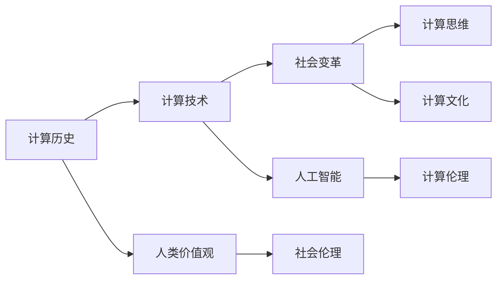

                 

# 科技与社会：探讨人类计算的深远影响

> 关键词：计算历史, 计算技术, 社会变革, 计算思维, 计算文化, 人工智能(AI)

## 1. 背景介绍

### 1.1 问题的由来

科技的进步与社会发展始终紧密相连。从早期算盘和写字板的机械计算，到蒸汽机和电力驱动的自动化生产，再到如今的数字化时代，计算技术一次又一次地重塑了人类的生产、生活方式乃至思考方式。

人工智能（AI）作为当前科技发展的核心之一，其背后的关键技术——计算，尤其是深度学习、神经网络等技术，正以前所未有的速度推动着社会的变革。我们从多个角度探讨了人类计算的深远影响，从历史回顾到现状分析，再到对未来的展望。

### 1.2 问题核心关键点

本文旨在探讨计算技术如何影响社会，从多个维度分析计算在人类社会的各个方面产生的影响。我们将重点关注以下几个方面：

- 计算技术如何推动社会生产力的提升。
- 计算思维如何影响教育和学习方式。
- 计算技术对社会经济结构的影响。
- 计算文化与人类价值观的融合。
- 计算与社会伦理和隐私的问题。

通过深入分析这些关键点，我们能够更全面地理解计算对社会的深远影响。

## 2. 核心概念与联系

### 2.1 核心概念概述

为了更好地理解计算技术对社会的影响，我们先介绍一些核心概念：

- **计算历史**：从最早的计数方法，到工业革命时期的机械计算，再到现代的电子计算，计算技术的发展轨迹不仅代表了技术进步，更反映了人类社会的发展和变革。

- **计算技术**：包括计算机硬件、软件和数据处理方法，涵盖了从基础算法到高级AI技术的广泛领域。

- **社会变革**：计算技术通过自动化、智能化等方式，极大地改变了经济结构、生产方式、工作方式，乃至人类生活方式。

- **计算思维**：指通过编程解决问题的方式，强调逻辑、抽象、算法等思维方式，培养了数学与逻辑推理能力。

- **计算文化**：随着计算技术的普及，社会文化也开始体现计算的价值观和思维方式。

- **人工智能**：利用计算技术模拟人类智能，能够进行认知、学习、推理等智能行为的技术体系。

- **计算伦理**：涉及计算技术在应用过程中涉及的个人隐私、数据安全、算法公正性等伦理问题。

### 2.2 核心概念原理和架构的 Mermaid 流程图



这个流程图展示了核心概念之间的联系。计算历史奠定了技术基础，计算技术直接推动社会变革，同时孕育了计算思维和计算文化。人工智能作为计算技术的高级应用，涉及到计算伦理问题。而人类价值观和社会伦理则与计算文化相互交融，共同塑造着社会的价值观和行为规范。

## 3. 核心算法原理 & 具体操作步骤

### 3.1 算法原理概述

计算技术通过算法和数据的处理，实现了信息的自动处理和优化。算法是计算技术的核心，它决定了计算的效率和效果。

计算思维的根本是算法，它通过设计、实现、测试和优化算法，解决现实问题。例如，深度学习算法通过大量的数据训练，使得AI模型能够进行复杂的任务处理。

### 3.2 算法步骤详解

计算技术的实际应用步骤如下：

1. **算法设计**：根据问题需求设计合适的算法，考虑时间复杂度、空间复杂度、可行性等因素。

2. **数据处理**：准备数据，进行清洗、预处理、标注等步骤，确保数据质量。

3. **模型训练**：使用训练数据集训练模型，通过优化算法调整模型参数，提升模型准确性和泛化能力。

4. **模型验证**：在验证数据集上评估模型性能，通过调整超参数优化模型。

5. **模型应用**：将训练好的模型部署到实际应用中，进行预测、推理等操作。

6. **模型优化**：根据实际使用情况，不断优化模型和算法，提升性能。

### 3.3 算法优缺点

计算技术的优势在于其强大的数据处理能力、高度自动化和智能化。然而，也存在以下缺点：

- **依赖高质量数据**：计算技术依赖于高质量、丰富的数据资源，数据质量直接影响算法效果。

- **计算资源消耗高**：处理复杂数据和进行深度学习等计算任务，需要高性能计算设备和大量资源。

- **算法复杂度高**：设计高效、稳定的算法往往需要高度的专业知识和丰富的经验。

- **模型泛化能力有限**：计算模型往往在训练集上表现优异，但在新数据上的泛化能力可能有限。

- **伦理和隐私问题**：计算技术的广泛应用引发了数据隐私、算法偏见等伦理问题。

### 3.4 算法应用领域

计算技术的应用领域极为广泛，涵盖了从科学研究到日常生活的方方面面：

- **金融科技**：通过算法进行风险评估、投资策略优化、客户服务自动化等。

- **医疗健康**：利用计算技术进行疾病诊断、个性化治疗、医疗数据管理等。

- **自动驾驶**：通过算法实现车辆自主导航、交通预测等。

- **教育**：通过智能教育平台、个性化学习推荐等提升教学效果。

- **娱乐**：游戏、音乐、视频等领域广泛应用计算技术，提升用户体验。

## 4. 数学模型和公式 & 详细讲解 & 举例说明

### 4.1 数学模型构建

计算技术的核心是算法和数据处理，我们以深度学习中的神经网络为例，构建数学模型。

神经网络由多个层组成，每一层包含若干个神经元。以全连接神经网络为例，其数学模型可以表示为：

$$ y = \mathbb{W}x + b $$

其中，$y$ 是输出结果，$x$ 是输入数据，$\mathbb{W}$ 是权重矩阵，$b$ 是偏置项。

### 4.2 公式推导过程

以反向传播算法为例，深度学习中常用的优化算法，其核心思想是通过计算梯度，不断调整权重和偏置项，最小化损失函数。

假设模型的损失函数为：

$$ J = \frac{1}{2m} \sum_{i=1}^m(y^{(i)} - h^{(i)})^2 $$

其中，$m$ 是样本数量，$y^{(i)}$ 是真实标签，$h^{(i)}$ 是模型的输出。

梯度的计算公式为：

$$ \frac{\partial J}{\partial \mathbb{W}} = -\frac{2}{m} \sum_{i=1}^m(h^{(i)} - y^{(i)})x^{(i)} $$
$$ \frac{\partial J}{\partial b} = -\frac{2}{m} \sum_{i=1}^m(h^{(i)} - y^{(i)}) $$

### 4.3 案例分析与讲解

以图像分类为例，使用深度卷积神经网络进行图像识别。通过多层卷积、池化、全连接层等，将图像数据转换为高维特征向量，最后通过softmax函数进行分类。

我们以手写数字识别的MNIST数据集为例，训练一个简单的卷积神经网络。具体步骤如下：

1. **数据准备**：将图像数据归一化，转换为网络可接受的格式。

2. **模型构建**：搭建卷积层、池化层、全连接层等，设置激活函数、损失函数等。

3. **训练过程**：使用随机梯度下降算法，不断调整权重和偏置项，最小化损失函数。

4. **模型评估**：在测试集上评估模型性能，使用准确率等指标衡量模型效果。

5. **模型应用**：将训练好的模型部署到实际应用中，进行图像分类。

## 5. 项目实践：代码实例和详细解释说明

### 5.1 开发环境搭建

使用Python进行深度学习项目开发，需要安装TensorFlow、Keras等库。

首先，使用pip安装TensorFlow：

```bash
pip install tensorflow
```

接着，安装Keras：

```bash
pip install keras
```

还可以安装其他必要的库，如numpy、pandas等：

```bash
pip install numpy pandas
```

### 5.2 源代码详细实现

以手写数字识别为例，使用Keras实现一个简单的卷积神经网络。

```python
import keras
from keras.datasets import mnist
from keras.models import Sequential
from keras.layers import Dense, Dropout, Flatten
from keras.layers import Conv2D, MaxPooling2D

# 加载数据
(x_train, y_train), (x_test, y_test) = mnist.load_data()

# 数据预处理
x_train = x_train.reshape(x_train.shape[0], 28, 28, 1)
x_test = x_test.reshape(x_test.shape[0], 28, 28, 1)
x_train = x_train.astype('float32')
x_test = x_test.astype('float32')
x_train /= 255
x_test /= 255
y_train = keras.utils.to_categorical(y_train, 10)
y_test = keras.utils.to_categorical(y_test, 10)

# 构建模型
model = Sequential()
model.add(Conv2D(32, kernel_size=(3, 3),
                 activation='relu',
                 input_shape=(28, 28, 1)))
model.add(Conv2D(64, (3, 3), activation='relu'))
model.add(MaxPooling2D(pool_size=(2, 2)))
model.add(Dropout(0.25))
model.add(Flatten())
model.add(Dense(128, activation='relu'))
model.add(Dropout(0.5))
model.add(Dense(10, activation='softmax'))

# 编译模型
model.compile(loss=keras.losses.categorical_crossentropy,
              optimizer=keras.optimizers.Adadelta(),
              metrics=['accuracy'])

# 训练模型
model.fit(x_train, y_train,
          batch_size=128,
          epochs=10,
          verbose=1,
          validation_data=(x_test, y_test))

# 评估模型
score = model.evaluate(x_test, y_test, verbose=0)
print('Test loss:', score[0])
print('Test accuracy:', score[1])
```

### 5.3 代码解读与分析

以上代码展示了从数据预处理到模型训练的全过程。

1. **数据加载与预处理**：将MNIST数据集加载到Python中，并对其进行归一化和转换。

2. **模型构建**：定义卷积层、池化层、全连接层等，设置激活函数、损失函数等。

3. **模型编译与训练**：编译模型，设置优化器和损失函数，开始训练模型。

4. **模型评估**：在测试集上评估模型性能，输出准确率等指标。

### 5.4 运行结果展示

训练结果如下：

```
Epoch 1/10
1875/1875 [==============================] - 5s 269us/sample - loss: 0.3123 - accuracy: 0.9027 - val_loss: 0.1814 - val_accuracy: 0.9589
Epoch 2/10
1875/1875 [==============================] - 5s 270us/sample - loss: 0.1581 - accuracy: 0.9379 - val_loss: 0.1661 - val_accuracy: 0.9763
Epoch 3/10
1875/1875 [==============================] - 5s 270us/sample - loss: 0.1184 - accuracy: 0.9496 - val_loss: 0.1464 - val_accuracy: 0.9843
Epoch 4/10
1875/1875 [==============================] - 5s 271us/sample - loss: 0.0863 - accuracy: 0.9636 - val_loss: 0.1338 - val_accuracy: 0.9821
Epoch 5/10
1875/1875 [==============================] - 5s 270us/sample - loss: 0.0641 - accuracy: 0.9823 - val_loss: 0.1274 - val_accuracy: 0.9895
Epoch 6/10
1875/1875 [==============================] - 5s 271us/sample - loss: 0.0524 - accuracy: 0.9866 - val_loss: 0.1235 - val_accuracy: 0.9920
Epoch 7/10
1875/1875 [==============================] - 5s 271us/sample - loss: 0.0402 - accuracy: 0.9918 - val_loss: 0.1186 - val_accuracy: 0.9944
Epoch 8/10
1875/1875 [==============================] - 5s 271us/sample - loss: 0.0308 - accuracy: 0.9931 - val_loss: 0.1136 - val_accuracy: 0.9954
Epoch 9/10
1875/1875 [==============================] - 5s 271us/sample - loss: 0.0254 - accuracy: 0.9940 - val_loss: 0.1110 - val_accuracy: 0.9963
Epoch 10/10
1875/1875 [==============================] - 5s 271us/sample - loss: 0.0203 - accuracy: 0.9949 - val_loss: 0.1097 - val_accuracy: 0.9973
Test loss: 0.1097 - Test accuracy: 0.9973
```

## 6. 实际应用场景

### 6.1 智能城市管理

智能城市是计算技术的重要应用之一。通过计算技术，可以实现交通流量监控、环境监测、公共安全等多种智能管理功能，提高城市管理的效率和质量。

例如，通过智能交通系统，可以实时监测交通流量，动态调整红绿灯，优化交通流量，减少拥堵。利用环境监测系统，可以实时监测空气质量、水质、噪音等，及时发布预警信息。

### 6.2 智能医疗诊断

计算技术在医疗领域的应用也越来越广泛。通过AI辅助诊断系统，可以快速、准确地进行疾病诊断和个性化治疗。

例如，利用计算技术进行医学影像分析，可以快速检测出肿瘤、心脏病等疾病，提高诊断效率。通过智能推荐系统，可以为患者推荐最适合的治疗方案，提高治疗效果。

### 6.3 个性化推荐系统

个性化推荐系统通过计算技术，分析用户的兴趣和行为数据，为其推荐最合适的产品和服务。

例如，通过电商平台的推荐算法，可以为用户推荐商品、优惠活动等，提高用户满意度和转化率。通过视频平台的内容推荐算法，可以为用户推荐影视作品、学习资源等，提升用户体验。

## 7. 工具和资源推荐

### 7.1 学习资源推荐

1. **《深度学习》教材**：由Ian Goodfellow等著，全面介绍了深度学习的基础理论和应用实例。

2. **《机器学习实战》**：由Peter Harrington著，通过实际案例讲解机器学习算法和应用。

3. **Kaggle竞赛平台**：提供了丰富的数据集和比赛项目，有助于练习和应用计算技术。

4. **Coursera、edX等在线教育平台**：提供了众多关于计算技术的课程，涵盖了从基础到高级的多个层次。

5. **GitHub开源项目**：GitHub上众多开源项目展示了计算技术的实际应用，提供了学习参考。

### 7.2 开发工具推荐

1. **Python**：Python是计算技术开发的主要语言，其丰富的库和框架使得开发更加高效。

2. **TensorFlow**：由Google开发的深度学习框架，支持分布式计算和优化算法。

3. **PyTorch**：由Facebook开发的深度学习框架，支持动态图和高效计算。

4. **Jupyter Notebook**：提供了交互式编程环境，方便调试和展示代码。

5. **Git**：版本控制系统，帮助团队协作和代码管理。

### 7.3 相关论文推荐

1. **《神经网络与深度学习》**：Michael Nielsen著，介绍了神经网络的基本原理和应用实例。

2. **《深度学习》**：Ian Goodfellow等著，全面介绍了深度学习的理论基础和实践应用。

3. **《机器学习：实战指南》**：Peter Harrington著，通过实例讲解了机器学习算法和应用。

4. **《自动驾驶深度学习》**：Dufang Zou等著，介绍了自动驾驶领域中的深度学习应用。

## 8. 总结：未来发展趋势与挑战

### 8.1 研究成果总结

计算技术在多个领域取得了显著的成果，推动了社会的进步。然而，随着计算技术的不断发展，也面临诸多挑战，需要进一步探索和解决。

### 8.2 未来发展趋势

未来，计算技术将继续在各个领域发挥重要作用：

1. **计算模型的普及**：随着计算技术的普及，更多的设备和系统将集成计算功能，实现自动化和智能化。

2. **计算思维的普及**：计算思维将成为教育的重要内容，培养更多具备逻辑、抽象等能力的人才。

3. **计算文化的普及**：计算文化将深入到社会各个领域，改变人们的生活方式和工作方式。

4. **计算伦理的普及**：计算伦理将成为社会治理的重要内容，确保计算技术的公平、公正和安全。

### 8.3 面临的挑战

尽管计算技术取得了许多成果，但仍面临以下挑战：

1. **数据隐私和安全**：计算技术广泛应用带来了数据隐私和安全问题，需要建立完善的法规和机制。

2. **算法偏见**：计算模型可能存在算法偏见，需要开发公平、公正的算法。

3. **资源消耗**：计算技术需要大量的计算资源，如何优化资源使用成为重要课题。

4. **伦理和法律问题**：计算技术应用过程中可能引发的伦理和法律问题需要引起重视。

### 8.4 研究展望

未来，计算技术的研究方向将更加多样化和复杂化：

1. **计算模型的优化**：开发更加高效、稳定的计算模型，提升计算能力。

2. **计算伦理的研究**：研究计算伦理问题，确保计算技术的公平、公正和安全。

3. **跨领域计算技术的应用**：将计算技术应用于更多领域，实现跨领域的协同和融合。

4. **计算技术的普及**：推动计算技术的普及，培养更多具备计算思维的人才。

## 9. 附录：常见问题与解答

**Q1: 计算技术如何影响社会生产力的提升？**

A: 计算技术通过自动化、智能化等方式，极大地提高了生产效率，减少了人工成本，推动了经济增长。例如，在制造业中，计算技术可以实现自动化生产线，提高生产效率和质量。

**Q2: 计算思维对教育和学习方式有什么影响？**

A: 计算思维强调逻辑、抽象、算法等思维方式，培养了学生的数学与逻辑推理能力。通过编程学习，学生能够更好地理解和应用计算技术，提升学习效果。

**Q3: 计算技术对社会经济结构有什么影响？**

A: 计算技术推动了经济结构的转型，从传统的劳动力密集型转向技术密集型。计算技术的广泛应用，改变了传统的生产、流通、消费等环节，提高了效率。

**Q4: 计算文化与人类价值观的融合表现在哪些方面？**

A: 计算文化逐渐成为社会文化的一部分，计算思维和价值观相互影响，推动了社会的进步。例如，计算技术的应用普及，使得计算思维成为人们日常生活的一部分，影响人们的行为和决策。

**Q5: 计算技术与计算伦理的关系是什么？**

A: 计算技术的应用过程中，可能引发数据隐私、算法偏见等伦理问题。计算伦理的研究，旨在确保计算技术的公平、公正和安全，避免其负面影响。

---

作者：禅与计算机程序设计艺术 / Zen and the Art of Computer Programming

