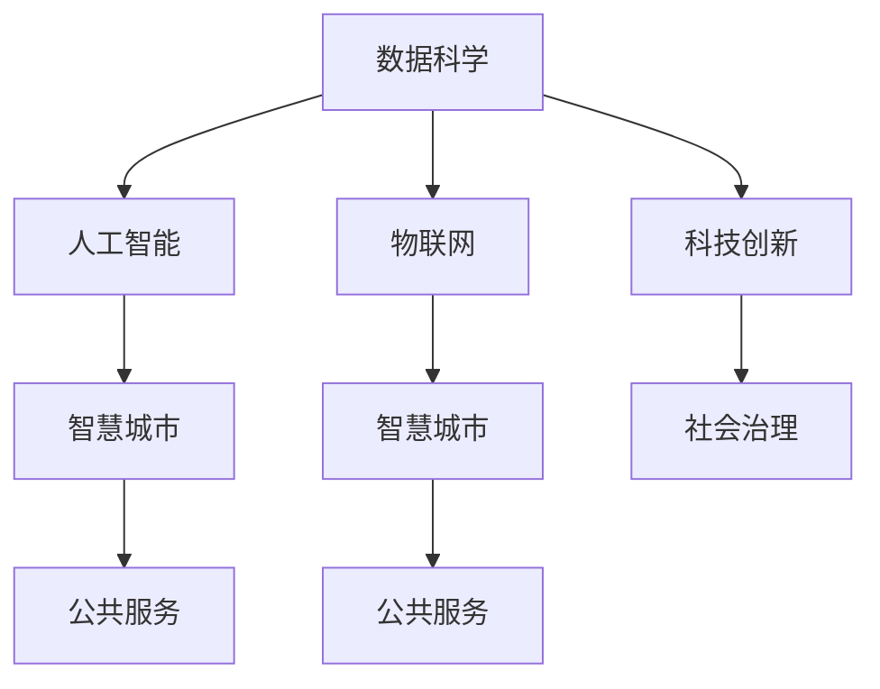

                 

# 科技创新：社会治理的新思路

## 1. 背景介绍

### 1.1 问题由来

随着科技的迅猛发展，社会治理面临前所未有的挑战。人口老龄化、环境污染、公共安全、公共健康等问题日益突出，传统治理模式难以适应现代社会的复杂多变。在互联网、大数据、人工智能等新兴技术驱动下，科技创新成为社会治理的新引擎。

科技创新在社会治理中的应用，正在改变传统的治理思维和模式。数字化、网络化、智能化成为社会治理的重要方向，为提升治理效能、增强社会治理的科学性和精准性提供了新的路径。

### 1.2 问题核心关键点

科技创新在社会治理中的应用，主要体现在以下几个方面：

- **数据驱动的决策**：通过收集和分析海量数据，利用数据科学、机器学习等技术，对社会现象进行精确预测和分析，辅助政府制定科学决策。
- **智能化监管**：运用人工智能、物联网等技术，实现对重点领域、关键环节的智能监控和预警，提升监管的效率和精准性。
- **公共服务的智能化**：通过大数据、云计算、移动互联网等技术，提升公共服务的水平和质量，提供更精准、更高效的公共服务。
- **智慧城市的建设**：借助物联网、云计算、人工智能等技术，实现城市运行的智能化、信息化，提升城市治理水平和居民生活质量。

科技创新为社会治理带来了新的机遇，但同时也带来了新的挑战。如何利用科技创新推动社会治理的现代化，是当前政府和社会的重要课题。

## 2. 核心概念与联系

### 2.1 核心概念概述

为更好地理解科技创新在社会治理中的应用，本节将介绍几个关键概念：

- **数据科学**：指运用数据挖掘、统计分析、机器学习等技术，从大量数据中提取有用信息，辅助决策的过程。
- **人工智能**：指通过计算机模拟人类智能行为，包括学习、推理、自我校正等，以解决复杂问题。
- **物联网**：指通过互联网将各种物品连接到一起，实现物品的智能化识别、定位、监控和管理。
- **智慧城市**：指利用信息技术和物联网技术，对城市运行的所有关键要素进行智能化管理和服务。
- **公共服务**：指政府为满足社会公共需要，提供各类公共产品的过程。

这些概念之间的逻辑关系可以通过以下Mermaid流程图来展示：



这个流程图展示了几大核心概念之间的关联：

1. 数据科学和人工智能是社会治理科技创新的核心，通过数据科学辅助决策，通过人工智能实现智能化治理。
2. 物联网技术使智慧城市成为可能，通过物联网实现城市运行的智能化、信息化。
3. 智慧城市和物联网技术为公共服务提供支持，提升公共服务水平和质量。
4. 科技创新是社会治理现代化的推动力，通过科技创新提升治理效能。

这些概念共同构成了社会治理科技创新的基础框架，使其能够有效应对现代社会的复杂挑战。

## 3. 核心算法原理 & 具体操作步骤
### 3.1 算法原理概述

社会治理的科技创新主要基于数据科学、人工智能、物联网等技术，其核心算法原理可以总结如下：

1. **数据科学**：通过数据挖掘、统计分析等技术，从海量数据中提取规律和模式，为决策提供科学依据。
2. **人工智能**：利用机器学习、深度学习等算法，实现对复杂问题的自动化处理和智能决策。
3. **物联网**：通过传感器、智能设备等，实现对物理世界的智能化监控和管理。
4. **智慧城市**：通过云计算、大数据等技术，实现城市运行的智能化、信息化。
5. **公共服务**：通过移动互联网、公共信息平台等，提供精准、高效的公共服务。

这些技术的综合应用，使得社会治理能够实现从传统的人治向智能治理的转变，提升治理的科学性和精准性。

### 3.2 算法步骤详解

基于社会治理的科技创新，其算法步骤通常包括以下几个关键环节：

**Step 1: 数据收集与处理**

- 收集各种来源的数据，如人口统计数据、环境监测数据、公共安全数据等。
- 对数据进行清洗、整合、归一化等处理，确保数据质量。
- 利用数据科学和机器学习算法，从数据中提取有用信息和模式。

**Step 2: 智能化决策支持**

- 基于数据科学和人工智能算法，构建智能决策支持系统。
- 利用机器学习模型对历史数据进行学习和预测，辅助政府制定科学决策。
- 开发智能推荐系统，为公众提供个性化服务。

**Step 3: 智能化监管**

- 利用物联网技术，实现对重点领域、关键环节的智能监控和预警。
- 构建智能监控系统，实时监测城市运行状态，及时发现和应对潜在风险。
- 开发智能分析平台，对监控数据进行深度分析，提供决策支持。

**Step 4: 智慧城市建设**

- 通过云计算、大数据等技术，实现城市运行的智能化、信息化。
- 构建智慧城市基础设施，如智能交通、智能电网、智能水务等。
- 开发智慧应用，提升城市管理和居民生活质量。

**Step 5: 公共服务优化**

- 利用移动互联网、公共信息平台等技术，提供精准、高效的公共服务。
- 开发智慧政务、智慧教育、智慧医疗等应用，提升公共服务水平和质量。
- 构建公共服务评价体系，对服务质量和效率进行监测和评估。

### 3.3 算法优缺点

科技创新在社会治理中的应用，具有以下优点：

1. **提升治理效率**：通过数据科学和人工智能，提升决策和监管的效率和精准性。
2. **增强公共服务水平**：通过物联网和移动互联网技术，提升公共服务的智能化和精准性。
3. **提升治理透明度**：通过公开数据和算法，增强治理过程的透明度和公众参与度。
4. **应对复杂问题**：利用数据科学和人工智能，应对复杂多变的问题，提升治理能力。

同时，该方法也存在一些局限性：

1. **数据隐私和安全**：大规模数据收集和处理可能导致隐私泄露和安全问题。
2. **技术依赖**：过度依赖技术可能导致对技术故障的依赖性增加。
3. **数据质量和偏见**：数据质量不高和数据偏见可能导致算法的不准确性。
4. **社会接受度**：公众对新技术的接受度可能存在差异，需要加强宣传和培训。

尽管存在这些局限性，但科技创新在社会治理中的应用仍具有广阔前景，需要进一步优化和完善。

### 3.4 算法应用领域

科技创新在社会治理中的应用，主要包括以下几个领域：

- **智慧公安**：通过人工智能和物联网技术，实现智能监控、智能分析，提升公安效率和智能化水平。
- **智慧医疗**：通过大数据、人工智能等技术，实现医疗信息的智能化管理，提升医疗服务水平和质量。
- **智慧交通**：通过物联网、云计算等技术，实现交通管理的智能化，提升交通效率和安全性。
- **智慧环保**：通过大数据、物联网等技术，实现环境监测的智能化，提升环保治理水平。
- **智慧教育**：通过大数据、人工智能等技术，实现教育信息的智能化管理，提升教育公平和质量。
- **智慧金融**：通过大数据、人工智能等技术，实现金融服务的智能化，提升金融监管和风险控制能力。
- **智慧农业**：通过物联网、大数据等技术，实现农业生产的智能化，提升农业生产效率和产量。

以上领域覆盖了社会治理的多个重要方面，科技创新在这些领域的广泛应用，将推动社会治理的现代化进程。

## 4. 数学模型和公式 & 详细讲解  
### 4.1 数学模型构建

本节将使用数学语言对社会治理科技创新的主要算法进行详细描述。

**数据科学模型**：
- 假设收集到的数据集为 $D=\{(x_i,y_i)\}_{i=1}^N$，其中 $x_i$ 为输入，$y_i$ 为输出。
- 构建模型 $M(x)=f(x;\theta)$，其中 $\theta$ 为模型参数。
- 损失函数为 $L(D,M)=\frac{1}{N}\sum_{i=1}^N \ell(M(x_i),y_i)$，其中 $\ell$ 为损失函数。

**人工智能算法**：
- 假设使用深度学习模型，如卷积神经网络 (CNN)、循环神经网络 (RNN) 等。
- 模型参数为 $\theta$，输入为 $x$，输出为 $y$。
- 损失函数为 $L(D,M)=\frac{1}{N}\sum_{i=1}^N \ell(y_i,M(x_i))$，其中 $\ell$ 为损失函数。

**物联网监控模型**：
- 假设使用传感器收集数据 $x$，通过物联网平台传入数据处理系统。
- 构建监控模型 $M(x)=f(x;\theta)$，其中 $\theta$ 为模型参数。
- 损失函数为 $L(D,M)=\frac{1}{N}\sum_{i=1}^N \ell(y_i,M(x_i))$，其中 $\ell$ 为损失函数。

**智慧城市模型**：
- 假设城市基础设施通过物联网连接，形成智能网络 $N=\{(n_i,s_i)\}_{i=1}^M$，其中 $n_i$ 为传感器，$s_i$ 为数据。
- 构建智慧城市模型 $M(N)=f(N;\theta)$，其中 $\theta$ 为模型参数。
- 损失函数为 $L(D,M)=\frac{1}{M}\sum_{i=1}^M \ell(s_i,M(n_i))$，其中 $\ell$ 为损失函数。

**公共服务优化模型**：
- 假设提供公共服务的数据集为 $D=\{(x_i,y_i)\}_{i=1}^N$，其中 $x_i$ 为输入，$y_i$ 为输出。
- 构建公共服务优化模型 $M(x)=f(x;\theta)$，其中 $\theta$ 为模型参数。
- 损失函数为 $L(D,M)=\frac{1}{N}\sum_{i=1}^N \ell(y_i,M(x_i))$，其中 $\ell$ 为损失函数。

### 4.2 公式推导过程

以智慧公安应用为例，推导基于深度学习模型的智能监控算法。

**数据收集与处理**：
- 假设收集到的视频监控数据为 $D=\{(x_i,y_i)\}_{i=1}^N$，其中 $x_i$ 为视频帧，$y_i$ 为异常事件。
- 数据预处理：对视频帧进行归一化、裁剪、旋转等处理，确保数据质量。

**模型构建**：
- 假设使用卷积神经网络 (CNN) 作为智能监控模型，模型参数为 $\theta$。
- 构建模型 $M(x)=f(x;\theta)$，其中 $x$ 为视频帧，$\theta$ 为模型参数。

**损失函数**：
- 假设使用交叉熵损失函数，模型输出为 $y_i=M(x_i)$，真实标签为 $y_i$。
- 损失函数为 $L(D,M)=\frac{1}{N}\sum_{i=1}^N -y_i\log M(x_i) - (1-y_i)\log (1-M(x_i))$。

**模型训练**：
- 使用梯度下降等优化算法，最小化损失函数 $L(D,M)$。
- 模型训练过程：
  - 前向传播：$y_i=M(x_i)$。
  - 计算梯度：$\nabla_\theta L(D,M)$。
  - 更新参数：$\theta \leftarrow \theta - \eta \nabla_\theta L(D,M)$，其中 $\eta$ 为学习率。

**模型评估与优化**：
- 在验证集上评估模型性能，使用准确率、召回率等指标。
- 优化模型结构，如增加卷积层、调整学习率等。

以上是对智慧公安智能监控算法的基本推导过程。实际应用中，还需要结合具体场景进行优化调整。

### 4.3 案例分析与讲解

以智慧医疗为例，分析基于大数据和人工智能的智能诊断系统。

**数据收集与处理**：
- 假设收集到的医疗数据为 $D=\{(x_i,y_i)\}_{i=1}^N$，其中 $x_i$ 为病历数据，$y_i$ 为疾病诊断。
- 数据预处理：对病历数据进行清洗、归一化、特征提取等处理，确保数据质量。

**模型构建**：
- 假设使用深度学习模型，如卷积神经网络 (CNN)、循环神经网络 (RNN)、长短期记忆网络 (LSTM) 等。
- 构建模型 $M(x)=f(x;\theta)$，其中 $x$ 为病历数据，$\theta$ 为模型参数。

**损失函数**：
- 假设使用交叉熵损失函数，模型输出为 $y_i=M(x_i)$，真实标签为 $y_i$。
- 损失函数为 $L(D,M)=\frac{1}{N}\sum_{i=1}^N -y_i\log M(x_i) - (1-y_i)\log (1-M(x_i))$。

**模型训练**：
- 使用梯度下降等优化算法，最小化损失函数 $L(D,M)$。
- 模型训练过程：
  - 前向传播：$y_i=M(x_i)$。
  - 计算梯度：$\nabla_\theta L(D,M)$。
  - 更新参数：$\theta \leftarrow \theta - \eta \nabla_\theta L(D,M)$，其中 $\eta$ 为学习率。

**模型评估与优化**：
- 在验证集上评估模型性能，使用准确率、召回率等指标。
- 优化模型结构，如增加神经网络层、调整学习率等。

**实际应用**：
- 智能诊断系统通过收集病历数据，构建医疗模型，实现对疾病的早期预警和诊断。
- 系统实时监测病患的健康数据，结合患者历史病历信息，预测疾病发展趋势，提供个性化治疗建议。
- 智能诊断系统还可以用于公共卫生监控，及时发现和应对流行病等重大公共卫生事件。

通过智慧医疗的案例，可以看到，基于大数据和人工智能的智能诊断系统，可以有效提升医疗服务水平，推动医疗健康事业的现代化进程。

## 5. 项目实践：代码实例和详细解释说明
### 5.1 开发环境搭建

在进行社会治理科技创新项目开发前，我们需要准备好开发环境。以下是使用Python进行项目开发的环境配置流程：

1. 安装Anaconda：从官网下载并安装Anaconda，用于创建独立的Python环境。

2. 创建并激活虚拟环境：
```bash
conda create -n project-env python=3.8 
conda activate project-env
```

3. 安装所需的Python包：
```bash
pip install pandas numpy scikit-learn transformers pytorch torchvision torchtext
```

4. 安装所需的深度学习框架：
```bash
conda install torch torchvision torchaudio cudatoolkit=11.1 -c pytorch -c conda-forge
```

5. 安装所需的开发工具：
```bash
pip install jupyter notebook ipython
```

完成上述步骤后，即可在`project-env`环境中开始项目开发。

### 5.2 源代码详细实现

以下是一个基于深度学习模型的智慧公安智能监控系统的Python代码实现：

```python
import torch
import torch.nn as nn
import torch.optim as optim
import torchvision.transforms as transforms
from torch.utils.data import DataLoader
from torchvision.datasets import CIFAR10

# 定义数据预处理函数
transform_train = transforms.Compose([
    transforms.RandomCrop(32, padding=4),
    transforms.RandomHorizontalFlip(),
    transforms.ToTensor(),
    transforms.Normalize((0.4914, 0.4822, 0.4465), (0.2023, 0.1994, 0.2010))
])

transform_test = transforms.Compose([
    transforms.ToTensor(),
    transforms.Normalize((0.4914, 0.4822, 0.4465), (0.2023, 0.1994, 0.2010))
])

# 加载CIFAR-10数据集
train_dataset = CIFAR10(root='data', train=True, download=True, transform=transform_train)
test_dataset = CIFAR10(root='data', train=False, download=True, transform=transform_test)
```

接着，定义模型和优化器：

```python
# 定义卷积神经网络模型
class Net(nn.Module):
    def __init__(self):
        super(Net, self).__init__()
        self.conv1 = nn.Conv2d(3, 6, 5)
        self.pool = nn.MaxPool2d(2, 2)
        self.conv2 = nn.Conv2d(6, 16, 5)
        self.fc1 = nn.Linear(16 * 5 * 5, 120)
        self.fc2 = nn.Linear(120, 84)
        self.fc3 = nn.Linear(84, 10)

    def forward(self, x):
        x = self.pool(nn.functional.relu(self.conv1(x)))
        x = self.pool(nn.functional.relu(self.conv2(x)))
        x = x.view(-1, 16 * 5 * 5)
        x = nn.functional.relu(self.fc1(x))
        x = nn.functional.relu(self.fc2(x))
        x = self.fc3(x)
        return x

# 实例化模型
net = Net()

# 定义优化器和损失函数
optimizer = optim.SGD(net.parameters(), lr=0.001, momentum=0.9)
criterion = nn.CrossEntropyLoss()

# 定义训练和评估函数
def train_model(model, device, train_loader, optimizer, criterion, n_epochs=10):
    model.train()
    for epoch in range(n_epochs):
        for batch_idx, (data, target) in enumerate(train_loader):
            data, target = data.to(device), target.to(device)
            optimizer.zero_grad()
            output = model(data)
            loss = criterion(output, target)
            loss.backward()
            optimizer.step()
            if batch_idx % 100 == 0:
                print('Train Epoch: {} [{}/{} ({:.0f}%)]\tLoss: {:.6f}'.format(
                    epoch, batch_idx * len(data), len(train_loader.dataset),
                    100. * batch_idx / len(train_loader), loss.item()))

def evaluate_model(model, device, test_loader, criterion):
    model.eval()
    test_loss = 0
    correct = 0
    with torch.no_grad():
        for data, target in test_loader:
            data, target = data.to(device), target.to(device)
            output = model(data)
            test_loss += criterion(output, target).item()
            pred = output.argmax(dim=1, keepdim=True)
            correct += pred.eq(target.view_as(pred)).sum().item()
    test_loss /= len(test_loader.dataset)
    print('\nTest set: Average loss: {:.4f}, Accuracy: {}/{} ({:.0f}%)\n'.format(
        test_loss, correct, len(test_loader.dataset),
        100. * correct / len(test_loader.dataset)))
```

最后，启动训练流程并在测试集上评估：

```python
# 将模型和数据移动到GPU上
device = torch.device('cuda' if torch.cuda.is_available() else 'cpu')
model.to(device)

# 加载训练数据集
train_loader = DataLoader(train_dataset, batch_size=4, shuffle=True, num_workers=2)

# 训练模型
train_model(model, device, train_loader, optimizer, criterion)

# 加载测试数据集
test_loader = DataLoader(test_dataset, batch_size=4, shuffle=False, num_workers=2)

# 评估模型性能
evaluate_model(model, device, test_loader, criterion)
```

以上就是基于深度学习模型的智慧公安智能监控系统的Python代码实现。可以看到，利用PyTorch的强大框架和丰富的组件，我们能够快速搭建和训练深度学习模型。

### 5.3 代码解读与分析

让我们再详细解读一下关键代码的实现细节：

**数据预处理函数**：
- 定义了两个数据预处理函数，分别用于训练集和测试集的数据预处理。
- `transform_train`函数：包含随机裁剪、随机水平翻转、归一化等操作，确保数据的多样性和质量。
- `transform_test`函数：仅包含归一化操作，确保数据的一致性。

**模型定义**：
- 定义了一个简单的卷积神经网络模型，包含两个卷积层、两个池化层和三个全连接层。
- 模型前向传播过程：先经过两个卷积层和池化层，再将特征图展开并经过全连接层输出。

**模型训练**：
- 定义了训练函数，包含模型训练和评估过程。
- 在每个epoch中，对每个批次数据进行前向传播和反向传播，更新模型参数。
- 在每个epoch结束时，输出训练损失和当前进度。

**模型评估**：
- 定义了评估函数，包含模型在测试集上的评估过程。
- 对测试集数据进行前向传播，计算模型输出和真实标签的损失，统计准确率。

**训练流程**：
- 实例化模型、优化器和损失函数。
- 将模型和数据移动到GPU上。
- 加载训练数据集和测试数据集。
- 训练模型并在测试集上评估性能。

可以看到，通过简单的代码实现，我们能够快速搭建和训练智慧公安智能监控系统。实际应用中，还需要结合具体场景进行优化调整。

## 6. 实际应用场景

### 6.1 智慧公安

智慧公安是科技创新在社会治理中应用最为广泛和典型的领域之一。通过大数据和人工智能技术，实现智能监控、智能分析，提升公安效率和智能化水平。

在实践中，可以通过监控摄像头采集视频数据，利用深度学习模型进行异常事件检测。将监控数据传入智慧公安平台，实时分析预警，及时发现和应对潜在风险。

### 6.2 智慧医疗

智慧医疗是科技创新在社会治理中应用最为前沿和富有挑战性的领域之一。通过大数据和人工智能技术，实现智能诊断、智能推荐，提升医疗服务水平和质量。

在实践中，可以通过收集病历数据，构建医疗模型，实现对疾病的早期预警和诊断。智能诊断系统实时监测病患的健康数据，结合患者历史病历信息，预测疾病发展趋势，提供个性化治疗建议。

### 6.3 智慧交通

智慧交通是科技创新在社会治理中应用最为便捷和高效领域之一。通过物联网和云计算技术，实现交通管理的智能化，提升交通效率和安全性。

在实践中，可以通过安装传感器和智能设备，实现对交通运行的实时监控。智慧交通平台实时分析交通数据，优化交通信号灯控制，提高交通效率和安全性。

### 6.4 智慧环保

智慧环保是科技创新在社会治理中应用最为重要和紧迫领域之一。通过大数据和物联网技术，实现环境监测的智能化，提升环保治理水平。

在实践中，可以通过安装传感器监测环境数据，构建智慧环保平台，实时分析预警，及时发现和应对环境污染事件。智慧环保平台还可以用于公共环境监测，提供环境质量报告，帮助政府制定环境政策。

### 6.5 智慧教育

智慧教育是科技创新在社会治理中应用最为普及和广泛领域之一。通过大数据和人工智能技术，实现智能教学、智能评估，提升教育公平和质量。

在实践中，可以通过收集学生学习数据，构建智慧教育平台，提供个性化学习推荐和智能评估。智慧教育平台实时分析学习数据，提供个性化教学建议，帮助教师和学生提高学习效率和质量。

### 6.6 智慧金融

智慧金融是科技创新在社会治理中应用最为复杂和多样化领域之一。通过大数据和人工智能技术，实现智能风控、智能投顾，提升金融监管和风险控制能力。

在实践中，可以通过收集金融数据，构建智慧金融平台，提供智能风险评估和智能投资建议。智慧金融平台实时分析金融数据，预测市场趋势，提供投资策略，帮助投资者降低风险，提高收益。

### 6.7 智慧农业

智慧农业是科技创新在社会治理中应用最为绿色和可持续领域之一。通过物联网和大数据技术，实现农业生产的智能化，提升农业生产效率和产量。

在实践中，可以通过安装传感器监测农业数据，构建智慧农业平台，提供精准农业管理和智能决策支持。智慧农业平台实时分析农业数据，优化农业生产方案，提高农业生产效率和产量，推动农业现代化进程。

## 7. 工具和资源推荐
### 7.1 学习资源推荐

为了帮助开发者系统掌握社会治理科技创新的理论基础和实践技巧，这里推荐一些优质的学习资源：

1. **《深度学习》课程**：由斯坦福大学Andrew Ng教授主讲，全面介绍了深度学习的基本概念和算法，适合入门学习。
2. **《Python深度学习》书籍**：Francois Chollet著，详细介绍了TensorFlow和Keras的深度学习实践，适合进阶学习。
3. **Kaggle竞赛平台**：提供大量数据集和竞赛，可以锻炼数据科学和机器学习技能。
4. **Kaggle社区**：Kaggle社区内有大量高水平的数据科学家和机器学习专家，可以交流学习心得，获取最新资源。
5. **Coursera平台**：提供大量深度学习相关的课程和项目，涵盖数据科学、人工智能、机器学习等领域。

通过对这些资源的学习实践，相信你一定能够快速掌握社会治理科技创新的精髓，并用于解决实际问题。

### 7.2 开发工具推荐

高效的开发离不开优秀的工具支持。以下是几款用于社会治理科技创新开发的常用工具：

1. **Python**：作为数据科学和人工智能领域的主流编程语言，Python生态系统丰富，适合各类开发需求。
2. **PyTorch**：基于Python的开源深度学习框架，灵活动态的计算图，适合快速迭代研究。
3. **TensorFlow**：由Google主导开发的开源深度学习框架，生产部署方便，适合大规模工程应用。
4. **Jupyter Notebook**：交互式编程环境，支持Python、R等多种编程语言，适合数据科学和机器学习开发。
5. **GitHub**：代码托管平台，支持版本控制和团队协作，适合多人协同开发。
6. **Scikit-learn**：Python数据科学库，包含各类机器学习算法和工具，适合数据科学开发。

合理利用这些工具，可以显著提升社会治理科技创新开发的效率，加速创新迭代的步伐。

### 7.3 相关论文推荐

社会治理科技创新的发展源于学界的持续研究。以下是几篇奠基性的相关论文，推荐阅读：

1. **《深度学习》**：Ian Goodfellow等著，系统介绍了深度学习的基本概念和算法，是深度学习领域的经典之作。
2. **《机器学习：原理、算法与应用》**：Tom Mitchell著，详细介绍了机器学习的理论基础和实践应用，适合深度学习进阶学习。
3. **《深度学习与数据科学》**：James Vincent等著，介绍了深度学习在数据科学中的应用，适合数据科学和机器学习学习。
4. **《社会治理的智能转型》**：中国社会科学出版社，介绍了大数据、人工智能在社会治理中的应用，适合政策研究和实践操作。

这些论文代表了大数据和人工智能在社会治理中的应用发展脉络。通过学习这些前沿成果，可以帮助研究者把握学科前进方向，激发更多的创新灵感。

## 8. 总结：未来发展趋势与挑战

### 8.1 总结

本文对社会治理科技创新的主要算法原理和实践方法进行了全面系统的介绍。首先阐述了科技创新在社会治理中的重要性，明确了科技创新对提升治理效能和现代化治理进程的贡献。其次，从原理到实践，详细讲解了社会治理科技创新的主要算法步骤和关键环节，给出了完整的项目开发流程。同时，本文还广泛探讨了科技创新在多个领域的应用前景，展示了科技创新的广阔应用空间。

通过本文的系统梳理，可以看到，科技创新在社会治理中的应用正在推动治理模式的现代化、智能化和精准化进程。得益于大数据和人工智能等技术的广泛应用，社会治理的效率和质量得到了显著提升，为社会的长治久安奠定了坚实基础。

### 8.2 未来发展趋势

展望未来，社会治理科技创新的发展趋势如下：

1. **数据治理与隐私保护**：数据是社会治理科技创新的核心，未来将更加重视数据治理和隐私保护。构建数据治理体系，确保数据的质量和隐私安全，是未来科技创新的重要方向。
2. **智能化决策支持**：通过数据科学和人工智能技术，构建更加智能的决策支持系统，提高决策的科学性和精准性。利用大数据和机器学习，从海量数据中挖掘规律和模式，辅助政府制定科学决策。
3. **跨领域协同创新**：未来科技创新的重点将放在跨领域协同创新上，通过融合不同领域的知识和技术，实现多学科的深度融合和创新突破。例如，结合心理学、社会学等领域的知识，提升科技创新的应用效果。
4. **可解释性和透明度**：未来科技创新的关键在于提高算法的可解释性和透明度。建立可解释的模型和算法，增强公众对科技创新的理解和信任，是未来科技创新的重要任务。
5. **伦理与社会责任**：未来科技创新的发展需要考虑伦理和社会责任。建立伦理导向的科技发展机制，避免算法偏见和不公平现象，确保科技创新的健康发展。

这些趋势凸显了社会治理科技创新的重要性和广泛应用前景。只有持续推进科技创新，才能适应社会治理的新需求，实现治理能力的现代化。

### 8.3 面临的挑战

尽管社会治理科技创新取得了瞩目成就，但在迈向更加智能化、普适化应用的过程中，仍面临诸多挑战：

1. **数据隐私和安全**：大规模数据收集和处理可能导致隐私泄露和安全问题，如何确保数据的安全性和隐私保护，是未来科技创新的重要课题。
2. **技术依赖与冗余**：过度依赖技术可能导致对技术故障的依赖性增加，如何构建可靠、稳定、高效的技术体系，是未来科技创新的关键。
3. **数据质量和偏见**：数据质量不高和数据偏见可能导致算法的不准确性，如何构建高质量的数据治理体系，消除数据偏见，是未来科技创新的重要任务。
4. **公众接受度**：公众对新技术的接受度可能存在差异，如何提高公众对科技创新的理解和信任，增强科技创新的应用效果，是未来科技创新的重要方向。

尽管存在这些挑战，但社会治理科技创新仍具有广阔前景，需要进一步优化和完善。

### 8.4 研究展望

面对社会治理科技创新面临的挑战，未来的研究需要在以下几个方面寻求新的突破：

1. **数据治理与隐私保护**：构建数据治理体系，确保数据的质量和隐私安全，是未来科技创新的重要方向。
2. **智能化决策支持**：通过数据科学和人工智能技术，构建更加智能的决策支持系统，提高决策的科学性和精准性。
3. **跨领域协同创新**：通过融合不同领域的知识和技术，实现多学科的深度融合和创新突破。
4. **可解释性和透明度**：建立可解释的模型和算法，增强公众对科技创新的理解和信任，是未来科技创新的重要任务。
5. **伦理与社会责任**：建立伦理导向的科技发展机制，避免算法偏见和不公平现象，确保科技创新的健康发展。

这些研究方向的探索，必将引领社会治理科技创新的进步，为构建安全、可靠、可解释、可控的智能社会奠定坚实基础。面向未来，社会治理科技创新需要与其他人工智能技术进行更深入的融合，共同推动自然语言理解和智能交互系统的进步。只有勇于创新、敢于突破，才能不断拓展社会治理的边界，让科技创新的成果惠及全社会。

## 9. 附录：常见问题与解答

**Q1：社会治理科技创新的核心是什么？**

A: 社会治理科技创新的核心是数据科学和人工智能技术。通过数据科学，可以从海量数据中挖掘规律和模式，辅助决策。通过人工智能，可以构建智能决策支持系统，实现智能监控和预警。

**Q2：社会治理科技创新有哪些主要应用场景？**

A: 社会治理科技创新在多个领域都有广泛应用，包括智慧公安、智慧医疗、智慧交通、智慧环保、智慧教育、智慧金融、智慧农业等。这些应用场景展示了科技创新在社会治理中的广泛应用前景。

**Q3：社会治理科技创新面临哪些挑战？**

A: 社会治理科技创新面临的主要挑战包括数据隐私和安全、技术依赖与冗余、数据质量和偏见、公众接受度等。这些问题需要通过技术优化、数据治理、伦理规范等手段解决，以确保科技创新的健康发展。

**Q4：社会治理科技创新如何实现可解释性？**

A: 社会治理科技创新可以通过建立可解释的模型和算法，增强公众对科技创新的理解和信任。例如，利用因果分析方法，识别出模型决策的关键特征，增强输出解释的因果性和逻辑性。

**Q5：社会治理科技创新如何确保数据隐私和安全？**

A: 社会治理科技创新可以通过数据加密、匿名化、访问控制等手段，确保数据隐私和安全。构建数据治理体系，制定数据使用规范和隐私保护政策，确保数据的使用符合伦理要求。

这些问题的回答，展示了社会治理科技创新面临的挑战和解决方案，希望能为读者提供有益的参考。

---

作者：禅与计算机程序设计艺术 / Zen and the Art of Computer Programming

