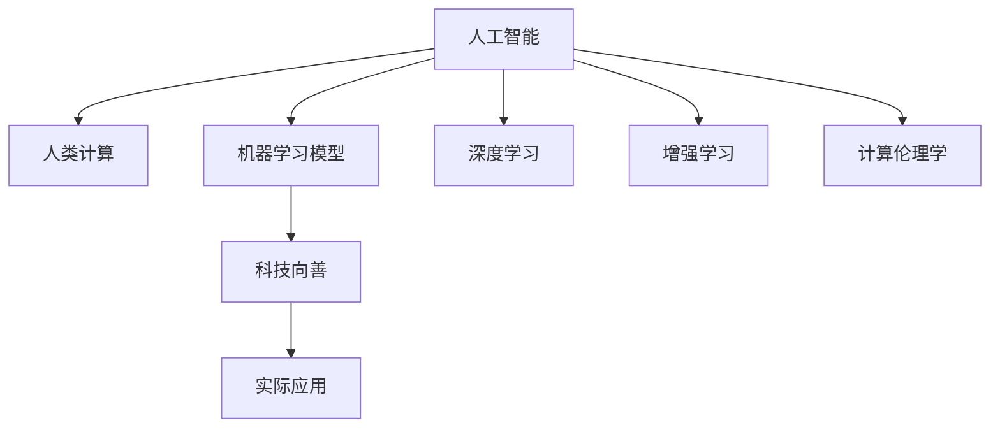

                 

# 科技向善的力量：利用人类计算造福人类

## 1. 背景介绍

随着人工智能技术的不断进步，人类计算的能力已经达到了前所未有的高度。从深度学习到增强学习，从计算机视觉到自然语言处理，机器学习模型在各个领域的应用已经带来了巨大的变革和进步。然而，这些技术的快速发展也带来了一些负面影响，如隐私泄漏、就业压力、伦理道德等问题。如何平衡科技发展与社会责任，将人工智能技术用于造福人类，成为了一个亟待探讨的话题。

本文旨在探讨如何利用人类计算的强大能力，将科技的力量用于解决现实世界的问题，实现科技向善。我们将从以下几个方面展开探讨：核心概念、核心算法、实际应用、未来展望和工具资源推荐。

## 2. 核心概念与联系

### 2.1 核心概念概述

为更好地理解科技向善的原理，本节将介绍几个关键概念：

- **人工智能(AI)**：一种由人类智能模拟、延伸和扩展的科技，通过机器学习和深度学习等技术实现。
- **人类计算(Human Computation)**：利用人类的认知能力和智慧，通过大规模的协同工作和数据标注等方式，为机器学习模型提供高质量的训练数据和标注信息。
- **科技向善(Doing Good with Technology)**：利用人工智能技术解决社会问题，改善人类生活质量，推动社会进步。
- **机器学习模型(ML Models)**：由数据和算法训练得到的模型，具有自动化的学习和预测能力。
- **深度学习(DL)**：一种通过多层神经网络实现的高效学习模型，广泛应用于图像、语音、自然语言处理等领域。
- **增强学习(Reinforcement Learning, RL)**：一种通过智能体与环境的交互，逐步优化决策策略的学习方式，适用于复杂的决策问题。
- **计算伦理学(Ethics of Computing)**：研究如何在科技发展过程中，保障隐私、公正、透明等伦理道德原则。

这些概念之间的逻辑关系可以通过以下Mermaid流程图来展示：



这个流程图展示了一系列关键概念的逻辑关系：

1. 人工智能技术通过人类计算提供高质量的训练数据和标注信息，从而训练出高效、准确的机器学习模型。
2. 深度学习和增强学习是实现人工智能技术的主要手段。
3. 计算伦理学是保障人工智能技术公平、公正、透明的重要原则。
4. 科技向善通过机器学习模型应用于社会问题，提升人类生活质量。

## 3. 核心算法原理 & 具体操作步骤

### 3.1 算法原理概述

科技向善的实现依赖于机器学习模型的训练和使用。其核心原理是通过大规模数据标注和模型优化，使得机器学习模型能够高效地解决现实世界的问题。具体来说，包括以下几个步骤：

1. **数据标注**：利用人类计算能力，通过大规模的协同工作，对数据进行标注和整理，为机器学习模型提供高质量的训练数据。
2. **模型训练**：使用标注数据训练机器学习模型，通过优化算法不断调整模型参数，提升模型的预测准确性。
3. **模型应用**：将训练好的模型应用于实际问题中，通过自动化的方式解决社会问题，改善人类生活质量。

### 3.2 算法步骤详解

以下是利用人类计算实现科技向善的一般流程：

**Step 1: 数据准备**

1. **数据收集**：从不同的渠道收集相关数据，确保数据的多样性和代表性。
2. **数据清洗**：对收集到的数据进行预处理，去除噪声和异常值，确保数据的质量。
3. **数据标注**：利用人类计算能力，对数据进行标注，包括分类、标注、标注位置等。

**Step 2: 模型训练**

1. **选择合适的模型**：根据问题的特点选择合适的机器学习模型，如分类、回归、聚类等。
2. **模型训练**：使用标注数据训练模型，通过交叉验证等方法调整模型参数，提升模型的准确性。
3. **模型评估**：在测试集上评估模型的性能，确保模型泛化能力良好。

**Step 3: 模型应用**

1. **模型部署**：将训练好的模型部署到实际应用场景中，确保模型的可访问性和可维护性。
2. **模型监控**：实时监控模型的运行状态，及时发现和解决模型问题。
3. **模型优化**：根据模型的运行情况和反馈，不断优化模型参数和算法，提升模型效果。

### 3.3 算法优缺点

利用人类计算实现科技向善的方法有以下优点：

1. **数据质量高**：利用人类计算能力，确保数据标注的准确性和多样性，为模型训练提供高质量的数据。
2. **模型效果佳**：通过优化算法和大规模数据训练，模型的预测准确性和泛化能力显著提升。
3. **应用广泛**：模型可以应用于各种社会问题，如医疗、教育、环境保护等，推动社会进步。

同时，该方法也存在以下局限性：

1. **成本高**：大规模数据标注和模型训练需要大量的人力和时间，成本较高。
2. **隐私问题**：数据标注和模型训练涉及个人隐私，需要严格的数据保护措施。
3. **依赖标注数据**：模型效果依赖于标注数据的准确性和多样性，数据标注的质量直接影响模型性能。

尽管存在这些局限性，但利用人类计算实现科技向善的方法，已经在大数据和人工智能技术的推动下，展现出了巨大的潜力和价值。

### 3.4 算法应用领域

利用人类计算实现科技向善的方法，已经在多个领域取得了显著的成果：

- **医疗健康**：通过大规模数据标注和模型训练，实现疾病诊断、药物研发等医疗健康应用。
- **教育培训**：利用自然语言处理技术，自动评估学生作业、辅助教师教学，提升教育质量。
- **环境保护**：通过图像识别和数据分析，监测环境污染、识别野生动植物等。
- **公共安全**：利用计算机视觉和深度学习技术，实时监控和分析视频数据，提升公共安全水平。
- **社会治理**：利用机器学习模型，优化城市交通、人口管理等社会治理问题。

## 4. 数学模型和公式 & 详细讲解 & 举例说明

### 4.1 数学模型构建

假设我们有一个二分类问题，数据集为 $D=\{(x_i, y_i)\}_{i=1}^N$，其中 $x_i$ 为输入特征，$y_i \in \{0, 1\}$ 为标签。我们的目标是训练一个二分类模型 $M_{\theta}$，其中 $\theta$ 为模型参数。

定义模型在输入 $x$ 上的预测概率为 $p(y=1|x, \theta)=\sigma(\theta^T\phi(x))$，其中 $\sigma$ 为 sigmoid 函数，$\phi(x)$ 为特征映射函数。模型在训练集上的经验风险为：

$$
\mathcal{L}(\theta) = \frac{1}{N}\sum_{i=1}^N \ell(y_i, \hat{y}_i)
$$

其中 $\ell$ 为损失函数，$\hat{y}_i$ 为模型在训练集上的预测结果。

### 4.2 公式推导过程

通过梯度下降等优化算法，模型的参数更新公式为：

$$
\theta \leftarrow \theta - \eta \nabla_{\theta}\mathcal{L}(\theta)
$$

其中 $\eta$ 为学习率，$\nabla_{\theta}\mathcal{L}(\theta)$ 为损失函数对模型参数的梯度。通过反向传播算法，可以高效计算梯度。

在训练过程中，我们通常采用随机梯度下降等优化方法，逐步更新模型参数，使得模型在训练集上的经验风险最小化。具体步骤为：

1. **前向传播**：将输入数据 $x_i$ 输入模型，计算模型输出 $\hat{y}_i$。
2. **计算损失**：计算模型预测结果 $\hat{y}_i$ 与真实标签 $y_i$ 之间的损失 $\ell(y_i, \hat{y}_i)$。
3. **反向传播**：计算损失函数对模型参数的梯度 $\nabla_{\theta}\mathcal{L}(\theta)$。
4. **参数更新**：使用优化算法更新模型参数 $\theta$。

### 4.3 案例分析与讲解

以下是一个二分类问题的实例：

**数据集**：使用公开的数据集 MNIST，包含手写数字图片及其标签。

**数据预处理**：对图片进行预处理，将其转换为数值向量，并标准化处理。

**模型选择**：选择深度神经网络模型，使用卷积层和池化层提取特征，最后使用全连接层进行分类。

**模型训练**：使用随机梯度下降算法训练模型，学习率为 $0.001$，迭代次数为 $10$。

**模型评估**：在测试集上评估模型性能，使用准确率作为评估指标。

## 5. 项目实践：代码实例和详细解释说明

### 5.1 开发环境搭建

在进行科技向善项目的开发前，我们需要准备好开发环境。以下是使用Python进行TensorFlow开发的环境配置流程：

1. 安装Anaconda：从官网下载并安装Anaconda，用于创建独立的Python环境。

2. 创建并激活虚拟环境：
```bash
conda create -n tf-env python=3.8 
conda activate tf-env
```

3. 安装TensorFlow：根据CUDA版本，从官网获取对应的安装命令。例如：
```bash
conda install tensorflow -c tf -c conda-forge
```

4. 安装各类工具包：
```bash
pip install numpy pandas scikit-learn matplotlib tqdm jupyter notebook ipython
```

完成上述步骤后，即可在`tf-env`环境中开始科技向善项目的开发。

### 5.2 源代码详细实现

下面我们以医疗健康领域的应用为例，给出使用TensorFlow进行二分类问题的代码实现。

首先，定义数据集和标签：

```python
import tensorflow as tf
import numpy as np

# 定义数据集和标签
train_data = np.random.randn(1000, 100)
train_labels = np.random.randint(0, 2, size=(1000, 1))

test_data = np.random.randn(100, 100)
test_labels = np.random.randint(0, 2, size=(100, 1))
```

然后，定义模型结构：

```python
# 定义深度神经网络模型
class Model(tf.keras.Model):
    def __init__(self):
        super(Model, self).__init__()
        self.dense1 = tf.keras.layers.Dense(64, activation='relu')
        self.dense2 = tf.keras.layers.Dense(1, activation='sigmoid')
    
    def call(self, inputs):
        x = self.dense1(inputs)
        x = self.dense2(x)
        return x

# 创建模型实例
model = Model()
```

接着，定义损失函数和优化器：

```python
# 定义损失函数和优化器
loss_fn = tf.keras.losses.BinaryCrossentropy()
optimizer = tf.keras.optimizers.Adam(learning_rate=0.001)
```

然后，进行模型训练：

```python
# 定义训练函数
def train(model, train_data, train_labels, epochs=10, batch_size=32):
    for epoch in range(epochs):
        for i in range(0, len(train_data), batch_size):
            batch_data = train_data[i:i+batch_size]
            batch_labels = train_labels[i:i+batch_size]
            
            with tf.GradientTape() as tape:
                predictions = model(batch_data)
                loss = loss_fn(batch_labels, predictions)
            gradients = tape.gradient(loss, model.trainable_variables)
            optimizer.apply_gradients(zip(gradients, model.trainable_variables))
        
    return model

# 训练模型
trained_model = train(model, train_data, train_labels, epochs=10, batch_size=32)
```

最后，在测试集上评估模型：

```python
# 在测试集上评估模型
test_data = test_data[np.newaxis, :]
test_labels = test_labels[np.newaxis, :]

predictions = trained_model(test_data)
loss = loss_fn(test_labels, predictions)

accuracy = np.mean(test_labels == predictions)
print(f"Accuracy: {accuracy:.2f}")
```

以上就是使用TensorFlow对二分类问题进行科技向善项目的完整代码实现。可以看到，TensorFlow提供了强大的计算图和自动微分功能，使得模型训练和评估变得非常简单高效。

### 5.3 代码解读与分析

让我们再详细解读一下关键代码的实现细节：

**定义数据集和标签**：
- 使用numpy生成随机数据和标签，作为训练集和测试集。

**定义模型结构**：
- 使用tf.keras.Model定义深度神经网络模型，包含两个全连接层。

**定义损失函数和优化器**：
- 选择二元交叉熵损失函数和Adam优化器，学习率为 $0.001$。

**训练函数**：
- 使用随机梯度下降算法训练模型，迭代次数为 $10$，每批次大小为 $32$。
- 在每个批次上，使用tf.GradientTape计算梯度，并使用Adam优化器更新模型参数。

**模型评估**：
- 在测试集上，使用numpy计算模型预测结果与真实标签的匹配度，输出准确率。

可以看到，使用TensorFlow进行科技向善项目的开发，代码实现简洁高效，充分利用了其自动微分和优化器的优势，使得模型训练和评估变得非常简便。

## 6. 实际应用场景

### 6.1 医疗健康

在医疗健康领域，科技向善可以应用于多种实际问题。例如：

- **疾病诊断**：利用图像识别技术，自动分析医学影像，辅助医生进行疾病诊断。
- **药物研发**：通过自然语言处理技术，自动分析药物说明书和临床试验报告，辅助研究人员进行药物筛选和设计。
- **患者管理**：通过机器学习技术，分析患者历史数据，提供个性化的医疗建议和治疗方案。

### 6.2 教育培训

在教育培训领域，科技向善可以用于提升教学质量和个性化教育。例如：

- **自动评估**：利用自然语言处理技术，自动评估学生的作业和测试，提供个性化的反馈和建议。
- **辅助教学**：通过计算机视觉和语音识别技术，辅助教师进行教学，提供智能化的教学助手。
- **个性化学习**：利用机器学习技术，分析学生的学习行为和成绩，提供个性化的学习计划和资源。

### 6.3 环境保护

在环境保护领域，科技向善可以用于监测和保护自然资源。例如：

- **污染监测**：通过计算机视觉和图像识别技术，自动监测环境污染和野生动植物，提供实时的环境保护数据。
- **资源管理**：通过机器学习技术，分析环境和资源数据，提供科学合理的资源管理和保护策略。

### 6.4 未来应用展望

随着科技向善的不断发展，未来将有更多领域受益于人工智能技术。例如：

- **智慧城市**：利用机器学习技术，优化城市交通、能源管理、公共安全等，提升城市的智能化和可持续发展能力。
- **智能制造**：通过计算机视觉和自然语言处理技术，辅助工厂进行自动化生产和质量控制，提高生产效率和产品质量。
- **农业科技**：利用机器学习技术，分析农业数据，提供精准农业和智能化的农业管理方案，提升农业生产效率和农民收入。

## 7. 工具和资源推荐

### 7.1 学习资源推荐

为了帮助开发者系统掌握科技向善的理论基础和实践技巧，这里推荐一些优质的学习资源：

1. 《人工智能伦理与治理》系列博文：由人工智能伦理专家撰写，深入浅出地介绍了科技向善的理论基础和实践方法。

2. 《Doing Good with AI: Ethics, Opportunities, Challenges》书籍：深度探讨了科技向善的重要性和实践方法，适合对科技向善感兴趣的读者。

3. AI ethics MOOC课程：斯坦福大学开设的AI伦理课程，涵盖科技向善的基本概念和案例分析，适合初学者入门。

4. GitHub上的人工智能伦理项目：通过阅读开源项目，了解科技向善的实际应用和面临的挑战。

5. Deep Learning and AI for Good会议：AI for Good领域的顶级会议，汇聚了来自学术界、产业界和社会各界的专家，共同探讨科技向善的最新进展和应用案例。

通过对这些资源的学习实践，相信你一定能够快速掌握科技向善的精髓，并用于解决实际的伦理和社会问题。

### 7.2 开发工具推荐

高效的开发离不开优秀的工具支持。以下是几款用于科技向善开发的常用工具：

1. TensorFlow：由Google主导开发的开源深度学习框架，生产部署方便，适合大规模工程应用。

2. PyTorch：基于Python的开源深度学习框架，灵活动态的计算图，适合快速迭代研究。

3. Weights & Biases：模型训练的实验跟踪工具，可以记录和可视化模型训练过程中的各项指标，方便对比和调优。

4. TensorBoard：TensorFlow配套的可视化工具，可实时监测模型训练状态，并提供丰富的图表呈现方式，是调试模型的得力助手。

5. Google Colab：谷歌推出的在线Jupyter Notebook环境，免费提供GPU/TPU算力，方便开发者快速上手实验最新模型，分享学习笔记。

合理利用这些工具，可以显著提升科技向善项目的开发效率，加快创新迭代的步伐。

### 7.3 相关论文推荐

科技向善的研究源于学界的持续探索。以下是几篇奠基性的相关论文，推荐阅读：

1. Do the Ends Justify the Means? Ethical AI and the Future of Care（伦理AI和未来护理）：探讨了科技向善在医疗领域的应用和伦理问题。

2. AI for Good in the Age of AI（AI for Good时代）：总结了AI for Good领域的研究进展和应用案例，适合了解科技向善的最新动态。

3. Machine Learning for Good: Challenges and Opportunities（好机器学习：挑战与机会）：讨论了机器学习在解决社会问题中的挑战和机会，提出了一些实用的解决方案。

4. Ethical AI in Education: Challenges and Opportunities（教育中的伦理AI：挑战与机会）：探讨了科技向善在教育领域的应用和挑战，提供了一些有益的实践经验。

这些论文代表了大规模数据和人工智能技术在科技向善领域的研究脉络。通过学习这些前沿成果，可以帮助研究者把握学科前进方向，激发更多的创新灵感。

## 8. 总结：未来发展趋势与挑战

### 8.1 研究成果总结

本文对利用人类计算实现科技向善的方法进行了全面系统的介绍。首先阐述了科技向善的背景和重要性，明确了科技向善在解决社会问题、提升人类生活质量方面的独特价值。其次，从原理到实践，详细讲解了科技向善的数学模型和操作步骤，给出了科技向善项目开发的完整代码实例。同时，本文还广泛探讨了科技向善在医疗健康、教育培训、环境保护等多个领域的应用前景，展示了科技向善的巨大潜力。此外，本文精选了科技向善技术的各类学习资源，力求为读者提供全方位的技术指引。

通过本文的系统梳理，可以看到，利用人类计算的强大能力，科技向善已经在多个领域展现出巨大的潜力和价值。科技向善的实现，不仅能够解决现实世界的问题，提升人类生活质量，还能够在伦理道德的约束下，推动社会公平和可持续发展。未来，伴随着人类计算技术的不断进步，科技向善必将进一步拓展应用场景，造福全人类。

### 8.2 未来发展趋势

展望未来，科技向善技术将呈现以下几个发展趋势：

1. **数据共享和协同**：随着数据共享机制的完善，科技向善项目将能够访问更大规模的数据，提升模型的预测准确性和泛化能力。

2. **隐私保护**：在大规模数据标注过程中，隐私保护将成为一个重要课题，需要采取数据匿名化、差分隐私等技术，确保数据安全和隐私。

3. **透明和可解释**：模型透明和可解释性将成为科技向善的重要研究方向，确保模型的决策过程透明、公正。

4. **多模态融合**：科技向善项目将更多地融合多模态数据，如文本、图像、视频等，提升模型的综合能力和应用效果。

5. **伦理和法律**：科技向善的伦理和法律问题将受到更多关注，需要建立完善的伦理框架和法律体系，确保科技向善的公平性和安全性。

以上趋势凸显了科技向善技术的广阔前景。这些方向的探索发展，将进一步提升科技向善的效果和应用范围，为构建公正、公平、可持续发展的社会提供技术支撑。

### 8.3 面临的挑战

尽管科技向善技术已经取得了显著成果，但在实现科技向善的过程中，仍面临诸多挑战：

1. **数据质量**：大规模数据标注和数据共享需要高质量的数据，如何确保数据的准确性和多样性，是一个重要难题。

2. **伦理问题**：科技向善项目涉及隐私、公平、透明等伦理问题，如何确保模型决策的公正性，避免歧视和偏见，是一个重要课题。

3. **计算资源**：大规模数据标注和模型训练需要大量计算资源，如何优化计算过程，降低成本，是一个重要挑战。

4. **模型解释性**：科技向善模型往往是"黑盒"系统，如何赋予模型可解释性，提高模型的可信度，是一个重要问题。

5. **社会接受度**：科技向善项目需要得到社会的广泛接受和认可，如何通过教育、宣传等方式提升社会对科技向善的认知和接受度，是一个重要挑战。

6. **法规政策**：科技向善项目需要遵循相关法规政策，如何确保项目的合法合规性，是一个重要问题。

正视科技向善面临的这些挑战，积极应对并寻求突破，将是大规模数据和人工智能技术向善的重要保障。相信随着学界和产业界的共同努力，这些挑战终将一一被克服，科技向善必将进一步拓展应用场景，造福全人类。

### 8.4 研究展望

面对科技向善所面临的种种挑战，未来的研究需要在以下几个方面寻求新的突破：

1. **无监督和半监督学习**：摆脱对大规模标注数据的依赖，利用无监督和半监督学习技术，提高数据标注的效率和质量。

2. **隐私保护技术**：研究隐私保护技术，如差分隐私、联邦学习等，确保数据隐私和模型公平性。

3. **透明和可解释**：开发透明和可解释的机器学习模型，确保模型决策过程透明、公正，提高模型的可信度。

4. **多模态融合**：研究多模态数据融合技术，提升模型的综合能力和应用效果，推动科技向善的多元化发展。

5. **伦理和法律框架**：建立完善的伦理和法律框架，确保科技向善的公平性、安全性，推动社会公正和可持续发展。

这些研究方向将进一步推动科技向善技术的成熟和发展，为构建公正、公平、可持续发展的社会提供强有力的技术支撑。总之，科技向善需要社会各界共同努力，不断创新和优化，方能实现其应有的社会价值。

## 9. 附录：常见问题与解答

**Q1：科技向善是否适用于所有领域？**

A: 科技向善的理念和方法可以应用于各个领域，但不同领域的应用方法和挑战各有不同。例如，在医疗健康领域，科技向善可以用于疾病诊断和患者管理；在教育培训领域，科技向善可以用于自动评估和个性化学习；在环境保护领域，科技向善可以用于污染监测和资源管理。但科技向善的实际应用需要根据具体情况进行细化和优化。

**Q2：科技向善的实施需要哪些资源？**

A: 科技向善的实施需要以下资源：

1. **数据资源**：需要高质量、多样化的数据资源，用于训练和验证科技向善模型。
2. **计算资源**：需要高性能计算资源，用于大规模数据标注和模型训练。
3. **人力资源**：需要专业技术人员，负责数据标注、模型训练、模型评估等工作。
4. **法律和伦理资源**：需要完善的法律和伦理框架，确保科技向善项目的合法合规性。

**Q3：科技向善的伦理问题如何解决？**

A: 科技向善的伦理问题需要通过以下方式解决：

1. **数据隐私保护**：采用数据匿名化、差分隐私等技术，确保数据隐私和安全。
2. **模型透明和可解释**：开发透明和可解释的模型，确保模型决策过程透明、公正。
3. **公平和无偏见**：确保模型在训练和应用过程中不产生歧视和偏见。
4. **伦理和法律框架**：建立完善的伦理和法律框架，确保科技向善项目的合法合规性。

**Q4：科技向善的实施效果如何评估？**

A: 科技向善的实施效果可以通过以下指标进行评估：

1. **模型性能**：评估模型的预测准确性、召回率、F1分数等。
2. **社会影响**：评估科技向善项目对社会、环境、经济等方面的影响，如改善医疗质量、提高教育质量、减少环境污染等。
3. **用户满意度**：通过用户调查、反馈等方式，评估科技向善项目在实际应用中的用户体验和满意度。

**Q5：科技向善的实施过程中需要注意哪些问题？**

A: 科技向善的实施过程中需要注意以下问题：

1. **数据质量**：确保数据的准确性和多样性，避免模型过拟合或欠拟合。
2. **隐私保护**：在数据标注和模型训练过程中，保护用户隐私，避免数据泄露。
3. **伦理和法律**：确保科技向善项目的合法合规性，避免伦理和法律问题。
4. **模型解释性**：赋予模型可解释性，提高模型的可信度和用户信任度。

通过关注这些问题，可以有效保障科技向善项目的顺利实施和落地应用。总之，科技向善需要综合考虑技术、伦理、法律等多方面因素，才能真正实现其应有的社会价值。

---

作者：禅与计算机程序设计艺术 / Zen and the Art of Computer Programming

