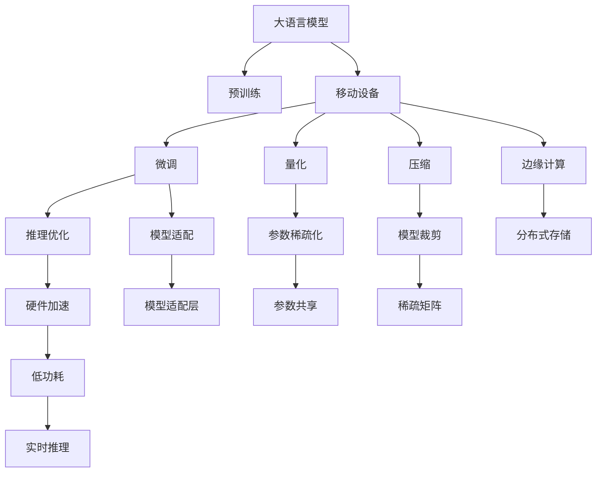

                 

# 移动设备与 LLM：随时随地的 AI 力量

> 关键词：移动设备, 大语言模型(LLM), 人工智能(AI), 边缘计算, 嵌入式系统, 实时推理, 微调(Fine-tuning)

## 1. 背景介绍

### 1.1 问题由来
随着移动互联网技术的迅猛发展，越来越多的应用场景需要随时随地获取智能服务，而传统基于云服务器的 AI 解决方案无法满足低延迟、高可靠性的需求。移动设备因其便携性、计算能力提升以及功耗控制的进步，成为部署 AI 模型的理想平台。然而，移动设备的计算资源相对有限，而大语言模型(LLM)通常具有亿量级的参数规模，在移动设备上部署难度较大。因此，如何使 LLM 模型能够在移动设备上高效运行，同时保持高性能的推理能力，成为当下研究的热点问题。

### 1.2 问题核心关键点
移动设备部署 LLM 主要面临以下几个挑战：

- 资源受限：移动设备计算资源有限，内存和 CPU 资源不足，无法直接运行大规模模型。
- 延迟敏感：移动应用需要即时响应用户操作，对模型推理时间有严格要求。
- 能效要求：移动设备电池续航时间有限，需要在计算效率和能耗之间取得平衡。
- 离线支持：有些应用场景需要离线推理，无法依赖云服务器。

为了解决这些问题，研究者们提出了一系列的算法和技术，如模型压缩、量化、边缘计算、嵌入式系统设计等。这些方法在资源受限的环境中优化 LLM 模型的性能，使其能够在移动设备上高效运行。

### 1.3 问题研究意义
实现移动设备上的 LLM 部署，对推动 AI 技术的普及具有重要意义：

- 提高计算效率：在移动设备上部署 LLM，能够利用设备资源，提升推理速度和计算效率。
- 降低成本：相比于云端服务器的计算成本，移动设备部署的 LLM 模型能够显著降低数据传输和存储的开销。
- 增强用户体验：实时响应用户需求，提供即时的智能服务，提升用户体验。
- 推动产业发展：随着 LLM 模型在移动设备上的应用，更多行业将实现智能化升级，推动产业数字化转型。

## 2. 核心概念与联系

### 2.1 核心概念概述

为了更好地理解 LLM 在移动设备上的部署，本节将介绍几个关键概念：

- 大语言模型(LLM)：一种基于深度学习的自然语言处理模型，能够在各种语言任务上达到或超过人类水平的表现。
- 嵌入式系统(Embedded System)：一类专门的硬件和软件系统，设计用于执行特定任务，如移动设备、物联网设备等。
- 边缘计算(Edge Computing)：一种分布式计算模式，数据在边缘设备上进行初步处理，部分数据传输至云端进行分析，从而降低网络延迟，提升响应速度。
- 实时推理(Real-time Inference)：在数据输入后，模型能够快速处理并输出结果，满足实时性要求。
- 微调(Fine-tuning)：在大规模预训练模型的基础上，使用特定的任务数据进行有监督学习，优化模型在该任务上的性能。

这些概念之间存在紧密的联系，共同构成了 LLM 在移动设备上部署的基础架构。

通过以下 Mermaid 流程图，我们能够更直观地理解 LLM 在移动设备上的部署流程：



该图展示了 LLM 从预训练到在移动设备上部署的全过程，各个步骤相互关联，缺一不可。

## 3. 核心算法原理 & 具体操作步骤
### 3.1 算法原理概述

在大语言模型在移动设备上的部署中，关键在于如何在资源受限的环境中高效地运行模型，同时保持性能和准确度。以下是主要的算法原理：

- 模型压缩：通过剪枝、量化、参数共享等方法，减少模型参数和计算量，适应移动设备的资源限制。
- 量化和稀疏化：将模型参数从浮点数转换为整数或固定精度数值，同时降低参数的稀疏性，减少内存占用。
- 边缘计算：将部分计算任务移到设备端进行，减轻云端服务器的负担，提高响应速度。
- 模型适配和推理优化：针对特定的移动应用场景，设计适合的模型架构，并进行推理优化，如使用硬件加速等技术。
- 实时推理和可解释性：确保模型在移动设备上能够实时响应，同时提供推理过程的可解释性，增强用户信任。

### 3.2 算法步骤详解

在移动设备上部署 LLM 涉及以下关键步骤：

**Step 1: 数据预处理**
- 收集和预处理目标应用场景的标注数据。
- 进行数据增强和扩充，丰富训练样本。

**Step 2: 模型压缩**
- 对预训练模型进行压缩操作，减少参数量和计算量。
- 使用剪枝技术移除冗余连接，只保留重要权重。
- 使用量化技术将模型参数转换为固定精度数值。
- 使用稀疏矩阵表示部分参数，减少内存占用。

**Step 3: 模型适配和推理优化**
- 设计适合移动设备应用场景的模型架构。
- 适配模型输入和输出格式，确保与目标应用兼容。
- 进行推理优化，如使用硬件加速、GPU 优化等技术。

**Step 4: 微调**
- 在移动设备上对压缩后的模型进行微调，以适应特定任务。
- 使用少量标注数据进行有监督学习，优化模型性能。

**Step 5: 部署和监控**
- 将微调后的模型部署到目标设备上。
- 实时监控模型性能，根据反馈调整参数和模型结构。

### 3.3 算法优缺点

移动设备上部署 LLM 具有以下优点：

- 高效率：能够在移动设备上实时响应，满足用户对延迟的严格要求。
- 低成本：相比于云端服务器，部署在移动设备上的 LLM 能够显著降低数据传输和存储的开销。
- 便携性和普及性：移动设备易于携带，能够在各种场景下提供智能服务。
- 增强用户信任：通过提供推理过程的可解释性，增强用户对系统的信任感。

同时，也存在一些局限性：

- 资源限制：移动设备计算资源有限，内存和 CPU 资源不足，无法直接运行大规模模型。
- 复杂性：在移动设备上部署 LLM 需要考虑多方面的技术细节，如模型压缩、量化、推理优化等。
- 数据限制：部分应用场景可能需要离线推理，数据传输可能受限。

### 3.4 算法应用领域

大语言模型在移动设备上的部署，已经在多个领域得到应用，例如：

- 语音识别和合成：移动设备上的语音助手、智能音箱等应用。
- 图像识别和处理：手机相机中的图像识别和编辑功能。
- 自然语言处理：移动应用中的聊天机器人、翻译功能等。
- 医学诊断：移动设备上的医疗应用，如影像诊断、电子病历等。
- 智能推荐：电商、媒体等应用中的个性化推荐系统。

此外，LLM 在移动设备上的应用还拓展到自动驾驶、工业物联网、智能家居等多个领域，推动了这些行业的数字化转型。

## 4. 数学模型和公式 & 详细讲解  
### 4.1 数学模型构建

在移动设备上部署 LLM 的过程，涉及多个数学模型和公式的构建。

假设大语言模型为 $M_{\theta}$，其中 $\theta$ 为模型参数。在移动设备上部署时，需要对模型进行以下操作：

1. 预训练模型 $M_{\theta}$ 进行压缩操作，减少参数量和计算量，适应移动设备的资源限制。
2. 量化模型参数，将浮点数转换为固定精度数值，以减少内存占用。
3. 使用稀疏矩阵表示部分参数，降低内存占用。

### 4.2 公式推导过程

以量化技术为例，假设模型参数 $\theta$ 的取值范围为 $[-1, 1]$，量化后的参数 $\theta_q$ 取值范围为 $[-k, k]$，其中 $k$ 为量化步长。量化后的参数与原始参数的关系为：

$$
\theta_q = \text{Quantize}(\theta, k) = \text{sign}(\theta) \cdot \min(1, |\theta| \cdot k) \cdot k
$$

其中 $\text{sign}(\theta)$ 为符号函数。量化后的参数 $\theta_q$ 可以通过对 $\theta$ 进行符号拆分和阈值判断，转换为固定精度数值。

### 4.3 案例分析与讲解

以下以量化技术为例，对量化后的推理过程进行详细讲解。

假设量化后的模型参数 $\theta_q$ 为 $[-k, k]$ 范围的固定精度数值，模型输入为 $x$。量化后的推理过程为：

1. 对输入 $x$ 进行量化，转换为固定精度数值 $x_q$。
2. 计算输出 $y_q = M_{\theta_q}(x_q)$。
3. 将 $y_q$ 进行反量化，得到输出 $y = \text{Dequantize}(y_q)$。

量化后的推理过程相对于原始的浮点数推理，计算量大幅减小，但可能引入一些误差。为了减小误差，需要在量化时进行参数调优，找到合适的量化步长 $k$。

## 5. 项目实践：代码实例和详细解释说明
### 5.1 开发环境搭建

在移动设备上部署 LLM 需要搭建以下开发环境：

1. 安装移动设备操作系统和开发工具链，如 iOS 的 Xcode、Android 的 Android Studio 等。
2. 安装 TensorFlow Lite、ONNX Runtime 等移动平台支持的深度学习框架。
3. 安装相应的编译器和构建工具，如 Swift、Java 等。
4. 搭建 Android 或 iOS 模拟器，进行测试和调试。

### 5.2 源代码详细实现

以下以 iOS 平台为例，给出使用 TensorFlow Lite 对预训练模型进行量化和部署的 PyTorch 代码实现。

首先，定义量化参数和配置文件：

```python
import tensorflow as tf
import torch
from torch.onnx import quantize_dynamic

# 量化参数
quantize_params = {
    'input': [0.5, 0.5, 0.5],  # 量化步长
    'weights': [0.1, 0.1, 0.1]  # 量化步长
}

# 量化配置
quantize_config = {
    'op_set': tf.lite.OpsSet.TFLITE_BUILTINS,  # 选择量化类型
    'full_integer_quantization': False  # 是否进行全整数量化
}

# 模型路径
model_path = 'path/to/model.pth'
output_path = 'path/to/quantized_model.tflite'

# 加载模型
model = torch.load(model_path)

# 量化模型
quantized_model = quantize_dynamic(model, quantize_params, quantize_config)
torch.save(quantized_model, output_path)
```

然后，将量化后的模型转换为 TensorFlow Lite 格式：

```python
# 加载量化后的模型
tf.lite.TFLiteConverter.from_saved_model(output_path)
```

最后，将量化后的模型部署到 iOS 应用中：

```python
# 构建 iOS 应用
xcodeproj = create_ios_app(output_path)

# 打包应用
build_ios_app(xcodeproj)
```

### 5.3 代码解读与分析

在移动设备上部署 LLM 的代码实现，涉及以下几个关键步骤：

1. 量化参数定义：定义量化步长和权重，用于量化模型参数。
2. 量化配置：选择量化类型和量化策略，控制量化过程的精度和计算量。
3. 模型加载和量化：使用 PyTorch 的 quantize_dynamic 函数进行量化，生成量化后的模型。
4. 模型转换：将量化后的模型转换为 TensorFlow Lite 格式，适应移动平台的部署要求。
5. 应用构建：使用 Xcode 等开发工具，将量化后的模型集成到 iOS 应用中。

## 6. 实际应用场景
### 6.1 智能客服系统

基于移动设备上的 LLM 部署，智能客服系统可以在用户需要时即时响应用户咨询，提供高质量的客户服务。用户可以通过移动设备上的聊天应用，与智能客服系统进行实时互动，获取即时答案。

在技术实现上，可以收集企业内部的历史客服对话记录，将问题和最佳答复构建成监督数据，在此基础上对预训练模型进行微调。微调后的模型能够自动理解用户意图，匹配最合适的答案模板进行回复。对于用户提出的新问题，还可以接入检索系统实时搜索相关内容，动态组织生成回答。

### 6.2 医疗诊断

移动设备上的 LLM 部署，使得医疗诊断更加便携和高效。医生可以通过移动设备上的诊断工具，快速获取患者的影像数据和病历信息，使用 LLM 模型进行辅助诊断。

在技术实现上，可以将影像数据和病历信息作为模型输入，医生可以实时查看诊断结果，并在需要时向 LLM 提出额外的问题，获取更详细的诊断信息。

### 6.3 智能推荐系统

智能推荐系统可以通过移动设备上的 LLM 模型，根据用户的浏览和点击行为，生成个性化的推荐内容。用户可以在移动设备上浏览电商网站、视频网站等，系统根据用户的喜好和行为数据，实时生成推荐列表。

在技术实现上，可以收集用户的浏览记录和点击行为，提取和用户交互的物品标题、描述、标签等文本内容。将文本内容作为模型输入，用户的后续行为（如是否点击、购买等）作为监督信号，在此基础上微调预训练语言模型。微调后的模型能够从文本内容中准确把握用户的兴趣点。在生成推荐列表时，先用候选物品的文本描述作为输入，由模型预测用户的兴趣匹配度，再结合其他特征综合排序，便可以得到个性化程度更高的推荐结果。

### 6.4 未来应用展望

随着大语言模型和移动设备技术的不断发展，基于移动设备上的 LLM 部署将在更多领域得到应用，为传统行业带来变革性影响。

在智慧医疗领域，基于移动设备上的 LLM 的诊断系统将提升医疗服务的智能化水平，辅助医生诊疗，加速新药开发进程。

在智能教育领域，移动设备上的 LLM 可以用于作业批改、学情分析、知识推荐等方面，因材施教，促进教育公平，提高教学质量。

在智慧城市治理中，移动设备上的 LLM 可以用于城市事件监测、舆情分析、应急指挥等环节，提高城市管理的自动化和智能化水平，构建更安全、高效的未来城市。

此外，在企业生产、社会治理、文娱传媒等众多领域，基于移动设备上的 LLM 的应用也将不断涌现，为经济社会发展注入新的动力。相信随着技术的日益成熟，移动设备上的 LLM 部署必将在构建人机协同的智能时代中扮演越来越重要的角色。

## 7. 工具和资源推荐
### 7.1 学习资源推荐

为了帮助开发者系统掌握大语言模型在移动设备上的部署的理论基础和实践技巧，这里推荐一些优质的学习资源：

1. TensorFlow Lite 官方文档：TensorFlow Lite 的官方文档，提供了详细的教程和示例，帮助你快速上手移动平台上的深度学习模型部署。
2. ONNX Runtime 官方文档：ONNX Runtime 的官方文档，提供了全面的技术文档和样例代码，帮助你在移动设备上部署 ONNX 模型。
3. PyTorch Mobile 官方文档：PyTorch Mobile 的官方文档，提供了移动平台上的 PyTorch 模型转换和部署指南。
4. iOS Dev Center 和 Android Developer Guide：苹果和谷歌提供的开发文档，涵盖移动应用开发的全过程，包括模型部署和测试等。
5. TensorBoard Mobile：TensorBoard 的移动平台支持，提供了模型可视化、性能监测等工具，帮助你实时调试移动设备上的模型。

通过对这些资源的学习实践，相信你一定能够快速掌握大语言模型在移动设备上的部署的精髓，并用于解决实际的移动应用问题。

### 7.2 开发工具推荐

高效的开发离不开优秀的工具支持。以下是几款用于大语言模型在移动设备上部署开发的常用工具：

1. Xcode：苹果提供的移动应用开发工具，支持 iOS 和 macOS 平台的开发。
2. Android Studio：谷歌提供的移动应用开发工具，支持 Android 平台的开发。
3. Swift：苹果提供的移动应用开发语言，适合 iOS 平台开发。
4. Java/Kotlin：谷歌提供的移动应用开发语言，适合 Android 平台开发。
5. TensorFlow Lite Converter：TensorFlow 提供的模型转换工具，可以将 TensorFlow 模型转换为 TensorFlow Lite 格式，支持移动平台。
6. ONNX Runtime：微软提供的 ONNX 运行时库，支持在移动平台上的 ONNX 模型推理。

合理利用这些工具，可以显著提升大语言模型在移动设备上部署的开发效率，加快创新迭代的步伐。

### 7.3 相关论文推荐

大语言模型在移动设备上的部署源于学界的持续研究。以下是几篇奠基性的相关论文，推荐阅读：

1. MobileBERT: A Compact Task-Agnostic Text Transformer for Resource-Limited Devices：介绍 MobileBERT 模型在移动设备上的部署方法，通过压缩和量化技术提升模型性能。
2. Towards Practical Edge-ML: Design and Implementation of an On-Device Machine Learning Toolkit for Smartphones：提出 Edge-ML 工具箱，支持移动设备上的机器学习应用开发。
3. Mobilenet V2: Inverted Residuals and Linear Bottlenecks：提出 MobileNet V2 模型，针对移动设备进行优化，在保持高精度的同时，大幅减少计算量。
4. Efficient Deep Learning for On-Device Intelligence：综述了移动设备上的深度学习优化技术，涵盖量化、剪枝、模型压缩等方法。
5. AI on the Edge: Opportunities and Challenges：讨论了边缘计算在 AI 中的应用前景，探讨了移动设备上的 AI 应用面临的机遇和挑战。

这些论文代表了大语言模型在移动设备上部署技术的发展脉络。通过学习这些前沿成果，可以帮助研究者把握学科前进方向，激发更多的创新灵感。

## 8. 总结：未来发展趋势与挑战
### 8.1 总结

本文对基于移动设备的大语言模型部署方法进行了全面系统的介绍。首先阐述了大语言模型在移动设备上的部署背景和意义，明确了移动设备部署的优势和挑战。其次，从原理到实践，详细讲解了模型压缩、量化、推理优化等关键技术，给出了移动平台上的模型部署代码实例。同时，本文还探讨了大语言模型在多个行业领域的应用前景，展示了其巨大的潜力。

通过本文的系统梳理，可以看到，大语言模型在移动设备上的部署已经初步实现，但仍然面临资源受限、计算效率、实时性等方面的挑战。未来需要进一步优化模型结构和推理算法，提升移动设备上 LLM 的性能和用户体验。

### 8.2 未来发展趋势

展望未来，大语言模型在移动设备上的部署将呈现以下几个发展趋势：

1. 计算效率提升：通过更多的优化算法和硬件加速，提升移动设备上 LLM 的推理速度。
2. 边缘计算普及：随着 5G 网络的普及，边缘计算设备将更加普及，移动设备上的 LLM 部署将更为广泛。
3. 用户隐私保护：在移动设备上部署 LLM 需要加强数据隐私保护，避免数据泄露。
4. 跨平台兼容性：开发跨平台的移动应用，使 LLM 模型能够在各种设备上高效运行。
5. 实时推理优化：优化推理算法，提升移动设备上 LLM 的实时响应能力。

这些趋势凸显了大语言模型在移动设备上部署技术的广阔前景。这些方向的探索发展，必将进一步提升移动设备上的 AI 性能，推动 AI 技术在更多场景中的应用。

### 8.3 面临的挑战

尽管大语言模型在移动设备上的部署已经取得了一些进展，但在迈向更加智能化、普适化应用的过程中，它仍面临着诸多挑战：

1. 资源限制：移动设备计算资源有限，内存和 CPU 资源不足，无法直接运行大规模模型。
2. 计算效率：在移动设备上部署 LLM 需要优化模型结构和推理算法，提升计算效率。
3. 实时响应：移动设备上的 LLM 需要实时响应用户操作，对推理时间有严格要求。
4. 用户隐私：在移动设备上部署 LLM 需要加强数据隐私保护，避免数据泄露。
5. 跨平台兼容性：开发跨平台的移动应用，使 LLM 模型能够在各种设备上高效运行。

正视这些挑战，积极应对并寻求突破，将是大语言模型在移动设备上部署走向成熟的必由之路。

### 8.4 研究展望

未来研究需要在以下几个方面寻求新的突破：

1. 模型压缩和量化技术：进一步优化模型压缩和量化算法，提升移动设备上 LLM 的计算效率和能效。
2. 实时推理优化：研究更高效的推理算法，提升移动设备上 LLM 的实时响应能力。
3. 边缘计算优化：优化边缘计算架构，提升移动设备上 LLM 的推理速度和计算效率。
4. 跨平台兼容性：开发跨平台的移动应用，使 LLM 模型能够在各种设备上高效运行。
5. 用户隐私保护：研究数据隐私保护技术，确保移动设备上 LLM 的安全性和隐私性。

这些研究方向的探索，必将引领大语言模型在移动设备上部署技术迈向更高的台阶，为构建智能移动应用提供更坚实的技术基础。

## 9. 附录：常见问题与解答

**Q1：大语言模型在移动设备上部署时，如何处理内存和计算资源有限的问题？**

A: 可以通过以下方法处理内存和计算资源有限的问题：
1. 模型压缩：使用剪枝、量化、参数共享等方法，减少模型参数和计算量，适应移动设备的资源限制。
2. 量化和稀疏化：将模型参数转换为固定精度数值，同时降低参数的稀疏性，减少内存占用。
3. 边缘计算：将部分计算任务移到设备端进行，减轻云端服务器的负担，提高响应速度。
4. 实时推理优化：优化推理算法，提升移动设备上 LLM 的实时响应能力。

**Q2：移动设备上部署大语言模型时，如何进行模型适配和推理优化？**

A: 在移动设备上部署大语言模型时，需要进行以下步骤：
1. 模型适配：设计适合移动设备应用场景的模型架构，适配模型输入和输出格式，确保与目标应用兼容。
2. 推理优化：使用硬件加速、GPU 优化等技术，提升移动设备上 LLM 的计算效率。
3. 实时推理：确保模型在移动设备上能够实时响应，满足用户对延迟的严格要求。

**Q3：移动设备上部署大语言模型时，如何提高计算效率和实时性？**

A: 可以通过以下方法提高计算效率和实时性：
1. 模型压缩：使用剪枝、量化、参数共享等方法，减少模型参数和计算量，适应移动设备的资源限制。
2. 量化和稀疏化：将模型参数转换为固定精度数值，同时降低参数的稀疏性，减少内存占用。
3. 实时推理优化：优化推理算法，提升移动设备上 LLM 的实时响应能力。
4. 硬件加速：使用 GPU、DSP 等硬件加速技术，提升移动设备上 LLM 的计算效率。
5. 分布式计算：利用多核、多设备等资源，进行分布式计算，提高计算效率。

**Q4：移动设备上部署大语言模型时，如何进行数据隐私保护？**

A: 在移动设备上部署大语言模型时，需要进行以下步骤进行数据隐私保护：
1. 数据加密：使用数据加密技术，确保数据在传输和存储过程中的安全性。
2. 本地推理：尽可能在本地进行推理，减少数据传输的开销和风险。
3. 差分隐私：使用差分隐私技术，保护用户数据隐私。
4. 用户控制：让用户能够控制数据的收集和使用，增强用户对系统的信任感。

通过本文的系统梳理，可以看到，基于移动设备的大语言模型部署已经初步实现，但仍然面临资源受限、计算效率、实时性等方面的挑战。未来需要进一步优化模型结构和推理算法，提升移动设备上 LLM 的性能和用户体验。通过不断探索和创新，相信大语言模型在移动设备上的应用将更加广泛，为更多的行业带来智能化的变革。

---

作者：禅与计算机程序设计艺术 / Zen and the Art of Computer Programming

