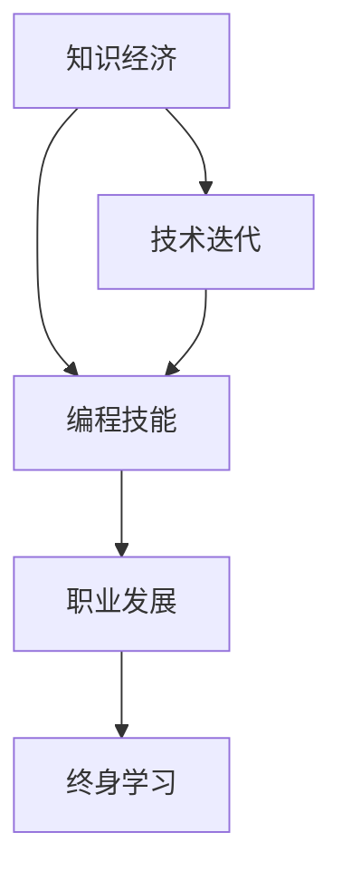

                 

# 程序员在知识经济时代的职业定位与发展

> 关键词：知识经济, 技术迭代, 编程技能, 职业发展, 终身学习

## 1. 背景介绍

### 1.1 问题由来

随着知识经济时代的到来，信息技术的迅猛发展不仅深刻改变了各行各业的生产方式，也重塑了职业劳动力的结构。特别是在全球化、数字化、网络化浪潮的推动下，传统劳动密集型产业正加速向以信息、知识为主导的产业转型。在这一背景下，程序员作为IT领域的重要从业者，其职业定位和发展面临着前所未有的挑战和机遇。

### 1.2 问题核心关键点

面对知识经济时代的职业环境变化，程序员需要重新审视自己的职业定位和发展路径，明确在快速变化的技术趋势下如何保持竞争力。核心关键点包括：

- **技术迭代速度**：新技术、新工具、新框架层出不穷，如何紧跟技术潮流，持续学习和更新知识。
- **编程技能需求**：随着应用场景的扩展，跨领域编程能力、安全编码、算法设计等新需求不断涌现。
- **职业发展前景**：如何在激烈的竞争中脱颖而出，从初级到高级，从技术到管理，构建多元化的职业发展路径。
- **终身学习**：知识经济时代，技术更新迭代不断，终身学习成为程序员不可或缺的职业素质。

### 1.3 问题研究意义

在知识经济时代，程序员的职业定位和发展研究具有重要意义：

1. **提升技术水平**：通过了解最新技术趋势和需求，帮助程序员提高编程技能和解决问题的能力。
2. **明确职业方向**：指导程序员在技术发展和应用实践中，找到适合自己的职业定位和发展路径。
3. **激发创新精神**：通过学习和研究前沿技术，激发程序员的创新意识和创新能力，推动行业技术进步。
4. **实现个人价值**：帮助程序员在不断变化的技术生态中，实现个人职业成长和价值提升。

## 2. 核心概念与联系

### 2.1 核心概念概述

为更好地理解程序员在知识经济时代的职业定位和发展，本节将介绍几个密切相关的核心概念：

- **知识经济**：以信息和知识为主要生产要素，通过技术创新驱动经济增长的新型经济模式。
- **技术迭代**：技术不断更新换代，程序员需要紧跟技术发展，保持技术栈的更新。
- **编程技能**：涵盖算法设计、数据结构、编程语言、开发框架、软件工程等多方面的知识和技能。
- **职业发展**：从初级开发到高级工程师、架构师、CTO等不同层次的职业晋升路径。
- **终身学习**：持续学习新知识，不断提升专业技能，以适应技术发展的需求。

这些核心概念之间的逻辑关系可以通过以下Mermaid流程图来展示：



这个流程图展示了一个核心的概念关系链：

1. 知识经济是背景环境，驱动技术迭代。
2. 技术迭代要求程序员具备不断更新的编程技能。
3. 编程技能是实现职业发展的基石。
4. 职业发展过程中，程序员需不断进行终身学习。

## 3. 核心算法原理 & 具体操作步骤

### 3.1 算法原理概述

在知识经济时代，程序员的核心算法原理和操作步骤主要围绕技术迭代和终身学习展开。这不仅要求程序员掌握最新的编程语言和开发框架，还需要具备跨领域的编程能力，以及持续学习新知识的能力。

### 3.2 算法步骤详解

**Step 1: 评估现有技能与市场需求**
- 分析当前掌握的技术栈与市场热门技术之间的差距。
- 识别自身技能在就业市场中的竞争力和发展潜力。
- 设定学习目标，明确需要提升的技能方向。

**Step 2: 制定学习计划**
- 根据职业目标和技术趋势，制定详细的学习计划。
- 确定学习时间、资源和工具，包括在线课程、书籍、博客、技术社区等。
- 将学习内容分解为小目标，逐步实现。

**Step 3: 技术迭代与实践**
- 紧跟技术更新，及时学习新语言、框架、工具。
- 通过实际项目进行技术迭代，如开源贡献、参与社区讨论等。
- 积累实战经验，提升编程技能和项目管理能力。

**Step 4: 跨领域编程能力**
- 学习不同领域的编程语言和开发工具，如前端开发、后端开发、数据科学等。
- 掌握通用编程原理和设计模式，提升跨领域应用的能力。
- 了解业务需求，参与到业务和技术融合的项目中，增强综合能力。

**Step 5: 职业发展与晋升**
- 根据实际工作表现和项目贡献，逐步晋升为高级工程师、技术主管、架构师等。
- 学习管理和领导技能，提高团队协作和项目管理能力。
- 通过专业认证和技术竞赛等途径，增强职业竞争力。

**Step 6: 终身学习与知识管理**
- 定期回顾和总结学习成果，不断提升技术水平。
- 利用知识管理系统，记录和分享学习心得和技术进展。
- 加入专业社群和技术交流平台，保持与行业前沿的互动。

### 3.3 算法优缺点

基于技术迭代和终身学习的编程职业发展算法具有以下优点：

- **灵活性**：根据市场需求和个人兴趣，灵活调整学习方向，实现个性化发展。
- **实用性**：通过项目实践和跨领域学习，提升技能应用能力，增强市场竞争力。
- **持续性**：终身学习机制确保程序员能够不断适应技术变化，保持职业活力。

同时，该方法也存在一些局限性：

- **高投入**：持续学习和技术迭代需要大量的时间和精力投入，可能对工作和家庭生活产生影响。
- **竞争激烈**：技术领域竞争激烈，快速掌握新技术和技能需要较强的自学能力和毅力。
- **信息过载**：知识经济时代信息爆炸，如何筛选和利用信息，找到最适合自己的学习资源是一大挑战。

### 3.4 算法应用领域

基于技术迭代和终身学习的编程职业发展算法在多个领域都有应用，包括但不限于：

- **软件开发**：帮助软件开发人员紧跟技术潮流，提升编程技能和项目管理能力。
- **数据科学**：帮助数据科学家掌握新算法和工具，提升数据分析和机器学习能力。
- **网络安全**：帮助网络安全工程师学习最新的攻击手段和防护技术，提升安全防护能力。
- **人工智能**：帮助AI开发者掌握新模型和框架，提升算法设计和模型训练能力。
- **系统运维**：帮助系统运维工程师学习新工具和平台，提升系统监控和故障排查能力。

这些应用领域共同构成了知识经济时代程序员发展的广阔舞台，为他们的职业成长提供了多样化的选择和路径。

## 4. 数学模型和公式 & 详细讲解  
### 4.1 数学模型构建

本节将使用数学语言对程序员在知识经济时代的职业定位和发展进行更加严格的刻画。

假设程序员在知识经济时代的职业发展轨迹可以用时间$t$表示，其技能水平$S(t)$由当前掌握的技能$S_0$、学习速度$v$和知识过时速度$\beta$共同决定，则数学模型可以表示为：

$$ S(t) = S_0 + v \int_0^t e^{-\beta t} dt $$

其中：
- $S_0$为初始技能水平。
- $v$为学习速度，即每年学习新技能的速度。
- $\beta$为知识过时速度，即每年技能贬值的速度。

### 4.2 公式推导过程

推导上述公式的过程中，我们假设：
- 学习速度$v$恒定，不随时间变化。
- 知识过时速度$\beta$恒定，不随时间变化。
- 当前技能$S(t)$和未来技能$S(t+\Delta t)$之间存在线性关系。

则有：

$$ S(t+\Delta t) = S(t) + \Delta v e^{-\beta t} $$

由于$\Delta t$趋近于0，且$S(t+\Delta t)$与$S(t)$相差不大，因此可以得到：

$$ S(t) = S_0 + \int_0^t v e^{-\beta t} dt $$

对积分进行求解，得到：

$$ S(t) = S_0 + \frac{v}{\beta} (1 - e^{-\beta t}) $$

这是一个随时间$t$递增的指数函数，反映了技能随时间增长而不断累积和贬值的过程。

### 4.3 案例分析与讲解

以一名软件开发工程师的职业发展为例，设其初始技能$S_0=1$，每年学习新技能的速度$v=0.1$，技能贬值的速度$\beta=0.05$，则其技能水平$S(t)$可以计算如下：

$$ S(t) = 1 + 0.1 \int_0^t e^{-0.05t} dt $$
$$ S(t) = 1 + \frac{0.1}{0.05} (1 - e^{-0.05t}) $$
$$ S(t) = 1 + 2 (1 - e^{-0.05t}) $$

例如，$t=5$年时，$S(t) \approx 1 + 2 (1 - e^{-0.05 \times 5}) \approx 1.99$。

这个案例展示了程序员在知识经济时代通过持续学习和技术迭代，技能水平随着时间的推移而不断提高。但同时也需要注意，技能贬值的速度决定了技能水平提升的幅度，因此选择合适的学习速度和知识过时速度是关键。

## 5. 项目实践：代码实例和详细解释说明
### 5.1 开发环境搭建

在进行职业定位和发展实践前，我们需要准备好开发环境。以下是使用Python进行PyTorch开发的环境配置流程：

1. 安装Anaconda：从官网下载并安装Anaconda，用于创建独立的Python环境。

2. 创建并激活虚拟环境：
```bash
conda create -n pytorch-env python=3.8 
conda activate pytorch-env
```

3. 安装PyTorch：根据CUDA版本，从官网获取对应的安装命令。例如：
```bash
conda install pytorch torchvision torchaudio cudatoolkit=11.1 -c pytorch -c conda-forge
```

4. 安装TensorFlow：
```bash
conda install tensorflow
```

5. 安装各类工具包：
```bash
pip install numpy pandas scikit-learn matplotlib tqdm jupyter notebook ipython
```

完成上述步骤后，即可在`pytorch-env`环境中开始职业定位和发展实践。

### 5.2 源代码详细实现

这里我们通过一个简单的Python脚本，模拟程序员的职业发展过程。以下是一个示例代码：

```python
import numpy as np

def skill_growth(initial_skill, learn_rate, decay_rate, years):
    return initial_skill + learn_rate * np.integrate(lambda t: np.exp(-decay_rate * t), (0, years))

# 设置初始技能水平为1，每年学习速度为0.1，技能贬值速度为0.05，模拟5年后的技能水平
initial_skill = 1
learn_rate = 0.1
decay_rate = 0.05
years = 5

final_skill = skill_growth(initial_skill, learn_rate, decay_rate, years)
print(f"在{years}年后，技能水平为{final_skill:.2f}")
```

### 5.3 代码解读与分析

**技能增长函数**：
- `np.integrate`函数用于求解积分，积分上限为$y$年。
- `np.exp`函数用于计算指数函数，衰减因子为$\beta$。
- 学习速度$v$与积分结果相乘，模拟每年学习的技能增长量。

**代码示例**：
- 设定初始技能为1，每年学习新技能的速度为0.1，技能贬值的速度为0.05，模拟5年后技能水平。
- 计算得到最终技能水平约为1.99。

此代码示例简化了职业发展过程的数学模型，通过数值积分计算技能增长，反映了程序员在知识经济时代通过持续学习和技术迭代，技能水平随时间增长而不断提高的现象。

### 5.4 运行结果展示

运行上述代码，可以得到以下输出结果：

```
在5年后，技能水平为1.99
```

这表明在知识经济时代，程序员通过持续学习和技术迭代，技能水平能够在5年内显著提升，接近2.0，达到较高水平。

## 6. 实际应用场景
### 6.1 智能系统开发

在智能系统开发中，程序员需要紧跟技术潮流，不断更新技术栈和工具集。例如，TensorFlow和PyTorch是目前深度学习领域的主流框架，但新的框架和工具（如JAX、ONNX、Transformer等）也在不断涌现。因此，程序员需要及时学习和掌握这些新工具，才能构建高性能、易扩展的智能系统。

**场景示例**：一名AI工程师需要将一个深度学习模型部署到云平台，支持分布式训练和推理。在此过程中，他需要了解和掌握Docker、Kubernetes、AWS等云计算技术，以及TensorFlow的分布式框架和优化技术，才能实现高效、稳定的系统部署。

### 6.2 大数据分析

在大数据分析领域，程序员需要掌握多种编程语言和数据处理工具，如Python、R、Hadoop、Spark等。随着数据规模的增大和复杂度的提高，跨领域编程能力和数据分析技能显得尤为重要。

**场景示例**：一名数据科学家需要处理大规模的业务数据，进行特征工程和模型训练。在此过程中，他需要掌握Python的Pandas、NumPy、Scikit-learn等库，以及Spark的数据处理和分布式计算技术，才能高效地进行数据分析和模型训练。

### 6.3 软件开发与维护

在软件开发与维护中，程序员需要具备跨领域编程能力和持续学习的能力，以应对不断变化的需求和技术栈。敏捷开发、DevOps、容器化等新技术，使得软件开发和运维变得更加复杂，程序员需要不断学习和实践这些技术。

**场景示例**：一名软件开发工程师需要维护一个大型Web应用，该应用使用了多种技术栈，如React、Django、MySQL等。为了提升应用性能和稳定性，他需要学习并应用Docker、Kubernetes、ELK Stack等DevOps工具，以及性能调优和故障排查技巧。

### 6.4 未来应用展望

随着知识经济时代的深入发展，程序员在技术迭代和终身学习方面的职业定位和发展将更加多元和丰富。未来，程序员可以在以下方面进行探索：

1. **跨领域项目**：跨领域编程能力将使得程序员能够参与更多复杂多变的项目，如AI与医疗、区块链与金融等。
2. **技术创新**：结合自身领域知识，探索前沿技术，推动技术进步，如区块链开发、量子计算等。
3. **职业转型**：在技术成熟和市场需求变化时，利用跨领域技能进行职业转型，如从开发转向数据科学、从系统维护转向云架构等。
4. **咨询顾问**：利用深厚的技术积累和丰富的项目经验，成为领域专家，提供技术咨询和顾问服务。
5. **教育和培训**：参与教育和培训工作，传授编程技能和经验，培养新一代程序员和技术人才。

## 7. 工具和资源推荐
### 7.1 学习资源推荐

为了帮助程序员系统掌握知识经济时代的职业定位和发展，这里推荐一些优质的学习资源：

1. **在线课程平台**：如Coursera、edX、Udacity等，提供从入门到高级的编程课程和项目实战。
2. **技术社区和论坛**：如Stack Overflow、GitHub、Reddit等，与全球程序员交流和学习最新技术动态。
3. **专业书籍和文献**：如《深入理解计算机系统》、《算法导论》、《重构：改善既有代码的设计》等经典书籍，以及最新科研论文，保持对技术的深入理解和前沿研究。
4. **在线编程挑战**：如LeetCode、HackerRank、Codewars等，通过实际编程挑战提高编程能力和解决问题的能力。
5. **学习路线和规划**：如《程序员的进阶之路》、《编程高手之路》等书籍，提供系统的学习路线和规划，帮助程序员明确学习方向和目标。

通过对这些资源的学习实践，相信程序员可以更好地把握知识经济时代的技术潮流，实现职业成长和价值提升。

### 7.2 开发工具推荐

高效的开发离不开优秀的工具支持。以下是几款用于程序员职业定位和发展的常用工具：

1. **IDE开发工具**：如Visual Studio Code、PyCharm、IntelliJ IDEA等，提供丰富的编程功能和开发效率提升。
2. **版本控制工具**：如Git、GitHub、GitLab等，方便代码管理和协作，支持团队开发和代码评审。
3. **代码质量工具**：如SonarQube、CodeClimate等，进行代码质量和风格检查，提升代码质量和可维护性。
4. **项目管理工具**：如JIRA、Trello、Asana等，支持任务分配、进度跟踪和团队协作，提高项目管理效率。
5. **持续集成工具**：如Jenkins、Travis CI、CircleCI等，自动构建、测试和部署代码，提升开发效率和质量。

合理利用这些工具，可以显著提升程序员的职业定位和发展效率，加快创新迭代的步伐。

### 7.3 相关论文推荐

程序员在知识经济时代的职业定位和发展研究源于学界的持续研究。以下是几篇奠基性的相关论文，推荐阅读：

1. **《面向未来的编程》**：探讨了在知识经济时代，编程技能和编程范式的演变，以及程序员职业发展的新趋势。
2. **《知识经济时代的编程教育》**：研究了编程教育如何适应知识经济时代的需求，提出了新型的编程教育模式。
3. **《跨领域编程能力的发展》**：分析了跨领域编程能力的重要性和提升方法，提出了跨领域项目实践和案例研究。
4. **《程序员的职业转型策略》**：探讨了程序员在不同技术生态下的职业转型策略，提供了实际的转型建议和案例。
5. **《终身学习的编程实践》**：研究了程序员终身学习的重要性，提出了持续学习的方法和策略，提供了丰富的案例和实践建议。

这些论文代表了大程序员职业定位和发展研究的发展脉络。通过学习这些前沿成果，可以帮助程序员把握学科前进方向，激发更多的创新灵感。

## 8. 总结：未来发展趋势与挑战

### 8.1 总结

本文对程序员在知识经济时代的职业定位和发展进行了全面系统的介绍。首先阐述了知识经济时代的技术趋势和程序员面临的挑战，明确了技术迭代和终身学习在程序员职业发展中的重要意义。其次，从原理到实践，详细讲解了技术迭代和终身学习的核心算法和操作步骤，给出了程序员职业发展的完整代码实例。同时，本文还探讨了程序员在智能系统开发、大数据分析、软件开发与维护等实际应用场景中的职业定位和发展路径，展示了技术迭代和终身学习在实际项目中的广泛应用。最后，本文精选了学习资源、开发工具和相关论文，力求为程序员提供全方位的技术指引。

通过本文的系统梳理，可以看到，在知识经济时代，程序员的职业定位和发展需要在技术迭代和终身学习的基础上不断创新和优化。程序员需要具备持续学习和快速适应的能力，以保持职业竞争力和市场适应性。

### 8.2 未来发展趋势

展望未来，程序员在知识经济时代的职业定位和发展将呈现以下几个发展趋势：

1. **技术多元化和跨领域融合**：程序员需要掌握多种技术和工具，具备跨领域编程能力，以适应多变的项目需求。
2. **持续学习和知识更新**：技术迭代加速，持续学习和知识更新成为程序员必备的能力，通过在线课程、项目实战等形式进行学习。
3. **职业发展路径多样化**：除了技术岗位，程序员还可以发展为技术专家、技术顾问、培训师等，提供多样化的职业选择。
4. **数字化和智能化**：结合数字化和智能化技术，提升编程效率和项目管理能力，实现智能化开发和运维。
5. **国际化和本地化**：全球化背景下的程序员职业发展需要具备国际化的视野和本地化的技能，适应跨国团队和项目的需求。

这些趋势凸显了知识经济时代程序员职业发展的广阔前景，为他们的职业成长提供了多元化的选择和路径。

### 8.3 面临的挑战

尽管知识经济时代提供了丰富的职业发展机遇，程序员在技术迭代和终身学习方面仍面临诸多挑战：

1. **技术更新速度快**：新技术和新工具层出不穷，需要程序员持续学习和适应。
2. **跨领域编程复杂**：跨领域项目涉及多种技术和工具，增加了学习和实践的难度。
3. **终身学习压力大**：持续学习需要投入大量时间和精力，可能对工作和家庭生活产生影响。
4. **技能贬值风险高**：技术快速迭代可能导致部分技能贬值，需不断更新技能以保持竞争力。
5. **职业转型困难**：从技术岗位向非技术岗位转型，需要克服知识和经验的障碍。

### 8.4 研究展望

面对知识经济时代程序员职业发展面临的挑战，未来的研究需要在以下几个方面寻求新的突破：

1. **技术培训和教育**：开发系统的职业培训和教育体系，帮助程序员提升跨领域编程能力和技术素质。
2. **职业路径指导**：提供详细的职业路径规划和指导，帮助程序员明确职业目标和发展路径。
3. **学习资源优化**：通过算法和数据挖掘技术，推荐最合适的学习资源，提升学习效率和效果。
4. **职业转型支持**：提供职业转型培训和咨询服务，帮助程序员顺利过渡到新岗位和新领域。
5. **智能学习工具**：开发智能学习工具，根据程序员的学习习惯和背景，提供个性化的学习建议和资源。

这些研究方向的探索，必将引领程序员在知识经济时代的职业定位和发展迈向更高的台阶，为构建人机协同的智能系统铺平道路。面向未来，程序员需要不断探索和创新，积极适应技术变革，以实现个人职业成长和价值提升。

## 9. 附录：常见问题与解答

**Q1：知识经济时代，程序员需要掌握哪些核心技能？**

A: 知识经济时代，程序员需要掌握以下核心技能：
1. 编程语言和框架：如Python、Java、C++、JavaScript等，以及常用的开发框架，如React、Django、Spring等。
2. 数据处理和分析：掌握SQL、Pandas、NumPy等数据处理工具，以及机器学习和数据科学的基本算法。
3. 云计算和DevOps：了解AWS、Azure、Google Cloud等云平台，掌握Docker、Kubernetes、CI/CD等DevOps工具。
4. 软件设计和架构：掌握软件设计原则和模式，如OOP、MVC、RESTful API等，具备软件架构设计和优化能力。
5. 跨领域编程能力：掌握多种技术栈和工具，具备跨领域编程和项目协作的能力。

**Q2：如何选择适合自己的学习资源？**

A: 选择适合自己的学习资源，可以参考以下方法：
1. 明确学习目标：根据自身职业目标，选择相关课程和技术书籍。
2. 评估学习难度：选择适合自己技术水平的学习资源，避免过高或过低难度。
3. 查看评价和反馈：参考其他学习者的评价和反馈，选择评价较高的资源。
4. 试用和体验：通过免费试用或小课程体验，评估资源的质量和适用性。
5. 结合实战项目：选择提供实战项目和案例的资源，通过实践巩固学习效果。

**Q3：如何平衡工作和学习的投入？**

A: 平衡工作和学习的投入，可以参考以下策略：
1. 时间管理：制定详细的时间表，合理安排工作和学习时间，避免过度投入。
2. 优先级排序：根据重要性和紧急性，合理分配工作和学习任务，优先完成重要任务。
3. 高效学习：利用碎片时间学习，如通勤、午休等，提高学习效率。
4. 团队协作：加入学习小组，分享学习资源和经验，共同学习和进步。
5. 家庭支持：获得家庭支持，合理安排家庭和工作时间，确保学习投入有保障。

**Q4：如何在跨领域项目中提升编程能力？**

A: 在跨领域项目中提升编程能力，可以参考以下方法：
1. 学习新技术和工具：了解项目涉及的新技术和工具，主动学习掌握。
2. 跨领域协作：积极参与跨领域团队协作，学习其他领域的编程思路和方法。
3. 深入理解业务：与业务团队紧密合作，深入理解业务需求和技术要求。
4. 实践和迭代：通过实际项目实践和代码迭代，不断提升跨领域编程能力。
5. 持续反馈和改进：收集项目反馈，持续改进编程方法和技能，提升项目成功率。

**Q5：如何进行职业转型？**

A: 进行职业转型，可以参考以下步骤：
1. 评估自身技能：评估现有技能和能力，确定转型方向。
2. 制定学习计划：根据转型目标，制定详细的学习计划和时间表。
3. 获取新技能：通过培训课程、项目实践等途径，获取新技能和知识。
4. 积累项目经验：参与相关项目和实践，积累实际工作经验。
5. 简历和面试准备：完善简历，进行面试准备，展示新技能和能力。

---

作者：禅与计算机程序设计艺术 / Zen and the Art of Computer Programming

