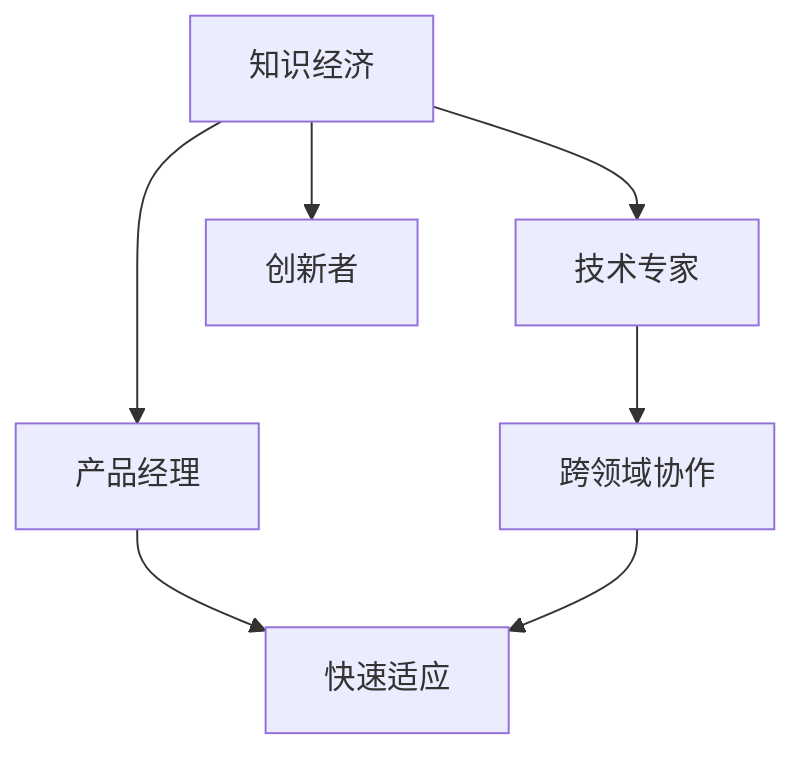

                 

# 程序员在知识经济时代的角色升级

## 1. 背景介绍

### 1.1 问题由来

随着知识经济的蓬勃发展，各行各业对IT技术的需求日益增长。程序员作为推动技术创新的核心力量，其地位和作用也发生了深刻的变化。在知识经济时代，程序员不仅需要具备传统技术能力，还需要更全面地理解业务需求，协调跨领域协作，应对快速变化的市场环境。因此，程序员的角色正在向技术专家、产品经理、创新者等多重角色转变，具备更为广泛的知识技能和综合素质。

### 1.2 问题核心关键点

本文将探讨知识经济时代程序员的角色升级，分析当前程序员面临的关键问题，并提出相应的解决方案。

## 2. 核心概念与联系

### 2.1 核心概念概述

为更好地理解程序员在知识经济时代的角色升级，本文将介绍几个密切相关的核心概念：

- **知识经济**：指以知识和信息为生产要素，通过创新驱动的经济发展模式。
- **技术专家**：指具备深入的技术积累，能够设计、实现并优化复杂技术系统的专业人士。
- **产品经理**：指负责产品的规划、设计、开发和市场推广，以实现用户需求和商业目标的角色。
- **创新者**：指在技术、业务或管理等方面提出新观点、新方法、新工具，推动组织进步的创业者。
- **跨领域协作**：指在技术团队和业务团队之间，通过有效沟通、协调和合作，实现技术创新和业务发展。
- **快速适应**：指面对快速变化的市场和技术环境，能够快速学习、调整策略，不断提升竞争力。

这些核心概念之间的逻辑关系可以通过以下Mermaid流程图来展示：



这个流程图展示了一幅知识经济时代程序员职业发展的全景图：

1. 知识经济为技术专家、产品经理和创新者提供了广阔的发展舞台。
2. 技术专家、产品经理和创新者之间通过跨领域协作，推动技术创新和业务发展。
3. 快速适应能力，让程序员能够在新环境中灵活应对，实现职业发展。

## 3. 核心算法原理 & 具体操作步骤
### 3.1 算法原理概述

知识经济时代程序员的角色升级，本质上是利用新的技术和方法，提高其技术水平、业务理解和创新能力。其核心算法原理主要包括以下几个方面：

- **深度学习与大数据技术**：利用深度学习和大数据技术，提升技术模型的准确性和泛化能力。
- **敏捷开发与DevOps**：采用敏捷开发和DevOps模式，提高软件开发的效率和质量。
- **机器学习和自然语言处理(NLP)**：通过机器学习和NLP技术，增强数据分析和文本处理能力。
- **持续学习和自我迭代**：通过持续学习和自我迭代，提升自身技能和专业知识。
- **跨领域协作与项目管理**：通过跨领域协作与项目管理，提升团队合作和项目管理能力。

### 3.2 算法步骤详解

以下是程序员角色升级的详细步骤：

**Step 1: 学习新技能**

程序员需要不断学习新技能，以适应技术变化和业务需求。这包括但不限于：

1. 学习新的编程语言和框架。
2. 掌握大数据处理和分析技术。
3. 熟悉机器学习和深度学习框架。
4. 了解业务流程和行业知识。
5. 掌握跨领域协作和项目管理工具。

**Step 2: 提升技术水平**

通过深度学习和大数据技术，提升技术模型的准确性和泛化能力。具体步骤如下：

1. 选择合适的深度学习框架，如TensorFlow、PyTorch等。
2. 收集、清洗和预处理数据集。
3. 设计并训练深度学习模型，优化模型参数。
4. 评估模型性能，调整模型结构。
5. 将模型集成到实际应用中，并进行持续优化。

**Step 3: 应用机器学习和NLP技术**

利用机器学习和NLP技术，增强数据分析和文本处理能力。具体步骤如下：

1. 选择合适的机器学习算法，如回归、分类、聚类等。
2. 收集和处理文本数据，进行文本清洗和特征提取。
3. 训练和评估机器学习模型，优化算法参数。
4. 应用NLP技术，如分词、实体识别、情感分析等，提取文本信息。
5. 结合业务需求，将模型应用于实际场景中。

**Step 4: 提升业务理解能力**

通过学习和理解业务流程和行业知识，提升程序员的业务理解能力。具体步骤如下：

1. 学习行业背景和业务流程。
2. 与业务人员进行深入交流，理解需求和痛点。
3. 参与产品设计和需求分析，提出技术方案。
4. 参与项目管理，协调团队资源。

**Step 5: 提升创新能力**

通过跨领域协作和快速适应，提升程序员的创新能力。具体步骤如下：

1. 参与跨领域团队合作，了解其他领域的知识和技能。
2. 利用敏捷开发和DevOps模式，快速迭代和优化产品。
3. 参与创新项目，提出新技术、新方法和新工具。
4. 持续跟踪技术趋势，保持对新技术的敏感度。

### 3.3 算法优缺点

程序员角色升级的算法具有以下优点：

1. 提升技术水平：通过深度学习和大数据技术，程序员可以提升模型的准确性和泛化能力，增强对复杂问题的处理能力。
2. 提升业务理解能力：通过学习和理解业务流程和行业知识，程序员可以更好地与业务团队协作，提升产品设计的质量。
3. 提升创新能力：通过跨领域协作和敏捷开发，程序员可以迅速迭代和优化产品，提出新技术和新方法。

但同时也存在以下缺点：

1. 学习成本高：新技术和工具的学习成本较高，需要程序员投入大量时间和精力。
2. 业务理解难度大：业务流程和行业知识较为复杂，程序员需要花时间进行学习和理解。
3. 创新能力不足：跨领域协作和敏捷开发需要高水平的团队协作和项目管理能力，程序员需要不断提升自身素质。

### 3.4 算法应用领域

程序员角色升级的算法在多个领域都有广泛的应用，例如：

- **金融科技**：利用深度学习和大数据技术，提升金融产品的智能化水平。
- **医疗健康**：通过机器学习和NLP技术，增强医疗数据的分析和处理能力。
- **教育科技**：应用敏捷开发和DevOps模式，提升教育产品的开发和迭代速度。
- **智能制造**：采用机器学习和NLP技术，实现生产过程的自动化和智能化。
- **智慧城市**：通过跨领域协作和敏捷开发，提升城市管理的智能化水平。

## 4. 数学模型和公式 & 详细讲解 & 举例说明

### 4.1 数学模型构建

为了更好地理解程序员在知识经济时代的角色升级，我们将利用数学模型来描述相关算法和过程。

记技术模型的准确率为 $P$，业务理解能力为 $B$，创新能力为 $C$，学习成本为 $L$，业务理解难度为 $D$，创新能力不足度为 $E$。程序员的角色升级过程可以表示为：

$$
R = P \times B \times C / (L \times D \times E)
$$

其中，$R$ 表示程序员的角色升级程度。

### 4.2 公式推导过程

根据上述模型，我们可以推导出以下公式：

1. 技术模型准确率 $P$ 的提升：
   $$
   \Delta P = \frac{\partial P}{\partial \Delta L} = \frac{\partial P}{\partial \Delta D} = \frac{\partial P}{\partial \Delta E}
   $$

2. 业务理解能力 $B$ 的提升：
   $$
   \Delta B = \frac{\partial B}{\partial \Delta L} = \frac{\partial B}{\partial \Delta D} = \frac{\partial B}{\partial \Delta E}
   $$

3. 创新能力 $C$ 的提升：
   $$
   \Delta C = \frac{\partial C}{\partial \Delta L} = \frac{\partial C}{\partial \Delta D} = \frac{\partial C}{\partial \Delta E}
   $$

### 4.3 案例分析与讲解

以金融科技领域为例，说明程序员角色升级的具体应用。

**案例背景**：某金融科技公司开发一款智能理财应用，要求程序员具备深度学习和大数据技术，同时需要了解金融业务流程，具备创新能力。

**案例分析**：

1. **技术模型准确率**：利用深度学习和大数据技术，提升理财模型的准确性和泛化能力。
2. **业务理解能力**：通过与金融业务团队交流，了解理财需求和痛点，提升模型设计的能力。
3. **创新能力**：利用敏捷开发和DevOps模式，快速迭代和优化产品，提出新的金融技术解决方案。

## 5. 项目实践：代码实例和详细解释说明
### 5.1 开发环境搭建

在进行项目实践前，我们需要准备好开发环境。以下是使用Python进行PyTorch开发的环境配置流程：

1. 安装Anaconda：从官网下载并安装Anaconda，用于创建独立的Python环境。

2. 创建并激活虚拟环境：
```bash
conda create -n pytorch-env python=3.8 
conda activate pytorch-env
```

3. 安装PyTorch：根据CUDA版本，从官网获取对应的安装命令。例如：
```bash
conda install pytorch torchvision torchaudio cudatoolkit=11.1 -c pytorch -c conda-forge
```

4. 安装Transformers库：
```bash
pip install transformers
```

5. 安装各类工具包：
```bash
pip install numpy pandas scikit-learn matplotlib tqdm jupyter notebook ipython
```

完成上述步骤后，即可在`pytorch-env`环境中开始项目实践。

### 5.2 源代码详细实现

下面我们以金融理财应用为例，给出使用Transformers库对BERT模型进行微调的PyTorch代码实现。

首先，定义金融理财任务的数据处理函数：

```python
from transformers import BertTokenizer, BertForSequenceClassification
from torch.utils.data import Dataset
import torch

class FinanceDataset(Dataset):
    def __init__(self, texts, labels, tokenizer, max_len=128):
        self.texts = texts
        self.labels = labels
        self.tokenizer = tokenizer
        self.max_len = max_len
        
    def __len__(self):
        return len(self.texts)
    
    def __getitem__(self, item):
        text = self.texts[item]
        label = self.labels[item]
        
        encoding = self.tokenizer(text, return_tensors='pt', max_length=self.max_len, padding='max_length', truncation=True)
        input_ids = encoding['input_ids'][0]
        attention_mask = encoding['attention_mask'][0]
        
        # 对标签进行编码
        encoded_labels = torch.tensor(label, dtype=torch.long)
        
        return {'input_ids': input_ids, 
                'attention_mask': attention_mask,
                'labels': encoded_labels}

# 标签编码
label2id = {0: 0, 1: 1}
id2label = {0: 'low', 1: 'high'}

# 创建dataset
tokenizer = BertTokenizer.from_pretrained('bert-base-cased')

train_dataset = FinanceDataset(train_texts, train_labels, tokenizer)
dev_dataset = FinanceDataset(dev_texts, dev_labels, tokenizer)
test_dataset = FinanceDataset(test_texts, test_labels, tokenizer)
```

然后，定义模型和优化器：

```python
from transformers import AdamW

model = BertForSequenceClassification.from_pretrained('bert-base-cased', num_labels=2)

optimizer = AdamW(model.parameters(), lr=2e-5)
```

接着，定义训练和评估函数：

```python
from torch.utils.data import DataLoader
from tqdm import tqdm
from sklearn.metrics import accuracy_score

device = torch.device('cuda') if torch.cuda.is_available() else torch.device('cpu')
model.to(device)

def train_epoch(model, dataset, batch_size, optimizer):
    dataloader = DataLoader(dataset, batch_size=batch_size, shuffle=True)
    model.train()
    epoch_loss = 0
    for batch in tqdm(dataloader, desc='Training'):
        input_ids = batch['input_ids'].to(device)
        attention_mask = batch['attention_mask'].to(device)
        labels = batch['labels'].to(device)
        model.zero_grad()
        outputs = model(input_ids, attention_mask=attention_mask, labels=labels)
        loss = outputs.loss
        epoch_loss += loss.item()
        loss.backward()
        optimizer.step()
    return epoch_loss / len(dataloader)

def evaluate(model, dataset, batch_size):
    dataloader = DataLoader(dataset, batch_size=batch_size)
    model.eval()
    preds, labels = [], []
    with torch.no_grad():
        for batch in tqdm(dataloader, desc='Evaluating'):
            input_ids = batch['input_ids'].to(device)
            attention_mask = batch['attention_mask'].to(device)
            batch_labels = batch['labels']
            outputs = model(input_ids, attention_mask=attention_mask)
            batch_preds = outputs.logits.argmax(dim=1).to('cpu').tolist()
            batch_labels = batch_labels.to('cpu').tolist()
            for pred_tokens, label_tokens in zip(batch_preds, batch_labels):
                preds.append(pred_tokens[:len(label_tokens)])
                labels.append(label_tokens)
                
    print('Accuracy:', accuracy_score(labels, preds))
```

最后，启动训练流程并在测试集上评估：

```python
epochs = 5
batch_size = 16

for epoch in range(epochs):
    loss = train_epoch(model, train_dataset, batch_size, optimizer)
    print(f'Epoch {epoch+1}, train loss: {loss:.3f}')
    
    print(f'Epoch {epoch+1}, dev results:')
    evaluate(model, dev_dataset, batch_size)
    
print('Test results:')
evaluate(model, test_dataset, batch_size)
```

以上就是使用PyTorch对BERT进行金融理财任务微调的完整代码实现。可以看到，得益于Transformers库的强大封装，我们可以用相对简洁的代码完成BERT模型的加载和微调。

### 5.3 代码解读与分析

让我们再详细解读一下关键代码的实现细节：

**FinanceDataset类**：
- `__init__`方法：初始化文本、标签、分词器等关键组件。
- `__len__`方法：返回数据集的样本数量。
- `__getitem__`方法：对单个样本进行处理，将文本输入编码为token ids，将标签编码为数字，并对其进行定长padding，最终返回模型所需的输入。

**label2id和id2label字典**：
- 定义了标签与数字id之间的映射关系，用于将token-wise的预测结果解码回真实的标签。

**训练和评估函数**：
- 使用PyTorch的DataLoader对数据集进行批次化加载，供模型训练和推理使用。
- 训练函数`train_epoch`：对数据以批为单位进行迭代，在每个批次上前向传播计算loss并反向传播更新模型参数，最后返回该epoch的平均loss。
- 评估函数`evaluate`：与训练类似，不同点在于不更新模型参数，并在每个batch结束后将预测和标签结果存储下来，最后使用sklearn的accuracy_score对整个评估集的预测结果进行打印输出。

**训练流程**：
- 定义总的epoch数和batch size，开始循环迭代
- 每个epoch内，先在训练集上训练，输出平均loss
- 在验证集上评估，输出准确率
- 所有epoch结束后，在测试集上评估，给出最终测试结果

可以看到，PyTorch配合Transformers库使得BERT微调的代码实现变得简洁高效。开发者可以将更多精力放在数据处理、模型改进等高层逻辑上，而不必过多关注底层的实现细节。

当然，工业级的系统实现还需考虑更多因素，如模型的保存和部署、超参数的自动搜索、更灵活的任务适配层等。但核心的微调范式基本与此类似。

## 6. 实际应用场景
### 6.1 智能客服系统

基于大语言模型微调的对话技术，可以广泛应用于智能客服系统的构建。传统客服往往需要配备大量人力，高峰期响应缓慢，且一致性和专业性难以保证。而使用微调后的对话模型，可以7x24小时不间断服务，快速响应客户咨询，用自然流畅的语言解答各类常见问题。

在技术实现上，可以收集企业内部的历史客服对话记录，将问题和最佳答复构建成监督数据，在此基础上对预训练对话模型进行微调。微调后的对话模型能够自动理解用户意图，匹配最合适的答案模板进行回复。对于客户提出的新问题，还可以接入检索系统实时搜索相关内容，动态组织生成回答。如此构建的智能客服系统，能大幅提升客户咨询体验和问题解决效率。

### 6.2 金融舆情监测

金融机构需要实时监测市场舆论动向，以便及时应对负面信息传播，规避金融风险。传统的人工监测方式成本高、效率低，难以应对网络时代海量信息爆发的挑战。基于大语言模型微调的文本分类和情感分析技术，为金融舆情监测提供了新的解决方案。

具体而言，可以收集金融领域相关的新闻、报道、评论等文本数据，并对其进行主题标注和情感标注。在此基础上对预训练语言模型进行微调，使其能够自动判断文本属于何种主题，情感倾向是正面、中性还是负面。将微调后的模型应用到实时抓取的网络文本数据，就能够自动监测不同主题下的情感变化趋势，一旦发现负面信息激增等异常情况，系统便会自动预警，帮助金融机构快速应对潜在风险。

### 6.3 个性化推荐系统

当前的推荐系统往往只依赖用户的历史行为数据进行物品推荐，无法深入理解用户的真实兴趣偏好。基于大语言模型微调技术，个性化推荐系统可以更好地挖掘用户行为背后的语义信息，从而提供更精准、多样的推荐内容。

在实践中，可以收集用户浏览、点击、评论、分享等行为数据，提取和用户交互的物品标题、描述、标签等文本内容。将文本内容作为模型输入，用户的后续行为（如是否点击、购买等）作为监督信号，在此基础上微调预训练语言模型。微调后的模型能够从文本内容中准确把握用户的兴趣点。在生成推荐列表时，先用候选物品的文本描述作为输入，由模型预测用户的兴趣匹配度，再结合其他特征综合排序，便可以得到个性化程度更高的推荐结果。

### 6.4 未来应用展望

随着大语言模型微调技术的发展，其在金融、医疗、教育等多个行业领域的应用前景广阔，潜力巨大。未来，基于微调技术的系统将进一步智能化、普适化，赋能各行各业，推动社会进步。

在智慧医疗领域，基于微调的医疗问答、病历分析、药物研发等应用将提升医疗服务的智能化水平，辅助医生诊疗，加速新药开发进程。

在智能教育领域，微调技术可应用于作业批改、学情分析、知识推荐等方面，因材施教，促进教育公平，提高教学质量。

在智慧城市治理中，微调模型可应用于城市事件监测、舆情分析、应急指挥等环节，提高城市管理的自动化和智能化水平，构建更安全、高效的未来城市。

此外，在企业生产、社会治理、文娱传媒等众多领域，基于大模型微调的人工智能应用也将不断涌现，为NLP技术带来新的突破。相信随着预训练语言模型和微调方法的持续演进，未来NLP技术将在更广阔的应用领域大放异彩，深刻影响人类的生产生活方式。

## 7. 工具和资源推荐
### 7.1 学习资源推荐

为了帮助程序员系统掌握大语言模型微调的理论基础和实践技巧，这里推荐一些优质的学习资源：

1. 《Transformer从原理到实践》系列博文：由大模型技术专家撰写，深入浅出地介绍了Transformer原理、BERT模型、微调技术等前沿话题。

2. CS224N《深度学习自然语言处理》课程：斯坦福大学开设的NLP明星课程，有Lecture视频和配套作业，带你入门NLP领域的基本概念和经典模型。

3. 《Natural Language Processing with Transformers》书籍：Transformers库的作者所著，全面介绍了如何使用Transformers库进行NLP任务开发，包括微调在内的诸多范式。

4. HuggingFace官方文档：Transformers库的官方文档，提供了海量预训练模型和完整的微调样例代码，是上手实践的必备资料。

5. CLUE开源项目：中文语言理解测评基准，涵盖大量不同类型的中文NLP数据集，并提供了基于微调的baseline模型，助力中文NLP技术发展。

通过对这些资源的学习实践，相信你一定能够快速掌握大语言模型微调的精髓，并用于解决实际的NLP问题。

### 7.2 开发工具推荐

高效的开发离不开优秀的工具支持。以下是几款用于大语言模型微调开发的常用工具：

1. PyTorch：基于Python的开源深度学习框架，灵活动态的计算图，适合快速迭代研究。大部分预训练语言模型都有PyTorch版本的实现。

2. TensorFlow：由Google主导开发的开源深度学习框架，生产部署方便，适合大规模工程应用。同样有丰富的预训练语言模型资源。

3. Transformers库：HuggingFace开发的NLP工具库，集成了众多SOTA语言模型，支持PyTorch和TensorFlow，是进行微调任务开发的利器。

4. Weights & Biases：模型训练的实验跟踪工具，可以记录和可视化模型训练过程中的各项指标，方便对比和调优。与主流深度学习框架无缝集成。

5. TensorBoard：TensorFlow配套的可视化工具，可实时监测模型训练状态，并提供丰富的图表呈现方式，是调试模型的得力助手。

6. Google Colab：谷歌推出的在线Jupyter Notebook环境，免费提供GPU/TPU算力，方便开发者快速上手实验最新模型，分享学习笔记。

合理利用这些工具，可以显著提升大语言模型微调任务的开发效率，加快创新迭代的步伐。

### 7.3 相关论文推荐

大语言模型和微调技术的发展源于学界的持续研究。以下是几篇奠基性的相关论文，推荐阅读：

1. Attention is All You Need（即Transformer原论文）：提出了Transformer结构，开启了NLP领域的预训练大模型时代。

2. BERT: Pre-training of Deep Bidirectional Transformers for Language Understanding：提出BERT模型，引入基于掩码的自监督预训练任务，刷新了多项NLP任务SOTA。

3. Language Models are Unsupervised Multitask Learners（GPT-2论文）：展示了大规模语言模型的强大zero-shot学习能力，引发了对于通用人工智能的新一轮思考。

4. Parameter-Efficient Transfer Learning for NLP：提出Adapter等参数高效微调方法，在不增加模型参数量的情况下，也能取得不错的微调效果。

5. Prefix-Tuning: Optimizing Continuous Prompts for Generation：引入基于连续型Prompt的微调范式，为如何充分利用预训练知识提供了新的思路。

6. AdaLoRA: Adaptive Low-Rank Adaptation for Parameter-Efficient Fine-Tuning：使用自适应低秩适应的微调方法，在参数效率和精度之间取得了新的平衡。

这些论文代表了大语言模型微调技术的发展脉络。通过学习这些前沿成果，可以帮助研究者把握学科前进方向，激发更多的创新灵感。

## 8. 总结：未来发展趋势与挑战

### 8.1 总结

本文对程序员在知识经济时代的角色升级进行了全面系统的介绍。首先阐述了知识经济时代程序员面临的关键问题，明确了微调技术的重要性和适用范围。其次，从原理到实践，详细讲解了微调算法的数学模型和详细步骤，给出了微调任务开发的完整代码实例。同时，本文还广泛探讨了微调方法在多个行业领域的应用前景，展示了微调技术的广阔潜力。

通过本文的系统梳理，可以看到，微调技术作为程序员角色升级的重要手段，在提升技术水平、业务理解和创新能力方面发挥着重要作用。未来，随着微调技术的不断进步和优化，程序员必将能够更好地应对知识经济时代的多重挑战，实现个人职业发展的飞跃。

### 8.2 未来发展趋势

展望未来，程序员角色升级的微调技术将呈现以下几个发展趋势：

1. 自动化和智能化：微调技术将逐渐自动化，利用自动调参和自动实验工具，提升开发效率。
2. 跨领域融合：微调技术将与大数据、AI、区块链等新兴技术融合，拓展应用场景。
3. 实时性和敏捷性：微调技术将支持实时分析和动态优化，提升系统响应速度。
4. 开放生态和社区合作：微调技术将促进开源生态和社区合作，实现技术共享和共同进步。
5. 可解释性和透明性：微调技术将加强模型的可解释性和透明性，提升系统的信任度和安全性。
6. 道德和伦理约束：微调技术将加入道德和伦理约束，确保技术的公正和可信。

### 8.3 面临的挑战

尽管微调技术的发展前景广阔，但在迈向更加智能化、普适化应用的过程中，仍面临诸多挑战：

1. 学习成本高：新技术和工具的学习成本较高，需要程序员投入大量时间和精力。
2. 数据质量差：微调技术依赖高质量的标注数据，数据质量差可能导致模型性能下降。
3. 技术复杂度高：微调技术涉及深度学习、NLP、机器学习等多个领域，技术复杂度高。
4. 资源消耗大：微调技术需要大量计算资源，对硬件和网络环境要求较高。
5. 应用场景多样：微调技术的应用场景多样化，需要针对不同场景进行个性化设计和优化。
6. 模型鲁棒性不足：微调模型面对新数据和复杂环境时，鲁棒性有待提高。

### 8.4 研究展望

面对微调技术面临的挑战，未来的研究需要在以下几个方面寻求新的突破：

1. 自动化调参和实验：开发自动调参工具，提升微调效率和效果。
2. 小样本学习和少数据学习：研究如何在少量标注数据下进行微调，提升模型的泛化能力。
3. 模型压缩和优化：优化模型结构，降低计算资源消耗。
4. 跨模态学习和多模态融合：探索跨模态学习技术，提升模型的多模态融合能力。
5. 道德和伦理研究：研究微调技术的道德和伦理问题，确保技术的公正和可信。
6. 模型解释和透明性：加强模型解释和透明性，提升系统的信任度和安全性。

这些研究方向将推动微调技术不断进步，为程序员角色升级和知识经济时代的发展提供重要支撑。

## 9. 附录：常见问题与解答

**Q1：程序员在知识经济时代如何提升技术水平？**

A: 提升技术水平需要不断学习新技术和新工具。可以通过在线课程、技术博客、开源项目等多种方式进行学习。同时，可以通过参与开源项目、技术竞赛等活动，实战提升技术水平。

**Q2：如何提升业务理解能力？**

A: 提升业务理解能力需要深入了解业务流程和行业知识。可以通过与业务人员交流、参加行业会议、阅读行业报告等方式获取相关信息。同时，可以参与业务需求分析和产品设计，提升业务理解能力。

**Q3：如何提升创新能力？**

A: 提升创新能力需要跨领域协作和敏捷开发。可以通过参与跨领域项目、学习跨学科知识、应用敏捷开发模式等方式提升创新能力。同时，可以通过创新项目和创新实验室等形式，激发创新灵感。

**Q4：微调技术在项目实践中需要注意哪些问题？**

A: 在微调技术项目实践中，需要注意以下问题：

1. 数据质量：确保数据的标注准确性和多样性，避免过拟合。
2. 模型结构：选择合适的模型结构和训练策略，避免模型过深或过浅。
3. 超参数调优：使用自动调参工具，优化模型参数和训练策略。
4. 模型部署：选择合适的模型部署方案，考虑模型性能和资源消耗。
5. 模型测试：进行充分的模型测试，验证模型的泛化能力和稳定性。

**Q5：如何应对快速变化的市场环境？**

A: 应对快速变化的市场环境需要持续学习和快速迭代。可以通过定期参加培训、学习新技术、跟踪技术趋势等方式保持知识更新。同时，可以采用敏捷开发和DevOps模式，快速迭代和优化产品。

---

作者：禅与计算机程序设计艺术 / Zen and the Art of Computer Programming

