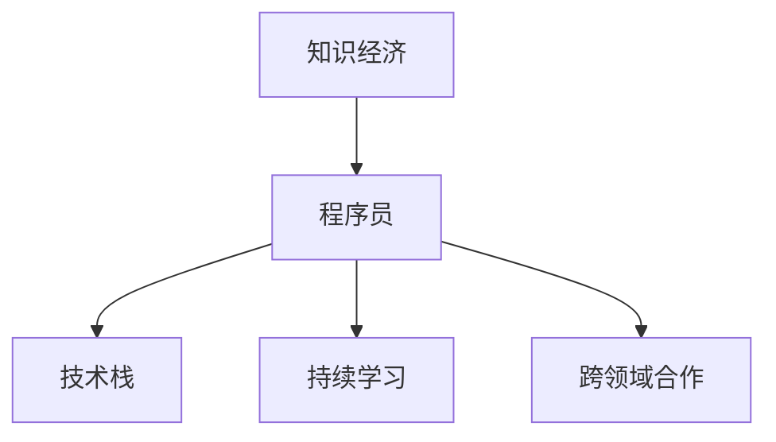

                 

# 程序员在知识经济时代的角色定位

> 关键词：知识经济、程序员角色、技术演进、技能提升、创新驱动、持续学习、跨领域合作

## 1. 背景介绍

### 1.1 问题由来
随着数字时代的到来，全球经济已经从传统的制造业和服务业，转向以知识为核心的知识经济模式。知识经济以信息、技术、创新为驱动力，对人才特别是高素质技术人才的需求日益增加。程序员作为推动知识经济发展的核心力量，其角色定位和职责范围也随之发生深刻变化。

### 1.2 问题核心关键点
当前程序员在知识经济时代的角色定位，不仅局限于传统的软件开发工作，更要求具备跨领域知识、创新能力和持续学习能力。技术栈的快速更新、新的编程范式和技术趋势层出不穷，程序员需要不断适应新环境，提升自身竞争力。

### 1.3 问题研究意义
理解程序员在知识经济时代的角色定位，对于提升技术人才的培养质量、推动技术创新、促进产业发展具有重要意义。明确角色定位，有助于程序员自我提升，适应知识经济的变革需求，同时也为教育机构和企业提供了参考依据。

## 2. 核心概念与联系

### 2.1 核心概念概述

为更好地理解程序员在知识经济时代的角色定位，本节将介绍几个密切相关的核心概念：

- 知识经济（Knowledge Economy）：以知识资源为基础，通过信息的生产、分配和应用，推动经济增长的新型经济模式。
- 程序员（Programmer）：专门从事软件开发、维护、测试等技术工作的人员。
- 技术栈（Technology Stack）：程序员在特定项目或应用场景下需要掌握的各类编程语言、框架和工具的总称。
- 持续学习（Continuous Learning）：程序员通过不断学习新技术、新知识，适应技术变化和市场需求的过程。
- 跨领域合作（Interdisciplinary Collaboration）：程序员与不同领域的专家合作，解决复杂问题，推动技术创新和应用。

这些核心概念之间的逻辑关系可以通过以下Mermaid流程图来展示：



这个流程图展示的核心概念及其之间的关系：

1. 知识经济为程序员提供发展的土壤和机会。
2. 技术栈是程序员工作的基础工具和环境。
3. 持续学习是程序员适应知识经济变化的关键。
4. 跨领域合作是程序员解决复杂问题的重要途径。

这些概念共同构成了程序员在知识经济时代的核心角色，使其能够更好地适应知识经济的需求。

## 3. 核心算法原理 & 具体操作步骤
### 3.1 算法原理概述

程序员在知识经济时代的角色定位，不仅局限于传统软件开发，还需要具备创新驱动、持续学习、跨领域合作等多重能力。其核心算法原理可以概括为以下几点：

- 创新驱动：利用新技术、新工具和新方法，提高软件产品和服务的创新性。
- 持续学习：不断获取新知识，提升技能，适应技术栈的变化。
- 跨领域合作：与其他领域专家合作，综合多学科知识，解决复杂问题。

### 3.2 算法步骤详解

基于上述算法原理，程序员在知识经济时代的角色定位可以通过以下步骤进行详细描述：

**Step 1: 理解知识经济的核心需求**

- 研究知识经济的发展趋势，识别出当前和未来的技术需求。
- 了解知识经济对技术人才的期望，明确编程技能和软技能的要求。

**Step 2: 选择合适的技术栈**

- 根据项目需求，选择合适的编程语言、框架和工具。
- 关注技术栈的最新动态，及时更新工具和环境，避免技术落伍。

**Step 3: 持续学习和技能提升**

- 定期参加技术培训、工作坊和会议，获取最新技术动态。
- 阅读技术书籍、研究论文，掌握深度学习、人工智能等前沿技术。
- 参与开源项目和社区活动，提升团队协作和沟通能力。

**Step 4: 跨领域合作**

- 与其他领域的专家合作，解决实际问题，推动技术创新。
- 运用跨学科的知识，优化解决方案，提升产品竞争力。
- 分享技术经验，参与跨领域合作项目，提升个人影响力。

### 3.3 算法优缺点

程序员在知识经济时代角色定位的优势包括：

- 创新驱动：新技术和工具的应用，可以带来更多创新点。
- 持续学习：不断提升技能，适应快速变化的技术环境。
- 跨领域合作：综合多学科知识，提升解决问题的深度和广度。

然而，也存在一些挑战：

- 知识更新速度快：需要投入大量时间和精力进行持续学习。
- 跨领域合作难度高：需要较强的沟通和协作能力。
- 技术栈多样性：需要掌握多种技术，增加了学习负担。

### 3.4 算法应用领域

程序员在知识经济时代的主要应用领域包括但不限于：

- 软件开发：利用新技术，开发高性能、高可用的软件产品。
- 数据科学：处理大数据，进行数据分析和机器学习。
- 人工智能：开发智能算法和模型，解决复杂问题。
- 云计算：提供云服务和解决方案，提升系统可扩展性。
- 移动开发：开发跨平台移动应用，满足用户需求。
- 区块链：开发区块链应用，推动去中心化技术发展。

## 4. 数学模型和公式 & 详细讲解 & 举例说明

### 4.1 数学模型构建

为了更好地理解程序员在知识经济时代的角色定位，我们可以构建一个数学模型，描述程序员的技能提升和应用过程。

假设程序员的技能水平为 $S$，知识经济的需求为 $D$，持续学习速度为 $L$，跨领域合作能力为 $C$。则模型可以表示为：

$$
S(t+1) = S(t) + L \times \text{学习效率} + C \times \text{合作收益}
$$

其中 $t$ 表示时间，$\text{学习效率}$ 和 $\text{合作收益}$ 为正影响因素。

### 4.2 公式推导过程

通过上述模型，我们可以推导出程序员技能提升的公式：

$$
S(t+1) = S(t) + L \times \text{学习效率} + C \times \text{合作收益}
$$

设 $\text{学习效率} = \text{学习时间} \times \text{学习成果}$，$\text{合作收益} = \text{合作成果} \times \text{成果系数}$。则公式可以进一步表示为：

$$
S(t+1) = S(t) + L \times (t \times \text{成果}) + C \times (\text{成果} \times \text{系数})
$$

这个公式表明，程序员的技能提升取决于持续学习和跨领域合作的效率和成果。

### 4.3 案例分析与讲解

假设某程序员在知识经济时代，技能初始水平为 $S_0$。经过 $t$ 时间的持续学习和跨领域合作，最终技能水平提升至 $S(t)$。如果每次学习的成果为 $G$，每次合作的成果为 $C_G$，则公式可以具体表示为：

$$
S(t) = S_0 + \sum_{i=1}^t [L \times i \times G + C \times C_G]
$$

例如，某程序员每周参加一次技术培训，每次培训后技能提升 $G$；同时，每月与不同领域的专家合作一次，每次合作提升 $C_G$。则技能提升过程可以表示为：

$$
S(t) = S_0 + 4tG + \sum_{k=1}^m C_G
$$

其中 $m$ 为 $t$ 月份数。通过这个案例，可以看到程序员技能提升的动态过程，以及持续学习和跨领域合作的重要性。

## 5. 项目实践：代码实例和详细解释说明

### 5.1 开发环境搭建

在进行程序员角色定位的实践时，首先需要搭建开发环境。以下是使用Python进行项目开发的常见环境配置流程：

1. 安装Anaconda：从官网下载并安装Anaconda，用于创建独立的Python环境。

2. 创建并激活虚拟环境：
```bash
conda create -n pytorch-env python=3.8 
conda activate pytorch-env
```

3. 安装PyTorch：根据CUDA版本，从官网获取对应的安装命令。例如：
```bash
conda install pytorch torchvision torchaudio cudatoolkit=11.1 -c pytorch -c conda-forge
```

4. 安装TensorFlow：
```bash
pip install tensorflow
```

5. 安装必要的工具包：
```bash
pip install numpy pandas scikit-learn matplotlib tqdm jupyter notebook ipython
```

完成上述步骤后，即可在`pytorch-env`环境中开始项目实践。

### 5.2 源代码详细实现

我们以开发一个简单的数据分析工具为例，展示程序员在知识经济时代的应用。

首先，定义数据分析工具的基本功能，包括数据读取、处理和分析等。

```python
import pandas as pd
import numpy as np

def read_data(file_path):
    data = pd.read_csv(file_path)
    return data

def clean_data(data):
    # 处理缺失值、异常值等
    return cleaned_data

def analyze_data(data):
    # 数据统计、可视化等
    return analysis_result
```

然后，通过持续学习和跨领域合作，不断优化和提升工具功能。

```python
# 持续学习：引入新的数据处理技术
def new_data_cleaning_method(data):
    # 使用新算法处理数据
    return new_cleaned_data

# 跨领域合作：引入外部专家知识
def expert_analysis(data):
    # 与数据科学专家合作，提升分析深度
    return expert_analysis_result
```

最后，将工具集成到实际应用中，进行实际数据分析。

```python
if __name__ == '__main__':
    file_path = 'data.csv'
    data = read_data(file_path)
    cleaned_data = clean_data(data)
    analysis_result = analyze_data(cleaned_data)
    print(analysis_result)
```

### 5.3 代码解读与分析

让我们再详细解读一下关键代码的实现细节：

**read_data函数**：
- `read_data`函数：用于读取CSV格式的数据文件，返回一个Pandas DataFrame对象。

**clean_data函数**：
- `clean_data`函数：用于清洗数据，包括处理缺失值、异常值、重复值等，确保数据质量。

**analyze_data函数**：
- `analyze_data`函数：用于对数据进行统计分析、可视化等，生成分析结果。

**new_data_cleaning_method函数**：
- `new_data_cleaning_method`函数：引入新的数据处理算法，提升数据清洗效率和质量。

**expert_analysis函数**：
- `expert_analysis`函数：与数据科学专家合作，利用专业知识提升数据分析的深度和精度。

通过这些函数，展示了程序员在知识经济时代的角色定位：通过持续学习和跨领域合作，不断提升工具功能和数据分析能力，满足知识经济的需求。

## 6. 实际应用场景

### 6.1 数据科学

数据科学是大语言模型在知识经济时代的重要应用领域之一。数据科学家利用机器学习算法和大规模数据，发现数据中的模式和规律，支持业务决策和战略规划。

程序员可以通过编写数据分析工具和应用，提升数据处理和分析效率。例如，编写数据清洗、特征工程、模型训练等自动化脚本，减少人工干预，提高工作效率。同时，利用跨领域合作，引入更多学科知识，提升数据分析的深度和精度。

### 6.2 人工智能

人工智能是大语言模型在知识经济时代的另一重要应用领域。AI技术通过模拟人类智能，提升系统自动化和智能化水平，解决复杂问题。

程序员可以通过编写AI算法和模型，提升系统的智能水平。例如，编写深度学习模型、强化学习算法、自然语言处理等AI应用，实现自动化、智能化功能。同时，利用跨领域合作，引入AI相关的学科知识，提升AI应用的实际效果。

### 6.3 物联网

物联网是大语言模型在知识经济时代的又一重要应用领域。物联网通过连接万物，实现设备互联和数据共享，提升智能生产和智慧城市水平。

程序员可以通过编写物联网应用，提升设备管理和数据处理能力。例如，编写设备监控、数据采集、网络传输等应用，实现设备自动化管理和数据分析。同时，利用跨领域合作，引入物联网相关的学科知识，提升物联网应用的系统效率和安全性。

### 6.4 未来应用展望

随着技术的发展，大语言模型在知识经济时代的应用场景将更加广泛。未来，程序员的角色将更加多样化，涵盖软件开发、数据科学、人工智能、物联网等多个领域。

知识经济的发展也将推动技术的不断进步，程序员需要不断学习新技术、新方法，适应快速变化的环境。例如，随着区块链、量子计算、边缘计算等新技术的发展，程序员需要掌握这些技术，提升其应用能力。

## 7. 工具和资源推荐

### 7.1 学习资源推荐

为了帮助程序员提升技能，适应知识经济的发展需求，这里推荐一些优质的学习资源：

1. Coursera：提供多种编程、数据科学和人工智能课程，涵盖从入门到高级的内容，适合不同层次的程序员。

2. Udacity：提供项目导向的编程和数据科学课程，帮助程序员掌握实际应用技能。

3. edX：提供全球顶尖大学的在线课程，涵盖计算机科学、人工智能、数据科学等多个领域，适合深入学习和研究。

4. Kaggle：提供丰富的数据集和机器学习竞赛，帮助程序员提升数据处理和算法优化能力。

5. GitHub：提供全球最大的开源代码库，程序员可以通过学习开源项目，提升编程技能和团队协作能力。

通过这些资源的学习实践，相信程序员能够更好地掌握新技术、新方法，提升自身竞争力。

### 7.2 开发工具推荐

高效的开发离不开优秀的工具支持。以下是几款用于程序员技能提升和项目开发的常用工具：

1. Visual Studio Code：轻量级、高度可配置的代码编辑器，支持多种编程语言和插件扩展。

2. Git和GitHub：版本控制和代码托管平台，帮助程序员管理代码版本，协作开发。

3. Docker和Kubernetes：容器化技术，方便程序员部署和管理应用程序，提升系统可扩展性和可移植性。

4. Jupyter Notebook：交互式编程和数据分析工具，支持代码执行、数据可视化和文档记录。

5. Anaconda：数据科学和机器学习环境的集成工具，提供多种科学计算库和工具。

合理利用这些工具，可以显著提升程序员的工作效率和项目开发质量。

### 7.3 相关论文推荐

大语言模型在知识经济时代的应用不断发展，相关的研究论文也不断涌现。以下是几篇奠基性的相关论文，推荐阅读：

1. "Deep Learning" by Ian Goodfellow, Yoshua Bengio, and Aaron Courville：介绍深度学习的基本原理和应用，涵盖神经网络、优化算法等内容。

2. "Hands-On Machine Learning with Scikit-Learn, Keras, and TensorFlow" by Aurélien Géron：介绍机器学习和深度学习的实战应用，结合Scikit-Learn、Keras和TensorFlow工具，适合快速上手。

3. "Programming Pearls" by Jon Bentley：介绍程序员在软件开发中遇到的各种问题，并提供解决方案，适合提升编程技能。

4. "Deep Reinforcement Learning in Computer Science and Engineering" by Mohammad Ghavamzadeh：介绍强化学习在大规模系统中的应用，涵盖算法和实际案例。

5. "The Second Machine Age" by Erik Brynjolfsson and Andrew McAfee：介绍技术进步对经济社会的影响，帮助程序员理解技术发展的宏观背景。

这些论文代表了大语言模型在知识经济时代的应用发展脉络。通过学习这些前沿成果，可以帮助程序员把握学科前进方向，激发更多的创新灵感。

## 8. 总结：未来发展趋势与挑战

### 8.1 总结

本文对程序员在知识经济时代的角色定位进行了全面系统的介绍。首先阐述了知识经济对技术人才的需求，明确了程序员在知识经济时代的多重角色。其次，从原理到实践，详细讲解了程序员技能提升和跨领域合作的算法原理和操作步骤，给出了项目实践的代码实例。同时，本文还广泛探讨了程序员在知识经济时代的应用场景和未来发展趋势，展示了程序员的广阔前景和重要作用。

通过本文的系统梳理，可以看到，程序员在知识经济时代不仅需要掌握传统的软件开发技能，还需要具备持续学习、跨领域合作和创新驱动的多重能力。只有不断提升自己的技能，适应快速变化的环境，才能在知识经济的浪潮中占据优势，实现个人和组织的持续发展。

### 8.2 未来发展趋势

展望未来，程序员在知识经济时代的角色定位将呈现以下几个发展趋势：

1. 技术栈多样化：随着新技术的不断涌现，程序员需要掌握多种技术栈，提升技术多样性。

2. 持续学习常态化：技术栈的快速更新和变化要求程序员不断学习和更新知识，保持技能竞争力。

3. 跨领域合作广泛化：跨学科知识的融合将带来更多创新点，程序员需要积极参与跨领域合作，提升综合能力。

4. 人工智能普及化：AI技术的应用将越来越广泛，程序员需要掌握AI算法和工具，提升智能应用能力。

5. 物联网深入化：物联网技术的应用将更加深入，程序员需要掌握物联网设备和系统的管理技能。

6. 区块链发展化：区块链技术的应用将不断扩大，程序员需要掌握区块链开发和应用技能。

以上趋势凸显了程序员在知识经济时代的广阔前景。这些方向的探索发展，必将进一步提升程序员的竞争力，推动知识经济技术的全面发展。

### 8.3 面临的挑战

尽管程序员在知识经济时代的发展前景广阔，但在迈向更加智能化、普适化应用的过程中，也面临诸多挑战：

1. 技术栈更新快：新的编程语言、框架和工具层出不穷，程序员需要不断学习，跟上技术发展。

2. 知识更新量大：知识经济要求程序员掌握更多学科知识，增加了学习负担。

3. 跨领域合作复杂：不同领域的专业知识差异大，需要较强的沟通和协作能力。

4. 持续学习压力大：需要投入大量时间和精力进行持续学习，容易导致疲劳和焦虑。

5. 技能提升难度高：跨领域合作和复杂项目开发要求程序员具备高水平的技能，难以短期内达到。

6. 新技术适应慢：新出现的技术可能与现有技能体系不兼容，需要重新学习和适应。

这些挑战需要程序员不断提升自身能力和团队协作能力，才能在知识经济的浪潮中保持竞争力。

### 8.4 研究展望

面对程序员在知识经济时代面临的挑战，未来的研究需要在以下几个方面寻求新的突破：

1. 多领域技术融合：研究如何将不同领域的知识和技术进行有效融合，提升跨领域合作的效果。

2. 智能辅助学习：开发智能学习工具，帮助程序员高效学习和提升技能。

3. 自动化编程工具：开发自动化编程工具，减少重复性劳动，提升编程效率。

4. 持续学习平台：构建持续学习平台，提供定制化的学习资源和指导。

5. 跨学科知识图谱：构建跨学科知识图谱，帮助程序员快速获取相关知识。

6. 新型编程范式：探索新型编程范式和技术架构，提升系统可扩展性和可维护性。

这些研究方向将进一步推动程序员在知识经济时代的进步，提升技术创新的能力和效率。总之，程序员需要不断提升自身技能，积极适应知识经济的需求，才能在未来的发展中占据优势。

## 9. 附录：常见问题与解答

**Q1：程序员需要具备哪些技能？**

A: 程序员需要具备以下技能：
1. 编程技能：熟练掌握多种编程语言和技术栈，如Python、Java、C++等。
2. 数据处理能力：掌握数据采集、清洗、分析等技术，能高效处理大规模数据。
3. 机器学习知识：掌握深度学习、强化学习、自然语言处理等AI技术。
4. 跨领域合作能力：具备沟通、协作和团队合作能力，能与不同领域的专家合作解决问题。
5. 持续学习能力：具备快速学习和掌握新技能的能力，适应技术发展的快速变化。

**Q2：程序员如何提升技能？**

A: 程序员可以通过以下方式提升技能：
1. 持续学习：通过在线课程、书籍、论文等学习新知识，保持技能竞争力。
2. 实践项目：通过实际项目开发，提升编程能力和实际应用能力。
3. 跨领域合作：与其他领域的专家合作，学习不同领域的知识和技术。
4. 技术交流：参加技术会议、研讨会等，了解行业动态和最新技术。
5. 开源贡献：参与开源项目，提升编程技能和团队协作能力。

**Q3：程序员在知识经济时代面临哪些挑战？**

A: 程序员在知识经济时代面临以下挑战：
1. 技术栈更新快：新的编程语言、框架和工具层出不穷，需要不断学习。
2. 知识更新量大：需要掌握更多学科知识，增加了学习负担。
3. 跨领域合作复杂：需要较强的沟通和协作能力。
4. 持续学习压力大：需要投入大量时间和精力进行持续学习。
5. 技能提升难度高：跨领域合作和复杂项目开发要求程序员具备高水平的技能。
6. 新技术适应慢：新出现的技术可能与现有技能体系不兼容，需要重新学习和适应。

**Q4：程序员如何应对知识经济时代的挑战？**

A: 程序员可以采取以下措施应对知识经济时代的挑战：
1. 学习新技术：通过持续学习，掌握新技术和工具，提升技能水平。
2. 跨领域合作：积极参与跨领域合作，学习和借鉴其他领域的知识和经验。
3. 自我管理：合理安排学习和工作时间，避免过度疲劳和焦虑。
4. 团队协作：加强团队协作，分工明确，提高工作效率。
5. 技术交流：参加技术会议、研讨会等，了解行业动态和最新技术。

**Q5：程序员在知识经济时代的未来发展方向是什么？**

A: 程序员在知识经济时代的未来发展方向包括：
1. 技术栈多样化：掌握多种技术栈，提升技术多样性。
2. 持续学习常态化：不断学习和更新知识，保持技能竞争力。
3. 跨领域合作广泛化：跨学科知识的融合将带来更多创新点。
4. 人工智能普及化：掌握AI算法和工具，提升智能应用能力。
5. 物联网深入化：掌握物联网设备和系统的管理技能。
6. 区块链发展化：掌握区块链开发和应用技能。

通过这些措施和方向，程序员可以在知识经济时代不断提升自身能力和竞争力，实现个人和组织的持续发展。

---

作者：禅与计算机程序设计艺术 / Zen and the Art of Computer Programming

