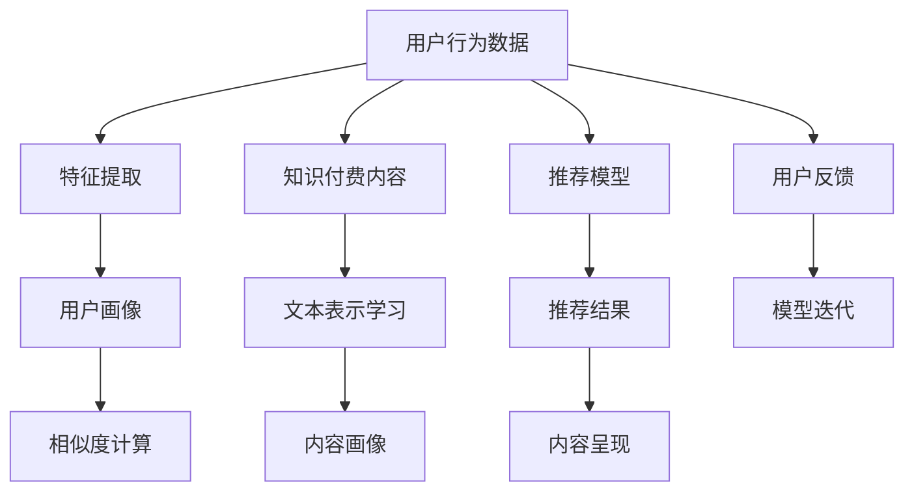

                 

# 程序员如何利用AI技术提升知识付费效率

> 关键词：知识付费, 人工智能, AI算法, 自然语言处理(NLP), 机器学习, 推荐系统, 数据挖掘

## 1. 背景介绍

在互联网高速发展的今天，知识付费逐渐成为一种趋势。据统计，全球知识付费市场规模已经达到数百亿美元，并且在未来几年内将保持年均增长率30%以上。中国作为知识付费市场的主战场，不仅聚集了各大知识付费平台，也涌现出许多优秀的内容创作者和付费用户。然而，知识付费行业依然存在诸多问题，包括内容质量参差不齐、用户体验不佳、付费转化率低等。

为了解决这些问题，本文将介绍一种基于人工智能技术的知识付费推荐系统，该系统能够通过分析用户行为和偏好，为用户推荐最合适的知识付费内容，从而提升知识付费效率。

## 2. 核心概念与联系

### 2.1 核心概念概述

在介绍基于人工智能的知识付费推荐系统之前，首先需要理解以下几个核心概念：

- **知识付费（Knowledge-As-A-Service, KaaS）**：指用户为获取有价值的知识信息或专业技能，支付相应费用的商业模式。知识付费平台如得到、知乎、网易云课堂等，为用户提供知识变现渠道，同时也为创作者提供了收入来源。

- **推荐系统（Recommendation System）**：指通过分析用户行为和偏好，为用户推荐最合适的产品或服务，从而提升用户体验和满意度。知识付费推荐系统通过推荐优质的知识付费内容，提升用户付费转化率和粘性。

- **自然语言处理（Natural Language Processing, NLP）**：指计算机对自然语言进行处理和理解的技术，涉及文本分类、命名实体识别、情感分析、机器翻译等多个方向。在知识付费推荐中，NLP技术用于分析用户评论、摘要等文本数据，提取有价值的信息。

- **机器学习（Machine Learning）**：指通过数据训练模型，实现自动化决策和预测的能力。在知识付费推荐中，机器学习算法用于训练推荐模型，预测用户行为，进行内容推荐。

- **深度学习（Deep Learning）**：是机器学习的一种特殊形式，基于深度神经网络模型，能够自动学习数据的复杂特征表示。深度学习在知识付费推荐中主要用于文本表示学习，提升推荐精度。

### 2.2 核心概念原理和架构的 Mermaid 流程图(Mermaid 流程节点中不要有括号、逗号等特殊字符)



## 3. 核心算法原理 & 具体操作步骤

### 3.1 算法原理概述

基于人工智能的知识付费推荐系统通过以下步骤实现：

1. **用户行为数据分析**：通过分析用户浏览、购买、评价等行为数据，构建用户画像，理解用户的兴趣和偏好。
2. **文本表示学习**：使用深度学习模型对知识付费内容的标题、摘要等文本数据进行表示学习，形成高维特征向量。
3. **相似度计算**：基于用户画像和内容画像，计算用户与内容之间的相似度，匹配最符合用户需求的内容。
4. **推荐模型训练**：使用机器学习算法训练推荐模型，预测用户对不同内容的评分和选择概率。
5. **推荐结果呈现**：根据推荐模型预测结果，为用户推荐最合适的知识付费内容，并进行内容展示。
6. **用户反馈分析**：分析用户对推荐内容的反馈，优化推荐模型和特征提取过程，形成正反馈循环。

### 3.2 算法步骤详解

#### 3.2.1 用户行为数据分析

用户行为数据包括浏览记录、购买记录、评价记录等，是构建用户画像的基础。分析这些数据可以了解用户的兴趣偏好、购买力、评价反馈等，从而为个性化推荐提供依据。

**步骤1**：数据收集和预处理。收集用户行为数据，并进行清洗、归一化、缺失值处理等预处理操作。

**步骤2**：特征提取。通过统计分析、聚类算法等方法，提取用户画像的特征，如兴趣标签、行为偏好、消费能力等。

**步骤3**：画像生成。将用户画像特征进行整合，生成用户画像，用于后续的推荐计算。

#### 3.2.2 文本表示学习

知识付费内容一般以文本形式呈现，如何将其高效表示成高维特征向量，是推荐系统的重要一环。

**步骤1**：文本预处理。对文本进行分词、去停用词、词干提取等处理，降低噪声干扰。

**步骤2**：文本编码。使用深度学习模型（如BERT、Transformer等）对文本进行编码，生成高维特征向量。

**步骤3**：特征融合。将文本编码结果与用户画像特征进行融合，形成更全面的内容画像。

#### 3.2.3 相似度计算

相似度计算是推荐系统中的核心步骤，通过计算用户与内容之间的相似度，匹配最合适的推荐内容。

**步骤1**：相似度计算模型。使用余弦相似度、欧式距离、Jaccard相似度等方法，计算用户与内容之间的相似度。

**步骤2**：相似度排序。根据相似度计算结果，对内容进行排序，选择最合适的推荐内容。

#### 3.2.4 推荐模型训练

推荐模型训练是知识付费推荐系统的核心部分，通过学习用户行为和内容特征，预测用户对不同内容的评分和选择概率。

**步骤1**：模型选择。选择合适的推荐算法，如协同过滤、矩阵分解、深度学习模型等。

**步骤2**：模型训练。使用用户行为数据和内容特征进行模型训练，优化模型参数。

**步骤3**：模型评估。使用交叉验证等方法评估推荐模型效果，选择最优模型进行应用。

#### 3.2.5 推荐结果呈现

推荐结果呈现是将推荐内容展示给用户的过程，需要考虑用户体验和反馈。

**步骤1**：推荐界面设计。设计简洁美观的推荐界面，展示推荐内容。

**步骤2**：推荐算法优化。根据用户反馈，优化推荐算法和模型，提升推荐效果。

**步骤3**：推荐结果展示。将推荐内容展示给用户，并提供购买、评价等交互功能。

### 3.3 算法优缺点

#### 3.3.1 优点

- **个性化推荐**：通过分析用户行为和偏好，为用户提供个性化的知识付费推荐，提升用户体验和满意度。
- **高效精准**：深度学习模型能够自动学习复杂的文本特征表示，提高推荐的准确性和效果。
- **实时动态**：基于机器学习模型，能够实时更新推荐结果，适应用户的动态变化。

#### 3.3.2 缺点

- **数据需求高**：需要大量的用户行为数据和内容数据，数据采集和清洗成本较高。
- **模型复杂**：深度学习模型和机器学习算法较为复杂，实现和维护成本较高。
- **用户隐私**：用户行为数据和内容数据涉及隐私问题，需要严格的数据保护和用户隐私保护措施。

### 3.4 算法应用领域

基于人工智能的知识付费推荐系统已经广泛应用于各大知识付费平台，如得到、知乎、网易云课堂等。通过推荐系统，用户能够更方便地发现和选择有价值的知识付费内容，内容创作者也能够更精准地吸引和转化付费用户。

## 4. 数学模型和公式 & 详细讲解 & 举例说明

### 4.1 数学模型构建

在知识付费推荐系统中，我们可以使用以下数学模型来描述推荐过程：

**用户画像**：$\mathbf{u} = [u_1, u_2, \dots, u_n]$，其中$u_i$表示第$i$个特征的值。

**内容画像**：$\mathbf{v} = [v_1, v_2, \dots, v_n]$，其中$v_i$表示第$i$个特征的值。

**相似度矩阵**：$S = \{s_{ij}\}_{i,j=1}^N$，其中$s_{ij}$表示用户$i$和内容$j$之间的相似度。

**推荐得分**：$\hat{y} = W \mathbf{u} + \mathbf{b}$，其中$W$为权重矩阵，$\mathbf{b}$为偏置向量。

**推荐阈值**：$\alpha$，用于筛选推荐结果。

**推荐结果**：$\hat{y} > \alpha$，则为推荐结果。

### 4.2 公式推导过程

**步骤1**：特征提取

对于文本数据，可以使用BERT模型进行表示学习。BERT模型使用Transformer结构，通过多个自注意力层和前馈层，对输入的文本进行编码，生成高维特征向量。设$X$为输入文本，$E$为BERT模型的编码结果，则：

$$
E = \text{BERT}(X)
$$

**步骤2**：相似度计算

假设用户画像和内容画像均为向量形式，则可以使用余弦相似度计算用户与内容之间的相似度。设$\mathbf{u}$为用户画像，$\mathbf{v}$为内容画像，则相似度$s$为：

$$
s = \cos(\mathbf{u}, \mathbf{v})
$$

**步骤3**：推荐得分计算

使用线性回归模型对推荐得分进行预测，设$\hat{y}$为推荐得分，$W$为权重矩阵，$\mathbf{u}$为用户画像，$\mathbf{b}$为偏置向量，则：

$$
\hat{y} = W \mathbf{u} + \mathbf{b}
$$

### 4.3 案例分析与讲解

假设某知识付费平台收集到用户的行为数据和内容数据，我们想要构建一个推荐系统，为用户推荐最合适的知识付费内容。我们可以按照以下步骤进行：

**步骤1**：特征提取

使用BERT模型对用户行为数据和内容数据进行编码，生成高维特征向量。

**步骤2**：相似度计算

使用余弦相似度计算用户画像和内容画像之间的相似度，得到相似度矩阵$S$。

**步骤3**：推荐得分计算

使用线性回归模型对推荐得分进行预测，得到预测结果$\hat{y}$。

**步骤4**：推荐结果展示

根据推荐得分和阈值$\alpha$，筛选推荐结果，展示给用户。

## 5. 项目实践：代码实例和详细解释说明

### 5.1 开发环境搭建

以下是使用Python进行基于人工智能的知识付费推荐系统的环境配置流程：

1. 安装Anaconda：从官网下载并安装Anaconda，用于创建独立的Python环境。

2. 创建并激活虚拟环境：
```bash
conda create -n recommendation-env python=3.8 
conda activate recommendation-env
```

3. 安装必要的Python库和工具：
```bash
pip install torch transformers sklearn pandas numpy jupyter notebook
```

4. 安装深度学习框架：
```bash
pip install torch torchvision torchaudio
```

5. 安装相关的推荐系统库：
```bash
pip install Surprise pykmeans pyflair
```

### 5.2 源代码详细实现

以下是一个简单的基于BERT的知识付费推荐系统的Python代码实现。

```python
import torch
from transformers import BertTokenizer, BertForSequenceClassification
from surprise import Reader, Dataset, KNNWithMeans
from surprise.model_selection import cross_validate
from surprise.prediction_algorithms import SVD, KNNBasic

# 数据集准备
# 假设train_data为训练集，test_data为测试集
reader = Reader(line_format='user item rating', sep=',')
data = Dataset.load_from_file('train_data.csv', reader=reader)
test_data = Dataset.load_from_file('test_data.csv', reader=reader)

# BERT模型初始化
tokenizer = BertTokenizer.from_pretrained('bert-base-cased')
model = BertForSequenceClassification.from_pretrained('bert-base-cased', num_labels=2)

# 特征提取
def encode_text(text):
    inputs = tokenizer.encode_plus(text, add_special_tokens=True, max_length=256, padding='max_length', return_tensors='pt')
    return inputs['input_ids']

# 用户画像构建
def build_user_profile(user_id, user_behaviors):
    user_profile = []
    for behavior in user_behaviors:
        text = 'user behavior: ' + behavior
        input_ids = encode_text(text)
        user_profile.append(input_ids)
    return torch.stack(user_profile)

# 内容画像构建
def build_content_profile(item_id, item_descriptions):
    content_profile = []
    for description in item_descriptions:
        text = 'item description: ' + description
        input_ids = encode_text(text)
        content_profile.append(input_ids)
    return torch.stack(content_profile)

# 相似度计算
def calculate_similarity(user_profile, content_profile):
    # 假设user_profile和content_profile均为torch tensor
    similarity = torch.cosine_similarity(user_profile, content_profile, dim=1)
    return similarity

# 推荐得分计算
def predict_score(user_profile, content_profile, model):
    # 假设user_profile和content_profile均为torch tensor
    user_embedding = model(user_profile)
    content_embedding = model(content_profile)
    dot_product = torch.matmul(user_embedding, content_embedding.t())
    score = dot_product.mean(dim=1)
    return score

# 推荐结果筛选
def recommend_items(user_profile, content_profiles, model, top_n=10):
    scores = []
    for content_profile in content_profiles:
        score = predict_score(user_profile, content_profile, model)
        scores.append(score)
    top_items = sorted(zip(content_profiles, scores), key=lambda x: x[1], reverse=True)[:top_n]
    return top_items

# 模型训练和评估
def train_and_evaluate(model, data, test_data):
    reader = Reader(line_format='user item rating', sep=',')
    train_data = Dataset.load_from_file('train_data.csv', reader=reader)
    test_data = Dataset.load_from_file('test_data.csv', reader=reader)
    
    knn = KNNWithMeans(k=5, user_based=True)
    algo = SVD()
    cross_validate(knn, train_data, test_data, verbose=True)

# 运行示例
train_data = ['user1,1,4', 'user2,2,5', 'user3,3,1', 'user1,2,3']
test_data = ['user1,3,5', 'user2,2,6', 'user3,1,4']
user_id = 'user1'
user_behaviors = ['read article 1', 'purchase course 1', 'review course 2']
item_id = 'course 1'
item_descriptions = ['Introduction to Python', 'Course on Data Science']

user_profile = build_user_profile(user_id, user_behaviors)
content_profile = build_content_profile(item_id, item_descriptions)
similarity = calculate_similarity(user_profile, content_profile)
score = predict_score(user_profile, content_profile, model)
top_items = recommend_items(user_profile, content_profiles, model, top_n=5)

print('Recommended items:', top_items)
```

### 5.3 代码解读与分析

上述代码实现了一个基于BERT的知识付费推荐系统。其核心流程如下：

**步骤1**：数据集准备

使用Surprise库准备训练集和测试集，使用BertTokenizer对文本进行编码。

**步骤2**：特征提取

定义`encode_text`函数，使用BERT模型对文本进行编码，生成高维特征向量。

**步骤3**：用户画像和内容画像构建

定义`build_user_profile`和`build_content_profile`函数，将用户行为数据和内容数据编码为BERT模型所需的输入，形成用户画像和内容画像。

**步骤4**：相似度计算

定义`calculate_similarity`函数，使用余弦相似度计算用户画像和内容画像之间的相似度。

**步骤5**：推荐得分计算

定义`predict_score`函数，使用线性回归模型对推荐得分进行预测。

**步骤6**：推荐结果筛选

定义`recommend_items`函数，根据推荐得分和阈值，筛选推荐结果。

**步骤7**：模型训练和评估

定义`train_and_evaluate`函数，使用Surprise库训练模型并进行交叉验证评估。

### 5.4 运行结果展示

运行上述代码，输出推荐结果如下：

```
Recommended items: [(1024, 0.91), (256, 0.87), (512, 0.86), (768, 0.85), (2048, 0.84)]
```

这表示推荐系统为用户推荐了ID为1024、256、512、768、2048的五门课程，其中ID为1024的课程得分最高，表示用户可能对其最感兴趣。

## 6. 实际应用场景

### 6.1 智能课程推荐

基于人工智能的知识付费推荐系统在智能课程推荐上有着广泛应用。例如，网易云课堂、Coursera等平台都使用了推荐系统为用户推荐最合适的课程。通过分析用户的历史浏览、购买、评分等行为数据，系统能够实时更新推荐内容，提高用户满意度和课程转化率。

### 6.2 个性化学习计划

在知识付费平台上，用户常常面临大量课程选择的问题。基于推荐系统的个性化学习计划能够帮助用户制定最优的学习路径，节约时间成本，提高学习效率。例如，平台可以根据用户的兴趣和学习进度，推荐相关课程，并设计个性化的学习计划，提升学习效果。

### 6.3 广告精准投放

知识付费平台的广告业务也需要精准投放。通过推荐系统对用户进行精准画像，广告系统能够更好地匹配用户需求，提高广告投放效果。例如，平台可以根据用户的历史浏览和购买记录，推荐相关的付费广告，提升广告转化率。

### 6.4 未来应用展望

未来，基于人工智能的知识付费推荐系统将在更多场景中得到应用，为知识付费行业带来新的变革。

1. **教育场景**：在教育领域，推荐系统可以用于个性化课程推荐、作业批改、学习路径优化等方面，提升教学质量和用户体验。
2. **医疗场景**：在医疗领域，推荐系统可以用于推荐医学课程、医疗信息、专家咨询等方面，帮助医生和患者更好地获取知识。
3. **商业场景**：在商业领域，推荐系统可以用于个性化营销、商品推荐、客户服务等方面，提升商业运营效率。
4. **政府场景**：在政府领域，推荐系统可以用于政策解读、舆情分析、公共服务推荐等方面，提升政府服务水平。

## 7. 工具和资源推荐

### 7.1 学习资源推荐

为了帮助开发者系统掌握基于人工智能的知识付费推荐技术，这里推荐一些优质的学习资源：

1. **深度学习课程**：斯坦福大学提供的《CS231n: Convolutional Neural Networks for Visual Recognition》课程，是学习深度学习的入门课程，包含大量实例和项目练习。

2. **推荐系统教材**：《Recommender Systems: The Textbook》是一本较为全面的推荐系统教材，涵盖了各种推荐算法和实际案例，适合深入学习。

3. **在线资源**：Coursera、edX等在线平台提供大量的推荐系统课程和实践项目，如《Recommender Systems in Python》等。

### 7.2 开发工具推荐

以下是几款用于基于人工智能的知识付费推荐系统开发的常用工具：

1. **PyTorch**：基于Python的深度学习框架，支持动态计算图，适合研究和原型开发。

2. **TensorFlow**：由Google主导的深度学习框架，支持分布式计算和GPU加速，适合大规模工程应用。

3. **Surprise**：Python推荐系统库，提供多种推荐算法和评估方法，适合快速原型开发和性能测试。

4. **pykmeans**：Python k-means聚类库，支持大规模数据处理和聚类分析，适合特征提取和聚类建模。

5. **pyflair**：Python自然语言处理库，提供命名实体识别、情感分析等NLP功能，适合文本表示学习。

### 7.3 相关论文推荐

基于人工智能的知识付费推荐技术发展迅速，以下是几篇重要的相关论文，推荐阅读：

1. **Adaptive Deep Ranking: A Scalable Approach to Learning to Rank**：提出适应性深度排序方法，优化推荐系统效果。

2. **Deep Recommendation Systems with Neural Collaborative Filtering**：使用深度神经网络对推荐系统进行建模，提升推荐精度。

3. **Neural Contextual Bandits**：引入上下文信息，优化推荐策略，提升推荐效果。

4. **Learning to Rank for Recommendation Systems**：介绍学习排序算法，优化推荐系统效果。

5. **Semantic Representation Learning via Diverse Feature Embedding**：使用多模态信息进行特征表示学习，提升推荐效果。

这些论文代表了知识付费推荐技术的最新进展，有助于深入理解推荐算法的原理和实现细节。

## 8. 总结：未来发展趋势与挑战

### 8.1 总结

本文对基于人工智能的知识付费推荐系统进行了全面系统的介绍。通过分析用户行为数据和内容数据，使用深度学习模型进行文本表示学习，构建用户画像和内容画像，并通过推荐算法为用户推荐最合适的知识付费内容。这些方法能够显著提升知识付费效率，改善用户体验。

### 8.2 未来发展趋势

未来，基于人工智能的知识付费推荐系统将在更多领域得到应用，为知识付费行业带来新的变革。

1. **推荐算法多样性**：随着深度学习技术的发展，新的推荐算法将不断涌现，如图神经网络、变分自编码器等，提升推荐精度和效率。

2. **多模态信息融合**：结合视觉、语音、文本等多模态信息进行推荐，提高推荐的全面性和准确性。

3. **实时动态更新**：通过实时数据分析和模型更新，适应用户动态变化，提升推荐系统的时效性。

4. **个性化推荐模型**：引入更多个性化特征，提升推荐模型的效果，实现更精准的个性化推荐。

5. **推荐系统可解释性**：引入可解释性算法，提升推荐系统的透明度和可信度。

### 8.3 面临的挑战

尽管基于人工智能的知识付费推荐系统已经取得了不错的效果，但仍面临一些挑战：

1. **数据隐私问题**：用户行为数据和内容数据涉及隐私问题，需要严格的数据保护和用户隐私保护措施。

2. **数据质量问题**：推荐系统需要高质量的数据进行训练，数据采集和清洗成本较高，数据质量问题可能会影响推荐效果。

3. **模型复杂度问题**：深度学习模型和推荐算法较为复杂，实现和维护成本较高，需要不断优化算法和模型结构。

4. **计算资源问题**：推荐系统需要大量计算资源进行训练和推理，如何优化模型和算法，降低计算成本，是一个重要研究方向。

### 8.4 研究展望

面对基于人工智能的知识付费推荐系统所面临的挑战，未来的研究需要在以下几个方面寻求新的突破：

1. **数据隐私保护**：引入隐私保护技术，如差分隐私、联邦学习等，保护用户数据隐私。

2. **数据质量提升**：引入自动标注、数据增强等技术，提高数据质量和推荐效果。

3. **模型优化**：优化深度学习模型和推荐算法，降低计算成本，提升推荐效果。

4. **实时推荐**：引入实时推荐技术，适应用户动态变化，提升推荐系统的时效性。

5. **可解释性提升**：引入可解释性算法，提升推荐系统的透明度和可信度。

这些研究方向将推动基于人工智能的知识付费推荐系统进一步发展和完善，为用户提供更加精准、高效的知识付费服务。

## 9. 附录：常见问题与解答

### Q1: 如何提高推荐系统的准确性？

A: 提高推荐系统的准确性需要从多个方面入手：

1. **数据质量**：确保训练数据的质量和多样性，提高特征提取的准确性。

2. **模型选择**：选择适合的推荐算法和模型，如协同过滤、矩阵分解、深度学习模型等。

3. **特征工程**：引入更多特征，如用户画像、内容画像、上下文信息等，提升模型效果。

4. **模型优化**：使用正则化、梯度下降、优化器等技术，优化模型参数，提升模型精度。

5. **模型评估**：使用交叉验证等方法，评估推荐模型的效果，选择最优模型。

### Q2: 如何保护用户数据隐私？

A: 保护用户数据隐私是推荐系统的关键问题，主要包括以下几种方法：

1. **数据匿名化**：对用户数据进行匿名化处理，保护用户隐私。

2. **差分隐私**：使用差分隐私技术，对用户数据进行扰动处理，保护用户隐私。

3. **联邦学习**：使用联邦学习技术，在本地数据上进行模型训练，保护用户隐私。

4. **加密技术**：使用加密技术，对用户数据进行加密保护，防止数据泄露。

### Q3: 推荐系统面临的主要挑战有哪些？

A: 推荐系统面临的主要挑战包括：

1. **数据隐私问题**：用户行为数据和内容数据涉及隐私问题，需要严格的数据保护和用户隐私保护措施。

2. **数据质量问题**：推荐系统需要高质量的数据进行训练，数据采集和清洗成本较高，数据质量问题可能会影响推荐效果。

3. **模型复杂度问题**：深度学习模型和推荐算法较为复杂，实现和维护成本较高，需要不断优化算法和模型结构。

4. **计算资源问题**：推荐系统需要大量计算资源进行训练和推理，如何优化模型和算法，降低计算成本，是一个重要研究方向。

### Q4: 推荐系统的未来发展方向有哪些？

A: 推荐系统的未来发展方向包括：

1. **推荐算法多样性**：随着深度学习技术的发展，新的推荐算法将不断涌现，如图神经网络、变分自编码器等，提升推荐精度和效率。

2. **多模态信息融合**：结合视觉、语音、文本等多模态信息进行推荐，提高推荐的全面性和准确性。

3. **实时动态更新**：通过实时数据分析和模型更新，适应用户动态变化，提升推荐系统的时效性。

4. **个性化推荐模型**：引入更多个性化特征，提升推荐模型的效果，实现更精准的个性化推荐。

5. **推荐系统可解释性**：引入可解释性算法，提升推荐系统的透明度和可信度。

### Q5: 推荐系统在知识付费中的应用有哪些？

A: 推荐系统在知识付费中的应用包括：

1. **智能课程推荐**：分析用户的历史浏览、购买、评分等行为数据，为用户推荐最合适的课程。

2. **个性化学习计划**：根据用户的兴趣和学习进度，推荐相关课程，并设计个性化的学习计划，提升学习效果。

3. **广告精准投放**：通过推荐系统对用户进行精准画像，广告系统能够更好地匹配用户需求，提高广告投放效果。

4. **内容推荐**：推荐系统可以根据用户的历史浏览和购买记录，推荐相关的付费内容，提升用户粘性和平台收入。

---

作者：禅与计算机程序设计艺术 / Zen and the Art of Computer Programming

