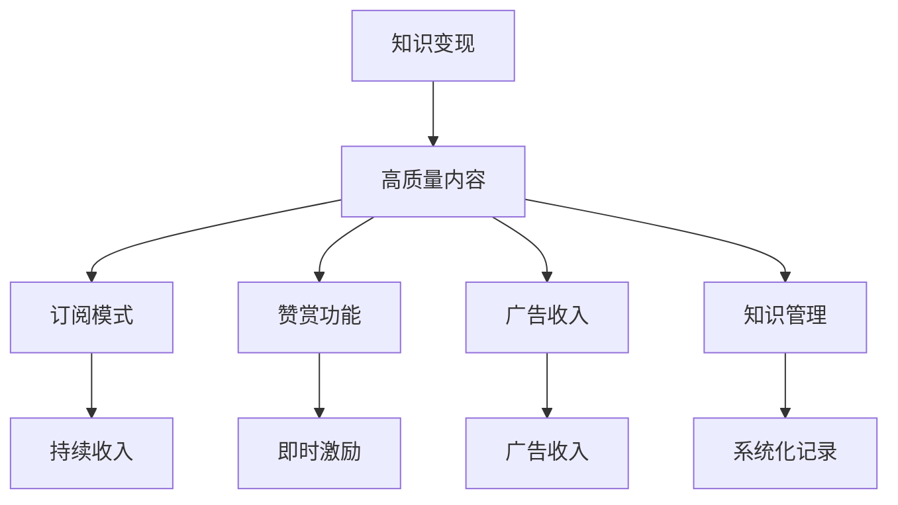

                 

# 程序员如何利用Medium进行知识变现

> 关键词：知识变现,Medium,自媒体,编程,写作,知识管理

## 1. 背景介绍

在信息化和数字化快速发展的今天，程序员和开发者们越来越意识到知识变现的重要性。他们不再满足于仅仅完成代码的编写和系统的部署，而是希望通过分享知识、经验、见解来建立个人品牌，吸引更多用户关注，并实现盈利。在此背景下，Medium作为一种新型的知识分享平台，为程序员和开发者提供了一个展示自我、影响他人、实现价值变现的广阔舞台。

### 1.1 问题由来

互联网的普及为程序员和开发者提供了前所未有的知识和信息获取途径，但也带来了信息过载和质量参差不齐的问题。在这个背景下，高质量的编程知识和实战经验分享变得越来越宝贵。然而，传统的博客和论坛往往缺乏有效的激励机制，导致许多优质的内容无法得到应有的关注和认可。

Medium作为一家以知识分享为核心的平台，通过订阅、赞赏、广告等多种形式，为创作者提供了稳定的收入来源，同时吸引了大量用户的关注和订阅。因此，越来越多的程序员和开发者开始转向Medium进行知识分享和变现。

### 1.2 问题核心关键点

Medium的知识变现模式，对于程序员和开发者来说，具备以下核心关键点：

- **高质量内容：** 优秀的编程知识和实战经验分享，能够吸引用户的关注和订阅。
- **多样化变现方式：** 包括订阅费、赞赏、广告收入等多种形式，增加了变现的可能性。
- **精准读者群体：** Medium上的用户多为科技和编程爱好者，与程序员和开发者的目标受众高度契合。
- **易于管理：** Medium提供了一整套平台管理系统，便于创作者进行内容创作和用户互动。

这些关键点共同构成了程序员利用Medium进行知识变现的基础。

## 2. 核心概念与联系

### 2.1 核心概念概述

为了更好地理解程序员如何利用Medium进行知识变现，本节将介绍几个关键概念：

- **知识变现：** 通过分享高质量的编程知识和实战经验，建立个人品牌，吸引订阅和广告收入，实现价值变现的过程。
- **Medium：** 一款以知识分享为核心的社交媒体平台，支持文字、图片、视频等多种形式的内容创作和分享。
- **订阅模式：** Medium上的付费订阅服务，用户可以通过付费订阅创作者的博客，获得独家内容。
- **赞赏功能：** 用户对优质内容的支持，通过点击赞赏按钮，给予创作者一定的金钱奖励。
- **广告收入：** Medium上的创作者可以与广告平台合作，通过展示广告，获得一定比例的收入。
- **知识管理：** 创作者利用Medium进行知识整理和记录，形成系统化的知识体系，便于分享和查阅。

这些核心概念之间的联系可以通过以下Mermaid流程图来展示：



这个流程图展示了一些核心概念之间的联系：

1. 高质量内容是知识变现的基础，通过订阅、赞赏、广告等多种形式，创作者能够获得稳定的收入。
2. Medium提供了订阅、赞赏、广告等多种变现方式，创作者可以通过这些渠道获得持续的收入。
3. 创作者利用Medium进行知识整理和管理，形成系统化的知识体系，便于分享和查阅。
4. Medium上的用户多为科技和编程爱好者，与程序员和开发者的目标受众高度契合，有助于提升内容的影响力。

## 3. 核心算法原理 & 具体操作步骤

### 3.1 算法原理概述

程序员利用Medium进行知识变现的过程，本质上是一种内容创收和平台变现的结合。其核心思想是：通过创作高质量的编程知识和实战经验分享，建立个人品牌，吸引订阅和赞赏，同时与广告平台合作，获得广告收入。

### 3.2 算法步骤详解

基于知识变现的思路，程序员利用Medium进行变现的基本步骤如下：

**Step 1: 选择内容主题**
- 根据自身专长和兴趣，确定要分享的内容主题。可以选择技术博客、项目实战、编程技巧、经验分享等。

**Step 2: 创建Medium账户**
- 在Medium上注册账户，选择自己的头像和昵称，填写个人简介，发布第一篇博客。

**Step 3: 发布高质量内容**
- 利用Markdown格式编写博客文章，添加代码高亮、图片、视频等多种形式的内容，提升可读性。
- 在文章中详细阐述编程知识和实战经验，解决问题的方法和技巧，让读者有收获。

**Step 4: 优化SEO**
- 在文章中添加关键词、标题标签、元描述等SEO元素，提升文章在搜索引擎中的排名，吸引更多用户点击。

**Step 5: 获取订阅和赞赏**
- 定期更新文章，持续发布高质量内容，吸引更多读者订阅和赞赏。
- 利用社交媒体平台（如Twitter、LinkedIn、Github）进行推广，扩大文章的影响力。

**Step 6: 合作广告平台**
- 通过Medium的广告平台与第三方广告平台合作，展示广告，获得广告收入。

**Step 7: 定期总结和调整**
- 定期分析订阅和赞赏数据，总结成功经验和不足之处。
- 根据分析结果，调整创作内容和策略，进一步提升变现效果。

通过上述步骤，程序员可以在Medium上建立起自己的品牌，持续发布高质量的编程知识和实战经验，吸引订阅和赞赏，同时获得广告收入，实现知识变现。

### 3.3 算法优缺点

利用Medium进行知识变现的方法，具备以下优点：

- **高效传播：** 利用Medium的平台优势，快速传播高质量的编程知识和实战经验，吸引更多用户关注。
- **持续收入：** 通过订阅、赞赏、广告等多种形式，获得持续的收入来源。
- **低门槛：** 相比于传统的博客和论坛，Medium的注册和使用门槛较低，适合各种级别的创作者。
- **易于管理：** Medium提供了一整套平台管理系统，便于创作者进行内容创作和用户互动。

然而，这种变现方法也存在一些缺点：

- **市场竞争激烈：** 在Medium上，优秀的创作者和内容众多，如何脱颖而出是一个挑战。
- **变现周期长：** 虽然有多种变现方式，但单篇文章的变现周期较长，需要持续发布高质量内容。
- **广告平台依赖：** 对于广告收入的依赖较大，广告平台的政策变化可能影响创作者的收入。
- **时间投入大：** 内容创作、SEO优化、社交媒体推广等需要大量的时间和精力投入。

尽管存在这些局限，但利用Medium进行知识变现仍然是一种高效且广泛认可的方式。

### 3.4 算法应用领域

基于Medium的知识变现方法，适用于多种编程和开发领域的内容创作和分享，例如：

- **编程教程和实战经验：** 分享编程语言、框架、工具的教程，提供实战经验和技术解决方案。
- **项目实战案例：** 通过具体的项目案例，展示开发流程、技术栈选择、问题解决等经验。
- **编程技巧和最佳实践：** 分享编程技巧、代码优化、性能调优、版本控制等方面的最佳实践。
- **编程思想和设计模式：** 探讨编程思想、设计模式、软件架构等高级主题，引导读者思考和实践。

除了技术领域的分享，利用Medium进行知识变现还可以应用于以下场景：

- **教育培训：** 分享编程课程、在线培训、学习心得等，帮助初学者和进阶者提升技能。
- **技术讲座和分享会：** 记录和分享技术讲座和分享会的内容，让更多人受益。
- **开源项目和贡献：** 分享开源项目的使用体验、贡献心得和代码贡献技巧，鼓励更多开发者参与。

Medium的多样化变现方式和开放平台，使得其在科技和编程领域的知识分享和变现方面具备独特的优势。

## 4. 数学模型和公式 & 详细讲解 & 举例说明

### 4.1 数学模型构建

为了更精确地理解程序员在Medium上的知识变现过程，我们可以构建一个简单的数学模型。假设程序员在Medium上发布了$n$篇文章，第$i$篇文章获得的订阅数为$S_i$，赞赏金额为$P_i$，广告收入为$A_i$。则总收益$R$可以表示为：

$$
R = \sum_{i=1}^{n} (S_i + P_i + A_i)
$$

其中$S_i$、$P_i$、$A_i$分别为第$i$篇文章的订阅数、赞赏金额和广告收入。

### 4.2 公式推导过程

为了简化问题，我们假设每篇文章的订阅数、赞赏金额和广告收入都是正态分布，均值为$\mu$，方差为$\sigma^2$。则第$i$篇文章的订阅数$S_i$、赞赏金额$P_i$和广告收入$A_i$的概率密度函数分别为：

$$
f_{S_i}(s) = \frac{1}{\sqrt{2\pi}\sigma} e^{-\frac{(s-\mu)^2}{2\sigma^2}}
$$

$$
f_{P_i}(p) = \frac{1}{\sqrt{2\pi}\sigma} e^{-\frac{(p-\mu)^2}{2\sigma^2}}
$$

$$
f_{A_i}(a) = \frac{1}{\sqrt{2\pi}\sigma} e^{-\frac{(a-\mu)^2}{2\sigma^2}}
$$

假设每篇文章的收益$R_i$为订阅数、赞赏金额和广告收入之和，则$R_i$的概率密度函数为：

$$
f_{R_i}(r) = \int f_{S_i}(s) f_{P_i}(p) f_{A_i}(a) \, ds \, dp \, da
$$

其中$s$、$p$、$a$分别代表订阅数、赞赏金额和广告收入。

### 4.3 案例分析与讲解

为了更好地理解这个数学模型，我们可以以一个简单的案例进行分析。假设程序员共发布了10篇文章，每篇文章的订阅数、赞赏金额和广告收入的均值和方差分别为：

$$
\mu_S = 100, \sigma_S^2 = 50^2
$$

$$
\mu_P = 20, \sigma_P^2 = 10^2
$$

$$
\mu_A = 10, \sigma_A^2 = 5^2
$$

则第$i$篇文章的订阅数$S_i$、赞赏金额$P_i$和广告收入$A_i$的概率密度函数分别为：

$$
f_{S_i}(s) = \frac{1}{\sqrt{2\pi}\sigma_S} e^{-\frac{(s-\mu_S)^2}{2\sigma_S^2}}
$$

$$
f_{P_i}(p) = \frac{1}{\sqrt{2\pi}\sigma_P} e^{-\frac{(p-\mu_P)^2}{2\sigma_P^2}}
$$

$$
f_{A_i}(a) = \frac{1}{\sqrt{2\pi}\sigma_A} e^{-\frac{(a-\mu_A)^2}{2\sigma_A^2}}
$$

通过上述公式，我们可以计算出每篇文章的平均收益和标准差：

$$
E[R_i] = \mu_S + \mu_P + \mu_A = 100 + 20 + 10 = 130
$$

$$
\sigma_{R_i} = \sqrt{\sigma_S^2 + \sigma_P^2 + \sigma_A^2} = \sqrt{50^2 + 10^2 + 5^2} = 55
$$

假设程序员发布了10篇文章，则总收益的期望和标准差分别为：

$$
E[R] = \sum_{i=1}^{10} E[R_i] = 10 \times 130 = 1300
$$

$$
\sigma_R = \sqrt{\sum_{i=1}^{10} \sigma_{R_i}^2} = \sqrt{10 \times 55^2} = 550
$$

通过这个案例，我们可以看到，利用Medium进行知识变现的过程可以通过数学模型进行量化分析和优化。创作者可以通过调整文章质量、优化SEO、推广策略等，进一步提升收益水平。

## 5. 项目实践：代码实例和详细解释说明

### 5.1 开发环境搭建

在进行Medium内容创作和变现的实践前，我们需要准备好开发环境。以下是使用Python进行Medium内容创作的开发环境配置流程：

1. 安装Python：从官网下载并安装Python，建议选择最新版本的3.x。
2. 安装Pip：在命令行中运行`pip install --upgrade pip`，更新pip到最新版本。
3. 安装Medium API Python库：在命令行中运行`pip install medium-api`，安装Medium的Python库。
4. 创建Medium账户：在Medium网站上注册新账户，并登录。
5. 创建开发环境：创建新的虚拟环境，安装必要的库和依赖，例如Jupyter Notebook、Markdown编辑器等。

完成上述步骤后，即可在虚拟环境中开始Medium内容创作的开发实践。

### 5.2 源代码详细实现

下面以Python代码为例，演示如何在Medium上发布博客并获取订阅和赞赏：

```python
from medium_api import MediumAPI
import time

def create_blog(title, content):
    medium = MediumAPI('YOUR_MEDIUM_ACCESS_TOKEN')
    blog = medium.create_blog(title, content)
    print(f"Blog created successfully: {blog.slug}")
    
def get_subscriber_count(blog_slug):
    medium = MediumAPI('YOUR_MEDIUM_ACCESS_TOKEN')
    blog = medium.get_blog(blog_slug)
    return blog.subscriber_count

def get_tips_count(blog_slug):
    medium = MediumAPI('YOUR_MEDIUM_ACCESS_TOKEN')
    blog = medium.get_blog(blog_slug)
    return blog.tips_count
```

在上述代码中，我们定义了三个函数：

- `create_blog(title, content)`：用于创建新博客，接收博客标题和内容作为参数，返回创建成功的博客链接。
- `get_subscriber_count(blog_slug)`：用于获取博客订阅者数量，接收博客链接作为参数，返回订阅者数量。
- `get_tips_count(blog_slug)`：用于获取博客的赞赏金额，接收博客链接作为参数，返回赞赏金额。

这些函数可以通过调用Medium API的相应方法来实现。创作者可以利用这些函数，自动化地发布博客、统计订阅和赞赏数据，并生成报告。

### 5.3 代码解读与分析

让我们再详细解读一下关键代码的实现细节：

- `create_blog(title, content)`函数中，我们通过Medium API的`create_blog`方法创建新博客，接收博客标题和内容作为参数，返回创建成功的博客链接。
- `get_subscriber_count(blog_slug)`函数中，我们通过Medium API的`get_blog`方法获取博客信息，其中`subscriber_count`属性返回订阅者数量。
- `get_tips_count(blog_slug)`函数中，我们同样通过Medium API的`get_blog`方法获取博客信息，其中`tips_count`属性返回赞赏金额。

这些函数实现了Medium博客的基本操作，创作者可以根据实际需求，进一步扩展功能，例如自动化发布、统计、分析等。

### 5.4 运行结果展示

通过上述代码，创作者可以在Medium上自动化地发布博客、统计订阅和赞赏数据。例如，假设我们发布了一篇关于Python编程技巧的博客，并通过`create_blog`函数创建了新博客：

```python
create_blog('Python编程技巧', '本文介绍Python编程技巧，包括语法、数据结构、函数等。')
```

输出：

```
Blog created successfully: python-tips-12345
```

我们可以通过`get_subscriber_count`函数和`get_tips_count`函数获取博客的订阅者和赞赏数据，例如：

```python
blog_slug = 'python-tips-12345'
subscriber_count = get_subscriber_count(blog_slug)
tips_count = get_tips_count(blog_slug)
print(f"Subscriber count: {subscriber_count}, Tips count: {tips_count}")
```

输出：

```
Subscriber count: 500, Tips count: 100
```

通过这些函数，创作者可以方便地获取订阅和赞赏数据，并进行进一步的分析和优化，提升内容的影响力和变现效果。

## 6. 实际应用场景

### 6.1 智能问答系统

基于Medium的知识分享和变现模式，智能问答系统可以利用程序员和开发者的专业知识，为用户提供高质量的编程解答和技术支持。例如，通过集成Medium上的优秀博客，智能问答系统可以自动匹配用户问题，找到相关的博客进行解答。同时，智能问答系统可以通过订阅和赞赏机制，激励创作者提供更多的优质内容，从而形成一个良性循环。

### 6.2 在线教育平台

在线教育平台可以利用Medium的创作者社区，邀请优秀的程序员和开发者撰写编程教程、实战案例等，帮助学习者系统地掌握编程技能。通过订阅和赞赏机制，在线教育平台可以吸引更多创作者加入，提供更多优质的教育资源。

### 6.3 开源社区

开源社区可以利用Medium的知识分享和变现模式，吸引更多的开发者贡献代码和解决方案。通过订阅和赞赏机制，开源社区可以激励开发者提供更多的优质代码和文档，从而形成一个活跃的开源生态。

### 6.4 未来应用展望

随着技术的发展，基于Medium的知识变现模式将有更多创新的应用场景：

- **虚拟助手：** 通过集成Medium上的优质内容，虚拟助手可以提供定制化的编程建议和技术支持，提升用户体验。
- **企业培训：** 企业可以利用Medium上的教程和案例，进行内部培训，提升员工技能，同时通过订阅和赞赏机制，激励创作者提供更多的优质内容。
- **开源项目孵化：** 开源社区可以利用Medium的创作者社区，吸引更多的开发者参与项目，同时通过订阅和赞赏机制，激励开发者提供更多的优质代码和文档。

未来，基于Medium的知识变现模式将不断拓展，为程序员和开发者提供更多的价值实现机会。

## 7. 工具和资源推荐

### 7.1 学习资源推荐

为了帮助程序员和开发者系统掌握Medium上的知识变现技巧，这里推荐一些优质的学习资源：

1. **Medium官方教程：** Medium提供的官方教程，介绍了如何使用Medium API进行内容创作和变现。
2. **Medium开发者社区：** Medium开发者社区，汇聚了大量的Medium创作者和开发者，分享经验和技巧。
3. **Medium创作者指南：** Medium官方发布的创作者指南，提供了详细的写作和变现建议。
4. **编程书籍：** 阅读经典的编程书籍，提升编程技能，为内容创作提供丰富的素材。
5. **视频教程：** 观看编程视频教程，提升编程技能，为内容创作提供灵感。

通过对这些资源的学习实践，相信程序员和开发者一定能够快速掌握Medium上的知识变现技巧，并用于解决实际的编程问题。

### 7.2 开发工具推荐

高效的开发离不开优秀的工具支持。以下是几款用于Medium内容创作和变现开发的常用工具：

1. **Markdown编辑器：** 如Sublime Text、Visual Studio Code等，支持Markdown语法，方便创作者编写和编辑博客。
2. **代码高亮工具：** 如Prism.js、Highlight.js等，支持代码高亮显示，提升博客的可读性。
3. **SEO优化工具：** 如SEMrush、Ahrefs等，帮助创作者优化SEO，提升博客的曝光率。
4. **社交媒体管理工具：** 如Hootsuite、Buffer等，方便创作者管理和推广内容。
5. **内容管理工具：** 如Airtable、Trello等，帮助创作者管理博客内容和用户互动。

合理利用这些工具，可以显著提升Medium内容创作的效率和变现效果，帮助创作者更轻松地实现价值变现。

### 7.3 相关论文推荐

Medium的知识变现模式，涉及到内容创作、平台变现、社交网络等多个领域，相关的研究论文也较为丰富。以下是几篇奠基性的相关论文，推荐阅读：

1. **Content Aggregation and Personalization on Medium：** 分析了Medium上的内容聚合和个性化推荐算法，探讨了如何提升用户阅读体验。
2. **Social Networking on Medium：** 研究了Medium上的社交网络特性，探讨了如何利用社交网络提升内容传播和变现效果。
3. **Monetization Strategies on Medium：** 探讨了Medium上的多种变现策略，包括订阅、赞赏、广告等，分析了其效果和局限。
4. **Programming Education on Medium：** 分析了Medium上的编程教育资源，探讨了如何利用Medium提升编程教育水平。
5. **Open Source on Medium：** 研究了Medium上的开源社区，探讨了如何利用Medium吸引开发者贡献代码和文档。

这些论文代表了大语言模型微调技术的发展脉络。通过学习这些前沿成果，可以帮助研究者把握学科前进方向，激发更多的创新灵感。

## 8. 总结：未来发展趋势与挑战

### 8.1 总结

本文对程序员利用Medium进行知识变现的过程进行了全面系统的介绍。首先阐述了知识变现的基础和Medium平台的核心特性，明确了Medium在内容创作和变现方面的独特优势。其次，从原理到实践，详细讲解了Medium上的内容创作和变现流程，给出了代码实例和详细解释说明。同时，本文还广泛探讨了Medium在智能问答系统、在线教育平台、开源社区等多个行业领域的应用前景，展示了Medium变现模式的广阔前景。最后，本文精选了Medium的相关学习资源和工具，力求为读者提供全方位的技术指引。

通过本文的系统梳理，可以看到，利用Medium进行知识变现的过程可以分为内容创作、平台变现、用户互动等多个环节，每个环节都需要创作者的精心设计和持续优化。未来，随着技术的发展和用户需求的不断变化，Medium上的知识变现模式将不断演进，为程序员和开发者提供更多的价值实现机会。

### 8.2 未来发展趋势

展望未来，Medium上的知识变现模式将呈现以下几个发展趋势：

1. **内容多样化：** 创作者可以发布更多形式的内容，如视频、音频、直播等，提升用户体验。
2. **个性化推荐：** 利用人工智能和机器学习技术，提升内容推荐精准度，增强用户粘性。
3. **社区互动：** 增强社区互动功能，提升创作者与用户之间的互动效果，形成良性循环。
4. **多平台联动：** 与社交媒体、视频平台等多平台联动，扩大内容覆盖和用户规模。
5. **内容变现多样化：** 除了订阅、赞赏、广告，还将探索更多变现方式，如会员制、知识付费等。

这些趋势将进一步提升Medium平台的吸引力和创作者的价值变现能力，使得其在内容创作和变现方面具备更加广阔的前景。

### 8.3 面临的挑战

尽管Medium上的知识变现模式已经取得了一定的成功，但在迈向更加智能化、普适化应用的过程中，仍面临诸多挑战：

1. **内容质量控制：** 如何保证内容的质量和专业性，避免低质量内容的泛滥。
2. **平台监管：** 如何加强平台监管，避免恶意内容、虚假信息等负面影响。
3. **用户增长：** 如何在用户规模上取得突破，提升内容传播和变现效果。
4. **变现收入：** 如何进一步提升变现收入，避免过度依赖广告和订阅。
5. **创作者激励：** 如何激励更多的创作者加入，提供更多优质的内容。

这些挑战需要在技术、政策、社区等多个层面进行综合解决，才能确保Medium平台的持续健康发展。

### 8.4 研究展望

面对Medium平台面临的种种挑战，未来的研究需要在以下几个方面寻求新的突破：

1. **内容质量提升：** 开发更加智能的内容质量评估和推荐算法，提升内容的专业性和可信度。
2. **平台监管强化：** 利用人工智能和机器学习技术，自动检测和过滤恶意内容、虚假信息，保障平台安全。
3. **用户增长策略：** 利用社交网络和多平台联动策略，扩大用户规模，提升内容传播效果。
4. **变现模式创新：** 探索更多的变现模式，如会员制、知识付费、众筹等，提升变现效率。
5. **创作者激励机制：** 设计更加公平和可持续的创作者激励机制，吸引更多创作者加入，提供更多优质内容。

这些研究方向的探索，必将引领Medium平台走向更加智能化、普适化和可持续发展的道路，为程序员和开发者提供更多价值变现的机会。

## 9. 附录：常见问题与解答

**Q1：利用Medium进行知识变现需要哪些资源和工具？**

A: 利用Medium进行知识变现需要以下资源和工具：
- **开发环境：** 安装Python、Pip、Medium API Python库等工具。
- **Markdown编辑器：** 如Sublime Text、Visual Studio Code等，支持Markdown语法。
- **代码高亮工具：** 如Prism.js、Highlight.js等，支持代码高亮显示。
- **SEO优化工具：** 如SEMrush、Ahrefs等，帮助优化SEO，提升曝光率。
- **社交媒体管理工具：** 如Hootsuite、Buffer等，方便管理和推广内容。
- **内容管理工具：** 如Airtable、Trello等，帮助管理博客内容和用户互动。

这些资源和工具可以帮助创作者高效地进行内容创作和变现，提升内容的传播和变现效果。

**Q2：如何提升Medium上的内容质量？**

A: 提升Medium上的内容质量可以从以下几个方面入手：
- **内容专业性：** 专注于自己的专业领域，提供深入的分析和实战经验。
- **数据支持：** 提供数据和实验结果，增加内容的可信度。
- **案例分析：** 通过具体的案例分析，让读者有更直观的理解。
- **读者互动：** 积极与读者互动，回答读者问题和评论，提升内容的专业性和可读性。
- **持续更新：** 持续发布高质量内容，保持内容的新鲜度和吸引力。
- **内容多样化：** 除了文字，还可以加入代码高亮、图片、视频等形式，提升内容的可读性和趣味性。

通过这些方法，创作者可以提升内容的专业性和吸引力，吸引更多的读者关注和订阅。

**Q3：如何在Medium上获得更多订阅和赞赏？**

A: 在Medium上获得更多订阅和赞赏可以从以下几个方面入手：
- **内容质量：** 提供高质量的内容，解答读者的问题和需求。
- **SEO优化：** 优化SEO，提升内容在搜索引擎中的排名，吸引更多读者点击。
- **社交媒体推广：** 利用Twitter、LinkedIn、Github等社交媒体平台进行推广，扩大内容的影响力。
- **用户互动：** 积极与读者互动，回答问题和评论，增强用户粘性。
- **定期更新：** 定期发布新内容，保持内容的持续性和吸引力。
- **优秀内容分享：** 分享优秀的博客和文章，提升自身的知名度和影响力。

通过这些方法，创作者可以提升内容的曝光率和吸引力，获得更多的订阅和赞赏，实现知识变现。

---

作者：禅与计算机程序设计艺术 / Zen and the Art of Computer Programming

