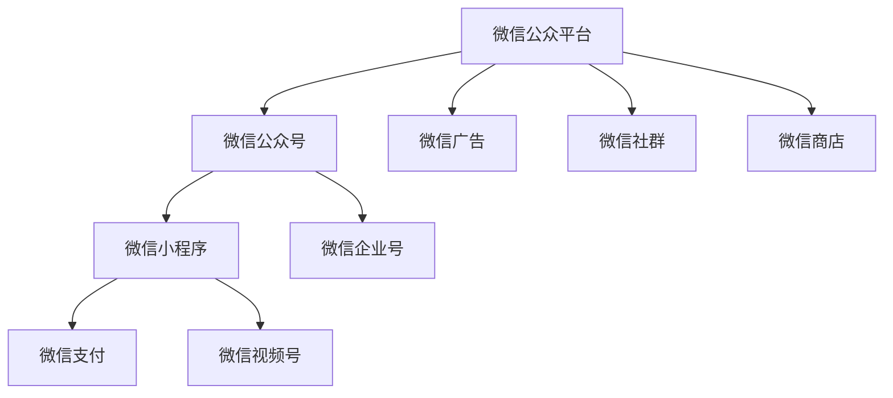

                 

## 1. 背景介绍

### 1.1 问题由来
随着知识付费平台的兴起，越来越多的程序员开始利用自身的专业知识进行知识付费，借助微信生态系统的广泛覆盖和便捷性，进行内容创作、用户运营和收益变现。微信生态系统，包括微信小程序、微信公众号、微信视频号、微信支付等，为程序员进行知识付费提供了得天独厚的优势。

### 1.2 问题核心关键点
微信生态系统支持程序员进行知识付费的核心关键点包括：

1. **广泛的覆盖范围**：微信拥有超过10亿的活跃用户，覆盖了中国大部分互联网用户，为程序员的知识内容提供了广大的传播和曝光机会。
2. **便捷的操作接口**：微信生态系统的API和开发工具，如微信小程序开发者工具、微信公众号管理平台等，为程序员进行内容创作和用户运营提供了极大的便利。
3. **多样化的变现方式**：微信支付、微信广告、微信商店等支付和广告平台，为程序员提供了多样化的收益渠道。
4. **强有力的社群支持**：微信社群、微信群、微信企业号等工具，为程序员的社区互动和用户运营提供了便利。
5. **丰富的数据支持**：微信提供的数据分析工具和API，可以帮助程序员分析用户行为，优化内容策略，提升收益效果。

### 1.3 问题研究意义
通过深入了解微信生态系统的功能和特性，程序员可以更有效地进行知识付费，提升内容的影响力和收益效果。同时，这一研究也有助于了解社交媒体对知识付费市场的影响，为未来的研究和实践提供参考。

## 2. 核心概念与联系

### 2.1 核心概念概述

微信生态系统是一个集成了微信、微信公众号、微信小程序、微信支付、微信广告等功能的综合平台，为知识付费提供了全方位的支持。

### 2.2 核心概念原理和架构的 Mermaid 流程图


### 2.3 核心概念之间的联系
微信生态系统的各个组件之间相互连接，形成一个有机整体。微信公众号作为知识创作者的主要渠道，通过微信支付和微信广告实现收益，同时通过微信小程序和微信企业号进行用户运营和社群互动，利用微信视频号进行内容推广，最终通过微信商店实现商品的销售。

## 3. 核心算法原理 & 具体操作步骤

### 3.1 算法原理概述

微信生态系统支持知识付费的算法原理主要基于：

1. **推荐算法**：利用机器学习算法，根据用户行为和历史数据，推荐符合用户兴趣的知识内容。
2. **搜索优化**：通过搜索引擎优化(Search Engine Optimization, SEO)技术，提高知识内容的可发现性。
3. **个性化定制**：根据用户反馈和行为数据，定制个性化的内容推荐和界面设计。
4. **支付算法**：优化支付流程，提高交易效率和安全性。

### 3.2 算法步骤详解

**步骤1：内容创作与发布**
- 确定知识主题和内容形式（如文章、视频、直播等）。
- 使用微信公众号、微信小程序或微信视频号创建和发布内容。
- 使用微信编辑器进行内容编辑和排版。

**步骤2：用户运营与互动**
- 通过微信公众号、微信企业号或微信社群进行用户互动。
- 利用微信客服功能，提供即时的用户支持。
- 定期更新内容，保持用户活跃度。

**步骤3：收益变现**
- 设置微信支付接口，实现内容付费功能。
- 利用微信广告平台进行内容推广。
- 利用微信商店进行知识产品的销售。

**步骤4：数据分析与优化**
- 利用微信提供的数据分析工具，分析用户行为和内容表现。
- 根据分析结果，优化内容策略和用户运营策略。

### 3.3 算法优缺点

**优点**：
1. **广泛覆盖**：通过微信生态系统的广泛覆盖，能够接触到大量潜在用户。
2. **便捷操作**：微信提供的开发工具和API，降低了内容创作和用户运营的门槛。
3. **多样变现**：微信支付、微信广告、商品销售等多样化变现渠道，提高了收益来源的多样性。
4. **强社群支持**：微信群、微信企业号等工具，便于进行用户互动和社群运营。
5. **丰富的数据支持**：微信提供的数据分析工具，便于进行用户行为分析，优化内容策略。

**缺点**：
1. **监管压力**：微信生态系统的严格监管，对内容创作者的要求较高，需要遵守相关政策和规定。
2. **竞争激烈**：知识付费市场竞争激烈，内容同质化严重，难以脱颖而出。
3. **用户粘性不足**：用户粘性需要靠优质内容和互动来维持，对内容创作者的持续输出要求较高。
4. **平台依赖性**：过度依赖微信平台，一旦微信政策变化，可能会影响内容创作者和用户的利益。

### 3.4 算法应用领域

微信生态系统支持知识付费的应用领域包括但不限于：

1. **技术博客与教程**：通过微信公众号发布技术文章、代码示例等，进行技术分享和教育。
2. **视频课程与直播**：通过微信视频号进行视频课程和直播教学，提供实时互动和答疑。
3. **知识付费与课程销售**：利用微信支付和微信商店进行知识产品的销售，如电子书、编程工具包等。
4. **社群与问答**：利用微信群、微信企业号进行社群互动，提供一对一问答和答疑服务。
5. **广告与推广**：利用微信广告平台进行内容推广和引流，提高内容的曝光度。

## 4. 数学模型和公式 & 详细讲解 & 举例说明

### 4.1 数学模型构建

在知识付费中，推荐算法是一个重要的组成部分。推荐算法的目标是根据用户的历史行为和兴趣，预测其可能感兴趣的内容。假设用户集为 $U=\{u_1,u_2,...,u_N\}$，内容集为 $C=\{c_1,c_2,...,c_M\}$，用户与内容的交互矩阵为 $I\in \mathbb{R}^{N\times M}$，用户对内容的评分向量为 $R\in \mathbb{R}^{N\times M}$。推荐算法通过矩阵分解等技术，预测用户对内容的评分，从而推荐内容。

### 4.2 公式推导过程

以基于协同过滤的推荐算法为例，推荐用户 $u_i$ 对内容 $c_j$ 的评分 $\hat{r}_{ij}$ 的公式为：

$$
\hat{r}_{ij} = \frac{u_i \cdot c_j}{\sqrt{u_i \cdot u_i} \cdot \sqrt{c_j \cdot c_j}}
$$

其中 $u_i \cdot u_i$ 和 $c_j \cdot c_j$ 分别是用户 $u_i$ 和内容 $c_j$ 的向量内积。

### 4.3 案例分析与讲解

假设有一个程序员开设了一个微信公众号，通过推荐算法，发现用户对某一主题的内容评价较高。根据这一信息，该程序员可以进一步优化内容策略，增加该主题的输出，提高用户粘性和收益。

## 5. 项目实践：代码实例和详细解释说明

### 5.1 开发环境搭建

1. **环境配置**：
   - 安装Python 3.7及以上版本。
   - 安装微信小程序开发者工具。
   - 安装微信公众号管理平台。

2. **代码示例**：
   - 在微信公众号平台创建新公众号。
   - 通过微信公众号管理平台创建新文章或视频，上传内容。
   - 配置微信支付接口，实现内容付费功能。

### 5.2 源代码详细实现

以下是一个简单的微信公众号内容发布示例：

```python
from wechatpy import WeChat
# 设置微信公众号的AppID和AppSecret
app_id = 'your_app_id'
app_secret = 'your_app_secret'
# 创建WeChat对象
wechat = WeChat(app_id, app_secret)
# 创建新文章
article = {
    'title': 'Python高级编程技巧',
    'description': 'Python编程技巧高级进阶',
    'content': 'Python高级编程技巧内容',
    'content_type': 'text'
}
# 发布文章
response = wechat.create_article(article)
print(response)
```

### 5.3 代码解读与分析

在上述代码中，`wechatpy`库提供了与微信生态系统交互的接口。通过设置微信公众号的AppID和AppSecret，创建WeChat对象，然后使用`create_article`方法发布新文章。

### 5.4 运行结果展示

成功发布文章后，用户可以在微信公众号中查看和阅读。如果设置了微信支付接口，用户可以在阅读完毕后选择付费阅读。

## 6. 实际应用场景

### 6.1 技术博客与教程

程序员可以通过微信公众号发布技术博客和教程，吸引技术爱好者和学生。通过微信支付实现内容付费，增加收益。

### 6.2 视频课程与直播

利用微信视频号进行视频课程和直播教学，提供实时互动和答疑。通过微信支付实现付费功能，增加收益。

### 6.3 知识付费与课程销售

在微信公众号或微信小程序中销售知识产品，如电子书、编程工具包等。通过微信支付实现交易功能，增加收益。

### 6.4 社群与问答

利用微信群或微信企业号进行社群互动，提供一对一问答和答疑服务。通过微信支付实现社群付费，增加收益。

### 6.5 广告与推广

利用微信广告平台进行内容推广，提高内容的曝光度和引流效果。通过广告收入增加收益。

## 7. 工具和资源推荐

### 7.1 学习资源推荐

1. **微信公众号管理平台**：提供详细的文档和教程，帮助程序员快速上手微信公众号开发和运营。
2. **微信小程序开发者工具**：提供可视化开发环境和代码生成器，降低小程序开发难度。
3. **微信广告平台**：提供详细的广告投放指南和数据分析工具，帮助程序员进行内容推广。
4. **微信官方博客和开发者社区**：提供丰富的学习资源和技术支持。

### 7.2 开发工具推荐

1. **Python编程语言**：作为开发微信生态系统的首选语言，Python具有丰富的第三方库和工具支持。
2. **微信开发者工具**：提供可视化开发环境和代码生成器，降低小程序开发难度。
3. **微信公众号管理平台**：提供详细的文档和教程，帮助程序员快速上手微信公众号开发和运营。
4. **微信广告平台**：提供详细的广告投放指南和数据分析工具，帮助程序员进行内容推广。

### 7.3 相关论文推荐

1. **《基于协同过滤的推荐系统》**：介绍协同过滤算法的原理和实现，适合理解推荐算法的基础知识。
2. **《深度学习与推荐系统》**：介绍深度学习在推荐系统中的应用，适合进一步深入学习。
3. **《微信生态系统与知识付费》**：介绍微信生态系统在知识付费中的应用，适合了解具体的实践案例和操作流程。

## 8. 总结：未来发展趋势与挑战

### 8.1 研究成果总结

微信生态系统已经成为程序员进行知识付费的重要平台，通过内容创作、用户运营和收益变现，实现了技术知识的高效传播和商业化。

### 8.2 未来发展趋势

1. **内容多元化**：未来的知识付费内容将更加多样化，除了技术博客和视频课程，还将包括直播互动、在线咨询等。
2. **社交化增强**：未来的知识付费将更加注重社交互动，通过微信群、微信企业号等工具，增加用户粘性和互动性。
3. **智能化提升**：未来的知识付费将更加智能化，利用机器学习算法，提供个性化的内容推荐和互动体验。
4. **跨平台融合**：未来的知识付费将跨平台融合，通过微信、抖音、B站等平台的联动，扩大内容的覆盖范围。
5. **多模态融合**：未来的知识付费将融合多种媒介，如文字、图片、视频等，提供更丰富的用户体验。

### 8.3 面临的挑战

1. **内容质量**：如何持续产出高质量、有价值的内容，吸引和保持用户关注，是内容创作者面临的挑战。
2. **用户粘性**：如何增强用户粘性，提升用户互动和参与度，是用户运营的挑战。
3. **监管合规**：如何在遵守微信平台政策和法规的前提下，进行内容创作和变现，是合规性的挑战。
4. **技术门槛**：如何降低内容创作者的技术门槛，提高运营效率，是技术实现的挑战。
5. **竞争压力**：如何在激烈的市场竞争中脱颖而出，吸引用户，是市场竞争的挑战。

### 8.4 研究展望

未来的研究将关注如何提升内容质量和用户粘性，增强智能推荐和社交互动，降低内容创作的门槛，确保合规性，以及提升市场竞争力。

## 9. 附录：常见问题与解答

**Q1：如何进行内容创作和发布？**

A: 通过微信公众号管理平台，创建新文章或视频，上传内容，并设置微信支付接口，实现内容付费功能。

**Q2：如何进行用户运营与互动？**

A: 通过微信群、微信企业号进行用户互动，利用微信客服功能，提供即时的用户支持。

**Q3：如何进行收益变现？**

A: 利用微信支付、微信广告、微信商店等平台，实现内容付费、广告收益和商品销售。

**Q4：如何进行数据分析与优化？**

A: 利用微信提供的数据分析工具，分析用户行为和内容表现，优化内容策略和用户运营策略。

**Q5：如何进行内容推广？**

A: 利用微信广告平台进行内容推广，提高内容的曝光度和引流效果。

作者：禅与计算机程序设计艺术 / Zen and the Art of Computer Programming

