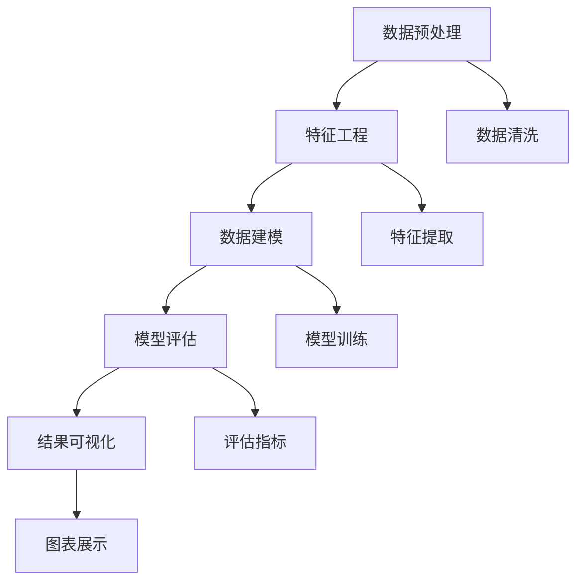

                 

# 程序员如何利用知识发现引擎实现财富自由

在信息爆炸的今天，数据已经成为最有价值的资产之一。知识发现引擎(Knowledge Discovery Engine, KDE)作为一种高效的数据挖掘工具，通过揭示数据背后的隐含模式和知识，帮助程序员在数据海洋中发现商业机会和创新点，实现财富自由。本文将深入探讨知识发现引擎的原理与操作，并提供具体的实践指南，帮助程序员在数据驱动的世界中发掘价值，走上财富之路。

## 1. 背景介绍

### 1.1 问题由来
随着互联网的发展和数据的积累，各行各业的数据规模急剧膨胀。如何从这些庞杂的数据中提取有用的信息，发现潜在的商业机会，已经成为企业和个人关注的重点。知识发现引擎作为数据挖掘的核心技术，通过高效的数据处理和分析，能够帮助程序员发现数据中的有价值模式，从而为其在商业领域取得成功提供坚实的基础。

### 1.2 问题核心关键点
知识发现引擎的核心在于以下几个方面：

1. **数据预处理**：清洗、标准化数据，去除噪音，为后续分析提供干净的数据源。
2. **特征工程**：提取和构建有意义的特征，提升模型性能。
3. **数据建模**：构建数学模型和算法框架，对数据进行拟合。
4. **模型评估**：使用合适的评估指标，对模型性能进行客观评估。
5. **结果可视化**：通过图表和报告，直观展示分析结果。

这些关键点构成了知识发现引擎的核心流程，其目的是在数据中挖掘有价值的知识，为企业和个人提供决策依据，从而实现商业目标。

### 1.3 问题研究意义
利用知识发现引擎，程序员可以在数据中发现潜在的商业机会，提升工作效率，优化决策过程。同时，通过对数据的深入分析，可以发现新市场、新产品、新服务，为创新提供数据支持。这不仅有助于个人职业发展，也为企业的商业创新和转型提供坚实的技术支撑。

## 2. 核心概念与联系

### 2.1 核心概念概述

为了更好地理解知识发现引擎的工作原理，本节将介绍几个密切相关的核心概念：

1. **知识发现(Knowledge Discovery)**：通过对数据进行分析和挖掘，发现数据中隐含的有用知识的过程。
2. **数据挖掘(Data Mining)**：在数据中寻找模式、异常值和相关性的过程，通常包含数据预处理、特征工程和模型构建等多个步骤。
3. **机器学习(Machine Learning)**：利用算法和模型自动分析数据，发现数据内在规律和知识。
4. **数据预处理(Data Preprocessing)**：清洗、转换和标准化数据，提升数据质量，为后续分析提供支持。
5. **特征选择(Feature Selection)**：从原始数据中挑选最有用的特征，提升模型效果。
6. **数据可视化(Data Visualization)**：通过图表和报告，直观展示数据分析结果。

这些概念之间存在着紧密的联系，共同构成了知识发现引擎的完整流程。通过深入理解这些核心概念，我们可以更好地把握知识发现引擎的工作原理和技术方法。

### 2.2 核心概念原理和架构的 Mermaid 流程图



这个流程图展示了知识发现引擎的核心流程：首先对原始数据进行清洗和标准化，然后提取有意义的特征，构建数学模型并对数据进行拟合，最后通过评估指标评估模型效果，并通过可视化展示分析结果。

## 3. 核心算法原理 & 具体操作步骤

### 3.1 算法原理概述

知识发现引擎的核心算法包括数据预处理、特征工程、数据建模和模型评估等多个环节。其中，数据预处理和特征工程是基础，数据建模和模型评估是核心。

- **数据预处理**：清洗和标准化数据，去除噪音，为后续分析提供干净的数据源。
- **特征工程**：提取和构建有意义的特征，提升模型性能。
- **数据建模**：构建数学模型和算法框架，对数据进行拟合。
- **模型评估**：使用合适的评估指标，对模型性能进行客观评估。

这些算法和流程紧密结合，共同构成了知识发现引擎的完整工作流程。

### 3.2 算法步骤详解

知识发现引擎的工作流程大致如下：

1. **数据预处理**：
   - 清洗数据：去除重复、缺失、异常值等数据噪音。
   - 标准化数据：将数据转换为标准格式，便于后续处理。
   - 数据集成：将来自不同数据源的数据进行合并。

2. **特征工程**：
   - 特征提取：从原始数据中提取有意义的特征。
   - 特征选择：挑选最有用的特征，提升模型性能。
   - 特征变换：对特征进行归一化、降维等操作，提高数据质量。

3. **数据建模**：
   - 选择合适的模型：如回归模型、分类模型、聚类模型等。
   - 模型训练：使用训练集对模型进行拟合，找到最优参数。
   - 模型评估：使用验证集和测试集评估模型性能，选择最佳模型。

4. **结果可视化**：
   - 图表展示：使用图表展示分析结果，如散点图、直方图、树图等。
   - 报告生成：生成详细的分析报告，提供深入的数据洞察。

### 3.3 算法优缺点

知识发现引擎具有以下优点：

1. **高效性**：自动化数据处理和分析，提升工作效率。
2. **准确性**：通过科学的数据建模和评估，发现数据中的有用知识。
3. **易用性**：提供可视化工具，帮助非技术人员理解分析结果。

同时，也存在一些缺点：

1. **数据质量要求高**：需要高质量的数据源，否则会影响分析结果。
2. **计算资源消耗大**：处理大规模数据需要高性能计算资源。
3. **模型选择复杂**：选择合适的模型和算法对用户要求较高。

尽管如此，知识发现引擎依然是数据驱动分析的强大工具，广泛应用于金融、零售、医疗等多个领域，帮助企业和个人发现商业机会，提升决策水平。

### 3.4 算法应用领域

知识发现引擎在多个领域得到了广泛应用：

- **金融行业**：通过分析客户数据，发现新的金融产品和市场机会。
- **零售行业**：分析消费者行为数据，提升销售和客户满意度。
- **医疗行业**：挖掘电子病历中的有用信息，提高医疗诊断和治疗效果。
- **电商行业**：分析用户购买数据，发现用户偏好和购买行为规律。
- **社交媒体**：分析用户互动数据，发现社交趋势和热点。

知识发现引擎的广泛应用展示了其在数据驱动决策中的巨大价值，为各行各业提供了强大的技术支持。

## 4. 数学模型和公式 & 详细讲解 & 举例说明

### 4.1 数学模型构建

知识发现引擎的数学模型构建涉及多个步骤，包括数据预处理、特征提取和模型选择等。

1. **数据预处理**：
   - 清洗数据：去除重复、缺失、异常值等数据噪音。
   - 标准化数据：将数据转换为标准格式，便于后续处理。
   - 数据集成：将来自不同数据源的数据进行合并。

2. **特征工程**：
   - 特征提取：从原始数据中提取有意义的特征。
   - 特征选择：挑选最有用的特征，提升模型性能。
   - 特征变换：对特征进行归一化、降维等操作，提高数据质量。

3. **数据建模**：
   - 选择合适的模型：如回归模型、分类模型、聚类模型等。
   - 模型训练：使用训练集对模型进行拟合，找到最优参数。
   - 模型评估：使用验证集和测试集评估模型性能，选择最佳模型。

### 4.2 公式推导过程

以回归模型为例，其公式推导过程如下：

设训练集为 $D=\{(x_i, y_i)\}_{i=1}^N$，其中 $x_i$ 为输入特征，$y_i$ 为输出标签。回归模型的目标是通过拟合数据，找到最优的线性关系：

$$
y = \theta_0 + \sum_{j=1}^n \theta_j x_j
$$

其中 $\theta_0, \theta_1, ..., \theta_n$ 为模型的参数。

使用最小二乘法进行回归分析，目标是最小化残差平方和：

$$
SSE = \sum_{i=1}^N (y_i - \hat{y}_i)^2
$$

其中 $\hat{y}_i = \theta_0 + \sum_{j=1}^n \theta_j x_{ij}$ 为预测值。

通过对 $SSE$ 求导并令导数为零，得到参数 $\theta$ 的解：

$$
\theta = (\sum_{i=1}^N x_i x_i^T)^{-1} \sum_{i=1}^N x_i y_i
$$

通过对 $\theta$ 进行拟合，得到回归模型：

$$
\hat{y} = \theta_0 + \sum_{j=1}^n \theta_j x_j
$$

以上公式展示了回归模型的推导过程，从数据预处理到模型训练，每一步都有相应的数学模型支撑。

### 4.3 案例分析与讲解

以电商推荐系统为例，分析如何利用知识发现引擎实现个性化推荐：

1. **数据预处理**：
   - 清洗数据：去除重复、缺失、异常值等数据噪音。
   - 标准化数据：将数据转换为标准格式，便于后续处理。
   - 数据集成：将用户行为数据、商品数据进行合并。

2. **特征工程**：
   - 特征提取：从原始数据中提取有意义的特征，如用户ID、商品ID、购买时间、购买数量等。
   - 特征选择：挑选最有用的特征，提升模型性能。
   - 特征变换：对特征进行归一化、降维等操作，提高数据质量。

3. **数据建模**：
   - 选择合适的模型：如协同过滤、基于内容的推荐模型等。
   - 模型训练：使用训练集对模型进行拟合，找到最优参数。
   - 模型评估：使用验证集和测试集评估模型性能，选择最佳模型。

4. **结果可视化**：
   - 图表展示：使用图表展示推荐结果，如用户行为分析图、商品推荐图等。
   - 报告生成：生成详细的推荐报告，提供深入的推荐分析。

通过以上步骤，电商推荐系统能够根据用户历史行为和商品特征，为用户推荐最感兴趣的商品，提升用户体验和销售转化率。

## 5. 项目实践：代码实例和详细解释说明

### 5.1 开发环境搭建

在进行项目实践前，我们需要准备好开发环境。以下是使用Python进行Scikit-learn开发的环境配置流程：

1. 安装Anaconda：从官网下载并安装Anaconda，用于创建独立的Python环境。

2. 创建并激活虚拟环境：
```bash
conda create -n sklearn-env python=3.8 
conda activate sklearn-env
```

3. 安装Scikit-learn：
```bash
pip install scikit-learn
```

4. 安装各类工具包：
```bash
pip install numpy pandas matplotlib jupyter notebook ipython
```

完成上述步骤后，即可在`sklearn-env`环境中开始项目实践。

### 5.2 源代码详细实现

这里以回归模型为例，使用Scikit-learn库进行数据预处理、特征工程、模型训练和结果可视化。

首先，准备数据集和分词器：

```python
import numpy as np
from sklearn.model_selection import train_test_split
from sklearn.preprocessing import StandardScaler

# 准备数据集
X = np.random.randn(100, 10)
y = np.random.randn(100)
X_train, X_test, y_train, y_test = train_test_split(X, y, test_size=0.2, random_state=42)

# 标准化数据
scaler = StandardScaler()
X_train_scaled = scaler.fit_transform(X_train)
X_test_scaled = scaler.transform(X_test)
```

接着，构建回归模型并进行训练：

```python
from sklearn.linear_model import LinearRegression
from sklearn.metrics import mean_squared_error

# 构建回归模型
model = LinearRegression()

# 训练模型
model.fit(X_train_scaled, y_train)

# 评估模型
y_pred = model.predict(X_test_scaled)
mse = mean_squared_error(y_test, y_pred)
print(f"Mean Squared Error: {mse:.3f}")
```

最后，进行结果可视化：

```python
import matplotlib.pyplot as plt

# 可视化预测结果
plt.scatter(X_test, y_test, label='Actual')
plt.scatter(X_test, y_pred, color='red', label='Predicted')
plt.legend()
plt.show()
```

以上代码展示了回归模型的完整流程，包括数据预处理、模型训练和结果可视化。通过实践操作，你可以更好地理解知识发现引擎的工作原理和关键步骤。

### 5.3 代码解读与分析

让我们再详细解读一下关键代码的实现细节：

**数据预处理**：
- `train_test_split`方法：将数据集分为训练集和测试集。
- `StandardScaler`类：对数据进行标准化，将数据转换为均值为0，方差为1的分布，便于后续处理。

**模型训练**：
- `LinearRegression`类：构建线性回归模型。
- `fit`方法：使用训练集对模型进行拟合。
- `predict`方法：使用模型进行预测。

**结果可视化**：
- `plt.scatter`方法：绘制散点图，展示实际值和预测值。
- `plt.legend`方法：添加图例，区分不同数据点。

通过这些关键代码的详细解读，可以更好地理解知识发现引擎的实际应用过程。

## 6. 实际应用场景

### 6.1 智能推荐系统

智能推荐系统是知识发现引擎的重要应用之一。通过分析用户行为数据，推荐系统能够为用户推荐最感兴趣的物品，提升用户体验和购买率。

在技术实现上，可以利用知识发现引擎构建用户画像，分析用户行为数据，发现用户的兴趣和偏好。通过构建协同过滤、基于内容的推荐模型，利用用户的历史行为和商品特征，为用户推荐最感兴趣的商品，提升推荐效果。

### 6.2 金融投资分析

金融行业需要大量数据支持决策，利用知识发现引擎进行数据分析，能够发现市场趋势和投资机会。

在实际应用中，可以利用知识发现引擎进行数据分析，发现市场的投资机会和风险点。通过构建回归模型、时间序列模型等，分析历史数据，预测市场趋势，为投资者提供决策支持。

### 6.3 医疗诊断分析

医疗行业需要处理大量的电子病历数据，利用知识发现引擎进行数据分析，能够提高诊断和治疗效果。

在实际应用中，可以利用知识发现引擎分析电子病历数据，发现疾病的早期症状和诊断特征。通过构建分类模型、聚类模型等，分析病历数据，预测疾病的发生和发展趋势，为医生提供决策支持。

### 6.4 社交网络分析

社交网络分析是知识发现引擎在社交媒体领域的重要应用之一。通过分析用户互动数据，发现社交趋势和热点，提升社交媒体平台的互动性和用户体验。

在实际应用中，可以利用知识发现引擎分析用户互动数据，发现用户的社交行为和兴趣点。通过构建聚类模型、情感分析模型等，分析社交数据，发现社交趋势和热点，提升社交媒体平台的互动性和用户体验。

## 7. 工具和资源推荐

### 7.1 学习资源推荐

为了帮助开发者系统掌握知识发现引擎的理论基础和实践技巧，这里推荐一些优质的学习资源：

1. 《Python数据科学手册》：全面介绍Python在数据科学中的应用，涵盖数据预处理、特征工程、模型训练等多个方面。
2. 《机器学习实战》：通过多个实例，详细讲解机器学习算法和模型，帮助开发者快速上手实践。
3. 《数据挖掘导论》：介绍数据挖掘的基本概念和算法，是数据挖掘领域的经典教材。
4. Kaggle：全球最大的数据科学竞赛平台，提供丰富的数据集和竞赛，帮助开发者提升数据处理和分析能力。
5. Coursera、Udacity：提供数据科学和机器学习相关的课程，涵盖从入门到高级的各个阶段。

通过对这些资源的学习实践，相信你一定能够快速掌握知识发现引擎的精髓，并用于解决实际的商业问题。

### 7.2 开发工具推荐

高效的开发离不开优秀的工具支持。以下是几款用于知识发现引擎开发的常用工具：

1. Python：简单易用的脚本语言，支持多种数据处理和分析库。
2. R语言：数据科学和统计分析的行业标准，支持丰富的统计分析和绘图库。
3. Scikit-learn：Python机器学习库，提供丰富的算法和模型实现。
4. TensorFlow：Google开源的深度学习框架，支持大规模数据处理和分析。
5. Weights & Biases：模型训练的实验跟踪工具，可以记录和可视化模型训练过程中的各项指标，方便对比和调优。

合理利用这些工具，可以显著提升知识发现引擎的开发效率，加快创新迭代的步伐。

### 7.3 相关论文推荐

知识发现引擎的研究源于学界的持续研究。以下是几篇奠基性的相关论文，推荐阅读：

1. 《On the correctness of machine learning methods》：提出了机器学习的基本概念和方法，是数据挖掘领域的奠基之作。
2. 《Data Mining: Concepts and Techniques》：介绍数据挖掘的基本概念、算法和应用，是数据挖掘领域的经典教材。
3. 《K-Means: Algorithms and Applications》：介绍K-Means算法的原理和应用，是聚类分析领域的经典教材。
4. 《Predictive Analytics》：介绍预测分析的基本概念和方法，涵盖回归分析、分类分析等多个方面。
5. 《Knowledge Discovery in Databases: An Introduction》：介绍知识发现的基本概念和算法，是知识发现领域的经典教材。

这些论文代表了大数据挖掘和知识发现领域的发展脉络，通过学习这些前沿成果，可以帮助研究者把握学科前进方向，激发更多的创新灵感。

## 8. 总结：未来发展趋势与挑战

### 8.1 总结

本文对知识发现引擎的原理与操作进行了全面系统的介绍。首先阐述了知识发现引擎的工作原理和核心流程，明确了其在数据驱动分析中的重要价值。其次，从原理到实践，详细讲解了知识发现引擎的数学模型和操作步骤，提供了具体的代码实例和详细解释。同时，本文还广泛探讨了知识发现引擎在商业领域的实际应用，展示了其巨大的商业潜力。最后，推荐了相关的学习资源和开发工具，为开发者提供了全面的技术指引。

通过本文的系统梳理，可以看到，知识发现引擎在数据驱动分析中扮演着至关重要的角色，其高效、准确、易用的特点使其成为数据科学家和商业分析师的重要工具。未来，随着数据量和计算资源的不断增长，知识发现引擎的适用性和实用性将更加凸显，进一步推动数据驱动的商业创新。

### 8.2 未来发展趋势

展望未来，知识发现引擎将呈现以下几个发展趋势：

1. **自动化程度提升**：未来的知识发现引擎将具备更高的自动化程度，能够自动进行数据预处理、特征工程和模型训练，大大提升工作效率。
2. **模型多样化**：未来的知识发现引擎将支持更多样化的模型和算法，如深度学习、图神经网络等，提升模型效果和适用性。
3. **实时性增强**：未来的知识发现引擎将具备更高的实时性，能够实时处理大规模数据，快速发现商业机会和异常情况。
4. **多模态融合**：未来的知识发现引擎将支持多模态数据融合，结合文本、图像、视频等多种数据类型，提升数据分析的全面性和准确性。
5. **可解释性增强**：未来的知识发现引擎将具备更高的可解释性，能够提供更清晰的数据分析和决策依据，提升决策的可信度。

这些趋势展示了知识发现引擎在未来发展的巨大潜力，必将进一步提升数据驱动分析的效率和效果，为商业决策提供更强大的技术支持。

### 8.3 面临的挑战

尽管知识发现引擎已经取得了显著进展，但在迈向更加智能化、普适化应用的过程中，它仍面临着诸多挑战：

1. **数据质量要求高**：需要高质量的数据源，否则会影响分析结果。
2. **计算资源消耗大**：处理大规模数据需要高性能计算资源。
3. **模型选择复杂**：选择合适的模型和算法对用户要求较高。
4. **算法复杂度大**：许多复杂的算法需要大量的计算资源和时间，难以实现实时处理。
5. **可解释性不足**：机器学习模型往往缺乏可解释性，难以理解其内部工作机制和决策逻辑。

尽管如此，知识发现引擎依然是数据驱动分析的强大工具，广泛应用于金融、零售、医疗等多个领域，帮助企业和个人发现商业机会，提升决策水平。未来，需要通过持续的研究和优化，克服这些挑战，提升知识发现引擎的性能和易用性。

### 8.4 研究展望

面对知识发现引擎面临的挑战，未来的研究需要在以下几个方面寻求新的突破：

1. **自动化数据处理**：提升数据预处理和特征工程的自动化程度，减少人工干预。
2. **高效计算框架**：开发高效计算框架，支持大规模数据实时处理和分析。
3. **可解释性增强**：引入可解释性工具，提升机器学习模型的可解释性和可信度。
4. **多模态融合**：研究多模态数据融合技术，提升数据分析的全面性和准确性。
5. **实时处理技术**：开发实时处理技术，支持实时数据流分析，提升决策时效性。

这些研究方向的探索，必将引领知识发现引擎技术迈向更高的台阶，为商业决策提供更加强大、高效、可信的技术支持。

## 9. 附录：常见问题与解答

**Q1：知识发现引擎是否适用于所有数据挖掘任务？**

A: 知识发现引擎在大多数数据挖掘任务上都能取得不错的效果，特别是对于数据量较大的任务。但对于一些特定领域的任务，如时间序列分析、图数据挖掘等，可能需要结合其他技术工具进行综合分析。

**Q2：知识发现引擎的自动化程度如何？**

A: 知识发现引擎具备一定的自动化程度，能够自动进行数据预处理、特征工程和模型训练。但对于某些复杂的任务，如多模态融合、实时处理等，仍需要人工干预和调参。未来的自动化技术将进一步提升知识发现引擎的效率和效果。

**Q3：知识发现引擎在数据质量要求上有哪些限制？**

A: 知识发现引擎需要高质量的数据源，否则会影响分析结果。在实际应用中，需要进行数据清洗和标准化，去除噪音和异常值，确保数据质量。

**Q4：如何提高知识发现引擎的实时性？**

A: 提高知识发现引擎的实时性，需要优化算法和计算框架，支持大规模数据实时处理和分析。同时，可以使用分布式计算、流计算等技术，提升数据处理的速度和效率。

**Q5：知识发现引擎在实际应用中如何保证可解释性？**

A: 知识发现引擎的可解释性可以通过引入可解释性工具和方法提升。如可视化工具、因果分析方法、规则引擎等，能够帮助用户理解模型决策过程，提升决策的可信度和透明度。

这些问题的详细解答，展示了知识发现引擎在实际应用中的关键因素和优化方向，帮助开发者更好地理解和应用知识发现引擎技术。

---

作者：禅与计算机程序设计艺术 / Zen and the Art of Computer Programming

