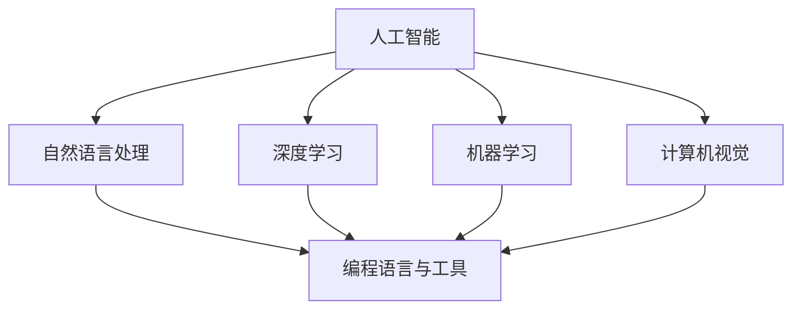

                 

# 程序员如何应对人工智能带来的挑战

## 1. 背景介绍

随着人工智能技术的迅猛发展，程序员正面临着前所未有的挑战。这些挑战不仅包括技术层面的革新，还涵盖了职业发展、技能提升、教育培训等方方面面。本文旨在从多个维度，深入探讨人工智能给程序员带来的挑战，并提出应对策略，帮助程序员更好地适应这一变革时代。

### 1.1 人工智能的兴起
近年来，人工智能(AI)技术在自然语言处理(NLP)、计算机视觉(CV)、语音识别(SR)等领域取得了显著进展。这些技术的突破，使得AI不仅在学术界引起了广泛关注，也在工业界引发了深刻变革。从自动驾驶汽车到智能客服，从医疗诊断到金融预测，AI技术正在被广泛应用于各行各业。

### 1.2 程序员的挑战
随着AI技术的普及，程序员面临的挑战也日益增多。一方面，AI的自动化和智能化正在逐渐取代一些传统的编程工作，如代码生成、数据清洗、错误修复等。另一方面，AI技术的发展也要求程序员掌握新的编程语言、工具和技术栈，如TensorFlow、PyTorch、Transformer等。这些新技能的学习和应用，对程序员提出了更高的要求。

## 2. 核心概念与联系

### 2.1 核心概念概述

为更好地理解程序员如何应对人工智能带来的挑战，本节将介绍几个密切相关的核心概念：

- 人工智能(AI)：涵盖机器学习、深度学习、自然语言处理、计算机视觉等领域的综合技术，旨在模拟人类智能行为。
- 自然语言处理(NLP)：研究如何让计算机理解和生成人类语言的技术，涉及文本分类、机器翻译、情感分析等任务。
- 深度学习(Deep Learning)：基于神经网络模型的机器学习技术，通过多层神经元进行特征提取和模式识别。
- 机器学习(Machine Learning)：通过算法和统计模型，使计算机具备学习和决策能力。
- 计算机视觉(Computer Vision)：研究如何让计算机识别和理解图像和视频，涉及图像分类、目标检测、图像分割等任务。
- 编程语言与工具：如Python、TensorFlow、PyTorch等，是程序员进行AI开发不可或缺的基石。

这些核心概念之间的逻辑关系可以通过以下Mermaid流程图来展示：



这个流程图展示了几者之间的联系和交互，帮助我们理解AI技术的全貌及其对程序员的影响。

## 3. 核心算法原理 & 具体操作步骤
### 3.1 算法原理概述

程序员应对人工智能带来的挑战，关键在于理解AI技术的核心原理和操作步骤。本节将从算法原理和具体操作步骤两个方面，进行详细介绍。

### 3.2 算法步骤详解

AI技术从数据获取、模型训练到应用部署，一般需要遵循以下步骤：

1. **数据准备**：收集和预处理数据，包括数据清洗、特征提取、数据增强等。
2. **模型选择**：根据任务需求选择合适的AI模型，如卷积神经网络(CNN)、循环神经网络(RNN)、Transformer等。
3. **模型训练**：使用GPU/TPU等硬件，通过梯度下降等优化算法，对模型进行训练。
4. **模型评估**：在验证集上评估模型性能，选择合适的超参数和损失函数。
5. **模型部署**：将训练好的模型部署到服务器或移动设备，进行实际应用。
6. **持续优化**：根据反馈数据，不断优化模型和算法，提升性能。

### 3.3 算法优缺点

AI技术的优势包括：

- 自动化高效：AI模型能够自动完成复杂任务，减少人工干预，提高效率。
- 泛化能力强：AI模型能够从大量数据中学习，具备较强的泛化能力。
- 智能决策：AI模型能够通过复杂计算，提供更加准确和智能的决策。

同时，AI技术也存在一些缺点：

- 数据依赖性强：AI模型需要大量高质量数据进行训练，数据获取和预处理成本较高。
- 可解释性差：黑盒模型难以解释其内部决策过程，缺乏透明性。
- 鲁棒性不足：AI模型在面对新数据和新场景时，容易发生误判和泛化失效。
- 资源消耗大：AI模型通常需要高性能硬件支持，计算和存储资源消耗较大。

### 3.4 算法应用领域

AI技术在多个领域得到了广泛应用，以下是几个典型应用：

- **自然语言处理**：机器翻译、情感分析、文本摘要、问答系统等。
- **计算机视觉**：图像分类、目标检测、人脸识别、自动驾驶等。
- **语音识别**：语音转文本、语音合成、语音命令等。
- **金融预测**：股票预测、风险评估、信用评分等。
- **医疗诊断**：疾病预测、影像分析、病理诊断等。
- **智能客服**：自动问答、情感分析、意图识别等。

## 4. 数学模型和公式 & 详细讲解 & 举例说明

### 4.1 数学模型构建

AI技术的核心在于构建数学模型，通过算法和数据对模型进行训练和优化。以神经网络为例，其核心数学模型包括前向传播、反向传播和优化算法等。

### 4.2 公式推导过程

以深度学习中的卷积神经网络(CNN)为例，其前向传播过程如下：

$$
y = h(\sigma(z))
$$

其中，$z = w^T x + b$，$x$ 为输入特征，$w$ 为卷积核，$b$ 为偏置项，$\sigma$ 为激活函数。

### 4.3 案例分析与讲解

以图像分类任务为例，假设有$N$个样本，每个样本$x_i$包含$m$个特征，卷积核$w_j$包含$k$个参数。前向传播过程如下：

$$
z_i = \sum_{j=1}^{k} w_j \cdot f(x_i) + b
$$

其中，$f$ 为卷积操作，$b$ 为偏置项。通过激活函数，将$z_i$转换为输出$y_i$：

$$
y_i = \sigma(z_i)
$$

根据损失函数，反向传播计算梯度，更新模型参数：

$$
\Delta w_j = \frac{\partial L}{\partial w_j}
$$

其中，$L$ 为损失函数，如交叉熵损失、均方误差损失等。

## 5. 项目实践：代码实例和详细解释说明
### 5.1 开发环境搭建

要进行AI项目实践，首先需要搭建好开发环境。以下是使用Python和TensorFlow进行开发的环境配置流程：

1. 安装Anaconda：从官网下载并安装Anaconda，用于创建独立的Python环境。
2. 创建并激活虚拟环境：
```bash
conda create -n ai-env python=3.8 
conda activate ai-env
```

3. 安装TensorFlow：根据CUDA版本，从官网获取对应的安装命令。例如：
```bash
conda install tensorflow -c tf -c conda-forge
```

4. 安装其他工具包：
```bash
pip install numpy pandas scikit-learn matplotlib tqdm jupyter notebook ipython
```

完成上述步骤后，即可在`ai-env`环境中开始AI项目实践。

### 5.2 源代码详细实现

下面以图像分类任务为例，给出使用TensorFlow进行AI项目开发的PyTorch代码实现。

首先，定义模型和数据预处理函数：

```python
import tensorflow as tf
from tensorflow.keras import datasets, layers, models

# 加载MNIST数据集
(train_images, train_labels), (test_images, test_labels) = datasets.mnist.load_data()

# 数据预处理
train_images = train_images / 255.0
test_images = test_images / 255.0

# 模型定义
model = models.Sequential()
model.add(layers.Conv2D(32, (3, 3), activation='relu', input_shape=(28, 28, 1)))
model.add(layers.MaxPooling2D((2, 2)))
model.add(layers.Flatten())
model.add(layers.Dense(128, activation='relu'))
model.add(layers.Dense(10, activation='softmax'))

# 编译模型
model.compile(optimizer='adam',
              loss='sparse_categorical_crossentropy',
              metrics=['accuracy'])

# 训练模型
model.fit(train_images, train_labels, epochs=5, 
          validation_data=(test_images, test_labels))
```

然后，定义评估函数：

```python
def evaluate(model, test_images, test_labels):
    test_loss, test_acc = model.evaluate(test_images, test_labels)
    print(f'Test accuracy: {test_acc:.2f}')
```

最后，启动训练流程并在测试集上评估：

```python
model.fit(train_images, train_labels, epochs=5, 
          validation_data=(test_images, test_labels))
evaluate(model, test_images, test_labels)
```

以上就是使用TensorFlow进行图像分类任务开发的完整代码实现。可以看到，TensorFlow提供了丰富的API和工具，使得模型定义和训练过程变得简洁高效。

### 5.3 代码解读与分析

让我们再详细解读一下关键代码的实现细节：

- `keras.Sequential`：构建序贯模型，通过`add`方法添加卷积层、池化层、全连接层等。
- `Conv2D`：定义二维卷积层，通过指定卷积核大小、激活函数等参数。
- `MaxPooling2D`：定义最大池化层，进行特征降维。
- `Flatten`：将二维特征图展开为向量，便于输入全连接层。
- `Dense`：定义全连接层，指定神经元数量和激活函数。
- `compile`：编译模型，指定优化器、损失函数和评估指标。
- `fit`：训练模型，指定训练集和验证集，设置训练轮数。
- `evaluate`：评估模型，计算损失和准确率。

可以看到，TensorFlow的API设计简洁明了，能够方便地实现复杂的神经网络模型。通过合理使用TensorFlow的高级API，可以大大降低模型实现的复杂度，提高开发效率。

## 6. 实际应用场景

### 6.1 智能客服系统

基于AI技术的智能客服系统，能够自动处理大量客户咨询，减少人工客服的压力，提高服务效率。通过微调AI模型，能够进一步提升智能客服的准确性和自然流畅度，提升客户满意度。

在技术实现上，可以收集企业内部的历史客服对话记录，将问题和最佳答复构建成监督数据，在此基础上对预训练的AI模型进行微调。微调后的模型能够自动理解用户意图，匹配最合适的答案模板进行回复。对于客户提出的新问题，还可以接入检索系统实时搜索相关内容，动态组织生成回答。如此构建的智能客服系统，能大幅提升客户咨询体验和问题解决效率。

### 6.2 金融预测

AI技术在金融领域的应用越来越广泛，通过预测股票趋势、评估信用风险、推荐投资组合等，帮助金融机构提高决策效率和风险控制能力。

在金融预测任务中，AI模型能够从历史数据中学习到市场趋势、经济指标等特征，通过时间序列分析和机器学习模型，预测未来的股市波动、利率变化等。这些预测结果可以为投资者提供决策参考，降低投资风险。

### 6.3 个性化推荐系统

个性化推荐系统通过分析用户的兴趣和行为数据，向用户推荐相关商品或内容，提升用户体验和转化率。通过AI模型，可以更加准确地理解和预测用户的兴趣，提供更加个性化的推荐。

在个性化推荐任务中，AI模型能够从用户的历史浏览、点击、评分等数据中学习到用户的兴趣偏好，通过协同过滤、内容推荐等算法，生成推荐列表。这些推荐结果可以显著提升用户的满意度，增加平台的用户粘性。

### 6.4 未来应用展望

随着AI技术的不断进步，未来将有更多行业和场景得到应用，带来更深远的影响。

- **医疗**：AI模型可以通过分析医疗影像、病历数据等，辅助医生进行诊断和治疗决策，提高医疗服务的质量和效率。
- **教育**：AI技术可以帮助学生个性化学习，提供智能辅导、作业批改等服务，提升教育质量和公平性。
- **城市管理**：AI模型能够分析交通流量、环境监测等数据，提升城市管理和应急响应能力，构建更加智能化、高效的城市。
- **自动驾驶**：AI技术在自动驾驶领域的应用前景广阔，通过感知、决策和控制等模块，实现无人驾驶汽车的安全行驶。

## 7. 工具和资源推荐
### 7.1 学习资源推荐

为了帮助程序员系统掌握AI技术，这里推荐一些优质的学习资源：

1. 《深度学习》系列课程：由斯坦福大学Andrew Ng教授主讲，涵盖深度学习的基础知识和实践应用。
2. 《TensorFlow官方文档》：TensorFlow的官方文档，提供详细的API文档和案例代码，是学习TensorFlow不可或缺的资源。
3. 《PyTorch官方文档》：PyTorch的官方文档，提供丰富的模型和工具示例，适合入门和进阶学习。
4. 《Python机器学习》书籍：Scikit-Learn、TensorFlow、PyTorch等库的使用指南，适合深入学习。
5. Kaggle竞赛平台：提供丰富的数据集和算法竞赛，帮助程序员实战练习。

通过学习这些资源，相信你一定能够快速掌握AI技术，并用于解决实际的业务问题。

### 7.2 开发工具推荐

高效的开发离不开优秀的工具支持。以下是几款用于AI开发常用的工具：

1. Jupyter Notebook：交互式编程环境，支持多种语言和库，适合做数据分析和模型调试。
2. GitHub：代码托管平台，提供代码版本控制和团队协作功能，适合代码共享和项目管理。
3. Google Colab：基于Google Cloud的在线Jupyter Notebook环境，免费提供GPU/TPU算力，方便开发者快速实验和分享学习笔记。
4. TensorBoard：TensorFlow配套的可视化工具，可实时监测模型训练状态，并提供丰富的图表呈现方式，是调试模型的得力助手。
5. Weights & Biases：模型训练的实验跟踪工具，可以记录和可视化模型训练过程中的各项指标，方便对比和调优。

合理利用这些工具，可以显著提升AI项目的开发效率，加快创新迭代的步伐。

### 7.3 相关论文推荐

AI技术的快速发展离不开学界的持续研究。以下是几篇奠基性的相关论文，推荐阅读：

1. AlphaGo Zero：通过自我对弈训练，无需人类数据，达到顶尖的围棋水平。
2. GAN：生成对抗网络，能够生成逼真的图像、视频等数据，推动深度学习的发展。
3. ImageNet：大规模图像识别数据集，推动了计算机视觉的突破性进展。
4. Transformer模型：引入了自注意力机制，提升了自然语言处理的效果。
5. RNN和LSTM：循环神经网络和长短时记忆网络，解决了时间序列数据处理问题。

这些论文代表了大数据、深度学习等技术的发展脉络。通过学习这些前沿成果，可以帮助研究者把握学科前进方向，激发更多的创新灵感。

## 8. 总结：未来发展趋势与挑战
### 8.1 研究成果总结

AI技术的快速发展，使得程序员面临着前所未有的挑战和机遇。通过深入学习AI技术，程序员能够掌握更高效、更智能的编程技能，提升自身的职业竞争力。

### 8.2 未来发展趋势

未来AI技术的发展将呈现以下几个趋势：

1. **自动化程度提升**：AI技术将进一步自动化编程、数据分析等任务，减少人工干预，提高工作效率。
2. **多模态融合**：AI模型将逐步整合视觉、语音、文本等多种模态数据，提升对复杂场景的理解能力。
3. **跨领域应用**：AI技术将在更多行业和领域得到应用，推动传统行业的数字化转型。
4. **人机协同**：AI技术将与人类协同工作，发挥各自优势，提升整体智能水平。
5. **个性化服务**：通过AI模型，能够实现更加个性化的服务，提升用户体验。

### 8.3 面临的挑战

尽管AI技术带来了许多机遇，但也存在一些挑战：

1. **数据隐私和安全**：AI模型需要大量数据进行训练，可能涉及用户隐私信息，如何保护数据安全是一个重要问题。
2. **模型公平性和透明性**：AI模型可能存在偏见和歧视，如何确保模型公平透明，避免误判和歧视是一个重要问题。
3. **计算资源消耗**：AI模型通常需要高性能硬件支持，计算和存储资源消耗较大，如何提高模型效率是一个重要问题。
4. **模型可解释性**：AI模型通常是黑盒模型，难以解释其内部决策过程，缺乏透明性，如何提高模型可解释性是一个重要问题。
5. **跨领域应用能力**：AI模型在不同领域应用时，可能出现泛化性能下降等问题，如何提高模型泛化能力是一个重要问题。

### 8.4 研究展望

未来AI技术的发展需要关注以下几个方面：

1. **数据隐私保护**：通过联邦学习、差分隐私等技术，保护数据隐私和安全。
2. **模型公平透明**：通过引入伦理导向的评估指标，过滤和惩罚有偏见、有害的输出倾向。
3. **模型效率提升**：通过模型压缩、稀疏化存储等技术，提高模型效率，降低计算和存储资源消耗。
4. **模型可解释性增强**：通过引入因果分析、博弈论等方法，增强模型的可解释性和透明性。
5. **模型泛化能力提升**：通过多模态数据融合、跨领域迁移学习等方法，提高模型的泛化能力和应用范围。

通过不断创新和突破，相信AI技术将为程序员带来更多的机遇和挑战，推动技术的持续进步和应用发展。

## 9. 附录：常见问题与解答

**Q1：如何学习AI技术？**

A: 学习AI技术需要掌握编程语言、数据科学和机器学习等基础知识。可以通过以下步骤进行学习：
1. 学习Python、R等编程语言，熟悉数据处理和分析。
2. 学习数据科学基础，掌握数据清洗、特征工程等技能。
3. 学习机器学习算法和模型，理解模型训练和评估过程。
4. 学习深度学习框架，如TensorFlow、PyTorch等，掌握模型实现和优化技巧。
5. 参与开源项目和竞赛，积累实战经验。

**Q2：AI技术对程序员有哪些影响？**

A: AI技术对程序员的影响包括：
1. 需要学习新的编程语言和技术栈，如Python、TensorFlow、PyTorch等。
2. 需要掌握新的编程技能，如数据预处理、模型训练、模型评估等。
3. 需要关注新的应用场景和业务需求，探索新的编程解决方案。
4. 需要不断学习和更新知识，保持技术领先地位。

**Q3：如何应对AI技术带来的挑战？**

A: 应对AI技术带来的挑战需要具备以下能力：
1. 持续学习，不断更新知识和技术。
2. 掌握多模态数据处理和融合技术。
3. 提升模型可解释性和透明性。
4. 保护数据隐私和安全。
5. 探索跨领域应用，提升模型泛化能力。

**Q4：如何选择合适的AI框架？**

A: 选择合适的AI框架需要考虑以下几个因素：
1. 框架易用性和功能丰富程度。
2. 框架的性能和效率。
3. 框架的社区支持和文档资料。
4. 框架的扩展性和兼容性。
5. 框架的生态系统和工具支持。

根据实际需求和技术栈，选择合适的AI框架，能够提高开发效率和模型性能。

通过不断学习、实践和创新，程序员能够更好地应对人工智能带来的挑战，发挥AI技术的优势，推动技术的持续进步和应用发展。

