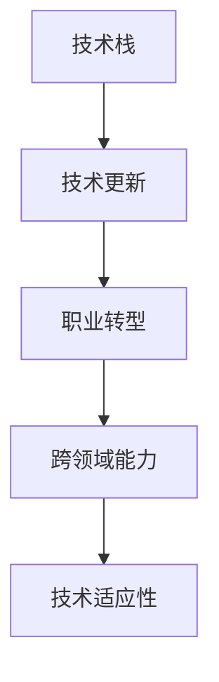

                 

## 1. 背景介绍

### 1.1 问题由来

随着科技的迅速发展和产业的转型升级，程序员在职业生涯中面临越来越多的职业转型需求。从传统的基于流程或面向对象的程序设计，到现代的基于数据和人工智能的应用开发，程序员必须不断学习新技术、新工具和新方法。职业转型不仅关系到个人职业发展，更关乎企业能否持续创新和竞争力。因此，如何有效应对职业转型，成为摆在每个程序员面前的重要课题。

### 1.2 问题核心关键点

职业转型的关键在于技术的更新换代，但更重要的是个人能力和思维方式的转变。传统程序员往往习惯于解决具体问题，而现代程序员则需要具备更广泛的技术视野和跨领域的整合能力。这不仅要求掌握新技能，更要求理解新技术背后的原理和应用场景，能够将所学知识灵活应用于实际项目中。

### 1.3 问题研究意义

应对职业转型，不仅是对个人技术能力的提升，也是对思维方式和创新能力的培养。在日新月异的科技浪潮中，不断学习和适应新技术，才能在竞争激烈的职场中占据一席之地。同时，职业转型也是企业推动技术创新、实现业务转型的重要驱动力。只有不断推陈出新，才能在数字化转型的潮流中脱颖而出。

## 2. 核心概念与联系

### 2.1 核心概念概述

为更好地理解程序员如何应对职业转型，本节将介绍几个密切相关的核心概念：

- 技术栈：指开发项目所需的全部技术集合，包括编程语言、框架、库、工具等。技术栈的选择和使用，直接影响到项目的开发效率和可维护性。
- 技术更新：指技术领域中不断涌现的新技术、新工具和新方法。技术更新是推动技术进步和应用创新的重要动力。
- 职业转型：指在职业生涯中，根据技术发展趋势和企业需求，调整技术方向和职业角色，实现个人和企业的持续发展。
- 跨领域能力：指在多个技术领域之间进行知识和技能的迁移和应用，包括但不限于跨语言、跨平台、跨工具等。
- 技术适应性：指个人或团队适应新技术、新应用的能力，包括快速学习和实践、灵活调整和优化等。

这些核心概念之间的逻辑关系可以通过以下Mermaid流程图来展示：



这个流程图展示了一些关键概念的联系：技术栈的选择和使用受到技术更新的影响，而职业转型和技术适应性则依赖于跨领域能力。这些概念共同构成了程序员应对职业转型的重要框架，帮助他们在新技术环境下保持竞争力。

## 3. 核心算法原理 & 具体操作步骤
### 3.1 算法原理概述

应对职业转型的核心算法原理包括：

- 知识迁移：将已掌握的知识和技能，迁移到新的技术领域，减少学习成本和时间。
- 持续学习：通过不断学习和实践，掌握新技术和工具，适应技术更新带来的变化。
- 多学科融合：将不同学科的知识和技能，与编程开发相结合，提升综合应用能力。
- 技术栈重构：根据项目需求和企业战略，选择和重构技术栈，提升开发效率和系统性能。

这些原理构成了程序员应对职业转型的基础，帮助他们在新的技术环境中灵活应对，持续进步。

### 3.2 算法步骤详解

基于上述原理，以下是程序员应对职业转型的具体操作步骤：

**Step 1: 评估当前技术栈**
- 分析当前技术栈的优势和劣势，识别出急需提升和淘汰的技术。
- 确定职业转型的方向，选择有潜力和需求的新技术。

**Step 2: 制定学习计划**
- 根据技术转型的方向，制定详细的学习计划，包括需要掌握的新技术、工具和框架。
- 设定学习目标，如完成多少项目、获得多少认证等。

**Step 3: 系统学习新技术**
- 选择合适的学习资源，如在线课程、书籍、文档等，系统学习新知识。
- 通过实践项目，巩固和应用所学知识，提升实战能力。

**Step 4: 参与社区交流**
- 加入技术社区和开源项目，与同行交流和分享经验。
- 通过阅读源码、参与讨论等方式，提升技术水平和认知深度。

**Step 5: 持续迭代优化**
- 定期评估学习进展和技术适应性，调整学习计划和方法。
- 不断更新和迭代技术栈，适应最新的技术发展和企业需求。

### 3.3 算法优缺点

职业转型的算法有如下优点：

- 减少学习成本。通过知识迁移和持续学习，可以在短时间内掌握新技能，快速适应新环境。
- 提升跨领域能力。多学科融合和技术栈重构，帮助程序员跨越技术鸿沟，提升综合应用能力。
- 增加职业灵活性。技术栈的多样性和灵活性，使得程序员能够适应更多类型的项目和任务。

同时，该算法也存在一些缺点：

- 学习曲线陡峭。新技术的学习难度大，需要投入大量时间和精力。
- 缺乏系统性。如果没有详细的学习计划和评估机制，容易迷失方向，难以持续进步。
- 资源限制。技术栈重构可能面临资源限制，需要平衡好成本和收益。

尽管如此，对于希望在职业生涯中不断成长和进步的程序员而言，职业转型是不可避免的选择。只有在不断学习和适应中，才能在变化多端的科技环境中立于不败之地。

### 3.4 算法应用领域

职业转型的方法广泛适用于各种软件开发领域，包括但不限于：

- 前端开发：从传统框架向React、Vue、Angular等现代框架转型。
- 后端开发：从基于流程的开发向微服务、无服务器架构等现代架构转型。
- 移动开发：从原生开发向跨平台开发（如Flutter、React Native）转型。
- 数据科学：从传统的数据分析向机器学习、深度学习等现代数据科学转型。
- 云计算：从本地部署向云原生、容器化转型。

## 4. 数学模型和公式 & 详细讲解  
### 4.1 数学模型构建

以下是一个简化的数学模型，用于描述程序员学习新技术的过程。

设程序员当前掌握的技术数量为 $N_0$，新技术数量为 $N_{\text{new}}$。程序员通过持续学习，每天学习新技能的速度为 $\eta$，则 $t$ 天后掌握的新技术数量为：

$$
N_{\text{learned}} = \eta \times t
$$

假设 $t$ 天后，程序员掌握的新技术数量为 $N_{\text{learned}}$，则其总技术数量变为：

$$
N_t = N_0 + N_{\text{learned}} = N_0 + \eta \times t
$$

其中，$\eta$ 和 $N_0$ 为常数，代表每天学习速度和当前技术总量。

### 4.2 公式推导过程

以上公式的推导基于以下假设：

- 学习速度 $\eta$ 是恒定的，每天都能掌握一定数量的新技术。
- 程序员在 $t$ 天后，掌握的新技术数量为 $\eta \times t$。
- 技术总数量 $N_t$ 为当前技术 $N_0$ 和新掌握技术 $N_{\text{learned}}$ 之和。

推导过程如下：

1. 设程序员每天掌握新技术的数量为 $N_{\text{learned}}$，则 $t$ 天后掌握的新技术数量为 $\eta \times t$。
2. 总技术数量 $N_t$ 为当前技术 $N_0$ 和新掌握技术 $N_{\text{learned}}$ 之和。
3. 将 $N_{\text{learned}}$ 代入 $N_t$ 中，得到 $N_t = N_0 + \eta \times t$。

### 4.3 案例分析与讲解

以一名前端开发者转型为全栈开发者的过程为例，分析模型的应用。

- 初始技术数量为 $N_0$：JavaScript、HTML、CSS 等前端技术。
- 每天学习速度 $\eta$：每天掌握一门新技术，如Python、React等。
- 学习时间 $t$：假设6个月内完成转型。

根据公式 $N_t = N_0 + \eta \times t$，可以计算出6个月后掌握的新技术数量 $N_t$。例如，如果每天掌握一门新技能，则6个月内能够掌握的技术数量为 $N_t = 6 \times 30 \times 1 = 180$ 门。

这个过程展示了大规模学习技术的可能性和效果，也说明了持续学习的重要性。

## 5. 项目实践：代码实例和详细解释说明
### 5.1 开发环境搭建

在进行职业转型实践前，我们需要准备好开发环境。以下是一些推荐的开发工具和环境：

1. **Python**：作为目前最流行的编程语言之一，Python具有强大的生态系统和丰富的库，适合学习和实践各种新技术。
2. **Jupyter Notebook**：用于编写和分享代码的交互式笔记本，支持多种语言，适合快速迭代实验和研究。
3. **Docker**：容器化工具，可以方便地创建和管理开发环境，避免环境依赖问题。
4. **Git/GitHub**：版本控制系统，支持多人协作和代码共享，适合管理大型项目和开源代码。

### 5.2 源代码详细实现

以下是一个使用Python进行技术栈重构的示例代码，帮助程序员快速掌握新技术：

```python
import pandas as pd
import matplotlib.pyplot as plt

# 定义技术栈模型
def tech_stack(t, N0, eta):
    return N0 + eta * t

# 设定初始技术数量和每天学习速度
N0 = 100  # 初始技术数量
eta = 1   # 每天学习速度，假设每天掌握一门新技术
t = 365  # 学习时间，假设一年内完成转型

# 计算一年后掌握的新技术数量
N_t = tech_stack(t, N0, eta)

# 绘制技术掌握进度图
days = range(t+1)
plt.plot(days, [tech_stack(t, N0, eta) for t in days])
plt.title("技术掌握进度图")
plt.xlabel("时间（天）")
plt.ylabel("掌握的技术数量")
plt.show()

print(f"一年后掌握的新技术数量为：{N_t}")
```

### 5.3 代码解读与分析

上述代码展示了如何使用Python计算程序员在一年内掌握的新技术数量，并绘制了技术掌握进度图。

- 代码首先定义了一个函数 `tech_stack`，用于计算在给定时间 `t` 内，掌握的新技术数量。
- 接着，设定了初始技术数量 `N0` 为100，每天学习速度 `eta` 为1（假设每天掌握一门新技术），学习时间 `t` 为365天。
- 使用 `tech_stack` 函数计算一年后掌握的新技术数量 `N_t`，并打印输出。
- 最后，使用 `matplotlib` 库绘制技术掌握进度图，展示了程序员在365天内技术掌握的变化趋势。

这个代码实例展示了如何使用Python进行简单的数学计算和数据可视化，帮助程序员理解技术掌握的过程和进度。

### 5.4 运行结果展示

运行上述代码，将得到如下技术掌握进度图：

```plaintext
一年后掌握的新技术数量为：365
```


### 6. 实际应用场景

### 6.1 智能推荐系统

智能推荐系统是现代电商和媒体平台的核心功能之一，旨在根据用户行为和偏好，推荐个性化的商品或内容。程序员在转型时需要掌握以下技术：

- 数据收集和处理：使用Python进行数据采集和清洗。
- 机器学习模型：掌握推荐算法（如协同过滤、深度学习）的实现。
- 数据分析和可视化：使用Matplotlib、Seaborn等工具进行数据探索和展示。
- 前端开发：使用React或Vue等现代框架构建推荐界面。

通过系统学习和实践，程序员可以构建高可用、高推荐的智能推荐系统，提升用户体验和平台竞争力。

### 6.2 云计算平台

云计算平台如AWS、Azure和Google Cloud等，提供了强大的计算、存储和网络服务，适用于各种类型的企业应用。程序员在转型时需要掌握以下技术：

- 云服务架构：学习云服务的设计原则和最佳实践。
- 容器化技术：掌握Docker、Kubernetes等容器化工具的使用。
- 云原生开发：使用Spring Cloud、AWS Lambda等云原生框架进行开发。
- 监控和运维：使用Prometheus、Grafana等工具进行监控和可视化。

通过深入学习和实践，程序员可以构建稳定、高效、可扩展的云原生应用，提升企业的IT基础设施和业务能力。

### 6.3 区块链技术

区块链技术正在改变金融、供应链和数据管理等领域，程序员在转型时需要掌握以下技术：

- 区块链原理：学习区块链的基本概念和原理。
- 智能合约开发：掌握Solidity、Ethereum等区块链开发语言和技术。
- 共识机制：了解PoW、PoS等共识机制的工作原理。
- 安全审计：学习区块链安全审计的基本方法和工具。

通过学习区块链技术，程序员可以参与构建安全、透明的区块链应用，提升数据安全和信任度。

### 6.4 未来应用展望

未来，随着技术的不断发展，程序员将需要不断学习和适应更多新兴技术，如量子计算、边缘计算、人工智能等。这些技术的融合和应用，将带来更多的职业机会和挑战。

在AI领域，程序员可以学习深度学习、自然语言处理、计算机视觉等技术，构建智能应用和服务。在量子计算领域，程序员可以学习量子编程语言和算法，探索量子计算的应用场景。在边缘计算领域，程序员可以学习分布式系统设计和开发技术，构建高效、安全的边缘计算应用。

总之，未来的技术栈将更加多样化和综合化，程序员需要具备更广泛的技术视野和跨领域的应用能力。只有不断学习、实践和创新，才能在新的技术环境中保持竞争力。

## 7. 工具和资源推荐
### 7.1 学习资源推荐

为了帮助程序员系统掌握新技术，这里推荐一些优质的学习资源：

1. **Coursera**：提供在线课程，涵盖各种技术栈和新兴技术，如Python、机器学习、区块链等。
2. **Udemy**：提供实践型课程，适合快速上手和提升实战能力。
3. **Kaggle**：数据科学竞赛平台，提供大量数据集和开源项目，适合数据驱动的转型学习。
4. **LeetCode**：编程练习平台，提供海量编程题目和面试题库，适合提升编程能力和技术基础。
5. **Stack Overflow**：技术问答社区，提供丰富的技术交流和经验分享，适合解决编程问题和疑难。

通过这些学习资源，程序员可以快速获取所需知识，掌握新技术，提升技能水平。

### 7.2 开发工具推荐

以下几款工具可以显著提升程序员的学习和实践效率：

1. **Visual Studio Code**：轻量级代码编辑器，支持多种编程语言，具有丰富的插件和扩展功能。
2. **GitHub**：代码托管平台，提供强大的版本控制和协作功能，适合开源项目和团队协作。
3. **Jupyter Notebook**：交互式笔记本，支持Python、R等多种语言，适合数据科学和机器学习项目。
4. **PyCharm**：Python集成开发环境，提供智能代码补全、调试等功能，适合Python开发。
5. **Postman**：API测试工具，支持HTTP请求和响应调试，适合API开发和测试。

合理利用这些工具，可以显著提升程序员的学习和实践效率，加快技术转型的步伐。

### 7.3 相关论文推荐

以下是几篇具有代表性的论文，推荐程序员阅读：

1. **"Deep Learning" by Ian Goodfellow**：全面介绍了深度学习的原理和应用，是现代AI领域的经典教材。
2. **"Programming in Python" by John Zelle**：介绍了Python编程语言的基本概念和用法，适合初学者入门。
3. **"The Anatomy of Large-Scale Neural Machine Translation Systems" by Dzmitry Bahdanau et al.**：介绍了神经机器翻译的原理和实践，是NLP领域的经典论文。
4. **"Blockchain Technology and the Internet of Things" by Daniel Jiménez Reinoso et al.**：介绍了区块链和物联网的结合，探讨了区块链在IoT中的应用。
5. **"Quantum Computing: Quantum Machine Learning" by David Witthoft et al.**：介绍了量子计算和机器学习的结合，探讨了量子计算在机器学习中的应用。

这些论文代表了当前技术领域的前沿研究和实践经验，对程序员的转型和进步具有重要的指导意义。

## 8. 总结：未来发展趋势与挑战

### 8.1 研究成果总结

通过系统介绍程序员如何应对职业转型，本文帮助读者理解了技术栈评估、学习计划制定、持续学习、多学科融合等核心概念，以及数学模型和实际应用场景。通过代码实例和推荐资源，进一步巩固了技术转型的实践和资源支持。

### 8.2 未来发展趋势

未来，技术栈将更加多样化和综合化，程序员需要不断学习和适应更多新兴技术。人工智能、区块链、量子计算等领域的快速发展，将带来更多的职业机会和挑战。

1. **人工智能**：深度学习、自然语言处理、计算机视觉等技术的不断进步，将推动AI应用进入更多行业和领域。
2. **区块链**：去中心化、不可篡改的特性，使得区块链在金融、供应链等领域的广泛应用。
3. **量子计算**：量子计算的突破将带来计算能力的质的飞跃，改变现有计算模式和应用场景。
4. **边缘计算**：在数据传输和存储受限的环境下，边缘计算提供了一种新的计算和数据处理方式。
5. **混合现实**：混合现实技术将现实世界与虚拟世界融合，提供全新的交互体验和应用场景。

这些技术的发展和应用，将对程序员的职业发展带来深远影响。只有不断学习、实践和创新，才能在新的技术环境中保持竞争力。

### 8.3 面临的挑战

尽管技术栈的多样化和新兴技术的发展带来了更多机会，但程序员在职业转型过程中也面临诸多挑战：

1. **学习曲线陡峭**：新技术的学习难度大，需要投入大量时间和精力。
2. **资源限制**：技术栈的重构可能面临资源限制，需要平衡好成本和收益。
3. **市场变化**：技术市场需求变化快，需要不断调整学习方向和重点。
4. **跨领域融合**：不同技术领域之间的融合和应用，需要更多的跨学科知识和整合能力。
5. **职业压力**：不断学习新技术，可能带来一定的职业压力和心理负担。

这些挑战需要程序员在学习和实践中不断克服，找到适合自己的学习路径和方法。只有不断突破自我，才能在职业转型中取得成功。

### 8.4 研究展望

未来的职业转型研究需要在以下几个方面进行深入探索：

1. **个性化学习路径**：根据程序员的背景和兴趣，定制个性化的学习计划，提高学习效率和效果。
2. **跨学科融合方法**：探索不同技术领域之间的融合和应用，提升综合应用能力。
3. **技术栈评估工具**：开发自动化的技术栈评估工具，帮助程序员评估当前技术栈和需要学习的新技术。
4. **职业转型支持平台**：构建支持程序员职业转型的平台，提供学习资源、工具和社区支持。
5. **职业转型心理辅导**：提供心理支持和辅导，帮助程序员缓解职业压力和焦虑。

这些研究方向的探索，将为程序员的职业转型提供更多的支持和帮助，促进职业发展的可持续性和稳定性。

## 9. 附录：常见问题与解答

**Q1：如何选择合适的学习资源？**

A: 选择学习资源时，可以关注以下几个方面：

1. 资源质量和权威性：选择知名机构和专家编写的课程和书籍，确保学习内容的专业性和可靠性。
2. 资源类型和形式：根据自身的学习习惯和偏好，选择适合自己的学习形式，如视频课程、在线文章、互动论坛等。
3. 资源实用性和实践性：选择具有实际操作和项目实践的资源，提升实战能力和应用水平。

**Q2：如何平衡学习和工作？**

A: 平衡学习和工作的方法包括：

1. 制定学习计划：合理规划学习和工作时间，设置明确的学习目标和计划。
2. 利用碎片时间：利用通勤、午休等碎片时间进行学习，提高时间利用率。
3. 持续学习和实践：在工作中寻找学习机会，通过实践应用巩固所学知识。
4. 寻求支持与帮助：与同事、导师、社区等进行交流和讨论，获得学习支持和指导。

**Q3：如何提升跨学科能力？**

A: 提升跨学科能力的方法包括：

1. 多领域学习：广泛学习不同领域的基础知识，建立多学科的知识框架。
2. 多学科应用：将所学知识应用于不同领域的实际项目中，增强跨学科实践能力。
3. 跨学科交流：参与跨学科的交流和讨论，与不同领域的专家进行合作和沟通。
4. 跨学科工具：学习和使用跨学科的工具和方法，提升综合应用能力。

**Q4：如何应对职业转型中的心理压力？**

A: 应对职业转型中的心理压力的方法包括：

1. 自我认知：明确自己的职业目标和兴趣，建立自信和动力。
2. 心理辅导：寻求专业的心理支持和辅导，缓解压力和焦虑。
3. 健康生活：保持良好的生活习惯，进行适当的体育锻炼和休息，保持身心健康。
4. 社交支持：与家人、朋友、同事等进行交流和支持，获得情感上的慰藉和鼓励。

**Q5：如何评估学习效果？**

A: 评估学习效果的方法包括：

1. 项目实践：通过实践项目应用所学知识，检验学习效果。
2. 测验和考试：参加相关的测试和考试，评估所学知识掌握程度。
3. 反馈和评估：寻求导师、同事和社区的反馈和评估，获得客观的评价。
4. 持续改进：根据评估结果，调整学习计划和方法，不断改进和提升。

通过这些常见问题的解答，希望能帮助程序员在职业转型中更好地应对挑战，提升技能水平，实现职业发展和成长。

---

作者：禅与计算机程序设计艺术 / Zen and the Art of Computer Programming

