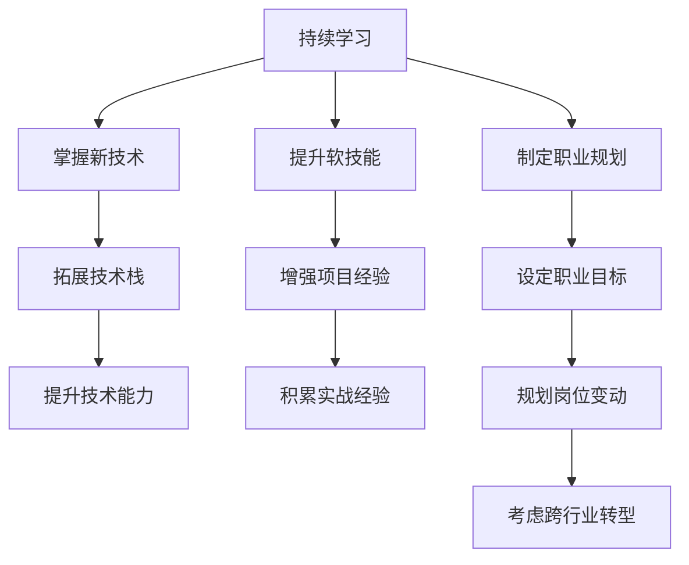

                 

## 1. 背景介绍

在日新月异的科技浪潮中，程序员们面临着前所未有的挑战与机遇。随着人工智能、大数据、云计算等技术的飞速发展，行业对技术人才的需求也变得更加多样化和复杂化。如何在这一背景下建立并维持长期的职业竞争力，成为每一个程序员必须面对的问题。本文将从技术、软技能、职业规划等角度，深入探讨程序员如何通过不断学习和提升，把握职业发展的脉搏。

## 2. 核心概念与联系

### 2.1 核心概念概述

本文的核心概念主要围绕以下几个方面展开：

- **持续学习（Continuous Learning）**：指通过不断学习新技术、新知识来适应技术变迁，保持竞争力的过程。
- **软技能（Soft Skills）**：包括沟通能力、团队合作、问题解决等非技术能力，这些是提升职业素养的关键。
- **技术栈（Technical Stack）**：程序员需要掌握的编程语言、框架、工具等技术能力。
- **项目经验（Project Experience）**：实际参与项目的过程，通过实践积累经验和技术能力。
- **职业规划（Career Planning）**：对职业发展路径的规划与调整，包括职业目标设定、岗位变动、跨行业转型等。

### 2.2 核心概念原理和架构的 Mermaid 流程图



## 3. 核心算法原理 & 具体操作步骤

### 3.1 算法原理概述

程序员职业竞争力的提升，本质上是一个通过持续学习和技能提升，逐步构建并优化个人技术栈和软技能体系的过程。这一过程可以通过以下几个步骤来实施：

1. **识别技术差距**：评估自身与市场、行业标准之间的技术差距。
2. **制定学习计划**：基于技术差距，制定系统的学习计划，包括新技术的学习路径和软技能提升的措施。
3. **实施学习计划**：通过在线课程、技术博客、开源项目等多种方式实施学习计划。
4. **应用与反馈**：将所学知识应用到实际项目中，通过反馈不断优化学习路径和技能提升策略。

### 3.2 算法步骤详解

#### 3.2.1 技术差距评估

评估技术差距是建立长期职业竞争力的第一步。可以通过以下几个维度来评估：

- **技术栈覆盖度**：当前掌握的编程语言、框架、库等的覆盖度和深度。
- **技术前沿了解**：对最新技术趋势、工具和框架的了解程度。
- **实际项目经验**：在实际项目中应用新技术的能力和经验。
- **问题解决能力**：面对技术难题时的分析与解决能力。

#### 3.2.2 学习计划制定

制定学习计划时，可以从以下几个方面入手：

- **目标设定**：明确短期和长期职业目标，如掌握一门新语言、参与一个大型项目等。
- **路径规划**：规划学习新技术的路径，如通过在线课程、书籍、开源项目等方式。
- **时间管理**：制定每日或每周的学习计划，并保持一定的学习节奏。

#### 3.2.3 学习计划实施

实施学习计划时，可以采取以下策略：

- **在线资源利用**：利用Coursera、Udacity、edX等在线平台进行学习。
- **参与开源项目**：通过GitHub等平台参与开源项目，积累实战经验。
- **技术博客与论坛**：通过博客撰写和参与技术论坛讨论，分享学习心得，巩固所学知识。
- **社区交流**：加入技术社区，与同行交流技术经验，解决实际问题。

#### 3.2.4 应用与反馈

通过实践来验证和提升学习效果是关键。可以采取以下措施：

- **参与项目**：将所学新技术应用到实际项目中，提升解决实际问题的能力。
- **代码评审与反馈**：通过代码评审和反馈，了解自身技术水平和不足。
- **持续优化**：根据反馈不断调整学习计划和技术提升策略，确保学习效果最大化。

### 3.3 算法优缺点

**优点**：

- **适应性强**：能够及时跟上技术发展，保持竞争力。
- **理论与实践结合**：通过实际操作提升问题解决能力。
- **持续改进**：通过反馈不断优化学习路径和技术栈。

**缺点**：

- **时间投入大**：需要持续投入大量时间和精力进行学习和实践。
- **学习曲线陡峭**：部分新技术的掌握可能需要较长时间。
- **资源需求高**：需要较高的学习资源和技术环境支持。

### 3.4 算法应用领域

基于持续学习和技能提升的算法原理，适用于各个技术领域和行业。特别是在快速发展的AI、大数据、云计算等领域，这一算法尤为关键。通过不断学习和技能提升，程序员能够保持竞争力，适应行业的快速变化。

## 4. 数学模型和公式 & 详细讲解 & 举例说明

### 4.1 数学模型构建

程序员职业竞争力提升的数学模型可以构建如下：

设程序员当前技术能力为 $C_0$，目标技术能力为 $C_T$，学习速率为 $r$，学习时间为 $t$。则模型公式为：

$$
C_t = C_0 + r \cdot t
$$

其中 $t$ 表示学习时间，$r$ 表示学习速率。

### 4.2 公式推导过程

假设 $C_0 = 50$，$C_T = 100$，学习速率为 $r = 5$。则：

$$
t = \frac{C_T - C_0}{r} = \frac{100 - 50}{5} = 10
$$

这意味着程序员需要学习10年，才能达到目标技术能力 $C_T = 100$。

### 4.3 案例分析与讲解

**案例**：李同学是一名前端开发工程师，当前掌握的技术栈为React、Vue、JavaScript等，目标技术栈为Node.js、TensorFlow等。通过评估自身技术差距，发现自己在后端开发和机器学习领域存在不足。制定学习计划，每周投入10小时学习Node.js和TensorFlow。

**分析**：

- **技术差距评估**：李同学当前技术栈覆盖度为70%，对新技术了解不足，实际项目经验有限。
- **学习计划制定**：制定为期一年的学习计划，每周学习5小时Node.js，5小时TensorFlow。
- **学习计划实施**：通过Coursera、Udacity等平台学习Node.js和TensorFlow。
- **应用与反馈**：参与开源项目，实战Node.js和TensorFlow。

**结果**：一年后，李同学掌握了Node.js和TensorFlow，技术能力提升至90%。

## 5. 项目实践：代码实例和详细解释说明

### 5.1 开发环境搭建

搭建开发环境的步骤如下：

1. **安装操作系统**：选择适合的技术栈所需的操作系统，如Linux、macOS或Windows。
2. **配置开发工具**：安装所需IDE、编辑器、编译器等开发工具。
3. **配置版本控制系统**：安装Git等版本控制系统，并进行配置。
4. **安装依赖管理工具**：安装npm、pip等依赖管理工具，方便快速安装和管理第三方库。

### 5.2 源代码详细实现

以下是一个简单的Node.js项目实现步骤：

1. **初始化项目**：使用npm初始化项目，安装项目依赖。
2. **编写代码**：根据项目需求编写业务逻辑代码。
3. **测试代码**：编写单元测试，确保代码正确性。
4. **部署项目**：将项目部署到服务器或云平台，确保稳定运行。

### 5.3 代码解读与分析

**代码解读**：

```javascript
// 初始化项目
npm init -y

// 安装依赖
npm install express body-parser

// 编写代码
const express = require('express');
const bodyParser = require('body-parser');

const app = express();

app.use(bodyParser.json());

app.post('/api', (req, res) => {
  // 处理请求逻辑
});

// 测试代码
// 使用Mocha和Chai进行单元测试
mocha.run();

// 部署项目
// 使用PM2或Docker进行项目管理与部署
```

**代码分析**：

- **初始化项目**：使用npm初始化项目，生成package.json文件，包含项目信息。
- **安装依赖**：安装express和body-parser两个常用的中间件，用于处理HTTP请求和解析请求体。
- **编写代码**：使用express框架创建HTTP服务器，使用body-parser中间件解析请求体。
- **测试代码**：使用Mocha和Chai进行单元测试，确保代码的正确性和稳定性。
- **部署项目**：使用PM2或Docker进行项目管理和部署，确保项目稳定运行。

### 5.4 运行结果展示

运行结果可以通过以下方式展示：

- **日志输出**：通过console.log打印调试信息。
- **API接口**：通过API接口返回数据和结果。
- **测试报告**：通过单元测试报告显示代码覆盖率和测试结果。
- **部署日志**：通过PM2或Docker日志查看部署过程和运行状态。

## 6. 实际应用场景

### 6.1 前端开发

在前端开发中，持续学习新技术、提升软技能和积累项目经验是必不可少的。例如，掌握React、Vue等前端框架，提升JavaScript和HTML/CSS技能，积极参与开源项目，积累实战经验。同时，学习问题解决和团队合作等软技能，提升沟通能力和项目协调能力。

### 6.2 后端开发

在后端开发中，持续学习新的编程语言和技术栈，如Python、Java、Node.js等，掌握数据库、API设计等技能。通过实际项目积累问题解决和系统架构设计经验，提升代码质量和技术能力。同时，学习沟通和团队协作能力，与前后端协同开发。

### 6.3 数据科学

在数据科学领域，持续学习机器学习、数据挖掘和统计分析等技术，掌握Python、R等数据分析工具。通过实际项目积累数据处理和模型训练经验，提升数据理解和问题解决能力。同时，学习沟通和协作能力，与数据工程师、产品经理等协同工作。

### 6.4 未来应用展望

未来的技术发展将带来更多新的机会和挑战，例如人工智能、区块链、边缘计算等。程序员需要不断学习新知识，保持好奇心和创新意识，积极适应技术变化，掌握新技术和新工具。通过持续学习和技能提升，程序员能够在快速变化的技术环境中保持竞争力，实现职业发展目标。

## 7. 工具和资源推荐

### 7.1 学习资源推荐

1. **Coursera**：提供全球顶尖大学和企业的在线课程，涵盖编程、数据科学、人工智能等多个领域。
2. **Udacity**：提供项目导向的在线课程，通过实战项目提升技能。
3. **edX**：提供高水平的在线课程，涵盖计算机科学、工程学等多个领域。
4. **GitHub**：全球最大的开源社区，通过参与开源项目积累实战经验。
5. **Stack Overflow**：全球最大的开发者问答社区，通过问题解答和讨论提升技术水平。

### 7.2 开发工具推荐

1. **Visual Studio Code**：轻量级、高效的前端和后端开发工具。
2. **IntelliJ IDEA**：强大的Java开发环境，支持多种编程语言。
3. **PyCharm**：流行的Python开发工具，支持数据科学和机器学习开发。
4. **Docker**：轻量级的容器化工具，方便项目管理和部署。
5. **PM2**：高性能的Node.js进程管理器，方便项目管理和调度。

### 7.3 相关论文推荐

1. **The Nature of Mathematical Models**：探讨数学模型在技术发展中的应用，理解技术变化的本质。
2. **Software Engineering Education and Training**：分析软件工程教育的发展趋势，提升技术能力。
3. **Continuous Learning and Knowledge Management**：研究持续学习的方法和实践，提升职业竞争力。

## 8. 总结：未来发展趋势与挑战

### 8.1 研究成果总结

本文探讨了程序员通过持续学习和技能提升建立长期职业竞争力的策略，从技术差距评估、学习计划制定、学习计划实施、应用与反馈等多个方面进行详细阐述。通过实际案例展示了这些策略的有效性，为程序员提供了可行的职业发展路径。

### 8.2 未来发展趋势

未来的技术发展将带来更多新的机会和挑战，例如人工智能、区块链、边缘计算等。程序员需要不断学习新知识，保持好奇心和创新意识，积极适应技术变化，掌握新技术和新工具。通过持续学习和技能提升，程序员能够在快速变化的技术环境中保持竞争力，实现职业发展目标。

### 8.3 面临的挑战

尽管持续学习和技能提升是建立职业竞争力的关键，但在实际执行过程中仍面临诸多挑战，如时间投入大、学习曲线陡峭、资源需求高等。如何克服这些挑战，提升学习效率和效果，是每一位程序员需要面对的问题。

### 8.4 研究展望

未来，关于程序员职业竞争力提升的研究将更加深入和系统。例如，通过大数据分析，优化学习路径和资源配置，提高学习效果；通过人工智能技术，实现个性化学习推荐，提升学习效率；通过社区协作和知识共享，加速技术传播和知识积累。这些研究方向的探索，将为程序员提供更加科学、高效的职业发展路径。

## 9. 附录：常见问题与解答

**Q1: 如何平衡工作和学习？**

A: 制定明确的时间表，将学习和工作合理分配。例如，每天或每周固定时间进行学习，利用碎片时间查阅技术博客和资料。确保学习和工作互相促进，提升整体工作效率。

**Q2: 如何选择学习资源？**

A: 选择权威性高、内容丰富、更新及时的学习资源。可以通过网络评价和推荐，选择适合自己的课程和资料。同时，通过参与开源项目和社区讨论，获取实战经验和行业资讯。

**Q3: 如何提升沟通能力？**

A: 积极参加技术会议、交流活动，主动与同行交流技术心得。同时，通过模拟面试、团队项目等方式，锻炼自己的沟通和表达能力。

**Q4: 如何提升问题解决能力？**

A: 多参与开源项目和实际项目，积累实战经验。学习算法和数据结构，提升编程能力和逻辑思维能力。通过编程挑战和在线竞赛，锻炼问题解决技巧。

**Q5: 如何应对技术变化？**

A: 保持好奇心和创新意识，关注技术动态和行业趋势。通过持续学习新技术和新工具，提升自身竞争力。同时，参与技术社区和开源项目，与同行交流，获取行业前沿信息。

作者：禅与计算机程序设计艺术 / Zen and the Art of Computer Programming

