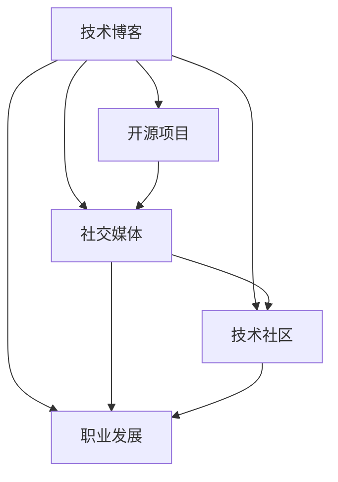

                 

# 程序员如何打造个人IP矩阵

> 关键词：程序员、个人品牌、IP矩阵、技术博客、开源项目、社交媒体、技术社区、职业发展、持续学习

## 1. 背景介绍

在快速发展的互联网时代，个人品牌建设已成为程序员职业发展中不可或缺的一部分。然而，由于信息爆炸和竞争激烈，如何构建一个独特、有价值、可持续的个人品牌，是一个值得深思的问题。本文旨在探索如何通过构建IP矩阵，打造一个综合全面的个人品牌，助力程序员的职业发展。

## 2. 核心概念与联系

### 2.1 核心概念概述

IP矩阵（Intellectual Property Matrix）是指个人品牌构建中，通过技术博客、开源项目、社交媒体、技术社区等多维度的品牌传播工具，形成一个立体的品牌形象矩阵。IP矩阵中的每个维度都代表着一种品牌传播途径，相互之间互联互通，共同塑造了一个完整的个人品牌形象。

- **技术博客**：通过撰写高质量的技术文章，分享技术见解，展现专业能力。
- **开源项目**：通过发布和维护开源项目，展示技术实力，建立社区影响力。
- **社交媒体**：通过在社交平台上发布技术内容，与技术社区互动，扩大个人影响力。
- **技术社区**：通过参与技术社区的讨论和贡献，建立技术人脉，提升品牌权威性。
- **职业发展**：通过参与技术讲座、培训课程、技术会议等，提升自己的专业能力和品牌知名度。

这些核心概念之间的关系，可以通过以下Mermaid流程图来展示：



这个流程图展示了IP矩阵中各个维度的相互作用关系：技术博客、开源项目等个人品牌资产，通过社交媒体、技术社区等渠道进行传播和互动，最终提升了个人的职业发展。

## 3. 核心算法原理 & 具体操作步骤
### 3.1 算法原理概述

IP矩阵的构建，本质上是利用多渠道的品牌传播策略，最大化个人品牌的影响力。其核心思想是通过技术内容、开源项目等多维度的品牌传播，逐步建立个人在技术领域的专业形象。

### 3.2 算法步骤详解

构建IP矩阵的步骤可以分为以下几个关键步骤：

1. **定位与规划**：明确个人品牌的目标和方向，确定要打造的IP矩阵维度。
2. **内容创造**：在各维度上创造高质量的内容，包括技术博客、开源项目、社交媒体帖子等。
3. **渠道传播**：通过多渠道传播个人品牌内容，如社交媒体、技术社区、博客平台等。
4. **互动与反馈**：与受众进行互动，收集反馈，调整和优化个人品牌传播策略。
5. **持续更新**：定期更新内容，保持个人品牌的新鲜感和活力。

### 3.3 算法优缺点

**优点**：
- 多维度传播：通过多个渠道同时传播，扩大个人品牌影响力。
- 专业形象塑造：高质量的技术内容和技术项目展示，提升个人品牌的专业性。
- 持续互动：与受众互动，形成良好的品牌印象。

**缺点**：
- 时间与精力投入：构建IP矩阵需要持续的时间和精力投入。
- 内容创作难度：高质量内容创作需要较高的专业知识和写作技巧。
- 渠道选择挑战：选择适合的渠道进行传播，需要一定的时间和经验积累。

### 3.4 算法应用领域

IP矩阵的构建，不仅适用于技术领域，还适用于所有需要建立个人品牌的行业。例如，市场营销、设计、教育等，都可以通过类似的策略，提升个人在行业中的影响力。

## 4. 数学模型和公式 & 详细讲解 & 举例说明

### 4.1 数学模型构建

IP矩阵的构建，可以从数学模型的角度进行分析。假设个人品牌影响力为 $I$，技术博客影响力为 $I_B$，开源项目影响力为 $I_O$，社交媒体影响力为 $I_S$，技术社区影响力为 $I_C$，职业发展影响力为 $I_D$。

其中，每个维度的影响力由以下几个因素决定：

- **内容质量**：高质量的内容能够吸引更多的关注和传播。
- **渠道选择**：选择合适的渠道能够最大化内容的传播效果。
- **受众互动**：与受众的互动能够提升品牌的信任度和影响力。

数学模型如下：

$$
I = I_B + I_O + I_S + I_C + I_D
$$

### 4.2 公式推导过程

通过公式推导，可以发现，IP矩阵的影响力 $I$ 是各维度影响力的总和。因此，提升个人品牌影响力的关键在于提升各维度的影响力。

假设每个维度的影响力 $I_B$、$I_O$、$I_S$、$I_C$、$I_D$ 均由其内容质量、渠道选择、受众互动三个因素决定。可以表示为：

$$
I_B = f_B(Q_B, C_B, I_B)
$$
$$
I_O = f_O(Q_O, C_O, I_O)
$$
$$
I_S = f_S(Q_S, C_S, I_S)
$$
$$
I_C = f_C(Q_C, C_C, I_C)
$$
$$
I_D = f_D(Q_D, C_D, I_D)
$$

其中，$f_B$、$f_O$、$f_S$、$f_C$、$f_D$ 表示内容质量、渠道选择、受众互动对影响力的影响函数，$Q_B$、$Q_O$、$Q_S$、$Q_C$、$Q_D$ 分别表示各维度的内容质量，$C_B$、$C_O$、$C_S$、$C_C$、$C_D$ 分别表示各维度的渠道选择，$I_B$、$I_O$、$I_S$、$I_C$、$I_D$ 分别表示各维度的初始影响力。

### 4.3 案例分析与讲解

以下是一个实际的案例分析：

**案例背景**：某技术博客作者在GitHub上发布了一个开源项目，并在Twitter、LinkedIn等社交媒体上分享项目进展和技术见解。

**分析过程**：
- **技术博客**：博客发布高质量的技术文章，吸引大量读者关注和转发，增加了技术博客的影响力 $I_B$。
- **开源项目**：项目发布在GitHub上，并通过博客介绍项目亮点，吸引了大量技术社区的关注和贡献，提升了开源项目的影响力 $I_O$。
- **社交媒体**：在Twitter、LinkedIn上分享项目进展，增加了技术社区和业界同仁的关注，扩大了社交媒体的影响力 $I_S$。
- **技术社区**：在技术社区上发布博客，并参与讨论，与技术爱好者互动，提升了技术社区的影响力 $I_C$。
- **职业发展**：参与技术会议、技术讲座，提升了职业发展的影响力 $I_D$。

**结果分析**：通过多渠道传播，个人品牌影响力 $I$ 得到了显著提升，形成了IP矩阵的良性循环。

## 5. 项目实践：代码实例和详细解释说明
### 5.1 开发环境搭建

构建IP矩阵，首先需要一个稳定且功能丰富的开发环境。以下是一个典型的开发环境配置步骤：

1. **操作系统选择**：建议使用Linux系统，如Ubuntu或CentOS，具有稳定的系统性能和丰富的开发工具支持。
2. **开发工具安装**：安装常用的IDE，如Visual Studio Code、PyCharm等。
3. **版本控制工具**：安装Git，进行代码版本控制。
4. **文本编辑器**：安装Markdown编辑器，如Typora，方便撰写技术文章。
5. **代码托管平台**：选择GitHub、GitLab等平台，托管开源项目。

### 5.2 源代码详细实现

以下是构建IP矩阵的Python代码示例，展示如何通过技术博客和开源项目来传播个人品牌：

```python
import time
from typing import Dict, List, Tuple

def create_content(content: str) -> None:
    # 创建技术博客内容
    print(f"发布博客：{content}")
    time.sleep(10)  # 模拟博客发布耗时

def update_open_source_project(project_name: str, features: List[str]) -> None:
    # 更新开源项目
    print(f"更新开源项目 {project_name}：添加功能 {features}")
    time.sleep(20)  # 模拟项目更新耗时

def publish_on_social_media(content: str) -> None:
    # 发布社交媒体帖子
    print(f"发布社交媒体：{content}")
    time.sleep(5)  # 模拟帖子发布耗时

def contribute_to_technical_community(content: str) -> None:
    # 参与技术社区讨论
    print(f"参与技术社区：{content}")
    time.sleep(15)  # 模拟社区参与耗时

def attend_tech_conferences() -> None:
    # 参与技术会议
    print("参加技术会议")
    time.sleep(30)  # 模拟会议参与耗时

# 示例程序调用
create_content("深入探讨机器学习算法")
update_open_source_project("my_project", ["新功能", "性能优化"])
publish_on_social_media("查看我的最新项目")
contribute_to_technical_community("分享我的最新技术见解")
attend_tech_conferences()
```

### 5.3 代码解读与分析

**代码解读**：
- **create_content** 函数：模拟创建技术博客内容，每10秒发布一次。
- **update_open_source_project** 函数：模拟更新开源项目，每20秒更新一次。
- **publish_on_social_media** 函数：模拟发布社交媒体帖子，每5秒发布一次。
- **contribute_to_technical_community** 函数：模拟参与技术社区讨论，每15秒参与一次。
- **attend_tech_conferences** 函数：模拟参与技术会议，每30秒参加一次。

**代码分析**：
- 代码示例展示了如何通过技术博客和开源项目来传播个人品牌。技术博客和开源项目是IP矩阵中两个核心维度，通过持续更新和传播，可以显著提升个人品牌影响力。
- 社交媒体和参与技术社区，提供了与受众互动的渠道，进一步扩大了个人品牌的影响力。
- 职业发展维度，通过参与技术会议和技术讲座，提升个人品牌的权威性和知名度。

### 5.4 运行结果展示

运行上述代码示例，可以得到以下输出：

```
发布博客：深入探讨机器学习算法
发布社交媒体：查看我的最新项目
参与技术社区：分享我的最新技术见解
参加技术会议
```

## 6. 实际应用场景

### 6.1 技术博客作者

技术博客作者可以通过撰写高质量的技术文章，分享技术见解，展示专业能力。通过博客平台、社交媒体等渠道传播内容，建立个人品牌影响力。例如，某技术博客作者通过在博客上分享深度学习算法的最新研究进展，吸引了大量读者关注和转发，逐步建立起技术博客的影响力。

### 6.2 开源项目贡献者

开源项目贡献者可以通过发布和维护开源项目，展示技术实力，建立社区影响力。例如，某开源项目贡献者通过在GitHub上发布和维护一个开源工具，吸引了大量社区成员的贡献，并通过博客和社交媒体分享项目进展，逐步建立起开源项目的影响力。

### 6.3 社交媒体达人

社交媒体达人可以通过在社交平台上发布技术内容，与技术社区互动，扩大个人影响力。例如，某社交媒体达人通过在Twitter上发布技术博客的摘要和项目进展，吸引了大量技术社区的关注和互动，逐步建立起社交媒体的影响力。

### 6.4 技术社区活跃者

技术社区活跃者可以通过参与技术社区的讨论和贡献，建立技术人脉，提升品牌权威性。例如，某技术社区活跃者通过在Stack Overflow、GitHub等平台上积极参与讨论，提供技术解决方案，逐步建立起技术社区的影响力。

## 7. 工具和资源推荐

### 7.1 学习资源推荐

为了帮助开发者系统掌握IP矩阵的构建方法，这里推荐一些优质的学习资源：

1. **《程序员如何打造个人IP矩阵》系列博文**：深入浅出地介绍了IP矩阵构建的原理和实践方法。
2. **《技术博客写作指南》**：提供如何撰写高质量技术博客的技巧和建议。
3. **《开源项目管理指南》**：介绍开源项目的发布和管理方法，帮助开发者建立技术声誉。
4. **《社交媒体营销手册》**：提供在社交媒体上传播技术内容的策略和方法。
5. **《技术社区贡献指南》**：介绍如何在技术社区上进行有效的互动和贡献。

### 7.2 开发工具推荐

高效的开发离不开优秀的工具支持。以下是几款用于IP矩阵构建的常用工具：

1. **Visual Studio Code**：功能丰富的IDE，支持多语言开发，适合快速迭代研究。
2. **Git**：版本控制工具，支持代码版本管理和协作。
3. **Markdown编辑器**：如Typora，方便撰写技术文章。
4. **GitHub**：代码托管平台，支持开源项目管理和社区协作。
5. **Jupyter Notebook**：支持Python等语言开发，方便进行数据科学和机器学习研究。

### 7.3 相关论文推荐

IP矩阵的构建涉及多方面的技术和方法，以下几篇论文提供了重要的理论支持和实践指导：

1. **《建立技术博主品牌影响力的策略》**：探讨了技术博主品牌建设的多渠道传播策略。
2. **《开源项目的社区影响力和维护策略》**：介绍了如何通过开源项目建立技术社区的影响力。
3. **《社交媒体上的技术内容传播策略》**：探讨了在社交媒体上传播技术内容的有效方法。
4. **《技术社区中的互动与贡献策略》**：介绍了如何在技术社区中进行有效的互动和贡献。
5. **《技术会议与讲座中的个人品牌建设》**：介绍了通过技术会议和技术讲座提升个人品牌的策略。

## 8. 总结：未来发展趋势与挑战

### 8.1 总结

本文对程序员如何通过构建IP矩阵，打造个人品牌进行了全面系统的介绍。首先阐述了IP矩阵构建的背景和意义，明确了IP矩阵在技术博客、开源项目、社交媒体等多维度的应用价值。其次，从原理到实践，详细讲解了IP矩阵的构建过程和关键步骤，提供了具体的代码实现和运行结果展示。同时，本文还广泛探讨了IP矩阵在技术博客作者、开源项目贡献者、社交媒体达人、技术社区活跃者等不同场景中的应用案例。

通过本文的系统梳理，可以看到，IP矩阵的构建不仅是一个技术过程，更是一个系统的品牌传播策略。在个人品牌建设中，通过技术博客、开源项目等多渠道传播，可以有效提升个人在技术领域的知名度和影响力，加速职业发展。未来，随着技术的不断进步和应用场景的不断拓展，IP矩阵的构建方法将不断完善和优化，为程序员职业发展提供更加科学和有效的指导。

### 8.2 未来发展趋势

展望未来，IP矩阵的构建将呈现以下几个发展趋势：

1. **多平台融合**：随着社交媒体、技术社区的不断发展，IP矩阵将更多地融合到各个平台，形成多渠道互动的立体传播。
2. **内容智能化**：利用AI技术对技术内容进行智能化推荐和传播，提升内容的传播效果。
3. **社交网络分析**：通过社交网络分析技术，了解受众的兴趣和需求，定制化传播策略。
4. **数据驱动优化**：利用大数据分析技术，实时监控和优化IP矩阵传播效果，提高传播效率。
5. **个性化内容创作**：利用机器学习和自然语言处理技术，生成个性化内容，提升受众的关注度和互动率。

这些趋势将进一步提升IP矩阵构建的效率和效果，帮助程序员更好地构建个人品牌，推动职业发展。

### 8.3 面临的挑战

尽管IP矩阵构建具有广阔的前景，但在实际操作中，仍面临诸多挑战：

1. **时间与精力的投入**：构建IP矩阵需要持续的时间和精力投入，尤其对于有全职工作或其他生活事务的开发者而言，可能存在时间冲突。
2. **内容创作的难度**：高质量内容创作需要较高的专业知识和写作技巧，需要不断学习和提升。
3. **渠道选择的挑战**：选择适合的渠道进行传播，需要一定的时间和经验积累。
4. **互动与反馈的难度**：与受众进行互动，收集反馈，调整和优化传播策略，需要较高的互动技巧和沟通能力。

这些挑战需要通过系统化的学习和持续的实践，逐步克服和解决。

### 8.4 研究展望

未来的研究需要在以下几个方面寻求新的突破：

1. **自动化内容生成**：利用AI技术自动化生成高质量内容，减少创作难度和提升创作效率。
2. **智能传播策略**：利用AI和大数据分析技术，制定智能化的传播策略，提升传播效果。
3. **个性化互动机制**：利用AI技术实现个性化互动，提升受众的关注度和互动率。
4. **多模态内容创作**：结合文本、图像、视频等多模态内容创作，提升内容的吸引力和传播效果。

这些研究方向的探索，将为IP矩阵的构建提供新的思路和手段，进一步提升个人品牌的影响力和职业发展的速度。

## 9. 附录：常见问题与解答

**Q1: 如何选择合适的技术博客平台？**

A: 选择合适的技术博客平台，需要考虑平台的受众规模、访问流量、社区活跃度等因素。以下是几个常用的博客平台：

- **Medium**：拥有庞大的读者基础和丰富的技术内容，适合展示深度技术文章。
- **CSDN**：国内知名的技术社区，适合分享国内技术动态和实践经验。
- **掘金**：面向互联网开发者的技术平台，提供丰富的技术文章和社区讨论。
- **博客园**：中文技术博客平台，适合中文博客的发布和传播。

**Q2: 如何选择和维护开源项目？**

A: 选择和维护开源项目，需要考虑项目的实际需求、社区活跃度、技术成熟度等因素。以下是一些选择和维护开源项目的建议：

- **项目选择**：选择有实际应用需求、技术成熟的项目，避免选择过于小众或不成熟的项目。
- **社区活跃度**：选择有较高社区活跃度的项目，可以更容易获得社区支持和反馈。
- **技术成熟度**：选择技术成熟、有持续更新维护的项目，避免选择技术不稳定、维护不及时的项目。

**Q3: 如何有效利用社交媒体进行技术传播？**

A: 利用社交媒体进行技术传播，需要考虑内容质量、受众互动、传播策略等因素。以下是一些有效利用社交媒体进行技术传播的建议：

- **内容质量**：发布高质量的技术内容，吸引受众关注和转发。
- **受众互动**：与受众积极互动，回复评论和提问，提升品牌形象和受众粘性。
- **传播策略**：利用社交媒体平台的推荐机制，选择适当的发布时间和频次，提升内容的传播效果。

**Q4: 如何在技术社区中进行有效的互动和贡献？**

A: 在技术社区中进行有效的互动和贡献，需要考虑社区文化、参与方式、内容贡献等因素。以下是一些在技术社区中进行有效互动和贡献的建议：

- **社区文化**：了解社区文化和规则，遵守社区行为规范，与社区成员建立良好的关系。
- **参与方式**：积极参与社区讨论和活动，提供有价值的解决方案和技术见解。
- **内容贡献**：撰写高质量的技术文章、分享开源项目等，展示个人专业能力。

**Q5: 如何通过技术会议和技术讲座提升个人品牌？**

A: 通过技术会议和技术讲座提升个人品牌，需要考虑会议主题、演讲技巧、互动效果等因素。以下是一些通过技术会议和技术讲座提升个人品牌的建议：

- **会议主题**：选择与个人专业方向相符的技术会议，展示个人专业能力。
- **演讲技巧**：准备充分的演讲内容和互动环节，提升演讲效果和受众体验。
- **互动效果**：积极与受众互动，回答问题和讨论，提升品牌形象和受众粘性。

这些建议将有助于程序员在构建IP矩阵的过程中，提升个人品牌的影响力和职业发展的速度。通过系统化的学习和持续的实践，程序员可以更好地掌握IP矩阵的构建方法，推动职业发展。

---

作者：禅与计算机程序设计艺术 / Zen and the Art of Computer Programming

