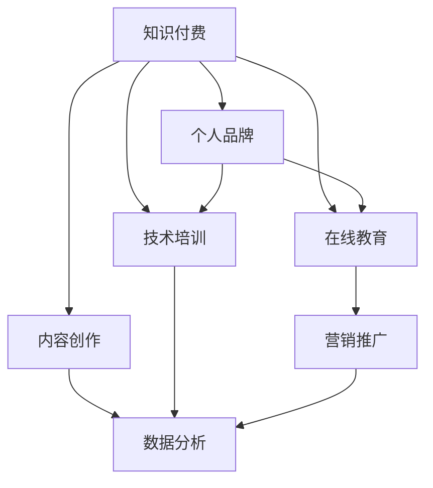

                 

# 程序员如何打造个人知识付费品牌

> 关键词：知识付费, 个人品牌建设, 程序员, 内容创作, 在线教育, 技术培训

## 1. 背景介绍

### 1.1 问题由来

在信息爆炸的互联网时代，知识和技能成为个体价值提升的关键。传统通过书籍、课程等方式获取知识的方法，已难以满足快速变化的技术需求。而知识付费平台的兴起，为个人提供了一条高效、直接的知识获取渠道，逐渐成为主流学习方式。

针对这一趋势，众多优秀的程序员通过构建个人知识付费品牌，实现了技术和个人价值的双飞跃。例如，极客时间、博客园、CSDN等平台上的技术大牛，通过输出高质量技术文章、视频教程，建立个人品牌，成为了领域内的意见领袖，实现了经济独立与影响力提升。

### 1.2 问题核心关键点

为什么优秀的程序员能够成功打造个人知识付费品牌？关键点在于：

1. 深度专业：具备深厚的技术背景和广泛的实践经验。
2. 持续创新：不断学习新技术，掌握新知识。
3. 内容驱动：注重内容质量，关注用户体验。
4. 数据驱动：通过分析用户反馈，持续优化内容。
5. 营销推广：利用线上线下渠道，扩大品牌影响。

只有从技术、内容、市场多个维度综合发力，才能成功打造个人知识付费品牌。本文将从这五个方面详细探讨如何打造优秀的个人知识付费品牌。

## 2. 核心概念与联系

### 2.1 核心概念概述

为更好地理解如何打造个人知识付费品牌，本节将介绍几个关键概念：

- **知识付费(Knowledge-as-a-Service, KaaS)**：一种新兴的商业模式，通过付费方式获取高价值知识和技能，提高学习效率和工作效能。
- **个人品牌(Personal Branding)**：在职业领域建立具有个人特色的形象和声誉，提升职业竞争力与影响力。
- **在线教育(e-Learning)**：通过互联网手段提供远程教学和学习服务，打破时间和空间限制，实现灵活学习。
- **内容创作(Content Creation)**：创造有价值、有吸引力的内容，满足用户需求，吸引关注和付费。
- **技术培训(Technical Training)**：针对特定技术领域进行专业培训，提升技术技能和实战经验。
- **营销推广(Marketing & Promotion)**：通过多渠道宣传推广，吸引潜在用户，扩大品牌影响力。
- **数据分析(Analytical Data)**：利用数据分析工具，了解用户行为和需求，优化内容和产品。

这些概念之间的联系可以通过以下Mermaid流程图来展示：



这个流程图展示了一些关键概念及其之间的关系：

1. 知识付费平台为个人品牌提供内容和教育工具。
2. 在线教育平台提供多样化的教学方式和学习资源。
3. 内容创作是知识付费的核心，吸引用户关注和付费。
4. 技术培训帮助用户掌握专业技能，提升学习效果。
5. 营销推广和数据分析共同支撑品牌建设，提高品牌知名度和用户满意度。

## 3. 核心算法原理 & 具体操作步骤

### 3.1 算法原理概述

打造个人知识付费品牌，本质上是一个多维度数据驱动的过程。其核心思想是：通过持续输出高质量的内容，结合有效的营销推广和数据分析手段，逐步建立和提升个人品牌，实现知识变现。

具体来说，包括以下几个关键步骤：

1. **技术积累**：掌握核心技术，积累实战经验，提升技术深度和广度。
2. **内容创作**：产出优质内容，形成独特的知识体系和风格。
3. **市场推广**：选择合适的平台和渠道，进行多维度宣传推广。
4. **数据分析**：收集用户反馈，了解用户需求，持续优化内容和产品。
5. **持续迭代**：基于数据分析结果，不断调整和改进，提升品牌价值和用户黏性。

### 3.2 算法步骤详解

以下是打造个人知识付费品牌的详细步骤：

**Step 1: 技术积累**

- **技术学习**：选择感兴趣的技术领域，深入学习其原理和应用。
- **实践项目**：参与开源项目，实战项目，积累开发经验。
- **阅读论文**：阅读前沿技术论文，跟踪技术动态。
- **参加社区**：加入技术社区，参与讨论交流。

**Step 2: 内容创作**

- **内容定位**：明确自身技术优势，确定内容方向，如架构设计、编程技巧、工具使用等。
- **选题策划**：选择常见问题或热点技术，策划系列文章或视频。
- **写作/录制**：撰写技术文章，录制教学视频，注意内容质量与用户体验。
- **多渠道发布**：通过博客、视频平台、社交媒体等多种渠道发布内容。

**Step 3: 市场推广**

- **选择合适的平台**：选择适合自身内容类型的知识付费平台，如极客时间、CSDN等。
- **制定营销策略**：制定有针对性的营销推广计划，如投放广告、内容引流、用户推荐等。
- **社群建设**：建立在线社群，定期互动交流，增强用户黏性。

**Step 4: 数据分析**

- **数据收集**：收集用户评论、订阅量、观看时长等数据。
- **分析反馈**：分析用户反馈，了解用户需求和痛点。
- **调整优化**：根据分析结果，调整内容策略和推广计划。

**Step 5: 持续迭代**

- **持续输出**：定期发布新内容，保持内容新鲜度。
- **改进提升**：根据用户反馈和数据分析，持续改进内容质量和推广策略。
- **品牌维护**：维护品牌形象，提供优质的客户服务。

### 3.3 算法优缺点

打造个人知识付费品牌的方法具有以下优点：

1. **高效学习**：快速获取知识，提升技术水平。
2. **经济独立**：通过内容创作实现经济收入。
3. **品牌价值**：建立个人品牌，提升行业影响力。
4. **用户黏性**：持续输出优质内容，增强用户信任和忠诚度。

但该方法也存在一些局限性：

1. **时间成本高**：内容创作和数据分析需要大量时间投入。
2. **营销困难**：需要具备一定的营销推广能力。
3. **内容竞争**：知识付费市场竞争激烈，内容需有差异化。
4. **用户反馈滞后**：数据分析和反馈调整需时间，效果短期内难以显现。

尽管如此，通过有效的策略和方法，可以最大程度克服这些局限，实现品牌建设与知识变现的双重目标。

### 3.4 算法应用领域

打造个人知识付费品牌的方法，不仅适用于技术领域，还适用于其他知识型领域，例如：

- **教育培训**：如K12教育、职业技能培训等，通过课程制作和营销推广，实现知识变现。
- **健康管理**：通过健身指导、健康饮食等知识分享，帮助用户改善生活质量。
- **财务管理**：分享财务管理技巧、理财投资知识，提升用户财务水平。
- **职业咨询**：提供职业规划、简历优化等咨询服务，帮助用户提升就业竞争力。

以上领域均有大量优秀的个人品牌成功案例，通过内容创作和市场推广，实现了知识和经济的双赢。

## 4. 数学模型和公式 & 详细讲解 & 举例说明

### 4.1 数学模型构建

在本文中，我们将构建一个简单的数学模型来量化内容创作的收益。假设内容创作平台上有 $N$ 个潜在用户，每个用户愿意为内容付费的概率为 $p$，每次付费金额为 $f$。内容发布后，设内容带来的付费次数为 $n$，则总收益为 $N \times p \times f \times n$。

### 4.2 公式推导过程

设内容发布前用户的总订阅量为 $S_0$，内容发布后的总订阅量为 $S_n$。令 $\Delta S = S_n - S_0$ 表示内容发布带来的订阅量增长。则内容带来的总收益可以表示为：

$$
R = (N - \Delta S) \times p \times f \times n + \Delta S \times p \times f \times n
$$

其中，$(N - \Delta S) \times p \times f \times n$ 表示已订阅用户的内容付费，$\Delta S \times p \times f \times n$ 表示新增订阅用户的内容付费。

### 4.3 案例分析与讲解

假设某技术作者在一个知识付费平台上发布了关于“Python编程技巧”的系列文章，每次文章带来的订阅量增长为 $\Delta S = 1000$，已有订阅用户数为 $N = 10000$，每次付费金额为 $f = 9.9$ 元，每次付费内容浏览次数为 $n = 10$，设用户订阅概率为 $p = 0.05$，则该作者的内容总收益为：

$$
R = (10000 - 1000) \times 0.05 \times 9.9 \times 10 + 1000 \times 0.05 \times 9.9 \times 10 = 49950 \text{元}
$$

这个案例说明，通过内容创作和市场推广，技术作者可以实现显著的经济收益。

## 5. 项目实践：代码实例和详细解释说明

### 5.1 开发环境搭建

在进行个人品牌建设之前，我们需要准备好开发环境。以下是使用Python进行知识付费平台开发的流程：

1. 安装Anaconda：从官网下载并安装Anaconda，用于创建独立的Python环境。

2. 创建并激活虚拟环境：
```bash
conda create -n knowledge-env python=3.8 
conda activate knowledge-env
```

3. 安装必要的Python包：
```bash
pip install flask markdown ipywidgets
```

4. 配置开发环境：
```bash
# 设置内容发布路径
git clone https://github.com/username/my-knowledge-brand.git
cd my-knowledge-brand
```

5. 初始化数据库：
```bash
pip install sqlalchemy sqlalchemy-migrate flask-migrate
# 运行数据库迁移命令
# python manage.py migrate
```

完成上述步骤后，即可在`knowledge-env`环境中开始开发。

### 5.2 源代码详细实现

下面我们以博客平台为例，给出使用Flask进行个人知识品牌建设的PyTorch代码实现。

```python
from flask import Flask, request, jsonify
from markdown import markdown
from flask_migrate import Migrate
from models import Post, User

app = Flask(__name__)
migrate = Migrate(app, db)

@app.route('/posts', methods=['POST'])
def create_post():
    data = request.get_json()
    title = data['title']
    content = markdown(data['content'])
    user_id = data['user_id']
    post = Post(title=title, content=content, user_id=user_id)
    db.session.add(post)
    db.session.commit()
    return jsonify({'status': 'success'})

@app.route('/posts/<int:post_id>', methods=['GET'])
def get_post(post_id):
    post = Post.query.get(post_id)
    if post is None:
        return jsonify({'status': 'error'})
    return jsonify({'post': post.to_dict()})

@app.route('/users', methods=['POST'])
def create_user():
    data = request.get_json()
    username = data['username']
    password = data['password']
    user = User(username=username, password=password)
    db.session.add(user)
    db.session.commit()
    return jsonify({'status': 'success'})

if __name__ == '__main__':
    app.run(debug=True)
```

在这个例子中，我们使用了Flask框架搭建了一个简单的博客平台，支持文章发布和获取。通过Flask-Migrate工具，实现了数据库迁移功能，便于后续数据的增删改查。

### 5.3 代码解读与分析

这个简单的代码例子主要包含以下几个部分：

**Flask应用**：使用Flask框架搭建了一个HTTP服务器，用于处理用户请求。

**API路由**：定义了文章发布和获取的API接口，使用`@app.route`装饰器将HTTP请求映射到相应的处理函数。

**数据库操作**：使用SQLAlchemy库定义了文章和用户模型，使用`db.session.add`和`db.session.commit`完成数据的增删改查操作。

**Markdown解析**：使用Markdown库解析用户输入的文章内容，将其转换为HTML格式。

**用户认证**：实现了一个简单的用户认证系统，支持用户注册和登录。

这个例子展示了Flask框架的基本用法和SQLAlchemy库的数据库操作。开发者可以根据自身需求，进一步扩展和优化该平台，实现更多功能。

### 5.4 运行结果展示

在完成代码实现后，运行该博客平台，可以在浏览器中访问并发布文章。例如，在浏览器中输入`http://localhost:5000/posts`，可以看到所有已发布的文章列表。

## 6. 实际应用场景

### 6.1 智能客服系统

基于个人知识品牌的智能客服系统，可以为中小型企业提供低成本、高效率的客服解决方案。传统客服系统依赖大量客服人员，高峰期难以满足需求，且成本高昂。通过建立具有专业背景的知识付费品牌，可以为客服系统提供知识库和智能化技术支持，实现24小时不间断服务，提升客户满意度。

在技术实现上，可以构建一个知识付费平台，与客服系统集成。用户可以在平台发布常见问题及其最佳回答，由品牌专家审核后，系统根据用户输入的客服消息，自动匹配问题并输出答案。对于未匹配到的用户问题，系统可以自动搜索知识库或将其推荐给专家处理。

### 6.2 在线教育平台

知识付费品牌在在线教育领域也有广泛应用。传统教育资源通常价格高昂，难以覆盖广大学生群体。通过打造个人知识品牌，可以提供价格合理、内容丰富的在线课程，帮助学生随时随地进行学习。

在技术实现上，可以构建一个在线教育平台，邀请知识付费品牌专家开设课程。专家定期发布系列课程，覆盖多个技术点，并通过视频、文章、问答等多种形式呈现。平台根据用户学习进度，推送相关课程内容，帮助用户系统化地掌握知识。

### 6.3 技术咨询服务

知识付费品牌还可以提供专业的技术咨询服务，帮助企业解决技术难题，提升运营效率。传统技术咨询费用高昂，且难以快速响应。通过个人知识品牌的快速输出和高效沟通，可以为企业提供更加灵活、经济的技术支持。

在技术实现上，可以构建一个在线咨询平台，邀请知识付费品牌专家提供技术咨询服务。专家可以在平台发布文章、视频或直播，解答企业技术问题。企业可以根据需求，选择专家进行一对一咨询，并支付相应费用。

### 6.4 未来应用展望

随着个人知识品牌的持续发展和壮大，其应用场景将更加广泛，影响深远。未来，知识付费品牌可能成为各行各业的技术支柱，推动整个社会的技术进步和创新。

在智慧医疗领域，知识付费品牌可以为医生提供专业的医疗知识库和诊断工具，提升医疗服务质量。在智慧农业领域，知识付费品牌可以为农民提供高效的生产技术和管理方案，推动农业生产现代化。在智慧城市领域，知识付费品牌可以为市民提供智能化的生活服务，提升城市治理水平。

## 7. 工具和资源推荐

### 7.1 学习资源推荐

为了帮助开发者系统掌握知识付费品牌建设的理论基础和实践技巧，这里推荐一些优质的学习资源：

1. **《知识付费商业模式》**：详细介绍了知识付费平台的商业模式和运营策略，帮助开发者理解市场需求和用户心理。
2. **《在线教育平台开发实战》**：提供了详细的在线教育平台开发流程和技术栈，包括前端、后端、数据库等。
3. **《技术写作与内容营销》**：介绍了技术写作的基本原则和技巧，帮助开发者提升内容创作能力。
4. **《品牌建设与营销推广》**：提供了品牌建设的全流程指导和营销推广策略，帮助开发者建立和维护个人品牌。
5. **《数据分析与用户行为分析》**：介绍了数据分析的基本方法和工具，帮助开发者理解用户行为和需求，进行精准营销。

通过对这些资源的学习实践，相信你一定能够快速掌握知识付费品牌建设的精髓，并用于解决实际的商业问题。

### 7.2 开发工具推荐

高效的开发离不开优秀的工具支持。以下是几款用于知识付费品牌开发的常用工具：

1. **Flask**：基于Python的轻量级Web框架，简单易用，支持快速开发和部署。
2. **SQLAlchemy**：Python的SQL工具包，支持多种数据库，支持复杂查询和事务处理。
3. **Jupyter Notebook**：交互式编程环境，支持多语言代码块和实时执行，适合开发和调试。
4. **Git**：版本控制系统，支持代码管理和协作开发，便于团队协作。
5. **GitHub**：代码托管平台，支持开源协作，便于代码共享和社区交流。

合理利用这些工具，可以显著提升知识付费品牌开发的效率，加快创新迭代的步伐。

### 7.3 相关论文推荐

知识付费品牌建设的研究源于学界的持续探索。以下是几篇奠基性的相关论文，推荐阅读：

1. **《知识付费市场分析》**：通过对知识付费市场的深入分析，提供了市场规模、用户特征和趋势预测。
2. **《在线教育平台的成功因素》**：总结了在线教育平台的成功经验和关键因素，提供了借鉴和参考。
3. **《知识付费品牌建设的策略》**：介绍了知识付费品牌建设的不同策略和方法，帮助开发者选择适合自身情况的模式。
4. **《用户行为分析与个性化推荐》**：提供了用户行为分析的方法和工具，帮助开发者实现精准营销和个性化推荐。
5. **《技术知识付费的现状与展望》**：总结了技术知识付费的发展现状和未来趋势，提供了未来的方向和思路。

这些论文代表了大规模知识付费平台的发展脉络。通过学习这些前沿成果，可以帮助开发者把握学科前进方向，激发更多的创新灵感。

## 8. 总结：未来发展趋势与挑战

### 8.1 总结

本文对如何打造个人知识付费品牌进行了全面系统的介绍。首先阐述了知识付费、个人品牌、在线教育、内容创作、技术培训、营销推广等关键概念，明确了品牌建设的重要性。其次，从技术积累、内容创作、市场推广、数据分析、持续迭代等五个方面，详细讲解了品牌建设的具体步骤和方法。最后，结合实际应用场景，展望了知识付费品牌的未来发展趋势和挑战。

通过本文的系统梳理，可以看到，通过内容创作和市场推广，个人知识付费品牌可以实现显著的经济收益和品牌价值。未来，伴随技术的不断进步，知识付费品牌必将进入更加成熟和多样化的发展阶段，成为推动社会进步和创新的重要力量。

### 8.2 未来发展趋势

展望未来，知识付费品牌建设将呈现以下几个发展趋势：

1. **内容多样化**：知识付费品牌的内容将更加多样化和精细化，涵盖多个领域和多个层级。
2. **平台化运营**：知识付费品牌将逐步平台化，形成集内容创作、用户互动、数据分析于一体的生态系统。
3. **社会化影响**：知识付费品牌的影响力将扩展到社会各个层面，成为推动社会进步和创新的重要力量。
4. **技术集成**：知识付费品牌将与更多技术平台集成，如在线教育、智能客服、智能推荐等，实现更高效的内容输出和用户服务。
5. **个性化推荐**：知识付费品牌将通过数据分析和机器学习技术，实现更加精准和个性化的推荐服务。

这些趋势将使得知识付费品牌进入更加成熟和多样化的发展阶段，为个人和社会创造更多价值。

### 8.3 面临的挑战

尽管知识付费品牌建设前景广阔，但在发展过程中仍面临诸多挑战：

1. **内容质量控制**：如何确保内容的高质量和专业性，避免伪劣内容误导用户。
2. **用户互动不足**：如何增强用户互动，提升用户粘性和品牌忠诚度。
3. **市场竞争激烈**：如何在激烈的市场竞争中脱颖而出，获取更多的用户和收益。
4. **数据分析难度**：如何高效收集和分析用户数据，进行精准营销和内容优化。
5. **技术门槛较高**：如何降低技术门槛，让更多开发者参与进来，共同推动品牌发展。

尽管面临这些挑战，但通过有效的策略和方法，可以逐步克服这些困难，实现知识付费品牌的长远发展。

### 8.4 研究展望

未来的研究需要在以下几个方面寻求新的突破：

1. **内容质量控制**：开发内容质量评估工具，建立内容审核机制，提升内容专业性和可信度。
2. **用户互动增强**：引入社区互动功能，如评论、点赞、打赏等，增强用户粘性和互动。
3. **市场推广创新**：探索新的营销渠道和推广策略，如社交媒体、SEO、短视频等，扩大品牌影响。
4. **数据分析优化**：引入机器学习技术，提升数据分析精度和时效性，实现更加精准的营销和内容优化。
5. **技术门槛降低**：提供简单易用的开发工具和框架，降低技术门槛，让更多开发者参与进来，共同推动品牌发展。

这些研究方向的探索，将使得知识付费品牌建设进入更加成熟和多样化的发展阶段，为个人和社会创造更多价值。

## 9. 附录：常见问题与解答

**Q1：如何选择合适的知识付费平台？**

A: 选择合适的平台，需要考虑平台的用户量、用户质量、平台特性等。一般来说，大平台用户量更大，用户质量更高，但运营成本也更高。小平台则可能运营成本低，但用户量较少。建议综合考虑平台特性和自身需求，选择最适合自己的平台。

**Q2：如何提高内容质量？**

A: 提高内容质量，需要持续学习和积累，保持对技术前沿的关注。同时，可以多向用户反馈，了解用户需求，优化内容结构和表达方式。

**Q3：如何吸引和留住用户？**

A: 吸引用户，需要提供有价值的内容，满足用户需求。留住用户，需要建立良好的用户关系，定期互动交流，提供优质的客户服务。

**Q4：如何提高品牌知名度？**

A: 提高品牌知名度，需要多渠道宣传推广，如社交媒体、博客、视频平台等。同时，可以通过与大平台合作，扩大品牌影响力。

**Q5：如何优化数据分析？**

A: 优化数据分析，需要选择合适的数据工具，如Google Analytics、Mixpanel等。同时，需要明确数据分析目标，制定数据收集和分析策略，实时监控和调整优化。

通过不断探索和优化，相信你一定能够在知识付费品牌建设的道路上取得成功，实现技术和个人价值的双飞跃。

---

作者：禅与计算机程序设计艺术 / Zen and the Art of Computer Programming

