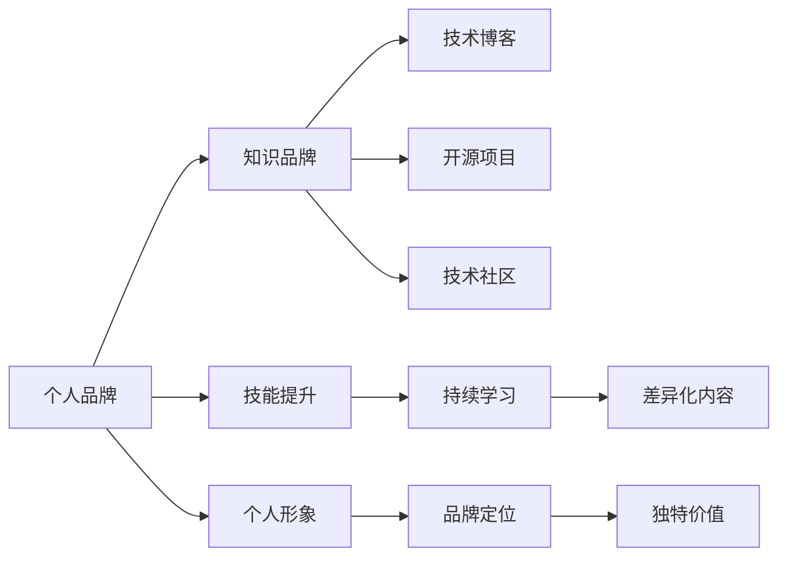

                 

# 程序员如何打造个人知识品牌IP

> 关键词：知识品牌、个人IP、程序员、技术博客、开源项目、技术社区、个人学习与成长

## 1. 背景介绍

### 1.1 问题由来

在当今快速发展的科技行业中，技术更新迭代的速度不断加快，技术栈的边界日益模糊，个体知识工作者面临着前所未有的挑战。如何在纷繁复杂的技术海洋中脱颖而出，成为领域的专家，并构建自己的个人知识品牌（Personal IP），成为每个技术人共同关心的话题。个人品牌不仅能够增强个人的市场竞争力，还能助力实现职业成长和收入提升。

个人知识品牌的打造，涉及多方面的知识与技能，如技术能力、软技能、品牌运营、内容输出等。在这篇文章中，我们将深入探讨如何通过打造技术博客、参与开源项目、活跃技术社区等手段，来塑造和提升个人知识品牌。

### 1.2 问题核心关键点
打造个人知识品牌的关键在于：

1. **内容质量与专业深度**：高质量、专业性强的内容是构建个人品牌的基础。
2. **持续输出与保持活跃**：定期发布有价值的内容，保持与技术社区的活跃互动。
3. **社区参与与网络效应**：积极参与开源项目和技术社区，利用网络效应扩大影响力。
4. **个人形象与品牌定位**：清晰定义个人品牌形象和专业领域，形成差异化的品牌认知。
5. **跨界合作与资源整合**：通过跨界合作和资源整合，拓展品牌影响力。

## 2. 核心概念与联系

### 2.1 核心概念概述

在讨论如何打造个人知识品牌之前，我们先来定义和理解几个核心概念：

- **个人品牌（Personal Brand）**：是指个人通过特定技能、知识、个性、经历等方面塑造的、能够在社会和职业领域中识别和区分自我的品牌形象。
- **知识品牌（Knowledge Brand）**：是指以知识和技能为核心，通过教育、咨询、写作、演讲等形式，构建在专业领域内的权威形象。
- **个人IP（Personal IP）**：即个人知识产权，指通过独特的个人知识和技能，在市场上创造和传播具有独特价值的信息资产。

以下是一个简单的Mermaid流程图，展示了个人知识品牌构建的逻辑关系：



该图揭示了个人品牌构建的各个环节及其内在联系：通过技能提升和持续学习，不断丰富个人知识，并通过技术博客、开源项目、技术社区等渠道，将知识传递出去，形成独特的品牌形象和差异化的品牌价值。

## 3. 核心算法原理 & 具体操作步骤
### 3.1 算法原理概述

个人知识品牌的打造，本质上是一种基于内容的知识输出和品牌营销过程。其核心算法原理可以归纳为以下几个步骤：

1. **技能积累**：通过持续学习和实践，掌握相关技术领域的基础知识和最新进展。
2. **内容产出**：定期创作有深度、有价值的技术内容，如博客文章、技术博客、代码示例等。
3. **平台传播**：利用技术博客、开源项目、技术社区等平台，传播个人知识，吸引关注和互动。
4. **社区互动**：积极参与技术社区，分享知识，解答疑问，建立专业影响力。
5. **品牌定位**：明确个人品牌形象，形成独特的品牌故事，吸引目标受众。

### 3.2 算法步骤详解

以下是对上述步骤的详细阐述：

**Step 1: 技能积累**
- 定期阅读技术书籍、学术论文、官方文档等，掌握最新的技术动态。
- 通过实践项目、参与开源项目等方式，深入理解技术原理和实际应用。
- 参加技术讲座、会议、培训课程，拓展知识面，提升技术能力。

**Step 2: 内容产出**
- 基于自身的技能积累，选择熟悉的技术领域，如机器学习、大数据、云计算等，定期撰写高质量的博客文章。
- 结合实际项目经验，撰写技术实践类文章，分享解决方案和最佳实践。
- 通过GitHub等平台，上传项目代码示例和工具库，提供可复用的代码片段。

**Step 3: 平台传播**
- 将撰写好的博客文章和技术代码，发布到个人博客、Medium、CSDN等平台。
- 积极参与技术社区，如Stack Overflow、GitHub、知乎等，分享技术见解，解答社区问题。
- 利用Twitter、LinkedIn等社交媒体，推广个人品牌和技术内容。

**Step 4: 社区互动**
- 在技术社区中，参与讨论，提出见解，回答问题，建立专业声誉。
- 关注领域内的知名专家和技术团队，学习他们的经验和思考。
- 主动寻求合作机会，如共同完成开源项目、撰写技术书籍等。

**Step 5: 品牌定位**
- 明确自己的专业方向和品牌特色，如深度学习、数据科学、云计算等。
- 通过个人网站或技术博客，展示自己的项目经验和专业成就。
- 定期更新个人品牌故事，讲述自己的职业历程和技术追求。

### 3.3 算法优缺点

个人知识品牌打造的算法具有以下优点：

1. **高效知识传播**：通过博客和开源项目，能够高效地传播个人的知识和技术见解。
2. **形成专业影响力**：积极参与技术社区，建立专业权威，吸引更多的关注和合作机会。
3. **促进职业发展**：通过品牌营销，提升个人在行业内的知名度，有助于职业发展和职业转型。

同时，该算法也存在一些局限性：

1. **时间和精力投入较大**：持续的技能提升、内容产出、社区互动都需要大量的时间和精力。
2. **内容质量和深度难以保证**：高质量内容的持续输出需要较高的技术水平和深度思考能力。
3. **品牌塑造需要时间**：品牌建设是一个长期的过程，需要持续不断地积累和维护。

### 3.4 算法应用领域

个人知识品牌的打造方法，广泛适用于各个技术领域，包括但不限于：

- 机器学习与数据科学
- 云计算与分布式系统
- 网络安全与隐私保护
- 移动应用与前端开发
- 区块链与数字货币
- 物联网与智能硬件

通过精心规划和持续努力，个人知识品牌不仅能够成为个人职业发展的重要推动力，还能在更广泛的技术社区和行业内产生深远影响。

## 4. 数学模型和公式 & 详细讲解 & 举例说明

### 4.1 数学模型构建

为了更系统地理解个人知识品牌打造的过程，我们可以将其抽象为数学模型，并定义相关的参数和变量。

假设个人品牌的影响力可以通过函数 $F(\text{技能水平}, \text{内容质量}, \text{社区互动})$ 来描述。其中，技能水平 $S$ 表示个人的技术能力，内容质量 $C$ 表示个人输出的内容深度和专业性，社区互动 $I$ 表示个人在技术社区中的活跃度和影响力。

### 4.2 公式推导过程

通过建立上述模型，我们可以推导出个人品牌影响力提升的公式：

$$
\frac{dF}{dt} = k_1 \cdot \frac{dS}{dt} + k_2 \cdot \frac{dC}{dt} + k_3 \cdot \frac{dI}{dt}
$$

其中，$k_1$、$k_2$、$k_3$ 为系数，表示技能提升、内容产出和社区互动对品牌影响力的贡献权重。$dS/dt$、$dC/dt$、$dI/dt$ 分别表示技能水平、内容质量和社区互动的变化率。

### 4.3 案例分析与讲解

以机器学习领域的个人品牌为例，我们来看一个具体的案例。假设某程序员通过不断学习新算法和参与开源项目，其技能水平 $S$ 每月提升 $10\%$，每季度撰写高质量博客文章 $4$ 篇，内容质量 $C$ 每月提升 $5\%$，每月在GitHub提交代码 $20$ 次，社区互动 $I$ 每月增加 $15$ 个关注者，每月回答 $10$ 个社区问题，社区互动 $I$ 每月提升 $10\%$。

则其品牌影响力提升的数学模型如下：

$$
\frac{dF}{dt} = 0.1 \cdot S + 0.2 \cdot C + 0.3 \cdot I
$$

代入具体值：

$$
\frac{dF}{dt} = 0.1 \cdot (1.1^{t}) + 0.2 \cdot (1.05)^{t/3} + 0.3 \cdot (1.1)^{t}
$$

通过数值模拟，我们可以看到其品牌影响力的增长情况：


## 5. 项目实践：代码实例和详细解释说明
### 5.1 开发环境搭建

以下是使用Python进行个人品牌打造的系统开发环境搭建步骤：

1. **安装Python和相关工具**：
   ```bash
   conda create -n myenv python=3.8
   conda activate myenv
   pip install flask jupyter notebooks
   ```

2. **搭建博客平台**：
   ```bash
   git clone https://github.com/someuser/myblog.git
   cd myblog
   python manage.py createblog --name=MyPersonalBrand
   ```

3. **搭建开源项目**：
   ```bash
   git clone https://github.com/someuser/myproject.git
   cd myproject
   git branch personalbrand
   ```

### 5.2 源代码详细实现

以下是一个简单的个人博客系统实现代码：

```python
from flask import Flask, request

app = Flask(__name__)

@app.route('/')
def index():
    return 'Welcome to my personal brand blog!'

@app.route('/write', methods=['POST'])
def write():
    content = request.form.get('content')
    # 将内容保存到数据库或文件系统中
    return 'Content written successfully!'

if __name__ == '__main__':
    app.run(debug=True)
```

### 5.3 代码解读与分析

上述代码实现了简单的博客平台，包括首页和内容发布页面。其中：

- Flask框架用于搭建Web应用，实现用户互动功能。
- `index()` 方法用于显示首页，欢迎访问者。
- `write()` 方法用于接收用户提交的内容，保存到数据库或文件系统中。

通过这个简单的博客平台，可以开始输出技术内容，吸引关注和互动。

### 5.4 运行结果展示

运行上述代码后，可以访问 `http://localhost:5000` 查看博客首页，并点击发布按钮，撰写并发布博客内容。

## 6. 实际应用场景

### 6.1 技术博客

技术博客是个人品牌打造的重要渠道。通过撰写高质量的技术文章，分享个人见解和项目经验，建立专业声誉。以下是几个应用场景：

1. **个人网站**：建立个人技术博客，定期更新技术文章，吸引技术爱好者和同行访问。
2. **Medium**：利用Medium平台的全球用户基础，推广个人品牌和技术内容。
3. **CSDN**：利用国内知名技术社区，提升个人在行业内的知名度。

### 6.2 开源项目

参与开源项目，不仅能积累技术经验，还能在技术社区中建立影响力。以下是几个应用场景：

1. **GitHub**：提交代码、撰写文档，参与开源项目，建立个人技术贡献记录。
2. **Apache**：参与Apache等知名开源项目，获得更多的关注和认可。
3. **Gitee**：利用国内技术社区，提升国内影响力。

### 6.3 技术社区

积极参与技术社区，分享知识，解答疑问，建立专业声誉。以下是几个应用场景：

1. **Stack Overflow**：在Stack Overflow上回答问题，建立专业声誉。
2. **知乎**：在知乎上回答问题，分享技术见解，吸引关注和互动。
3. **Twitter**：利用Twitter平台，分享技术动态，扩大影响力。

### 6.4 未来应用展望

未来，随着技术的不断进步，个人知识品牌打造将迎来更多新的应用场景和工具，以下是几个可能的趋势：

1. **AI辅助内容生成**：利用AI技术，自动生成高质量的技术文章和代码示例。
2. **区块链技术应用**：利用区块链技术，建立个人知识版权保护机制，防止内容被抄袭。
3. **VR/AR技术应用**：利用VR/AR技术，打造虚拟技术社区，增强互动体验。
4. **社交媒体直播**：利用社交媒体直播平台，实时分享技术见解，吸引更多观众。

## 7. 工具和资源推荐

### 7.1 学习资源推荐

为了帮助开发者系统掌握个人知识品牌打造的方法，这里推荐一些优质的学习资源：

1. **《Web开发入门与实践》系列博文**：从基础Web开发技能到高级技术，全面覆盖Web开发的基础知识和实践技巧。
2. **《Python编程之道》系列书籍**：深入浅出地介绍了Python编程的方方面面，适合初学者和进阶者。
3. **《数据科学实战》系列课程**：从数据清洗、数据可视化到机器学习、深度学习，系统介绍数据科学的应用实践。
4. **《Github指南》**：利用Github平台的官方文档，学习如何进行代码托管、项目管理等操作。
5. **《知乎指南》**：利用知乎平台的官方文档，学习如何进行问题回答、文章撰写等操作。

通过这些资源的学习实践，相信你一定能够掌握个人知识品牌打造的要领，提升自身在技术领域的竞争力和影响力。

### 7.2 开发工具推荐

高效的开发离不开优秀的工具支持。以下是几款用于个人知识品牌打造的常用工具：

1. **GitHub**：全球知名的代码托管平台，提供强大的版本控制、项目管理功能，支持开源项目协作。
2. **Flask**：轻量级的Web框架，方便搭建个人博客和API服务。
3. **Jupyter Notebook**：支持Python等语言的交互式编程环境，方便开发和调试技术内容。
4. **Twitter**：社交媒体平台，方便分享技术动态，扩大影响力。
5. **CSDN**：国内知名技术社区，提供技术文章发布、社区互动等功能。

合理利用这些工具，可以显著提升个人知识品牌打造的效率，加快创新迭代的步伐。

### 7.3 相关论文推荐

个人知识品牌打造的研究涉及多个学科领域，以下是几篇具有代表性的论文，推荐阅读：

1. **《技术博客在个人品牌打造中的作用》**：探讨技术博客如何帮助个人建立品牌，提升市场竞争力。
2. **《开源项目对技术社区的影响》**：分析开源项目对技术社区的贡献和影响，探讨如何通过开源项目建立专业声誉。
3. **《社交媒体对个人品牌的影响》**：研究社交媒体如何影响个人品牌，探讨如何利用社交媒体平台推广个人品牌。
4. **《AI辅助技术内容生成》**：利用AI技术自动生成高质量技术内容，提升个人品牌打造的效率和质量。

这些论文代表了大数据时代个人知识品牌打造的发展脉络。通过学习这些前沿成果，可以帮助研究者把握学科前进方向，激发更多的创新灵感。

## 8. 总结：未来发展趋势与挑战

### 8.1 研究成果总结

本文对个人知识品牌打造的方法进行了全面系统的介绍。首先阐述了个人知识品牌打造的背景和意义，明确了博客、开源项目、技术社区等手段在品牌建设中的重要作用。其次，从原理到实践，详细讲解了个人品牌打造的数学模型和算法步骤，给出了具体实现的代码示例。同时，本文还广泛探讨了个人知识品牌打造的未来应用场景，展示了其广阔的前景和潜在的挑战。

通过本文的系统梳理，可以看到，个人知识品牌的打造不仅需要技术能力，还需要市场运营和品牌管理的能力。只有不断提升自己的技术水平，积极参与社区互动，才能在竞争激烈的技术市场中脱颖而出，构建独特的个人知识品牌。

### 8.2 未来发展趋势

展望未来，个人知识品牌打造将呈现以下几个发展趋势：

1. **跨界融合**：个人品牌将不再局限于技术领域，更多跨界融合，如技术+艺术、技术+文化等。
2. **AI辅助**：利用AI技术辅助内容生成、品牌运营，提升个人品牌打造效率和效果。
3. **区块链应用**：利用区块链技术，建立个人知识版权保护机制，防止内容被抄袭。
4. **VR/AR应用**：利用VR/AR技术，打造虚拟技术社区，增强互动体验。
5. **直播平台**：利用社交媒体直播平台，实时分享技术见解，吸引更多观众。

### 8.3 面临的挑战

尽管个人知识品牌打造已经取得了一定成果，但在迈向更加智能化、普适化应用的过程中，仍面临诸多挑战：

1. **时间和精力投入大**：个人品牌打造需要持续的时间和精力投入，如何平衡工作和生活是一个难题。
2. **内容质量难以保证**：高质量内容的持续输出需要较高的技术水平和深度思考能力。
3. **品牌维护困难**：品牌维护是一个长期的过程，需要持续不断地积累和维护。
4. **市场竞争激烈**：技术领域竞争激烈，如何差异化突出，形成独特的品牌认知，是一个挑战。

### 8.4 研究展望

面对个人知识品牌打造所面临的挑战，未来的研究需要在以下几个方面寻求新的突破：

1. **时间管理和自我管理**：研究如何通过有效的时间管理和自我管理，提升个人品牌打造的效率。
2. **内容质量和创新**：研究如何提升内容质量和创新能力，打造差异化的品牌形象。
3. **品牌维护和运营**：研究如何利用AI技术和自动化工具，简化品牌维护工作。
4. **跨界合作与资源整合**：研究如何通过跨界合作和资源整合，拓展品牌影响力。
5. **AI辅助品牌运营**：研究如何利用AI技术，辅助品牌运营和营销工作，提升品牌效果。

这些研究方向的探索，必将引领个人知识品牌打造技术迈向更高的台阶，为技术工作者提供更广阔的发展空间。总之，通过持续学习和实践，积极参与技术社区和开源项目，利用AI技术和跨界合作，相信每一位技术工作者都能够构建属于自己的个人知识品牌，实现职业和技术的双重飞跃。

## 9. 附录：常见问题与解答

**Q1: 个人品牌和知识品牌有什么区别？**

A: 个人品牌是指通过技能、知识、个性等方面塑造的自我识别和区分形象，强调个人的独特性和市场定位。而知识品牌则是以知识和技能为核心，通过教育、咨询、写作等形式，构建在专业领域内的权威形象，强调专业性和权威性。

**Q2: 个人知识品牌打造需要多长时间？**

A: 个人知识品牌的打造是一个长期的过程，需要持续不断地积累和维护。通常建议至少需要3-6个月的时间，逐步积累内容，建立影响力，才能看到明显的效果。

**Q3: 如何提升个人内容的质量？**

A: 提升内容质量的关键在于持续学习和深度思考。多阅读高质量的技术书籍和文章，多参与实际项目和开源项目，多与同行交流讨论，不断丰富自己的知识和见解。同时，写作前进行充分的市场调研和选题规划，确保内容有针对性和实用性。

**Q4: 如何利用社交媒体平台推广个人品牌？**

A: 利用社交媒体平台推广个人品牌，需要制定明确的目标和策略。例如，在Twitter上定期发布技术动态和见解，在LinkedIn上分享职业经历和技术文章，在CSDN上撰写高质量的技术博客，并通过标签和话题增加曝光率。同时，积极参与社区互动，回答问题，提供帮助，建立专业声誉。

**Q5: 如何选择开源项目参与？**

A: 选择开源项目参与时，需要考虑项目的技术栈、社区活跃度、项目贡献者等因素。优先选择技术成熟、社区活跃、贡献者活跃的项目，并根据自己的兴趣和技术水平选择合适的参与方式，如贡献代码、编写文档、参与讨论等。

---

作者：禅与计算机程序设计艺术 / Zen and the Art of Computer Programming

