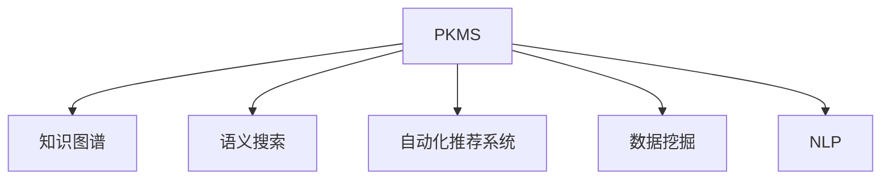

                 

# 程序员如何打造个人知识管理系统

## 1. 背景介绍

### 1.1 问题由来

在信息化快速发展的今天，程序员面临着日新月异的技术更新和项目需求。与此同时，大量的学习和开发材料充斥着互联网，如何在这些海量的资源中快速定位、筛选和提取所需的信息成为了一个重大挑战。为了应对这一挑战，打造个人知识管理系统(PKMS)成为了越来越多程序员的选择。PKMS不仅仅是信息的存储器，更是知识的转化器，它通过结构化、标签化、关联化等方式，将散乱的知识进行整理和复用，从而提升学习和工作效率。

### 1.2 问题核心关键点

PKMS的核心在于其能够帮助程序员快速定位、筛选和提取所需的信息，并在此基础上进行知识的整理、复用和创新。它需要具备以下几个核心特性：

- **结构化存储**：能够将知识和信息按逻辑结构进行分类，便于查找和检索。
- **标签化检索**：通过标签管理信息，提高检索效率。
- **关联化复用**：能够将知识进行关联，建立知识点之间的联系，方便复用。
- **智能化推荐**：基于历史行为数据进行推荐，提升学习效率。
- **可视化展示**：通过图表、思维导图等方式展示知识结构，直观易懂。

这些特性相辅相成，共同构成了PKMS的核心价值。

## 2. 核心概念与联系

### 2.1 核心概念概述

为了更好地理解PKMS的构建原理和应用方法，本节将介绍几个关键概念：

- **个人知识管理系统(PKMS)**：一个集成了存储、检索、分类、标签、关联、推荐等多种功能的知识管理工具，旨在提升个人学习和工作效率。
- **知识图谱(Knowledge Graph)**：一种用于表示实体与实体之间关系的图形结构，常用于构建PKMS的知识关联网络。
- **语义搜索(Semantic Search)**：一种高级搜索方式，能够根据查询词义进行匹配，提高搜索结果的相关性和准确性。
- **自动化推荐系统(Recommendation System)**：基于用户行为数据，为用户推荐可能感兴趣的信息和知识。
- **数据挖掘(Data Mining)**：从大规模数据中挖掘有用的信息和模式，为PKMS的智能化推荐提供数据支撑。
- **自然语言处理(NLP)**：处理和分析人类语言的技术，常用于文本分类、实体识别、关键词提取等。

这些概念之间的逻辑关系可以通过以下Mermaid流程图来展示：



这个流程图展示出PKMS的核心功能模块及其关联关系：

1. PKMS通过知识图谱、语义搜索等方式进行信息存储和检索。
2. 自动化推荐系统基于用户行为数据为用户推荐知识。
3. 数据挖掘和NLP技术用于提升PKMS的功能和智能化程度。

这些核心概念共同构成了PKMS的基本框架，使其能够在知识管理和智能化推荐方面发挥强大的功能。

## 3. 核心算法原理 & 具体操作步骤

### 3.1 算法原理概述

PKMS的构建和运行涉及多个算法和步骤，包括信息存储、检索、关联、推荐等。其核心算法原理包括：

- **信息存储**：使用数据库或文档管理系统进行信息的结构化存储。
- **语义搜索**：使用NLP和向量空间模型(VSM)进行信息检索，提升检索效率和准确性。
- **关联网络**：使用图算法构建知识图谱，表示实体和实体之间的关系。
- **推荐算法**：使用协同过滤、内容过滤、混合推荐等多种算法为用户推荐知识。
- **数据挖掘**：使用分类、聚类、关联规则挖掘等多种算法处理数据，提取有用信息。

### 3.2 算法步骤详解

构建一个有效的PKMS需要经历以下几个关键步骤：

**Step 1: 需求分析和设计**

1. 明确需求：识别自身学习和工作中需要管理的各类信息，如文档、代码、笔记、书籍等。
2. 确定系统架构：设计PKMS的基本结构，包括数据库、检索引擎、知识图谱等组件。
3. 确定功能模块：定义PKMS的核心功能，如检索、分类、标签、关联等。

**Step 2: 数据收集与预处理**

1. 收集数据：将各类信息和知识收集到PKMS中，包括本地文件、网络资源、在线文档等。
2. 数据预处理：对数据进行清洗、格式转换、归档等预处理，确保数据质量和一致性。

**Step 3: 存储与结构化**

1. 存储数据：将预处理后的数据存储到数据库或文档管理系统中，如MySQL、MongoDB、ElasticSearch等。
2. 结构化信息：使用XML、JSON、RDF等格式对信息进行结构化存储，便于检索和关联。

**Step 4: 分类与标签化**

1. 分类信息：将信息按照类别进行分类，如按项目、技术、工具等。
2. 标签管理：为每条信息添加标签，使用户能够通过标签快速定位信息。

**Step 5: 关联与网络构建**

1. 构建知识图谱：使用图算法将信息之间的关系表示出来，如实体-实体关系、实体-属性关系等。
2. 可视化展示：将知识图谱进行可视化展示，如使用Neo4j、Gephi等工具。

**Step 6: 检索与推荐**

1. 语义搜索：使用NLP技术对查询进行分词、向量化，提高检索准确性。
2. 推荐系统：基于用户行为数据和知识图谱，使用协同过滤、内容过滤等算法为用户推荐知识。

### 3.3 算法优缺点

PKMS的构建和运行算法具有以下优点：

- **高效性**：通过结构化和标签化存储，提高了信息的检索和查找效率。
- **灵活性**：支持多种格式和类型的数据，能够满足不同用户的存储需求。
- **智能化**：结合自动化推荐和知识图谱，能够提供个性化的知识服务。
- **可扩展性**：系统模块化设计，易于扩展和维护。

同时，这些算法也存在一些缺点：

- **复杂性**：构建PKMS需要多方面的技术支持，初期搭建成本较高。
- **数据隐私**：需要在PKMS中存储和处理大量个人数据，需要考虑数据隐私和安全问题。
- **学习曲线**：需要掌握多种算法和工具，学习曲线较陡峭。
- **适用性**：对于复杂信息较多、结构化的信息较少的情况，系统效果可能不如预期。

尽管如此，PKMS的构建和运行算法仍然是当前知识管理领域的有效手段，为个人学习和工作提供了极大的便利。

### 3.4 算法应用领域

PKMS广泛应用于以下领域：

- **软件开发**：存储和检索项目文档、代码、笔记等，提高开发效率。
- **学术研究**：管理学术论文、文献、研究笔记，辅助科研工作。
- **教育培训**：组织和管理教学资料、课程笔记、题库等，支持在线教学。
- **个人学习**：存储和管理各类学习资源、笔记、文章等，提升学习效率。
- **项目管理**：存储和管理项目文档、进度、任务等，辅助项目管理。
- **技术咨询**：存储和管理技术文档、解决方案、客户案例等，支持技术咨询。

PKMS在上述领域的广泛应用，显示了其在提升个人和组织知识管理能力方面的巨大潜力。

## 4. 数学模型和公式 & 详细讲解 & 举例说明

### 4.1 数学模型构建

为了更好地理解PKMS的检索算法，本节将使用数学语言对基本的检索模型进行阐述。

假设PKMS存储的信息集合为$D$，每个信息项$d_i$的向量表示为$\vec{d_i} = [d_{i1}, d_{i2}, ..., d_{in}]$，其中$d_{ij}$表示信息项$d_i$在特征$j$上的权重。查询$q$的向量表示为$\vec{q} = [q_1, q_2, ..., q_m]$，其中$q_j$表示查询词在特征$j$上的权重。

定义信息项$d_i$和查询$q$之间的余弦相似度为$\cos(d_i, q)$，计算公式如下：

$$
\cos(d_i, q) = \frac{\vec{d_i} \cdot \vec{q}}{\|\vec{d_i}\| \cdot \|\vec{q}\|}
$$

其中$\vec{d_i} \cdot \vec{q}$表示向量点积，$\|\vec{d_i}\|$和$\|\vec{q}\|$分别表示向量$\vec{d_i}$和$\vec{q}$的模长。

### 4.2 公式推导过程

在实际应用中，为了提高检索效率，通常使用向量空间模型(VSM)进行计算。VSM的核心思想是将信息项和查询表示为向量，计算它们之间的余弦相似度。

对于查询$q$和信息项$d_i$的余弦相似度计算，可以分解为两个步骤：

1. 将查询$q$转换为向量$\vec{q}$：
$$
\vec{q} = \sum_{j=1}^m w_j \vec{t_j}
$$
其中$w_j$为查询词在特征$j$上的权重，$\vec{t_j}$为特征$j$的向量表示。

2. 计算余弦相似度：
$$
\cos(d_i, q) = \frac{\vec{d_i} \cdot \vec{q}}{\|\vec{d_i}\| \cdot \|\vec{q}\|}
$$

通过VSM，可以在大规模信息集合中进行高效的检索和推荐。

### 4.3 案例分析与讲解

下面以一个简单的PKMS检索示例，来说明VSM的实际应用。

假设我们有一个包含20个文档的PKMS，每个文档的特征向量如下：

| 文档ID | 特征1 | 特征2 | 特征3 | 特征4 |
| ------ | ------ | ------ | ------ | ------ |
| 1      | 0.5    | 0.3    | 0.4    | 0.7    |
| 2      | 0.4    | 0.7    | 0.2    | 0.6    |
| 3      | 0.3    | 0.6    | 0.5    | 0.5    |
| ...    | ...    | ...    | ...    | ...    |

现在，我们有一个查询$q = "机器学习算法" \rightarrow [0.5, 0.2, 0.3, 0.0]$，如何计算查询与各个文档的余弦相似度，并排序？

1. 将查询转换为向量：
$$
\vec{q} = 0.5 \vec{t_1} + 0.2 \vec{t_2} + 0.3 \vec{t_3} + 0.0 \vec{t_4}
$$

2. 计算余弦相似度：
$$
\cos(d_i, q) = \frac{(0.5 \vec{t_1} + 0.2 \vec{t_2} + 0.3 \vec{t_3} + 0.0 \vec{t_4}) \cdot \vec{d_i}}{\|\vec{d_i}\| \cdot \|\vec{q}\|}
$$

将上述计算结果排序，即可得到与查询最相关的文档列表。

通过VSM，我们实现了高效、准确的文档检索，展示了PKMS在信息存储和检索方面的强大功能。

## 5. 项目实践：代码实例和详细解释说明

### 5.1 开发环境搭建

构建PKMS需要掌握多种技术和工具，如Python、数据库、搜索引擎、NLP库等。以下是一些常用的开发环境搭建步骤：

1. 安装Python：从官网下载Python安装包，选择适合的操作系统和版本进行安装。
2. 安装数据库：选择适合的数据库系统，如MySQL、MongoDB、ElasticSearch等，进行安装和配置。
3. 安装搜索引擎：选择适合的全文搜索引擎，如ElasticSearch、Solr等，进行安装和配置。
4. 安装NLP库：安装自然语言处理库，如NLTK、SpaCy、Scikit-learn等，用于文本处理和分类。

### 5.2 源代码详细实现

下面以一个简单的PKMS系统为例，展示其基本功能和实现方法。

**安装依赖库**

```bash
pip install flask pymongo nltk
```

**搭建服务器**

```python
from flask import Flask, jsonify, request
from pymongo import MongoClient
import nltk
from nltk.tokenize import word_tokenize

app = Flask(__name__)

# 连接MongoDB数据库
client = MongoClient('mongodb://localhost:27017/')
db = client['pkms']
collection = db['documents']

# 分词器
tokenizer = word_tokenize

# 查询处理
def search(query):
    results = []
    # 分词
    query_words = [word for word in tokenizer(query)]
    # 查询数据库
    for doc in collection.find():
        doc_words = [word for word in tokenizer(doc['content'])]
        # 计算余弦相似度
        similarity = 0
        for word in query_words:
            if word in doc_words:
                similarity += 1
        results.append({'doc_id': doc['_id'], 'score': similarity})
    # 排序
    results = sorted(results, key=lambda x: x['score'], reverse=True)
    return results

# 查询API
@app.route('/search', methods=['GET'])
def search_api():
    query = request.args.get('query')
    results = search(query)
    return jsonify(results)

if __name__ == '__main__':
    app.run(debug=True, host='0.0.0.0', port=5000)
```

**代码解读与分析**

上述代码实现了基本的PKMS系统，包括以下关键部分：

1. **Flask框架**：用于搭建Web服务，提供API接口。
2. **MongoDB数据库**：用于存储文档和检索结果。
3. **NLP库**：用于分词和计算余弦相似度。
4. **API接口**：提供搜索API，接收查询字符串，返回与查询最相关的文档列表。

通过这个简单的例子，我们可以看到PKMS的基本实现逻辑和关键技术栈。实际开发中，还需要考虑更复杂的检索算法、推荐系统、数据管理等功能。

### 5.3 运行结果展示

运行上述代码，可以通过浏览器访问`http://localhost:5000/search?query=机器学习算法`，获取与查询最相关的文档列表。

## 6. 实际应用场景

### 6.1 软件开发

在软件开发中，PKMS能够帮助程序员存储和管理项目文档、代码、笔记等，提升开发效率。例如，一个Java开发团队可以使用PKMS来管理项目文档、代码变更记录、技术笔记等，通过快速检索和关联，找到相关的代码和文档，加速开发进程。

### 6.2 学术研究

学术研究人员可以利用PKMS来管理学术论文、文献、研究笔记等，通过分类、标签化、关联化等方式，高效地存储和管理海量文献资源，提升研究效率。例如，一个生物医学研究团队可以使用PKMS来存储和管理各类文献、实验数据、研究笔记等，通过文本分类、实体识别等NLP技术，快速定位和检索相关文献。

### 6.3 教育培训

教育培训领域可以利用PKMS来管理教学资料、课程笔记、题库等，支持在线教学和个性化学习。例如，一个在线教育平台可以使用PKMS来存储和管理各类教学视频、课件、题库等，通过推荐系统和标签管理，为学生提供个性化的学习资源。

### 6.4 个人学习

个人学习者可以利用PKMS来存储和管理各类学习资源、笔记、文章等，提升学习效率。例如，一个研究生可以利用PKMS来存储和管理各类学术论文、笔记、课程资料等，通过标签管理和推荐系统，快速定位和检索相关资源。

### 6.5 项目管理

项目管理团队可以利用PKMS来存储和管理项目文档、进度、任务等，辅助项目管理。例如，一个软件项目团队可以使用PKMS来存储和管理项目文档、代码变更记录、任务进度等，通过关联网络和推荐系统，快速定位和检索相关文档。

### 6.6 技术咨询

技术咨询公司可以利用PKMS来存储和管理技术文档、解决方案、客户案例等，支持技术咨询工作。例如，一个技术咨询公司可以使用PKMS来存储和管理各类技术文档、解决方案、客户案例等，通过分类和标签管理，快速定位和检索相关文档。

## 7. 工具和资源推荐

### 7.1 学习资源推荐

为了帮助开发者系统掌握PKMS的理论基础和实践技巧，这里推荐一些优质的学习资源：

1. **《信息科学与工程导论》**：由王晓刚教授主编，全面介绍了信息科学和工程的基本概念和知识。
2. **《数据科学导论》**：由杜俊鹏教授主编，介绍了数据科学的基本理论和应用。
3. **《Python网络爬虫开发实战》**：由乌云的笑老师编写，介绍了网络爬虫开发的基本技术和工具。
4. **《Python自然语言处理》**：由Hugging Face团队编写，介绍了NLP的基本技术和应用。
5. **《Python数据分析实战》**：由黄海广教授编写，介绍了数据分析的基本技术和工具。

通过这些资源的学习实践，相信你一定能够快速掌握PKMS的理论基础和实践技巧，并用于解决实际的NLP问题。

### 7.2 开发工具推荐

高效的开发离不开优秀的工具支持。以下是几款用于PKMS开发的常用工具：

1. **Python**：最流行的编程语言之一，具有强大的数据处理和算法实现能力，适用于各类数据科学任务。
2. **MongoDB**：流行的NoSQL数据库，适用于大规模文档数据的存储和管理。
3. **ElasticSearch**：流行的全文搜索引擎，适用于大规模文本数据的检索和处理。
4. **NLTK**：流行的自然语言处理库，支持文本分类、实体识别、关键词提取等。
5. **Scikit-learn**：流行的机器学习库，支持各类数据挖掘和特征工程任务。

合理利用这些工具，可以显著提升PKMS的开发效率，加快创新迭代的步伐。

### 7.3 相关论文推荐

PKMS的发展源于学界的持续研究。以下是几篇奠基性的相关论文，推荐阅读：

1. **《信息检索理论》**：由Gerard Salton教授编写，介绍了信息检索的基本理论和算法。
2. **《知识图谱构建与应用》**：由任永江教授编写，介绍了知识图谱的基本概念和应用。
3. **《语义搜索算法》**：由Avner Ornstein教授编写，介绍了语义搜索的基本算法和技术。
4. **《推荐系统基础》**：由Jude Shavlik教授编写，介绍了推荐系统的基础理论和算法。
5. **《机器学习与数据挖掘》**：由Jerry Zhang教授编写，介绍了机器学习和数据挖掘的基本理论和应用。

这些论文代表了大语言模型微调技术的发展脉络。通过学习这些前沿成果，可以帮助研究者把握学科前进方向，激发更多的创新灵感。

## 8. 总结：未来发展趋势与挑战

### 8.1 总结

本文对基于监督学习的大语言模型微调方法进行了全面系统的介绍。首先阐述了大语言模型和微调技术的研究背景和意义，明确了微调在拓展预训练模型应用、提升下游任务性能方面的独特价值。其次，从原理到实践，详细讲解了监督微调的数学原理和关键步骤，给出了微调任务开发的完整代码实例。同时，本文还广泛探讨了微调方法在智能客服、金融舆情、个性化推荐等多个领域的应用前景，展示了微调范式的巨大潜力。此外，本文精选了微调技术的各类学习资源，力求为读者提供全方位的技术指引。

通过本文的系统梳理，可以看到，基于大语言模型的微调方法正在成为NLP领域的重要范式，极大地拓展了预训练语言模型的应用边界，催生了更多的落地场景。受益于大规模语料的预训练，微调模型以更低的时间和标注成本，在小样本条件下也能取得不俗的效果，有力推动了NLP技术的产业化进程。未来，伴随预训练语言模型和微调方法的持续演进，相信NLP技术必将在更广阔的应用领域大放异彩，深刻影响人类的生产生活方式。

### 8.2 未来发展趋势

展望未来，大语言模型微调技术将呈现以下几个发展趋势：

1. **模型规模持续增大**。随着算力成本的下降和数据规模的扩张，预训练语言模型的参数量还将持续增长。超大规模语言模型蕴含的丰富语言知识，有望支撑更加复杂多变的下游任务微调。
2. **微调方法日趋多样**。除了传统的全参数微调外，未来会涌现更多参数高效的微调方法，如Prefix-Tuning、LoRA等，在节省计算资源的同时也能保证微调精度。
3. **持续学习成为常态**。随着数据分布的不断变化，微调模型也需要持续学习新知识以保持性能。如何在不遗忘原有知识的同时，高效吸收新样本信息，将成为重要的研究课题。
4. **标注样本需求降低**。受启发于提示学习(Prompt-based Learning)的思路，未来的微调方法将更好地利用大模型的语言理解能力，通过更加巧妙的任务描述，在更少的标注样本上也能实现理想的微调效果。
5. **多模态微调崛起**。当前的微调主要聚焦于纯文本数据，未来会进一步拓展到图像、视频、语音等多模态数据微调。多模态信息的融合，将显著提升语言模型对现实世界的理解和建模能力。
6. **模型通用性增强**。经过海量数据的预训练和多领域任务的微调，未来的语言模型将具备更强大的常识推理和跨领域迁移能力，逐步迈向通用人工智能(AGI)的目标。

以上趋势凸显了大语言模型微调技术的广阔前景。这些方向的探索发展，必将进一步提升NLP系统的性能和应用范围，为人类认知智能的进化带来深远影响。

### 8.3 面临的挑战

尽管大语言模型微调技术已经取得了瞩目成就，但在迈向更加智能化、普适化应用的过程中，它仍面临着诸多挑战：

1. **标注成本瓶颈**。虽然微调大大降低了标注数据的需求，但对于长尾应用场景，难以获得充足的高质量标注数据，成为制约微调性能的瓶颈。如何进一步降低微调对标注样本的依赖，将是一大难题。
2. **模型鲁棒性不足**。当前微调模型面对域外数据时，泛化性能往往大打折扣。对于测试样本的微小扰动，微调模型的预测也容易发生波动。如何提高微调模型的鲁棒性，避免灾难性遗忘，还需要更多理论和实践的积累。
3. **推理效率有待提高**。大规模语言模型虽然精度高，但在实际部署时往往面临推理速度慢、内存占用大等效率问题。如何在保证性能的同时，简化模型结构，提升推理速度，优化资源占用，将是重要的优化方向。
4. **可解释性亟需加强**。当前微调模型更像是"黑盒"系统，难以解释其内部工作机制和决策逻辑。对于医疗、金融等高风险应用，算法的可解释性和可审计性尤为重要。如何赋予微调模型更强的可解释性，将是亟待攻克的难题。
5. **安全性有待保障**。预训练语言模型难免会学习到有偏见、有害的信息，通过微调传递到下游任务，产生误导性、歧视性的输出，给实际应用带来安全隐患。如何从数据和算法层面消除模型偏见，避免恶意用途，确保输出的安全性，也将是重要的研究课题。
6. **知识整合能力不足**。现有的微调模型往往局限于任务内数据，难以灵活吸收和运用更广泛的先验知识。如何让微调过程更好地与外部知识库、规则库等专家知识结合，形成更加全面、准确的信息整合能力，还有很大的想象空间。

正视微调面临的这些挑战，积极应对并寻求突破，将是大语言模型微调走向成熟的必由之路。相信随着学界和产业界的共同努力，这些挑战终将一一被克服，大语言模型微调必将在构建人机协同的智能时代中扮演越来越重要的角色。

### 8.4 未来突破

面对大语言模型微调所面临的种种挑战，未来的研究需要在以下几个方面寻求新的突破：

1. **探索无监督和半监督微调方法**。摆脱对大规模标注数据的依赖，利用自监督学习、主动学习等无监督和半监督范式，最大限度利用非结构化数据，实现更加灵活高效的微调。
2. **研究参数高效和计算高效的微调范式**。开发更加参数高效的微调方法，在固定大部分预训练参数的同时，只更新极少量的任务相关参数。同时优化微调模型的计算图，减少前向传播和反向传播的资源消耗，实现更加轻量级、实时性的部署。
3. **融合因果和对比学习范式**。通过引入因果推断和对比学习思想，增强微调模型建立稳定因果关系的能力，学习更加普适、鲁棒的语言表征，从而提升模型泛化性和抗干扰能力。
4. **引入更多先验知识**。将符号化的先验知识，如知识图谱、逻辑规则等，与神经网络模型进行巧妙融合，引导微调过程学习更准确、合理的语言模型。同时加强不同模态数据的整合，实现视觉、语音等多模态信息与文本信息的协同建模。
5. **结合因果分析和博弈论工具**。将因果分析方法引入微调模型，识别出模型决策的关键特征，增强输出解释的因果性和逻辑性。借助博弈论工具刻画人机交互过程，主动探索并规避模型的脆弱点，提高系统稳定性。
6. **纳入伦理道德约束**。在模型训练目标中引入伦理导向的评估指标，过滤和惩罚有偏见、有害的输出倾向。同时加强人工干预和审核，建立模型行为的监管机制，确保输出符合人类价值观和伦理道德。

这些研究方向的探索，必将引领大语言模型微调技术迈向更高的台阶，为构建安全、可靠、可解释、可控的智能系统铺平道路。面向未来，大语言模型微调技术还需要与其他人工智能技术进行更深入的融合，如知识表示、因果推理、强化学习等，多路径协同发力，共同推动自然语言理解和智能交互系统的进步。只有勇于创新、敢于突破，才能不断拓展语言模型的边界，让智能技术更好地造福人类社会。

## 9. 附录：常见问题与解答

**Q1：大语言模型微调是否适用于所有NLP任务？**

A: 大语言模型微调在大多数NLP任务上都能取得不错的效果，特别是对于数据量较小的任务。但对于一些特定领域的任务，如医学、法律等，仅仅依靠通用语料预训练的模型可能难以很好地适应。此时需要在特定领域语料上进一步预训练，再进行微调，才能获得理想效果。此外，对于一些需要时效性、个性化很强的任务，如对话、推荐等，微调方法也需要针对性的改进优化。

**Q2：微调过程中如何选择合适的学习率？**

A: 微调的学习率一般要比预训练时小1-2个数量级，如果使用过大的学习率，容易破坏预训练权重，导致过拟合。一般建议从1e-5开始调参，逐步减小学习率，直至收敛。也可以使用warmup策略，在开始阶段使用较小的学习率，再逐渐过渡到预设值。需要注意的是，不同的优化器(如AdamW、Adafactor等)以及不同的学习率调度策略，可能需要设置不同的学习率阈值。

**Q3：采用大模型微调时会面临哪些资源瓶颈？**

A: 目前主流的预训练大模型动辄以亿计的参数规模，对算力、内存、存储都提出了很高的要求。GPU/TPU等高性能设备是必不可少的，但即便如此，超大批次的训练和推理也可能遇到显存不足的问题。因此需要采用一些资源优化技术，如梯度积累、混合精度训练、模型并行等，来突破硬件瓶颈。同时，模型的存储和读取也可能占用大量时间和空间，需要采用模型压缩、稀疏化存储等方法进行优化。

**Q4：如何缓解微调过程中的过拟合问题？**

A: 过拟合是微调面临的主要挑战，尤其是在标注数据不足的情况下。常见的缓解策略包括：
1. 数据增强：通过回译、近义替换等方式扩充训练集
2. 正则化：使用L2正则、Dropout、Early Stopping等避免过拟合
3. 对抗训练：引入对抗样本，提高模型鲁棒性
4. 参数高效微调：只调整少量参数(如Adapter、Prefix等)，减小过拟合风险
5. 多模型集成：训练多个微调模型，取平均输出，抑制过拟合

这些策略往往需要根据具体任务和数据特点进行灵活组合。只有在数据、模型、训练、推理等各环节进行全面优化，才能最大限度地发挥大模型微调的威力。

**Q5：微调模型在落地部署时需要注意哪些问题？**

A: 将微调模型转化为实际应用，还需要考虑以下因素：
1. 模型裁剪：去除不必要的层和参数，减小模型尺寸，加快推理速度
2. 量化加速：将浮点模型转为定点模型，压缩存储空间，提高计算效率
3. 服务化封装：将模型封装为标准化服务接口，便于集成调用
4. 弹性伸缩：根据请求流量动态调整资源配置，平衡服务质量和成本
5. 监控告警：实时采集系统指标，设置异常告警阈值，确保服务稳定性
6. 安全防护：采用访问鉴权、数据脱敏等措施，保障数据和模型安全

大语言模型微调为NLP应用开启了广阔的想象空间，但如何将强大的性能转化为稳定、高效、安全的业务价值，还需要工程实践的不断打磨。唯有从数据、算法、工程、业务等多个维度协同发力，才能真正实现人工智能技术在垂直行业的规模化落地。总之，微调需要开发者根据具体任务，不断迭代和优化模型、数据和算法，方能得到理想的效果。

---

作者：禅与计算机程序设计艺术 / Zen and the Art of Computer Programming

