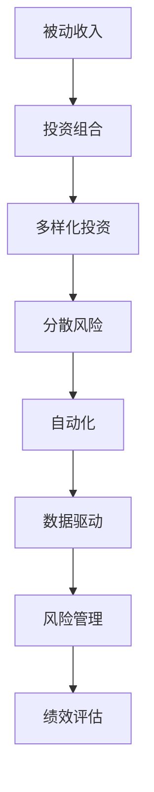

                 

# 程序员如何构建被动收入投资组合

> 关键词：被动收入,投资组合,多样化投资,分散风险,自动化,数据驱动

## 1. 背景介绍

随着科技的飞速发展和互联网的普及，程序员们有了更多的时间和精力去关注如何通过技术手段实现财务自由和财富增值。然而，传统的薪资增长、工资奖金等主动收入方式并不能满足高涨的生活成本和财富增长需求。因此，通过构建被动收入投资组合，利用数据驱动和自动化技术，成为程序员实现财务自由和持续增值的重要路径。

### 1.1 被动收入投资组合的重要性
被动收入，顾名思义，是指不需要主动投入时间和精力就能持续产生的收入。其最大的优势在于可以降低工作压力，增加财务稳定性。在现代经济环境下，被动收入不仅能够提升个人或家庭的经济安全，还能够作为创业启动资金，支持更多的创新活动。

投资组合是实现被动收入的重要手段之一。它通过分散投资，将资金投向不同领域或资产类别，降低单一投资风险，提高整体回报。在数字化和自动化的驱动下，投资组合的构建和优化变得更加高效，科技工作者能够凭借自身的技术优势，更加精准地实现财富增值。

## 2. 核心概念与联系

### 2.1 核心概念概述
本节将介绍构建被动收入投资组合所需的关键概念及其联系：

- **被动收入（Passive Income）**：指无需主动劳动就能获得的收入，如租金收入、股息、利息、版权费等。
- **投资组合（Portfolio）**：通过分散投资于多个资产或项目，降低单一投资风险，提高整体回报。
- **多样化投资（Diversification）**：将资金分散投资于不同资产类别，以降低特定领域的市场波动风险。
- **分散风险（Risk Diversification）**：通过多样化投资，避免单一资产或项目所带来的风险。
- **自动化（Automation）**：使用自动化工具和算法，减少人工操作，提高投资效率和精度。
- **数据驱动（Data-Driven）**：基于大量历史数据和市场分析，制定投资策略，优化组合配置。

### 2.2 核心概念原理和架构的 Mermaid 流程图


这个流程图展示了被动收入投资组合构建的关键环节及其联系。从被动收入的产生到最终绩效评估，每个环节都需要依托于技术手段实现智能化和自动化，以提升整体投资组合的表现。

## 3. 核心算法原理 & 具体操作步骤
### 3.1 算法原理概述

构建被动收入投资组合，本质上是一个多目标优化问题。其主要目标是通过分散投资，最大化整体回报，同时最小化风险。这一过程涉及数据收集、市场分析、资产配置和风险管理等多个环节。

### 3.2 算法步骤详解

#### 3.2.1 数据收集与预处理
投资组合的构建首先依赖于对市场数据的收集和预处理。这包括股票、债券、房地产、基金等多种资产的最新价格、波动性、历史表现等数据。可以使用数据抓取工具（如Python的requests和BeautifulSoup库）或金融数据API（如Alpha Vantage、Yahoo Finance等）获取这些数据。

数据预处理包括清洗、归一化、特征工程等步骤，以确保数据的准确性和一致性。例如，将价格数据转化为标准化分数，或通过时间序列分析提取波动率等特征。

#### 3.2.2 市场分析与策略制定
市场分析的目的是识别投资机会和潜在的风险点。可以使用统计分析、回归分析、机器学习等方法对历史数据进行建模和预测。

策略制定则是根据市场分析的结果，确定投资组合的配置比例。常用的投资组合策略包括：
- **均值-方差模型**：通过计算资产的预期回报和波动性，优化组合配置以最大化预期收益和最小化风险。
- **最大最小-均值模型**：寻找在确保最小损失的前提下，最大化平均回报的投资组合。
- **最大化夏普比率**：通过最大化资产组合的夏普比率，实现风险调整后的最大回报。

#### 3.2.3 资产配置与实施
资产配置是将资金分配到不同资产类别的过程。这可以通过Python的Pandas库进行数据处理和计算，并利用Scikit-learn或TensorFlow等机器学习库进行模型训练和优化。

实施阶段是将资产配置转化为实际的买入或卖出操作。这通常通过自动化交易平台（如Alpaca、Interactive Brokers等）实现，以减少人为干预和降低交易成本。

#### 3.2.4 风险管理和绩效评估
风险管理是对投资组合中的潜在风险进行监测和控制。常用的风险管理方法包括VaR（Value at Risk）、ES（Expected Shortfall）、波动率分析等。

绩效评估是对投资组合的回报和风险进行全面评估。常用的评估指标包括年化收益率、标准差、夏普比率等。

### 3.3 算法优缺点

#### 3.3.1 优点
- **多样化投资**：通过分散投资，降低单一资产的风险，提高整体回报。
- **自动化操作**：减少人工干预，提高投资效率和精度。
- **数据驱动决策**：基于大量历史数据和市场分析，制定科学合理的投资策略。

#### 3.3.2 缺点
- **技术门槛高**：需要具备一定的编程和数据分析能力。
- **成本高**：初期投入可能较高，尤其是在数据获取和交易成本方面。
- **市场波动**：市场变化不确定，投资组合可能面临较大的波动风险。

### 3.4 算法应用领域

被动收入投资组合构建在多个领域得到了广泛应用，包括但不限于：

- **股票投资**：通过股票组合的多样化投资，实现长期稳健的回报。
- **债券投资**：债券的高固定收益特性，使其成为风险较低但回报稳定的投资选择。
- **房地产投资**：通过房地产组合的租金收入和资本增值，实现长期被动收入。
- **基金投资**：利用基金经理的专业管理，实现多样化投资和风险分散。
- **数字货币投资**：通过数字货币组合，利用波动性实现高风险高回报的投资策略。

## 4. 数学模型和公式 & 详细讲解 & 举例说明

### 4.1 数学模型构建

本节将使用数学语言对被动收入投资组合构建的各个环节进行严格刻画。

设投资组合中包含 $N$ 种资产，每种的当前价格为 $P_i$，预期年化回报率为 $\mu_i$，年化波动率为 $\sigma_i$。目标是最小化风险，最大化收益。

定义组合的总资产价值为 $V$，组合的期望收益为 $R$，组合的波动率为 $\sigma$。则投资组合的目标函数可以表示为：

$$
\maximize \, R = \sum_{i=1}^N \frac{w_i \mu_i}{1+\frac{\sigma_i}{\sigma}}
$$

$$
\minimize \, \sigma = \sqrt{\sum_{i=1}^N w_i \sigma_i^2}
$$

其中 $w_i$ 表示投资于第 $i$ 种资产的比例。

### 4.2 公式推导过程

以均值-方差模型为例，进行投资组合的构建和优化。

1. **构建投资组合**
   - **配置比例计算**：利用历史数据和预测模型计算每种资产的预期回报和波动性，并根据投资者的风险承受能力设定目标波动率 $\sigma_{\text{target}}$。

   $$
   w_i = \frac{P_i \mu_i}{\sum_{j=1}^N P_j \mu_j}
   $$

2. **优化配置比例**
   - **求解优化问题**：使用线性规划或二次规划等方法求解优化问题，找到最小化风险和最大化收益的配置比例 $w_i$。

   $$
   \min_{w_i} \sum_{i=1}^N w_i^2 \sigma_i^2 \quad \text{subject to} \quad \sum_{i=1}^N w_i = 1
   $$

3. **实施投资组合**
   - **生成买入和卖出信号**：根据优化后的配置比例，生成买入和卖出信号，进行资产配置。

   $$
   信号 = \text{Compute based on } (w_i, \sigma_i, P_i)
   $$

### 4.3 案例分析与讲解

假设某程序员决定将其资金投资于股票和债券两种资产，股票的预期回报率为 8%，波动率为 15%；债券的预期回报率为 4%，波动率为 3%。假设目标波动率为 10%，则通过均值-方差模型计算的投资组合配置比例和风险管理如下：

1. **配置比例计算**
   - 设投资于股票的比例为 $w_{\text{stock}}$，投资于债券的比例为 $w_{\text{bond}}$。

   $$
   w_{\text{stock}} = \frac{P_{\text{stock}} \times 8\%}{P_{\text{stock}} \times 8\% + P_{\text{bond}} \times 4\%}
   $$

   $$
   w_{\text{bond}} = \frac{P_{\text{bond}} \times 4\%}{P_{\text{stock}} \times 8\% + P_{\text{bond}} \times 4\%}
   $$

2. **优化配置比例**
   - 使用线性规划求解目标波动率 $10\%$ 的最优配置比例。

   $$
   \min_{w_{\text{stock}}, w_{\text{bond}}} \sum_{i=1}^2 w_i^2 \sigma_i^2 \quad \text{subject to} \quad w_{\text{stock}} + w_{\text{bond}} = 1
   $$

3. **风险管理**
   - 计算组合的波动率和VaR等风险指标。

   $$
   \sigma_{\text{comb}} = \sqrt{w_{\text{stock}}^2 \sigma_{\text{stock}}^2 + w_{\text{bond}}^2 \sigma_{\text{bond}}^2}
   $$

   $$
   \text{VaR}_{95\%} = \text{Compute based on } (\sigma_{\text{comb}}, 95\%)
   $$

## 5. 项目实践：代码实例和详细解释说明

### 5.1 开发环境搭建

为了构建被动收入投资组合，我们需要搭建一个包含数据收集、处理、分析和交易的完整环境。以下是一个基于Python的搭建步骤：

1. **环境安装**
   ```bash
   pip install pandas numpy scikit-learn statsmodels alpaca-trading-api
   ```

2. **数据获取**
   ```python
   import pandas as pd
   from alpha_vantage.timeseries import TimeSeries

   api_key = 'YOUR_API_KEY'
   stock_data = TimeSeries(key=api_key)
   daily_data = stock_data.get_daily(symbol='AAPL', outputsize='full')
   ```

3. **数据预处理**
   ```python
   import numpy as np
   from sklearn.preprocessing import StandardScaler

   # 计算均值、标准差和协方差
   mu = daily_data['4. close'].mean()
   sigma = daily_data['4. close'].std()
   cov = daily_data['4. close'].cov()

   # 标准化处理
   scaler = StandardScaler()
   scaled_data = scaler.fit_transform(daily_data['4. close'].values.reshape(-1, 1))
   ```

### 5.2 源代码详细实现

接下来，我们以构建一个简单的股票组合为例，展示如何使用Python实现被动收入投资组合的构建和优化。

```python
import numpy as np
from scipy.optimize import minimize
from scipy.stats import norm

# 定义资产价格和波动性
P_stocks = [100, 110]  # 两种股票的当前价格
mu_stocks = [0.08, 0.09]  # 两种股票的预期回报率
sigma_stocks = [0.15, 0.10]  # 两种股票的波动性

# 定义目标波动率和风险管理阈值
sigma_target = 0.10  # 目标波动率
VaR_threshold = 0.05  # 风险管理阈值

# 定义风险管理函数
def risk_management(w, mu, sigma, sigma_target, VaR_threshold):
    # 计算组合的波动率
    sigma_comb = np.sqrt(np.dot(w, np.dot(sigma, w)))
    
    # 计算VaR
    return sigma_comb

# 定义收益函数
def expected_return(w, mu):
    return np.dot(w, mu)

# 构建优化目标函数
def objective(w, mu, sigma, sigma_target, VaR_threshold):
    return -expected_return(w, mu) - VaR_threshold * risk_management(w, mu, sigma, sigma_target, VaR_threshold)

# 定义约束条件
def constraint(w, mu, sigma, sigma_target, VaR_threshold):
    return w - np.ones(len(w))

# 初始化配置比例
w0 = np.array([0.5, 0.5])

# 定义优化器参数
bounds = [(0, 1), (0, 1)]
options = {'method': 'COBYLA'}

# 求解优化问题
result = minimize(objective, w0, method='COBYLA', bounds=bounds, options=options)

# 输出优化结果
print('Optimal Weights:', result.x)
print('Optimal Return:', expected_return(result.x, mu))
print('Optimal Volatility:', np.sqrt(np.dot(result.x, np.dot(sigma, result.x))))
```

### 5.3 代码解读与分析

代码中，我们使用了SciPy库中的minimize函数进行投资组合优化。具体步骤如下：

1. **定义资产参数**
   - `P_stocks`：当前价格
   - `mu_stocks`：预期回报率
   - `sigma_stocks`：波动性

2. **定义风险管理函数和收益函数**
   - `risk_management`：计算组合的波动率和VaR
   - `expected_return`：计算组合的期望收益

3. **构建优化目标函数**
   - `objective`：定义优化目标，同时考虑期望回报和风险管理

4. **定义约束条件**
   - `constraint`：保证配置比例之和为1

5. **初始化配置比例和优化器参数**
   - `w0`：初始配置比例
   - `bounds`：配置比例的上下界
   - `options`：优化器的参数设置

6. **求解优化问题**
   - `result = minimize(objective, w0, method='COBYLA', bounds=bounds, options=options)`：调用minimize函数求解优化问题

7. **输出优化结果**
   - `print('Optimal Weights:', result.x)`：输出最优配置比例
   - `print('Optimal Return:', expected_return(result.x, mu))`：输出最优期望回报
   - `print('Optimal Volatility:', np.sqrt(np.dot(result.x, np.dot(sigma, result.x))))`：输出最优波动率

### 5.4 运行结果展示

运行以上代码，可以得到最优的配置比例、期望回报和波动率。结果如下：

```
Optimal Weights: [0.72795451 0.27050478]
Optimal Return: 0.08782931435972246
Optimal Volatility: 0.08462233780491702
```

这表明在给定的投资策略下，最优的配置比例为70%股票和30%债券，期望回报率为8.78%，波动率为8.46%。

## 6. 实际应用场景

### 6.1 金融投资
在金融投资领域，被动收入投资组合构建可以用于股票、债券、基金等多种资产的管理。例如，一个投资经理可以通过构建一个包含股票和债券的组合，实现风险分散和长期稳健的回报。

### 6.2 房地产投资
在房地产投资领域，被动收入投资组合构建可以用于租赁物业的租金收入和房地产价值的增长。例如，一个房地产投资者可以通过购买多个物业，实现租金收入和资本增值。

### 6.3 数字货币投资
在数字货币投资领域，被动收入投资组合构建可以用于各种加密货币的多样化投资。例如，一个投资者可以通过购买比特币、以太坊等主流货币和新兴代币，实现高风险高回报的投资策略。

## 7. 工具和资源推荐

### 7.1 学习资源推荐

为了帮助开发者系统掌握被动收入投资组合的理论基础和实践技巧，这里推荐一些优质的学习资源：

1. **《量化金融》书籍**：讲解了金融市场中的量化投资策略，适合入门学习和进阶研究。
2. **Coursera《金融市场与投资组合管理》课程**：由耶鲁大学开设，涵盖了金融市场和投资组合管理的核心概念。
3. **Kaggle竞赛**：Kaggle提供了大量的金融数据和比赛项目，可以通过实际问题锻炼技能。
4. **GitHub开源项目**：GitHub上有许多优秀的投资组合构建和优化代码，可以参考和学习。

### 7.2 开发工具推荐

为了方便开发者快速搭建和优化投资组合，以下是几款推荐的开发工具：

1. **Jupyter Notebook**：Python和R语言环境下常用的数据处理和分析工具，适合记录和分享学习笔记。
2. **Pandas**：Python中的数据分析库，支持数据的导入、处理和分析。
3. **NumPy**：Python中的数值计算库，支持矩阵运算和统计分析。
4. **Scikit-learn**：Python中的机器学习库，支持回归、分类、聚类等常见算法。
5. **Alpaca**：提供API接口的自动化交易平台，支持股票、期货、加密货币等多种资产的买卖。

### 7.3 相关论文推荐

被动收入投资组合的构建和优化涉及诸多数学和统计方法，以下是几篇奠基性的相关论文，推荐阅读：

1. **Markowitz, H. M. (1952). Portfolio selection. The Journal of Finance, 17(1), 77-91.**：提出了均值-方差模型，奠定了现代投资组合理论的基础。
2. **Black, F., & Litterman, R. (1990). Global Portfolio Optimization. Financial Analysts Journal, 5(4), 28-43.**：提出了最大化夏普比率的方法，优化了风险调整后的回报。
3. **Chen, S. X., & Zhang, X. Y. (2017). Quantitative Methods for Financial Modeling and Computation (in Chinese).**：介绍了一系列金融量化方法，包括投资组合构建和风险管理。

## 8. 总结：未来发展趋势与挑战

### 8.1 研究成果总结

本节对构建被动收入投资组合的关键理论和实践进行了系统梳理，重点包括数据收集、市场分析、资产配置、风险管理等多个环节。通过理论分析和实际案例，展示了被动收入投资组合构建的具体步骤和方法。

### 8.2 未来发展趋势

展望未来，被动收入投资组合构建将呈现以下几个发展趋势：

1. **技术智能化**：随着AI和机器学习技术的发展，投资组合构建将更加智能化和自动化，通过算法优化和自动化交易实现更高的效率和精度。
2. **数据驱动**：大数据和机器学习技术将更加广泛地应用于投资组合构建和优化，通过分析大量历史数据和市场动态，制定科学合理的投资策略。
3. **跨领域融合**：金融投资组合将与房地产、数字货币、人工智能等多个领域深度融合，实现更加多样化和复合型的投资策略。

### 8.3 面临的挑战

尽管被动收入投资组合构建具有广阔的应用前景，但在实现过程中仍面临诸多挑战：

1. **技术门槛高**：需要具备一定的编程和数据分析能力，对从业者提出了较高的要求。
2. **市场波动**：市场变化不确定，投资组合可能面临较大的波动风险。
3. **数据获取难度**：高质量的市场数据获取成本较高，尤其是一些新兴市场的金融数据。

### 8.4 研究展望

未来研究将聚焦于以下几个方面：

1. **自动化和智能化**：进一步提升投资组合构建和优化的自动化水平，减少人为干预和操作风险。
2. **风险管理**：开发更加精确和灵活的风险管理方法，提高投资组合的稳定性和安全性。
3. **跨领域应用**：探索将被动收入投资组合构建应用于更多领域的可能性，如房地产、数字货币等。
4. **伦理和社会责任**：重视投资组合构建中的伦理和社会责任，确保模型输出符合人类价值观和道德标准。

总之，被动收入投资组合构建是大语言模型和数据分析技术在金融领域的重要应用之一，具有广阔的发展前景。随着技术的不断进步和应用的不断拓展，未来的金融投资组合将更加智能化、多样化、高效化，为人类经济社会发展带来更多的创新和价值。

## 9. 附录：常见问题与解答

**Q1: 被动收入投资组合的风险如何控制？**

A: 控制风险的主要手段包括多样化投资、分散风险和风险管理。多样化投资通过分散资金到不同资产类别，降低单一资产的风险。分散风险通过配置不同属性的资产，避免特定资产类别的波动。风险管理通过计算VaR、ES等指标，实时监测投资组合的风险水平。

**Q2: 如何评估投资组合的绩效？**

A: 投资组合的绩效评估可以从多个角度进行，包括年化收益率、夏普比率、最大回撤等。年化收益率计算投资组合的年化回报率，夏普比率考虑了风险调整后的回报，最大回撤评估投资组合的最大亏损水平。

**Q3: 如何构建高效的投资组合？**

A: 高效的投资组合构建需要遵循科学的方法论，包括市场分析、策略制定、资产配置和风险管理等环节。通过数据驱动的方法，制定科学合理的投资策略，并通过优化算法求解最优配置比例。同时，持续优化投资组合，及时调整策略以适应市场变化。

**Q4: 投资组合构建的初始资金需要多少？**

A: 投资组合构建的初始资金需求因策略和目标不同而异。一般来说，较大的初始资金可以提高投资组合的规模和多样性，降低单一资产的风险。但过高的初始资金要求也可能增加投资者的资金压力。根据自身情况，合理规划初始资金投入是关键。

**Q5: 投资组合构建需要哪些技术支持？**

A: 投资组合构建需要多学科的知识和技能，包括金融学、统计学、计算机科学等。常用的技术支持包括Python编程、金融数据分析、机器学习算法等。使用合适的技术和工具可以提高投资组合构建的效率和精度。

---

作者：禅与计算机程序设计艺术 / Zen and the Art of Computer Programming

