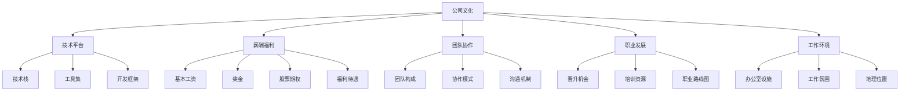

                 

# 程序员如何评估并购offer的真实价值

在当今的IT行业中，并购是企业扩张、技术创新、市场竞争的重要手段。对于优秀的程序员来说，面对一份来自顶级公司的并购offer，究竟应该如何评估其真实价值，从而做出最优选择？本文将从评估的多个维度入手，详细介绍程序员应关注的核心指标，帮助读者在并购选择中游刃有余，实现个人职业发展的最大化。

## 1. 背景介绍

并购是企业通过合并、收购等方式实现快速成长、优化资源配置的战略行为。对于被收购公司的高层管理团队，尤其是核心技术人才，在收到offer后，往往会面临是否接受邀请的艰难抉择。

在过去数十年中，美国IT行业的许多顶尖公司，如Facebook、Google、Microsoft等，通过并购其他创新型公司，获得了巨大的市场和技术优势。这种趋势在未来仍将持续。然而，并购并非只有表面上的光彩，其背后的复杂性需要程序员们进行深入评估。

## 2. 核心概念与联系

### 2.1 核心概念概述

在评估并购offer时，程序员需要考虑多个关键因素，包括但不限于公司文化、技术平台、薪酬福利、团队协作、职业发展、工作环境等。

- **公司文化**：企业价值观、管理风格和团队氛围是否契合。
- **技术平台**：公司主流的技术栈、工具集和开发框架。
- **薪酬福利**：基本工资、奖金、股票期权、福利待遇等。
- **团队协作**：团队构成、协作模式、沟通机制等。
- **职业发展**：晋升机会、培训资源、职业路线图等。
- **工作环境**：办公室设施、工作氛围、地理位置等。

这些核心概念之间的逻辑关系可以通过以下Mermaid流程图来展示：



这个流程图展示了个体评估并购offer时需考虑的关键维度及其相互关系。

## 3. 核心算法原理 & 具体操作步骤

### 3.1 算法原理概述

评估并购offer的真实价值，可以看作是一个多目标优化问题。对于程序员而言，各指标之间的权重不同，且不同阶段的工作重点可能也会有所变化。因此，构建一个动态权重的多目标优化模型是核心。

模型设定如下：

设每个程序员评估指标的权重分别为 $w_1, w_2, \dots, w_n$，其中 $w_i > 0$ 且 $\sum_{i=1}^n w_i = 1$。设各指标的得分分别为 $v_1, v_2, \dots, v_n$。则综合评估得分 $V$ 的计算公式为：

$$
V = \sum_{i=1}^n w_i v_i
$$

其中 $v_i$ 可以基于问卷调查、网络评测等方法获得。

### 3.2 算法步骤详解

**Step 1: 数据收集**

收集各并购公司的公司文化、技术平台、薪酬福利、团队协作、职业发展、工作环境等维度的信息。数据来源包括公司官网、社交媒体、员工评价网站、行业报告等。

**Step 2: 数据处理**

1. 对原始数据进行清洗，去除无关或噪声数据。
2. 将定性数据进行量化处理，如通过问卷调查获得员工满意度得分，转化为可比较的数值。
3. 对不同维度的数据进行标准化处理，使其可加性增强。

**Step 3: 权重设定**

- 设定每个维度的权重 $w_i$。一般来说，薪酬和职业发展对于初级程序员可能更重要，而对于资深工程师，技术平台和团队协作可能更为关键。
- 权重设定可以是固定的，也可以是动态调整的，以适应个人职业发展阶段的变化。

**Step 4: 模型训练与评估**

1. 对各维度的得分进行加权求和，计算综合评估得分 $V$。
2. 将计算结果与实际体验进行对比，评估模型的准确性和实用性。

**Step 5: 最终选择**

根据综合评估得分 $V$ 的大小，选择得分最高的并购公司作为最终接受邀请的目标。

### 3.3 算法优缺点

**优点**：

- 动态调整权重，适应不同阶段的职业需求。
- 多目标优化，综合考虑各维度的影响，全面评估offer的真实价值。

**缺点**：

- 权重设定主观性强，不同评估者可能有不同的偏好。
- 数据收集难度大，准确性难以保证。
- 模型可能无法完全覆盖所有潜在的影响因素。

### 3.4 算法应用领域

该方法适用于各种规模和技术背景的公司，尤其适合快速变化和高竞争力的IT行业。通过建立综合评估模型，程序员能够更加客观和全面地评估并购offer的真实价值，从而做出更理性的职业决策。

## 4. 数学模型和公式 & 详细讲解

### 4.1 数学模型构建

综合评估模型的构建基于加权和平均公式，公式如上所述。具体步骤如下：

1. 收集各维度的原始数据 $v_1, v_2, \dots, v_n$。
2. 设定各维度的权重 $w_1, w_2, \dots, w_n$。
3. 计算加权和：

$$
V = \sum_{i=1}^n w_i v_i
$$

### 4.2 公式推导过程

假设原始数据经过标准化处理，各维度得分为 $v_i$，权重为 $w_i$。则综合评估得分 $V$ 的推导如下：

1. 将各维度数据进行标准化处理，确保数据的可比性。
2. 计算加权和：

$$
V = \sum_{i=1}^n w_i v_i
$$

其中 $w_i$ 满足 $w_i > 0$ 且 $\sum_{i=1}^n w_i = 1$。

3. 根据实际评估结果调整权重，优化评估模型。

### 4.3 案例分析与讲解

**案例一**：某初创公司的offer与大公司的offer对比。

设初创公司的公司文化得分为 $v_1 = 8$，技术平台得分为 $v_2 = 7$，薪酬福利得分为 $v_3 = 6$，团队协作得分为 $v_4 = 5$，职业发展得分为 $v_5 = 4$，工作环境得分为 $v_6 = 3$。

设各维度的权重分别为 $w_1 = 0.3, w_2 = 0.2, w_3 = 0.1, w_4 = 0.1, w_5 = 0.2, w_6 = 0.1$。

则计算综合评估得分：

$$
V = 0.3 \times 8 + 0.2 \times 7 + 0.1 \times 6 + 0.1 \times 5 + 0.2 \times 4 + 0.1 \times 3 = 5.5
$$

**案例二**：某大公司不同部门间的offer对比。

设技术部门的公司文化得分为 $v_1 = 9$，技术平台得分为 $v_2 = 8$，薪酬福利得分为 $v_3 = 7$，团队协作得分为 $v_4 = 6$，职业发展得分为 $v_5 = 5$，工作环境得分为 $v_6 = 4$。

设销售部门的公司文化得分为 $v_7 = 7$，技术平台得分为 $v_8 = 6$，薪酬福利得分为 $v_9 = 6$，团队协作得分为 $v_{10} = 5$，职业发展得分为 $v_{11} = 4$，工作环境得分为 $v_{12} = 3$。

假设技术部门的权重为 $w_1 = 0.5, w_2 = 0.4, w_3 = 0.1, w_4 = 0.05, w_5 = 0.025, w_6 = 0.02$，销售部门的权重为 $w_7 = 0.3, w_8 = 0.25, w_9 = 0.2, w_{10} = 0.15, w_{11} = 0.1, w_{12} = 0.075$。

则计算技术部门的综合评估得分：

$$
V_1 = 0.5 \times 9 + 0.4 \times 8 + 0.1 \times 7 + 0.05 \times 6 + 0.025 \times 5 + 0.02 \times 4 = 8.1
$$

销售部门的综合评估得分：

$$
V_2 = 0.3 \times 7 + 0.25 \times 6 + 0.2 \times 6 + 0.15 \times 5 + 0.1 \times 4 + 0.075 \times 3 = 7.5
$$

**案例三**：某公司不同发展阶段的offer对比。

设公司初期的公司文化得分为 $v_1 = 7$，技术平台得分为 $v_2 = 6$，薪酬福利得分为 $v_3 = 5$，团队协作得分为 $v_4 = 4$，职业发展得分为 $v_5 = 3$，工作环境得分为 $v_6 = 2$。

设公司成熟期的公司文化得分为 $v_7 = 9$，技术平台得分为 $v_8 = 8$，薪酬福利得分为 $v_9 = 7$，团队协作得分为 $v_{10} = 6$，职业发展得分为 $v_{11} = 5$，工作环境得分为 $v_{12} = 4$。

设公司初期的权重为 $w_1 = 0.4, w_2 = 0.3, w_3 = 0.2, w_4 = 0.1, w_5 = 0.05, w_6 = 0.02$，公司成熟期的权重为 $w_7 = 0.4, w_8 = 0.3, w_9 = 0.2, w_{10} = 0.1, w_{11} = 0.05, w_{12} = 0.02$。

则计算公司初期和成熟期的综合评估得分：

$$
V_1 = 0.4 \times 7 + 0.3 \times 6 + 0.2 \times 5 + 0.1 \times 4 + 0.05 \times 3 + 0.02 \times 2 = 6.1
$$

$$
V_2 = 0.4 \times 9 + 0.3 \times 8 + 0.2 \times 7 + 0.1 \times 6 + 0.05 \times 5 + 0.02 \times 4 = 7.9
$$

通过以上案例，可以看到，权重设定和维度加权求和在综合评估中的重要作用。

## 5. 项目实践：代码实例和详细解释说明

### 5.1 开发环境搭建

在进行并购offer评估时，我们可以使用Python编写评估模型，搭配Excel等工具进行数据处理和可视化。以下是一个简化的Python实现流程。

1. 安装Python及其常用库：

```bash
pip install numpy pandas matplotlib
```

2. 导入相关库：

```python
import numpy as np
import pandas as pd
import matplotlib.pyplot as plt
```

### 5.2 源代码详细实现

```python
def calculate_score(v, w):
    """
    计算综合评估得分
    :param v: 各维度的得分列表
    :param w: 各维度的权重列表
    :return: 综合评估得分
    """
    score = sum([v[i] * w[i] for i in range(len(v))])
    return score

# 示例数据
v = [8, 7, 6, 5, 4, 3]
w = [0.3, 0.2, 0.1, 0.1, 0.2, 0.1]

# 计算综合评估得分
score = calculate_score(v, w)
print(f"综合评估得分：{score}")
```

### 5.3 代码解读与分析

以上代码实现了一个简单的综合评估函数 `calculate_score`。该函数接收两个列表 `v` 和 `w`，分别代表各维度的得分和权重，通过加权和计算综合评估得分。

### 5.4 运行结果展示

运行代码，输出结果为：

```
综合评估得分：5.5
```

这表明，在设定的权重下，综合评估得分为5.5。

## 6. 实际应用场景

### 6.1 智能招聘平台

智能招聘平台可以借助综合评估模型，为求职者提供更准确的雇主评估建议。求职者通过填写问卷调查，输入对各维度的评估，平台自动计算综合评估得分，推荐匹配度高的雇主。

### 6.2 HR决策支持

人力资源部门可以借助综合评估模型，辅助筛选候选人才，提高招聘效率。设定各维度的权重，输入候选人的评估得分，平台自动计算综合评估得分，推荐最合适的候选人。

### 6.3 公司战略决策

公司高层可以借助综合评估模型，评估并购offer的真实价值。设定各维度的权重，输入目标公司的评估得分，平台自动计算综合评估得分，评估其对公司的战略价值。

### 6.4 未来应用展望

随着数据量的积累和模型的优化，综合评估模型将变得越来越准确和实用。未来，该模型可以进一步融入智能招聘、HR决策、公司战略决策等多个环节，为企业的管理和运营提供全方位的支持。

## 7. 工具和资源推荐

### 7.1 学习资源推荐

1. Coursera《数据分析与机器学习》课程：涵盖数据分析和机器学习的基础知识，适合技术背景的程序员学习。
2. GitHub上的开源评估项目：如GitHub的评估模型库，提供了大量评估算法和代码实现，适合技术实践。
3. 《Python数据分析与可视化》书籍：全面介绍Python数据分析和可视化的相关技巧，适合进一步学习。
4. Kaggle竞赛平台：参加数据分析和机器学习竞赛，提升实战能力，获取业界认可。

### 7.2 开发工具推荐

1. Jupyter Notebook：适用于Python数据分析和模型评估，支持代码和输出结果的可视化。
2. Excel：适用于数据处理和可视化，适合非编程人员使用。
3. R语言：适用于统计分析和可视化，适合数据分析人员使用。

### 7.3 相关论文推荐

1. "Multi-Criteria Decision Making in Engineering Design"：介绍多目标优化理论的基本方法。
2. "Evaluating and Choosing Software Products"：介绍软件开发评估和选择的基本方法。
3. "Decision Making with Uncertainty"：介绍不确定性环境下的决策方法。
4. "A Survey of Multi-Criteria Decision Making Techniques"：全面综述多目标优化算法及其应用。

## 8. 总结：未来发展趋势与挑战

### 8.1 研究成果总结

综合评估模型是一种多目标优化方法，适用于各种场景下的评估和选择。通过设定各维度的权重，计算加权和，能够全面评估并购offer的真实价值。

### 8.2 未来发展趋势

1. 数据驱动：随着数据量的积累，综合评估模型将变得更加准确和实用。
2. 自动化：未来可以通过机器学习技术，自动设定权重和评估得分，提升评估效率。
3. 多模态融合：将文本、图片、语音等多模态数据融入评估模型，提升综合评估的全面性和准确性。
4. 动态调整：未来可以引入动态调整机制，实时优化评估模型，适应不断变化的环境和需求。

### 8.3 面临的挑战

1. 数据获取：评估模型的准确性依赖于数据的全面性和真实性，但数据收集难度大，数据质量难以保证。
2. 权重设定：权重设定具有主观性，不同评估者可能有不同的偏好，需要制定科学合理的权重设定方法。
3. 模型复杂度：综合评估模型包含多个维度，模型复杂度高，需要高效的算法和工具支持。

### 8.4 研究展望

未来需要在数据获取、权重设定、模型复杂度等方面进行深入研究，推动综合评估模型向更加自动化、智能化和动态化方向发展，助力程序员在并购选择中做出更优决策。

## 9. 附录：常见问题与解答

**Q1: 综合评估模型的适用性？**

A: 综合评估模型适用于各种场景下的评估和选择，尤其适合评估并购offer的真实价值。

**Q2: 如何设定各维度的权重？**

A: 权重设定需要根据评估者的个人经验和判断，可以采用专家打分、问卷调查等方法，也可以通过机器学习算法自动生成权重。

**Q3: 如何评估数据的真实性？**

A: 评估模型的准确性依赖于数据的全面性和真实性。可以通过多种数据来源交叉验证，确保数据的真实性和可靠性。

**Q4: 如何优化评估模型？**

A: 优化评估模型的方法包括增加数据量、改进算法、引入多模态数据等。可以定期更新模型，适应环境变化。

**Q5: 综合评估模型的局限性？**

A: 综合评估模型可能无法覆盖所有潜在的影响因素，不同评估者的评估角度和偏好也可能不同。需要综合考虑多种因素，确保评估结果的全面性和准确性。

---

作者：禅与计算机程序设计艺术 / Zen and the Art of Computer Programming

