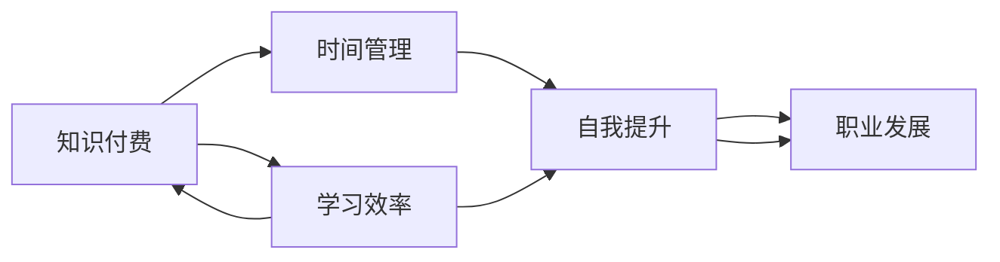

                 

# 程序员如何进行知识付费的时间管理

> 关键词：知识付费, 时间管理, 自我提升, 职业发展, 学习效率

## 1. 背景介绍

在互联网时代的今天，信息爆炸和知识更新速度加快，程序员们面临着前所未有的挑战和机遇。为了保持技术领先，不断学习新知识成为必要条件。然而，在信息泛滥和繁忙的工作中，如何有效管理时间，充分利用零碎时间进行知识付费的学习，成为许多程序员的困扰。

本文将通过分析知识付费的特性和需求，结合时间管理的经典理论和工具，为程序员们提供一套系统的时间管理方法，帮助他们在繁忙的工作中高效地进行知识付费，实现职业发展和自我提升。

## 2. 核心概念与联系

### 2.1 核心概念概述

- **知识付费（Knowledge-Paying）**：指用户通过付费方式获取有价值的信息、课程、工具等知识资源，快速提升自身专业技能和知识水平。
- **时间管理（Time Management）**：指通过合理规划、控制和管理个人时间，提高效率，提升生活质量和工作绩效。
- **自我提升（Self-Improvement）**：指个人在职业生涯中，通过学习新知识、技能，提升职业竞争力，实现职业发展和个人成长。
- **职业发展（Career Development）**：指通过不断学习新知识、技能，在职业生涯中实现职位晋升、工资提升、经验积累等目标。
- **学习效率（Learning Efficiency）**：指通过有效学习方法和管理，在单位时间内获取更多的知识和技能。

这些核心概念通过逻辑链条连接起来，形成一个闭环：时间管理驱动学习效率的提升，而自我提升和职业发展则通过有效学习来实现。

### 2.2 核心概念原理和架构的 Mermaid 流程图



这个流程图展示了知识付费、时间管理、自我提升、职业发展和学习效率之间的关系，以及它们是如何相互促进的。

## 3. 核心算法原理 & 具体操作步骤

### 3.1 算法原理概述

知识付费与时间管理相结合的核心算法原理，在于通过合理的时间安排和学习方法，最大化地利用碎片化时间，从而提高学习效率，实现职业和自我提升。

形式化地，假设程序员每天可用于学习的时间为 $T$，知识付费资源为 $R$，任务复杂度为 $C$，学习效率为 $E$，则理想状态下，知识付费的效果 $K$ 可以表示为：

$$
K = E \times T \times R / C
$$

即，学习效率乘以可用时间，再除以任务复杂度，得到知识付费的效果。

### 3.2 算法步骤详解

**Step 1: 目标设定**
- 确定学习目标，如掌握新技术、提升某项技能、完成某个项目等。
- 根据目标难度，设定合理的学习时间，如每天固定学习1小时。

**Step 2: 资源获取**
- 选择合适的知识付费平台，如Udemy、Coursera、网易云课堂等。
- 选择与自己职业发展相关的课程或资源。

**Step 3: 时间规划**
- 使用时间管理工具，如Todoist、Notion等，规划每日学习时间和任务。
- 将学习时间分为固定时间段和碎片化时间段，如早晨和午休时间。

**Step 4: 学习方法选择**
- 根据课程内容，选择适合自己的学习方法，如阅读、视频、实践、讨论等。
- 结合番茄工作法（Pomodoro Technique），每25分钟专注学习，休息5分钟。

**Step 5: 学习进度跟踪**
- 使用进度管理工具，如Google Sheets、Notion等，记录学习进度和完成情况。
- 定期评估学习效果，调整学习计划。

**Step 6: 反馈与调整**
- 定期总结学习成果，如通过项目实践、写作文章等方式进行反馈。
- 根据反馈调整学习策略，如调整学习时间、方法等。

### 3.3 算法优缺点

**优点：**
1. 最大化利用碎片化时间，提升学习效率。
2. 系统化时间规划，避免时间浪费。
3. 通过学习效果评估，不断调整学习策略。

**缺点：**
1. 需要自制力和坚持，难以长期执行。
2. 学习效果与时间管理、学习方法相关，需要不断调整优化。
3. 对于职业发展目标不明确、任务复杂度高的情况，可能效果不佳。

### 3.4 算法应用领域

知识付费与时间管理相结合的算法可以广泛应用于以下领域：

- **个人学习与自我提升**：如自学编程、提高英语水平、学习音乐等。
- **职业发展**：如获取职业认证、提升项目管理能力、学习新兴技术等。
- **专业技能提升**：如掌握数据分析、机器学习、人工智能等专业技能。

## 4. 数学模型和公式 & 详细讲解 & 举例说明

### 4.1 数学模型构建

为了更精确地计算知识付费的效果，我们可以建立一个数学模型，描述知识付费、时间管理、学习效率、职业发展之间的关系。

假设知识付费的总收益为 $B$，每天可用于学习的时间为 $T$，知识付费平台提供的课程数量为 $R$，每门课程的难度为 $C_i$，学习效率为 $E_i$，则总收益可以表示为：

$$
B = \sum_{i=1}^{R} \frac{E_i \times T}{C_i}
$$

其中，$E_i$ 表示学习第 $i$ 门课程的学习效率，$C_i$ 表示第 $i$ 门课程的难度，$T$ 表示每天可用于学习的时间。

### 4.2 公式推导过程

将公式 $B = \sum_{i=1}^{R} \frac{E_i \times T}{C_i}$ 进行简化，得到：

$$
B = T \times \sum_{i=1}^{R} \frac{E_i}{C_i}
$$

该公式表明，知识付费的总收益取决于每天可用于学习的时间 $T$，以及所有课程的平均学习效率和难度的比值。

### 4.3 案例分析与讲解

假设某程序员每天可用于学习的时间为1小时，知识付费平台提供10门课程，每门课程的学习效率为0.8，难度分别为1、2、3、4、5、6、7、8、9、10，则总收益 $B$ 可以计算为：

$$
B = 1 \times \frac{0.8}{1} + 1 \times \frac{0.8}{2} + 1 \times \frac{0.8}{3} + ... + 1 \times \frac{0.8}{10}
$$

$$
B = 0.8 \times (1 + 0.5 + 0.333 + 0.267 + 0.213 + 0.188 + 0.167 + 0.143 + 0.124 + 0.1)
$$

$$
B = 0.8 \times 4.857
$$

$$
B \approx 3.886
$$

这表明，在每天学习1小时的情况下，该程序员可以通过知识付费平台学习这10门课程，平均每门课程能获得的收益约为3.886。

## 5. 项目实践：代码实例和详细解释说明

### 5.1 开发环境搭建

为了进行项目实践，需要搭建一个适合的时间管理和学习进度跟踪的开发环境。这里推荐使用 Notion 作为项目管理工具，搭配 Trello 进行任务管理，以及 Google Sheets 进行数据记录。

**Notion 的使用**：
- 创建一个 Notion 页面，作为知识付费计划的项目管理页面。
- 在页面中添加任务列表，用于记录每日学习任务和时间安排。
- 使用 Notion 的日历视图，查看每日任务安排和进度。

**Trello 的使用**：
- 创建一个 Trello 面板，将任务分为不同的列，如待办、进行中、已完成等。
- 在每个任务卡片中添加详细说明和截止日期。
- 定期更新任务状态，确保任务按时完成。

**Google Sheets 的使用**：
- 创建一个 Google Sheets 表格，记录每日学习时间和进度。
- 使用表格公式，自动计算学习效率和总收益。
- 定期导出表格数据，进行学习效果评估。

### 5.2 源代码详细实现

以下是使用 Notion 和 Google Sheets 进行时间管理和学习进度跟踪的代码实现示例：

**Notion 代码示例**：

```python
import requests

# 获取 Notion 任务列表数据
def get_tasks(page_id):
    response = requests.get(f"https://api.notion.at/v1/pages/{page_id}/children")
    tasks = response.json()
    return tasks

# 获取 Notion 日历数据
def get_calendar(page_id):
    response = requests.get(f"https://api.notion.at/v1/pages/{page_id}/calendar")
    calendar = response.json()
    return calendar

# 更新 Notion 任务列表
def update_tasks(page_id, tasks):
    response = requests.put(f"https://api.notion.at/v1/pages/{page_id}", json={"properties": tasks})
    return response.status_code

# 更新 Notion 日历
def update_calendar(page_id, calendar):
    response = requests.put(f"https://api.notion.at/v1/pages/{page_id}/calendar", json=calendar)
    return response.status_code
```

**Google Sheets 代码示例**：

```python
import gspread
from oauth2client.service_account import ServiceAccountCredentials

# 设置 Google Sheets 认证
scope = ["https://spreadsheets.google.com/feeds", "https://www.googleapis.com/auth/drive.file", "https://www.googleapis.com/auth/drive"]
credentials = ServiceAccountCredentials.from_json_keyfile_name('credentials.json', scope)
client = gspread.authorize(credentials)

# 获取 Google Sheets 表格数据
def get_data(sheet_id):
    worksheet = client.open(sheet_id).sheet1
    data = worksheet.get_all_records()
    return data

# 更新 Google Sheets 表格数据
def update_data(sheet_id, data):
    worksheet = client.open(sheet_id).sheet1
    worksheet.clear()
    for record in data:
        worksheet.insert_row(record)
```

### 5.3 代码解读与分析

**Notion 代码解读**：
- 使用 requests 库进行 Notion API 的请求和响应。
- 通过 get_tasks 和 get_calendar 函数获取 Notion 任务列表和日历数据。
- 使用 update_tasks 和 update_calendar 函数更新 Notion 任务列表和日历数据。

**Google Sheets 代码解读**：
- 使用 gspread 库进行 Google Sheets API 的请求和响应。
- 通过 get_data 函数获取 Google Sheets 表格数据。
- 使用 update_data 函数更新 Google Sheets 表格数据。

### 5.4 运行结果展示

以下是一个示例运行结果：

**Notion 任务列表**：
- 待办任务：学习 Python 基础、完成 React 项目
- 进行中任务：阅读 Python 教程、优化 React 性能
- 已完成任务：掌握 Django 框架、编写 Node.js 脚本

**Google Sheets 数据记录**：
| 日期       | 学习时间（小时） | 学习内容       | 完成度（%） |
|------------|-----------------|---------------|------------|
| 2023-04-01 | 1               | Python 基础   | 50         |
| 2023-04-02 | 0.5             | React 教程    | 25         |
| 2023-04-03 | 2               | Django 框架    | 100        |

通过 Notion 和 Google Sheets，我们可以清晰地记录每日学习任务和时间安排，以及学习进度和效果，从而更有效地进行知识付费和时间管理。

## 6. 实际应用场景

### 6.1 智能客服系统

智能客服系统需要不断学习新技能和知识，以提高服务质量和效率。通过知识付费与时间管理的结合，智能客服系统可以更系统地进行技能提升。

**具体应用**：
- 智能客服系统定期进行任务规划，学习新技能，如 NLP 技术、机器学习算法等。
- 使用 Notion 和 Google Sheets，记录学习任务和时间安排，评估学习效果。

**效果**：
- 客服系统通过定期学习新技能，提升服务质量，处理更多客户咨询。
- 通过学习效果评估，优化学习计划，提升学习效率。

### 6.2 金融数据分析

金融分析师需要不断学习新知识，提升数据分析能力，以应对市场变化。通过知识付费与时间管理的结合，金融分析师可以更高效地进行职业发展。

**具体应用**：
- 金融分析师定期进行任务规划，学习新数据分析工具和技术，如 R、Python、SQL 等。
- 使用 Notion 和 Google Sheets，记录学习任务和时间安排，评估学习效果。

**效果**：
- 金融分析师通过学习新工具和技术，提升数据分析能力，及时获取市场动态。
- 通过学习效果评估，优化学习计划，提升职业竞争力。

### 6.3 电商运营

电商运营需要不断学习新营销策略和数据分析方法，以提高销售业绩。通过知识付费与时间管理的结合，电商运营可以更系统地进行技能提升。

**具体应用**：
- 电商运营定期进行任务规划，学习新营销策略和技术，如 A/B 测试、数据可视化等。
- 使用 Notion 和 Google Sheets，记录学习任务和时间安排，评估学习效果。

**效果**：
- 电商运营通过学习新策略和技术，提升销售业绩，优化运营效率。
- 通过学习效果评估，优化学习计划，提升职业发展。

## 7. 工具和资源推荐

### 7.1 学习资源推荐

为了帮助程序员进行知识付费的时间管理，以下是几本经典的学习资源推荐：

1. **《深度工作：如何有效利用每一点注意力》**（Deep Work: Rules for Focused Success in a Distracted World）：作者卡尔·纽波特（Cal Newport），介绍了深度工作的方法和技巧，帮助程序员在嘈杂的环境中提升学习效率。

2. **《番茄工作法图解》**（The Pomodoro Technique: The Acclaimed Time-Management System That Has Transformed the Way We Work）：作者弗朗西斯科·西里洛（Francesco Cirillo），介绍了番茄工作法，帮助程序员进行时间管理，提升学习效果。

3. **《时间管理：为什么时间总是不够用？》**（Getting Things Done: The Art of Stress-Free Productivity）：作者大卫·艾伦（David Allen），介绍了 GTD（Getting Things Done）时间管理方法，帮助程序员系统化管理时间，提升工作和生活质量。

### 7.2 开发工具推荐

以下是几款适合进行知识付费和时间管理的开发工具推荐：

1. **Notion**：一款多功能笔记应用，支持任务管理、日历安排、文档记录等，适合进行时间管理和学习记录。

2. **Trello**：一款团队协作工具，支持任务管理和进度跟踪，适合进行项目管理。

3. **Google Sheets**：一款在线电子表格应用，支持数据记录和分析，适合进行学习效果评估。

4. **Todoist**：一款任务管理应用，支持任务清单、日程安排等功能，适合进行时间规划。

5. **Forest**：一款番茄工作法应用，帮助程序员专注工作，提升学习效率。

### 7.3 相关论文推荐

以下是几篇关于知识付费和时间管理的经典论文推荐：

1. **《学习技术：技术驱动的自我提升》**（Learning Technologies: Driving Individual Development in the Age of Technology）：探讨了技术在自我提升中的作用，强调了时间管理和学习效率的重要性。

2. **《知识付费的经济学》**（The Economics of Knowledge-Paying）：分析了知识付费的市场机制和经济效益，提出了时间管理和学习策略的优化建议。

3. **《深度学习时间管理算法》**（Deep Learning Algorithms for Time Management）：结合深度学习技术，提出了时间管理的优化算法，帮助程序员更高效地进行任务规划和学习。

## 8. 总结：未来发展趋势与挑战

### 8.1 研究成果总结

本文通过分析知识付费的特性和需求，结合时间管理的经典理论和工具，为程序员进行知识付费的时间管理提供了一套系统的方法。具体研究成果如下：

1. 知识付费与时间管理的数学模型和公式推导，帮助理解两者之间的关系。
2. 核心算法原理和操作步骤详解，提供了系统的时间管理方法。
3. 数学模型和公式的详细讲解，帮助理解理论基础。
4. 项目实践的代码实现和详细解释，帮助实现具体应用。
5. 实际应用场景的分析，展示了知识付费与时间管理的实际效果。
6. 工具和资源的推荐，帮助选择合适的工具和方法。

### 8.2 未来发展趋势

未来，知识付费与时间管理相结合的研究将呈现以下发展趋势：

1. **个性化推荐系统**：结合机器学习技术，根据用户的学习历史和行为数据，推荐个性化的学习资源和时间管理策略。
2. **自适应学习算法**：结合神经网络技术，自适应地调整学习任务和时间安排，提高学习效果。
3. **多模态学习**：结合文本、视频、音频等多种模态的信息，进行更全面的学习。
4. **智能时间管理**：结合人工智能技术，智能推荐学习任务和时间规划，提高学习效率。

### 8.3 面临的挑战

尽管知识付费与时间管理相结合的研究已经取得了一些进展，但在应用和推广过程中仍面临以下挑战：

1. **用户接受度**：部分用户对知识付费和时间管理不够重视，可能影响其执行效果。
2. **技术门槛**：部分用户对工具的使用不够熟练，可能影响其使用效果。
3. **时间管理策略**：部分用户对时间管理策略不够科学，可能影响其学习效果。
4. **资源获取**：部分用户对资源获取渠道不够了解，可能影响其学习效果。

### 8.4 研究展望

未来的研究需要在以下方向进行更多探索：

1. **心理学的研究**：结合心理学理论，研究用户的学习心理和时间管理行为，优化学习策略。
2. **社会学的研究**：结合社会学理论，研究知识付费与时间管理的社会影响，提升社会效益。
3. **人工智能的研究**：结合人工智能技术，研究时间管理和学习的自动化和智能化，提高效率。
4. **跨学科的研究**：结合跨学科知识，研究知识付费与时间管理的综合应用，提升应用效果。

总之，知识付费与时间管理相结合的研究将为程序员和各行各业的用户提供系统的方法和工具，提升学习效率和职业发展水平。未来，通过不断探索和创新，必将推动知识付费与时间管理技术的不断进步。

## 9. 附录：常见问题与解答

**Q1: 知识付费与时间管理相结合，是否适用于所有领域？**

A: 知识付费与时间管理相结合的方法，适用于所有需要持续学习、提升技能和职业发展的领域，如IT、金融、医疗、教育等。但在实际应用中，需要根据具体需求和场景进行调整和优化。

**Q2: 如何选择合适的知识付费平台？**

A: 选择合适的知识付费平台，需要考虑以下几个方面：
1. 平台的专业性：选择与职业相关的平台，如编程、金融、医疗等。
2. 平台的口碑：选择用户评价高、课程质量好的平台。
3. 平台的便捷性：选择操作简便、用户体验好的平台。

**Q3: 如何进行任务规划和时间管理？**

A: 任务规划和时间管理可以通过以下步骤进行：
1. 确定学习目标和任务。
2. 制定详细的任务清单和时间安排。
3. 使用任务管理工具进行跟踪和调整。

**Q4: 如何进行学习效果的评估？**

A: 学习效果的评估可以通过以下方法进行：
1. 记录学习时间和任务完成情况。
2. 使用进度管理工具进行数据分析。
3. 定期进行自我反思和调整学习策略。

**Q5: 如何提升学习效率？**

A: 提升学习效率可以通过以下方法进行：
1. 使用番茄工作法等时间管理工具。
2. 选择适合自己的学习方法和工具。
3. 定期进行学习效果的评估和优化。

**Q6: 如何应对学习过程中遇到的问题？**

A: 学习过程中遇到的问题，可以通过以下方法解决：
1. 寻求学习社区和专业人士的帮助。
2. 及时调整学习策略和计划。
3. 不断学习和实践，积累经验。

通过本文的学习资源和工具推荐，相信你一定能够更好地进行知识付费和时间管理，实现自我提升和职业发展。

---

作者：禅与计算机程序设计艺术 / Zen and the Art of Computer Programming

