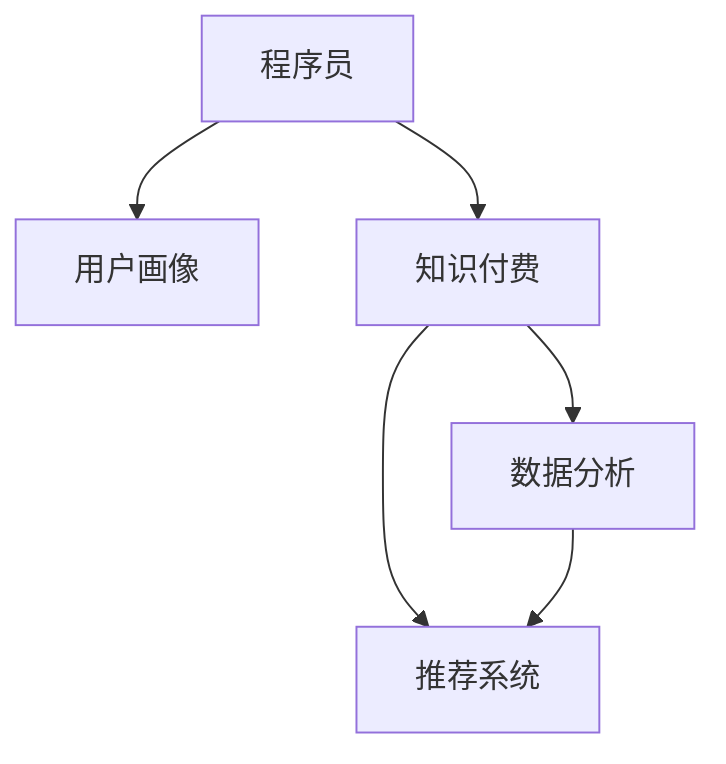

                 

# 程序员如何进行知识付费的用户画像分析

## 1. 背景介绍

### 1.1 问题由来

随着互联网技术的发展，知识付费平台如雨后春笋般涌现，为人们提供了高效获取知识和技能的机会。然而，面对庞大的用户群体，如何精准定位、理解用户需求，成为知识付费平台持续发展的关键。其中，程序员作为知识付费的重要用户群体，他们的需求特点、消费行为、满意度等特征，值得深入分析。

### 1.2 问题核心关键点

- 程序员的用户画像：程序员的需求和行为特征。
- 知识付费的商业模式：如何通过精准定位和数据分析，提高知识付费的转化率和用户满意度。
- 技术实现路径：如何利用机器学习和大数据技术，对程序员进行用户画像分析。

## 2. 核心概念与联系

### 2.1 核心概念概述

为更好地理解程序员知识付费的用户画像分析，本节将介绍几个密切相关的核心概念：

- 程序员（Programmers）：指从事软件开发、维护、测试、架构等工作的专业人士。
- 用户画像（User Persona）：通过数据分析和访谈等手段，构建的某一类用户群体的典型特征。
- 知识付费（Knowledge-Pay）：用户通过付费获取有价值知识和技能的服务模式。
- 数据分析（Data Analysis）：利用统计学和机器学习等手段，分析用户数据，以获得有价值的洞见。
- 推荐系统（Recommendation System）：通过用户画像和行为数据，推荐用户感兴趣的内容和产品。

这些概念之间的逻辑关系可以通过以下Mermaid流程图来展示：



这个流程图展示了一系列核心概念的相互关系：

1. 程序员通过知识付费获取知识和技能。
2. 利用数据分析技术，构建程序员的用户画像，理解他们的需求和行为。
3. 根据用户画像，推荐合适的知识付费产品，提升用户满意度和转化率。

## 3. 核心算法原理 & 具体操作步骤
### 3.1 算法原理概述

程序员知识付费用户画像分析的核心在于通过数据分析技术，从海量用户行为数据中提取程序员群体的典型特征和需求。其基本流程如下：

1. 数据收集：收集程序员在知识付费平台上的各种行为数据，如浏览、购买、评价、互动等。
2. 数据清洗：清洗和处理数据，去除噪声和异常值，确保分析的准确性。
3. 特征工程：选择和构造有意义的用户特征，如职业、技能、兴趣、学习进度等。
4. 用户画像构建：通过机器学习模型，将用户特征转化为典型的用户画像，便于理解不同程序员群体的需求和行为。
5. 行为预测：利用用户画像和推荐系统，预测程序员的下一步行为，如选择购买哪些课程，学习进度如何等。

### 3.2 算法步骤详解

#### 3.2.1 数据收集

数据收集是分析的第一步。常见的数据来源包括：

- 知识付费平台的用户行为数据：如浏览记录、购买历史、评价反馈等。
- 公开的行业数据：如编程语言使用比例、热门技术栈等。
- 社交媒体和论坛的数据：程序员在这些平台上的活跃度和讨论内容。

通过数据爬虫、API接口等方式，获取这些数据，并进行预处理。

#### 3.2.2 数据清洗

数据清洗的目的是去除无效和噪声数据，提高分析的准确性。主要步骤包括：

- 数据去重：去除重复记录和噪声数据。
- 数据格式化：将不同来源的数据进行格式统一，如日期格式、货币单位等。
- 异常值检测和处理：识别并处理异常数据，如错误的评分、不合理的购买行为等。

#### 3.2.3 特征工程

特征工程是构建用户画像的关键步骤，包括特征选择和特征构造两个方面。

##### 特征选择
常用的特征选择方法包括：

- 相关性分析：通过计算特征与目标变量之间的相关系数，选择与目标变量高度相关的特征。
- 卡方检验：通过卡方检验检测特征与目标变量之间的独立性，选择具有统计意义的特征。
- 信息增益：通过计算信息增益，选择能够提供最大信息量的特征。

##### 特征构造
特征构造的方法包括：

- 文本特征提取：通过NLP技术，提取文本数据中的关键特征，如主题、情感等。
- 时间序列特征：提取用户行为的时间序列特征，如学习时间分布、购买频率等。
- 交互特征：结合用户的互动数据，构造具有交互意义的特征，如评论互动率、学习进度等。

#### 3.2.4 用户画像构建

用户画像构建的核心是通过机器学习模型，将用户特征转化为典型用户画像。常用的机器学习算法包括：

- 聚类算法：如K-means、DBSCAN等，将用户分为不同群组，每个群组代表一种用户画像。
- 分类算法：如Logistic回归、随机森林等，预测用户是否属于某种类型，生成二元化的用户画像。
- 降维算法：如主成分分析（PCA）、t-SNE等，将高维特征映射到低维空间，可视化用户画像。

#### 3.2.5 行为预测

行为预测的目的是预测程序员的下一步行为，提高知识付费的转化率和用户满意度。常用的推荐算法包括：

- 协同过滤算法：通过用户和物品之间的相似度，推荐类似用户可能感兴趣的物品。
- 内容推荐算法：通过分析用户行为，推荐与其兴趣相关的内容。
- 混合推荐算法：结合协同过滤和内容推荐，提高推荐的准确性和多样性。

### 3.3 算法优缺点

程序员知识付费用户画像分析的优势在于：

- 提升用户体验：通过精准定位和个性化推荐，提高用户满意度。
- 优化知识付费产品：了解用户需求，优化课程内容和定价策略。
- 增加用户粘性：通过个性化服务，增加用户的持续使用率和复购率。

缺点包括：

- 数据隐私问题：收集和分析用户数据，可能侵犯用户隐私。
- 算法复杂性：用户画像和行为预测的算法复杂，需要较高的技术门槛。
- 用户多样性：程序员群体需求多样，难以通过单一模型全面覆盖。

## 4. 数学模型和公式 & 详细讲解 & 举例说明（备注：数学公式请使用latex格式，latex嵌入文中独立段落使用 $$，段落内使用 $)
### 4.1 数学模型构建

设程序员群体为 $P$，知识付费平台为 $C$，平台用户数为 $U$，购买课程数为 $B$，浏览课程数为 $V$，用户评价数为 $R$，则用户画像分析的基本数学模型为：

$$
P \rightarrow C
$$

其中，箭头表示因果关系，即程序员群体通过知识付费平台获取知识和技能。

### 4.2 公式推导过程

设用户特征集合为 $\mathbf{X} = \{x_1, x_2, \ldots, x_n\}$，用户画像模型为 $\hat{P}$，则用户画像的推导公式为：

$$
\hat{P} = f(\mathbf{X})
$$

其中 $f$ 为特征映射函数，将用户特征映射为用户画像。

### 4.3 案例分析与讲解

以一个在线编程学习平台为例，分析程序员用户画像的构建和应用。

假设有一个在线编程学习平台，有 $10,000$ 名程序员用户，每名用户每月浏览 $5$ 门课程，购买 $1$ 门课程，评价 $3$ 门课程。通过数据收集和处理，得到以下数据：

- 用户 ID：$1, 2, \ldots, 10000$
- 浏览课程数量：$1, 2, \ldots, 5$
- 购买课程数量：$0, 1, \ldots, 1$
- 评价课程数量：$0, 1, \ldots, 3$

对这些数据进行特征工程，构造如下特征：

- 用户 ID：$1, 2, \ldots, 10000$
- 浏览课程数量：$1, 2, \ldots, 5$
- 购买课程数量：$0, 1$
- 评价课程数量：$0, 1, 2, 3$
- 购买课程金额：$0, 10, 20, \ldots, 100$
- 学习时间分布：$0, 1, 2, \ldots, 30$

通过K-means聚类算法，将用户分为两类，每一类代表一种用户画像。

设第一类用户画像为 $A$，第二类用户画像为 $B$。通过计算用户画像与购买课程数量之间的相关性，可以得到以下结果：

- 用户画像 $A$ 的平均购买课程数量为 $1.5$
- 用户画像 $B$ 的平均购买课程数量为 $2.0$

## 5. 项目实践：代码实例和详细解释说明
### 5.1 开发环境搭建

在进行程序员知识付费用户画像分析的项目实践前，我们需要准备好开发环境。以下是使用Python进行PyTorch开发的环境配置流程：

1. 安装Anaconda：从官网下载并安装Anaconda，用于创建独立的Python环境。

2. 创建并激活虚拟环境：
```bash
conda create -n pytorch-env python=3.8 
conda activate pytorch-env
```

3. 安装PyTorch：根据CUDA版本，从官网获取对应的安装命令。例如：
```bash
conda install pytorch torchvision torchaudio cudatoolkit=11.1 -c pytorch -c conda-forge
```

4. 安装Pandas、Scikit-learn、Numpy等数据处理工具包：
```bash
pip install pandas scikit-learn numpy matplotlib tqdm jupyter notebook ipython
```

完成上述步骤后，即可在`pytorch-env`环境中开始项目实践。

### 5.2 源代码详细实现

下面我们以一个简单的用户画像分析为例，给出使用PyTorch进行程序员知识付费用户画像分析的代码实现。

```python
import pandas as pd
import numpy as np
from sklearn.decomposition import PCA
from sklearn.cluster import KMeans
from sklearn.preprocessing import StandardScaler

# 数据读取和处理
df = pd.read_csv('user_data.csv')
df = df.dropna()  # 去除缺失数据
df = df.drop_duplicates()  # 去除重复记录

# 数据清洗
df = df.drop(['user_id', 'course_id'], axis=1)  # 去除用户ID和课程ID
df = df.dropna()  # 去除缺失数据

# 特征工程
features = df.drop(['purchase_amount', 'study_time'], axis=1)  # 去除无关特征
features = pd.get_dummies(features, columns=['feature_column'], prefix='feature')  # 构造哑变量

# 数据标准化
scaler = StandardScaler()
features = scaler.fit_transform(features)

# K-means聚类
kmeans = KMeans(n_clusters=2, random_state=42)
kmeans.fit(features)

# 结果可视化
import matplotlib.pyplot as plt
plt.scatter(features[:, 0], features[:, 1], c=kmeans.labels_)
plt.xlabel('特征1')
plt.ylabel('特征2')
plt.title('用户画像聚类')
plt.show()
```

### 5.3 代码解读与分析

让我们再详细解读一下关键代码的实现细节：

**数据读取和处理**：
- `pd.read_csv('user_data.csv')`：从CSV文件中读取数据。
- `df = df.dropna()`：去除缺失数据。
- `df = df.drop_duplicates()`：去除重复记录。

**数据清洗**：
- `df = df.drop(['user_id', 'course_id'], axis=1)`：去除用户ID和课程ID，只保留行为数据。
- `df = df.dropna()`：再次去除缺失数据。

**特征工程**：
- `features = df.drop(['purchase_amount', 'study_time'], axis=1)`：去除与购买和学时相关的特征，只保留与行为相关的特征。
- `features = pd.get_dummies(features, columns=['feature_column'], prefix='feature')`：将分类特征转换为哑变量，便于聚类分析。

**数据标准化**：
- `scaler = StandardScaler()`：创建标准化器。
- `features = scaler.fit_transform(features)`：对特征进行标准化。

**聚类分析**：
- `kmeans = KMeans(n_clusters=2, random_state=42)`：创建K-means聚类模型，分为2个簇。
- `kmeans.fit(features)`：对标准化后的特征进行聚类。

**结果可视化**：
- `plt.scatter(features[:, 0], features[:, 1], c=kmeans.labels_)`：绘制聚类结果散点图。
- `plt.xlabel('特征1')`：设置横坐标标签。
- `plt.ylabel('特征2')`：设置纵坐标标签。
- `plt.title('用户画像聚类')`：设置图表标题。
- `plt.show()`：显示图表。

可以看到，通过简单的代码实现，我们可以对程序员知识付费用户的行为数据进行特征提取和聚类分析，构建用户画像。

## 6. 实际应用场景
### 6.1 在线编程学习平台

在线编程学习平台通过用户画像分析，可以更好地了解程序员的学习需求和行为，优化课程推荐和定价策略。

- 课程推荐：通过用户画像，预测用户可能感兴趣的新课程，提前做好内容准备，提高课程转化率。
- 定价策略：分析用户画像，了解不同群体的付费意愿，优化课程定价，提升整体收益。
- 学习进度：通过用户画像，监控学习进度，提供个性化的学习建议，提高学习效果。

### 6.2 企业内训系统

企业内训系统通过用户画像分析，可以更好地匹配员工的技能需求和培训内容，提升培训效果。

- 员工画像：通过数据分析，了解员工的技能水平和职业发展规划。
- 培训内容：根据员工画像，推荐适合的培训课程和内容，提高培训的针对性和效果。
- 绩效评估：通过用户画像，分析员工培训后的绩效变化，评估培训效果。

### 6.3 职业发展平台

职业发展平台通过用户画像分析，可以更好地为程序员提供职业规划和发展建议。

- 职业发展：通过数据分析，了解程序员的职业发展路径和需求，提供职业规划建议。
- 技能提升：根据用户画像，推荐适合的培训课程和认证项目，提升程序员的技能水平。
- 网络互动：通过用户画像，匹配合适的同行和专家，拓展人脉和资源。

### 6.4 未来应用展望

随着数据分析技术的不断进步，程序员知识付费用户画像分析将更加精准和高效，为知识付费平台和相关企业带来更大的商业价值。

- 多维数据分析：结合行为数据和社交网络数据，全面分析程序员的需求和行为。
- 实时动态分析：通过实时数据分析，动态调整推荐策略，提高用户体验。
- 个性化服务：基于用户画像，提供更加个性化和智能化的服务，提升用户满意度和留存率。

## 7. 工具和资源推荐
### 7.1 学习资源推荐

为了帮助开发者系统掌握程序员知识付费用户画像分析的理论基础和实践技巧，这里推荐一些优质的学习资源：

1. 《Python数据分析实战》系列书籍：全面介绍数据分析和机器学习的实战技巧，适合初学者和进阶者。
2. 《数据科学入门》系列课程：由知名数据科学家讲授的数据科学入门课程，涵盖数据分析、机器学习、数据可视化等基础知识。
3. Kaggle竞赛平台：参加Kaggle竞赛，锻炼数据分析和机器学习技能，提升实战能力。
4. Coursera、edX等在线教育平台：提供大量数据分析和机器学习的课程，涵盖理论和实践。
5. DataCamp、Udacity等在线学习平台：提供数据科学和机器学习的实战课程，涵盖数据分析、数据处理、机器学习等技术。

通过这些资源的学习实践，相信你一定能够快速掌握程序员知识付费用户画像分析的精髓，并用于解决实际的商业问题。

### 7.2 开发工具推荐

高效的开发离不开优秀的工具支持。以下是几款用于程序员知识付费用户画像分析开发的常用工具：

1. Jupyter Notebook：免费的开源笔记本，支持Python、R等多种编程语言，非常适合数据探索和分析。
2. Python：Python作为数据科学的主流语言，功能强大，拥有丰富的数据处理和机器学习库。
3. PyTorch：基于Python的开源深度学习框架，适合数据科学和机器学习的开发和研究。
4. Pandas：Python的数据处理库，提供强大的数据清洗和分析功能。
5. Scikit-learn：Python的机器学习库，提供丰富的机器学习算法和工具。

合理利用这些工具，可以显著提升程序员知识付费用户画像分析的开发效率，加快创新迭代的步伐。

### 7.3 相关论文推荐

程序员知识付费用户画像分析的研究源于学界的持续探索。以下是几篇奠基性的相关论文，推荐阅读：

1. 《利用机器学习进行用户画像分析》：介绍机器学习在用户画像分析中的应用，探讨不同的算法和模型。
2. 《程序员知识付费行为研究》：通过数据分析，探讨程序员在知识付费平台上的行为模式和需求。
3. 《基于聚类分析的用户画像构建》：介绍聚类算法在用户画像构建中的应用，分析不同用户画像的特征和行为。
4. 《深度学习在推荐系统中的应用》：介绍深度学习在推荐系统中的应用，探讨不同的模型和算法。
5. 《基于多模态数据的用户画像分析》：介绍多模态数据在用户画像分析中的应用，探讨不同数据源的融合方法。

这些论文代表了大语言模型微调技术的发展脉络。通过学习这些前沿成果，可以帮助研究者把握学科前进方向，激发更多的创新灵感。

## 8. 总结：未来发展趋势与挑战
### 8.1 总结

本文对程序员知识付费用户画像分析方法进行了全面系统的介绍。首先阐述了程序员的需求和行为特征，明确了知识付费平台通过精准定位和数据分析，提高用户满意度和转化率的独特价值。其次，从原理到实践，详细讲解了用户画像构建和行为预测的基本流程，给出了用户画像分析的完整代码实例。同时，本文还广泛探讨了用户画像在在线编程学习平台、企业内训系统、职业发展平台等场景中的应用前景，展示了用户画像范式的巨大潜力。最后，本文精选了用户画像分析的学习资源、开发工具和相关论文，力求为读者提供全方位的技术指引。

通过本文的系统梳理，可以看到，程序员知识付费用户画像分析方法正在成为知识付费平台的重要范式，极大地拓展了知识付费平台的商业价值。未来，伴随数据分析技术的不断进步，用户画像分析将更加精准和高效，为知识付费平台和相关企业带来更大的商业机会。

### 8.2 未来发展趋势

展望未来，程序员知识付费用户画像分析将呈现以下几个发展趋势：

1. 多模态数据分析：结合行为数据、社交网络数据、知识图谱等，全面分析程序员的需求和行为。
2. 实时动态分析：通过实时数据分析，动态调整推荐策略，提高用户体验。
3. 个性化服务：基于用户画像，提供更加个性化和智能化的服务，提升用户满意度和留存率。
4. 自动化模型训练：利用自动化机器学习工具，快速构建和优化用户画像模型，提高数据分析效率。
5. 联邦学习：通过联邦学习技术，保护用户隐私，实现跨企业数据共享和协同分析。
6. 可解释性增强：提高用户画像分析的可解释性，增强用户对推荐结果的理解和信任。

以上趋势凸显了程序员知识付费用户画像分析技术的广阔前景。这些方向的探索发展，必将进一步提升知识付费平台的商业价值，推动知识付费技术向更高的台阶迈进。

### 8.3 面临的挑战

尽管程序员知识付费用户画像分析技术已经取得了显著成果，但在迈向更加智能化、普适化应用的过程中，它仍面临着诸多挑战：

1. 数据隐私问题：收集和分析用户数据，可能侵犯用户隐私。
2. 算法复杂性：用户画像和行为预测的算法复杂，需要较高的技术门槛。
3. 用户多样性：程序员群体需求多样，难以通过单一模型全面覆盖。
4. 数据质量问题：数据收集和处理过程中，可能存在噪声和异常值，影响分析结果。
5. 模型鲁棒性：用户画像模型在面对复杂和多样化的数据时，可能表现不佳。

正视这些挑战，积极应对并寻求突破，将是大语言模型微调走向成熟的必由之路。相信随着学界和产业界的共同努力，这些挑战终将一一被克服，程序员知识付费用户画像分析必将在构建人机协同的智能时代中扮演越来越重要的角色。

### 8.4 研究展望

面对程序员知识付费用户画像分析所面临的挑战，未来的研究需要在以下几个方面寻求新的突破：

1. 增强数据隐私保护：利用隐私保护技术，如差分隐私、联邦学习等，保护用户隐私。
2. 提升算法效率：利用自动化机器学习工具，快速构建和优化用户画像模型，提高数据分析效率。
3. 多模态数据融合：结合行为数据、社交网络数据、知识图谱等，全面分析程序员的需求和行为。
4. 实时动态分析：通过实时数据分析，动态调整推荐策略，提高用户体验。
5. 提高模型鲁棒性：利用异常检测和数据清洗技术，提高用户画像模型的鲁棒性。
6. 增强模型可解释性：利用可解释性算法，提高用户画像分析的可解释性，增强用户对推荐结果的理解和信任。

这些研究方向的探索，必将引领程序员知识付费用户画像分析技术迈向更高的台阶，为构建安全、可靠、可解释、可控的智能系统铺平道路。面向未来，程序员知识付费用户画像分析技术还需要与其他人工智能技术进行更深入的融合，如知识表示、因果推理、强化学习等，多路径协同发力，共同推动自然语言理解和智能交互系统的进步。只有勇于创新、敢于突破，才能不断拓展语言模型的边界，让智能技术更好地造福人类社会。

## 9. 附录：常见问题与解答

**Q1：程序员用户画像分析的目的是什么？**

A: 程序员用户画像分析的目的是通过数据分析和机器学习技术，构建程序员群体的典型特征和需求，从而优化知识付费平台的课程推荐、定价策略、学习进度监控等，提升用户满意度和转化率。

**Q2：程序员用户画像分析涉及哪些关键步骤？**

A: 程序员用户画像分析涉及的关键步骤包括：数据收集、数据清洗、特征工程、用户画像构建和行为预测。具体步骤如下：

1. 数据收集：收集程序员在知识付费平台上的各种行为数据。
2. 数据清洗：清洗和处理数据，去除噪声和异常值，确保分析的准确性。
3. 特征工程：选择和构造有意义的用户特征，如职业、技能、兴趣、学习进度等。
4. 用户画像构建：通过机器学习模型，将用户特征转化为典型的用户画像，便于理解不同程序员群体的需求和行为。
5. 行为预测：利用用户画像和推荐系统，预测程序员的下一步行为，如选择购买哪些课程，学习进度如何等。

**Q3：程序员用户画像分析的优势和局限性是什么？**

A: 程序员用户画像分析的优势在于：

1. 提升用户体验：通过精准定位和个性化推荐，提高用户满意度。
2. 优化知识付费产品：了解用户需求，优化课程内容和定价策略。
3. 增加用户粘性：通过个性化服务，增加用户的持续使用率和复购率。

局限性包括：

1. 数据隐私问题：收集和分析用户数据，可能侵犯用户隐私。
2. 算法复杂性：用户画像和行为预测的算法复杂，需要较高的技术门槛。
3. 用户多样性：程序员群体需求多样，难以通过单一模型全面覆盖。

**Q4：程序员用户画像分析的实现方法有哪些？**

A: 程序员用户画像分析的实现方法包括：

1. 数据收集：通过爬虫、API接口等方式，获取程序员在知识付费平台上的各种行为数据。
2. 数据清洗：使用数据清洗工具，去除无效和噪声数据。
3. 特征工程：选择和构造有意义的用户特征，如职业、技能、兴趣、学习进度等。
4. 用户画像构建：通过机器学习模型，将用户特征转化为典型的用户画像，如K-means聚类、Logistic回归、随机森林等。
5. 行为预测：利用推荐算法，预测程序员的下一步行为，如协同过滤算法、内容推荐算法、混合推荐算法等。

这些方法结合使用，可以全面构建程序员用户画像，并用于优化知识付费平台的运营。

**Q5：程序员用户画像分析的未来发展方向是什么？**

A: 程序员用户画像分析的未来发展方向包括：

1. 多模态数据分析：结合行为数据、社交网络数据、知识图谱等，全面分析程序员的需求和行为。
2. 实时动态分析：通过实时数据分析，动态调整推荐策略，提高用户体验。
3. 个性化服务：基于用户画像，提供更加个性化和智能化的服务，提升用户满意度和留存率。
4. 自动化模型训练：利用自动化机器学习工具，快速构建和优化用户画像模型，提高数据分析效率。
5. 联邦学习：通过联邦学习技术，保护用户隐私，实现跨企业数据共享和协同分析。
6. 可解释性增强：利用可解释性算法，提高用户画像分析的可解释性，增强用户对推荐结果的理解和信任。

这些发展方向将推动程序员用户画像分析技术不断进步，为知识付费平台带来更大的商业机会。

---

作者：禅与计算机程序设计艺术 / Zen and the Art of Computer Programming

