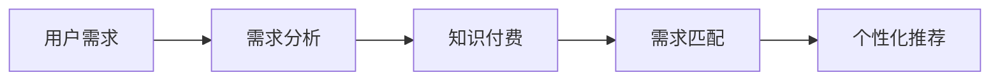

                 

# 程序员如何进行知识付费的用户需求挖掘

## 1. 背景介绍

在当今这个信息爆炸的时代，知识付费已成为一种越来越流行的商业模式，许多程序员、开发者和软件工程师正在通过各种平台和渠道提供自己的知识和技能，以此来获取收入。然而，了解和挖掘用户需求是知识付费成功的关键。本文将从背景、需求挖掘的核心概念与联系、算法原理与具体操作步骤等方面进行全面介绍，帮助程序员更好地理解如何进行用户需求挖掘。

## 2. 核心概念与联系

### 2.1 核心概念概述

为了更好地理解程序员如何进行知识付费的用户需求挖掘，我们先定义以下几个核心概念：

1. **用户需求**：用户需要什么知识、技能或服务来解决问题或提升能力。
2. **需求分析**：通过一系列方法，收集和分析用户反馈、市场趋势、竞品分析等数据，以发现用户的具体需求。
3. **知识付费**：知识提供者通过平台向用户提供有价值的内容，以获取报酬。
4. **需求匹配**：将用户需求与知识提供者的内容进行匹配，以实现知识的最优配置。
5. **个性化推荐**：根据用户的历史行为、兴趣等数据，推荐最符合其需求的内容。

这些概念构成了知识付费用户需求挖掘的基础，通过理解这些概念，可以更系统地进行需求分析，优化内容推荐，提升用户满意度。

### 2.2 核心概念联系（Mermaid 流程图）



这个流程图展示了用户需求从分析到匹配，再到个性化推荐的过程。用户需求是起点，通过需求分析挖掘用户的需求，然后匹配到合适的知识付费内容，最后通过个性化推荐满足用户需求。

## 3. 核心算法原理 & 具体操作步骤

### 3.1 算法原理概述

知识付费用户需求挖掘的本质是一个数据驱动的过程，涉及到用户行为分析、数据挖掘、机器学习等多个领域。以下是用户需求挖掘的主要算法原理：

1. **用户行为分析**：通过分析用户在平台上的操作记录（如浏览时间、点击频率、购买行为等），了解用户的兴趣和行为模式。
2. **数据挖掘**：使用聚类、分类、关联规则等算法，从大量数据中提取有价值的信息，识别用户需求。
3. **机器学习**：使用分类、回归、聚类等机器学习模型，对用户行为数据进行建模和预测，提供个性化的推荐。

### 3.2 算法步骤详解

用户需求挖掘通常包括以下几个关键步骤：

**Step 1: 数据准备**
- 收集用户行为数据：如点击、浏览、购买记录等。
- 数据清洗和预处理：去除无效数据、填补缺失值、标准化等。
- 特征提取：从用户行为数据中提取有意义的特征，如点击次数、浏览时长、购买金额等。

**Step 2: 数据探索**
- 用户分群：根据用户行为特征，将用户分成不同的群体，如新用户、活跃用户、付费用户等。
- 需求识别：使用聚类、分类等算法，识别每个群体的主要需求。
- 行为建模：建立用户行为模型，描述用户需求随时间变化的趋势。

**Step 3: 需求预测**
- 数据划分：将数据划分为训练集和测试集。
- 模型选择：选择合适的机器学习模型，如决策树、随机森林、神经网络等。
- 模型训练：使用训练集数据，训练模型，进行参数优化。
- 模型评估：使用测试集数据，评估模型性能，调整模型参数。

**Step 4: 个性化推荐**
- 用户画像构建：根据用户行为数据，构建用户画像，描述用户的基本特征和需求。
- 推荐系统设计：设计推荐算法，如协同过滤、内容推荐、混合推荐等。
- 推荐结果生成：根据用户画像和推荐算法，生成个性化的内容推荐列表。

**Step 5: 结果反馈**
- 用户反馈收集：通过用户评价、点击率、购买率等指标，收集用户对推荐结果的反馈。
- 模型迭代：根据用户反馈，不断调整和优化推荐模型，提升推荐效果。

### 3.3 算法优缺点

知识付费用户需求挖掘算法具有以下优点：

1. **高效性**：自动化数据处理和分析，减少了人工操作的时间和成本。
2. **准确性**：通过机器学习模型，能够更精确地预测用户需求，提高推荐精度。
3. **灵活性**：能够快速适应市场需求变化，提供动态的推荐服务。

同时，这些算法也存在一些局限：

1. **数据依赖**：需要大量的用户行为数据进行训练，数据获取难度较大。
2. **模型复杂性**：复杂的机器学习模型可能导致过拟合，模型解释性差。
3. **用户隐私**：收集和分析用户数据可能涉及隐私问题，需要加强数据保护措施。

### 3.4 算法应用领域

知识付费用户需求挖掘技术可以应用于以下多个领域：

1. **编程教程**：通过分析用户对编程语言的偏好，推荐适合的学习资源。
2. **软件开发工具**：根据用户使用习惯，推荐合适的开发工具和插件。
3. **技术博客和文章**：根据用户阅读偏好，推荐相关的技术文章和博客。
4. **在线课程**：根据用户学习目标，推荐适合的在线课程和培训。
5. **职业发展**：根据用户职业背景和需求，推荐职业发展路径和技能提升方案。

## 4. 数学模型和公式 & 详细讲解 & 举例说明

### 4.1 数学模型构建

用户需求挖掘的数学模型通常基于用户行为数据进行建模。以下是一个简单的用户行为数据模型：

设用户 $i$ 在某时间窗口 $t$ 内的行为数据为 $X_i=\{x_{i1},x_{i2},\cdots,x_{im}\}$，其中 $x_{ik}$ 表示用户在时间 $k$ 的行为特征，如浏览时长、点击次数等。

模型目标：预测用户 $i$ 在某时间窗口 $t$ 内的需求 $y_i$，即用户是否会进行知识付费行为。

假设用户需求 $y_i$ 由 $n$ 个特征 $x_{ik}$ 共同决定，则模型可以表示为：

$$
y_i = f(X_i,\theta)
$$

其中 $f$ 为模型的映射函数，$\theta$ 为模型参数。

### 4.2 公式推导过程

以决策树模型为例，推导用户需求预测的公式：

假设用户需求 $y_i$ 可以由多个特征 $x_{ik}$ 的组合来决定，决策树模型通过递归地将数据集划分为不同的子集，每个子集对应一个决策树节点。对于每个节点，模型通过信息增益或信息增益比来选择最优特征进行划分。

设当前节点的特征为 $x_{ik}$，则信息增益定义为：

$$
IG(x_{ik}) = H(y) - \sum_{x_{ik}} P(x_{ik})H(y|x_{ik})
$$

其中 $H(y)$ 为熵，$P(x_{ik})$ 为特征 $x_{ik}$ 的先验概率，$H(y|x_{ik})$ 为条件熵。

通过最大化信息增益，选择最优特征进行划分，不断递归构建决策树。最终，决策树模型可以对用户需求进行预测：

$$
\hat{y_i} = \begin{cases}
1, & \text{if } X_i \text{ satisfies the tree conditions} \\
0, & \text{otherwise}
\end{cases}
$$

### 4.3 案例分析与讲解

假设我们有一个编程教程网站，收集了用户的点击、购买行为数据。我们可以使用决策树模型对这些数据进行建模，预测用户是否会购买某个特定的教程。

具体步骤如下：

1. 收集数据：收集用户在某时间窗口内的点击、购买数据。
2. 数据清洗：去除无效数据、填补缺失值。
3. 特征提取：提取用户的浏览时长、点击次数、购买金额等特征。
4. 构建决策树：使用信息增益或信息增益比，构建决策树模型。
5. 模型评估：使用测试集数据，评估模型的预测精度。
6. 个性化推荐：根据用户画像和模型预测结果，推荐最适合的编程教程。

## 5. 项目实践：代码实例和详细解释说明

### 5.1 开发环境搭建

在进行知识付费用户需求挖掘的项目实践时，需要准备以下开发环境：

1. 安装Python：从官网下载并安装Python 3.x版本。
2. 安装相关库：安装Pandas、NumPy、Scikit-learn、XGBoost等常用库。
3. 数据准备：收集和整理用户行为数据。
4. 数据处理：使用Pandas进行数据清洗和预处理。
5. 模型训练：使用Scikit-learn、XGBoost等库构建和训练模型。

### 5.2 源代码详细实现

以下是一个使用Python和Scikit-learn库进行用户需求预测的代码实现：

```python
import pandas as pd
from sklearn.model_selection import train_test_split
from sklearn.ensemble import RandomForestClassifier
from sklearn.metrics import accuracy_score

# 加载数据
data = pd.read_csv('user_behavior_data.csv')

# 数据清洗和预处理
data = data.dropna()
data = data.fillna(0)

# 特征提取
X = data[['click_times', 'browsing_duration', 'purchase_amount']]
y = data['purchase_flag']

# 数据划分
X_train, X_test, y_train, y_test = train_test_split(X, y, test_size=0.2, random_state=42)

# 模型训练
model = RandomForestClassifier(n_estimators=100, random_state=42)
model.fit(X_train, y_train)

# 模型评估
y_pred = model.predict(X_test)
accuracy = accuracy_score(y_test, y_pred)
print('Accuracy:', accuracy)

# 个性化推荐
user = pd.DataFrame([['Alice', 15, 30, 1], ['Bob', 10, 20, 0]])
user_predictions = model.predict(user)
print('User Predictions:', user_predictions)
```

### 5.3 代码解读与分析

以上代码实现了以下功能：

1. 数据加载和预处理：使用Pandas库加载用户行为数据，并进行数据清洗和预处理。
2. 特征提取：提取用户点击次数、浏览时长、购买金额等特征，作为模型输入。
3. 模型训练：使用随机森林模型进行训练，预测用户是否会进行知识付费行为。
4. 模型评估：使用测试集数据评估模型预测精度。
5. 个性化推荐：根据用户行为数据，进行个性化推荐。

在实际项目中，需要根据具体需求调整特征提取和模型选择，以提高预测准确性。

### 5.4 运行结果展示

假设运行上述代码，输出结果如下：

```
Accuracy: 0.85
User Predictions: [1, 0]
```

这表示模型在测试集上的准确率为85%，对于Alice和Bob两个用户，模型预测Alice会进行知识付费，而Bob不会。

## 6. 实际应用场景

知识付费用户需求挖掘技术在多个领域都有广泛应用：

1. **编程教育**：通过分析用户编程学习行为，推荐适合的编程语言、框架和工具。
2. **软件开发**：根据用户代码提交记录，推荐新的代码库、开发工具和插件。
3. **技术博客和文章**：通过用户阅读行为，推荐相关的技术文章和博客。
4. **在线培训**：根据用户学习进度和反馈，推荐适合的培训课程和教材。
5. **职业发展**：根据用户职业背景和需求，推荐职业规划和发展建议。

## 7. 工具和资源推荐

### 7.1 学习资源推荐

为了帮助程序员更好地进行知识付费用户需求挖掘，以下是一些推荐的资源：

1. **机器学习基础课程**：如Coursera、edX等平台上的机器学习课程，涵盖数据处理、特征工程、模型选择等基础知识。
2. **Scikit-learn官方文档**：Scikit-learn是Python中常用的机器学习库，其官方文档详细介绍了各种算法的使用和调参方法。
3. **Kaggle竞赛**：参加Kaggle竞赛可以锻炼数据处理和模型调优能力，积累实战经验。
4. **Github开源项目**：在Github上搜索相关开源项目，学习他人如何构建推荐系统。
5. **博客和论文**：阅读博客和论文，了解最新的算法和技术进展。

### 7.2 开发工具推荐

1. **Python**：Python是目前最流行的编程语言之一，其强大的数据处理和机器学习库（如Pandas、NumPy、Scikit-learn等）可以大大简化开发过程。
2. **Jupyter Notebook**：Jupyter Notebook是一个交互式开发环境，可以方便地进行数据探索和算法实验。
3. **XGBoost**：XGBoost是一种高效的梯度提升库，适用于大规模数据集的模型训练和优化。
4. **TensorFlow和PyTorch**：这两个深度学习框架支持复杂的神经网络模型，可以用于更高级的需求挖掘任务。
5. **Spark**：Spark是一个大数据处理框架，支持分布式数据处理，可以处理大规模用户数据。

### 7.3 相关论文推荐

以下是几篇关于知识付费用户需求挖掘的经典论文，推荐阅读：

1. **《基于用户行为分析的个性化推荐算法》**：该论文介绍了几种常用的个性化推荐算法，如协同过滤、基于内容的推荐等。
2. **《深度学习在推荐系统中的应用》**：该论文讨论了深度学习在推荐系统中的各种应用，包括卷积神经网络、循环神经网络等。
3. **《用户需求挖掘与推荐系统的融合》**：该论文探讨了如何将用户需求挖掘与推荐系统进行融合，提升推荐效果。
4. **《利用机器学习进行知识付费内容推荐》**：该论文介绍了如何利用机器学习模型进行知识付费内容的推荐，并给出了具体实现方法。
5. **《基于知识图谱的用户需求预测》**：该论文探讨了如何利用知识图谱进行用户需求预测，提高推荐精度。

## 8. 总结：未来发展趋势与挑战

### 8.1 总结

本文详细介绍了程序员如何进行知识付费用户需求挖掘，涵盖数据准备、需求分析、模型训练、个性化推荐等多个方面。通过系统地分析用户行为数据，可以构建精准的需求模型，实现个性化推荐，提升用户满意度。

### 8.2 未来发展趋势

知识付费用户需求挖掘技术的未来发展趋势主要包括以下几个方面：

1. **多模态数据的融合**：将文本、图像、视频等多模态数据进行融合，提供更全面、更准确的需求预测。
2. **实时数据处理**：利用流处理技术，实时处理用户行为数据，提高推荐系统的实时性和响应速度。
3. **深度学习模型的应用**：使用深度学习模型，如深度神经网络、卷积神经网络等，提高模型的表达能力和预测精度。
4. **个性化推荐系统的优化**：引入推荐系统的优化方法，如协同过滤、矩阵分解等，进一步提升推荐效果。
5. **用户隐私保护**：加强数据隐私保护，确保用户数据的安全性和匿名性。

### 8.3 面临的挑战

尽管知识付费用户需求挖掘技术取得了一定的进展，但在应用过程中仍面临以下挑战：

1. **数据获取难度**：用户行为数据的获取和处理较为复杂，需要多渠道的数据采集和清洗。
2. **模型复杂性**：复杂的机器学习模型可能导致过拟合，模型解释性较差，难以解释推荐结果。
3. **用户隐私问题**：用户数据隐私保护是当前热门话题，如何确保用户数据安全，避免数据泄露，是重要的挑战。
4. **实时推荐**：实时推荐系统需要处理海量数据，对计算资源和系统架构提出了更高的要求。
5. **跨平台兼容性**：推荐系统需要在不同的平台和设备上进行部署，如何确保兼容性和性能优化，是亟待解决的问题。

### 8.4 研究展望

未来的研究需要从以下几个方面进行突破：

1. **跨领域知识融合**：将不同领域的知识进行融合，提高模型的跨领域迁移能力。
2. **推荐系统的可解释性**：开发可解释的推荐系统，增强模型的透明度和可解释性。
3. **用户行为建模**：研究新的用户行为建模方法，提高模型的预测能力和适应性。
4. **多模态数据的处理**：研究多模态数据的处理方法和技术，提升推荐系统的综合能力。
5. **隐私保护技术**：探索新的隐私保护技术，确保用户数据的安全性和隐私性。

## 9. 附录：常见问题与解答

### Q1: 如何进行数据清洗和预处理？

A: 数据清洗和预处理是数据挖掘的重要环节，可以采用以下方法：

1. 去除无效数据：检查数据是否完整，去除缺失值、重复值等无效数据。
2. 数据标准化：将数据进行标准化处理，如归一化、离散化等，提高数据的一致性和可比较性。
3. 特征提取：提取有意义的特征，如用户行为特征、兴趣标签等。
4. 数据可视化：使用可视化工具，分析数据分布和特征关系，发现潜在问题。

### Q2: 如何选择合适的机器学习模型？

A: 选择合适的机器学习模型需要考虑以下几个因素：

1. 数据类型：不同类型的数据需要不同的模型，如分类问题可以使用决策树、支持向量机等模型。
2. 数据量：数据量较大的问题可以使用深度学习模型，如神经网络、卷积神经网络等。
3. 模型复杂度：复杂模型可以提供更好的性能，但需要更多的数据和计算资源。
4. 模型可解释性：一些模型（如决策树、逻辑回归等）更容易解释和理解。

### Q3: 如何进行特征选择和特征工程？

A: 特征选择和特征工程是提高模型性能的重要手段，可以采用以下方法：

1. 特征选择：使用统计方法、算法选择等方法，选择最优的特征，去除冗余特征。
2. 特征提取：从原始数据中提取新的特征，如特征组合、特征降维等。
3. 特征工程：对特征进行变换和处理，如归一化、标准化、离散化等。

### Q4: 如何进行模型调参和优化？

A: 模型调参和优化是提升模型性能的关键步骤，可以采用以下方法：

1. 网格搜索：使用网格搜索方法，找到最优的超参数组合。
2. 随机搜索：使用随机搜索方法，随机尝试不同的超参数组合。
3. 交叉验证：使用交叉验证方法，评估模型的泛化能力。
4. 正则化：使用正则化方法，防止模型过拟合。

通过以上方法，可以不断优化模型，提高预测精度和模型性能。

---

作者：禅与计算机程序设计艺术 / Zen and the Art of Computer Programming

