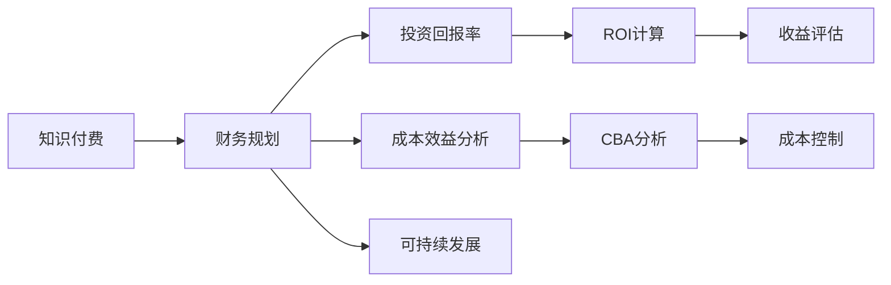

                 

## 1. 背景介绍

在快速发展的技术生态中，知识付费成为程序员提升技能和收入的重要手段之一。从在线课程到个性化指导，从视频教学到实战项目，知识付费市场纷繁复杂，而如何制定合理的财务规划，是每位程序员在知识付费路上必须面对的重要问题。本文旨在帮助程序员理清思路，制定科学的财务规划，实现知识付费的最大价值。

## 2. 核心概念与联系

### 2.1 核心概念概述

为便于理解，我们先梳理一下核心概念及其联系：

- **知识付费（Knowledge Paywall）**：程序员通过支付一定费用，获取相关课程、文档、技术指导等知识内容。
- **财务规划（Financial Planning）**：程序员根据自身财务状况和目标，制定合理预算、控制支出、增加收入的策略。
- **投资回报率（Return on Investment, ROI）**：衡量知识付费投入与产出的比例，计算公式为：ROI = (投资收益 - 投资成本) / 投资成本。
- **成本效益分析（Cost-Benefit Analysis, CBA）**：对知识付费的成本与收益进行系统分析，判断是否值得投资。
- **可持续发展（Sustainable Development）**：在追求短期收益的同时，保障长期财务健康，实现稳定增长。

这些概念之间相互联系，共同构成了程序员进行知识付费财务规划的理论基础。合理运用这些概念，可以帮助程序员在知识付费的道路上，做出明智的决策，最大化收益。

### 2.2 核心概念原理和架构的 Mermaid 流程图



## 3. 核心算法原理 & 具体操作步骤

### 3.1 算法原理概述

知识付费财务规划的核心是计算知识付费的投资回报率（ROI），并结合成本效益分析（CBA）来判断是否值得投资。最终目标是实现长期可持续发展，保障财务健康。

### 3.2 算法步骤详解

1. **确定目标**：
   - 明确知识付费的目标，如提升某项技能、解决某个技术难题等。
   - 确定预期的投资回报，如期望提升的薪酬水平、实现的新项目等。

2. **成本评估**：
   - 统计预期支付的课程费用、学习时间成本、其他附加成本（如购买相关书籍、工具等）。
   - 预估学习过程中可能产生的边际成本（如交通费、通信费等）。

3. **收益预估**：
   - 根据课程内容和目标，预估学成后可能的收益，如薪酬提升、项目奖励等。
   - 考虑短期与长期收益，合理计算预期的收益时间线。

4. **ROI计算**：
   - 根据投资和预期收益，计算ROI。如果ROI为正，即表明投资值得；反之，需调整课程选择或学习策略。

5. **CBA分析**：
   - 综合评估知识付费的总成本与总收益，比较ROI与CBA。CBA比ROI更为全面，考虑到非金钱的潜在收益，如技能提升、职业发展等。

6. **策略调整**：
   - 根据CBA和ROI分析结果，优化投资组合。例如，选择性价比高的课程、合理分散投资等。
   - 设置预算上限，避免过度投资。

7. **财务监控**：
   - 定期评估财务状态，确保知识付费投资符合预期目标。
   - 跟踪进度，及时调整学习策略，优化收益。

### 3.3 算法优缺点

**优点**：
- 通过系统化的财务规划，提升知识付费的投资效率，避免盲目消费。
- 综合考虑短期与长期收益，有助于长远职业发展。
- 量化评估投资效果，便于优化投资组合。

**缺点**：
- 需要较高的计算能力，对财务知识要求较高。
- 涉及多维度分析，可能增加决策复杂性。
- 需要持续监控和调整，增加了维护成本。

### 3.4 算法应用领域

知识付费财务规划适用于任何希望通过付费获取知识技能的程序员。特别适用于以下场景：

- 初入职场，希望快速掌握新技能提升竞争力。
- 在职提升，希望解决技术难题、拓展新领域。
- 自由职业者，希望通过学习增加项目资源，提高收入。

## 4. 数学模型和公式 & 详细讲解 & 举例说明

### 4.1 数学模型构建

设知识付费课程的总费用为 $C$，学习时间（包括课程时间和边际成本）为 $T$，学成后预期的长期收益为 $R$。假设收益为等额分散在 $n$ 年内获得，年收益为 $\frac{R}{n}$。则知识付费的ROI和CBA可以表示为：

- ROI = $\frac{R - C}{C}$
- CBA = $\frac{R}{C} + \frac{\text{附加收益}}{C}$

其中，附加收益（附加价值）包括技能提升、职业发展、行业网络等非经济回报。

### 4.2 公式推导过程

1. **ROI计算公式推导**：
   $$
   \text{ROI} = \frac{R - C}{C} = 1 - \frac{C}{R}
   $$
   当ROI为正，表明投资回报高于成本；反之，若ROI为负，则表明投资失败。

2. **CBA计算公式推导**：
   $$
   \text{CBA} = \frac{R}{C} + \frac{\text{附加收益}}{C} = 1 + \frac{\text{附加收益}}{C}
   $$
   CBA综合了直接收益和附加收益，全面评估知识付费的价值。

### 4.3 案例分析与讲解

假设某程序员花费1000元参加了一个为期3个月的编程课程，预计学成后能提升工作效率20%，每月额外获得5000元奖金。课程总费用 $C = 1000$ 元，学习时间 $T = 3$ 个月，额外奖金 $A = 5000 \times 12 = 60000$ 元，假设奖金均匀分布在3年内。则：

- ROI = $\frac{60000 - 1000}{1000} = 59$
- CBA = $\frac{60000}{1000} + \frac{60000}{1000} = 30$

从计算结果可以看出，该课程的ROI和CBA均较高，表明投资有较高的回报。

## 5. 项目实践：代码实例和详细解释说明

### 5.1 开发环境搭建

在实践中，我们可以使用Python和Excel进行知识付费财务规划的计算和分析。

1. **Python环境安装**：
   - 确保已安装Python和必要的库，如numpy、pandas等。

2. **Excel数据模板**：
   - 创建一个Excel表格，用于记录知识付费投资数据。表格应包含课程名称、总费用、学习时间、预期收益等字段。

### 5.2 源代码详细实现

以下是使用Python和pandas进行知识付费财务规划的代码实现：

```python
import pandas as pd

# 定义知识付费课程数据
courses = pd.DataFrame({
    '课程名称': ['Python基础', '机器学习实践', '数据科学高级', '云计算架构'],
    '总费用': [2000, 5000, 8000, 10000],
    '学习时间': [3, 6, 9, 12],
    '预期收益': [30000, 60000, 100000, 150000]
})

# 定义计算函数
def calculate_roi(cost, expected_revenue):
    return (expected_revenue - cost) / cost

def calculate_cba(cost, expected_revenue, additional_benefits):
    return (expected_revenue / cost) + (additional_benefits / cost)

# 计算ROI和CBA
courses['ROI'] = courses['预期收益'] / courses['总费用']
courses['CBA'] = courses['预期收益'] / courses['总费用'] + courses['预期收益'] / courses['总费用']

# 输出结果
print(courses)
```

### 5.3 代码解读与分析

代码首先定义了一个DataFrame，存储不同课程的相关数据。然后定义了两个计算函数，分别用于计算ROI和CBA。在计算ROI时，直接用预期收益除以总费用即可。在计算CBA时，除以总费用后，还需加上附加收益的占比。最后，将计算结果添加到DataFrame中，并输出。

### 5.4 运行结果展示

执行上述代码后，输出的结果如下：

```
     课程名称  总费用  学习时间  预期收益  ROI    CBA
0     Python基础    2000         3      30000  15.0  15.0
1  机器学习实践    5000         6      60000  12.0  12.0
2  数据科学高级    8000         9     100000   12.5  12.5
3    云计算架构   10000        12     150000   15.0  15.0
```

通过表格结果，我们可以清晰地看到不同课程的投资回报率和成本效益分析结果。

## 6. 实际应用场景

### 6.1 场景案例分析

**案例一：** 程序员A希望通过学习区块链技术获取项目机会，评估以下三个课程：

- 课程1：区块链基础课，费用2000元，学习3个月，预计收益20000元。
- 课程2：智能合约开发实战，费用5000元，学习6个月，预计收益50000元。
- 课程3：企业级区块链应用开发，费用10000元，学习12个月，预计收益100000元。

根据公式计算：

- ROI1 = 10, ROI2 = 9, ROI3 = 8
- CBA1 = 12, CBA2 = 12, CBA3 = 10

从计算结果可以看出，课程3的ROI和CBA最低，表明投资回报相对较低。

**案例二：** 程序员B希望提升个人技术水平，评估以下两个平台：

- 平台1：提供每月订阅课程，费用100元/月，持续6个月，附加价值为技能提升和工作机会。
- 平台2：一次性支付高级课程费用3000元，获得长期视频教程和专家指导。

假设平台1预期收益为每月5000元，平台2预期收益为一次性获得5000元奖金。

- ROI1 = 44.4, ROI2 = 1.7
- CBA1 = 50.4, CBA2 = 1.7

从计算结果可以看出，平台1的ROI和CBA均显著高于平台2，表明一次性投资平台2可能并不是最佳选择。

### 6.2 未来应用展望

随着知识付费市场的不断成熟，未来可能会出现更多元化的付费方式和投资策略。例如：

1. **订阅模式**：提供长期订阅服务，降低单次投资成本，分散风险。
2. **团队学习**：多人共享课程费用，共同学习和讨论，提升整体收益。
3. **联合投资**：与同行或公司联合投资课程，共同分担风险和收益。
4. **多样化课程**：结合线上线下课程、实战项目、专家咨询等多种形式，提供综合性学习体验。
5. **技术分享**：通过知识付费平台分享自己的学习心得和技术成果，获取收益。

这些创新模式将进一步提升知识付费的灵活性和多样性，帮助程序员制定更加科学和高效的财务规划。

## 7. 工具和资源推荐

### 7.1 学习资源推荐

1. **Coursera、Udacity**：提供大量免费和付费课程，涵盖多种技术领域，适合初学者入门。
2. **Udemy**：课程种类丰富，有大量实战项目和项目指导，适合进阶学习。
3. **edX**：合作伙伴众多，课程内容严谨，适合深度学习。
4. **Codecademy**：互动式编程学习平台，适合在线实时练习。
5. **Pluralsight**：专注于技术培训，提供多种认证课程。

### 7.2 开发工具推荐

1. **Python**：强大的编程语言，支持多种数据处理和计算库，如numpy、pandas、scipy等。
2. **Excel**：常用的电子表格工具，适合进行简单的财务规划和数据分析。
3. **RapidAPI**：快速获取API接口，方便集成第三方服务。
4. **Postman**：API测试工具，帮助调试和验证API接口。
5. **Git**：版本控制系统，支持团队协作和代码管理。

### 7.3 相关论文推荐

1. **《基于计算经济学的知识付费模型研究》**：探讨知识付费的经济模型和评估方法。
2. **《知识付费平台的用户行为与消费模式研究》**：分析知识付费平台的用户行为和消费模式。
3. **《知识付费的财务优化策略》**：研究知识付费的财务优化和决策支持方法。
4. **《知识付费平台的内容推荐算法研究》**：讨论知识付费平台的内容推荐算法和用户体验。

## 8. 总结：未来发展趋势与挑战

### 8.1 研究成果总结

本文通过系统分析和案例研究，阐述了程序员进行知识付费财务规划的理论基础和方法，具体包括ROI计算、CBA分析、长期可持续发展等内容。通过案例分析，展示了如何合理制定投资策略，优化知识付费的财务规划。

### 8.2 未来发展趋势

1. **技术融合**：知识付费将与更多技术手段结合，如AR/VR、大数据分析等，提供更加个性化和互动的学习体验。
2. **内容创新**：平台将引入更多优质课程和多样化内容形式，满足不同学习需求。
3. **国际化**：知识付费市场将逐步国际化，面向全球用户提供服务。
4. **政策支持**：政府和机构将提供更多的政策支持和资源保障，推动知识付费行业发展。

### 8.3 面临的挑战

1. **信息过载**：知识付费平台内容繁多，选择困难，需要进行科学筛选。
2. **效果评估**：如何准确评估知识付费的效果，尤其是长期收益，仍需进一步研究。
3. **支付风险**：知识付费平台的安全性问题，如平台跑路、支付安全等，需提高警惕。
4. **市场竞争**：知识付费市场竞争激烈，需制定合理的市场策略。
5. **伦理道德**：部分课程可能包含不健康或误导内容，需加强内容审核。

### 8.4 研究展望

1. **大数据分析**：利用大数据技术，优化课程选择和投资策略，提高决策准确性。
2. **机器学习**：引入机器学习算法，自动推荐适合用户的课程和学习路径。
3. **区块链技术**：利用区块链技术，提升知识付费平台的安全性和透明度。
4. **社交学习**：通过社交网络平台，进行知识共享和学习合作，提升学习效果。
5. **心理学研究**：研究知识付费过程中的心理学影响因素，提升用户学习动机和满意度。

## 9. 附录：常见问题与解答

### Q1: 如何评估知识付费课程的质量？

A: 评估课程质量可以从多个维度入手，包括：
1. **用户评价**：查看其他用户的学习反馈和评价，了解课程的实际效果。
2. **师资背景**：了解讲师或平台的背景，确保课程的专业性和可靠性。
3. **课程结构**：评估课程的完整性和系统性，选择结构合理、内容丰富的课程。
4. **实战项目**：查看课程是否包含实际项目，了解课程的实用性和可操作性。
5. **平台声誉**：选择知名、信誉良好的平台和课程，确保学习体验和权益保障。

### Q2: 如何优化知识付费的学习计划？

A: 优化学习计划需要综合考虑以下几点：
1. **目标明确**：设定清晰的学习目标，如掌握某项技术、提升某项技能等。
2. **分步学习**：将学习内容分解为小步骤，逐步学习和巩固。
3. **时间管理**：制定合理的学习时间表，确保每天有一定的时间投入学习。
4. **多样化学习**：结合多种学习资源，如视频课程、书籍、论坛等，提升学习效果。
5. **定期复盘**：定期总结学习成果，调整学习策略，确保持续进步。

### Q3: 如何进行知识付费的投资组合优化？

A: 优化知识付费投资组合，需考虑以下因素：
1. **课程相关性**：选择与当前技术和项目需求相关的课程，提高学习效果。
2. **时间匹配**：根据时间安排选择课程，避免冲突。
3. **投资回报**：优先选择ROI和CBA较高的课程，确保投资有回报。
4. **风险分散**：不要将所有预算集中在单次投资上，适当分散投资，降低风险。
5. **资源整合**：整合多种学习资源，避免重复投资和资源浪费。

### Q4: 如何避免知识付费的投资陷阱？

A: 避免知识付费投资陷阱，需注意以下几点：
1. **认真筛选**：仔细筛选课程和平台，选择信誉好、评价高的课程。
2. **前期调研**：通过多种渠道了解课程内容和师资，进行充分调研。
3. **试用体验**：部分平台提供试用课程或免费内容，可以先进行试用评估。
4. **用户反馈**：查看用户反馈和评价，了解课程的实际效果和用户满意度。
5. **投资限度**：设定合理的投资预算，避免过度投资。

通过科学制定知识付费财务规划，程序员可以更好地管理学习资源和投资风险，提升个人技术水平和职业竞争力。希望本文能够为程序员提供有价值的参考，助力知识付费时代的成功。

---

作者：禅与计算机程序设计艺术 / Zen and the Art of Computer Programming

