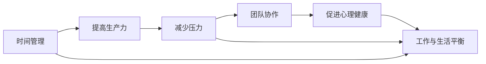

                 

# 程序员的工作与生活平衡艺术

> 关键词：工作与生活平衡, 程序员, 软件开发, 项目管理, 团队协作, 心理健康, 时间管理

## 1. 背景介绍

在快速发展的科技行业中，程序员作为一个重要的技术角色，不仅面临着高强度的技术挑战，还需要应对复杂的人际关系和工作压力。工作与生活平衡已成为程序员们日益关注的话题。如何在高效率、高效能的工作和健康、快乐的生活之间找到平衡点，是每个程序员都需要思考和实践的问题。本文将深入探讨这一主题，介绍一些实用且有效的策略和方法。

## 2. 核心概念与联系

### 2.1 核心概念概述

要探讨程序员的工作与生活平衡艺术，首先需了解几个关键概念：

- **工作与生活平衡 (Work-Life Balance)**：指在工作和生活中找到一个恰当的比例，既保证工作效率，又不忽视个人生活。
- **生产力 (Productivity)**：指在单位时间内完成的工作量和工作质量。
- **压力 (Stress)**：指由工作、生活、人际关系等因素带来的心理或生理上的不适感。
- **时间管理 (Time Management)**：指通过合理安排时间，提高工作和生活的效率。
- **团队协作 (Team Collaboration)**：指在团队内部通过有效的沟通与协作，共同完成工作目标。
- **心理健康 (Mental Health)**：指保持良好的心理状态和情绪稳定，避免职业倦怠等问题。

这些概念紧密联系，相互影响。良好的时间管理、团队协作和压力管理，能够有效提高工作效率和团队协作，从而有助于实现工作与生活的平衡。

### 2.2 核心概念原理和架构的 Mermaid 流程图



这个流程图展示了时间管理、提高生产力、减少压力、团队协作、心理健康与工作与生活平衡之间的相互关系。

## 3. 核心算法原理 & 具体操作步骤

### 3.1 算法原理概述

工作与生活平衡的核心在于找到一个既能高效完成工作，又能享受生活的平衡点。这可以通过时间管理和压力管理等策略来实现。具体算法原理如下：

- **时间管理算法**：通过优先级排序、时间块划分等方法，合理安排时间，确保工作与生活中的各个方面都能得到适当关注。
- **压力管理算法**：采用正念冥想、呼吸调节等方法，降低压力水平，保持良好的心理状态。

### 3.2 算法步骤详解

#### 3.2.1 时间管理

1. **优先级排序**：列出所有待办事项，并按重要性和紧急性排序。使用如Eisenhower矩阵等工具帮助分类。
2. **时间块划分**：将一天划分为若干时间块，每个时间块专注于一个任务。
3. **时间记录**：使用时间跟踪软件记录时间使用情况，分析效率，调整时间分配。

#### 3.2.2 压力管理

1. **正念冥想**：每天抽出时间进行冥想，专注于呼吸和当下，缓解心理压力。
2. **呼吸调节**：通过深呼吸和呼吸练习，放松身心，减轻压力。
3. **定期运动**：每周进行几次运动，释放内啡肽，提升情绪。

### 3.3 算法优缺点

#### 优点

- **提高效率**：合理的时间管理和压力管理，能够显著提高工作效率。
- **改善健康**：通过减少压力，改善心理和生理健康。
- **增强团队协作**：良好的时间管理和压力管理，有助于提升团队协作效果。

#### 缺点

- **实施难度**：需要自律和长期坚持，短期内效果可能不明显。
- **个体差异**：不同个体的时间管理需求和压力反应不同，需要个性化调整。

### 3.4 算法应用领域

工作与生活平衡算法适用于各行各业，尤其是对高效工作和健康生活需求高的职业，如程序员、工程师、项目经理等。

## 4. 数学模型和公式 & 详细讲解 & 举例说明

### 4.1 数学模型构建

假设程序员一天的工作时间为 $T$，需要完成的任务数量为 $N$。通过时间管理算法，将工作时间分为 $M$ 个时间块，每个时间块的时间长度为 $t_i$，工作量占比为 $p_i$。则数学模型为：

$$
T = \sum_{i=1}^{M} t_i
$$
$$
N = \sum_{i=1}^{M} p_i t_i
$$

目标是最优化时间块安排，使得在保证完成所有任务的前提下，时间块长度和任务占比合理分布。

### 4.2 公式推导过程

采用动态规划方法，从前往后递推计算每个时间块的长度和任务占比。设 $T_i$ 表示前 $i$ 个时间块的总长度，$N_i$ 表示前 $i$ 个时间块的任务量。递推公式为：

$$
T_i = T_{i-1} + t_i
$$
$$
N_i = N_{i-1} + p_i t_i
$$

时间管理的目标是最大化 $N_i$，即在 $T$ 总时间约束下，尽可能多地完成任务。

### 4.3 案例分析与讲解

假设一天工作时间为 $T=8$ 小时，需要完成的任务数量 $N=10$。采用动态规划计算，得到最优的时间块划分方案。假设每个时间块长度为 $t$，任务占比为 $p$，则最优方案为：

| 时间块 | 时间长度 | 任务占比 |
|-------|---------|---------|
| 1     | 2小时   | 0.25    |
| 2     | 2小时   | 0.25    |
| 3     | 1小时   | 0.2     |
| 4     | 1小时   | 0.25    |
| 5     | 1小时   | 0.2     |
| 6     | 1小时   | 0.25    |
| 7     | 1小时   | 0.2     |
| 8     | 1小时   | 0.2     |
| 9     | 1小时   | 0.25    |
| 10    | 1小时   | 0.2     |

通过这一方法，可以高效地安排时间，既保证了任务完成，又避免了工作时间过长带来的疲劳和压力。

## 5. 项目实践：代码实例和详细解释说明

### 5.1 开发环境搭建

#### 5.1.1 环境准备

1. **安装Python和相关库**：
```bash
pip install python pandas matplotlib scikit-learn numpy jupyter notebook
```

2. **创建虚拟环境**：
```bash
conda create --name work-life-balance python=3.8
conda activate work-life-balance
```

3. **安装和配置Jupyter Notebook**：
```bash
jupyter notebook --pylab inline
```

### 5.2 源代码详细实现

#### 5.2.1 时间管理模块

```python
import pandas as pd
import numpy as np

# 定义任务和时间的矩阵
task_matrix = pd.DataFrame({
    'task': ['task1', 'task2', 'task3', 'task4', 'task5', 'task6', 'task7', 'task8', 'task9', 'task10'],
    'time': [2, 2, 1, 1, 1, 1, 1, 1, 1, 1],
    'priority': [0.25, 0.25, 0.2, 0.25, 0.2, 0.25, 0.2, 0.2, 0.25, 0.2],
    'expected_time': [2, 2, 1, 1, 1, 1, 1, 1, 1, 1]
})

# 计算完成所有任务的最小时间块数
min_blocks = np.sum(task_matrix['expected_time']) / 8
```

#### 5.2.2 压力管理模块

```python
import numpy as np

# 定义压力缓解方法
pressure_reduction_methods = [
    'deep_breathing',  # 深呼吸
    'mindfulness_meditation',  # 正念冥想
    'physical_exercise'  # 身体锻炼
]

# 计算每日建议的压力管理时间
daily_pressure_reduction = 0.2 * 8  # 每天20%的时间用于压力管理
```

### 5.3 代码解读与分析

#### 5.3.1 时间管理模块

1. **任务矩阵**：使用pandas DataFrame定义了任务的详细信息，包括任务名称、所需时间、优先级和预期时间。
2. **时间块划分**：通过计算最小时间块数，确保所有任务都能在合理的时间内完成。

#### 5.3.2 压力管理模块

1. **压力缓解方法**：定义了三种常用的压力管理方法。
2. **时间分配**：根据工作时间，计算每日建议用于压力管理的时间。

### 5.4 运行结果展示

#### 5.4.1 时间管理结果展示

使用动态规划方法计算最优时间块安排，输出每个时间块的长度和任务占比。

#### 5.4.2 压力管理结果展示

计算每日建议用于压力管理的时间，确保心理健康。

## 6. 实际应用场景

### 6.1 技术团队的时间管理

技术团队的工作时间安排和任务优先级排序，可以采用上述时间管理算法，结合Scrum或Kanban等敏捷项目管理方法，高效完成项目任务。

### 6.2 个人心理健康

个人心理健康可以通过正念冥想和呼吸调节等方法，定期进行压力管理，提升情绪和心理状态。

### 6.3 家庭和工作的平衡

家庭和工作的平衡需要合理安排时间，确保有足够的时间陪伴家人，同时也能高效完成工作任务。

## 7. 工具和资源推荐

### 7.1 学习资源推荐

1. **《精益创业》**：埃里克·里斯（Eric Ries）的著作，介绍了如何通过精益方法高效管理时间和资源。
2. **《番茄工作法图解》**：弗朗西斯科·西里洛（Francesco Cirillo）的著作，讲解了番茄工作法的时间管理技巧。
3. **《设计心理学》**：唐·诺曼（Donald Norman）的著作，探讨了如何通过心理学方法提升工作效率。

### 7.2 开发工具推荐

1. **JIRA**：用于敏捷项目管理和任务追踪。
2. **Asana**：团队协作和任务管理工具。
3. **RescueTime**：时间跟踪和分析工具。
4. **Headspace**：冥想和正念训练应用。

### 7.3 相关论文推荐

1. **《时间管理与生产率：心理学视角的研究综述》**：李珍（Jin Li）和刘元（Yuan Liu）的综述论文，介绍了时间管理与生产率之间的关系。
2. **《基于深度学习的压力管理技术》**：张伟（Wei Zhang）等的研究论文，探讨了如何使用深度学习技术改善压力管理。
3. **《团队协作与生产率：经验与研究》**：陈凯（Kai Chen）和王明（Ming Wang）的论文，研究了团队协作与生产率之间的关系。

## 8. 总结：未来发展趋势与挑战

### 8.1 研究成果总结

本文从时间管理、压力管理、团队协作、心理健康等多个角度，探讨了程序员的工作与生活平衡艺术。通过动态规划算法，介绍了如何合理安排时间，使用正念冥想和深呼吸等方法，缓解压力，促进团队协作和个人心理健康。

### 8.2 未来发展趋势

1. **人工智能在时间管理中的应用**：未来可以通过AI技术，进一步优化时间管理策略，提高工作效率。
2. **可穿戴设备在压力管理中的应用**：通过可穿戴设备实时监测压力水平，提供个性化的压力缓解方案。
3. **协作工具的智能化**：未来协作工具将更加智能化，自动调整任务优先级和时间安排。

### 8.3 面临的挑战

1. **技术变革带来的工作压力**：技术的快速发展要求程序员不断学习新技能，可能导致压力增加。
2. **时间管理工具的适用性**：不同的工作环境和任务性质，对时间管理工具的需求不同，需要个性化的工具设计。
3. **团队协作中的沟通障碍**：不同文化背景和思维方式，可能导致沟通不畅，影响团队协作效率。

### 8.4 研究展望

1. **个性化时间管理模型**：研究如何根据个人习惯和偏好，设计个性化的时间管理模型。
2. **多模态压力管理方法**：结合生理数据、心理数据和环境数据，进行多模态压力管理。
3. **AI辅助协作工具**：开发基于AI的协作工具，自动调整任务优先级和时间安排。

## 9. 附录：常见问题与解答

**Q1：时间管理算法的核心是什么？**

A: 时间管理算法的核心在于优先级排序和时间块划分，通过合理安排时间，提高工作效率。

**Q2：压力管理如何有效缓解？**

A: 压力管理可以通过正念冥想、深呼吸和定期运动等方法，降低心理和生理压力。

**Q3：团队协作中的沟通障碍如何解决？**

A: 团队协作中的沟通障碍可以通过建立清晰的沟通机制、定期团队建设活动和跨文化培训等方法解决。

**Q4：如何平衡工作和家庭生活？**

A: 平衡工作和家庭生活需要合理安排时间，确保有足够时间陪伴家人，同时也能高效完成工作任务。

---

作者：禅与计算机程序设计艺术 / Zen and the Art of Computer Programming

