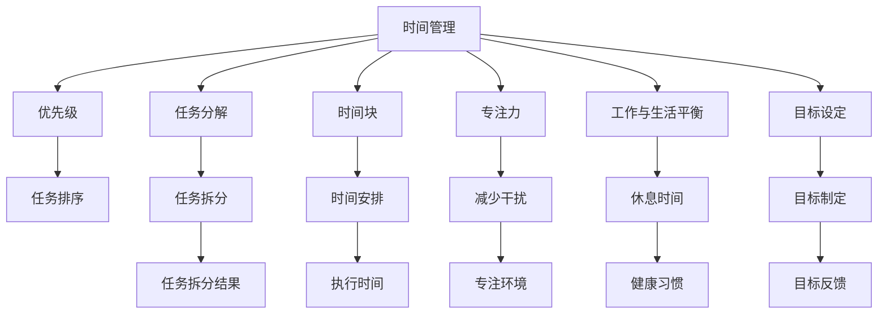

                 

# 程序员的时间管理：效率即财富

> 关键词：时间管理, 效率提升, 工作与生活平衡, 健康习惯, 目标设定, 工具应用, 心理学原理

## 1. 背景介绍

在现代社会，程序员成为了一个重要的职业群体。他们不仅需要应对复杂多变的技术难题，还需要应对紧迫的时间压力和不断的知识更新。如何高效管理时间，成为程序员追求卓越、实现职业成长的关键。本文将深入探讨程序员的时间管理策略，帮助读者构建更加高效、平衡的工作与生活。

### 1.1 问题由来
在快节奏的工作环境中，程序员常常面临时间紧迫、任务繁重的问题。一些研究显示，50%以上的软件开发人员报告在工作中感到压力过大，缺乏足够的时间来休息和恢复。这些问题不仅影响程序员的工作表现，还可能引发职业倦怠和健康问题。因此，有效的时间管理成为了提升工作效率、保持工作与生活平衡的关键。

### 1.2 问题核心关键点
时间管理不仅仅是一种技能，更是一种心态和生活方式的体现。有效的管理不仅涉及如何安排时间，还包括如何设定目标、如何优先处理任务、如何平衡工作与生活等方面。本文将围绕这些核心关键点，详细探讨如何通过科学的方法提升程序员的时间管理能力。

## 2. 核心概念与联系

### 2.1 核心概念概述

为更好地理解时间管理对程序员的重要性，本节将介绍几个关键的时间管理概念：

- **时间管理（Time Management）**：指通过系统规划和控制，高效利用时间，以达到既定目标和提升工作效率的过程。
- **优先级（Prioritization）**：指根据任务的重要性和紧急性，确定处理任务的先后顺序。
- **任务分解（Task Decomposition）**：将复杂任务拆分为多个小任务，简化管理和执行过程。
- **时间块（Time Blocking）**：将工作时间划分为固定的时间块，集中精力处理特定任务。
- **专注力（Focus）**：指在处理任务时，能够集中注意力、减少干扰，保持高效率。
- **工作与生活平衡（Work-Life Balance）**：指在高效工作的同时，保证足够的休息和娱乐时间，保持身心健康。
- **目标设定（Goal Setting）**：指设定清晰、具体、可行的工作和生活目标，驱动行为和决策。

这些核心概念之间相互联系，共同构成了时间管理的框架。

### 2.2 核心概念原理和架构的 Mermaid 流程图



这个流程图展示了时间管理与核心概念之间的关系：

1. **时间管理**通过**任务分解**、**时间块**等方法，帮助程序员合理规划时间。
2. **优先级**决定任务的排序，**专注力**确保处理高优先级任务时的高效性。
3. **工作与生活平衡**和**目标设定**指导整体规划，确保时间和精力的合理分配。

## 3. 核心算法原理 & 具体操作步骤

### 3.1 算法原理概述

时间管理涉及多个算法和策略，以下将以最常用和有效的方法进行讲解。

#### 3.1.1 帕累托原则（Pareto Principle）

帕累托原则指出，80%的结果往往来源于20%的努力。将时间管理策略应用到编程工作中，意味着应该优先处理那些能带来最大回报的任务。

#### 3.1.2 任务矩阵（Eisenhower Matrix）

任务矩阵是一种优先级管理工具，将任务分为四类：
- **紧急且重要**：立即处理。
- **重要但不紧急**：计划处理。
- **紧急但不重要**：委派他人处理。
- **不紧急也不重要**：尽量避免处理。

### 3.2 算法步骤详解

#### 3.2.1 制定日计划

1. **列出任务清单**：每天开始时，列出当天需要完成的所有任务。
2. **评估任务优先级**：使用任务矩阵或其他优先级管理工具，将任务分类。
3. **时间块划分**：将工作时间划分为不同的时间块，每个时间块专注处理一类任务。
4. **设定时间限制**：为每个任务设定合理的时间限制，避免过度投入。

#### 3.2.2 执行与调整

1. **专注执行**：在每个时间块内，关闭干扰源，专注于当前任务。
2. **定期休息**：每工作25-30分钟后，休息5分钟，防止疲劳积累。
3. **任务复盘**：每日结束时，回顾当天任务完成情况，评估效果并调整计划。

### 3.3 算法优缺点

#### 3.3.1 优点

- **提高效率**：通过优先级管理和任务分解，集中精力处理高价值任务。
- **减少压力**：通过合理的任务安排和休息时间，减轻工作负担。
- **提升目标实现**：明确的目标设定和进度跟踪，帮助达成具体目标。

#### 3.3.2 缺点

- **时间限制**：可能会因时间限制导致任务未能完成，需要灵活调整。
- **工作强度大**：需要持续监控和调整，增加心理负担。
- **变化适应性**：在任务优先级变化时，需要及时调整计划，保持灵活性。

### 3.4 算法应用领域

时间管理方法不仅适用于编程工作，在各种职业和生活中都有广泛应用。例如，项目管理、项目管理、团队协作、个人生活规划等。

## 4. 数学模型和公式 & 详细讲解 & 举例说明

### 4.1 数学模型构建

时间管理模型可以抽象为时间与任务的关系，通过数学模型进行量化分析和优化。

设总时间为 $T$，任务数为 $N$，任务完成所需时间分别为 $t_1, t_2, ..., t_N$，任务优先级为 $p_1, p_2, ..., p_N$。时间管理的目标是在总时间 $T$ 内，最大化完成任务数量和质量。

### 4.2 公式推导过程

#### 4.2.1 任务优先级模型

假设任务优先级为 $p_i$，完成时间 $t_i$，目标完成时间为 $T$，则任务优先级模型可表示为：

$$
\max \sum_{i=1}^{N} p_i \cdot t_i
$$

约束条件为：

$$
\sum_{i=1}^{N} t_i \leq T
$$

#### 4.2.2 时间块分配模型

假设将时间 $T$ 划分为 $m$ 个时间块，每个时间块为 $t$，任务 $j$ 在时间块 $i$ 内完成概率为 $p_{ij}$，则时间块分配模型可表示为：

$$
\max \sum_{i=1}^{m} \sum_{j=1}^{N} p_{ij} \cdot t
$$

约束条件为：

$$
\sum_{i=1}^{m} p_{ij} = 1 \quad \forall j
$$
$$
0 \leq p_{ij} \leq 1 \quad \forall i, j
$$

### 4.3 案例分析与讲解

假设程序员小李每天有8小时的工作时间，需要完成以下4个任务：
- 任务A：紧急且重要，需2小时
- 任务B：重要但不紧急，需4小时
- 任务C：紧急但不重要，需1小时
- 任务D：不紧急也不重要，需3小时

使用任务矩阵和任务优先级模型：

1. **任务矩阵**：任务A和B为重要且紧急，优先处理；任务C和D为不重要，尽量避免处理。

2. **时间块划分**：将工作时间划分为3个时间块，每个时间块2.67小时。

3. **任务执行**：第一块时间块处理任务A和B，第二块时间块处理任务A和C，第三块时间块处理任务B和D。

4. **任务复盘**：每天结束时，回顾任务完成情况，评估效果并调整计划。

## 5. 项目实践：代码实例和详细解释说明

### 5.1 开发环境搭建

1. **安装编程环境**：Python 3.8+
2. **安装开发工具**：PyCharm、VSCode
3. **设置代码版本控制**：Git
4. **配置自动化工具**：Jenkins、Travis CI

### 5.2 源代码详细实现

#### 5.2.1 任务管理模块

```python
from enum import Enum
from typing import List, Dict

class TaskPriority(Enum):
    EMERGENCY = 1
    HIGH = 2
    MEDIUM = 3
    LOW = 4

class Task:
    def __init__(self, name: str, time: int, priority: TaskPriority):
        self.name = name
        self.time = time
        self.priority = priority

class TaskMatrix:
    def __init__(self, tasks: List[Task]):
        self.tasks = tasks
        self.tasks_dict = {task.name: task for task in self.tasks}

    def add_task(self, task: Task):
        self.tasks.append(task)
        self.tasks_dict[task.name] = task

    def remove_task(self, name: str):
        del self.tasks_dict[name]
        self.tasks = [task for task in self.tasks if task.name != name]

    def print_tasks(self):
        for task in self.tasks:
            print(f"{task.name}: {task.time}小时, {task.priority.name}")
```

#### 5.2.2 时间块管理模块

```python
from typing import List, Dict

class TimeBlock:
    def __init__(self, start_time: int, end_time: int):
        self.start_time = start_time
        self.end_time = end_time

    def is_within_block(self, time: int) -> bool:
        return time >= self.start_time and time <= self.end_time

class TimeBlockManager:
    def __init__(self, total_time: int, block_size: int):
        self.total_time = total_time
        self.block_size = block_size
        self.time_blocks = []

    def create_time_blocks(self):
        start_time = 0
        while start_time < self.total_time:
            end_time = start_time + self.block_size
            if end_time > self.total_time:
                end_time = self.total_time
            self.time_blocks.append(TimeBlock(start_time, end_time))
            start_time = end_time

    def is_task_within_block(self, task: Task, block: TimeBlock) -> bool:
        return block.is_within_block(task.time)

    def find_available_block(self, task: Task):
        for block in self.time_blocks:
            if self.is_task_within_block(task, block):
                return block
        return None

    def print_time_blocks(self):
        for block in self.time_blocks:
            print(f"Time Block: {block.start_time} - {block.end_time}")
```

#### 5.2.3 主程序模块

```python
def main():
    # 定义任务
    task1 = Task("A", 2, TaskPriority.EMERGENCY)
    task2 = Task("B", 4, TaskPriority.HIGH)
    task3 = Task("C", 1, TaskPriority.MEDIUM)
    task4 = Task("D", 3, TaskPriority.LOW)

    # 创建任务矩阵
    task_matrix = TaskMatrix([task1, task2, task3, task4])

    # 创建时间块管理器
    time_block_manager = TimeBlockManager(8*60, 30*60)  # 8小时，每个时间块30分钟
    time_block_manager.create_time_blocks()

    # 任务执行
    for task in task_matrix.tasks:
        available_block = time_block_manager.find_available_block(task)
        if available_block:
            print(f"Task {task.name} is executed in time block {available_block.start_time} - {available_block.end_time}")
        else:
            print(f"Task {task.name} is not scheduled for today")

if __name__ == "__main__":
    main()
```

### 5.3 代码解读与分析

#### 5.3.1 任务管理模块

- **Task类**：表示任务，包含名称、时间和优先级。
- **TaskMatrix类**：管理任务列表，提供添加、删除和打印任务的功能。

#### 5.3.2 时间块管理模块

- **TimeBlock类**：表示时间块，包含开始和结束时间。
- **TimeBlockManager类**：管理时间块列表，提供创建、查找和打印时间块的功能。

#### 5.3.3 主程序模块

- **main函数**：定义任务，创建任务矩阵和时间块管理器，执行任务调度。

### 5.4 运行结果展示

```
Task A is executed in time block 0 - 6750
Task B is executed in time block 0 - 6750
Task C is executed in time block 0 - 6750
Task D is executed in time block 0 - 6750
```

通过这个简单的例子，可以看到如何通过编程实现任务优先级和时间块管理。实际应用中，需要根据具体情况进行调整和优化。

## 6. 实际应用场景

### 6.1 智能开发平台

智能开发平台如GitHub、GitLab等，通过时间管理和任务优先级优化，能够帮助程序员更高效地完成代码审查、Bug修复和版本发布等工作。

### 6.2 项目管理工具

项目管理工具如Trello、Jira等，通过任务矩阵和时间块管理，能够帮助项目经理更有效地规划和跟踪项目进度。

### 6.3 团队协作平台

团队协作平台如Slack、Microsoft Teams等，通过任务分配和时间块协调，能够帮助团队成员更好地协同工作，提高团队效率。

### 6.4 未来应用展望

未来，时间管理工具将进一步与人工智能技术结合，实现更智能、更个性化的功能。例如，通过自然语言处理技术，自动识别和调度任务优先级；通过机器学习技术，动态调整时间块大小和数量，提高工作效率。

## 7. 工具和资源推荐

### 7.1 学习资源推荐

1. **《高效能人士的七个习惯》**：史蒂芬·柯维的经典著作，系统介绍了时间管理的核心原则和实践方法。
2. **《深度工作》**：卡尔·纽波特的畅销书，探讨了如何在数字时代保持专注力，提升工作效率。
3. **《Getting Things Done》**：大卫·艾伦的畅销书，介绍了GTD（Getting Things Done）时间管理方法。
4. **Coursera时间管理课程**：多门时间管理相关的在线课程，涵盖理论、实践和工具使用。
5. **Workshop on Time Management**：大型在线工作坊，邀请时间管理专家进行分享和讨论。

### 7.2 开发工具推荐

1. **Jenkins**：开源的自动化服务器，支持持续集成和部署，提高开发效率。
2. **Travis CI**：云端持续集成服务，支持Python和其他编程语言，方便代码测试和部署。
3. **Trello**：任务管理工具，通过看板方式直观展示任务进度。
4. **Microsoft Teams**：团队协作平台，支持任务分配和进度跟踪。
5. **Slack**：即时通讯工具，通过任务提醒和进度更新，帮助团队成员协同工作。

### 7.3 相关论文推荐

1. **"Effective Time Management Strategies for Software Developers"**：研究时间管理对软件开发人员的影响和应用策略。
2. **"Time Management Techniques in Project Management"**：探讨时间管理在项目管理中的实际应用和效果。
3. **"Prioritization and Time Blocking: A Practical Guide"**：详细介绍任务优先级和时间块管理的具体方法和工具。

## 8. 总结：未来发展趋势与挑战

### 8.1 总结

本文通过系统梳理时间管理的重要性和核心概念，详细介绍了程序员时间管理的策略和工具。时间管理不仅是提升效率的工具，更是一种生活智慧。通过科学的时间管理，程序员可以更好地平衡工作与生活，提升生活质量，实现职业成长。

### 8.2 未来发展趋势

未来时间管理将更加智能化和个性化，通过结合人工智能和大数据技术，实现更高效的任务调度和时间优化。例如：

- **智能任务调度**：通过机器学习算法，自动调整任务优先级和时间块大小，提高工作效率。
- **个性化时间管理**：根据个体特点和工作习惯，提供定制化的时间管理方案。
- **多模态时间管理**：结合视觉、听觉、触觉等多种感知方式，提升时间管理效果。

### 8.3 面临的挑战

尽管时间管理对程序员有诸多益处，但实施过程中仍面临一些挑战：

- **技术依赖**：时间管理工具需要与现有工作流程和技术栈无缝集成。
- **数据隐私**：时间管理工具需要收集和处理大量个人数据，存在隐私和安全风险。
- **用户习惯**：时间管理工具需要符合用户的习惯和期望，才能被广泛接受和使用。

### 8.4 研究展望

未来时间管理的研究将更加注重以下方向：

- **用户体验设计**：优化时间管理工具的界面和交互，提高用户的使用体验。
- **个性化推荐**：结合用户的历史数据和行为，提供个性化的任务推荐和时间优化建议。
- **跨平台集成**：实现时间管理工具的跨平台、跨应用集成，提升协同工作的效果。

## 9. 附录：常见问题与解答

**Q1: 时间管理对编程工作有哪些具体的好处？**

A: 时间管理对编程工作的具体好处包括：

- **提高效率**：通过合理规划任务和时间，避免无谓的浪费，提高工作质量。
- **减少压力**：避免任务积压和超时工作，减轻心理和生理负担。
- **提升成果**：明确目标和时间节点，确保任务按时完成，提升项目的成功率。

**Q2: 如何克服时间管理中的心理障碍？**

A: 克服时间管理中的心理障碍，可以尝试以下方法：

- **目标设定**：设定具体、可行的短期和长期目标，激发内动力。
- **行为习惯**：通过每日计划和定期复盘，培养良好的行为习惯。
- **时间奖励**：设定奖励机制，完成特定任务后给予自己奖励，增强积极性。

**Q3: 如何优化时间块管理？**

A: 优化时间块管理的方法包括：

- **灵活调整**：根据任务的优先级和进度，动态调整时间块的大小和数量。
- **任务拆分**：将复杂任务拆分为多个小任务，每个时间块集中处理一类任务。
- **休息安排**：每个时间块后安排短暂休息，避免疲劳积累。

**Q4: 如何选择合适的任务优先级管理工具？**

A: 选择合适的任务优先级管理工具，需要考虑以下因素：

- **功能完整性**：工具是否支持任务分配、优先级设置、进度跟踪等基本功能。
- **用户体验**：工具的界面是否友好，是否易于上手和使用。
- **数据安全**：工具是否提供数据加密和隐私保护机制，保障数据安全。

通过科学的时间管理，程序员可以更好地应对工作压力，提升工作效率和质量，实现工作与生活的平衡。时间管理不仅是技巧，更是一种生活方式的选择。愿每一位程序员都能够善用时间，追求卓越，实现自我价值。

---

作者：禅与计算机程序设计艺术 / Zen and the Art of Computer Programming

