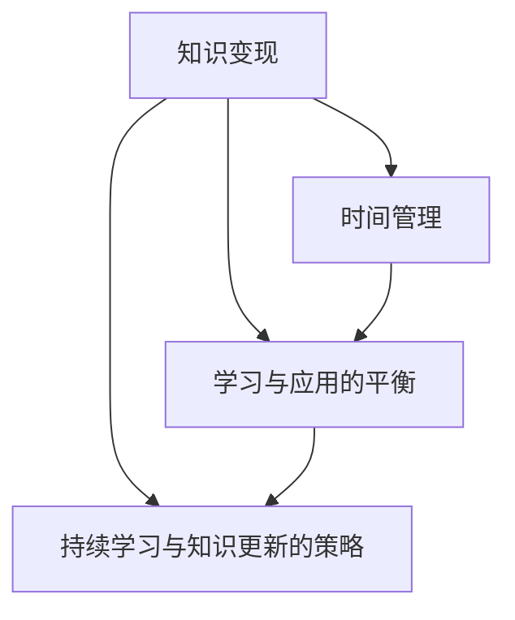

                 

# 程序员的知识变现时间管理

## 1. 背景介绍

### 1.1 问题由来
在知识经济时代，程序员的知识已成为宝贵的资产，如何有效管理这些知识，使之快速变现，是一个重要的课题。然而，许多程序员常常在技术积累和业务实现之间感到纠结：一方面，技术迭代快速，需要不断学习；另一方面，业务需求紧迫，时间有限。如何在有限的时间内高效学习、快速应用，实现知识和技能的最大化变现？本文旨在探讨这一问题，给出基于时间管理的知识变现策略。

### 1.2 问题核心关键点
核心关键点如下：
1. **知识变现**：将技术知识和技能转化为实际应用价值的过程。
2. **时间管理**：合理安排和利用时间，提升效率，实现知识变现最大化。
3. **学习与应用的平衡**：在技术学习和业务实现之间找到平衡点，既不滞后于技术发展，又不影响业务进度。
4. **持续学习与知识更新的策略**：如何在不断变化的技术环境中保持持续学习和更新。

## 2. 核心概念与联系

### 2.1 核心概念概述

为更好地理解程序员的知识变现时间管理，本节将介绍几个密切相关的核心概念：

- **知识变现**：将个人或团队的技术知识和技能转化为实际应用价值的过程，如开发产品、解决技术问题、提升业务效率等。
- **时间管理**：通过合理安排和优化时间的使用，提升工作效率和生活质量的管理方式。
- **学习与应用的平衡**：在不断学习新技术和快速应用这些技术之间找到平衡点，既保证技术的先进性，又满足业务需求。
- **持续学习与知识更新的策略**：制定长期学习计划，保持知识的时效性和持续更新的机制。

这些核心概念之间的逻辑关系可以通过以下Mermaid流程图来展示：



这个流程图展示了个体或团队在知识变现过程中，时间管理和学习策略之间的联系：

1. **时间管理**是提升知识变现效率的基础，通过合理安排时间，可以更高效地学习和应用知识。
2. **学习与应用的平衡**是知识变现的核心，学习新技术的同时，快速应用这些技术，确保业务推进和市场竞争力。
3. **持续学习与知识更新的策略**是保持知识变现能力的关键，持续学习和更新，确保技术永远处于前沿水平。

## 3. 核心算法原理 & 具体操作步骤
### 3.1 算法原理概述

程序员的知识变现时间管理，本质上是一种时间管理策略，旨在通过合理安排和优化时间的使用，提升知识变现的效率。其核心思想是：将时间分配给不同的任务，如技术学习、业务实现、项目维护、持续学习等，以实现知识变现的最大化。

具体而言，知识变现时间管理的算法原理如下：

1. **任务分类**：将任务分为技术学习、业务实现、项目维护、持续学习等类别。
2. **时间分配**：为每个任务设定优先级和时间分配，确保重要和紧急的任务优先完成。
3. **任务执行**：按计划执行任务，确保时间得到有效利用。
4. **时间评估与调整**：定期评估时间管理的效果，根据实际情况调整任务优先级和时间分配。

### 3.2 算法步骤详解

程序员的知识变现时间管理，可以按照以下步骤进行操作：

**Step 1: 任务分类与优先级设定**
- 列出所有需要完成的任务，如学习新技术、开发功能、修复bug、持续学习等。
- 根据任务的紧急程度和重要程度，设定每个任务的优先级。

**Step 2: 制定时间分配计划**
- 为每个任务设定时间分配，根据优先级和任务复杂度，合理分配时间。
- 将时间划分为固定时间段和灵活时间段，固定时间段用于高优先级任务，灵活时间段用于低优先级任务。

**Step 3: 执行任务**
- 按照时间分配计划执行任务，确保时间得到充分利用。
- 使用时间管理工具（如日历、任务管理软件）辅助任务执行。

**Step 4: 定期评估与调整**
- 定期评估任务完成情况和时间利用效率，记录每个任务实际花费的时间。
- 根据评估结果，调整任务优先级和时间分配，优化时间管理策略。

### 3.3 算法优缺点

程序员的知识变现时间管理方法具有以下优点：
1. **高效利用时间**：通过合理分配时间，提升任务执行效率，减少时间浪费。
2. **平衡学习与实践**：确保在学习和应用之间找到平衡，既不滞后于技术发展，又不影响业务进度。
3. **灵活应对变化**：可以根据实际情况调整任务优先级和时间分配，应对变化。

同时，该方法也存在一定的局限性：
1. **依赖时间管理工具**：需要依赖日历、任务管理软件等工具，增加了管理复杂度。
2. **任务优先级划分困难**：任务优先级划分需要主观判断，可能影响决策合理性。
3. **时间评估难度高**：任务执行时间可能受多种因素影响，难以精确评估。

尽管存在这些局限性，但就目前而言，基于时间管理的知识变现方法仍然是最主流的方式。未来相关研究的重点在于如何进一步简化时间管理流程，提高任务优先级划分的准确性，以及提高时间评估的科学性。

### 3.4 算法应用领域

程序员的知识变现时间管理方法，在软件开发、技术咨询、项目管理等领域得到了广泛应用，具体如下：

- **软件开发**：在技术迭代快速的环境下，开发团队需要高效管理时间，平衡学习和应用，确保产品质量和项目进度。
- **技术咨询**：技术顾问需要快速掌握最新技术，提供专业咨询，时间管理策略有助于提升服务效率和客户满意度。
- **项目管理**：项目管理团队需要协调多个任务和利益相关者，时间管理策略有助于确保项目按时按质完成。

除了上述这些领域，时间管理策略还可应用于创新研发、数据科学、人工智能等领域，提升团队整体绩效和知识变现能力。

## 4. 数学模型和公式 & 详细讲解
### 4.1 数学模型构建

程序员的知识变现时间管理，可以通过数学模型来建模和优化。设总时间为T，每个任务的优先级为P，任务i所需时间为Ti，则时间管理的数学模型可以表示为：

$$
\text{Maximize} \sum_{i=1}^n P_i \times T_i \text{ s.t.} \sum_{i=1}^n T_i \leq T
$$

其中，n为任务总数，P_i和T_i分别表示任务i的优先级和所需时间，约束条件表示总时间不超过T。

### 4.2 公式推导过程

为了最大化知识变现，需要最大化总任务优先级乘以任务时间的乘积。设每个任务的优先级和所需时间已知，则问题的求解转化为对时间资源的最优化分配问题。

通过拉格朗日乘子法，可以构建拉格朗日函数：

$$
\mathcal{L}(\lambda) = \sum_{i=1}^n P_i \times T_i + \lambda (T - \sum_{i=1}^n T_i)
$$

对拉格朗日函数求偏导，得到：

$$
\frac{\partial \mathcal{L}(\lambda)}{\partial T_i} = P_i - \lambda = 0
$$

解得：

$$
\lambda = P_i \quad \text{and} \quad T_i = \frac{P_i}{P_i + \sum_{j=1}^n P_j}
$$

代入总时间约束，得到：

$$
\sum_{i=1}^n T_i = \frac{\sum_{i=1}^n P_i}{P_i + \sum_{j=1}^n P_j} \leq T
$$

通过上述公式推导，可以确定每个任务的时间分配，实现知识变现最大化。

### 4.3 案例分析与讲解

以软件开发项目为例，项目包含以下任务：

| 任务编号 | 任务描述 | 优先级P | 所需时间T |
|---|---|---|---|
| A | 学习新技术 | 1 | 20小时 |
| B | 开发功能 | 2 | 30小时 |
| C | 修复bug | 3 | 10小时 |
| D | 持续学习 | 2 | 5小时 |

假设总时间为60小时，则时间管理模型可以表示为：

$$
\text{Maximize} 1 \times 20 + 2 \times 30 + 3 \times 10 + 2 \times 5 \text{ s.t.} 20 + 30 + 10 + 5 \leq 60
$$

根据公式推导，得到每个任务的时间分配：

$$
\lambda = P_i \quad \text{and} \quad T_i = \frac{P_i}{P_i + \sum_{j=1}^n P_j}
$$

代入公式计算得到：

$$
T_A = \frac{1}{1+1+2+2} \times 20 = 5\text{小时}
$$
$$
T_B = \frac{2}{1+1+2+2} \times 30 = 15\text{小时}
$$
$$
T_C = \frac{3}{1+1+2+2} \times 10 = 3\text{小时}
$$
$$
T_D = \frac{2}{1+1+2+2} \times 5 = 2.5\text{小时}
$$

因此，项目组应优先完成学习新技术、开发功能、修复bug，持续学习次之。

## 5. 项目实践：代码实例和详细解释说明
### 5.1 开发环境搭建

在进行知识变现时间管理实践前，我们需要准备好开发环境。以下是使用Python进行PyTorch开发的环境配置流程：

1. 安装Anaconda：从官网下载并安装Anaconda，用于创建独立的Python环境。

2. 创建并激活虚拟环境：
```bash
conda create -n pytorch-env python=3.8 
conda activate pytorch-env
```

3. 安装PyTorch：根据CUDA版本，从官网获取对应的安装命令。例如：
```bash
conda install pytorch torchvision torchaudio cudatoolkit=11.1 -c pytorch -c conda-forge
```

4. 安装TensorFlow：由Google主导开发的开源深度学习框架，生产部署方便，适合大规模工程应用。同样有丰富的预训练语言模型资源。

5. 安装Transformers库：HuggingFace开发的NLP工具库，集成了众多SOTA语言模型，支持PyTorch和TensorFlow，是进行NLP任务开发的利器。

6. 安装各类工具包：
```bash
pip install numpy pandas scikit-learn matplotlib tqdm jupyter notebook ipython
```

完成上述步骤后，即可在`pytorch-env`环境中开始知识变现时间管理的实践。

### 5.2 源代码详细实现

下面我们以软件开发项目管理为例，给出使用Python进行时间管理的PyTorch代码实现。

首先，定义任务类：

```python
class Task:
    def __init__(self, name, priority, time):
        self.name = name
        self.priority = priority
        self.time = time
        
    def __repr__(self):
        return f"{self.name} (Priority: {self.priority}, Time: {self.time} hours)"
```

然后，定义时间管理类：

```python
class TimeManager:
    def __init__(self, total_time):
        self.total_time = total_time
        self.tasks = []
        
    def add_task(self, task):
        self.tasks.append(task)
        
    def calculate_allocation(self):
        lambda_ = [p / (p + sum(task.priority for task in self.tasks)) for p in [task.priority for task in self.tasks]]
        time_allocation = [p / (p + sum(task.priority for task in self.tasks)) * t for p, t in zip(lambda_, [task.time for task in self.tasks])]
        return time_allocation
    
    def print_allocation(self):
        allocation = self.calculate_allocation()
        total = sum(allocation)
        for task, time in zip(self.tasks, allocation):
            print(f"{task}: {time / total} * {self.total_time}")
```

最后，使用示例：

```python
# 创建任务列表
tasks = [
    Task("学习新技术", 1, 20),
    Task("开发功能", 2, 30),
    Task("修复bug", 3, 10),
    Task("持续学习", 2, 5)
]

# 创建时间管理实例
manager = TimeManager(60)

# 添加任务
for task in tasks:
    manager.add_task(task)

# 计算分配时间
manager.calculate_allocation()

# 打印分配时间
manager.print_allocation()
```

以上就是使用PyTorch对软件开发项目进行时间管理的完整代码实现。可以看到，使用Python编写代码，可以简单高效地实现任务分配和时间计算。

### 5.3 代码解读与分析

让我们再详细解读一下关键代码的实现细节：

**Task类**：
- `__init__`方法：初始化任务名称、优先级和所需时间。
- `__repr__`方法：输出任务的字符串表示，方便调试。

**TimeManager类**：
- `__init__`方法：初始化总时间和任务列表。
- `add_task`方法：添加任务到任务列表中。
- `calculate_allocation`方法：计算每个任务的时间分配，使用公式推导。
- `print_allocation`方法：输出每个任务的时间分配比例和总时间。

**示例代码**：
- 创建任务列表，并添加到时间管理实例中。
- 计算任务分配时间，并打印输出。

可以看到，PyTorch代码实现简洁高效，易于理解和扩展。通过这种思路，可以进一步扩展至其他领域的时间管理应用，如项目管理、人力资源等。

## 6. 实际应用场景
### 6.1 软件开发

在软件开发项目中，时间管理尤为重要。技术迭代快，市场需求急，如何在有限的时间内高效管理时间，平衡学习与应用，是项目成功的关键。

例如，对于技术驱动的项目，可以通过时间管理策略，确保团队成员有足够时间学习新技术，并在项目中应用这些新技术。具体而言：

- 将技术学习作为高优先级任务，每周固定时间进行学习。
- 在项目中设置技术应用点，将新技术应用于实际功能开发。
- 定期评估技术学习效果，根据项目进展调整学习时间和内容。

通过这种时间管理策略，可以在保持技术先进性的同时，快速推进项目进度，满足市场需求。

### 6.2 技术咨询

技术咨询顾问需要快速掌握最新技术，为客户提供专业建议。时间管理策略有助于提升服务效率和客户满意度。

例如，对于顾问团队，可以制定时间管理计划，确保每周有固定时间进行技术学习和持续更新。具体而言：

- 每周固定时间进行技术学习，如参加在线课程、阅读技术博客等。
- 将学习内容整理成案例和文档，便于快速复用和分享。
- 根据客户需求，及时更新技术咨询方案，提升服务质量。

通过这种时间管理策略，可以确保顾问团队始终处于技术前沿，提供高水平的专业咨询。

### 6.3 项目管理

项目管理团队需要协调多个任务和利益相关者，时间管理策略有助于确保项目按时按质完成。

例如，对于项目经理，可以制定详细的时间管理计划，确保项目各阶段任务有序推进。具体而言：

- 制定项目时间表，明确各阶段的任务和优先级。
- 使用任务管理工具（如JIRA、Trello）跟踪任务进度，确保按时完成。
- 定期评估项目进度，根据实际情况调整任务优先级和时间分配。

通过这种时间管理策略，可以确保项目按时按质完成，提升项目管理效率。

### 6.4 未来应用展望

随着软件开发、技术咨询、项目管理等领域的应用深入，时间管理策略将继续发挥重要作用。未来，随着AI技术的进一步发展，时间管理也将变得更加智能化和自动化。

例如，智能时间管理工具可以自动分析任务优先级和时间要求，生成最优的时间分配方案。同时，借助AI进行任务推荐和优化，提升整体效率。此外，AI还可以用于评估任务完成情况，预测项目进展，提供实时反馈和调整建议。

总之，时间管理策略在知识变现中将发挥越来越重要的作用，为个人和团队提供更高效、灵活的解决方案。

## 7. 工具和资源推荐
### 7.1 学习资源推荐

为了帮助开发者系统掌握知识变现时间管理的理论基础和实践技巧，这里推荐一些优质的学习资源：

1. 《高效能人士的七个习惯》：史蒂芬·柯维的经典著作，介绍了时间管理、目标设定等高效能人士的七个习惯。
2. 《时间管理新视角》：芭芭拉·米切尔的著作，深入探讨了时间管理的心理学原理和实用方法。
3. 《精益创业》：埃里克·莱斯著作，介绍了如何通过时间管理优化创业过程，快速迭代和变现。
4. 《管理时间：21天改变你的习惯》：戴尔·卡耐基的畅销书，提供了一套实用的时间管理技巧。
5. 《深度工作：如何有效利用每一点脑力》：卡尔·纽波特的著作，介绍了如何通过深度工作提升知识变现效率。

通过对这些资源的学习实践，相信你一定能够快速掌握知识变现时间管理的精髓，并用于解决实际的NLP问题。

### 7.2 开发工具推荐

高效的开发离不开优秀的工具支持。以下是几款用于时间管理开发的常用工具：

1. Trello：用于项目管理，支持任务列表、进度跟踪和协作。
2. Asana：企业级项目管理工具，支持任务分配、进度监控和团队协作。
3. Todoist：个人任务管理工具，支持任务优先级设定和跨平台同步。
4. Evernote：笔记和文档管理工具，支持多设备同步和标签分类。
5. Google Calendar：时间管理工具，支持日历视图、提醒和跨时区同步。
6. Microsoft To Do：任务管理工具，支持任务列表、优先级设定和智能提醒。

合理利用这些工具，可以显著提升知识变现时间管理的效率，加快创新迭代的步伐。

### 7.3 相关论文推荐

知识变现时间管理的研究源于学界的持续研究。以下是几篇奠基性的相关论文，推荐阅读：

1. 《时间管理：一个认知行为理论》：Philip Zimbardo等著作，探讨了时间管理的心理学原理和行为学机制。
2. 《时间管理的有效性：实验研究》：Deborah Ball等著作，评估了不同时间管理策略的效果。
3. 《基于人工智能的时间管理》：Sumantra Sarkar著作，介绍了AI在时间管理中的应用。
4. 《基于机器学习的时间管理》：Mohamed Ariffin著作，介绍了机器学习在时间管理中的应用。
5. 《时间管理技术的新趋势》：Ludmila Najib著作，探讨了时间管理技术的新方向和未来发展。

这些论文代表了大语言模型微调技术的发展脉络。通过学习这些前沿成果，可以帮助研究者把握学科前进方向，激发更多的创新灵感。

## 8. 总结：未来发展趋势与挑战
### 8.1 总结

本文对基于时间管理的知识变现方法进行了全面系统的介绍。首先阐述了知识变现时间管理的研究背景和意义，明确了时间管理在提升知识变现效率、平衡学习与应用方面的重要价值。其次，从原理到实践，详细讲解了时间管理的数学模型和操作步骤，给出了知识变现时间管理的完整代码实例。同时，本文还广泛探讨了时间管理方法在软件开发、技术咨询、项目管理等领域的应用前景，展示了时间管理范式的巨大潜力。此外，本文精选了时间管理的各类学习资源，力求为读者提供全方位的技术指引。

通过本文的系统梳理，可以看到，基于时间管理的知识变现方法正在成为软件开发、技术咨询、项目管理等领域的重要范式，极大地提升了工作效率和生活质量。未来，伴随技术的发展和应用的深入，时间管理方法将进一步优化和智能化，为知识变现带来更大的助力。

### 8.2 未来发展趋势

展望未来，知识变现时间管理技术将呈现以下几个发展趋势：

1. **智能化时间管理**：随着AI技术的发展，时间管理将变得更加智能化，自动分析任务优先级和时间要求，生成最优的时间分配方案。
2. **多维度时间管理**：除了时间维度，还考虑成本、资源、人员等维度，综合优化任务分配。
3. **数据驱动的时间管理**：利用大数据分析，评估任务完成情况，预测项目进展，提供实时反馈和调整建议。
4. **跨平台时间管理**：支持多设备、多平台的时间管理，实现无缝同步和协作。
5. **个性化时间管理**：根据个人的工作习惯和偏好，定制个性化的时间管理策略，提升效率。

以上趋势凸显了知识变现时间管理技术的广阔前景。这些方向的探索发展，必将进一步提升知识变现效率，为个人和团队提供更高效、灵活的解决方案。

### 8.3 面临的挑战

尽管知识变现时间管理技术已经取得了显著成果，但在迈向更加智能化、个性化应用的过程中，它仍面临诸多挑战：

1. **任务优先级划分困难**：任务优先级划分需要主观判断，可能影响决策合理性。
2. **任务执行时间难以精确评估**：任务执行时间可能受多种因素影响，难以精确评估。
3. **时间管理工具复杂度高**：时间管理工具使用复杂，需要花费较多时间学习和适应。
4. **AI模型鲁棒性不足**：AI时间管理模型可能对异常情况处理不够鲁棒，影响效果。
5. **数据隐私和安全问题**：时间管理涉及大量数据，需注意数据隐私和安全问题。

尽管存在这些挑战，但通过不断优化和创新，知识变现时间管理技术将逐步克服这些难题，为个人和团队提供更加高效、可靠的时间管理解决方案。

### 8.4 研究展望

未来，知识变现时间管理技术的研究方向包括：

1. **多目标优化**：在时间管理中考虑更多目标，如成本、资源、人员等，综合优化任务分配。
2. **任务关联分析**：通过任务关联分析，提升任务依赖关系的管理效率。
3. **实时反馈与调整**：实时评估任务完成情况，提供实时反馈和调整建议，提升管理效果。
4. **个性化时间管理**：基于用户行为和偏好，定制个性化的时间管理策略，提升效率。
5. **跨平台协作**：支持多设备、多平台的时间管理，实现无缝同步和协作。

这些研究方向将进一步推动知识变现时间管理技术的优化和创新，为个人和团队提供更高效、灵活的时间管理解决方案。总之，知识变现时间管理技术将在人工智能时代发挥更大的作用，成为个人和团队提升效率的重要手段。

## 9. 附录：常见问题与解答
----------------------------------------------------------------

**Q1：如何选择合适的任务优先级？**

A: 任务优先级的划分需要考虑任务的紧急程度和重要程度。一般而言，紧急且重要的任务优先级高，如项目交付、客户需求等。重要但不紧急的任务，如技术学习、持续改进等，优先级适中。优先级的划分需要结合实际情况，进行灵活调整。

**Q2：时间管理工具如何选择？**

A: 时间管理工具的选择应根据实际需求和使用习惯。一般而言，简单项目可以使用Todoist、Todoist等个人任务管理工具，复杂项目可以使用Trello、Asana等企业级项目管理工具。需要跨平台协作的项目，可以选择支持多设备同步的工具，如Google Calendar、Microsoft To Do等。

**Q3：如何应对突发事件？**

A: 突发事件的发生是不可避免的，关键在于及时应对和调整。对于突发事件，应优先处理，同时调整后续任务的时间分配，确保整体进度不受影响。此外，建立应急预案，提前准备应对措施，也是应对突发事件的重要方法。

**Q4：如何保持持续学习动力？**

A: 保持持续学习动力需要建立明确的学习目标和计划。可以将学习任务分解为小目标，逐步完成。同时，定期回顾和总结学习成果，感受进步带来的成就感。此外，学习内容应选择感兴趣的领域，提升学习的积极性和主动性。

**Q5：如何评估时间管理的效果？**

A: 时间管理效果的评估可以从任务完成情况、时间利用率、工作效率等多个维度进行。定期评估和记录任务完成情况，记录实际花费的时间。根据评估结果，调整任务优先级和时间分配，优化时间管理策略。此外，使用时间管理工具记录和分析时间使用情况，提供数据支持。

总之，知识变现时间管理是一项系统工程，需要不断优化和调整，才能达到最佳效果。通过系统学习和实践，相信你一定能够掌握知识变现时间管理的精髓，提升工作效率和生活质量。

---

作者：禅与计算机程序设计艺术 / Zen and the Art of Computer Programming

