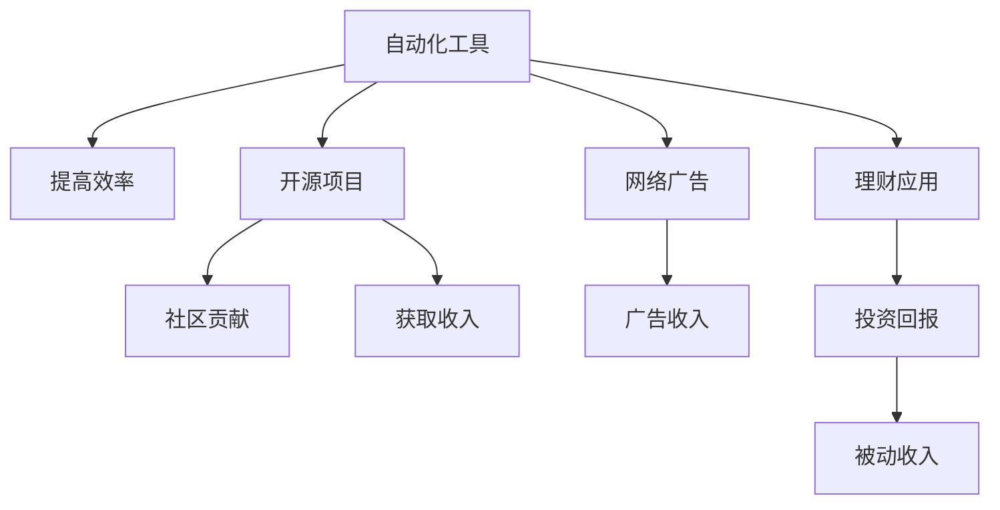

                 

# 程序员的被动收入：构建与维护

> 关键词：被动收入, 编程, 软件开发, 自动化, 投资, 理财

## 1. 背景介绍

### 1.1 问题由来
现代编程行业的竞争日益激烈，程序员的薪资虽然有所提升，但工作强度和压力也在不断增加。为了实现更好的生活质量，许多程序员开始探索如何通过编程技能构建自己的被动收入来源。被动收入，顾名思义，是指在不直接参与工作的情况下，通过前期投入获得持续的收入。在软件开发领域，这种需求催生了诸多针对程序员的被动收入构建策略，包括自动化工具、投资平台、理财应用等。本文将系统介绍如何利用编程技能构建和维护被动收入来源，帮助程序员实现财务自由。

### 1.2 问题核心关键点
构建被动收入的核心在于实现低成本或零成本的可持续收入来源。在软件开发领域，常用的构建方式包括开发自动化工具、编写开源项目、进行网络广告投放、投资理财等。这些方式中，自动化工具和开源项目因其高度的自我可持续性而特别受到青睐。

## 2. 核心概念与联系

### 2.1 核心概念概述

为了更好地理解程序员如何构建被动收入，我们首先需要明确几个关键概念：

- **自动化工具**：指通过编写代码自动完成重复性高、耗时长的工作，从而释放程序员时间，用于开发新项目或提高工作效率的工具。
- **开源项目**：指开发者公开源代码，允许他人自由复制、修改和分发，旨在推动技术进步和社区协作的项目。
- **网络广告**：指通过互联网展示广告，并按照展示次数或点击次数付费的商业模式。
- **理财应用**：指利用算法和数据优化财务规划、投资组合等，实现被动收入的理财工具。

这些概念之间的逻辑关系可以通过以下Mermaid流程图来展示：



这个流程图展示了程序员利用编程技能构建被动收入的几个关键环节：

1. 自动化工具用于提高工作效率，释放时间。
2. 开源项目吸引社区贡献，带来收入和名誉。
3. 网络广告通过展示广告获得收入。
4. 理财应用优化投资，实现长期收益。

通过理解这些核心概念，我们能够更好地把握程序员构建被动收入的途径和策略。

## 3. 核心算法原理 & 具体操作步骤
### 3.1 算法原理概述

构建程序员被动收入的核心算法原理是利用编程技能创造可持续的收入流。这一过程通常包括以下几个步骤：

1. **自动化工具开发**：开发自动化工具，通过代码实现对重复性工作的自动化，从而提高工作效率。
2. **开源项目维护**：维护开源项目，吸引社区贡献，提升项目影响力和知名度。
3. **网络广告投放**：使用网络广告平台，展示与项目或个人品牌相关的广告，获取收入。
4. **理财应用开发**：开发理财应用，利用算法优化投资组合，实现长期收益。

### 3.2 算法步骤详解

以下我们详细介绍每个步骤的算法实现：

#### 自动化工具开发
1. **需求分析**：识别和分析需要自动化的重复性工作，如代码构建、测试、部署等。
2. **设计工具架构**：设计工具的架构和功能模块，确保工具的可扩展性和易用性。
3. **代码实现**：实现工具的主要功能，确保代码的可读性和可维护性。
4. **测试和部署**：对工具进行测试，确保其稳定性和可靠性，然后部署到生产环境。
5. **用户反馈与迭代**：收集用户反馈，不断迭代优化工具功能。

#### 开源项目维护
1. **项目选择**：选择具有良好社区和未来发展潜力的项目。
2. **代码贡献**：撰写代码提交给项目，参与项目讨论和技术交流。
3. **版本更新**：定期发布新版本，解决已知问题和添加新功能。
4. **社区互动**：在项目文档、邮件列表、社交媒体等渠道与社区成员互动，提升项目知名度和影响力。
5. **资金获取**：通过众筹、赞助、广告等形式获取资金支持。

#### 网络广告投放
1. **平台选择**：选择适合自己项目和品牌的广告平台，如Google Ads、Baidu Ads等。
2. **广告设计**：设计有吸引力的广告内容，确保其与目标受众相关。
3. **广告投放**：设定广告预算、投放时间和地理位置，开始广告投放。
4. **效果监测**：使用广告平台提供的工具监测广告效果，根据数据调整广告策略。
5. **优化收入**：根据广告收入情况优化广告投放策略，提升广告效果和收入。

#### 理财应用开发
1. **需求分析**：分析用户理财需求，设计应用功能，如投资组合优化、风险评估等。
2. **算法开发**：开发算法模型，如基于机器学习的风险评估、投资组合优化算法等。
3. **应用实现**：实现应用前端和后端功能，确保应用的用户体验和数据安全。
4. **市场推广**：通过社交媒体、应用商店等渠道推广应用，吸引用户下载和使用。
5. **收入优化**：根据用户反馈和市场数据，不断优化应用功能，提升用户满意度和收入。

### 3.3 算法优缺点

构建程序员被动收入的算法具有以下优点：
1. **成本低**：自动化工具、开源项目、理财应用等通常不需要大量资金投入，实现成本较低。
2. **可扩展性高**：通过代码实现的技术解决方案具有高度的可扩展性，可以适应多种需求和变化。
3. **持续收益**：自动化工具和开源项目可以长期运行，提供持续的收入来源；理财应用则通过投资获取长期收益。
4. **提高效率**：自动化工具和开源项目可以显著提高工作效率，释放更多时间用于其他项目或个人发展。

同时，这些算法也存在一些缺点：
1. **技术门槛高**：需要一定的编程和算法知识，对于初学者可能存在门槛。
2. **维护难度大**：自动化工具和开源项目需要持续维护和更新，否则容易出现性能下降或功能失效的问题。
3. **收益不确定**：网络广告和理财应用的效果和收益受市场和用户行为的影响较大，存在不确定性。

尽管存在这些缺点，但通过合理规划和持续优化，构建程序员被动收入的算法仍能带来可观的收益和长远的发展潜力。

### 3.4 算法应用领域

程序员利用构建被动收入的算法，可以在多个领域实现收入来源的多样化：

- **软件开发**：通过开发自动化工具和维护开源项目，提高开发效率和社区影响力。
- **数据分析**：开发数据分析应用，为用户提供数据可视化、趋势分析等服务，获取数据咨询费用。
- **教育培训**：开发在线教育平台，提供编程课程和实战项目，获取学员付费和广告收入。
- **金融投资**：开发理财应用，为用户提供投资组合优化、风险评估等服务，获取长期收益。
- **人工智能**：开发AI辅助工具，如代码自动生成、图像识别等，获取客户付费和广告收入。

这些应用领域展示了程序员利用编程技能构建被动收入的广阔前景。通过不断探索和创新，程序员可以发现更多适合自己的收入来源，实现财务自由。

## 4. 数学模型和公式 & 详细讲解 & 举例说明

### 4.1 数学模型构建

构建被动收入的数学模型主要涉及以下关键变量：

- **自动化工具效率**：$E$，表示自动化工具对重复性工作提升的效率。
- **开源项目贡献率**：$C$，表示项目维护者对项目的贡献程度。
- **网络广告点击率**：$R$，表示广告的平均点击率。
- **理财应用收益率**：$P$，表示理财应用的年收益率。

通过这些变量，我们可以构建一个简单的数学模型，计算程序员的被动收入：

$$
I = E \times T + C \times S + R \times A + P \times D
$$

其中，$I$ 表示被动收入，$T$ 表示工作时间，$S$ 表示开源项目的赞助金额，$A$ 表示广告投入，$D$ 表示投资金额。

### 4.2 公式推导过程

为了推导被动收入的数学模型，我们可以将上述变量代入，进行简化：

$$
I = \left(\frac{T}{E}\right) + C \times S + R \times A + P \times D
$$

在这个公式中，$\frac{T}{E}$ 表示通过自动化工具节省的时间（即程序员的部分工作时间），$C \times S$ 表示开源项目的收入，$R \times A$ 表示网络广告的收入，$P \times D$ 表示理财应用的收入。

### 4.3 案例分析与讲解

假设一个程序员每天工作8小时，年工作时间365天，拥有500行开源代码，平均每月获得1000美元的赞助，投入5000美元的广告预算，进行2万美元的投资。

1. **自动化工具效率**：设该工具提高效率50%，则$\frac{T}{E} = \frac{8 \times 365}{1.5} = 2160$小时。
2. **开源项目贡献率**：设每月贡献200行代码，则$C = 200 \times 12 = 2400$行。
3. **网络广告点击率**：设广告点击率为2%，则$R \times A = 0.02 \times 5000 = 100$美元。
4. **理财应用收益率**：设年收益率为5%，则$P \times D = 0.05 \times 20000 = 1000$美元。

将这些值代入公式，计算被动收入：

$$
I = 2160 + 2400 + 100 + 1000 = 4760
$$

这意味着，通过合理利用自动化工具、开源项目、网络广告和理财应用，该程序员可以实现年被动收入4760美元。

## 5. 项目实践：代码实例和详细解释说明
### 5.1 开发环境搭建

在进行项目实践前，我们需要准备好开发环境。以下是使用Python进行Flask框架开发的环境配置流程：

1. 安装Anaconda：从官网下载并安装Anaconda，用于创建独立的Python环境。

2. 创建并激活虚拟环境：
```bash
conda create -n flask-env python=3.8 
conda activate flask-env
```

3. 安装Flask：
```bash
pip install Flask
```

4. 安装相关库：
```bash
pip install Flask-WTF Flask-Login Flask-SQLAlchemy
```

5. 安装数据库：
```bash
pip install sqlalchemy
```

完成上述步骤后，即可在`flask-env`环境中开始项目开发。

### 5.2 源代码详细实现

下面我们以开发一个简单的自动化工具为例，展示如何使用Python和Flask实现。

```python
from flask import Flask, render_template, request
from flask_login import LoginManager, login_user, logout_user, login_required
from flask_sqlalchemy import SQLAlchemy

app = Flask(__name__)
app.config['SECRET_KEY'] = 'your_secret_key'
app.config['SQLALCHEMY_DATABASE_URI'] = 'sqlite:///users.db'
db = SQLAlchemy(app)
login_manager = LoginManager(app)

class User(db.Model):
    id = db.Column(db.Integer, primary_key=True)
    username = db.Column(db.String(80), unique=True, nullable=False)
    password = db.Column(db.String(120), nullable=False)

@login_manager.user_loader
def load_user(user_id):
    return User.query.get(int(user_id))

@app.route('/')
@login_required
def index():
    return render_template('index.html')

@app.route('/login', methods=['GET', 'POST'])
def login():
    if request.method == 'POST':
        user = User.query.filter_by(username=request.form['username']).first()
        if user and user.password == request.form['password']:
            login_user(user)
            return redirect('/')
        else:
            return render_template('login.html', error='Invalid credentials')
    else:
        return render_template('login.html')

@app.route('/logout')
@login_required
def logout():
    logout_user()
    return redirect('/')

@app.route('/run')
@login_required
def run():
    # 在这里添加自动化工具的逻辑
    return 'Run Automation Tool'

if __name__ == '__main__':
    db.create_all()
    app.run(debug=True)
```

以上代码实现了一个简单的自动化工具的管理系统，包括用户认证、登录、登出、运行自动化工具等功能。通过Flask的路由和模板功能，可以将前端页面与后端逻辑分离，提高了代码的可维护性。

### 5.3 代码解读与分析

让我们再详细解读一下关键代码的实现细节：

**User类**：
- `id`：用户ID。
- `username`：用户名，唯一标识。
- `password`：密码。

**login_manager.user_loader**：
- 用于从数据库中加载用户，以便Flask-Login能够自动处理用户登录状态。

**index路由**：
- 登录后用户可以访问的页面，渲染模板`index.html`。

**login路由**：
- 处理用户登录请求，验证用户名和密码，成功后通过Flask-Login自动登录用户。

**logout路由**：
- 处理用户登出请求，通过Flask-Login自动注销用户。

**run路由**：
- 用户可以运行自动化工具的入口，执行自动化任务的逻辑。

**if __name__ == '__main__'**：
- 创建数据库表，并启动Flask应用。

这个示例展示了如何使用Flask框架开发一个简单的自动化工具管理系统。Flask提供了强大的路由和模板功能，使得前端和后端分离，代码结构清晰，易于维护。

## 6. 实际应用场景
### 6.1 软件开发自动化工具

软件开发自动化工具可以帮助程序员提高工作效率，减少重复性工作，同时通过开源项目获取社区贡献和资金支持。以下是一个具体的案例：

- **工具名称**：AutoCodeGen。
- **功能描述**：根据用户提供的代码风格和模板，自动生成代码框架和注释。
- **社区贡献**：在GitHub上发布代码，吸引社区成员提交代码和改进建议。
- **资金获取**：通过赞助、众筹等方式获得资金支持，用于开发和维护工具。
- **被动收入**：提供付费版本和高级功能，获取订阅费用和广告收入。

### 6.2 开源项目维护

开源项目通过社区贡献和资金支持，可以持续运营并带来被动收入。以下是一个具体的案例：

- **项目名称**：OpenCodeHub。
- **功能描述**：一个代码托管平台，提供版本控制、代码审查、协作开发等功能。
- **社区贡献**：开发者上传代码，进行代码审查和反馈，提升平台功能。
- **资金获取**：通过平台提供的服务收费，如代码托管、代码审查等。
- **被动收入**：提供企业版服务，收取企业用户的订阅费用。

### 6.3 网络广告投放

网络广告通过展示相关广告，获取点击和展示次数，带来被动收入。以下是一个具体的案例：

- **平台名称**：Google Ads。
- **功能描述**：展示与项目相关的广告，获取点击费用。
- **社区贡献**：在项目页面上展示广告，吸引用户点击。
- **资金获取**：通过广告点击获得收入。
- **被动收入**：设置广告预算，定期监测和优化广告效果，确保最大化收入。

### 6.4 理财应用开发

理财应用通过优化投资组合，获取长期收益，带来被动收入。以下是一个具体的案例：

- **应用名称**：SmartInvest。
- **功能描述**：基于机器学习的投资组合优化工具，提供股票、基金、债券等投资建议。
- **社区贡献**：提供免费和付费版本，吸引用户注册和使用。
- **资金获取**：通过付费版本和广告获取收入。
- **被动收入**：定期优化投资组合，获取投资回报。

## 7. 工具和资源推荐
### 7.1 学习资源推荐

为了帮助开发者系统掌握被动收入构建的理论基础和实践技巧，这里推荐一些优质的学习资源：

1. **《Python网络爬虫开发实战》**：由Flask框架作者编写，全面介绍网络爬虫和数据处理技术，适合开发者掌握被动收入的自动化数据获取和处理能力。
2. **《Web应用开发实战》**：由Django框架作者编写，全面介绍Web应用开发技术，适合开发者掌握被动收入的前端页面和后端逻辑开发。
3. **《Flask入门与实战》**：由Flask官方文档和社区贡献者编写，适合初学者快速上手Flask框架，开发被动收入的自动化工具和管理系统。
4. **《Python数据科学手册》**：由数据科学家编写，全面介绍Python在数据科学中的应用，适合开发者掌握被动收入的数据分析和投资优化能力。
5. **《机器学习实战》**：由机器学习专家编写，全面介绍机器学习算法和应用，适合开发者掌握被动收入的投资组合优化和风险评估能力。

通过对这些资源的学习实践，相信你一定能够快速掌握程序员如何构建被动收入的精髓，并用于解决实际的财务问题。

### 7.2 开发工具推荐

高效的开发离不开优秀的工具支持。以下是几款用于被动收入构建开发的常用工具：

1. **Flask**：轻量级的Web框架，易于上手，适合开发自动化工具和管理系统。
2. **Django**：全功能的Web框架，适合开发复杂的企业级应用。
3. **SQLAlchemy**：强大的SQL数据库访问库，支持多种数据库，适合开发数据驱动的应用。
4. **Google Ads**：强大的网络广告平台，支持广告投放和效果监测。
5. **SmartInvest**：基于机器学习的理财应用，提供投资组合优化和风险评估服务。

合理利用这些工具，可以显著提升被动收入构建任务的开发效率，加快创新迭代的步伐。

### 7.3 相关论文推荐

被动收入构建技术的快速发展源于学界的持续研究。以下是几篇奠基性的相关论文，推荐阅读：

1. **《自动代码生成技术综述》**：综述了自动代码生成的最新研究进展，为开发自动化工具提供了理论支持。
2. **《开源项目管理研究综述》**：综述了开源项目管理的相关研究，为维护开源项目提供了方法论。
3. **《网络广告点击率优化技术》**：探讨了如何优化网络广告的点击率，提升广告效果和收入。
4. **《基于机器学习的投资组合优化》**：介绍了机器学习在投资组合优化中的应用，为开发理财应用提供了算法基础。

这些论文代表了大规模数据处理和自动化技术的发展脉络。通过学习这些前沿成果，可以帮助研究者把握学科前进方向，激发更多的创新灵感。

## 8. 总结：未来发展趋势与挑战
### 8.1 总结

本文对程序员如何构建被动收入进行了全面系统的介绍。首先阐述了构建被动收入的核心算法原理和操作步骤，通过自动化工具、开源项目、网络广告、理财应用等实现途径，帮助程序员实现财务自由。其次，从原理到实践，详细讲解了各个步骤的算法实现，给出了被动收入构建的完整代码实例。同时，本文还广泛探讨了被动收入在软件开发、数据分析、教育培训、金融投资等领域的实际应用场景，展示了被动收入构建的广泛前景。此外，本文精选了构建被动收入的相关学习资源、开发工具和研究论文，力求为读者提供全方位的技术指引。

通过本文的系统梳理，可以看到，程序员利用编程技能构建被动收入具有广泛的应用前景和可行的实施路径。未来，伴随技术的持续进步和应用场景的不断拓展，被动收入构建必将在软件开发领域发挥更大的作用，帮助更多程序员实现财务自由。

### 8.2 未来发展趋势

展望未来，被动收入构建技术将呈现以下几个发展趋势：

1. **技术自动化程度提高**：随着AI技术的发展，自动化工具的智能化水平将不断提高，能够自动优化和调整工作流程，提升工作效率。
2. **社区贡献度增强**：开源项目和社区贡献将更加活跃，通过社区的力量提升项目的知名度和影响力，带来更多的被动收入。
3. **广告效果优化**：网络广告的投放和优化将更加精细化，通过数据分析和机器学习，提升广告的点击率和转化率。
4. **理财应用智能化**：理财应用将引入更多智能算法，如深度学习、强化学习等，实现更精准的投资组合优化和风险评估。
5. **多平台协同**：被动收入构建将不仅仅局限于Web平台，还将拓展到移动应用、桌面应用等多个平台，实现多渠道的收入来源。

这些趋势凸显了被动收入构建技术的广阔前景。通过不断探索和创新，程序员可以发现更多适合自己的收入来源，实现财务自由。

### 8.3 面临的挑战

尽管被动收入构建技术已经取得了显著成效，但在迈向更加智能化、普适化应用的过程中，它仍面临诸多挑战：

1. **技术门槛高**：需要一定的编程和算法知识，对于初学者可能存在门槛。
2. **维护难度大**：自动化工具和开源项目需要持续维护和更新，否则容易出现性能下降或功能失效的问题。
3. **收益不确定**：网络广告和理财应用的效果和收益受市场和用户行为的影响较大，存在不确定性。
4. **市场竞争激烈**：被动收入构建领域竞争激烈，需要不断创新和优化，才能保持领先地位。
5. **数据隐私和安全**：涉及大量用户数据，如何保护用户隐私和数据安全是一个重要问题。

尽管存在这些挑战，但通过合理规划和持续优化，被动收入构建仍能带来可观的收益和长远的发展潜力。

### 8.4 研究展望

面对被动收入构建所面临的挑战，未来的研究需要在以下几个方面寻求新的突破：

1. **自动化工具的智能化**：开发更加智能化的自动化工具，通过AI技术实现自动化流程的优化和调整。
2. **社区贡献的激励机制**：建立更加有效的社区激励机制，吸引更多的开发者参与贡献，提升项目的影响力和收益。
3. **广告投放的精准化**：利用大数据和机器学习技术，实现广告投放的精准化，提升广告效果和收入。
4. **理财应用的个性化**：开发个性化的理财应用，根据用户的行为和偏好提供定制化的投资建议。
5. **多渠道协同的收入模式**：探索多渠道协同的收入模式，实现跨平台、多渠道的被动收入来源。

这些研究方向将引领被动收入构建技术迈向更高的台阶，为程序员实现财务自由提供更多的选择和机会。面向未来，被动收入构建技术还需要与其他人工智能技术进行更深入的融合，如知识表示、因果推理、强化学习等，多路径协同发力，共同推动程序员实现财务自由的进程。

## 9. 附录：常见问题与解答

**Q1：如何选择合适的自动化工具？**

A: 选择合适的自动化工具需要考虑以下因素：
- **任务类型**：根据具体的重复性工作类型选择适合的自动化工具，如代码构建、测试、部署等。
- **功能需求**：选择功能强大、易于使用的工具，能够满足特定需求。
- **技术栈**：根据已有的技术栈选择适合的自动化工具，确保工具的兼容性和可扩展性。

**Q2：如何进行开源项目的社区贡献？**

A: 进行开源项目的社区贡献需要以下步骤：
- **选择合适的项目**：选择有活跃社区和未来发展潜力的项目。
- **学习项目代码**：阅读项目文档和代码，了解项目的技术栈和开发规范。
- **提交代码**：编写代码并提交给项目，遵循项目的提交规范和流程。
- **参与讨论**：在项目邮件列表、论坛、社交媒体等渠道与社区成员互动，提升贡献质量。

**Q3：如何进行网络广告投放？**

A: 进行网络广告投放需要以下步骤：
- **选择平台**：选择适合自己项目和品牌的广告平台，如Google Ads、Baidu Ads等。
- **设计广告内容**：设计有吸引力的广告内容，确保其与目标受众相关。
- **设定预算**：设定广告预算和投放时间，开始广告投放。
- **监测效果**：使用广告平台提供的工具监测广告效果，根据数据调整广告策略。

**Q4：如何进行理财应用开发？**

A: 进行理财应用开发需要以下步骤：
- **需求分析**：分析用户理财需求，设计应用功能，如投资组合优化、风险评估等。
- **算法开发**：开发算法模型，如基于机器学习的风险评估、投资组合优化算法等。
- **应用实现**：实现应用前端和后端功能，确保应用的用户体验和数据安全。
- **市场推广**：通过社交媒体、应用商店等渠道推广应用，吸引用户下载和使用。

**Q5：如何保护用户隐私和数据安全？**

A: 保护用户隐私和数据安全需要以下措施：
- **数据加密**：对用户数据进行加密存储和传输，确保数据安全。
- **访问控制**：对应用和服务进行严格的访问控制，限制未经授权的访问。
- **合规性检查**：遵循相关的数据保护法律法规，如GDPR、CCPA等，确保合规性。

通过解答这些常见问题，我们能够更好地理解程序员如何构建和维护被动收入，从而实现财务自由。相信通过不断学习和实践，程序员可以在被动收入构建领域取得更多的突破和成就。

