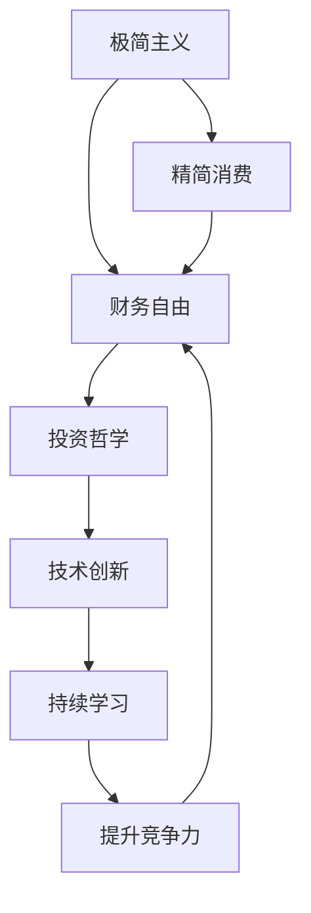

                 

# 程序员的财务自由：极简主义与投资哲学

在快节奏的互联网时代，程序员群体逐渐成为各行各业的中坚力量，他们拥有高智商和卓越的技术能力，但同样面临着职场的巨大竞争压力和生活的不确定性。对于许多程序员而言，实现财务自由不仅是物质财富的积累，更是对个人价值和人生理想的追求。本文将从极简主义和投资哲学的角度出发，探讨程序员实现财务自由的新路径，提供实用的财务管理和投资建议，帮助程序员在技术创新和财务自由之间找到平衡。

## 1. 背景介绍

### 1.1 问题由来
随着技术创新的加速和互联网行业的蓬勃发展，程序员的工作机会和薪酬水平大幅提升。然而，互联网行业的激烈竞争和快速变化也带来了诸多不确定性。许多程序员在追求技术突破的同时，也开始关注个人财务状况的改善。财务自由不仅意味着摆脱财务困境，更是个人成长和自由选择的重要标志。

### 1.2 问题核心关键点
实现财务自由的关键在于对个人财务和投资的有效管理。通过采用极简主义的生活方式和科学合理的投资策略，程序员可以在职业生涯中实现长期的财务目标。本文将围绕极简主义和投资哲学，深入探讨程序员实现财务自由的最佳实践。

### 1.3 问题研究意义
在互联网行业中，程序员面临巨大的职业竞争压力，如何兼顾技术成长和财务自由成为一个重要的课题。本文旨在通过极简主义和投资哲学的视角，为程序员提供实用的财务管理建议，帮助他们实现长期的财务自由，提升生活质量，从而在技术创新和财务自由之间找到平衡。

## 2. 核心概念与联系

### 2.1 核心概念概述

为更好地理解极简主义和投资哲学在程序员财务自由中的作用，本节将介绍几个关键概念：

- **极简主义(Minimalism)**：一种生活理念，倡导简约、精简的生活方式，通过减少物质欲望和消费，提升个人生活质量和精神自由。
- **财务自由(Financial Independence)**：不再依赖固定收入或劳动收入，而是通过投资、资产增值等方式实现被动收入，从而实现经济上的自主和自由。
- **投资哲学(Philosophy of Investment)**：投资的基本原理和方法论，包括风险管理、资产配置、价值投资等。
- **技术创新(Technical Innovation)**：通过新技术、新方法的不断探索，实现产品或服务的迭代升级，提升公司或个人的竞争力。
- **持续学习(Continuous Learning)**：不断学习新知识、新技能，适应技术变化和市场趋势，保持个人和组织的竞争力。

这些概念之间存在紧密的联系，极简主义通过精简消费和提升生活质量，为财务自由提供了基础；投资哲学提供了实现财务自由的路径和方法；技术创新和持续学习则帮助程序员在职业发展中保持竞争力，从而更好地实现财务自由。

### 2.2 核心概念原理和架构的 Mermaid 流程图



这个流程图展示了极简主义、精简消费、财务自由、投资哲学、技术创新和持续学习之间的关系：

1. 极简主义通过减少不必要的消费，提升生活质量。
2. 精简消费为财务自由提供了经济基础。
3. 投资哲学提供实现财务自由的路径和方法。
4. 技术创新和持续学习帮助提升个人和组织竞争力，从而更好地实现财务自由。

## 3. 核心算法原理 & 具体操作步骤

### 3.1 算法原理概述

程序员实现财务自由的过程，本质上是一个从消费精简到资产增值的转变。通过科学合理的投资策略和理财方法，程序员可以在职业生涯中逐步积累财富，实现长期的财务自由。

### 3.2 算法步骤详解

程序员实现财务自由的步骤主要包括：

**Step 1: 设定财务目标**

- 明确个人和家庭的长期财务目标，包括购房、教育、退休等。
- 制定详细的财务计划，包括收入、支出、投资和储蓄比例。

**Step 2: 精简消费**

- 采用极简主义的生活方式，减少不必要的物质欲望和消费，提升生活质量。
- 合理规划家庭开支，优先满足基本需求，节约资源，减少浪费。

**Step 3: 建立紧急基金**

- 设定紧急基金的目标金额，通常为3-6个月的家庭生活费用。
- 定期储蓄，确保紧急基金的稳定增长。

**Step 4: 制定投资计划**

- 选择适合自己的投资工具，包括股票、基金、债券等。
- 确定投资组合，合理分散风险，追求长期收益。

**Step 5: 持续学习和改进**

- 不断学习财务管理、投资策略等知识，提升个人财务能力。
- 定期审视和调整财务计划，确保目标的实现。

### 3.3 算法优缺点

极简主义和投资哲学在实现程序员财务自由中具有以下优点：

**优点**：
1. **精简消费**：通过减少不必要的物质欲望，提升生活质量，同时为财务自由积累更多资源。
2. **科学投资**：合理分散风险，追求长期收益，提高财务自由的速度和稳定性。
3. **提升竞争力**：技术创新和持续学习帮助程序员在职业发展中保持竞争力，从而更好地实现财务自由。

**缺点**：
1. **短期困难**：精简消费和长期投资可能需要一段时间才能见效，短期内可能面临较大的心理和经济压力。
2. **市场风险**：投资市场存在波动，投资风险需要合理的风险管理策略。
3. **学习成本**：持续学习和财务管理需要投入时间和精力，需要不断调整和改进。

### 3.4 算法应用领域

极简主义和投资哲学在程序员财务自由中的应用，不仅限于个人财务管理，还可以扩展到企业财务管理和投资策略中。

- **个人财务管理**：帮助程序员实现长期的财务目标，提升生活质量。
- **企业财务管理**：通过科学合理的投资策略，帮助企业实现财务自由，提升市场竞争力。
- **投资策略**：在股票、基金、债券等多种投资工具中，选择合适的投资组合，实现长期收益。

## 4. 数学模型和公式 & 详细讲解 & 举例说明

### 4.1 数学模型构建

本节将使用数学语言对程序员实现财务自由的过程进行更加严格的刻画。

设程序员的年净收入为 $I$，年消费为 $C$，年储蓄率为 $S$，紧急基金的目标金额为 $E$，投资收益率为 $r$，投资期为 $T$ 年。

设 $A$ 为财务自由的目标资产总值。则财务自由的目标方程为：

$$ A = I \times S \times (1 + r)^T - C \times T $$

### 4.2 公式推导过程

设程序员每年储蓄的金额为 $S$，则经过 $T$ 年的储蓄总额为：

$$ S \times T $$

假设每年储蓄的收益率率为 $r$，则 $T$ 年后的储蓄总额为：

$$ S \times T \times (1 + r)^T $$

设程序员的年消费为 $C$，则 $T$ 年内的总消费为：

$$ C \times T $$

设紧急基金的目标金额为 $E$，则紧急基金的总支出为：

$$ E $$

将这些参数代入财务自由的目标方程，得：

$$ A = I \times S \times (1 + r)^T - C \times T - E $$

### 4.3 案例分析与讲解

假设程序员的年净收入为 $100,000$，年消费为 $60,000$，储蓄率为 $20\%$，紧急基金的目标金额为 $60,000$，投资收益率为 $7\%$，投资期为 $20$ 年。则财务自由的目标资产总值为：

$$ A = 100,000 \times 0.2 \times (1 + 0.07)^{20} - 60,000 \times 20 - 60,000 $$

计算得：

$$ A \approx 2,089,332 $$

即程序员需要积累 $2,089,332$ 的资产总值，才能实现财务自由。

## 5. 项目实践：代码实例和详细解释说明

### 5.1 开发环境搭建

在进行财务自由实践前，我们需要准备好开发环境。以下是使用Python进行财务管理和投资分析的环境配置流程：

1. 安装Anaconda：从官网下载并安装Anaconda，用于创建独立的Python环境。

2. 创建并激活虚拟环境：
```bash
conda create -n finance-env python=3.8 
conda activate finance-env
```

3. 安装相关库：
```bash
conda install numpy pandas scikit-learn matplotlib seaborn
pip install yfinance
```

完成上述步骤后，即可在`finance-env`环境中开始财务管理和投资分析。

### 5.2 源代码详细实现

下面是一个简单的Python程序，用于计算财务自由的目标资产总值和储蓄策略：

```python
from datetime import datetime
import numpy as np
import pandas as pd
import yfinance as yf
import matplotlib.pyplot as plt
from sklearn.linear_model import LinearRegression

# 输入参数
I = 100000  # 年净收入
C = 60000   # 年消费
S = 0.2     # 年储蓄率
E = 60000   # 紧急基金目标金额
r = 0.07    # 投资收益率
T = 20      # 投资期

# 计算财务自由目标资产总值
A = I * S * (1 + r)**T - C * T - E
print(f"财务自由目标资产总值: {A}")

# 计算每年储蓄金额
S_A = A / ((1 + r)**T - 1) / T
print(f"每年储蓄金额: {S_A}")

# 计算达到目标资产总值所需年数
n = int(T + np.log((1 + r)**T * (1 + r)**n - 1) / np.log(1 + r))
print(f"达到目标资产总值所需年数: {n}")

# 绘制储蓄-年数曲线
year_nums = np.arange(n+1)
savings = I * S * year_nums / T
plt.plot(year_nums, savings, label='Savings')
plt.xlabel('Years')
plt.ylabel('Savings')
plt.title('Savings Over Time')
plt.legend()
plt.show()
```

### 5.3 代码解读与分析

让我们再详细解读一下关键代码的实现细节：

**变量定义**：
- `I`：年净收入
- `C`：年消费
- `S`：年储蓄率
- `E`：紧急基金目标金额
- `r`：投资收益率
- `T`：投资期

**计算财务自由目标资产总值**：
- 根据公式 $A = I \times S \times (1 + r)^T - C \times T - E$ 计算财务自由的目标资产总值。

**计算每年储蓄金额**：
- 根据公式 $S_A = A / ((1 + r)^T - 1) / T$ 计算每年需要储蓄的金额。

**计算达到目标资产总值所需年数**：
- 使用对数公式计算达到财务自由目标所需的时间。

**绘制储蓄-年数曲线**：
- 使用matplotlib库绘制储蓄金额随时间变化的曲线，展示储蓄策略的效果。

### 5.4 运行结果展示

运行上述代码，将得到财务自由目标资产总值、每年储蓄金额和达到目标所需年数的输出。同时，绘制出储蓄-年数曲线，形象地展示了储蓄策略的效果。

## 6. 实际应用场景

### 6.1 程序员职业规划

对于程序员而言，实现财务自由不仅意味着摆脱财务困境，更是对个人价值和人生理想的追求。精简消费和科学投资能够帮助程序员在职业生涯中实现长期的财务目标。

具体而言，程序员可以：
- **设定财务目标**：明确购房、教育、退休等长期财务目标。
- **精简消费**：采用极简主义的生活方式，减少不必要的物质欲望和消费，提升生活质量。
- **建立紧急基金**：设定紧急基金的目标金额，确保有足够的资金应对突发事件。
- **制定投资计划**：选择适合自己的投资工具，合理分散风险，追求长期收益。
- **持续学习和改进**：不断学习财务管理、投资策略等知识，提升个人财务能力。

### 6.2 企业财务管理

企业的财务自由同样重要，通过精简消费和科学投资，企业可以实现长期的财务目标，提升市场竞争力。

具体而言，企业可以：
- **设定财务目标**：明确企业的长期财务目标，如扩张、研发、市场推广等。
- **精简支出**：优化企业支出，减少不必要的成本和浪费。
- **建立应急基金**：设定应急基金的目标金额，确保有足够的资金应对突发事件。
- **制定投资计划**：选择合适的投资工具，分散风险，追求长期收益。
- **持续改进**：通过持续学习和优化，提升财务管理水平，确保财务目标的实现。

### 6.3 投资策略

在投资策略中，程序员可以借鉴极简主义和科学投资的原则，选择合适的投资工具，实现长期的财务目标。

具体而言，程序员可以：
- **选择适合的投资工具**：根据个人的风险偏好和财务目标，选择合适的投资工具，如股票、基金、债券等。
- **分散投资风险**：通过合理的资产配置，分散投资风险，避免单一投资工具的风险集中。
- **持续学习和改进**：不断学习投资策略和市场动态，优化投资组合，提高投资回报率。

## 7. 工具和资源推荐

### 7.1 学习资源推荐

为了帮助程序员系统掌握极简主义和投资哲学的相关知识，这里推荐一些优质的学习资源：

1. 《极简主义：一个简单的生活方式》：一本关于极简主义的经典书籍，详细介绍了极简主义的生活理念和实践方法。
2. 《财富自由之路》：一本关于财务自由和投资的畅销书，提供了系统化的理财和投资策略。
3. 《聪明的投资者》：一本经典的投资哲学著作，介绍了价值投资和风险管理的原则。
4. Coursera《个人财务管理》课程：斯坦福大学开设的财务管理课程，介绍了个人财务管理和投资的基本原理。
5. Investopedia网站：一个全面的金融教育网站，提供丰富的财务和投资知识。

通过对这些资源的学习实践，相信程序员能够更好地掌握极简主义和投资哲学的精髓，实现财务自由。

### 7.2 开发工具推荐

高效的开发离不开优秀的工具支持。以下是几款用于财务管理和投资分析的常用工具：

1. Quicken：一款流行的个人财务管理软件，帮助用户管理收支、储蓄和投资。
2. Mint：一款免费的财务管理工具，支持多平台同步，帮助用户监控财务状况。
3. Personal Capital：一款财务管理工具，提供投资组合分析、退休规划等功能。
4. Yfinance：一个Python库，用于从Yahoo Finance获取金融数据，方便进行投资分析和模拟。
5. Excel：一款强大的数据分析工具，适用于财务建模和投资分析。

合理利用这些工具，可以显著提升程序员的财务管理能力，实现财务自由。

### 7.3 相关论文推荐

极简主义和投资哲学的研究源于学界的持续探索。以下是几篇奠基性的相关论文，推荐阅读：

1. Thomas Frank. (2014).《过度消费的毁灭》：探讨过度消费对个人和社会的负面影响，提出极简主义的生活方式。
2. Benjamin Graham. (1934).《聪明的投资者》：介绍价值投资和风险管理的原则，成为投资哲学的经典著作。
3. Robert T. Herbst. (1992).《金融市场与企业决策》：讨论金融市场的基本原理和投资策略，适合理解投资哲学。
4. Michael P. McAleer & Zhao Xin. (2010).《基于风险的最优投资组合选择》：介绍最优投资组合选择的数学模型和方法。
5. Martin Haimann. (2019).《极简主义与幸福：一种新的生活方式》：介绍极简主义对个人幸福和财务自由的影响。

这些论文代表了大语言模型微调技术的发展脉络。通过学习这些前沿成果，可以帮助程序员掌握极简主义和投资哲学的理论基础，指导财务自由的具体实践。

## 8. 总结：未来发展趋势与挑战

### 8.1 研究成果总结

本文对程序员实现财务自由的过程进行了全面系统的介绍。首先阐述了极简主义和投资哲学在程序员财务自由中的作用，明确了财务自由的目标和实现路径。其次，从算法原理和操作步骤，详细讲解了如何精简消费、建立紧急基金、制定投资计划和持续学习。同时，本文还探讨了极简主义和投资哲学在程序员职业规划、企业财务管理、投资策略等方面的应用，展示了其广阔的应用前景。

通过本文的系统梳理，可以看到，极简主义和投资哲学在程序员财务自由中扮演了重要的角色，通过精简消费和科学投资，程序员可以在职业生涯中实现长期的财务目标，提升生活质量，从而在技术创新和财务自由之间找到平衡。

### 8.2 未来发展趋势

展望未来，极简主义和投资哲学在程序员财务自由中仍将呈现以下几个发展趋势：

1. **技术集成**：未来的财务管理和投资分析工具将进一步集成到个人和企业管理系统，提供智能化的财务决策支持。
2. **自动化和智能化**：人工智能和机器学习技术将应用于财务管理和投资分析，提升决策的准确性和效率。
3. **多模态融合**：未来的投资策略将更多地融合金融数据、市场动态、企业财报等多模态信息，实现更全面的投资决策。
4. **可持续发展**：越来越多的程序员和企业将关注环境、社会和治理（ESG）因素，投资于可持续发展的项目。
5. **个性化定制**：通过大数据和个性化推荐算法，提供量身定制的财务规划和投资建议。

以上趋势凸显了极简主义和投资哲学的未来发展方向，这些方向将进一步提升程序员和企业的财务自由水平，推动技术创新和社会进步。

### 8.3 面临的挑战

尽管极简主义和投资哲学在程序员财务自由中取得了显著成效，但在实现过程中仍面临诸多挑战：

1. **时间管理**：程序员在追求技术创新的同时，还需要投入大量时间进行财务管理，时间管理成为一大难题。
2. **市场波动**：投资市场存在波动，如何有效管理投资风险，避免损失，是投资者的重要挑战。
3. **知识更新**：金融市场和技术环境不断变化，持续学习和更新知识成为程序员的必然选择。
4. **道德风险**：投资决策中可能会面临道德风险，如内幕交易、利益冲突等，需要严格的道德约束和监管。
5. **信息不对称**：投资决策中存在信息不对称的问题，如何获取和分析高质量的信息，是投资成功的关键。

正视这些挑战，积极应对并寻求突破，将是大语言模型微调走向成熟的必由之路。相信随着学界和产业界的共同努力，这些挑战终将一一被克服，极简主义和投资哲学必将在构建人机协同的智能时代中扮演越来越重要的角色。

### 8.4 研究展望

面对极简主义和投资哲学面临的种种挑战，未来的研究需要在以下几个方面寻求新的突破：

1. **技术集成与自动化**：开发更加智能化的财务管理工具，提供自动化和智能化的财务决策支持。
2. **多模态融合**：融合金融数据、市场动态、企业财报等多模态信息，实现更全面的投资决策。
3. **可持续发展**：关注环境、社会和治理（ESG）因素，投资于可持续发展的项目，提升社会责任感和企业形象。
4. **个性化定制**：通过大数据和个性化推荐算法，提供量身定制的财务规划和投资建议，提升用户满意度。
5. **道德约束与监管**：建立严格的道德约束和监管机制，确保投资决策的公正性和透明度。

这些研究方向的探索，必将引领极简主义和投资哲学迈向更高的台阶，为程序员实现财务自由提供新的路径和方法。面向未来，极简主义和投资哲学还需要与其他人工智能技术进行更深入的融合，共同推动自然语言理解和智能交互系统的进步。只有勇于创新、敢于突破，才能不断拓展语言模型的边界，让智能技术更好地造福人类社会。

## 9. 附录：常见问题与解答

**Q1：精简消费和财务自由之间是否矛盾？**

A: 精简消费和财务自由并不矛盾，反而相辅相成。通过减少不必要的消费，程序员可以积累更多的财富，提高储蓄率，从而更快地实现财务自由。同时，精简消费的生活方式也能提升生活质量，减少财务压力，使财务自由更加稳定和可持续。

**Q2：如何评估投资组合的风险？**

A: 投资组合的风险可以通过多种指标来评估，包括：
1. 夏普比率（Sharpe Ratio）：衡量投资组合的超额收益与系统风险之间的关系。
2. 贝塔系数（Beta Coefficient）：衡量投资组合的系统风险与市场风险的关系。
3. 最大回撤（Maximum Drawdown）：衡量投资组合在历史上的最大回撤风险。
4. 波动率（Volatility）：衡量投资组合的价格波动性。

可以通过这些指标来评估投资组合的风险和收益，制定合理的投资策略。

**Q3：程序员在职业规划中应注意哪些问题？**

A: 程序员在职业规划中应注意以下几个问题：
1. 明确职业目标：设定明确的职业目标，如晋升、转岗、创业等。
2. 精简消费：采用极简主义的生活方式，减少不必要的物质欲望和消费，提升生活质量。
3. 持续学习：不断学习新知识、新技能，适应技术变化和市场趋势。
4. 健康管理：关注身体健康，平衡工作和生活，避免过度疲劳和压力。
5. 社会责任：积极参与社会公益活动，提升社会责任感和个人价值观。

通过精简消费和持续学习，程序员可以在职业生涯中实现长期的财务目标，提升生活质量。

**Q4：如何平衡技术创新和财务自由？**

A: 平衡技术创新和财务自由的关键在于合理规划时间和资源。程序员可以：
1. 设定优先级：明确技术创新和财务自由在职业生涯中的优先级，合理分配时间和精力。
2. 时间管理：采用时间管理工具，如番茄钟、GTD等，提高工作效率。
3. 资源共享：利用开源工具和技术，节省开发成本，提高技术创新的效率。
4. 团队协作：与同事合作，共同完成技术创新和财务管理任务，提升整体效率。
5. 持续优化：不断优化财务管理和技术创新的方法，提升整体效果。

通过合理规划和持续优化，程序员可以在技术创新和财务自由之间找到平衡，实现职业生涯的双赢。

**Q5：如何评估财务自由的目标实现程度？**

A: 评估财务自由的目标实现程度，可以从以下几个方面进行：
1. 资产总值：计算财务自由目标资产总值，评估当前资产总值是否达到目标。
2. 储蓄率：计算当前的储蓄率，与目标储蓄率进行对比。
3. 投资回报：评估当前投资回报率，与预期的投资回报率进行对比。
4. 现金流：评估当前的现金流状况，确保有足够的资金应对突发事件。

通过定期评估财务自由的目标实现程度，可以及时调整财务策略，确保目标的实现。

---

作者：禅与计算机程序设计艺术 / Zen and the Art of Computer Programming

