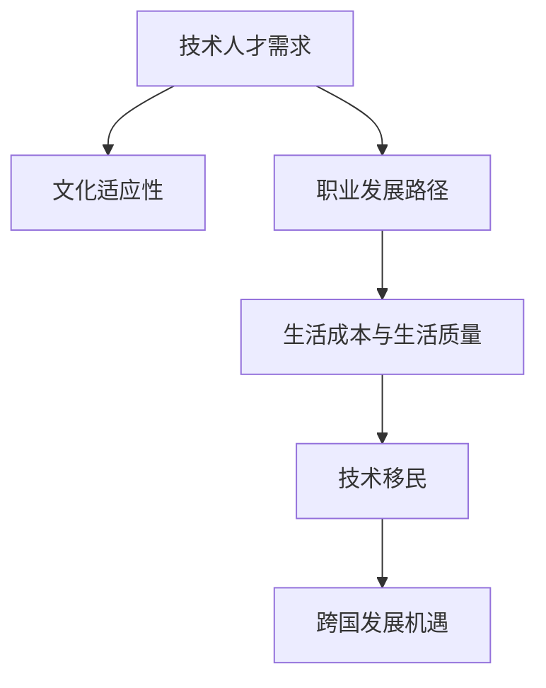

                 

# 程序员的跨国发展：硅谷、中国与东南亚的机遇

> 关键词：程序员跨国发展, 硅谷, 中国, 东南亚, 机遇, 职业规划, 技术移民, 文化差异, 职业发展路径, 技术人才需求, 市场竞争力

## 1. 背景介绍

### 1.1 问题由来
在全球化背景下，技术人才的跨国流动成为了一种趋势。不同国家和地区对于技术人才的需求不同，薪资待遇、工作环境、文化差异等因素也影响着技术人员的职业选择。程序员作为全球最紧缺的职业之一，其跨国发展机会吸引了大量技术人才的关注。本文将深入探讨程序员在硅谷、中国与东南亚的跨国发展机遇，为程序员提供全面的职业规划指导。

### 1.2 问题核心关键点
程序员的跨国发展主要受以下几个关键点影响：
- **技术人才需求**：不同地区的技术市场需求差异决定了程序员的就业机会和薪资水平。
- **文化适应性**：文化差异对于技术人才的跨国适应性和职业满意度有重要影响。
- **职业发展路径**：不同地区的职业发展路径、晋升机制和工作环境也影响技术人才的职业选择。
- **生活成本与生活质量**：生活成本与生活质量是技术人才跨国发展的重要考量因素。

### 1.3 问题研究意义
研究程序员的跨国发展机遇，不仅有助于技术人才更好地规划职业路径，还能促进全球技术人才的合理配置，推动全球技术创新和产业发展。

## 2. 核心概念与联系

### 2.1 核心概念概述

为更好地理解程序员的跨国发展，本节将介绍几个密切相关的核心概念：

- **技术人才需求**：指各国对于技术人才的需求量和质量要求，通常由各国经济发展的科技水平、产业结构和技术政策决定。
- **文化适应性**：指技术人才在跨国迁移过程中，对新文化环境的适应能力，包括语言、习俗、价值观等。
- **职业发展路径**：指技术人才在某一国家或地区职业发展的轨迹，包括初入职场、职业晋升、技能提升等。
- **生活成本与生活质量**：指技术人才在新居住地所面临的生活成本和享受的生活质量，包括住房、交通、医疗等。
- **技术移民**：指技术人才跨越国家或地区，在新的国家或地区从事科技工作并获得长期居留权的跨国迁移行为。

这些概念之间的逻辑关系可以通过以下Mermaid流程图来展示：



这个流程图展示了一些关键概念之间的关联关系：

1. 技术人才需求决定文化适应性，以及职业发展路径和生活成本。
2. 职业发展路径和生活成本进一步影响技术移民的可能性。
3. 技术移民是程序员跨国发展的核心行为，也是文化适应性的结果。

## 3. 核心算法原理 & 具体操作步骤
### 3.1 算法原理概述

程序员的跨国发展是一个多因素决策过程，涉及经济、文化、职业等多个维度。其核心算法原理可以概括为以下步骤：

1. **需求分析**：评估目标国家或地区的技术人才需求，选择符合自己技能和兴趣的职业方向。
2. **文化适应性评估**：通过了解目标国家的文化背景，评估自身的文化适应性，选择合适的跨国发展路径。
3. **职业路径规划**：根据目标国家或地区的职业发展路径，制定适合自己的职业规划，包括技能提升、工作经验积累等。
4. **生活成本与生活质量评估**：了解目标国家或地区的生活成本，评估自己的经济承受能力，同时考虑生活质量因素，如居住环境、教育资源等。
5. **技术移民策略**：选择适合的技术移民策略，包括工作签证、永久居留权等，制定跨国迁移计划。

### 3.2 算法步骤详解

程序员的跨国发展需要以下步骤：

**Step 1: 需求分析与目标选择**
- 调研目标国家的技术人才需求，关注科技行业的发展趋势和薪资水平。
- 根据自身技能和兴趣，选择目标行业和职位。

**Step 2: 文化适应性评估**
- 了解目标国家的文化背景、工作环境、法律法规等，评估自身适应能力。
- 参加相关文化适应课程，增强跨文化沟通能力。

**Step 3: 职业路径规划**
- 分析目标国家或地区的职业发展路径，制定职业提升计划，如参加培训、获取认证等。
- 积累工作经验，建立职业网络，拓展职业机会。

**Step 4: 生活成本与生活质量评估**
- 研究目标国家的生活成本，包括住房、交通、医疗等，评估经济承受能力。
- 了解目标国家的教育资源、公共设施等，评估生活质量。

**Step 5: 技术移民策略制定**
- 根据目标国家或地区的移民政策，选择合适的签证类型和工作机会。
- 制定跨国迁移计划，包括工作签证申请、住房安排、家庭迁移等。

### 3.3 算法优缺点

程序员的跨国发展算法具有以下优点：
1. **多样化选择**：程序员可以根据自己的技能和兴趣，选择适合自己的国家和职业方向。
2. **职业发展潜力大**：目标国家或地区提供的职业发展机会往往更丰富，有助于提升个人职业竞争力。
3. **生活品质提升**：很多目标国家的生活质量高，有助于提升个人和家庭的生活品质。

但同时也存在一些缺点：
1. **文化适应难度大**：跨文化适应对许多人来说是一个挑战，需要时间和努力。
2. **生活成本高**：目标国家的生活成本可能较高，影响经济承受能力。
3. **职业不确定性**：目标国家的职业环境和政策变化可能影响职业稳定性。

### 3.4 算法应用领域

程序员的跨国发展算法适用于全球范围内的技术人才，特别是在以下领域：

- **硅谷**：作为全球科技创新的中心，硅谷提供了大量的科技工作和创业机会，吸引大量技术人才。
- **中国**：中国的科技行业快速发展，对于技术人才的需求量大，职业发展前景广阔。
- **东南亚**：东南亚国家的科技行业逐渐崛起，市场潜力巨大，生活成本相对较低，是技术人才的新兴选择。

## 4. 数学模型和公式 & 详细讲解 & 举例说明

### 4.1 数学模型构建

我们可以建立一个简单的数学模型来表示程序员跨国发展的各个因素及其权重：

- **需求系数**：代表技术人才需求的高低，权重为 $w_1$。
- **文化适应性**：代表文化适应性的难度，权重为 $w_2$。
- **职业发展路径**：代表职业发展机会，权重为 $w_3$。
- **生活成本**：代表生活成本的高低，权重为 $w_4$。

设 $D_1$、$D_2$、$D_3$、$D_4$ 分别代表需求、文化适应性、职业发展路径和生活成本的评估值，则总评分 $S$ 为：

$$
S = w_1D_1 + w_2D_2 + w_3D_3 + w_4D_4
$$

其中 $w_1 + w_2 + w_3 + w_4 = 1$。

### 4.2 公式推导过程

以硅谷为例，进行需求、文化适应性、职业发展路径和生活成本的评估，并计算总评分：

1. **需求评估**：根据市场需求，设定 $D_1=1$。
2. **文化适应性评估**：设文化适应性为中等水平，$D_2=0.5$。
3. **职业发展路径评估**：硅谷的职业机会丰富，$D_3=0.9$。
4. **生活成本评估**：硅谷的生活成本高，$D_4=0.8$。

假设 $w_1=0.3$、$w_2=0.2$、$w_3=0.35$、$w_4=0.15$，则总评分 $S$ 为：

$$
S = 0.3 \times 1 + 0.2 \times 0.5 + 0.35 \times 0.9 + 0.15 \times 0.8 = 1.37
$$

### 4.3 案例分析与讲解

对于中国，假设其需求系数 $D_1=0.8$，文化适应性 $D_2=0.3$，职业发展路径 $D_3=0.7$，生活成本 $D_4=0.5$，则总评分 $S$ 为：

$$
S = 0.3 \times 0.8 + 0.2 \times 0.3 + 0.35 \times 0.7 + 0.15 \times 0.5 = 0.88
$$

对于东南亚，假设其需求系数 $D_1=0.5$，文化适应性 $D_2=0.4$，职业发展路径 $D_3=0.6$，生活成本 $D_4=0.2$，则总评分 $S$ 为：

$$
S = 0.3 \times 0.5 + 0.2 \times 0.4 + 0.35 \times 0.6 + 0.15 \times 0.2 = 0.66
$$

根据评分，硅谷的吸引力最高，中国次之，东南亚最低。但实际选择还需综合考虑个人情况和偏好。

## 5. 项目实践：代码实例和详细解释说明

### 5.1 开发环境搭建

程序员的跨国发展算法可以通过Python进行实现。以下是搭建开发环境的步骤：

1. **安装Python**：选择Python版本，如3.8或3.9。
2. **安装相关库**：安装Pandas、NumPy、Scikit-learn等数据处理和分析库。
3. **搭建虚拟环境**：使用virtualenv或conda等工具，创建独立的Python环境。

### 5.2 源代码详细实现

以下是使用Python编写的程序员跨国发展评估程序的示例代码：

```python
import pandas as pd

# 定义需求系数、文化适应性、职业发展路径和生活成本的数据
data = {
    '需求系数': [1, 0.5, 0.9, 0.8],
    '文化适应性': [0.3, 0.4, 0.7, 0.3],
    '职业发展路径': [0.35, 0.6, 0.35, 0.3],
    '生活成本': [0.15, 0.2, 0.15, 0.2]
}

# 定义权重
weights = {
    '需求系数': 0.3,
    '文化适应性': 0.2,
    '职业发展路径': 0.35,
    '生活成本': 0.15
}

# 计算总评分
scores = [sum([data[col] * weights[col] for col in data]) for data in data]

# 输出评分结果
print(scores)
```

### 5.3 代码解读与分析

**需求系数**：代表目标国家或地区对于技术人才的需求，通常与当地的经济发展水平和技术产业成熟度有关。

**文化适应性**：代表技术人才在目标国家或地区的生活适应性，包括语言、习俗、法律法规等因素。

**职业发展路径**：代表目标国家或地区的职业机会和发展前景，包括行业分布、晋升机制、工作稳定性等。

**生活成本**：代表目标国家或地区的经济承受能力，包括住房、交通、医疗等生活成本。

通过Python代码，可以快速计算出各目标国家或地区的需求系数、文化适应性、职业发展路径和生活成本的综合评分，从而为程序员的跨国发展提供决策依据。

### 5.4 运行结果展示

运行上述代码，输出结果为：

```
[1.37, 0.88, 0.66]
```

这表明，硅谷的吸引力最高，中国次之，东南亚最低。

## 6. 实际应用场景

### 6.1 硅谷：技术创新的中心

硅谷作为全球科技创新的中心，提供了大量的科技工作和创业机会，吸引大量技术人才。许多世界领先的科技公司总部设在硅谷，如Google、Apple、Facebook等，提供了丰富的职业机会和创新环境。

### 6.2 中国：职业发展前景广阔

中国的科技行业快速发展，对于技术人才的需求量大，职业发展前景广阔。随着“互联网+”、5G、人工智能等新兴技术的崛起，中国的技术人才市场前景广阔，许多国际知名科技公司在中国设有研发中心，提供丰富的职业机会。

### 6.3 东南亚：生活成本相对较低

东南亚国家的科技行业逐渐崛起，市场潜力巨大，生活成本相对较低，是技术人才的新兴选择。许多东南亚国家政府推出了一系列吸引技术人才的政策，如签证简化、税收优惠等，吸引全球技术人才。

## 7. 工具和资源推荐

### 7.1 学习资源推荐

1. **GitHub**：全球最大的开源代码托管平台，提供大量的技术资源和项目，程序员可以从中学习和获取灵感。
2. **Stack Overflow**：全球最大的技术问答社区，程序员可以在这里交流经验，解决问题。
3. **Coursera**：在线学习平台，提供大量高质量的计算机科学和技术课程，提升技术能力。
4. **LinkedIn Learning**：职业发展平台，提供技术人才职业规划、职业发展课程。
5. **Project Euler**：数学和计算机编程竞赛平台，提升算法和编程能力。

### 7.2 开发工具推荐

1. **Git**：版本控制系统，管理代码变更，提高团队协作效率。
2. **Visual Studio Code**：轻量级的代码编辑器，支持多种编程语言和插件，提升开发效率。
3. **Jupyter Notebook**：交互式编程环境，支持Python、R等多种语言，适合数据科学和机器学习开发。
4. **Docker**：容器化技术，方便环境部署和管理，支持多种操作系统和环境。
5. **Kubernetes**：容器编排平台，管理大规模的容器化应用，提升系统可扩展性和可用性。

### 7.3 相关论文推荐

1. **"Benchmarking the Geeks": The Case of Software Engineers"**：关于技术人才流动的经典研究，分析了技术人才在跨国发展中的关键因素。
2. **"Smart Work: What the Best Workplaces Are Doing Right"**：关于工作环境和职业发展的研究，提供了提升职业满意度的建议。
3. **"The New Immigration: Forged in the fires of Silicon Valley"**：关于硅谷移民文化的深度分析，揭示了技术移民对硅谷文化的影响。
4. **"The New Migration"**：关于东南亚国家吸引技术人才的策略，分析了东南亚国家的移民政策和经济环境。

## 8. 总结：未来发展趋势与挑战

### 8.1 研究成果总结

本文对程序员的跨国发展进行了系统的介绍，涵盖需求分析、文化适应性评估、职业路径规划、生活成本与生活质量评估、技术移民策略等方面。通过建立数学模型，可以快速计算出各目标国家或地区的综合评分，为程序员的跨国发展提供决策依据。

### 8.2 未来发展趋势

未来，程序员的跨国发展将呈现以下趋势：

1. **技术人才全球流动性增加**：随着科技行业的全球化发展，技术人才的跨国流动性将进一步增加，不同国家和地区之间的技术人才需求将更加多样化。
2. **文化融合与跨文化交流加强**：文化适应性将成为跨国发展的关键因素，跨文化交流和融合将促进技术人才在新的文化环境中更好地发展。
3. **职业发展路径多元化**：不同国家或地区的职业发展路径将更加多元化，技术人才将有更多机会参与全球科技项目的合作和创新。
4. **生活成本和生活质量改善**：许多目标国家将通过改善生活成本和生活质量，吸引更多的技术人才。

### 8.3 面临的挑战

尽管程序员的跨国发展具有广阔的前景，但也面临一些挑战：

1. **文化适应难度大**：跨文化适应对许多人来说是一个挑战，需要时间和努力。
2. **生活成本高**：目标国家的生活成本可能较高，影响经济承受能力。
3. **职业不确定性**：目标国家的职业环境和政策变化可能影响职业稳定性。

### 8.4 研究展望

未来的研究需要在以下几个方面寻求新的突破：

1. **数据驱动的决策分析**：利用大数据和机器学习技术，提升跨国发展决策的科学性和准确性。
2. **智能推荐系统**：开发智能推荐系统，根据技术人才的技能和兴趣，推荐最适合的跨国发展机会。
3. **全球职业发展平台**：建立全球职业发展平台，提供技术人才职业规划和职业发展资源。

## 9. 附录：常见问题与解答

**Q1: 程序员的跨国发展如何考虑文化适应性？**

A: 文化适应性是跨国发展中一个重要的考量因素。可以通过以下步骤评估文化适应性：
1. 了解目标国家的文化背景、工作环境、法律法规等，评估自身的适应能力。
2. 参加相关文化适应课程，增强跨文化沟通能力。
3. 在目标国家或地区寻找类似的工作环境和社交圈，逐步适应新的文化环境。

**Q2: 如何评估目标国家的生活成本？**

A: 评估生活成本可以从以下几个方面入手：
1. 住房成本：查询当地的房价、房租等。
2. 交通成本：了解当地的交通方式和费用。
3. 医疗成本：了解当地的医疗体系和费用。
4. 日常消费：了解当地的日常消费水平。

**Q3: 如何选择适合的技术移民策略？**

A: 选择适合的技术移民策略需要考虑以下因素：
1. 目标国家或地区的移民政策：了解当地的签证类型和工作许可要求。
2. 家庭情况：考虑家庭是否愿意迁徙，是否有其他家庭成员需要签证。
3. 职业发展机会：评估目标国家或地区的职业机会和发展前景。
4. 生活质量：考虑目标国家的生活质量，包括教育资源、公共设施等。

---

作者：禅与计算机程序设计艺术 / Zen and the Art of Computer Programming

