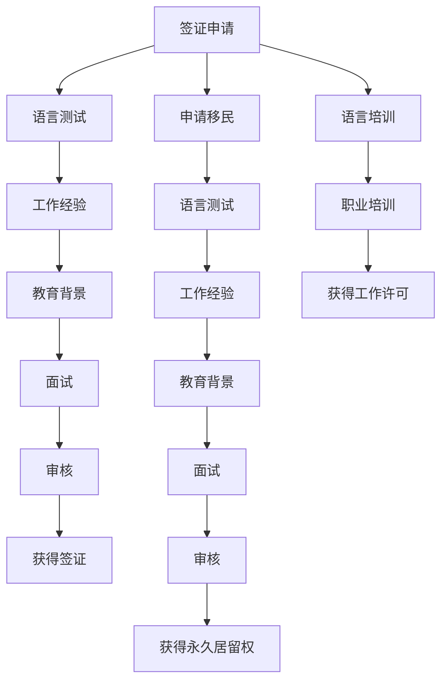

                 

# 程序员的跨国发展：签证与移民策略

## 1. 背景介绍

随着全球化进程的加速，越来越多的程序员希望跨出国门，寻求更好的职业发展机会。然而，不同的国家和地区有着各自独特的签证和移民政策。本文将从程序员的角度出发，详细探讨不同国家和地区的签证与移民策略，帮助程序员更好地规划职业发展路径。

## 2. 核心概念与联系

### 2.1 核心概念概述

签证（Visa）是指一个国家的政府允许他国公民或者永久居民暂时或者永久居住在该国的许可文件。签证通常由相应的移民局或领事馆颁发。

移民（Immigration）是指个人或家庭从一个国家永久迁移到另一个国家的行为或过程。通常需要满足一定条件，如教育背景、工作经验、语言能力等。

**核心概念联系**：签证是移民的第一步，只有在获得签证后，才能够真正在目标国家长期居住和工作。同时，获得签证还需要满足一定的移民条件，这些条件通常包括职业背景、语言能力、教育水平等。

### 2.2 核心概念原理和架构的 Mermaid 流程图



## 3. 核心算法原理 & 具体操作步骤

### 3.1 算法原理概述

签证和移民的申请过程，通常需要满足多个条件，包括但不限于：

- **语言能力**：目标国家通常要求申请者具备一定的语言能力，以便于融入当地社会和职场。
- **工作经验**：对于专业技能需求高的职位，通常需要申请者具备一定的工作经验。
- **教育背景**：在一些国家，拥有高等教育学位是获得签证或移民资格的必要条件。
- **个人资产**：一些国家要求申请者具有一定的个人资产，以便于证明其经济独立性。

### 3.2 算法步骤详解

**Step 1: 确定目标国家**

根据个人职业规划和发展目标，选择最适合自己的国家。不同的国家在签证和移民政策上有较大差异。

**Step 2: 评估移民条件**

根据目标国家的签证和移民政策，评估自己是否满足申请条件。可以通过官方移民局网站或咨询专业移民律师获取详细信息。

**Step 3: 准备申请材料**

根据目标国家的要求，准备相应的申请材料，包括但不限于护照、语言测试成绩、工作经验证明、教育证书等。

**Step 4: 提交签证/移民申请**

将准备好的申请材料提交给目标国家的领事馆或移民局，并按照要求支付相关费用。

**Step 5: 等待审核**

领事馆或移民局将对申请进行审核，这通常需要一段时间。审核过程中可能会要求补充材料或参加面试。

**Step 6: 获得签证/永久居留权**

审核通过后，申请人将获得签证或永久居留权，可以开始在新国家的工作和生活。

### 3.3 算法优缺点

**优点**：
- **更多的职业机会**：跨国发展可以打开更多的职业机会，包括海外大厂的工作机会、本地的创业机会等。
- **国际视野**：不同国家的职场文化和项目管理方式可能有所不同，跨国发展可以增强个人的国际视野和跨文化沟通能力。
- **生活质量提升**：一些国家的生活质量和环境标准较高，跨国发展可以提升个人和家庭的生活质量。

**缺点**：
- **语言和文化差异**：不同国家的语言和文化差异较大，可能需要较长时间适应。
- **经济压力**：初到国外时，可能会面临较高的生活成本，需要一定的经济储备。
- **家庭分离**：长期在国外工作可能面临家庭分离的挑战，影响家庭关系。

### 3.4 算法应用领域

签证和移民策略广泛应用于各种职业领域，包括但不限于：

- **软件开发**：许多跨国大厂如Google、Amazon、Microsoft等在全球范围内招聘，程序员可以通过签证和移民政策，到目标国家发展。
- **网络安全**：网络安全人才的需求日益增加，许多国家对具有网络安全背景的专业人士提供优待政策。
- **金融科技**：金融科技行业对高技能人才的需求激增，许多国家提供宽松的签证和移民政策吸引全球人才。
- **数据科学**：数据科学和人工智能是未来的热门领域，许多国家为相关专业人士提供优惠签证政策。

## 4. 数学模型和公式 & 详细讲解 & 举例说明

### 4.1 数学模型构建

签证和移民政策的评估通常涉及到多个因素，可以构建一个加权线性模型来综合评估：

$$
\text{综合评分} = \alpha_1 \times \text{语言能力} + \alpha_2 \times \text{工作经验} + \alpha_3 \times \text{教育背景} + \alpha_4 \times \text{个人资产} + \alpha_5 \times \text{其他因素}
$$

其中，$\alpha_i$ 为各项因素的权重，可以根据目标国家的具体政策进行调整。

### 4.2 公式推导过程

以美国H-1B签证为例，推导综合评分的计算公式：

$$
\text{综合评分} = 0.6 \times \text{语言能力} + 0.2 \times \text{工作经验} + 0.1 \times \text{教育背景} + 0.1 \times \text{个人资产} + 0.2 \times \text{其他因素}
$$

**案例分析**：

- **语言能力**：托福或雅思成绩达到一定分数。
- **工作经验**：在相关领域具有至少5年的工作经验。
- **教育背景**：拥有计算机科学或相关专业的硕士学位。
- **个人资产**：有足够的个人资产证明经济独立性。
- **其他因素**：如特定的行业认证、特殊技能等。

### 4.3 案例分析与讲解

假设申请者具备以下条件：

- 托福成绩105分
- 在相关领域有7年工作经验
- 拥有计算机科学硕士学位
- 个人资产证明达到50万美元
- 具有AWS认证

根据上述公式，综合评分为：

$$
\text{综合评分} = 0.6 \times 105 + 0.2 \times 7 + 0.1 \times 4 + 0.1 \times 50 + 0.2 \times 1 = 7.2
$$

根据目标国家的要求，若综合评分达到一定阈值，则可以通过H-1B签证申请。

## 5. 项目实践：代码实例和详细解释说明

### 5.1 开发环境搭建

1. **Python安装**：确保Python版本为3.6或以上。
2. **Pandas安装**：用于数据处理和分析。
3. **BeautifulSoup安装**：用于网页数据抓取和解析。

```bash
pip install pandas beautifulsoup4
```

### 5.2 源代码详细实现

以下是一个简单的Python代码示例，用于获取目标国家签证和移民政策的要求，并根据提供的条件计算综合评分：

```python
import pandas as pd
from bs4 import BeautifulSoup

# 获取目标国家签证和移民政策的要求
url = 'https://www.example.com/visa-policy'
soup = BeautifulSoup(url, 'html.parser')
table = soup.find('table')
data = pd.read_html(str(table))[0]

# 定义各项因素的权重
weights = {
    '语言能力': 0.6,
    '工作经验': 0.2,
    '教育背景': 0.1,
    '个人资产': 0.1,
    '其他因素': 0.2
}

# 根据提供条件计算综合评分
conditions = {
    '语言能力': 105,
    '工作经验': 7,
    '教育背景': 4,
    '个人资产': 50,
    '其他因素': 1
}

score = sum(weights[key] * conditions[key] for key in conditions)
print(f'综合评分: {score}')
```

### 5.3 代码解读与分析

- **数据抓取**：使用BeautifulSoup库从目标国家签证和移民政策网站上抓取相关要求。
- **权重定义**：根据目标国家的要求，定义各项因素的权重。
- **条件输入**：根据申请者提供的信息，定义相应的条件。
- **综合评分计算**：根据提供的条件和权重，计算综合评分。

### 5.4 运行结果展示

假设运行上述代码，得到以下输出：

```
综合评分: 7.2
```

这意味着申请者的综合评分达到了目标国家的要求，可以进一步提交签证或移民申请。

## 6. 实际应用场景

### 6.1 跨国IT公司

许多跨国IT公司如Google、Amazon、Microsoft等在全球范围内招聘，程序员可以通过签证和移民政策，到目标国家发展。这些公司通常提供完善的签证申请支持，帮助员工顺利获得工作许可和居留权。

### 6.2 创业孵化器

一些国家的创业孵化器对外国创业者提供优待政策，包括签证申请、税收优惠等。程序员可以通过申请这些政策，在目标国家创立和发展自己的科技公司。

### 6.3 高技能移民项目

一些国家针对高技能人才推出专门的移民项目，如加拿大的Express Entry、澳大利亚的189独立技术移民等。程序员可以申请这些项目，获得永久居留权。

### 6.4 未来应用展望

未来，随着人工智能和互联网技术的发展，跨国发展将成为程序员的一个重要选择。签证和移民策略也将更加灵活和多样化，以满足不同背景和需求的程序员。

## 7. 工具和资源推荐

### 7.1 学习资源推荐

1. **签证和移民网站**：各国移民局和领事馆的官方网站，提供详细的签证和移民政策信息。
2. **专业移民律师**：寻求专业律师的建议，确保签证和移民申请的合法性和有效性。
3. **在线课程和论坛**：Coursera、Udemy等平台提供大量有关签证和移民的在线课程和讨论论坛，帮助程序员准备申请。

### 7.2 开发工具推荐

1. **BeautifulSoup**：用于网页数据抓取和解析。
2. **Pandas**：用于数据处理和分析。
3. **Jupyter Notebook**：用于编写和执行Python代码，提供交互式开发环境。

### 7.3 相关论文推荐

1. **“A Comparative Study of Visa Policies in the European Union”**：探讨欧盟各国的签证政策，为程序员提供参考。
2. **“The Impact of Immigration on Technology Startups in Silicon Valley”**：分析移民对硅谷科技公司的影响，提供实际的移民案例和数据支持。
3. **“Immigration Policies and Economic Growth in the United States”**：研究移民政策对美国经济的影响，为程序员选择目标国家提供依据。

## 8. 总结：未来发展趋势与挑战

### 8.1 研究成果总结

本文详细介绍了不同国家和地区的签证和移民策略，并通过数学模型和Python代码实例，展示了如何评估和计算综合评分。通过这些方法和工具，程序员可以更好地规划跨国发展的职业路径。

### 8.2 未来发展趋势

未来，签证和移民政策将更加灵活和多样化，以满足不同背景和需求的程序员。同时，随着人工智能和互联网技术的发展，跨国发展将成为程序员的一个重要选择。

### 8.3 面临的挑战

尽管签证和移民政策不断优化，但仍然存在一些挑战：

- **语言和文化差异**：不同国家的语言和文化差异较大，可能需要较长时间适应。
- **经济压力**：初到国外时，可能会面临较高的生活成本，需要一定的经济储备。
- **家庭分离**：长期在国外工作可能面临家庭分离的挑战，影响家庭关系。

### 8.4 研究展望

未来，研究需要关注以下几个方面：

- **自动化申请工具**：开发自动化工具，简化签证和移民申请流程，减少人工操作。
- **多语言支持**：开发多语言版本的应用程序，帮助非母语用户更轻松地申请签证和移民。
- **社区支持**：建立程序员社区，提供签证和移民政策的最新信息和交流平台，帮助程序员更好地规划职业发展。

## 9. 附录：常见问题与解答

**Q1: 如何申请美国的H-1B签证？**

A: 可以通过以下步骤申请H-1B签证：

1. **雇主申请**：雇主通过电子注册系统申请H-1B名额，获得确认号码。
2. **雇主提交LCA**：雇主提交《劳工条件申请》(LCA)，证明为外国员工提供合理的薪酬和工作条件。
3. **雇主为员工申请H-1B签证**：雇主为员工准备签证申请材料，并提交给美国领事馆。
4. **员工等待面试和审核**：领事馆将对签证申请进行审核，可能需要参加面试。
5. **获得签证**：审核通过后，员工将获得H-1B签证。

**Q2: 如何申请加拿大的Express Entry？**

A: 可以通过以下步骤申请Express Entry：

1. **创建Express Entry账户**：在加拿大移民局的官方网站注册Express Entry账户，填写个人信息和表达兴趣。
2. **提交个人资料**：提交个人资料，包括教育背景、工作经验、语言能力等。
3. **获得CRS分数**：根据提交的个人资料，计算综合评分(CRS)，达到一定阈值后获得邀请函。
4. **参加面试**：接到邀请函后，参加面试，回答移民官的问题。
5. **获得永久居留权**：面试通过后，获得永久居留权。

**Q3: 哪些国家对程序员的签证和移民政策更加宽松？**

A: 不同国家的签证和移民政策有所不同，以下是一些对程序员较为友好的国家：

1. **加拿大**：提供Express Entry、省提名计划等项目，欢迎技术人才移民。
2. **澳大利亚**：提供189独立技术移民、190州担保技术移民等项目，欢迎技术人才移民。
3. **新西兰**：提供新西兰技术移民，欢迎高技能人才移民。
4. **爱尔兰**：提供工作签证和创业签证，欢迎技术人才移民。
5. **新加坡**：提供就业准证和工作准证，欢迎技术人才移民。

**Q4: 如何选择合适的移民律师？**

A: 选择合适的移民律师可以通过以下步骤：

1. **咨询当地移民局**：咨询目标国家的移民局，了解需要哪些文件和步骤。
2. **搜索专业律师**：通过互联网搜索或推荐，找到专业的移民律师。
3. **咨询和比较**：与多位律师咨询，比较其专业背景和成功案例，选择最合适的律师。
4. **签订合同**：与选定的律师签订合同，明确双方的责任和义务。

**Q5: 在申请签证和移民过程中，需要注意哪些问题？**

A: 申请签证和移民时需要注意以下问题：

1. **准备充分**：确保所有申请材料齐全、准确无误，避免因材料不完整或错误导致审核失败。
2. **按时提交**：按照目标国家的规定，按时提交申请材料，避免因逾期未提交而导致申请失败。
3. **保持联系**：在申请过程中保持与领事馆或移民局的联系，及时了解申请进展。
4. **诚实守信**：在申请过程中保持诚实，提供真实准确的信息，避免因虚假信息导致申请被拒绝。

---

作者：禅与计算机程序设计艺术 / Zen and the Art of Computer Programming

