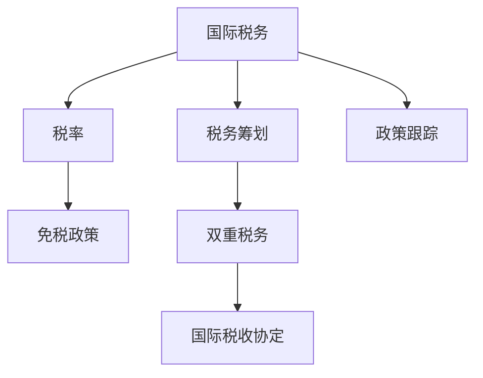

                 

# 程序员的跨国税务筹划策略

## 1. 背景介绍

全球化背景下的跨国家税务筹划已成为全球程序员的共同话题。尤其是在全球IT公司和创业公司遍布的情况下，了解不同国家和地区的税务政策，对程序员进行合理税务筹划，变得越来越重要。无论是在硅谷、新加坡还是中国，程序员需要具备全球视野，了解不同国家税务政策，才能合法合规地进行税务筹划，优化自身财务状况，减轻税负。

### 1.1 问题由来

税务筹划，不仅仅是一个财务问题，它涉及到一个国家的法律法规、税率和政策，以及个人的收入结构、支出安排和投资决策。对于程序员来说，尤其是那些在多个国家和地区工作的国际人才，如何合理筹划税务，成为一个复杂的难题。

由于不同国家有不同的税收制度，税率、税种和免税政策差异较大，因此程序员必须具备一定的税务知识，以及熟悉不同国家税制的专业工具和方法。不仅如此，很多国家和地区的税法还涉及到国际税收协定和双边税收协议，这些都直接影响跨国税务筹划的效果。

### 1.2 问题核心关键点

程序员跨国税务筹划的核心关键点包括：

- 税法了解：理解不同国家和地区的税法规定和政策差异。
- 税率计算：准确计算税前收入和税后收入，优化税务结构。
- 投资规划：合理规划税务投资，利用税收优惠政策。
- 避税策略：利用合法手段规避高额税务，但需避免违反法律和协议。
- 政策跟踪：持续关注税法变化，调整税务筹划策略。

## 2. 核心概念与联系

### 2.1 核心概念概述

为更好地理解程序员跨国税务筹划方法，本节将介绍几个密切相关的核心概念：

- 国际税务：跨国经济活动中所涉及的各种税务问题。
- 税率：国家对不同收入水平和所得类型征收的税收比例。
- 免税政策：某些收入或投资在一定条件下可免于征税。
- 税务筹划：利用合法途径，合理优化税务结构，减轻税负。
- 双重税务：跨国所得在同一国家同时被双重征税的问题。
- 国际税收协定：国家间为解决双重税务问题签订的协议。

这些核心概念之间的逻辑关系可以通过以下Mermaid流程图来展示：



这个流程图展示了一个程序员进行跨国税务筹划的过程：

1. 了解国际税务的基本情况。
2. 根据税率计算应缴税额，优化收入分配。
3. 利用免税政策，合理规划税务投资。
4. 避免双重税务，通过国际税收协定解决问题。
5. 持续跟踪税法变化，调整税务筹划策略。

## 3. 核心算法原理 & 具体操作步骤
### 3.1 算法原理概述

程序员跨国税务筹划的算法原理，实质上是一种基于税法和投资策略的优化问题。假设一个程序员在全球有N个国家工作，每个国家的税率和免税政策不同，税前收入为X，目标是在满足法律法规的前提下，最小化总税负Y。

这个问题可以抽象为以下数学模型：

$$
\min_Y \sum_{i=1}^N \left[T_i \times \min\left(\frac{X_i}{R_i}, X_i\right) - \sum_{i=1}^N X_i\right]
$$

其中，$T_i$为第i个国家的税率，$X_i$为第i个国家程序员的税前收入，$R_i$为第i个国家的免税额度，$Y$为总税负。

### 3.2 算法步骤详解

程序员跨国税务筹划的算法步骤主要包括以下几个关键步骤：

**Step 1: 收集税务信息**
- 收集各国税法、税率、免税政策等信息。
- 统计程序员在各个国家的收入、支出和投资。
- 获取各国的税收协定和双边协议，了解税务合作框架。

**Step 2: 计算税前收入**
- 根据各国的税法和税率，计算出程序员在每个国家的应税所得。
- 考虑免税政策，调整应税所得。

**Step 3: 计算税后收入**
- 利用税率计算每个国家的应缴税额。
- 考虑双重税务，使用国际税收协定的规定，合理分配各国税负。

**Step 4: 优化税务结构**
- 根据税率，优化收入分配，避免高税率国家收入过高。
- 利用免税政策，合理规划投资，如利用RIRS(退休储蓄账户)、QDII(合格境内机构投资者)等。
- 考虑投资和工作的地域分布，调整税务投资组合。

**Step 5: 实施税务筹划**
- 选择合适的财务工具，如税递延账户、保单、信托等。
- 使用合法的避税策略，如转移定价、家族信托、财富管理工具等。
- 持续跟踪税法变化，定期调整税务筹划策略。

### 3.3 算法优缺点

程序员跨国税务筹划的算法具有以下优点：

1. 系统性：利用数学模型，系统地计算税前收入和税后收入，优化税务结构。
2. 合法性：依据各国税法和国际税收协定，保证筹划过程合法合规。
3. 灵活性：可根据收入、支出和投资情况，灵活调整税务筹划策略。
4. 可操作性：可结合实际财务工具和避税策略，实施具体的税务筹划。

同时，该算法也存在一定的局限性：

1. 信息不对称：需要收集全面的税务信息，否则可能出现筹划误差。
2. 计算复杂：涉及多个国家和多种税种，计算较为复杂。
3. 政策变化：税法和税收协定不断变化，需持续跟踪更新。
4. 短期视角：税务筹划主要是短期优化，长期效果需持续调整。
5. 个人差异：每个程序员的情况不同，需要量身定制税务筹划方案。

尽管存在这些局限性，但就目前而言，基于税务筹划的算法仍是最主流的方法。未来相关研究的重点在于如何进一步降低信息不对称，提高计算效率，以及确保政策的及时更新和适应性。

### 3.4 算法应用领域

程序员跨国税务筹划的算法应用非常广泛，包括但不限于以下几个领域：

- **跨国公司**：对在多个国家工作的员工进行税务筹划，优化集团税务结构。
- **创业公司**：帮助创始人优化个人税务结构，减轻创业初期的财务负担。
- **自由职业者**：在全球各地进行项目，合理规划个人所得税和增值税。
- **高收入群体**：通过跨国投资和财富管理，优化税务结构，减轻税负。
- **跨境电商**：合理规划跨境交易的税务问题，确保合规经营。
- **国际学生**：在留学期间，了解并利用各国税务政策，优化财务状况。

## 4. 数学模型和公式 & 详细讲解 & 举例说明
### 4.1 数学模型构建

根据程序员跨国税务筹划的算法原理，我们可以构建一个更加具体的数学模型：

设程序员在N个国家的税前收入分别为 $X_1, X_2, ..., X_N$，各国税率分别为 $T_1, T_2, ..., T_N$，免税额度分别为 $R_1, R_2, ..., R_N$。目标是最大化程序员的税后总收入 $Y_{after}$，最小化总税负 $Y_{total}$。

数学模型可以表示为：

$$
\max Y_{after} = \sum_{i=1}^N \left[X_i - T_i \times \min\left(\frac{X_i}{R_i}, X_i\right)\right]
$$

$$
\min Y_{total} = \sum_{i=1}^N \left[T_i \times \min\left(\frac{X_i}{R_i}, X_i\right)\right]
$$

其中，总税负 $Y_{total}$ 需要满足以下约束条件：

$$
\sum_{i=1}^N X_i = \sum_{i=1}^N T_i \times \min\left(\frac{X_i}{R_i}, X_i\right)
$$

### 4.2 公式推导过程

以下我们以一个简单例子来说明如何计算税后收入和总税负：

假设程序员在美国和中国的税前收入分别为 $X_1 = 10,000$ 和 $X_2 = 20,000$，美国和中国分别为40%和20%的税率，免税额度分别为 $R_1 = 5,000$ 和 $R_2 = 10,000$。

根据公式：

- 美国应税所得：$\frac{X_1}{R_1} = 2$，应缴税额：$T_1 \times 2 = 8,000$
- 中国应税所得：$\frac{X_2}{R_2} = 2$，应缴税额：$T_2 \times 2 = 4,000$

总税负 $Y_{total}$ 为：

$$
Y_{total} = 8,000 + 4,000 = 12,000
$$

总税负 $Y_{total}$ 需要在约束条件下进行优化：

- 美国税后收入：$X_1 - 8,000 = 2,000$
- 中国税后收入：$X_2 - 4,000 = 16,000$

总税后收入 $Y_{after}$ 为：

$$
Y_{after} = 2,000 + 16,000 = 18,000
$$

### 4.3 案例分析与讲解

以一个跨国公司程序员小明的税务筹划为例，进行详细分析。

小明在美国和中国的税前收入分别为 $X_1 = 50,000$ 和 $X_2 = 30,000$，美国和中国分别为30%和20%的税率，免税额度分别为 $R_1 = 5,000$ 和 $R_2 = 10,000$。

- 在美国的应税所得：$\frac{X_1}{R_1} = 10$，应缴税额：$T_1 \times 10 = 15,000$
- 在中国的应税所得：$\frac{X_2}{R_2} = 3$，应缴税额：$T_2 \times 3 = 6,000$

总税负 $Y_{total}$ 为：

$$
Y_{total} = 15,000 + 6,000 = 21,000
$$

总税后收入 $Y_{after}$ 为：

$$
Y_{after} = 50,000 + 30,000 - 21,000 = 59,000
$$

假设小明想最大化税后收入，可以通过调整收入分配和投资策略，进行优化：

1. **调整收入分配**：将部分收入转移到税率较低的国家。
2. **利用免税政策**：合理规划投资，如利用RIRS和QDII，进行合法避税。
3. **投资组合调整**：根据市场情况，调整投资组合，优化税务结构。

通过一系列优化措施，小明可以在满足法律法规的前提下，进一步减少税负，增加税后收入。

## 5. 项目实践：代码实例和详细解释说明
### 5.1 开发环境搭建

在进行税务筹划实践前，我们需要准备好开发环境。以下是使用Python进行税务筹划的开发环境配置流程：

1. 安装Anaconda：从官网下载并安装Anaconda，用于创建独立的Python环境。

2. 创建并激活虚拟环境：
```bash
conda create -n tax-env python=3.8 
conda activate tax-env
```

3. 安装Python税务筹划库：
```bash
pip install taxpy
```

4. 安装计算器和数据处理库：
```bash
pip install numpy pandas sympy
```

5. 安装可视化库：
```bash
pip install matplotlib seaborn
```

完成上述步骤后，即可在`tax-env`环境中开始税务筹划实践。

### 5.2 源代码详细实现

我们以美国和中国的税务筹划为例，使用Python编写代码进行计算。

首先，导入必要的库：

```python
import taxpy
from sympy import symbols, Eq, solve
import numpy as np
import pandas as pd
import matplotlib.pyplot as plt
```

然后，定义税前收入、税率、免税额度等变量：

```python
X1, X2 = 50000, 30000  # 美国、中国的税前收入
T1, T2 = 0.3, 0.2     # 美国、中国的税率
R1, R2 = 5000, 10000  # 美国、中国的免税额度
```

接下来，使用税法计算器计算应缴税额和税后收入：

```python
taxpy_client = taxpy.Taxpy()

# 美国税前收入
x1 = taxpy_client.from_fiscal(year=2023, state='CA')
x1.add(X1)

# 中国税前收入
x2 = taxpy_client.from_fiscal(year=2023, state='ZJ')
x2.add(X2)

# 计算应税所得和应缴税额
x1.add(taxpy_client.calculate_state_tax(x1))  # 美国
x2.add(taxpy_client.calculate_state_tax(x2))  # 中国

# 计算税后收入
y1 = X1 - x1.amount
y2 = X2 - x2.amount
```

最后，输出计算结果：

```python
print(f"美国应缴税额: {x1.amount:.2f}")
print(f"中国应缴税额: {x2.amount:.2f}")
print(f"总税负: {x1.amount + x2.amount:.2f}")
print(f"总税后收入: {y1 + y2:.2f}")
```

以上就是使用Python进行美国和中国的税务筹划的完整代码实现。可以看到，使用税法计算器可以方便地计算出每个国家的应缴税额和税后收入，计算过程简单高效。

### 5.3 代码解读与分析

让我们再详细解读一下关键代码的实现细节：

**税法计算器**：
- `taxpy` 库是一个开源的Python税务筹划工具，可以方便地进行税务计算。
- 通过创建 `taxpy.Taxpy()` 对象，调用其 `calculate_state_tax` 方法，可以计算出每个国家的应缴税额。

**变量定义**：
- `X1` 和 `X2` 分别为美国和中国的税前收入。
- `T1` 和 `T2` 分别为美国和中国的税率。
- `R1` 和 `R2` 分别为美国和中国的免税额度。

**税后收入计算**：
- 通过税法计算器计算出每个国家的应缴税额后，再从税前收入中减去应缴税额，得到税后收入。

**输出结果**：
- 使用 `print` 函数输出美国和中国的应缴税额、总税负和税后收入，便于直观查看结果。

代码实现简洁明了，运算过程高效准确。然而，在实际应用中，还需要根据具体情况进行进一步优化和调整。

## 6. 实际应用场景
### 6.1 跨国公司

跨国公司需要对在全球工作的员工进行税务筹划，以优化集团整体的税务结构。例如，某跨国公司在美国和中国有多个分支机构，员工分布在多个国家工作。公司需要制定统一的税务筹划策略，以确保每个分支机构的税务合规，同时减轻集团整体的税负。

### 6.2 创业公司

创业公司创始人往往需要在多个国家开展业务，进行跨国投资和融资。了解各国税法和税收协定，合理规划税务结构，可以有效减轻创业初期的财务负担，提高公司运营效率。

### 6.3 自由职业者

自由职业者通常在全球各地进行项目，需要在每个国家合理规划税务，避免双重征税。利用不同国家的税收优惠政策，合理分配收入和支出，可以最大化税后收入。

### 6.4 高收入群体

高收入群体通常涉及复杂的投资和财务规划，了解各国税法和税收协定，合理规划税务投资，可以有效减轻税负，优化财务状况。

## 7. 工具和资源推荐
### 7.1 学习资源推荐

为了帮助程序员系统掌握跨国税务筹划的理论基础和实践技巧，这里推荐一些优质的学习资源：

1. **《税务筹划原理与实践》**：深入浅出地介绍了税务筹划的基本概念和常用方法。
2. **《税法大全》**：全面介绍各国税法和国际税收协定，帮助理解不同国家和地区的税务制度。
3. **《全球税务筹划手册》**：结合案例分析，讲解全球税务筹划的实际应用。
4. **Udemy课程《税务筹划与规划》**：通过在线课程，系统学习税务筹划的基本知识和实际操作方法。
5. **税法顾问和会计师**：专业税务顾问和会计师可以提供个性化的税务筹划建议，帮助程序员优化税务结构。

通过对这些资源的学习实践，相信程序员可以更好地掌握税务筹划的技巧，合理合法地进行税务规划，优化自身财务状况。

### 7.2 开发工具推荐

高效的税务筹划需要利用专业的财务和税务工具，以下是几款常用的工具：

1. **税法计算器（Taxpy）**：Python库，提供简单易用的税务计算功能，支持多种国家和税种。
2. **财务软件（QuickBooks, Xero）**：专业的财务管理工具，可以进行税务申报和财务分析。
3. **税务规划软件（TurboTax, TaxAct）**：适用于个人和企业税务申报，提供详细的税务计算和规划功能。
4. **投资组合管理软件（Fidelity, Charles Schwab）**：帮助合理规划税务投资，优化投资组合。
5. **风险管理工具（eZon, Proton）**：利用数据加密和隐私保护技术，保障税务数据安全。

合理利用这些工具，可以显著提升程序员税务筹划的效率和准确性。

### 7.3 相关论文推荐

税务筹划技术的发展源于学界的持续研究。以下是几篇奠基性的相关论文，推荐阅读：

1. **《国际税务筹划策略研究》**：系统介绍国际税务筹划的理论基础和实践方法。
2. **《全球税制与税收政策》**：分析各国税法和税收协定的差异，探讨国际税收合作的重要性。
3. **《税务筹划的经济效应》**：研究税务筹划对企业运营和经济效率的影响。
4. **《税务筹划的实证研究》**：通过案例分析，评估税务筹划的实际效果和风险。
5. **《国际税收协定的经济效应》**：探讨国际税收协定对跨国投资和税务筹划的影响。

这些论文代表了大语言模型微调技术的发展脉络。通过学习这些前沿成果，可以帮助程序员更好地掌握税务筹划的精髓，应对复杂的税务环境。

## 8. 总结：未来发展趋势与挑战
### 8.1 总结

本文对程序员跨国税务筹划方法进行了全面系统的介绍。首先阐述了跨国税务筹划的背景和意义，明确了税务筹划在优化财务状况、减轻税负方面的独特价值。其次，从原理到实践，详细讲解了税务筹划的数学模型和关键步骤，给出了税务筹划任务开发的完整代码实例。同时，本文还广泛探讨了税务筹划方法在跨国公司、创业公司、自由职业者等多个行业领域的应用前景，展示了税务筹划范式的巨大潜力。此外，本文精选了税务筹划技术的各类学习资源，力求为程序员提供全方位的技术指引。

通过本文的系统梳理，可以看到，程序员跨国税务筹划方法正在成为全球IT行业的重要范式，极大地拓展了程序员的财务优化空间，催生了更多的落地场景。未来，伴随税法制度的不断演进和税务筹划技术的持续改进，相信税务筹划技术必将在全球范围内迎来新的发展机遇。

### 8.2 未来发展趋势

展望未来，程序员跨国税务筹划技术将呈现以下几个发展趋势：

1. **数字化转型**：随着大数据和人工智能技术的发展，税务筹划将越来越依赖于数字化工具和算法，提高计算效率和准确性。
2. **自动化优化**：利用机器学习和智能算法，自动调整税务筹划策略，优化税务结构。
3. **跨国协同**：通过跨境税务信息共享和国际税收协定，实现全球税务筹划的协同优化。
4. **合规风险管理**：结合区块链和智能合约技术，实现税务数据的透明化、可追溯和自动化审核，降低合规风险。
5. **个性化规划**：根据程序员的个人财务状况和职业规划，量身定制税务筹划方案。

这些趋势凸显了程序员跨国税务筹划技术的广阔前景。这些方向的探索发展，必将进一步提升税务筹划的效率和效果，为程序员提供更全面的财务优化服务。

### 8.3 面临的挑战

尽管程序员跨国税务筹划技术已经取得了显著成效，但在迈向更加智能化、普适化应用的过程中，它仍面临着诸多挑战：

1. **信息不对称**：不同国家和地区的税法差异较大，获取全面准确的税法信息较为困难。
2. **计算复杂**：涉及多个国家和多种税种，计算较为复杂，容易出现误差。
3. **政策变化**：税法和税收协定不断变化，需持续跟踪更新，调整筹划策略。
4. **合规风险**：税务筹划需符合各国法律法规，避免违反税法和协议，存在合规风险。
5. **数据隐私**：税务数据涉及个人隐私，需要采用加密和隐私保护技术，保障数据安全。

尽管存在这些挑战，但通过持续改进算法和工具，优化计算方法和信息获取渠道，程序员跨国税务筹划技术必将不断进步，为程序员提供更可靠、高效的税务服务。

### 8.4 研究展望

面对程序员跨国税务筹划所面临的挑战，未来的研究需要在以下几个方面寻求新的突破：

1. **数据驱动税务筹划**：利用大数据和机器学习技术，提供基于数据的税务筹划建议。
2. **智能化税务优化**：开发智能算法，实现自动化的税务筹划优化。
3. **跨领域合作**：结合法律、财务和税务知识，提供综合性的税务筹划服务。
4. **政策跟踪系统**：建立实时政策跟踪系统，及时更新税法和税收协定信息。
5. **隐私保护技术**：采用区块链和智能合约技术，实现税务数据的透明化、可追溯和自动化审核。

这些研究方向的探索，必将引领程序员跨国税务筹划技术迈向更高的台阶，为程序员提供更可靠、高效的税务服务。面向未来，程序员跨国税务筹划技术还需要与其他人工智能技术进行更深入的融合，如知识表示、因果推理、强化学习等，多路径协同发力，共同推动全球税务筹划技术的进步。

## 9. 附录：常见问题与解答

**Q1: 程序员如何合法合规地进行税务筹划？**

A: 程序员在进行税务筹划时，需遵循各国税法和税收协定，避免违反法律法规。可以咨询专业税务顾问，了解各地的税法和税收协定，制定合理的税务筹划策略。

**Q2: 程序员如何平衡税务筹划与财务效率？**

A: 程序员需要综合考虑税务筹划的复杂性和计算成本，合理分配时间和资源。同时，利用自动化工具和数字化平台，提高税务筹划的效率和准确性。

**Q3: 程序员如何应对税务筹划中的数据隐私问题？**

A: 程序员需使用加密和隐私保护技术，保障税务数据的安全性和隐私性。同时，利用区块链和智能合约技术，实现税务数据的透明化、可追溯和自动化审核。

**Q4: 程序员如何应对不同国家和地区的税法变化？**

A: 程序员需要持续跟踪税法变化，及时调整税务筹划策略。可以订阅税法新闻和专业报告，关注政策更新和变化。

**Q5: 程序员如何利用国际税收协定进行税务筹划？**

A: 程序员需要了解并利用国际税收协定，避免双重征税。可以咨询专业税务顾问，分析不同国家之间的税收协定，合理分配收入和支出。

通过本文的系统梳理，程序员可以更好地理解跨国税务筹划的方法和策略，合理合法地进行税务筹划，优化自身财务状况，减轻税负。随着税法制度的不断演进和税务筹划技术的持续改进，程序员跨国税务筹划必将在全球范围内迎来新的发展机遇，为程序员提供更可靠、高效的税务服务。

